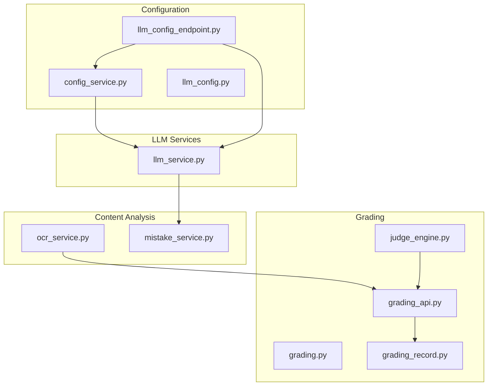
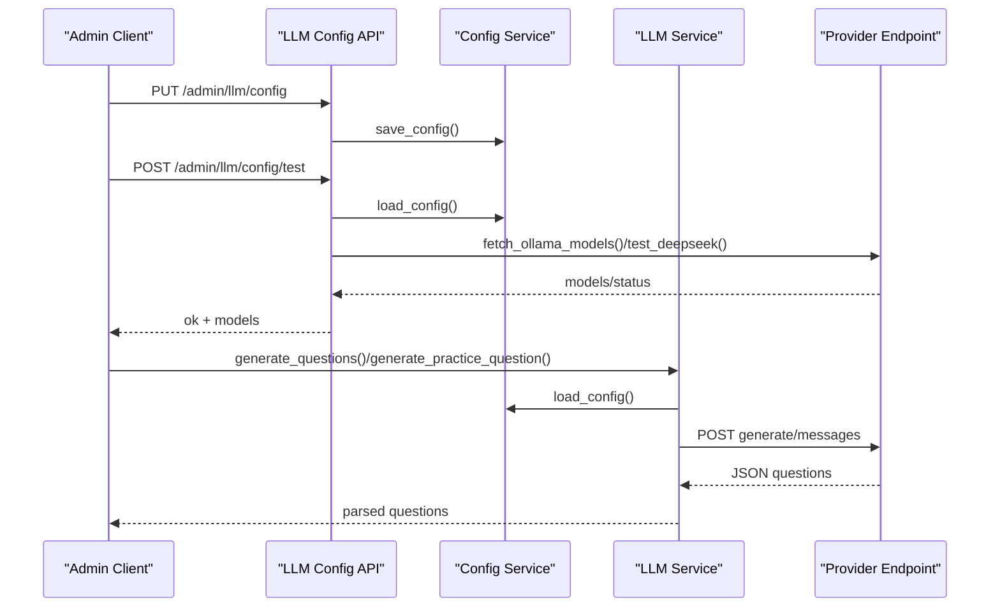
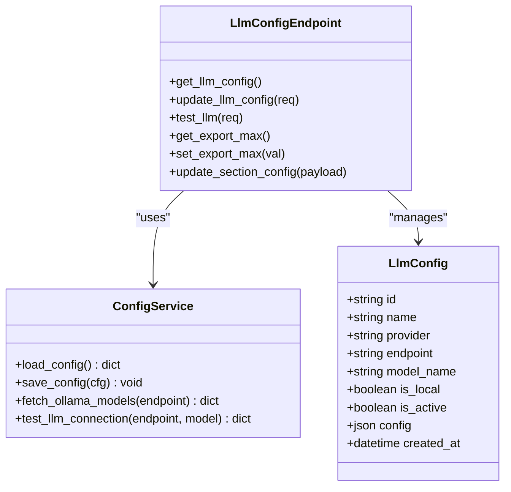
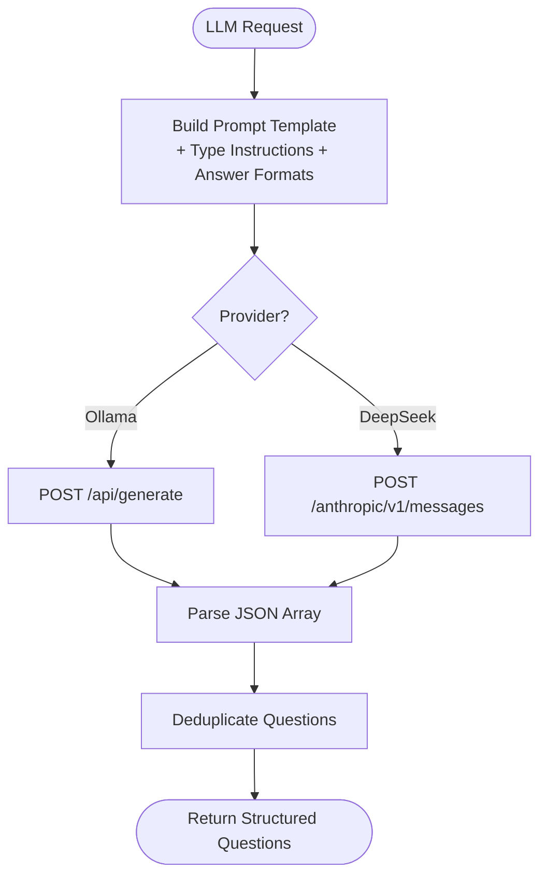
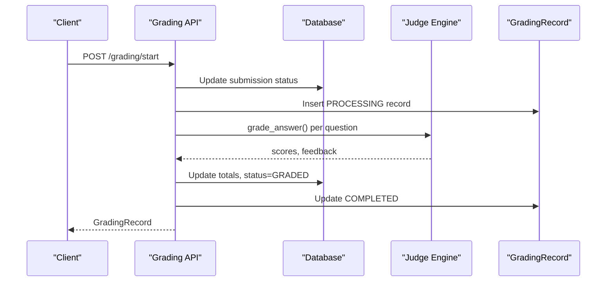
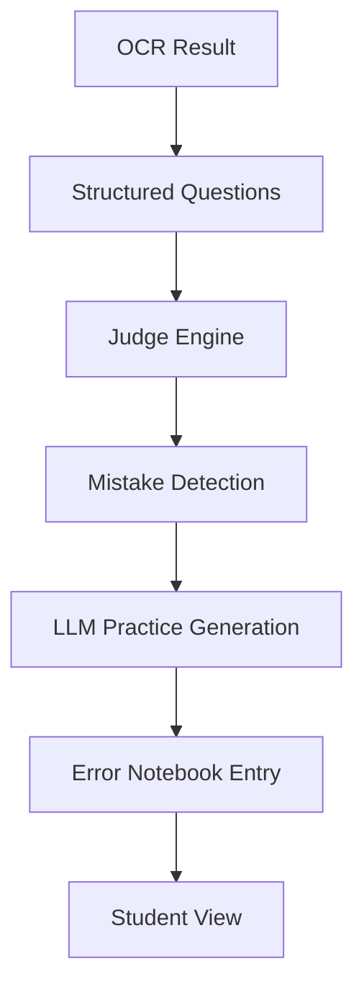
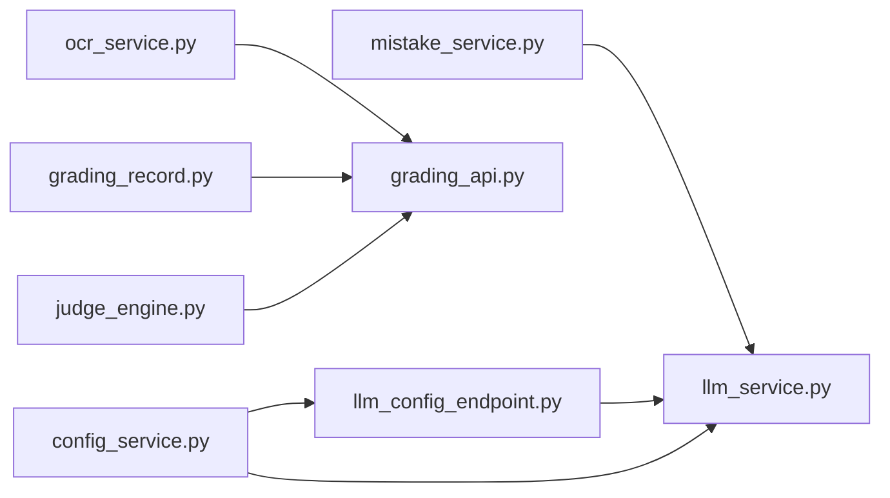

# LLM Service Integration

<cite>
**Referenced Files in This Document**
- [llm_service.py](file://backend/app/services/llm_service.py)
- [llm_config.py](file://backend/app/models/llm_config.py)
- [llm_config_endpoint.py](file://backend/app/api/v1/endpoints/llm_config.py)
- [config_service.py](file://backend/app/services/config_service.py)
- [grading.py](file://backend/app/schemas/grading.py)
- [grading_record.py](file://backend/app/models/grading_record.py)
- [grading_api.py](file://backend/app/api/v1/endpoints/grading.py)
- [judge_engine.py](file://backend/app/services/judge_engine.py)
- [ocr_service.py](file://backend/app/services/ocr_service.py)
- [mistake_service.py](file://backend/app/services/mistake_service.py)
- [grading_implementation_plan.md](file://docs/grading-implementation-plan.md)
- [ocr_integration_plan.md](file://docs/ocr-integration-plan.md)
- [error_notebook_design.md](file://docs/error-notebook-design.md)
- [test_llm.py](file://backend/tests/test_llm.py)
</cite>

## Table of Contents
1. [Introduction](#introduction)
2. [Project Structure](#project-structure)
3. [Core Components](#core-components)
4. [Architecture Overview](#architecture-overview)
5. [Detailed Component Analysis](#detailed-component-analysis)
6. [Dependency Analysis](#dependency-analysis)
7. [Performance Considerations](#performance-considerations)
8. [Troubleshooting Guide](#troubleshooting-guide)
9. [Conclusion](#conclusion)
10. [Appendices](#appendices)

## Introduction
This document describes the LLM service integration for intelligent question generation, content analysis, and intelligent tutoring within the education platform. It covers configuration management, model selection, prompt engineering strategies, automated workflows, and the relationship between LLM services and the grading engine. It also documents provider-specific integration patterns, cost optimization strategies, custom prompt development guidelines, evaluation metrics, quality assurance processes, fallback mechanisms, and human review workflows.

## Project Structure
The LLM integration spans configuration, service layer, API endpoints, models, and supporting services for OCR and mistake book generation. The system supports local Ollama and external DeepSeek APIs, with dynamic configuration and testing endpoints.

**Diagram sources**
- [config_service.py:65-106](file://backend/app/services/config_service.py#L65-L106)
- [llm_config.py:8-20](file://backend/app/models/llm_config.py#L8-L20)
- [llm_config_endpoint.py:17-106](file://backend/app/api/v1/endpoints/llm_config.py#L17-L106)
- [llm_service.py:54-104](file://backend/app/services/llm_service.py#L54-L104)
- [judge_engine.py:126-130](file://backend/app/services/judge_engine.py#L126-L130)
- [grading.py:7-36](file://backend/app/schemas/grading.py#L7-L36)
- [grading_record.py:8-31](file://backend/app/models/grading_record.py#L8-L31)
- [grading_api.py:19-56](file://backend/app/api/v1/endpoints/grading.py#L19-L56)
- [ocr_service.py:61-126](file://backend/app/services/ocr_service.py#L61-L126)
- [mistake_service.py:13-76](file://backend/app/services/mistake_service.py#L13-L76)

**Section sources**
- [config_service.py:65-106](file://backend/app/services/config_service.py#L65-L106)
- [llm_config_endpoint.py:17-106](file://backend/app/api/v1/endpoints/llm_config.py#L17-L106)
- [llm_service.py:54-104](file://backend/app/services/llm_service.py#L54-L104)
- [grading_api.py:19-56](file://backend/app/api/v1/endpoints/grading.py#L19-L56)

## Core Components
- LLM configuration model and API: manage provider selection, endpoints, models, and test connectivity.
- LLM service: orchestrates question generation and practice question generation with provider-specific integrations.
- Configuration service: loads defaults, injects secrets, persists configuration safely.
- Grading integration: records grading outcomes and status; current rule-based engine; future LLM semantic scoring.
- Content analysis pipeline: OCR service for scanned answer sheets; mistake book service for targeted practice.
- Tests and documentation: integration tests and design plans for grading and OCR.

**Section sources**
- [llm_config.py:8-20](file://backend/app/models/llm_config.py#L8-L20)
- [llm_config_endpoint.py:17-106](file://backend/app/api/v1/endpoints/llm_config.py#L17-L106)
- [llm_service.py:54-104](file://backend/app/services/llm_service.py#L54-L104)
- [config_service.py:65-106](file://backend/app/services/config_service.py#L65-L106)
- [grading_api.py:19-56](file://backend/app/api/v1/endpoints/grading.py#L19-L56)
- [ocr_service.py:61-126](file://backend/app/services/ocr_service.py#L61-L126)
- [mistake_service.py:13-76](file://backend/app/services/mistake_service.py#L13-L76)

## Architecture Overview
The LLM integration is layered:
- Configuration layer: persistent settings and runtime secret injection.
- API layer: admin endpoints to configure providers, test connections, and export/import limits.
- Service layer: provider-agnostic orchestration of question generation and practice question generation.
- Grading layer: rule-based engine with audit trail; future semantic scoring via LLM.
- Content analysis layer: OCR for scanned answer sheets and mistake book generation for targeted practice.

**Diagram sources**
- [llm_config_endpoint.py:28-106](file://backend/app/api/v1/endpoints/llm_config.py#L28-L106)
- [config_service.py:65-106](file://backend/app/services/config_service.py#L65-L106)
- [llm_service.py:54-104](file://backend/app/services/llm_service.py#L54-L104)

## Detailed Component Analysis

### LLM Configuration Management
- Model: stores provider, endpoint, model name, locality, activity, and arbitrary config.
- API: get/update configuration, test provider connectivity, export/import limits, and section configuration.
- Secret handling: DeepSeek API key injected from environment variable; never persisted.

**Diagram sources**
- [llm_config.py:8-20](file://backend/app/models/llm_config.py#L8-L20)
- [llm_config_endpoint.py:17-176](file://backend/app/api/v1/endpoints/llm_config.py#L17-L176)
- [config_service.py:65-155](file://backend/app/services/config_service.py#L65-L155)

**Section sources**
- [llm_config.py:8-20](file://backend/app/models/llm_config.py#L8-L20)
- [llm_config_endpoint.py:17-176](file://backend/app/api/v1/endpoints/llm_config.py#L17-L176)
- [config_service.py:65-106](file://backend/app/services/config_service.py#L65-L106)

### Provider Integrations and Prompt Engineering
- Supported providers: Ollama (local) and DeepSeek (Anthropic-compatible messages API).
- Prompt templates: strict JSON array output requirements, per-type answer formats, and instruction sets.
- Practice prompt: generates variant practice questions aligned to error type and knowledge focus.
- Parsing: robust extraction of JSON arrays from LLM responses, including fenced code blocks.

**Diagram sources**
- [llm_service.py:54-104](file://backend/app/services/llm_service.py#L54-L104)
- [llm_service.py:106-129](file://backend/app/services/llm_service.py#L106-L129)
- [llm_service.py:132-179](file://backend/app/services/llm_service.py#L132-L179)
- [llm_service.py:194-224](file://backend/app/services/llm_service.py#L194-L224)
- [llm_service.py:227-285](file://backend/app/services/llm_service.py#L227-L285)
- [llm_service.py:320-350](file://backend/app/services/llm_service.py#L320-L350)

**Section sources**
- [llm_service.py:54-104](file://backend/app/services/llm_service.py#L54-L104)
- [llm_service.py:106-129](file://backend/app/services/llm_service.py#L106-L129)
- [llm_service.py:132-179](file://backend/app/services/llm_service.py#L132-L179)
- [llm_service.py:194-285](file://backend/app/services/llm_service.py#L194-L285)
- [llm_service.py:320-350](file://backend/app/services/llm_service.py#L320-L350)

### Automated Grading Workflows and Audit Trail
- Current state: rule-based grading engine with audit records.
- API: start grading, check status, get results, history queries, and model management.
- Future state: LLM semantic scoring for subjective questions behind a feature flag.

**Diagram sources**
- [grading_api.py:19-56](file://backend/app/api/v1/endpoints/grading.py#L19-L56)
- [judge_engine.py:126-130](file://backend/app/services/judge_engine.py#L126-L130)
- [grading_record.py:8-31](file://backend/app/models/grading_record.py#L8-L31)

**Section sources**
- [grading_api.py:19-56](file://backend/app/api/v1/endpoints/grading.py#L19-L56)
- [judge_engine.py:126-130](file://backend/app/services/judge_engine.py#L126-L130)
- [grading_record.py:8-31](file://backend/app/models/grading_record.py#L8-L31)
- [grading_implementation_plan.md:143-177](file://docs/grading-implementation-plan.md#L143-L177)

### Intelligent Tutoring System Features
- Mistake book generation: collects incorrect answers, deduplicates by question, and creates error notebooks.
- Practice question generation: leverages LLM to produce variant problems aligned to error type and knowledge focus.
- Integration: OCR feeds structured questions; mistakes trigger LLM practice generation.

**Diagram sources**
- [ocr_service.py:61-126](file://backend/app/services/ocr_service.py#L61-L126)
- [judge_engine.py:126-130](file://backend/app/services/judge_engine.py#L126-L130)
- [mistake_service.py:13-76](file://backend/app/services/mistake_service.py#L13-L76)
- [llm_service.py:227-285](file://backend/app/services/llm_service.py#L227-L285)

**Section sources**
- [ocr_service.py:61-126](file://backend/app/services/ocr_service.py#L61-L126)
- [mistake_service.py:13-76](file://backend/app/services/mistake_service.py#L13-L76)
- [llm_service.py:227-285](file://backend/app/services/llm_service.py#L227-L285)
- [error_notebook_design.md:15-29](file://docs/error-notebook-design.md#L15-L29)

## Dependency Analysis
- Configuration service centralizes defaults and secret injection; LLM config endpoints depend on it for persistence and testing.
- LLM service depends on configuration for provider selection and model parameters; it parses provider-specific responses.
- Grading API depends on judge engine and maintains audit records; future LLM grading will integrate similarly.
- OCR and mistake services feed into grading workflows; OCR status influences human review routing.

**Diagram sources**
- [config_service.py:65-106](file://backend/app/services/config_service.py#L65-L106)
- [llm_config_endpoint.py:28-106](file://backend/app/api/v1/endpoints/llm_config.py#L28-L106)
- [llm_service.py:54-104](file://backend/app/services/llm_service.py#L54-L104)
- [judge_engine.py:126-130](file://backend/app/services/judge_engine.py#L126-L130)
- [grading_api.py:19-56](file://backend/app/api/v1/endpoints/grading.py#L19-L56)
- [grading_record.py:8-31](file://backend/app/models/grading_record.py#L8-L31)
- [ocr_service.py:61-126](file://backend/app/services/ocr_service.py#L61-L126)
- [mistake_service.py:13-76](file://backend/app/services/mistake_service.py#L13-L76)

**Section sources**
- [config_service.py:65-106](file://backend/app/services/config_service.py#L65-L106)
- [llm_config_endpoint.py:28-106](file://backend/app/api/v1/endpoints/llm_config.py#L28-L106)
- [llm_service.py:54-104](file://backend/app/services/llm_service.py#L54-L104)
- [grading_api.py:19-56](file://backend/app/api/v1/endpoints/grading.py#L19-L56)
- [ocr_service.py:61-126](file://backend/app/services/ocr_service.py#L61-L126)
- [mistake_service.py:13-76](file://backend/app/services/mistake_service.py#L13-L76)

## Performance Considerations
- Timeout tuning: HTTP client timeouts configured for provider calls; adjust based on model loading and response characteristics.
- Model warm-up: test connection endpoint triggers model loading; schedule periodic warm-ups for frequently used models.
- Cost optimization:
  - Prefer local Ollama for internal workloads to reduce API costs.
  - Use smaller models for practice question generation; reserve larger models for specialized tasks.
  - Batch requests where feasible; avoid unnecessary retries.
- Throughput:
  - Limit concurrent requests per provider endpoint.
  - Use asynchronous clients for provider calls.
- Reliability:
  - Implement retry with exponential backoff for transient failures.
  - Monitor provider rate limits and queue requests accordingly.

[No sources needed since this section provides general guidance]

## Troubleshooting Guide
- Provider connectivity:
  - Use the test endpoint to validate Ollama models and DeepSeek API keys.
  - For Ollama, confirm endpoint and model availability; for DeepSeek, verify API key presence and network access.
- Response parsing:
  - LLM responses are parsed for JSON arrays; ensure prompts enforce strict JSON output to minimize parsing errors.
- Configuration persistence:
  - Secrets are injected at runtime; verify environment variables for DeepSeek API key.
- Human review workflows:
  - OCR low-confidence results route to NEEDS_REVIEW; ensure manual review processes are triggered and tracked.

**Section sources**
- [llm_config_endpoint.py:61-106](file://backend/app/api/v1/endpoints/llm_config.py#L61-L106)
- [config_service.py:108-155](file://backend/app/services/config_service.py#L108-L155)
- [llm_service.py:320-350](file://backend/app/services/llm_service.py#L320-L350)
- [ocr_integration_plan.md:17-31](file://docs/ocr-integration-plan.md#L17-L31)

## Conclusion
The LLM integration provides flexible configuration for local and hosted providers, robust prompt engineering for question generation and practice, and clear pathways to extend the grading engine with semantic scoring. The system’s modular design enables provider switching, secure secret handling, and scalable content analysis workflows, while maintaining auditability and human review capabilities.

[No sources needed since this section summarizes without analyzing specific files]

## Appendices

### Configuration Examples and Best Practices
- Local Ollama:
  - Set endpoint and model; use test endpoint to discover available models and validate connectivity.
- DeepSeek:
  - Configure API key via environment variable; set endpoint and model; test connectivity using the dedicated endpoint.
- Prompt engineering:
  - Enforce strict JSON output; define per-type answer formats; include clear instructions and constraints.
- Cost optimization:
  - Prefer local inference for routine tasks; use hosted APIs for specialized reasoning; monitor latency and throughput.

**Section sources**
- [llm_config_endpoint.py:28-106](file://backend/app/api/v1/endpoints/llm_config.py#L28-L106)
- [config_service.py:31-44](file://backend/app/services/config_service.py#L31-L44)
- [llm_service.py:7-52](file://backend/app/services/llm_service.py#L7-L52)

### Evaluation Metrics and Quality Assurance
- Metrics:
  - Question uniqueness after deduplication.
  - Prompt adherence (strict JSON output compliance).
  - Human review rate for OCR and LLM-generated content.
- QA:
  - Unit tests for prompt building and response parsing.
  - Integration tests for provider configuration and connectivity.
  - Manual validation of practice question relevance and difficulty alignment.

**Section sources**
- [llm_service.py:182-191](file://backend/app/services/llm_service.py#L182-L191)
- [llm_service.py:320-350](file://backend/app/services/llm_service.py#L320-L350)
- [test_llm.py:10-23](file://backend/tests/test_llm.py#L10-L23)

### Relationship Between LLM Services and Grading Engine
- Current: rule-based grading with audit trail; LLM used for question generation and practice.
- Future: semantic scoring for subjective questions behind a feature flag; maintain rule-based fallback.
- Fallback and human review:
  - Low-confidence OCR routes to human review.
  - LLM parsing failures fall back to manual review or retry with adjusted prompts.

**Section sources**
- [grading_api.py:19-56](file://backend/app/api/v1/endpoints/grading.py#L19-L56)
- [judge_engine.py:126-130](file://backend/app/services/judge_engine.py#L126-L130)
- [grading_implementation_plan.md:143-177](file://docs/grading-implementation-plan.md#L143-L177)
- [ocr_integration_plan.md:17-31](file://docs/ocr-integration-plan.md#L17-L31)