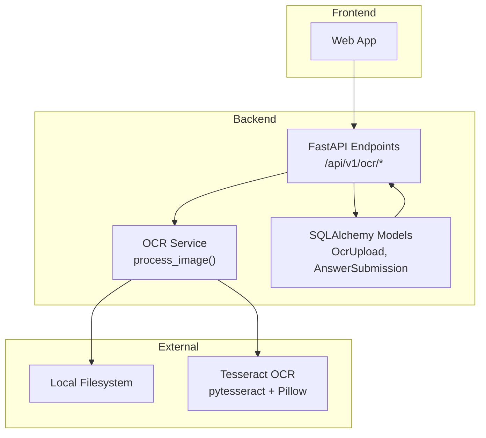
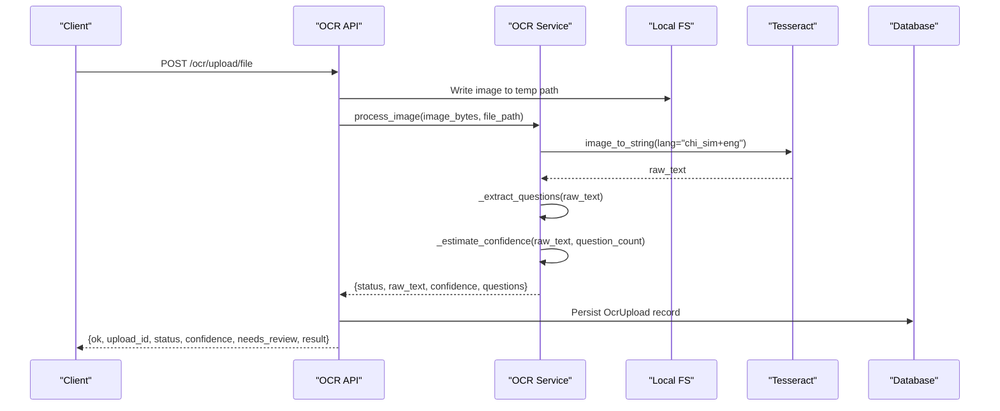
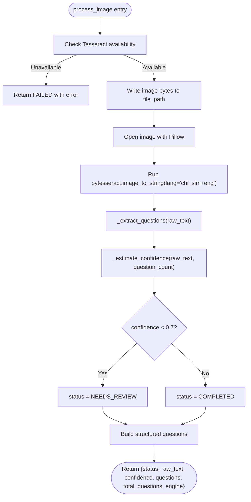
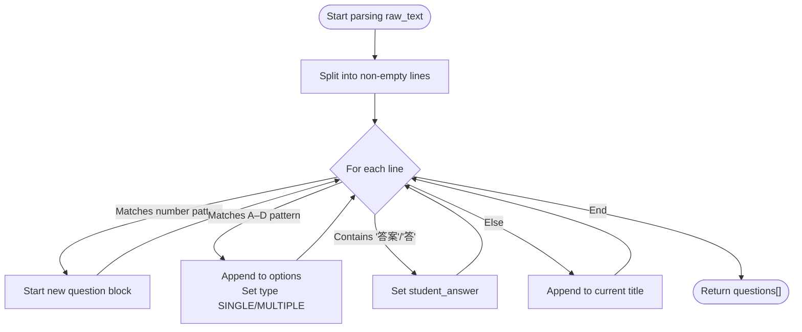
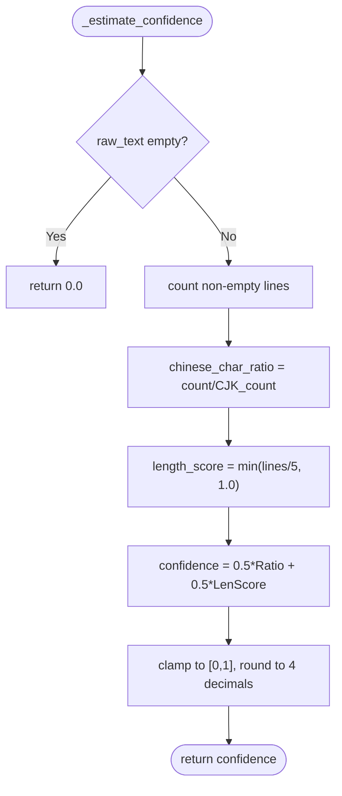
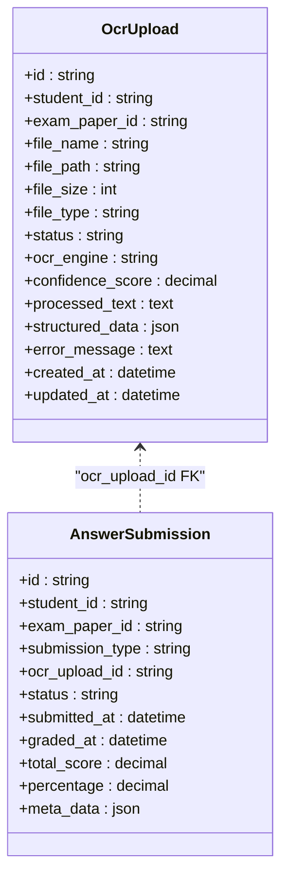
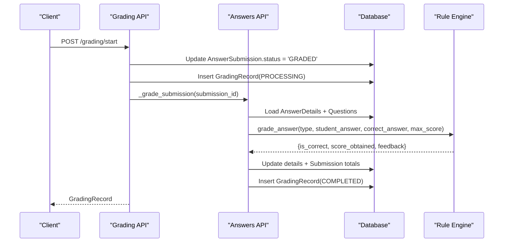
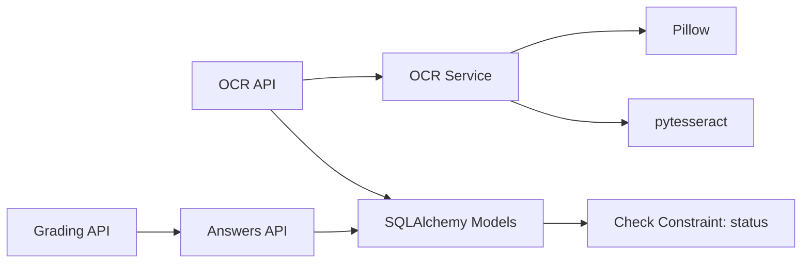

# OCR Engine Integration

<cite>
**Referenced Files in This Document**
- [ocr_service.py](file://backend/app/services/ocr_service.py)
- [ocr.py](file://backend/app/api/v1/endpoints/ocr.py)
- [ocr.py](file://backend/app/schemas/ocr.py)
- [ocr_upload.py](file://backend/app/models/ocr_upload.py)
- [grading.py](file://backend/app/api/v1/endpoints/grading.py)
- [answers.py](file://backend/app/api/v1/endpoints/answers.py)
- [answer_submission.py](file://backend/app/models/answer_submission.py)
- [config.py](file://backend/app/core/config.py)
- [005_add_ocr_needs_review_status.py](file://backend/alembic/versions/005_add_ocr_needs_review_status.py)
- [ocr-integration-plan.md](file://docs/ocr-integration-plan.md)
</cite>

## Table of Contents
1. [Introduction](#introduction)
2. [Project Structure](#project-structure)
3. [Core Components](#core-components)
4. [Architecture Overview](#architecture-overview)
5. [Detailed Component Analysis](#detailed-component-analysis)
6. [Dependency Analysis](#dependency-analysis)
7. [Performance Considerations](#performance-considerations)
8. [Troubleshooting Guide](#troubleshooting-guide)
9. [Conclusion](#conclusion)
10. [Appendices](#appendices)

## Introduction
This document describes the OCR engine integration for answer sheet processing, focusing on the Tesseract OCR implementation currently used in the system. It covers the OCR service architecture, the image preprocessing pipeline, the text recognition workflow, the question extraction algorithm, the confidence scoring mechanism, and the heuristic parsing for different question types. It also documents configuration options for Tesseract languages, image processing parameters, threshold settings, structured output formats, confidence estimation methods, error handling strategies, and integration with the grading system. Manual review processes for low-confidence results are included.

## Project Structure
The OCR integration spans three layers:
- API layer: FastAPI endpoints for uploading images, retrieving status/results, and managing OCR configurations.
- Service layer: OCR processing logic using Tesseract via pytesseract and Pillow.
- Persistence layer: SQLAlchemy models and Alembic migrations for storing OCR records and statuses.

**Diagram sources**
- [ocr.py:18-64](file://backend/app/api/v1/endpoints/ocr.py#L18-L64)
- [ocr_service.py:61-125](file://backend/app/services/ocr_service.py#L61-L125)
- [ocr_upload.py:8-36](file://backend/app/models/ocr_upload.py#L8-L36)

**Section sources**
- [ocr.py:18-64](file://backend/app/api/v1/endpoints/ocr.py#L18-L64)
- [ocr_service.py:61-125](file://backend/app/services/ocr_service.py#L61-L125)
- [ocr_upload.py:8-36](file://backend/app/models/ocr_upload.py#L8-L36)

## Core Components
- OCR Service: Implements Tesseract-based image-to-text conversion, question extraction, and confidence estimation. It returns a structured result with status, raw text, confidence, and parsed questions.
- API Endpoints: Provide upload, status, result retrieval, and configuration endpoints for OCR. They enforce user roles and persist OCR records.
- Data Models: Define the persistence schema for OCR uploads and integrate with answer submissions for grading.
- Grading Integration: The grading system consumes structured answers produced by OCR and applies rule-based scoring.

Key responsibilities:
- Image ingestion and temporary storage
- Tesseract OCR invocation with multilingual language packs
- Structured question extraction and type detection
- Confidence scoring and status assignment
- Persistence of OCR results and downstream integration

**Section sources**
- [ocr_service.py:20-125](file://backend/app/services/ocr_service.py#L20-L125)
- [ocr.py:18-64](file://backend/app/api/v1/endpoints/ocr.py#L18-L64)
- [ocr_upload.py:8-36](file://backend/app/models/ocr_upload.py#L8-L36)
- [answers.py:24-112](file://backend/app/api/v1/endpoints/answers.py#L24-L112)

## Architecture Overview
The OCR pipeline follows a synchronous request-response flow for uploaded images. The system saves the image temporarily, runs Tesseract OCR, parses the text into structured questions, estimates confidence, assigns a status, and persists the result. Low-confidence results are flagged for manual review before grading.

**Diagram sources**
- [ocr.py:18-64](file://backend/app/api/v1/endpoints/ocr.py#L18-L64)
- [ocr_service.py:61-125](file://backend/app/services/ocr_service.py#L61-L125)
- [ocr_upload.py:8-36](file://backend/app/models/ocr_upload.py#L8-L36)

## Detailed Component Analysis

### OCR Service: Tesseract Integration
The OCR service encapsulates:
- Availability check for Tesseract libraries
- Image saving to disk
- Tesseract invocation with multilingual language packs
- Question extraction via heuristic rules
- Confidence estimation based on text characteristics
- Structured output assembly and status determination

**Diagram sources**
- [ocr_service.py:61-125](file://backend/app/services/ocr_service.py#L61-L125)

**Section sources**
- [ocr_service.py:61-125](file://backend/app/services/ocr_service.py#L61-L125)

### Question Extraction Algorithm
The algorithm parses OCR raw text into structured questions using heuristics:
- Question detection: Lines matching numbered patterns (e.g., 1., (1), 1、) start a new question block.
- Option detection: Lines starting with A–D markers indicate options; SINGLE_CHOICE vs MULTIPLE_CHOICE determined by option count.
- Answer extraction: Lines containing “答案” or “答” are treated as student answers; the text after colon separators is captured.
- Title concatenation: Non-matching lines are appended to the current question’s title.

**Diagram sources**
- [ocr_service.py:20-42](file://backend/app/services/ocr_service.py#L20-L42)

**Section sources**
- [ocr_service.py:20-42](file://backend/app/services/ocr_service.py#L20-L42)

### Confidence Scoring Mechanism
Confidence is estimated using two heuristics combined equally:
- Chinese character ratio: Proportion of CJK Unified Ideographs in the text.
- Line count penalty: Normalized count of non-empty lines to penalize very short outputs.

Final confidence is clamped to [0, 1] and rounded to four decimals. If raw text is empty, confidence is 0.0.

**Diagram sources**
- [ocr_service.py:45-58](file://backend/app/services/ocr_service.py#L45-L58)

**Section sources**
- [ocr_service.py:45-58](file://backend/app/services/ocr_service.py#L45-L58)

### API Endpoints and Data Models
- Upload endpoint accepts multipart/form-data, validates user role, saves image, invokes OCR service, persists an OcrUpload record, and returns status and result metadata.
- Status/result endpoints enforce ownership or admin privileges.
- Data models define OcrUpload with a constrained status set including NEEDS_REVIEW and AnswerSubmission linking to OCR results for grading.

**Diagram sources**
- [ocr_upload.py:8-36](file://backend/app/models/ocr_upload.py#L8-L36)
- [answer_submission.py:9-36](file://backend/app/models/answer_submission.py#L9-L36)

**Section sources**
- [ocr.py:18-64](file://backend/app/api/v1/endpoints/ocr.py#L18-L64)
- [ocr.py:7-48](file://backend/app/schemas/ocr.py#L7-L48)
- [ocr_upload.py:8-36](file://backend/app/models/ocr_upload.py#L8-L36)
- [answer_submission.py:9-36](file://backend/app/models/answer_submission.py#L9-L36)

### Integration with Grading System
After OCR, the system transitions to grading:
- The grading endpoint starts a grading record, marks the submission as GRADED, and triggers the internal grading routine.
- The grading routine computes scores per question using a rule engine, aggregates totals, and writes a grading record.

**Diagram sources**
- [grading.py:19-55](file://backend/app/api/v1/endpoints/grading.py#L19-L55)
- [answers.py:24-112](file://backend/app/api/v1/endpoints/answers.py#L24-L112)

**Section sources**
- [grading.py:19-55](file://backend/app/api/v1/endpoints/grading.py#L19-L55)
- [answers.py:24-112](file://backend/app/api/v1/endpoints/answers.py#L24-L112)

## Dependency Analysis
- Internal dependencies:
  - API depends on OCR service and SQLAlchemy models.
  - OCR service depends on Pillow and pytesseract.
  - Grading depends on rule engine and answer details.
- External dependencies:
  - Tesseract runtime and language packs.
  - Local filesystem for temporary image storage.
- Constraints:
  - OcrUpload.status is constrained to a fixed set including NEEDS_REVIEW.
  - AnswerSubmission.status is constrained to GRADED/GENERATED/RE_GRADED.

**Diagram sources**
- [ocr.py:18-64](file://backend/app/api/v1/endpoints/ocr.py#L18-L64)
- [ocr_service.py:9-14](file://backend/app/services/ocr_service.py#L9-L14)
- [ocr_upload.py:30-32](file://backend/app/models/ocr_upload.py#L30-L32)
- [grading.py:19-55](file://backend/app/api/v1/endpoints/grading.py#L19-L55)
- [answers.py:24-112](file://backend/app/api/v1/endpoints/answers.py#L24-L112)

**Section sources**
- [ocr_service.py:9-14](file://backend/app/services/ocr_service.py#L9-L14)
- [ocr_upload.py:30-32](file://backend/app/models/ocr_upload.py#L30-L32)
- [005_add_ocr_needs_review_status.py:16-23](file://backend/alembic/versions/005_add_ocr_needs_review_status.py#L16-L23)

## Performance Considerations
- Synchronous processing: OCR runs synchronously, which can block requests on large images. Consider asynchronous processing with a task queue in future iterations.
- Language packs: Using multilingual language packs increases accuracy but may increase processing time. Keep only necessary languages installed.
- File I/O: Temporary file writes occur on local disk. For high throughput, consider optimizing I/O or migrating to object storage in later phases.
- Confidence threshold tuning: The current threshold is 0.7. Adjusting this threshold affects the balance between automation and manual review workload.

[No sources needed since this section provides general guidance]

## Troubleshooting Guide
Common issues and resolutions:
- Tesseract not available: The service checks for library availability and returns a FAILED status with installation guidance. Ensure system-level Tesseract and Python packages are installed.
- OCR errors during image processing: Exceptions during image opening or OCR invocation are caught and returned as FAILED with error details.
- Permission errors: Upload and result endpoints enforce user roles and ownership; ensure clients use appropriate credentials.
- Status constraints: OcrUpload.status is validated against a constrained set; verify migrations are applied to include NEEDS_REVIEW.

Operational tips:
- Verify language packs are installed on the host system.
- Monitor logs for OCR exceptions and retry failed uploads.
- Use the NEEDS_REVIEW status to route low-confidence results to manual verification.

**Section sources**
- [ocr_service.py:71-96](file://backend/app/services/ocr_service.py#L71-L96)
- [ocr.py:26-27](file://backend/app/api/v1/endpoints/ocr.py#L26-L27)
- [ocr.py:106-111](file://backend/app/api/v1/endpoints/ocr.py#L106-L111)
- [ocr_upload.py:30-32](file://backend/app/models/ocr_upload.py#L30-L32)
- [005_add_ocr_needs_review_status.py:16-23](file://backend/alembic/versions/005_add_ocr_needs_review_status.py#L16-L23)

## Conclusion
The current OCR integration leverages Tesseract with a robust preprocessing pipeline, structured question extraction, and a confidence scoring mechanism. It integrates tightly with the grading system and supports a manual review workflow for low-confidence results. Future enhancements outlined in the project plan include migrating to PaddleOCR, object storage, and asynchronous processing to improve accuracy, scalability, and throughput.

[No sources needed since this section summarizes without analyzing specific files]

## Appendices

### Configuration Options
- Environment-driven settings:
  - OCR_ENGINE: Select OCR backend (e.g., paddleocr or tesseract).
  - OCR_LANG: Language preference for OCR.
- Runtime thresholds:
  - Confidence threshold: 0.7 determines NEEDS_REVIEW vs COMPLETED.
- Frontend configuration:
  - Admin UI exposes OCR engine selection, concurrency, and confidence threshold controls.

**Section sources**
- [config.py:81-84](file://backend/app/core/config.py#L81-L84)
- [ocr.py:239-250](file://backend/app/api/v1/endpoints/ocr.py#L239-L250)
- [ocr-integration-plan.md:240-249](file://docs/ocr-integration-plan.md#L240-L249)

### Structured Output Format
The OCR service returns a dictionary with:
- status: One of PENDING, PROCESSING, COMPLETED, FAILED, NEEDS_REVIEW.
- raw_text: Full OCR text.
- confidence: Confidence score in [0, 1].
- questions: Array of question entries with index, title, type, student_answer, options, and correct placeholder.
- total_questions: Count of extracted questions.
- engine: Identifier of the OCR engine used.

**Section sources**
- [ocr_service.py:104-125](file://backend/app/services/ocr_service.py#L104-L125)

### Manual Review Processes
- Low-confidence results (confidence < 0.7) are marked NEEDS_REVIEW.
- Administrators and teachers can manage these records; students can view their own OCR uploads and results.
- After manual review, results can be edited and submitted for grading.

**Section sources**
- [ocr_service.py:17-102](file://backend/app/services/ocr_service.py#L17-L102)
- [ocr.py:106-135](file://backend/app/api/v1/endpoints/ocr.py#L106-L135)
- [ocr_upload.py:18-22](file://backend/app/models/ocr_upload.py#L18-L22)