# Plugin & Extension Architecture

<cite>
**Referenced Files in This Document**
- [backend/app/main.py](file://backend/app/main.py)
- [backend/app/core/config.py](file://backend/app/core/config.py)
- [backend/app/api/v1/api.py](file://backend/app/api/v1/api.py)
- [backend/app/api/v1/endpoints/llm_config.py](file://backend/app/api/v1/endpoints/llm_config.py)
- [backend/app/api/v1/endpoints/grading.py](file://backend/app/api/v1/endpoints/grading.py)
- [backend/app/api/v1/endpoints/questions.py](file://backend/app/api/v1/endpoints/questions.py)
- [backend/app/services/config_service.py](file://backend/app/services/config_service.py)
- [backend/app/services/llm_service.py](file://backend/app/services/llm_service.py)
- [backend/app/services/scraper.py](file://backend/app/services/scraper.py)
- [backend/app/services/judge_engine.py](file://backend/app/services/judge_engine.py)
- [backend/app/services/dedup_service.py](file://backend/app/services/dedup_service.py)
- [backend/app/services/mistake_service.py](file://backend/app/services/mistake_service.py)
- [backend/app/services/storage.py](file://backend/app/services/storage.py)
- [backend/app/db/session.py](file://backend/app/db/session.py)
- [backend/sysconfig.json](file://backend/sysconfig.json)
</cite>

## Table of Contents
1. [Introduction](#introduction)
2. [Project Structure](#project-structure)
3. [Core Components](#core-components)
4. [Architecture Overview](#architecture-overview)
5. [Detailed Component Analysis](#detailed-component-analysis)
6. [Dependency Analysis](#dependency-analysis)
7. [Performance Considerations](#performance-considerations)
8. [Troubleshooting Guide](#troubleshooting-guide)
9. [Conclusion](#conclusion)
10. [Appendices](#appendices)

## Introduction
This document describes the plugin and extension architecture of the educational system backend. It focuses on:
- Extensibility mechanisms and service registration patterns
- Service discovery and configuration management
- Dependency injection and lifecycle management
- How to develop custom services, integrate third-party APIs, and extend existing functionality
- Practical examples for custom deduplication services, scraping integrations, and grading engines
- Error handling strategies and performance optimization techniques for extensible systems

The backend is built with FastAPI, uses SQLAlchemy async sessions, and exposes modular API endpoints grouped under a central router. Configuration is managed via a JSON file with environment variable overrides for secrets, enabling flexible deployment and extension.

## Project Structure
The backend follows a layered, feature-based organization:
- Application entrypoint initializes FastAPI, middleware, and registers routers
- Core configuration loads system settings and environment overrides
- API v1 organizes endpoints by feature areas
- Services encapsulate domain logic and external integrations
- Database session factory provides dependency-injected async sessions
- Configuration service manages persistent settings and runtime connections

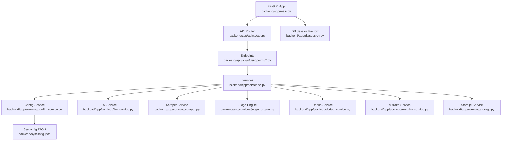

**Diagram sources**
- [backend/app/main.py:1-52](file://backend/app/main.py#L1-L52)
- [backend/app/api/v1/api.py:1-26](file://backend/app/api/v1/api.py#L1-L26)
- [backend/app/services/config_service.py:1-155](file://backend/app/services/config_service.py#L1-L155)
- [backend/app/services/llm_service.py:1-350](file://backend/app/services/llm_service.py#L1-L350)
- [backend/app/services/scraper.py:1-272](file://backend/app/services/scraper.py#L1-L272)
- [backend/app/services/judge_engine.py:1-130](file://backend/app/services/judge_engine.py#L1-L130)
- [backend/app/services/dedup_service.py:1-127](file://backend/app/services/dedup_service.py#L1-L127)
- [backend/app/services/mistake_service.py:1-114](file://backend/app/services/mistake_service.py#L1-L114)
- [backend/app/services/storage.py:1-55](file://backend/app/services/storage.py#L1-L55)
- [backend/app/db/session.py:1-26](file://backend/app/db/session.py#L1-L26)
- [backend/sysconfig.json:1-48](file://backend/sysconfig.json#L1-L48)

**Section sources**
- [backend/app/main.py:1-52](file://backend/app/main.py#L1-L52)
- [backend/app/api/v1/api.py:1-26](file://backend/app/api/v1/api.py#L1-L26)
- [backend/app/core/config.py:1-98](file://backend/app/core/config.py#L1-L98)
- [backend/app/db/session.py:1-26](file://backend/app/db/session.py#L1-L26)
- [backend/sysconfig.json:1-48](file://backend/sysconfig.json#L1-L48)

## Core Components
- FastAPI Application and Middleware
  - Initializes the API with CORS and a unified response wrapper
  - Registers the API v1 router and sets up startup tasks
- Configuration Management
  - Centralized settings loader with environment overrides
  - Persistent configuration via sysconfig.json with secret stripping
- Service Layer
  - Modular services for LLM generation, scraping, grading, deduplication, mistakes, and storage
  - Configuration-driven service selection and runtime testing
- Database Session Factory
  - Async engine and session maker with dependency injection via FastAPI Depends
- API Endpoints
  - Feature-based routers registered centrally; each endpoint depends on injected services and database sessions

Key implementation patterns:
- Dependency Injection: Services are called directly from endpoints; database sessions are injected via Depends
- Configuration-driven behavior: Services read sysconfig.json and environment variables to adapt behavior
- Extensibility hooks: New services can be added by implementing functions/classes and registering them in the appropriate module

**Section sources**
- [backend/app/main.py:1-52](file://backend/app/main.py#L1-L52)
- [backend/app/core/config.py:1-98](file://backend/app/core/config.py#L1-L98)
- [backend/app/services/config_service.py:1-155](file://backend/app/services/config_service.py#L1-L155)
- [backend/app/db/session.py:1-26](file://backend/app/db/session.py#L1-L26)

## Architecture Overview
The system architecture centers around a modular service layer integrated through FastAPI endpoints. Configuration drives provider selection and runtime behavior. External integrations (LLM providers, OCR, storage) are abstracted behind service interfaces.

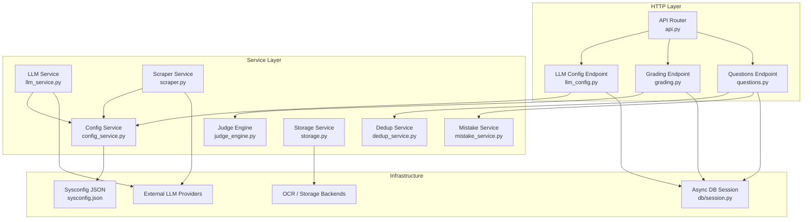

**Diagram sources**
- [backend/app/api/v1/api.py:1-26](file://backend/app/api/v1/api.py#L1-L26)
- [backend/app/api/v1/endpoints/llm_config.py:1-186](file://backend/app/api/v1/endpoints/llm_config.py#L1-L186)
- [backend/app/api/v1/endpoints/grading.py:1-143](file://backend/app/api/v1/endpoints/grading.py#L1-L143)
- [backend/app/api/v1/endpoints/questions.py:1-431](file://backend/app/api/v1/endpoints/questions.py#L1-L431)
- [backend/app/services/config_service.py:1-155](file://backend/app/services/config_service.py#L1-L155)
- [backend/app/services/llm_service.py:1-350](file://backend/app/services/llm_service.py#L1-L350)
- [backend/app/services/scraper.py:1-272](file://backend/app/services/scraper.py#L1-L272)
- [backend/app/services/judge_engine.py:1-130](file://backend/app/services/judge_engine.py#L1-L130)
- [backend/app/services/dedup_service.py:1-127](file://backend/app/services/dedup_service.py#L1-L127)
- [backend/app/services/mistake_service.py:1-114](file://backend/app/services/mistake_service.py#L1-L114)
- [backend/app/services/storage.py:1-55](file://backend/app/services/storage.py#L1-L55)
- [backend/app/db/session.py:1-26](file://backend/app/db/session.py#L1-L26)
- [backend/sysconfig.json:1-48](file://backend/sysconfig.json#L1-L48)

## Detailed Component Analysis

### Configuration Service and Sysconfig
The configuration service provides:
- Loading defaults from sysconfig.json with environment variable overrides for secrets
- Runtime testing and model discovery for LLM providers
- Safe persistence by stripping sensitive keys before writing

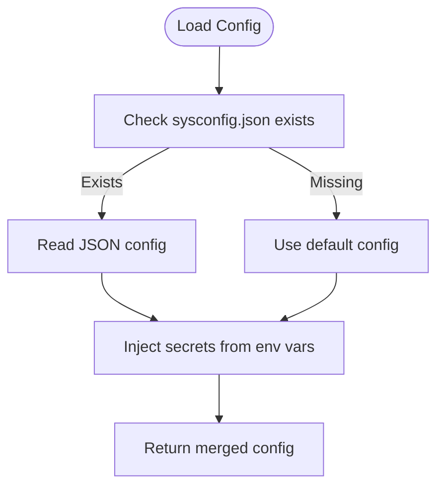

**Diagram sources**
- [backend/app/services/config_service.py:65-78](file://backend/app/services/config_service.py#L65-L78)

**Section sources**
- [backend/app/services/config_service.py:1-155](file://backend/app/services/config_service.py#L1-L155)
- [backend/app/core/config.py:1-98](file://backend/app/core/config.py#L1-L98)
- [backend/sysconfig.json:1-48](file://backend/sysconfig.json#L1-L48)

### LLM Service Integration
The LLM service supports:
- Prompt templating and type-specific answer formats
- Provider switching between Ollama and DeepSeek
- Response parsing and deduplication
- Practice question generation with provider-aware logic

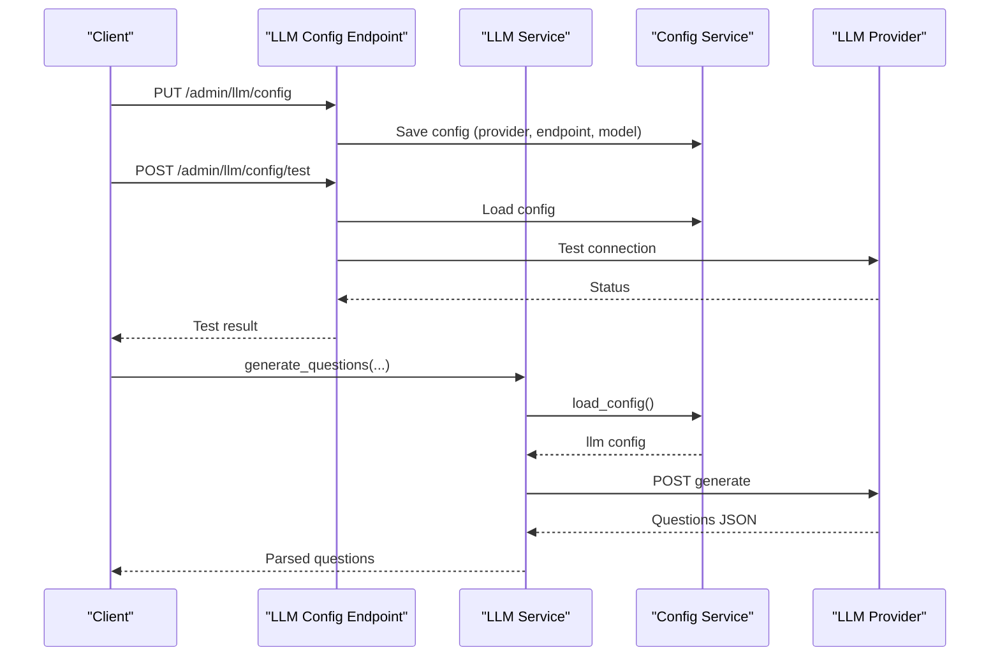

**Diagram sources**
- [backend/app/api/v1/endpoints/llm_config.py:28-105](file://backend/app/api/v1/endpoints/llm_config.py#L28-L105)
- [backend/app/services/llm_service.py:54-104](file://backend/app/services/llm_service.py#L54-L104)
- [backend/app/services/config_service.py:65-78](file://backend/app/services/config_service.py#L65-L78)

**Section sources**
- [backend/app/services/llm_service.py:1-350](file://backend/app/services/llm_service.py#L1-L350)
- [backend/app/api/v1/endpoints/llm_config.py:1-186](file://backend/app/api/v1/endpoints/llm_config.py#L1-L186)
- [backend/app/services/config_service.py:1-155](file://backend/app/services/config_service.py#L1-L155)

### Scraper Service Integration
The scraper service:
- Performs web search and extracts snippets
- Uses an LLM to format snippets into structured questions
- Supports configurable providers and robust parsing

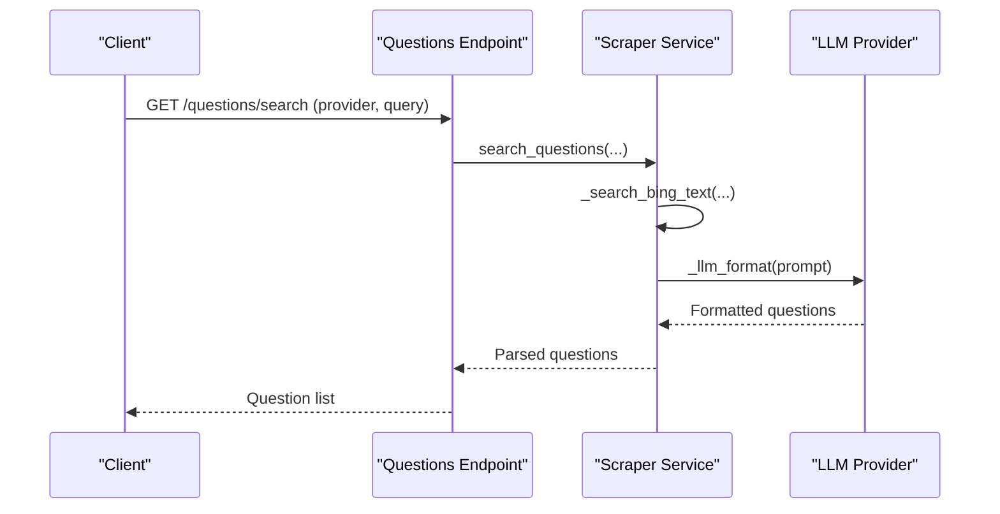

**Diagram sources**
- [backend/app/api/v1/endpoints/questions.py:39-104](file://backend/app/api/v1/endpoints/questions.py#L39-L104)
- [backend/app/services/scraper.py:11-60](file://backend/app/services/scraper.py#L11-L60)

**Section sources**
- [backend/app/services/scraper.py:1-272](file://backend/app/services/scraper.py#L1-L272)
- [backend/app/api/v1/endpoints/questions.py:1-431](file://backend/app/api/v1/endpoints/questions.py#L1-L431)

### Rule-Based Grading Engine
The grading engine:
- Provides per-type graders for single-choice, multiple-choice, fill-in-blank, and subjective
- Exposes a dispatcher that selects the appropriate grader based on question type
- Returns standardized grade results with feedback

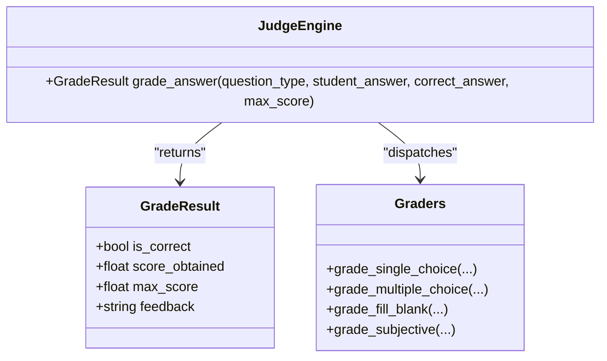

**Diagram sources**
- [backend/app/services/judge_engine.py:126-129](file://backend/app/services/judge_engine.py#L126-L129)

**Section sources**
- [backend/app/services/judge_engine.py:1-130](file://backend/app/services/judge_engine.py#L1-L130)
- [backend/app/api/v1/endpoints/grading.py:1-143](file://backend/app/api/v1/endpoints/grading.py#L1-L143)

### Deduplication Service
The deduplication service:
- Computes SimHash-based content fingerprints
- Groups exact duplicates and near-duplicates using Hamming distance
- Provides similarity computation and content hashing

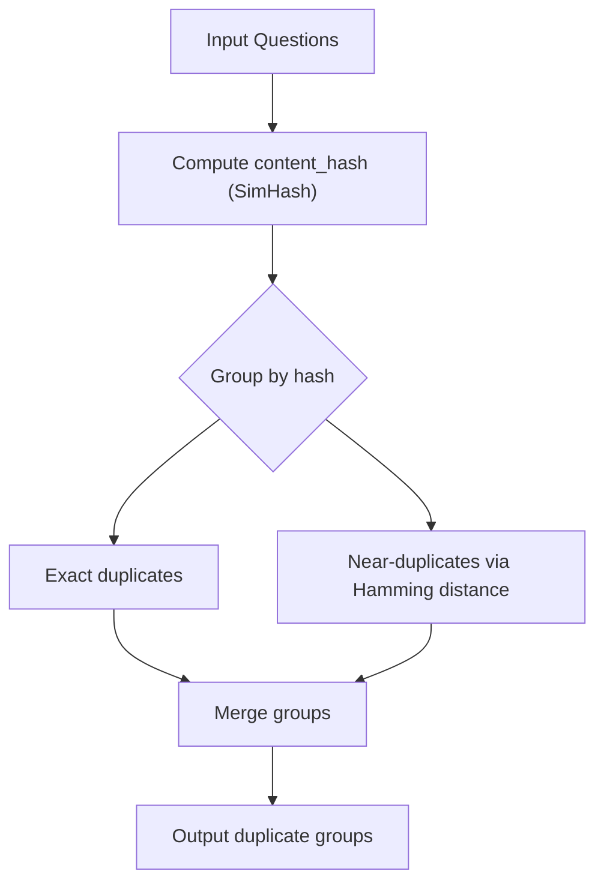

**Diagram sources**
- [backend/app/services/dedup_service.py:63-113](file://backend/app/services/dedup_service.py#L63-L113)

**Section sources**
- [backend/app/services/dedup_service.py:1-127](file://backend/app/services/dedup_service.py#L1-L127)

### Mistake Book Service
The mistake book service:
- Aggregates incorrect answers for a student and deduplicates by question
- Builds error entries with error classification
- Generates a structured mistake book with associated questions

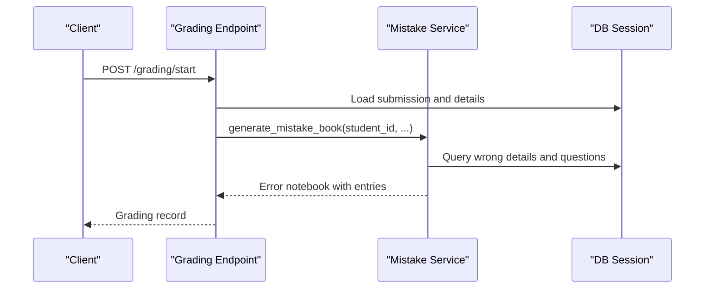

**Diagram sources**
- [backend/app/api/v1/endpoints/grading.py:19-55](file://backend/app/api/v1/endpoints/grading.py#L19-L55)
- [backend/app/services/mistake_service.py:13-75](file://backend/app/services/mistake_service.py#L13-L75)

**Section sources**
- [backend/app/services/mistake_service.py:1-114](file://backend/app/services/mistake_service.py#L1-L114)
- [backend/app/api/v1/endpoints/grading.py:1-143](file://backend/app/api/v1/endpoints/grading.py#L1-L143)

### Storage Service
The storage service:
- Attempts MinIO initialization; falls back to local filesystem
- Saves files and generates presigned URLs for retrieval

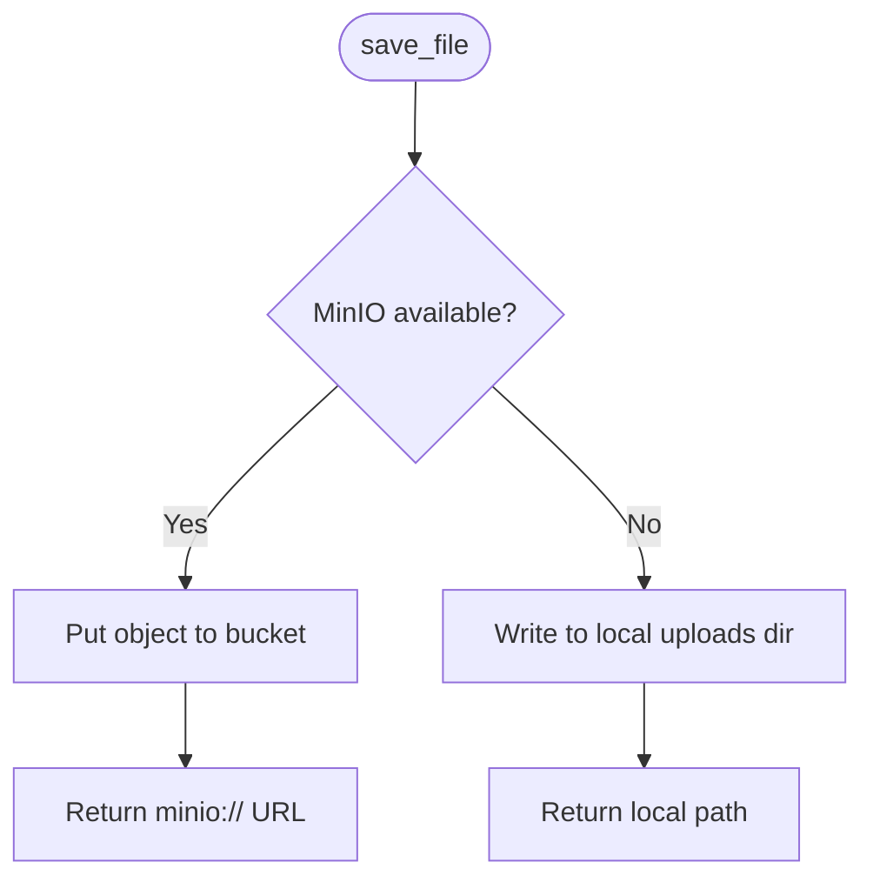

**Diagram sources**
- [backend/app/services/storage.py:25-54](file://backend/app/services/storage.py#L25-L54)

**Section sources**
- [backend/app/services/storage.py:1-55](file://backend/app/services/storage.py#L1-L55)

### Database Session Factory and Dependency Injection
The database session factory:
- Creates an async engine and sessionmaker
- Provides a dependency that yields sessions and ensures cleanup

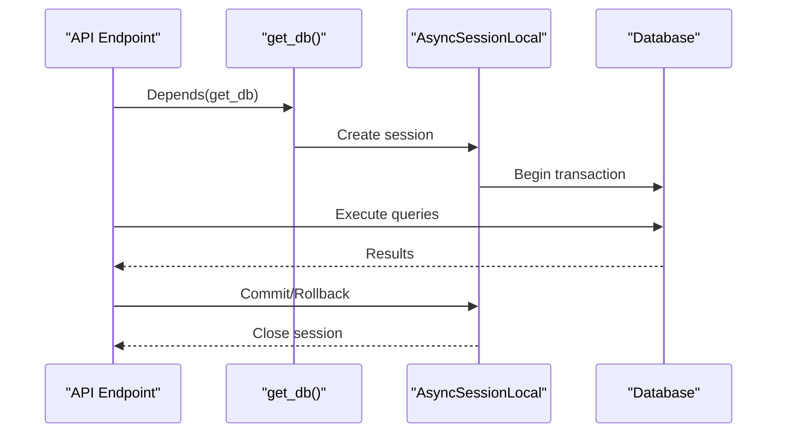

**Diagram sources**
- [backend/app/db/session.py:18-26](file://backend/app/db/session.py#L18-L26)

**Section sources**
- [backend/app/db/session.py:1-26](file://backend/app/db/session.py#L1-L26)

## Dependency Analysis
- API Registration
  - The API router aggregates all feature routers, enabling centralized inclusion and tag-based organization
- Service Coupling
  - Services depend on the configuration service for provider settings and runtime testing
  - LLM and scraper services depend on HTTP clients and JSON parsing utilities
- External Integrations
  - LLM providers (Ollama, DeepSeek) and OCR/storage backends are optional; the system adapts gracefully
- Configuration Flow
  - Environment variables override sysconfig.json values, ensuring secrets remain externalized

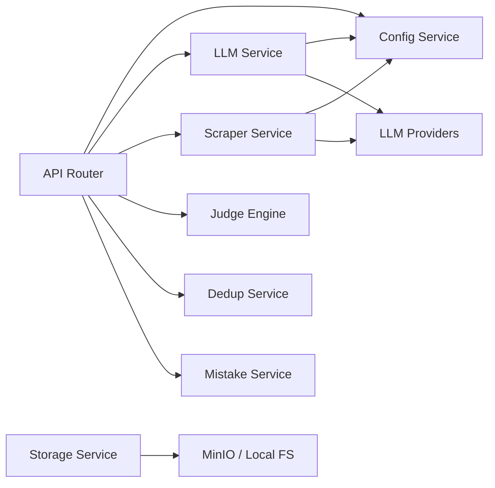

**Diagram sources**
- [backend/app/api/v1/api.py:6-25](file://backend/app/api/v1/api.py#L6-L25)
- [backend/app/services/config_service.py:65-78](file://backend/app/services/config_service.py#L65-L78)
- [backend/app/services/llm_service.py:65-72](file://backend/app/services/llm_service.py#L65-L72)
- [backend/app/services/scraper.py:94-96](file://backend/app/services/scraper.py#L94-L96)
- [backend/app/services/storage.py:11-22](file://backend/app/services/storage.py#L11-L22)

**Section sources**
- [backend/app/api/v1/api.py:1-26](file://backend/app/api/v1/api.py#L1-L26)
- [backend/app/services/config_service.py:1-155](file://backend/app/services/config_service.py#L1-L155)
- [backend/app/services/llm_service.py:1-350](file://backend/app/services/llm_service.py#L1-L350)
- [backend/app/services/scraper.py:1-272](file://backend/app/services/scraper.py#L1-L272)
- [backend/app/services/storage.py:1-55](file://backend/app/services/storage.py#L1-L55)

## Performance Considerations
- Asynchronous I/O
  - Use async HTTP clients and database sessions to minimize blocking
- Provider Selection
  - Prefer local providers (e.g., Ollama) for low-latency scenarios; use cloud providers for higher throughput
- Caching and Deduplication
  - Leverage SimHash-based deduplication for questions and remove duplicate titles during generation
- Concurrency Limits
  - Respect configuration limits for concurrent operations (e.g., OCR, grading) to avoid resource exhaustion
- Timeout Tuning
  - Adjust timeouts for external provider calls to balance responsiveness and reliability
- Pagination and Limits
  - Enforce reasonable limits on exports and queries to prevent heavy loads

[No sources needed since this section provides general guidance]

## Troubleshooting Guide
Common issues and resolutions:
- LLM Provider Connectivity
  - Use the configuration endpoint to test provider connectivity and model availability
  - Verify API keys and endpoints; check network access to provider domains
- Database Sessions
  - Ensure sessions are yielded and closed properly; handle exceptions to roll back transactions
- Configuration Persistence
  - Confirm sysconfig.json permissions and that sensitive keys are not written to disk
- Storage Backends
  - If MinIO is unavailable, the system falls back to local storage; verify upload directories and permissions

**Section sources**
- [backend/app/api/v1/endpoints/llm_config.py:61-105](file://backend/app/api/v1/endpoints/llm_config.py#L61-L105)
- [backend/app/db/session.py:18-26](file://backend/app/db/session.py#L18-L26)
- [backend/app/services/config_service.py:101-106](file://backend/app/services/config_service.py#L101-L106)
- [backend/app/services/storage.py:11-22](file://backend/app/services/storage.py#L11-L22)

## Conclusion
The system’s plugin and extension architecture leverages:
- Clear separation of concerns via modular services
- Configuration-driven behavior for flexible provider selection
- Dependency injection for testable and maintainable endpoints
- Practical extensibility points for adding new services, integrating third-party APIs, and extending functionality

By following the patterns documented here—service registration, configuration management, and lifecycle handling—you can reliably add custom services, integrate new providers, and scale performance while maintaining robust error handling.

[No sources needed since this section summarizes without analyzing specific files]

## Appendices

### A. Creating a Custom Deduplication Service
Steps:
- Implement a new module under services with a function that accepts question-like dictionaries and returns duplicate groups
- Integrate with the questions endpoint by adding a new route that calls your service
- Register the route in the questions router and expose it via the API

Guidelines:
- Use content hashing or fuzzy matching strategies appropriate to your domain
- Keep the interface consistent with existing services (input/output formats)
- Add unit tests and consider performance characteristics

**Section sources**
- [backend/app/services/dedup_service.py:63-113](file://backend/app/services/dedup_service.py#L63-L113)
- [backend/app/api/v1/endpoints/questions.py:217-226](file://backend/app/api/v1/endpoints/questions.py#L217-L226)

### B. Developing a Custom Scraping Integration
Steps:
- Create a new service module with async search and parsing functions
- Support multiple providers and fallback strategies
- Use the configuration service to read provider settings and test connectivity

Guidelines:
- Normalize output to the expected question schema
- Implement robust error handling and retries
- Respect rate limits and terms of service

**Section sources**
- [backend/app/services/scraper.py:11-60](file://backend/app/services/scraper.py#L11-L60)
- [backend/app/services/config_service.py:108-126](file://backend/app/services/config_service.py#L108-L126)

### C. Building a Custom Grading Engine
Steps:
- Define a new grader function that returns a standardized grade result
- Register it in a dispatch map keyed by question type
- Wire it into the grading endpoint to replace or augment the rule engine

Guidelines:
- Maintain consistent scoring semantics and feedback messages
- Consider partial credit and nuanced scoring for complex question types
- Validate correctness against known datasets

**Section sources**
- [backend/app/services/judge_engine.py:118-129](file://backend/app/services/judge_engine.py#L118-L129)
- [backend/app/api/v1/endpoints/grading.py:19-55](file://backend/app/api/v1/endpoints/grading.py#L19-L55)

### D. Service Lifecycle Management
Patterns:
- Startup tasks initialize reference data and seed databases
- Dependency injection ensures services receive database sessions and configuration
- Graceful degradation when optional integrations (MinIO, OCR) are unavailable

**Section sources**
- [backend/app/main.py:33-42](file://backend/app/main.py#L33-L42)
- [backend/app/db/session.py:18-26](file://backend/app/db/session.py#L18-L26)
- [backend/app/services/storage.py:11-22](file://backend/app/services/storage.py#L11-L22)