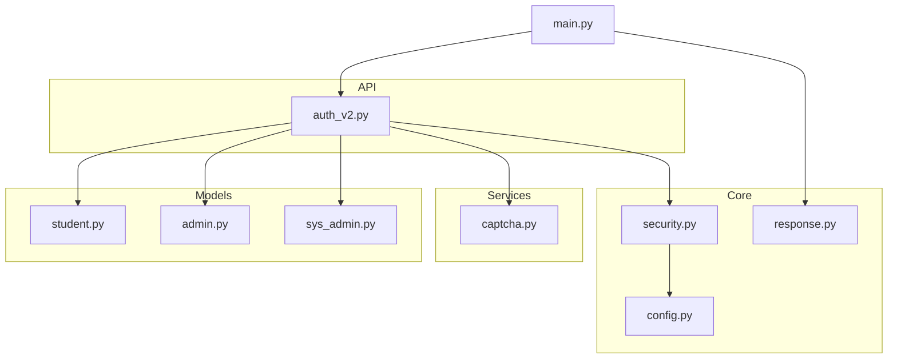
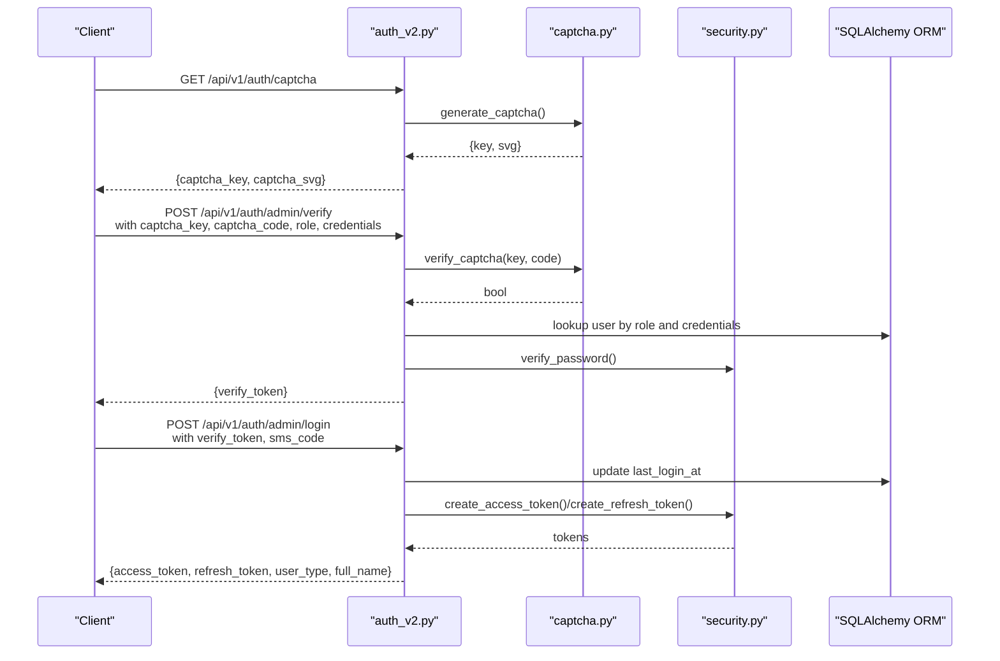
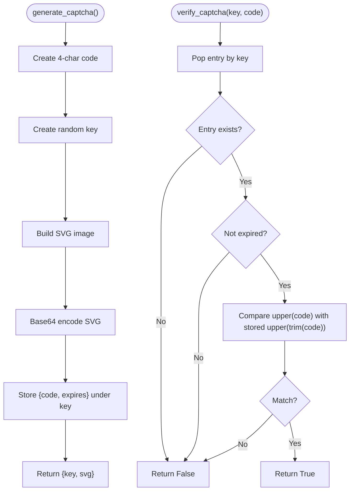
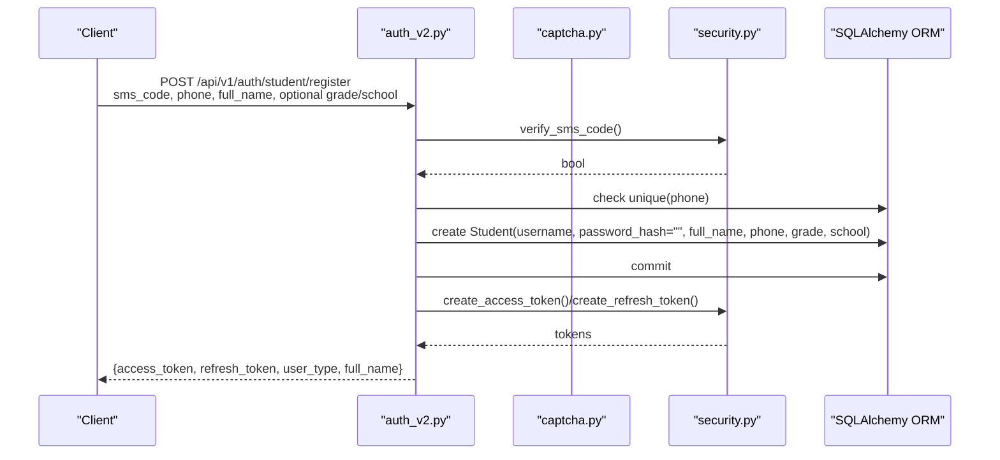
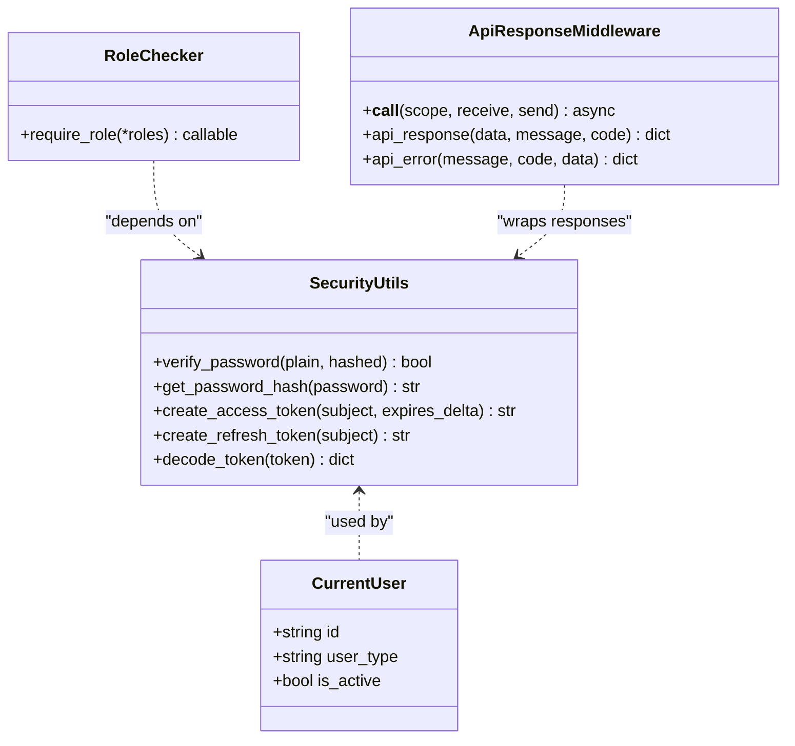
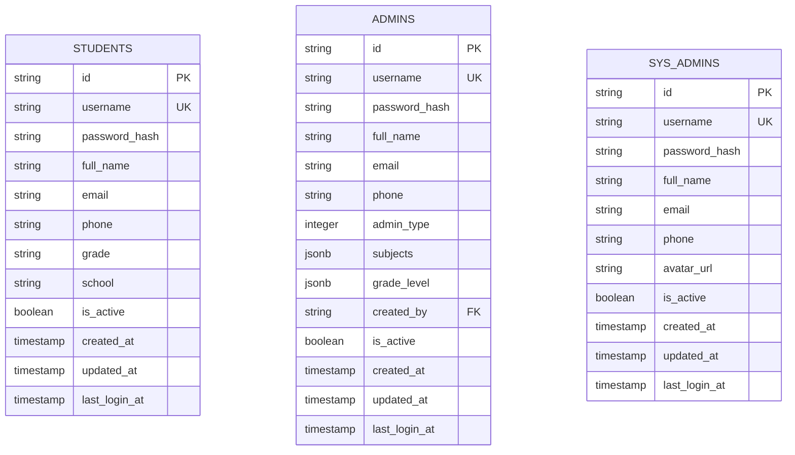
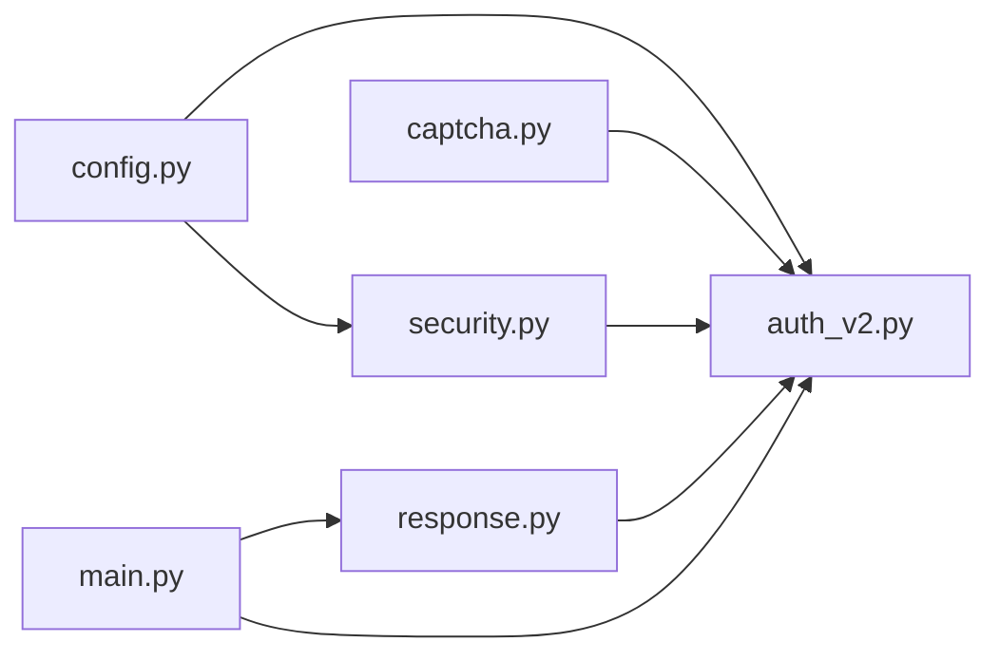

# Security Services

<cite>
**Referenced Files in This Document**
- [security.py](file://backend/app/core/security.py)
- [captcha.py](file://backend/app/services/captcha.py)
- [auth_v2.py](file://backend/app/api/v1/endpoints/auth_v2.py)
- [config.py](file://backend/app/core/config.py)
- [main.py](file://backend/app/main.py)
- [response.py](file://backend/app/core/response.py)
- [student.py](file://backend/app/models/student.py)
- [admin.py](file://backend/app/models/admin.py)
- [sys_admin.py](file://backend/app/models/sys_admin.py)
</cite>

## Table of Contents
1. [Introduction](#introduction)
2. [Project Structure](#project-structure)
3. [Core Components](#core-components)
4. [Architecture Overview](#architecture-overview)
5. [Detailed Component Analysis](#detailed-component-analysis)
6. [Dependency Analysis](#dependency-analysis)
7. [Performance Considerations](#performance-considerations)
8. [Troubleshooting Guide](#troubleshooting-guide)
9. [Conclusion](#conclusion)
10. [Appendices](#appendices)

## Introduction
This document describes the security services implemented in the backend, focusing on CAPTCHA integration, authentication mechanisms, and anti-abuse protections. It explains how CAPTCHA is generated and verified, how authentication flows integrate with user registration and login, and how security middleware and configuration support robust access control. It also outlines sessionless JWT token usage, role-based access control, and practical guidance for extending security measures.

## Project Structure
Security-related components are organized across core security utilities, CAPTCHA service, authentication endpoints, configuration, and middleware. The authentication module integrates with user models to enforce role-based access and maintain audit trails via last login timestamps.

**Diagram sources**
- [config.py:1-98](file://backend/app/core/config.py#L1-L98)
- [security.py:1-104](file://backend/app/core/security.py#L1-L104)
- [response.py:1-124](file://backend/app/core/response.py#L1-L124)
- [captcha.py:1-40](file://backend/app/services/captcha.py#L1-L40)
- [auth_v2.py:1-476](file://backend/app/api/v1/endpoints/auth_v2.py#L1-L476)
- [student.py:1-23](file://backend/app/models/student.py#L1-L23)
- [admin.py:1-27](file://backend/app/models/admin.py#L1-L27)
- [sys_admin.py:1-22](file://backend/app/models/sys_admin.py#L1-L22)
- [main.py:1-52](file://backend/app/main.py#L1-L52)

**Section sources**
- [main.py:1-52](file://backend/app/main.py#L1-L52)
- [config.py:1-98](file://backend/app/core/config.py#L1-L98)

## Core Components
- JWT-based authentication with access and refresh tokens, token encoding/decoding, and bearer token extraction.
- Password hashing and verification using bcrypt.
- Role-based access control with a decorator enforcing allowed roles.
- CAPTCHA generation and verification with in-memory storage and expiration.
- Authentication endpoints supporting admin and student login/register flows with SMS verification and optional CAPTCHA.

**Section sources**
- [security.py:16-103](file://backend/app/core/security.py#L16-L103)
- [captcha.py:12-40](file://backend/app/services/captcha.py#L12-L40)
- [auth_v2.py:25-71](file://backend/app/api/v1/endpoints/auth_v2.py#L25-L71)

## Architecture Overview
The authentication architecture separates concerns:
- Configuration defines cryptographic keys and token lifetimes.
- Security utilities provide token creation, decoding, and role checks.
- CAPTCHA service generates and validates transient challenges.
- Authentication endpoints orchestrate verification steps and token issuance.
- Middleware ensures consistent response formatting and basic transport safety.

**Diagram sources**
- [auth_v2.py:75-183](file://backend/app/api/v1/endpoints/auth_v2.py#L75-L183)
- [captcha.py:12-40](file://backend/app/services/captcha.py#L12-L40)
- [security.py:16-47](file://backend/app/core/security.py#L16-L47)

## Detailed Component Analysis

### CAPTCHA Service
- Generation: Produces a 4-character uppercase code, a random key, and an SVG image embedded as base64. Stores the mapping with an expiration window.
- Verification: Validates the code (case-insensitive, whitespace-trimmed), consumes the stored entry, and rejects expired entries.
- Storage: In-memory dictionary scoped to the process; suitable for development but not recommended for production scale.

**Diagram sources**
- [captcha.py:12-40](file://backend/app/services/captcha.py#L12-L40)

**Section sources**
- [captcha.py:12-40](file://backend/app/services/captcha.py#L12-L40)

### Authentication Endpoints and Workflows
- Admin identity verification: Verifies CAPTCHA, resolves user by username/phone and role, checks password hash, and issues a short-lived verify token for the second step.
- Admin login: Verifies SMS code and the verify token, updates last login, and issues JWT tokens.
- Student login: Verifies CAPTCHA and SMS code, loads student, updates last login, and issues JWT tokens.
- Student registration: Verifies SMS code, enforces phone uniqueness, auto-generates username, persists student, and issues JWT tokens.

**Diagram sources**
- [auth_v2.py:212-237](file://backend/app/api/v1/endpoints/auth_v2.py#L212-L237)
- [security.py:24-40](file://backend/app/core/security.py#L24-L40)

**Section sources**
- [auth_v2.py:75-237](file://backend/app/api/v1/endpoints/auth_v2.py#L75-L237)

### Security Utilities and Middleware
- Token lifecycle: Access tokens expire after a configured duration; refresh tokens expire after a longer period. Tokens embed user identity and type.
- Credential handling: Passwords are hashed with bcrypt; verification compares hashed values.
- Current user resolution: Extracts bearer token, decodes JWT, validates presence, and confirms user existence across applicable tables.
- Role enforcement: Decorator checks current user’s type against allowed roles.
- Response wrapping: Middleware standardizes API responses and handles exceptions consistently.

**Diagram sources**
- [security.py:16-103](file://backend/app/core/security.py#L16-L103)
- [response.py:14-124](file://backend/app/core/response.py#L14-L124)

**Section sources**
- [security.py:16-103](file://backend/app/core/security.py#L16-L103)
- [response.py:14-124](file://backend/app/core/response.py#L14-L124)

### User Models and Sessionless Authentication
- Student model includes identity fields, activity flag, timestamps, and last login tracking.
- Admin model includes role metadata, subjects/grades, creator linkage, and last login tracking.
- SysAdmin model mirrors admin fields with system-level privileges.
- Authentication is stateless: clients manage JWT tokens; server-side does not maintain sessions.

**Diagram sources**
- [student.py:8-23](file://backend/app/models/student.py#L8-L23)
- [admin.py:9-27](file://backend/app/models/admin.py#L9-L27)
- [sys_admin.py:8-22](file://backend/app/models/sys_admin.py#L8-L22)

**Section sources**
- [student.py:8-23](file://backend/app/models/student.py#L8-L23)
- [admin.py:9-27](file://backend/app/models/admin.py#L9-L27)
- [sys_admin.py:8-22](file://backend/app/models/sys_admin.py#L8-L22)

## Dependency Analysis
- Configuration drives cryptographic constants and token lifetimes.
- Security utilities depend on configuration for secret key and algorithm.
- Authentication endpoints depend on security utilities for token operations and on CAPTCHA service for challenge-response.
- Middleware depends on routing to standardize responses for API paths.

**Diagram sources**
- [config.py:36-98](file://backend/app/core/config.py#L36-L98)
- [security.py:11-11](file://backend/app/core/security.py#L11-L11)
- [auth_v2.py:13-19](file://backend/app/api/v1/endpoints/auth_v2.py#L13-L19)
- [captcha.py:1-1](file://backend/app/services/captcha.py#L1-L1)
- [response.py:14-14](file://backend/app/core/response.py#L14-L14)
- [main.py:17-30](file://backend/app/main.py#L17-L30)

**Section sources**
- [config.py:36-98](file://backend/app/core/config.py#L36-L98)
- [security.py:11-11](file://backend/app/core/security.py#L11-L11)
- [auth_v2.py:13-19](file://backend/app/api/v1/endpoints/auth_v2.py#L13-L19)
- [captcha.py:1-1](file://backend/app/services/captcha.py#L1-L1)
- [response.py:14-14](file://backend/app/core/response.py#L14-L14)
- [main.py:17-30](file://backend/app/main.py#L17-L30)

## Performance Considerations
- Token operations are lightweight; ensure secret key entropy and algorithm consistency.
- CAPTCHA in-memory store scales poorly; consider external caching (e.g., Redis) for production deployments.
- Keep CAPTCHA TTL short to limit misuse windows.
- Avoid excessive synchronous work in middleware; the current implementation streams responses efficiently.

[No sources needed since this section provides general guidance]

## Troubleshooting Guide
Common issues and resolutions:
- Invalid or expired credentials: Ensure the bearer token is present and not expired; verify the user exists in the appropriate table.
- CAPTCHA failures: Confirm the CAPTCHA key is valid and not expired; ensure the code matches case-insensitively and without extra spaces.
- Role mismatches: Verify the requesting user’s type aligns with required roles enforced by the role checker.
- Response format: All API responses are wrapped automatically; inspect the standardized structure for error details.

**Section sources**
- [security.py:64-103](file://backend/app/core/security.py#L64-L103)
- [captcha.py:32-40](file://backend/app/services/captcha.py#L32-L40)
- [response.py:14-124](file://backend/app/core/response.py#L14-L124)

## Conclusion
The system implements a clear, layered security model: CAPTCHA for bot mitigation, robust JWT-based authentication with role enforcement, and standardized response handling. Administrators can extend the CAPTCHA provider and integrate external rate-limiting or abuse detection systems while maintaining consistent authentication and access control across user types.

[No sources needed since this section summarizes without analyzing specific files]

## Appendices

### Configuration Examples and Best Practices
- Secret key and token lifetimes: Configure secret key and algorithm in settings; adjust access and refresh token durations according to risk tolerance.
- CAPTCHA provider integration: Replace the in-memory store with a persistent cache-backed store for production; ensure TTL alignment with verification workflows.
- Security headers and transport: Enforce HTTPS, set secure cookie flags for clients, and configure CORS appropriately.
- Access control policies: Use the role checker decorator to gate endpoints by user type; keep privilege boundaries explicit.

**Section sources**
- [config.py:36-98](file://backend/app/core/config.py#L36-L98)
- [security.py:98-103](file://backend/app/core/security.py#L98-L103)

### Monitoring Suspicious Activities
- Track failed authentication attempts per IP/user.
- Monitor repeated CAPTCHA failures and expired verify tokens.
- Observe unusual token refresh patterns and frequent login locations/timezones.
- Log last login timestamps and update them on successful authentication.

**Section sources**
- [auth_v2.py:171-183](file://backend/app/api/v1/endpoints/auth_v2.py#L171-L183)
- [student.py:20-23](file://backend/app/models/student.py#L20-L23)
- [admin.py:22-27](file://backend/app/models/admin.py#L22-L27)
- [sys_admin.py:17-22](file://backend/app/models/sys_admin.py#L17-L22)