# Content Organization

<cite>
**Referenced Files in This Document**
- [knowledge_point.py](file://backend/app/models/knowledge_point.py)
- [knowledge_node.py](file://backend/app/models/knowledge_node.py)
- [knowledge_point_model.py](file://backend/app/models/knowledge_point_model.py)
- [syllabus.py](file://backend/app/models/syllabus.py)
- [question.py](file://backend/app/models/question.py)
- [knowledge_tree.py](file://backend/app/api/v1/endpoints/knowledge_tree.py)
- [questions.py](file://backend/app/api/v1/endpoints/questions.py)
- [self_study.py](file://backend/app/api/v1/endpoints/self_study.py)
- [question_admin.py](file://backend/app/api/v1/endpoints/question_admin.py)
- [KnowledgeTreePage.tsx](file://frontend/src/pages/admin/KnowledgeTreePage.tsx)
- [SyllabusPage.tsx](file://frontend/src/pages/admin/SyllabusPage.tsx)
- [database-design.md](file://nDocs/database-design.md)
- [001_v22_initial.py](file://backend/alembic/versions/001_v22_initial.py)
</cite>

## Table of Contents
1. [Introduction](#introduction)
2. [Project Structure](#project-structure)
3. [Core Components](#core-components)
4. [Architecture Overview](#architecture-overview)
5. [Detailed Component Analysis](#detailed-component-analysis)
6. [Dependency Analysis](#dependency-analysis)
7. [Performance Considerations](#performance-considerations)
8. [Troubleshooting Guide](#troubleshooting-guide)
9. [Conclusion](#conclusion)
10. [Appendices](#appendices)

## Introduction
This document explains the content organization system for knowledge nodes and learning objectives. It covers:
- The KnowledgePoint system and its relationship to competency frameworks
- Taxonomy and knowledge node structures
- Learning outcome alignment via knowledge nodes and question metadata
- Creation, categorization, and relationship mapping of knowledge nodes
- Integration with question bank organization and exam preparation workflows
- Learning path generation pathways
- Content standardization, validation, and review workflows
- Cross-referencing mechanisms between syllabi, knowledge nodes, and questions

## Project Structure
The content organization spans backend models, API endpoints, and frontend pages:
- Backend models define KnowledgePoint, KnowledgeNode, KnowledgePointModel, Syllabus, and Question entities
- API endpoints expose knowledge tree management, question CRUD, and knowledge extraction workflows
- Frontend pages provide admin interfaces for syllabus and knowledge tree management

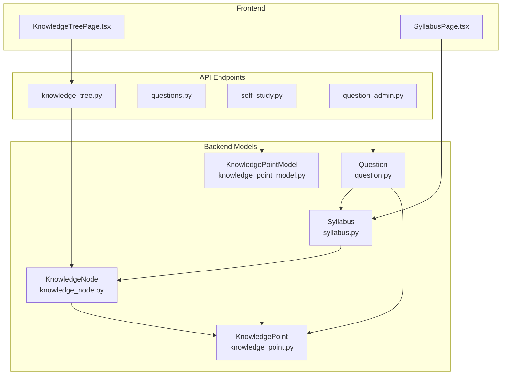

**Diagram sources**
- [knowledge_point.py:7-27](file://backend/app/models/knowledge_point.py#L7-L27)
- [knowledge_node.py:9-26](file://backend/app/models/knowledge_node.py#L9-L26)
- [knowledge_point_model.py:8-29](file://backend/app/models/knowledge_point_model.py#L8-L29)
- [syllabus.py:9-26](file://backend/app/models/syllabus.py#L9-L26)
- [question.py:10-46](file://backend/app/models/question.py#L10-L46)
- [knowledge_tree.py:16-357](file://backend/app/api/v1/endpoints/knowledge_tree.py#L16-L357)
- [questions.py:17-431](file://backend/app/api/v1/endpoints/questions.py#L17-L431)
- [self_study.py:159-276](file://backend/app/api/v1/endpoints/self_study.py#L159-L276)
- [question_admin.py:166-220](file://backend/app/api/v1/endpoints/question_admin.py#L166-L220)
- [KnowledgeTreePage.tsx:30-340](file://frontend/src/pages/admin/KnowledgeTreePage.tsx#L30-L340)
- [SyllabusPage.tsx:11-239](file://frontend/src/pages/admin/SyllabusPage.tsx#L11-L239)

**Section sources**
- [knowledge_point.py:7-27](file://backend/app/models/knowledge_point.py#L7-L27)
- [knowledge_node.py:9-26](file://backend/app/models/knowledge_node.py#L9-L26)
- [knowledge_point_model.py:8-29](file://backend/app/models/knowledge_point_model.py#L8-L29)
- [syllabus.py:9-26](file://backend/app/models/syllabus.py#L9-L26)
- [question.py:10-46](file://backend/app/models/question.py#L10-L46)
- [knowledge_tree.py:16-357](file://backend/app/api/v1/endpoints/knowledge_tree.py#L16-L357)
- [questions.py:17-431](file://backend/app/api/v1/endpoints/questions.py#L17-L431)
- [self_study.py:159-276](file://backend/app/api/v1/endpoints/self_study.py#L159-L276)
- [question_admin.py:166-220](file://backend/app/api/v1/endpoints/question_admin.py#L166-L220)
- [KnowledgeTreePage.tsx:30-340](file://frontend/src/pages/admin/KnowledgeTreePage.tsx#L30-L340)
- [SyllabusPage.tsx:11-239](file://frontend/src/pages/admin/SyllabusPage.tsx#L11-L239)

## Core Components
- KnowledgePoint: Atomic learning objective with subject, grade, and optional difficulty. Supports hierarchical parent-child relationships.
- KnowledgeNode: Versioned knowledge tree nodes linked to a syllabus, supporting AREA/POINT types and active/inactive states with invalidation reasons.
- KnowledgePointModel: Extracted knowledge points from external sources with confidence scores and content hashing for deduplication.
- Syllabus: Defines curriculum documents with versioning and branching for rollbacks.
- Question: Stores assessment items with metadata including grade scope, chapter, and knowledge_points arrays.

These components enable mapping between standardized knowledge nodes and learning outcomes, and align question content to syllabi and knowledge trees.

**Section sources**
- [knowledge_point.py:7-27](file://backend/app/models/knowledge_point.py#L7-L27)
- [knowledge_node.py:9-26](file://backend/app/models/knowledge_node.py#L9-L26)
- [knowledge_point_model.py:8-29](file://backend/app/models/knowledge_point_model.py#L8-L29)
- [syllabus.py:9-26](file://backend/app/models/syllabus.py#L9-L26)
- [question.py:10-46](file://backend/app/models/question.py#L10-L46)

## Architecture Overview
The system orchestrates content organization across three layers:
- Data Layer: SQLAlchemy models define entities and relationships
- API Layer: FastAPI endpoints manage knowledge trees, questions, and knowledge extraction
- UI Layer: Admin pages provide interactive management of syllabi and knowledge trees

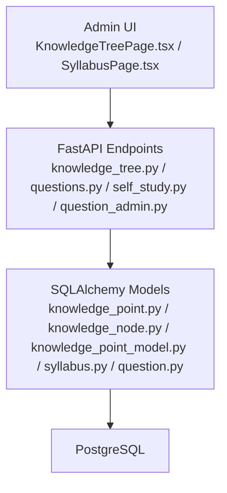

**Diagram sources**
- [KnowledgeTreePage.tsx:30-340](file://frontend/src/pages/admin/KnowledgeTreePage.tsx#L30-L340)
- [SyllabusPage.tsx:11-239](file://frontend/src/pages/admin/SyllabusPage.tsx#L11-L239)
- [knowledge_tree.py:16-357](file://backend/app/api/v1/endpoints/knowledge_tree.py#L16-L357)
- [questions.py:17-431](file://backend/app/api/v1/endpoints/questions.py#L17-L431)
- [self_study.py:159-276](file://backend/app/api/v1/endpoints/self_study.py#L159-L276)
- [question_admin.py:166-220](file://backend/app/api/v1/endpoints/question_admin.py#L166-L220)
- [knowledge_point.py:7-27](file://backend/app/models/knowledge_point.py#L7-L27)
- [knowledge_node.py:9-26](file://backend/app/models/knowledge_node.py#L9-L26)
- [knowledge_point_model.py:8-29](file://backend/app/models/knowledge_point_model.py#L8-L29)
- [syllabus.py:9-26](file://backend/app/models/syllabus.py#L9-L26)
- [question.py:10-46](file://backend/app/models/question.py#L10-L46)

## Detailed Component Analysis

### KnowledgePoint System and Competency Frameworks
- Purpose: Represent atomic learning objectives with standardized attributes (code, name, subject, grade, difficulty).
- Hierarchy: Self-referential parent_id enables competency frameworks with domains and points.
- Validation: Constraints ensure semantic correctness; migrations enforce domain-specific checks.

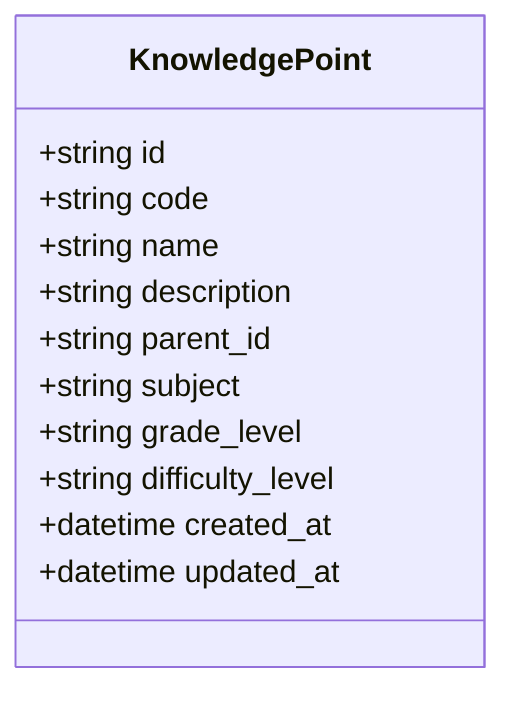

**Diagram sources**
- [knowledge_point.py:7-27](file://backend/app/models/knowledge_point.py#L7-L27)

**Section sources**
- [knowledge_point.py:7-27](file://backend/app/models/knowledge_point.py#L7-L27)
- [001_v22_initial.py:79-90](file://backend/alembic/versions/001_v22_initial.py#L79-L90)

### KnowledgeNode and Versioned Knowledge Trees
- Purpose: Build and maintain syllabus-aligned knowledge trees with versioning and activation controls.
- Features:
  - AREA vs POINT node types
  - Active/inactive states with invalid reasons (manual or parent-modified)
  - Sort order and metadata support
  - New version creation and rollback across version chains
- Operations:
  - Create/update/delete nodes
  - Set branch active/inactive recursively
  - Invalidate descendants on updates
  - List versions and roll back to historical versions

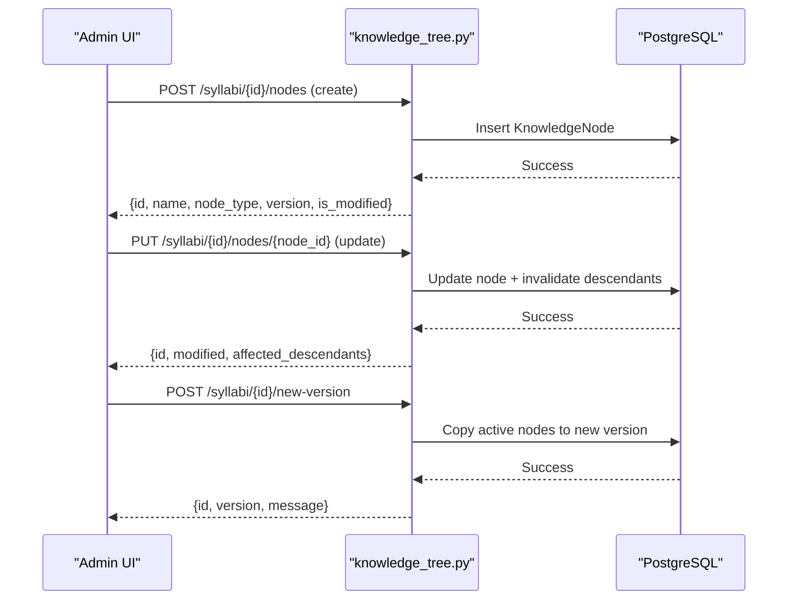

**Diagram sources**
- [knowledge_tree.py:67-250](file://backend/app/api/v1/endpoints/knowledge_tree.py#L67-L250)
- [knowledge_node.py:9-26](file://backend/app/models/knowledge_node.py#L9-L26)

**Section sources**
- [knowledge_tree.py:16-357](file://backend/app/api/v1/endpoints/knowledge_tree.py#L16-L357)
- [knowledge_node.py:9-26](file://backend/app/models/knowledge_node.py#L9-L26)
- [syllabus.py:9-26](file://backend/app/models/syllabus.py#L9-L26)

### KnowledgePointModel and Extraction Pipeline
- Purpose: Store extracted knowledge points from external sources with confidence and deduplication via content hash.
- Workflow: Extraction endpoint currently returns not implemented; future integration will populate KnowledgePointModel entries.

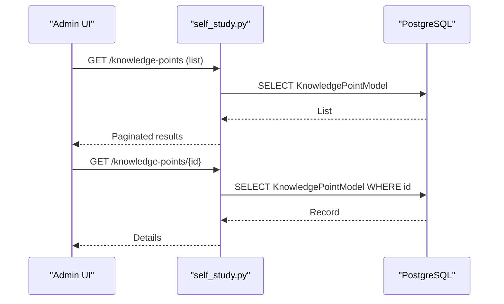

**Diagram sources**
- [self_study.py:178-257](file://backend/app/api/v1/endpoints/self_study.py#L178-L257)
- [knowledge_point_model.py:8-29](file://backend/app/models/knowledge_point_model.py#L8-L29)

**Section sources**
- [self_study.py:159-276](file://backend/app/api/v1/endpoints/self_study.py#L159-L276)
- [knowledge_point_model.py:8-29](file://backend/app/models/knowledge_point_model.py#L8-L29)

### Question Bank Organization and Learning Outcome Alignment
- Purpose: Align questions to syllabi and knowledge nodes via grade scope and knowledge_points metadata.
- Data Model:
  - Questions store grade_level JSON with scope, grades, chapter, and knowledge_points
  - Questions can be tagged with knowledge_points arrays for targeted assessments
- Workflows:
  - Create questions with knowledge_points metadata
  - Export and filter by knowledge_point
  - Typical question marking for curated content

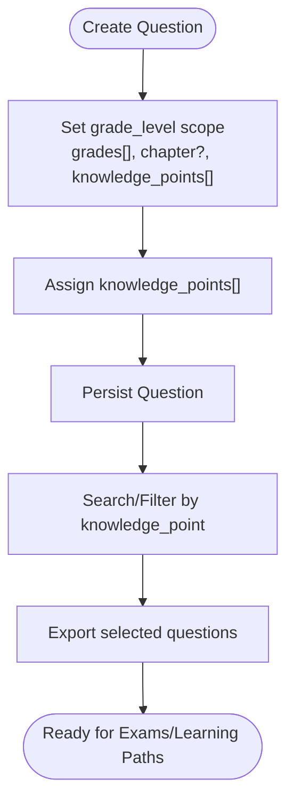

**Diagram sources**
- [questions.py:17-104](file://backend/app/api/v1/endpoints/questions.py#L17-L104)
- [question.py:10-46](file://backend/app/models/question.py#L10-L46)
- [database-design.md:274-317](file://nDocs/database-design.md#L274-L317)

**Section sources**
- [questions.py:17-431](file://backend/app/api/v1/endpoints/questions.py#L17-L431)
- [question.py:10-46](file://backend/app/models/question.py#L10-L46)
- [database-design.md:98-120](file://nDocs/database-design.md#L98-L120)
- [database-design.md:274-317](file://nDocs/database-design.md#L274-L317)

### Exam Preparation Workflows and Learning Path Generation
- Syllabus-driven scope: Use Syllabus with knowledge_tree to define coverage areas.
- Knowledge tree activation: Activate/deactivate branches to reflect current curriculum focus.
- Question generation pipeline: Admin endpoint posts to generate questions; future implementation will integrate with KnowledgePointModel and KnowledgeNode scope.
- Typical questions: Mark and export typical questions for focused practice.

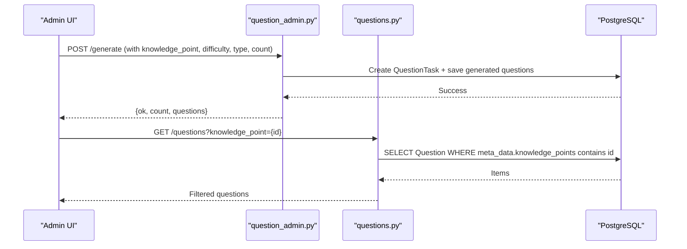

**Diagram sources**
- [question_admin.py:166-220](file://backend/app/api/v1/endpoints/question_admin.py#L166-L220)
- [questions.py:366-431](file://backend/app/api/v1/endpoints/questions.py#L366-L431)

**Section sources**
- [question_admin.py:166-220](file://backend/app/api/v1/endpoints/question_admin.py#L166-L220)
- [questions.py:366-431](file://backend/app/api/v1/endpoints/questions.py#L366-L431)

### Content Standardization, Taxonomy, and Cross-Referencing
- Standardization:
  - KnowledgePoint code/name/subject/grade/difficulty provide canonical identifiers
  - KnowledgeNode node_type and metadata ensure consistent taxonomy
  - KnowledgePointModel enforces extraction quality via confidence_score and content_hash
- Taxonomy:
  - Syllabus defines curriculum scope; KnowledgeNode organizes by AREA/POINT
  - Questions reference knowledge_points arrays for cross-linking
- Cross-referencing:
  - Syllabi → KnowledgeNodes → KnowledgePoints
  - Questions → Syllabi (via grade_level) and → KnowledgePoints (via knowledge_points)

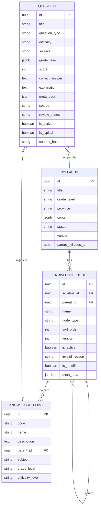

**Diagram sources**
- [syllabus.py:9-26](file://backend/app/models/syllabus.py#L9-L26)
- [knowledge_node.py:9-26](file://backend/app/models/knowledge_node.py#L9-L26)
- [knowledge_point.py:7-27](file://backend/app/models/knowledge_point.py#L7-L27)
- [question.py:10-46](file://backend/app/models/question.py#L10-L46)
- [database-design.md:98-120](file://nDocs/database-design.md#L98-L120)
- [database-design.md:151-170](file://nDocs/database-design.md#L151-L170)

**Section sources**
- [syllabus.py:9-26](file://backend/app/models/syllabus.py#L9-L26)
- [knowledge_node.py:9-26](file://backend/app/models/knowledge_node.py#L9-L26)
- [knowledge_point.py:7-27](file://backend/app/models/knowledge_point.py#L7-L27)
- [question.py:10-46](file://backend/app/models/question.py#L10-L46)
- [database-design.md:98-120](file://nDocs/database-design.md#L98-L120)
- [database-design.md:151-170](file://nDocs/database-design.md#L151-L170)

### Knowledge Point Creation, Categorization, and Relationship Mapping
- Creation:
  - Syllabus-based extraction populates KnowledgeNode trees
  - KnowledgePointModel stores extracted knowledge points with confidence
- Categorization:
  - KnowledgeNode node_type distinguishes domains (AREA) from points (POINT)
  - KnowledgePoint subject/grade/difficulty classify atomic objectives
- Relationship Mapping:
  - KnowledgeNode parent_id links to KnowledgeNode id
  - KnowledgePoint parent_id links to KnowledgePoint id
  - Questions meta_data.knowledge_points reference KnowledgePoint ids

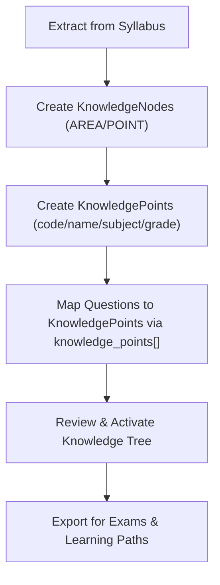

**Diagram sources**
- [knowledge_tree.py:199-250](file://backend/app/api/v1/endpoints/knowledge_tree.py#L199-L250)
- [self_study.py:178-257](file://backend/app/api/v1/endpoints/self_study.py#L178-L257)
- [questions.py:17-104](file://backend/app/api/v1/endpoints/questions.py#L17-L104)

**Section sources**
- [knowledge_tree.py:199-250](file://backend/app/api/v1/endpoints/knowledge_tree.py#L199-L250)
- [self_study.py:178-257](file://backend/app/api/v1/endpoints/self_study.py#L178-L257)
- [questions.py:17-104](file://backend/app/api/v1/endpoints/questions.py#L17-L104)

### Knowledge Point Validation, Quality Assurance, and Review Workflows
- Validation:
  - KnowledgePointModel confidence_score range enforced (0–1)
  - KnowledgePointModel content_hash uniqueness prevents duplicates
  - KnowledgeNode invalid_reason tracks activation state transitions
- Quality Assurance:
  - Confidence thresholds guide acceptance of extracted points
  - Content hash ensures deduplication across sources
- Review Workflows:
  - KnowledgeNode activation/deactivation and invalidation propagate through subtrees
  - Rollback to previous syllabus versions preserves historical trees

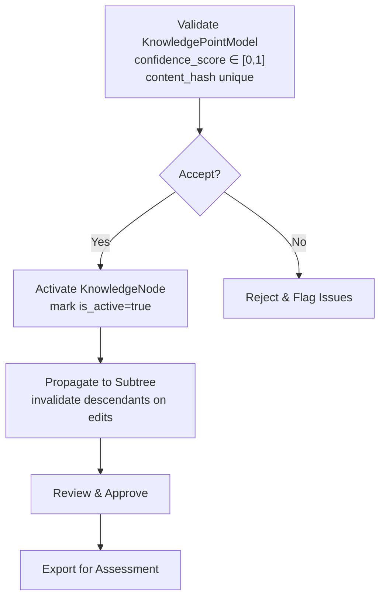

**Diagram sources**
- [knowledge_point_model.py:22-26](file://backend/app/models/knowledge_point_model.py#L22-L26)
- [knowledge_tree.py:131-177](file://backend/app/api/v1/endpoints/knowledge_tree.py#L131-L177)

**Section sources**
- [knowledge_point_model.py:22-26](file://backend/app/models/knowledge_point_model.py#L22-L26)
- [knowledge_tree.py:131-177](file://backend/app/api/v1/endpoints/knowledge_tree.py#L131-L177)

### Examples

#### Example 1: Knowledge Point Creation and Mapping
- Create a KnowledgeNode (AREA) under a Syllabus
- Create KnowledgeNodes (POINT) as children
- Assign KnowledgePointModel entries with confidence and content_hash
- Map Questions to KnowledgePoints via knowledge_points[]

**Section sources**
- [knowledge_tree.py:67-95](file://backend/app/api/v1/endpoints/knowledge_tree.py#L67-L95)
- [self_study.py:178-257](file://backend/app/api/v1/endpoints/self_study.py#L178-L257)
- [questions.py:17-104](file://backend/app/api/v1/endpoints/questions.py#L17-L104)

#### Example 2: Content Mapping and Filtering
- Use grade_level scope to map questions to syllabi
- Filter questions by knowledge_point to build targeted assessments
- Export filtered sets for offline practice or exams

**Section sources**
- [database-design.md:274-317](file://nDocs/database-design.md#L274-L317)
- [questions.py:17-104](file://backend/app/api/v1/endpoints/questions.py#L17-L104)

#### Example 3: Competency Assessment and Learning Objective Alignment
- Define KnowledgePoints aligned to subject and grade
- Use KnowledgeNode hierarchy to represent competency frameworks
- Link questions to KnowledgePoints to assess mastery

**Section sources**
- [knowledge_point.py:7-27](file://backend/app/models/knowledge_point.py#L7-L27)
- [knowledge_node.py:9-26](file://backend/app/models/knowledge_node.py#L9-L26)
- [question.py:10-46](file://backend/app/models/question.py#L10-L46)

## Dependency Analysis
- Coupling:
  - KnowledgeNode depends on Syllabus; supports recursive parent references
  - KnowledgePoint supports hierarchical parent references
  - Questions depend on Syllabus scope and KnowledgePoints via metadata
- Cohesion:
  - KnowledgePointModel encapsulates extraction quality metrics
  - KnowledgeTree endpoints centralize activation and invalidation logic
- External Dependencies:
  - PostgreSQL with JSONB for flexible scope and metadata
  - Alembic migrations define schema evolution

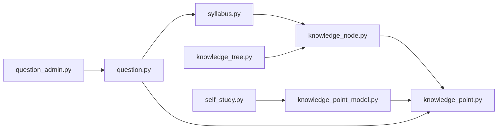

**Diagram sources**
- [syllabus.py:9-26](file://backend/app/models/syllabus.py#L9-L26)
- [knowledge_node.py:9-26](file://backend/app/models/knowledge_node.py#L9-L26)
- [knowledge_point.py:7-27](file://backend/app/models/knowledge_point.py#L7-L27)
- [knowledge_point_model.py:8-29](file://backend/app/models/knowledge_point_model.py#L8-L29)
- [question.py:10-46](file://backend/app/models/question.py#L10-L46)
- [knowledge_tree.py:16-357](file://backend/app/api/v1/endpoints/knowledge_tree.py#L16-L357)
- [question_admin.py:166-220](file://backend/app/api/v1/endpoints/question_admin.py#L166-L220)
- [self_study.py:159-276](file://backend/app/api/v1/endpoints/self_study.py#L159-L276)

**Section sources**
- [syllabus.py:9-26](file://backend/app/models/syllabus.py#L9-L26)
- [knowledge_node.py:9-26](file://backend/app/models/knowledge_node.py#L9-L26)
- [knowledge_point.py:7-27](file://backend/app/models/knowledge_point.py#L7-L27)
- [knowledge_point_model.py:8-29](file://backend/app/models/knowledge_point_model.py#L8-L29)
- [question.py:10-46](file://backend/app/models/question.py#L10-L46)
- [knowledge_tree.py:16-357](file://backend/app/api/v1/endpoints/knowledge_tree.py#L16-L357)
- [question_admin.py:166-220](file://backend/app/api/v1/endpoints/question_admin.py#L166-L220)
- [self_study.py:159-276](file://backend/app/api/v1/endpoints/self_study.py#L159-L276)

## Performance Considerations
- Indexing:
  - KnowledgePoint code and subject/grade/difficulty indices improve filtering
  - KnowledgeNode syllabus/version and parent indices optimize tree queries
  - Question content_hash index accelerates deduplication
- Pagination:
  - API endpoints cap limits to avoid heavy loads
- Asynchronous operations:
  - Use async sessions for concurrent requests in knowledge tree and question endpoints

[No sources needed since this section provides general guidance]

## Troubleshooting Guide
- Knowledge tree invalidation:
  - Updating a node triggers recursive invalidation of descendants; verify activation state after edits
- Version rollback:
  - Use rollback endpoint to restore a specific historical version; confirm is_current flag
- Knowledge extraction:
  - Endpoint returns not implemented; ensure future integrations validate confidence_score and content_hash
- Question filtering:
  - When filtering by knowledge_point, ensure meta_data.knowledge_points is populated and matches KnowledgePoint ids

**Section sources**
- [knowledge_tree.py:131-177](file://backend/app/api/v1/endpoints/knowledge_tree.py#L131-L177)
- [knowledge_tree.py:253-319](file://backend/app/api/v1/endpoints/knowledge_tree.py#L253-L319)
- [self_study.py:159-175](file://backend/app/api/v1/endpoints/self_study.py#L159-L175)
- [questions.py:17-104](file://backend/app/api/v1/endpoints/questions.py#L17-L104)

## Conclusion
The content organization system integrates KnowledgePoint, KnowledgeNode, KnowledgePointModel, Syllabus, and Question entities to align learning objectives with assessment content. The knowledge tree supports versioning, activation controls, and rollback, while questions leverage grade_scope and knowledge_points metadata for precise mapping. Future enhancements will implement knowledge extraction and question generation endpoints, enabling automated learning path generation and robust exam preparation workflows.

[No sources needed since this section summarizes without analyzing specific files]

## Appendices

### Appendix A: Frontend Admin Pages
- KnowledgeTreePage: Manage syllabi, versions, and knowledge trees with drag-and-drop-like operations and context menus
- SyllabusPage: Create, import, and extract knowledge from syllabi; visualize knowledge trees

**Section sources**
- [KnowledgeTreePage.tsx:30-340](file://frontend/src/pages/admin/KnowledgeTreePage.tsx#L30-L340)
- [SyllabusPage.tsx:11-239](file://frontend/src/pages/admin/SyllabusPage.tsx#L11-L239)