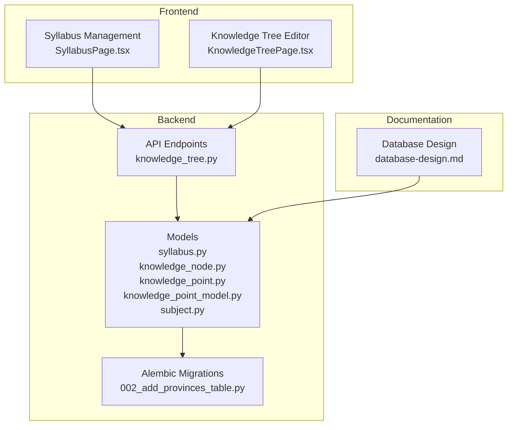
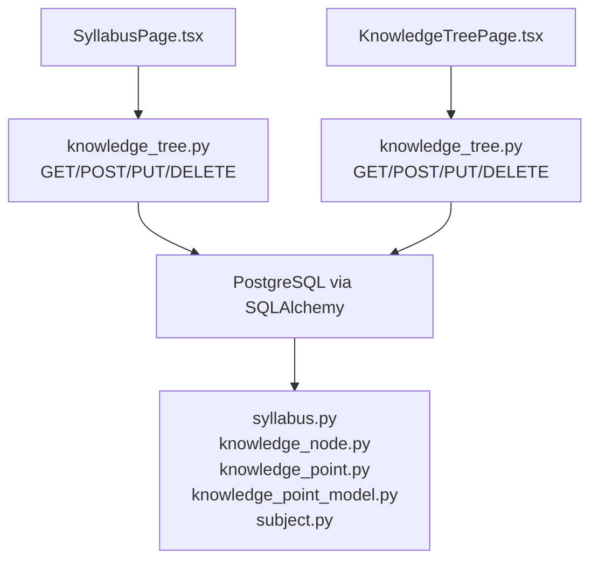
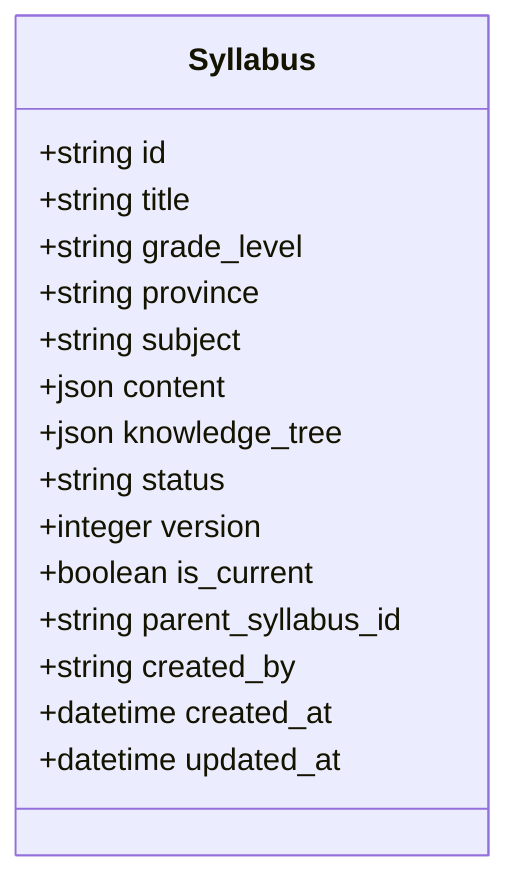
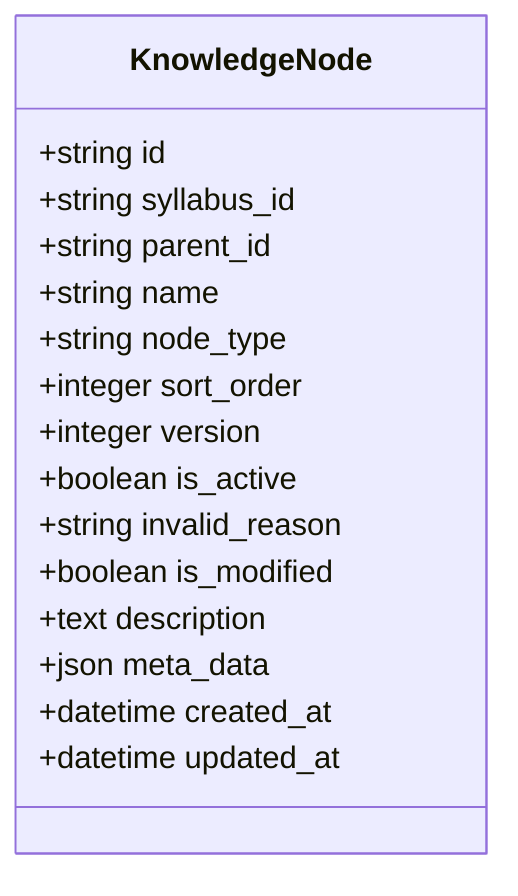
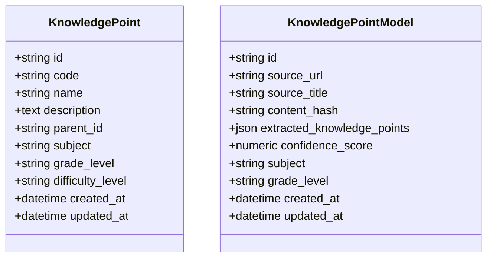
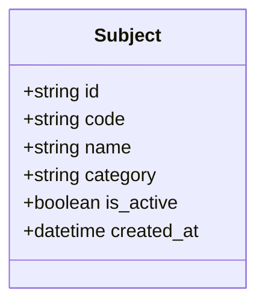
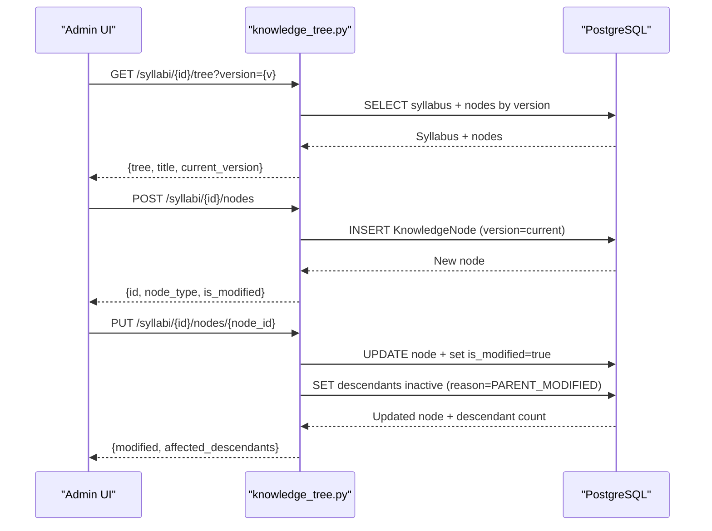
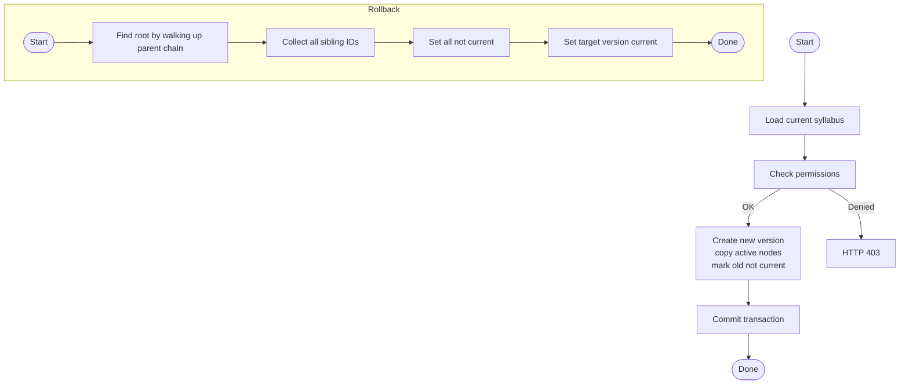
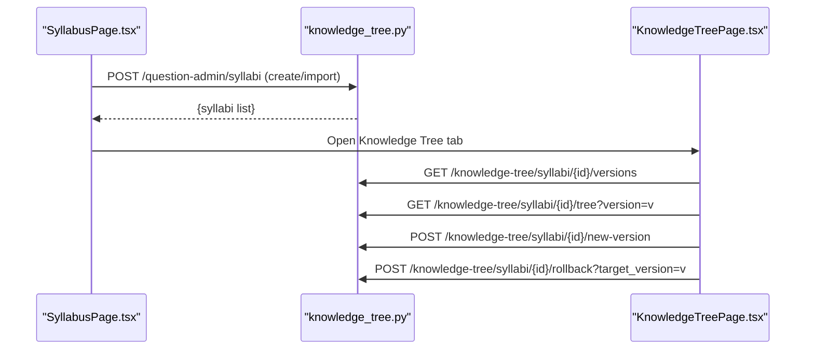
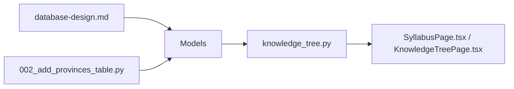

# Curriculum Mapping

<cite>
**Referenced Files in This Document**
- [syllabus.py](file://backend/app/models/syllabus.py)
- [knowledge_node.py](file://backend/app/models/knowledge_node.py)
- [knowledge_point.py](file://backend/app/models/knowledge_point.py)
- [knowledge_point_model.py](file://backend/app/models/knowledge_point_model.py)
- [subject.py](file://backend/app/models/subject.py)
- [knowledge_tree.py](file://backend/app/api/v1/endpoints/knowledge_tree.py)
- [KnowledgeTreePage.tsx](file://frontend/src/pages/admin/KnowledgeTreePage.tsx)
- [SyllabusPage.tsx](file://frontend/src/pages/admin/SyllabusPage.tsx)
- [database-design.md](file://docs/database-design.md)
- [002_add_provinces_table.py](file://backend/alembic/versions/002_add_provinces_table.py)
- [admin.py](file://backend/app/models/admin.py)
</cite>

## Table of Contents
1. [Introduction](#introduction)
2. [Project Structure](#project-structure)
3. [Core Components](#core-components)
4. [Architecture Overview](#architecture-overview)
5. [Detailed Component Analysis](#detailed-component-analysis)
6. [Dependency Analysis](#dependency-analysis)
7. [Performance Considerations](#performance-considerations)
8. [Troubleshooting Guide](#troubleshooting-guide)
9. [Conclusion](#conclusion)
10. [Appendices](#appendices)

## Introduction
This document describes the curriculum mapping system centered around syllabus management and the hierarchical knowledge tree. It explains how syllabi are created and standardized, how knowledge nodes are organized into chapters and points, and how version control enables rollbacks and content inheritance. It also covers integration with subject-specific curricula, grade-level alignment, and geographic province variations. The document provides practical workflows, diagrams, and best practices for building and maintaining curriculum content.

## Project Structure
The curriculum mapping system spans backend models and endpoints, frontend administration pages, and supporting documentation and migrations:
- Backend models define syllabi, knowledge nodes, knowledge points, and related reference data.
- Knowledge tree endpoints implement CRUD operations, versioning, and rollback.
- Frontend pages provide admin interfaces for syllabus creation/import and knowledge tree editing.
- Database design documentation outlines schema, indexes, and relationships.
- Alembic migrations add province reference support and other enhancements.

**Diagram sources**
- [syllabus.py:1-26](file://backend/app/models/syllabus.py#L1-L26)
- [knowledge_node.py:1-26](file://backend/app/models/knowledge_node.py#L1-L26)
- [knowledge_point.py:1-27](file://backend/app/models/knowledge_point.py#L1-L27)
- [knowledge_point_model.py:1-29](file://backend/app/models/knowledge_point_model.py#L1-L29)
- [subject.py:1-17](file://backend/app/models/subject.py#L1-L17)
- [knowledge_tree.py:1-357](file://backend/app/api/v1/endpoints/knowledge_tree.py#L1-L357)
- [KnowledgeTreePage.tsx:1-340](file://frontend/src/pages/admin/KnowledgeTreePage.tsx#L1-L340)
- [SyllabusPage.tsx:1-239](file://frontend/src/pages/admin/SyllabusPage.tsx#L1-L239)
- [database-design.md:1-413](file://docs/database-design.md#L1-L413)
- [002_add_provinces_table.py:1-42](file://backend/alembic/versions/002_add_provinces_table.py#L1-L42)

**Section sources**
- [database-design.md:138-171](file://docs/database-design.md#L138-L171)
- [knowledge_tree.py:37-64](file://backend/app/api/v1/endpoints/knowledge_tree.py#L37-L64)

## Core Components
- Syllabus model: captures title, grade level, province, subject, structured content, knowledge tree, status, versioning, and audit timestamps.
- KnowledgeNode model: hierarchical nodes with type (AREA/POINT), sorting, version, activation state, invalidation reasons, and metadata.
- KnowledgePoint model: reusable knowledge points with subject and grade-level targeting and extraction confidence.
- Subject model: course taxonomy used to align syllabi and points.
- Knowledge tree endpoints: fetch tree by version, create/update/delete nodes, activate/deactivate subtrees, create new versions, rollback to historical versions, and list versions.
- Frontend pages: syllabus creation/import and knowledge tree editor with version selection and node operations.

**Section sources**
- [syllabus.py:9-26](file://backend/app/models/syllabus.py#L9-L26)
- [knowledge_node.py:9-26](file://backend/app/models/knowledge_node.py#L9-L26)
- [knowledge_point_model.py:8-29](file://backend/app/models/knowledge_point_model.py#L8-L29)
- [subject.py:8-17](file://backend/app/models/subject.py#L8-L17)
- [knowledge_tree.py:37-357](file://backend/app/api/v1/endpoints/knowledge_tree.py#L37-L357)
- [SyllabusPage.tsx:1-239](file://frontend/src/pages/admin/SyllabusPage.tsx#L1-L239)
- [KnowledgeTreePage.tsx:1-340](file://frontend/src/pages/admin/KnowledgeTreePage.tsx#L1-L340)

## Architecture Overview
The system separates concerns across models, endpoints, and UI:
- Models persist syllabi and knowledge nodes with versioning and activation controls.
- Endpoints expose version-aware queries and mutation operations with permission checks.
- Frontend integrates admin actions (create/import, edit tree, manage versions) with backend APIs.

**Diagram sources**
- [knowledge_tree.py:37-357](file://backend/app/api/v1/endpoints/knowledge_tree.py#L37-L357)
- [syllabus.py:9-26](file://backend/app/models/syllabus.py#L9-L26)
- [knowledge_node.py:9-26](file://backend/app/models/knowledge_node.py#L9-L26)
- [knowledge_point.py:7-27](file://backend/app/models/knowledge_point.py#L7-L27)
- [knowledge_point_model.py:8-29](file://backend/app/models/knowledge_point_model.py#L8-L29)
- [subject.py:8-17](file://backend/app/models/subject.py#L8-L17)
- [SyllabusPage.tsx:1-239](file://frontend/src/pages/admin/SyllabusPage.tsx#L1-L239)
- [KnowledgeTreePage.tsx:1-340](file://frontend/src/pages/admin/KnowledgeTreePage.tsx#L1-L340)

## Detailed Component Analysis

### Syllabus Model and Standardization
- Fields include identifiers, title, grade level, province, subject, structured content, knowledge tree, status, version, current flag, parent linkage, creator, and timestamps.
- Standardization supports grade-level and province alignment, enabling province-specific curricula.
- Status lifecycle: draft/published/archived; version increments on new version creation; parent linkage preserves history chain.

**Diagram sources**
- [syllabus.py:9-26](file://backend/app/models/syllabus.py#L9-L26)

**Section sources**
- [syllabus.py:9-26](file://backend/app/models/syllabus.py#L9-L26)
- [database-design.md:138-150](file://docs/database-design.md#L138-L150)

### Knowledge Tree Nodes and Types
- Node types: AREA (container) and POINT (leaf).
- Hierarchical structure via parent_id with sort order and version.
- Activation and invalidation: is_active toggles visibility; invalid_reason tracks cause (manual or parent modified); is_modified flags edits.
- Metadata and descriptions enable rich node attributes.

**Diagram sources**
- [knowledge_node.py:9-26](file://backend/app/models/knowledge_node.py#L9-L26)

**Section sources**
- [knowledge_node.py:9-26](file://backend/app/models/knowledge_node.py#L9-L26)
- [database-design.md:151-169](file://docs/database-design.md#L151-L169)

### Knowledge Point Model and Extraction
- KnowledgePoint: unique code, name, optional description, hierarchical parent, subject, grade level, difficulty.
- KnowledgePointModel: extracted knowledge points from sources with confidence scores and content hash uniqueness.

**Diagram sources**
- [knowledge_point.py:7-27](file://backend/app/models/knowledge_point.py#L7-L27)
- [knowledge_point_model.py:8-29](file://backend/app/models/knowledge_point_model.py#L8-L29)

**Section sources**
- [knowledge_point.py:7-27](file://backend/app/models/knowledge_point.py#L7-L27)
- [knowledge_point_model.py:8-29](file://backend/app/models/knowledge_point_model.py#L8-L29)
- [database-design.md:356-367](file://docs/database-design.md#L356-L367)

### Subject Alignment
- Subjects define course taxonomy used to align syllabi and knowledge points.
- Reference data includes subjects and other controlled vocabularies (grades, provinces).

**Diagram sources**
- [subject.py:8-17](file://backend/app/models/subject.py#L8-L17)

**Section sources**
- [subject.py:8-17](file://backend/app/models/subject.py#L8-L17)
- [database-design.md:88-97](file://docs/database-design.md#L88-L97)

### Knowledge Tree API Workflows
- Fetch tree by syllabus and optional version.
- Create/update/delete nodes; invalidate descendants on updates.
- Activate/deactivate subtrees; delete branch sets nodes inactive with manual reason.
- Create new version: copy active nodes from previous version; increment version; mark old as not current.
- Rollback to target version: traverse parent chain, set all siblings not current, set target current.
- List versions along the version chain.

**Diagram sources**
- [knowledge_tree.py:37-128](file://backend/app/api/v1/endpoints/knowledge_tree.py#L37-L128)

**Section sources**
- [knowledge_tree.py:37-128](file://backend/app/api/v1/endpoints/knowledge_tree.py#L37-L128)

### Versioning and Rollback Flow
- New version copies active nodes from prior version; marks old not current; creates new version with incremented number.
- Rollback traverses parent chain to find root, collects all sibling IDs, sets all not current, then sets target current.

**Diagram sources**
- [knowledge_tree.py:199-319](file://backend/app/api/v1/endpoints/knowledge_tree.py#L199-L319)

**Section sources**
- [knowledge_tree.py:199-319](file://backend/app/api/v1/endpoints/knowledge_tree.py#L199-L319)

### Frontend Administration Pages
- SyllabusPage: create/import syllabi, extract knowledge into knowledge tree preview, filter by grade/province/status.
- KnowledgeTreePage: select syllabus/version, render tree, add/edit/delete nodes, activate/deactivate branches, create new version, rollback.

**Diagram sources**
- [SyllabusPage.tsx:1-239](file://frontend/src/pages/admin/SyllabusPage.tsx#L1-L239)
- [KnowledgeTreePage.tsx:1-340](file://frontend/src/pages/admin/KnowledgeTreePage.tsx#L1-L340)
- [knowledge_tree.py:322-357](file://backend/app/api/v1/endpoints/knowledge_tree.py#L322-L357)

**Section sources**
- [SyllabusPage.tsx:1-239](file://frontend/src/pages/admin/SyllabusPage.tsx#L1-L239)
- [KnowledgeTreePage.tsx:1-340](file://frontend/src/pages/admin/KnowledgeTreePage.tsx#L1-L340)

## Dependency Analysis
- Models: Syllabus and KnowledgeNode form the core curriculum structure; KnowledgePoint and KnowledgePointModel support standardized knowledge units; Subject provides taxonomy.
- Endpoints: Knowledge tree endpoints depend on models and enforce permissions; they orchestrate versioning and rollback.
- Frontend: Pages depend on API endpoints; they present filters, forms, and tree UI.

**Diagram sources**
- [knowledge_tree.py:1-357](file://backend/app/api/v1/endpoints/knowledge_tree.py#L1-L357)
- [syllabus.py:1-26](file://backend/app/models/syllabus.py#L1-L26)
- [knowledge_node.py:1-26](file://backend/app/models/knowledge_node.py#L1-L26)
- [knowledge_point.py:1-27](file://backend/app/models/knowledge_point.py#L1-L27)
- [knowledge_point_model.py:1-29](file://backend/app/models/knowledge_point_model.py#L1-L29)
- [subject.py:1-17](file://backend/app/models/subject.py#L1-L17)
- [database-design.md:1-413](file://docs/database-design.md#L1-L413)
- [002_add_provinces_table.py:1-42](file://backend/alembic/versions/002_add_provinces_table.py#L1-L42)
- [SyllabusPage.tsx:1-239](file://frontend/src/pages/admin/SyllabusPage.tsx#L1-L239)
- [KnowledgeTreePage.tsx:1-340](file://frontend/src/pages/admin/KnowledgeTreePage.tsx#L1-L340)

**Section sources**
- [database-design.md:370-385](file://docs/database-design.md#L370-L385)
- [knowledge_tree.py:1-357](file://backend/app/api/v1/endpoints/knowledge_tree.py#L1-L357)

## Performance Considerations
- Indexes: syllabus_id+version on knowledge_nodes and parent_id improve lookup performance for tree operations and version filtering.
- Sorting: nodes are ordered by sort_order and name to maintain consistent rendering.
- Invalidation propagation: recursive invalidation of descendants is efficient for small-to-medium trees; consider batching for very large trees.
- Version copy: copying active nodes on new version is proportional to active node count; keep trees lean and avoid excessive branching.

[No sources needed since this section provides general guidance]

## Troubleshooting Guide
- Permission denied: endpoints require QUESTION_ADMIN or SYS_ADMIN roles; ensure current user has appropriate type.
- Node not found: updating/deleting requires existing node; verify node_id and syllabus_id match.
- Syllabus not found: fetching tree or versions requires existing syllabus; confirm syllabus_id exists.
- Rollback target missing: target version must exist in the version chain; check version list endpoint.
- Descendants invalidated unexpectedly: updating a node triggers invalidation of all descendants; re-activate subtrees after upstream changes.

**Section sources**
- [knowledge_tree.py:75-128](file://backend/app/api/v1/endpoints/knowledge_tree.py#L75-L128)
- [knowledge_tree.py:205-206](file://backend/app/api/v1/endpoints/knowledge_tree.py#L205-L206)
- [knowledge_tree.py:261-262](file://backend/app/api/v1/endpoints/knowledge_tree.py#L261-L262)
- [knowledge_tree.py:298-299](file://backend/app/api/v1/endpoints/knowledge_tree.py#L298-L299)

## Conclusion
The curriculum mapping system provides a robust framework for managing syllabi and hierarchical knowledge trees with explicit version control, activation rules, and rollback capabilities. By aligning syllabi to subjects, grades, and provinces, and by standardizing knowledge points, the platform supports scalable curriculum design and maintenance across diverse educational contexts.

[No sources needed since this section summarizes without analyzing specific files]

## Appendices

### Curriculum Design Principles
- Content validation: enforce required fields (title, subject, grade level, province) during syllabus creation; validate node types and hierarchy.
- Standardization: use KnowledgePointModel to extract standardized points; align with Subject taxonomy and grade-level codes.
- Inheritance: new versions inherit active nodes from the previous version; maintain parent_syllabus_id chain for provenance.
- Modification tracking: is_modified flags indicate edited nodes; invalid_reason records causes (manual or parent modified).

**Section sources**
- [SyllabusPage.tsx:194-208](file://frontend/src/pages/admin/SyllabusPage.tsx#L194-L208)
- [knowledge_tree.py:83-94](file://backend/app/api/v1/endpoints/knowledge_tree.py#L83-L94)
- [knowledge_tree.py:233-246](file://backend/app/api/v1/endpoints/knowledge_tree.py#L233-L246)

### Examples and Best Practices
- Creating a syllabus:
  - Use the syllabus page to create/import syllabi with title, grade level, province, and subject.
  - Extract knowledge to generate a knowledge tree preview.
- Managing knowledge tree:
  - Add nodes as POINT or AREA; set sort order; activate/deactivate subtrees as needed.
  - After editing a parent node, expect descendants to be invalidated; reactivate as appropriate.
- Version management:
  - Create new version to capture changes; list versions to track history.
  - Rollback to a previous version when needed; ensure stakeholders are notified of changes.

**Section sources**
- [SyllabusPage.tsx:45-114](file://frontend/src/pages/admin/SyllabusPage.tsx#L45-L114)
- [KnowledgeTreePage.tsx:79-137](file://frontend/src/pages/admin/KnowledgeTreePage.tsx#L79-L137)
- [knowledge_tree.py:199-250](file://backend/app/api/v1/endpoints/knowledge_tree.py#L199-L250)
- [knowledge_tree.py:253-319](file://backend/app/api/v1/endpoints/knowledge_tree.py#L253-L319)