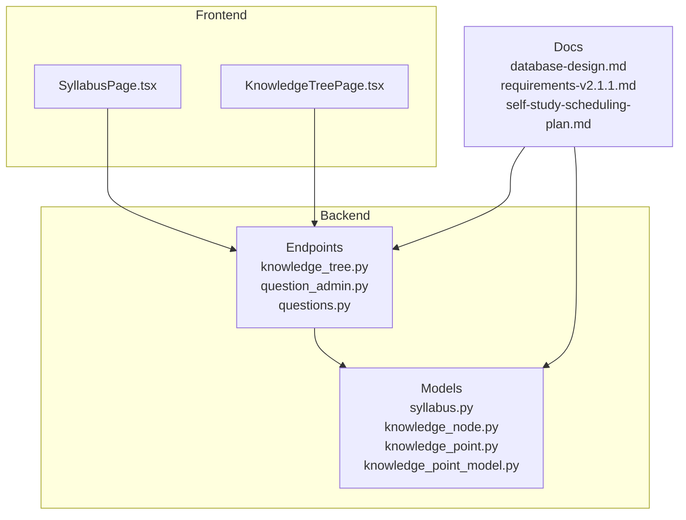
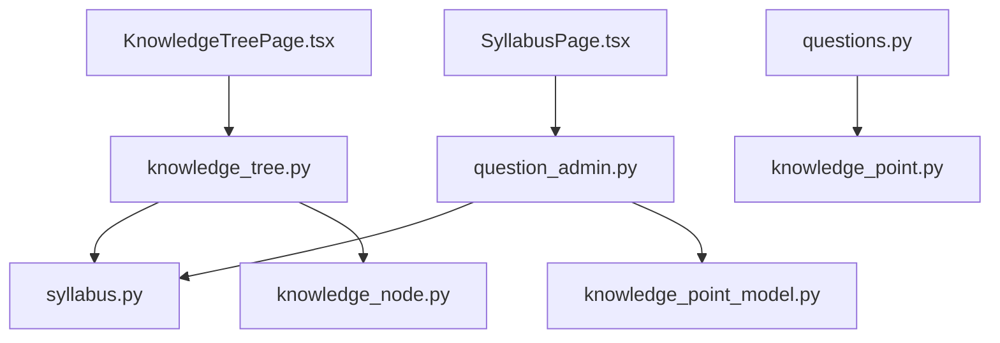
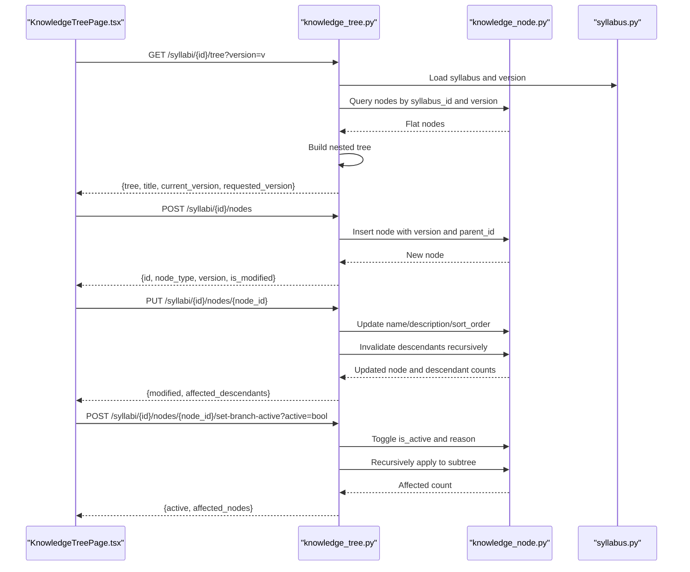
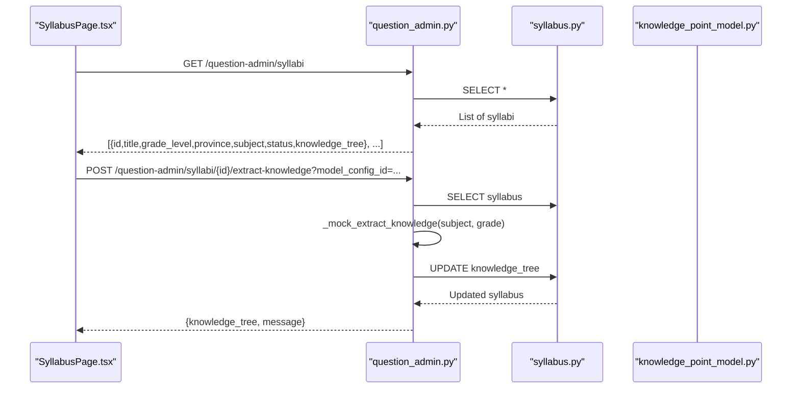
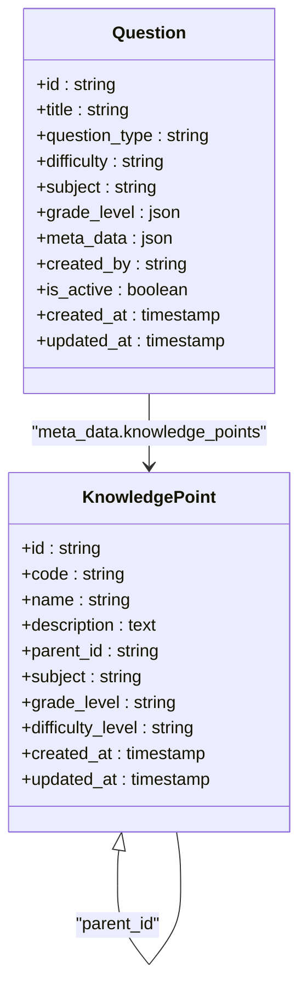
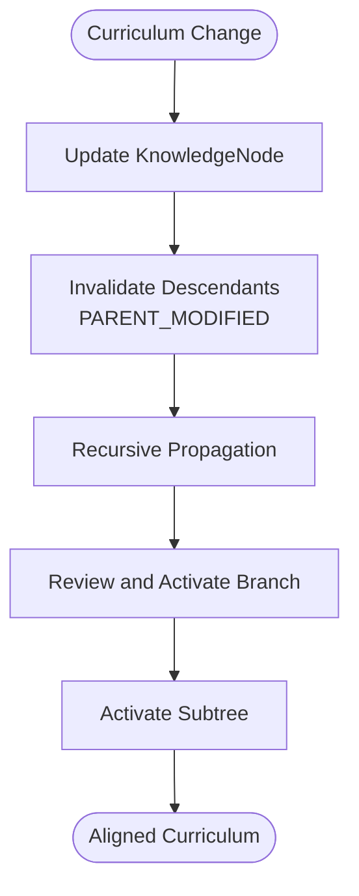
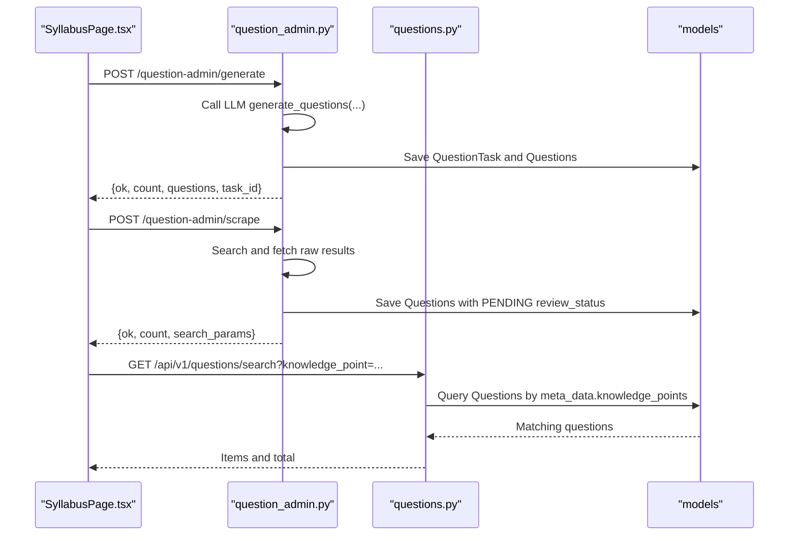
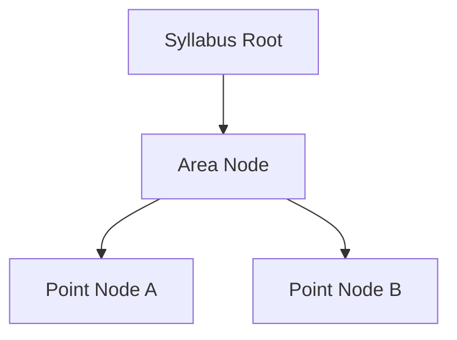
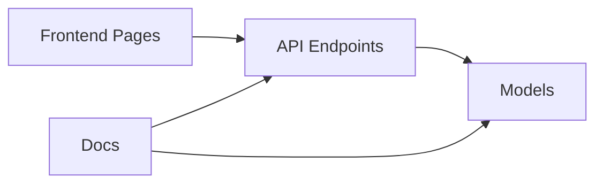

# Knowledge Management

<cite>
**Referenced Files in This Document**
- [knowledge_node.py](file://backend/app/models/knowledge_node.py)
- [knowledge_point.py](file://backend/app/models/knowledge_point.py)
- [knowledge_point_model.py](file://backend/app/models/knowledge_point_model.py)
- [syllabus.py](file://backend/app/models/syllabus.py)
- [knowledge_tree.py](file://backend/app/api/v1/endpoints/knowledge_tree.py)
- [question_admin.py](file://backend/app/api/v1/endpoints/question_admin.py)
- [questions.py](file://backend/app/api/v1/endpoints/questions.py)
- [KnowledgeTreePage.tsx](file://frontend/src/pages/admin/KnowledgeTreePage.tsx)
- [SyllabusPage.tsx](file://frontend/src/pages/admin/SyllabusPage.tsx)
- [database-design.md](file://docs/database-design.md)
- [requirements-v2.1.1.md](file://docs/requirements-v2.1.1.md)
- [self-study-scheduling-plan.md](file://docs/self-study-scheduling-plan.md)
</cite>

## Table of Contents
1. [Introduction](#introduction)
2. [Project Structure](#project-structure)
3. [Core Components](#core-components)
4. [Architecture Overview](#architecture-overview)
5. [Detailed Component Analysis](#detailed-component-analysis)
6. [Dependency Analysis](#dependency-analysis)
7. [Performance Considerations](#performance-considerations)
8. [Troubleshooting Guide](#troubleshooting-guide)
9. [Conclusion](#conclusion)
10. [Appendices](#appendices)

## Introduction
This document describes the knowledge management subsystem for curriculum mapping, knowledge node organization, and syllabus administration. It explains the hierarchical knowledge tree structure, node relationships, and content organization principles. It also covers the knowledge point system, competency mapping, and learning objective alignment; the syllabus management interface, curriculum version control, and content standardization processes; and the integration with question creation, exam preparation, and learning path generation. Finally, it documents the knowledge graph visualization, topic relationships, and prerequisite tracking, along with practical workflows and best practices.

## Project Structure
The knowledge management system spans backend models and APIs, frontend admin pages, and supporting documentation. The backend defines the data models for syllabi, knowledge nodes, knowledge points, and knowledge point models. The frontend provides admin interfaces for syllabus and knowledge tree management. The APIs expose CRUD and versioning operations for knowledge trees and integrate with question generation and syllabus content extraction.

**Diagram sources**
- [syllabus.py:9-26](file://backend/app/models/syllabus.py#L9-L26)
- [knowledge_node.py:9-26](file://backend/app/models/knowledge_node.py#L9-L26)
- [knowledge_point.py:7-27](file://backend/app/models/knowledge_point.py#L7-L27)
- [knowledge_point_model.py:8-29](file://backend/app/models/knowledge_point_model.py#L8-L29)
- [knowledge_tree.py:1-357](file://backend/app/api/v1/endpoints/knowledge_tree.py#L1-L357)
- [question_admin.py:1-800](file://backend/app/api/v1/endpoints/question_admin.py#L1-L800)
- [questions.py:1-431](file://backend/app/api/v1/endpoints/questions.py#L1-L431)
- [SyllabusPage.tsx:1-239](file://frontend/src/pages/admin/SyllabusPage.tsx#L1-L239)
- [KnowledgeTreePage.tsx:1-340](file://frontend/src/pages/admin/KnowledgeTreePage.tsx#L1-L340)
- [database-design.md:84-407](file://docs/database-design.md#L84-L407)
- [requirements-v2.1.1.md:58-196](file://docs/requirements-v2.1.1.md#L58-L196)
- [self-study-scheduling-plan.md:132-409](file://docs/self-study-scheduling-plan.md#L132-L409)

**Section sources**
- [SyllabusPage.tsx:1-239](file://frontend/src/pages/admin/SyllabusPage.tsx#L1-L239)
- [KnowledgeTreePage.tsx:1-340](file://frontend/src/pages/admin/KnowledgeTreePage.tsx#L1-L340)
- [knowledge_tree.py:1-357](file://backend/app/api/v1/endpoints/knowledge_tree.py#L1-L357)
- [question_admin.py:1-800](file://backend/app/api/v1/endpoints/question_admin.py#L1-L800)
- [database-design.md:84-407](file://docs/database-design.md#L84-L407)
- [requirements-v2.1.1.md:58-196](file://docs/requirements-v2.1.1.md#L58-L196)
- [self-study-scheduling-plan.md:132-409](file://docs/self-study-scheduling-plan.md#L132-L409)

## Core Components
- Syllabus: Represents a curriculum specification with metadata, content, and a knowledge tree snapshot. Supports versioning and current-state tracking.
- KnowledgeNode: Hierarchical nodes within a syllabus version, supporting area and point types, activation/inactivation, modification flags, and metadata.
- KnowledgePoint: Standalone knowledge entity with hierarchy, subject, grade level, and difficulty.
- KnowledgePointModel: Extracted knowledge modeling records from content, including confidence scores and content hashing for deduplication.
- Question: Questions linked to knowledge points and syllabus-grade scopes, enabling competency mapping and exam preparation.

Key relationships:
- Syllabus contains multiple KnowledgeNode entries per version.
- KnowledgeNode supports parent-child relationships and activation rules.
- KnowledgePoint supports parent-child hierarchy for prerequisites.
- Questions carry meta_data linking to knowledge points and grade scopes.

**Section sources**
- [syllabus.py:9-26](file://backend/app/models/syllabus.py#L9-L26)
- [knowledge_node.py:9-26](file://backend/app/models/knowledge_node.py#L9-L26)
- [knowledge_point.py:7-27](file://backend/app/models/knowledge_point.py#L7-L27)
- [knowledge_point_model.py:8-29](file://backend/app/models/knowledge_point_model.py#L8-L29)
- [database-design.md:84-407](file://docs/database-design.md#L84-L407)

## Architecture Overview
The system separates concerns across models, endpoints, and UI:
- Backend models define the persistent schema.
- Endpoints expose syllabus and knowledge tree operations, including versioning and branching activation.
- Frontend admin pages provide interactive management of syllabi and knowledge trees.
- Integration endpoints support knowledge extraction and question generation aligned with syllabi and knowledge nodes.

**Diagram sources**
- [SyllabusPage.tsx:1-239](file://frontend/src/pages/admin/SyllabusPage.tsx#L1-L239)
- [KnowledgeTreePage.tsx:1-340](file://frontend/src/pages/admin/KnowledgeTreePage.tsx#L1-L340)
- [knowledge_tree.py:1-357](file://backend/app/api/v1/endpoints/knowledge_tree.py#L1-L357)
- [question_admin.py:1-800](file://backend/app/api/v1/endpoints/question_admin.py#L1-L800)
- [questions.py:1-431](file://backend/app/api/v1/endpoints/questions.py#L1-L431)
- [syllabus.py:9-26](file://backend/app/models/syllabus.py#L9-L26)
- [knowledge_node.py:9-26](file://backend/app/models/knowledge_node.py#L9-L26)
- [knowledge_point.py:7-27](file://backend/app/models/knowledge_point.py#L7-L27)
- [knowledge_point_model.py:8-29](file://backend/app/models/knowledge_point_model.py#L8-L29)

## Detailed Component Analysis

### Knowledge Tree Management
The knowledge tree is versioned per syllabus and supports hierarchical nodes with activation controls and invalidation propagation. The backend API provides:
- Retrieval of a knowledge tree for a requested version.
- Creation, update, deletion, and branch activation toggles.
- New version creation by copying active nodes and rolling back to historical versions.

The frontend renders the tree with icons, status badges, and context menus for editing, adding children, activating/deactivating branches, and deleting subtrees.

**Diagram sources**
- [knowledge_tree.py:37-320](file://backend/app/api/v1/endpoints/knowledge_tree.py#L37-L320)
- [knowledge_node.py:9-26](file://backend/app/models/knowledge_node.py#L9-L26)
- [syllabus.py:9-26](file://backend/app/models/syllabus.py#L9-L26)
- [KnowledgeTreePage.tsx:54-128](file://frontend/src/pages/admin/KnowledgeTreePage.tsx#L54-L128)

**Section sources**
- [knowledge_tree.py:1-357](file://backend/app/api/v1/endpoints/knowledge_tree.py#L1-L357)
- [KnowledgeTreePage.tsx:1-340](file://frontend/src/pages/admin/KnowledgeTreePage.tsx#L1-L340)

### Syllabus Administration and Content Standardization
The syllabus module stores curriculum metadata, content, and a knowledge tree snapshot. The admin page enables:
- Creating, listing, retrieving, and updating syllabi.
- Extracting knowledge from syllabus content into a knowledge tree (mocked LLM integration).
- Filtering and searching syllabi by grade, province, subject, and status.
- Rendering a knowledge tree preview for quick validation.

**Diagram sources**
- [question_admin.py:85-124](file://backend/app/api/v1/endpoints/question_admin.py#L85-L124)
- [syllabus.py:9-26](file://backend/app/models/syllabus.py#L9-L26)
- [SyllabusPage.tsx:104-114](file://frontend/src/pages/admin/SyllabusPage.tsx#L104-L114)

**Section sources**
- [question_admin.py:23-106](file://backend/app/api/v1/endpoints/question_admin.py#L23-L106)
- [SyllabusPage.tsx:1-239](file://frontend/src/pages/admin/SyllabusPage.tsx#L1-L239)
- [database-design.md:84-106](file://docs/database-design.md#L84-L106)

### Knowledge Point System and Competency Mapping
Knowledge points are hierarchical entities with subject and grade indexing. They support:
- Parent-child relationships for prerequisites.
- Difficulty levels and optional descriptions.
- Integration with question meta_data for competency mapping.

**Diagram sources**
- [knowledge_point.py:7-27](file://backend/app/models/knowledge_point.py#L7-L27)
- [questions.py:17-36](file://backend/app/api/v1/endpoints/questions.py#L17-L36)
- [database-design.md:84-152](file://docs/database-design.md#L84-L152)

**Section sources**
- [knowledge_point.py:7-27](file://backend/app/models/knowledge_point.py#L7-L27)
- [database-design.md:84-152](file://docs/database-design.md#L84-L152)
- [questions.py:17-36](file://backend/app/api/v1/endpoints/questions.py#L17-L36)

### Learning Objective Alignment and Prerequisite Tracking
Learning objectives are represented by KnowledgeNode entries under a syllabus version. Activation and invalidation propagate down the tree to reflect curriculum changes. KnowledgePoint parent relationships capture prerequisites. The system supports:
- Aligning questions to knowledge nodes via meta_data.
- Tracking prerequisite knowledge via KnowledgePoint parent links.
- Maintaining versioned knowledge trees for curriculum traceability.

**Diagram sources**
- [knowledge_tree.py:131-177](file://backend/app/api/v1/endpoints/knowledge_tree.py#L131-L177)
- [knowledge_node.py:19-21](file://backend/app/models/knowledge_node.py#L19-L21)

**Section sources**
- [knowledge_tree.py:131-177](file://backend/app/api/v1/endpoints/knowledge_tree.py#L131-L177)
- [knowledge_node.py:19-21](file://backend/app/models/knowledge_node.py#L19-L21)

### Integration with Question Creation and Exam Preparation
The system integrates knowledge management with question workflows:
- Knowledge extraction from syllabi to populate knowledge trees.
- Question generation using knowledge points and grade scopes.
- Scraper-based question import with auto-save and review status.
- Deduplication scanning and merging for question quality.

**Diagram sources**
- [question_admin.py:138-218](file://backend/app/api/v1/endpoints/question_admin.py#L138-L218)
- [question_admin.py:417-474](file://backend/app/api/v1/endpoints/question_admin.py#L417-L474)
- [questions.py:39-104](file://backend/app/api/v1/endpoints/questions.py#L39-L104)
- [SyllabusPage.tsx:104-114](file://frontend/src/pages/admin/SyllabusPage.tsx#L104-L114)

**Section sources**
- [question_admin.py:138-218](file://backend/app/api/v1/endpoints/question_admin.py#L138-L218)
- [question_admin.py:417-474](file://backend/app/api/v1/endpoints/question_admin.py#L417-L474)
- [questions.py:39-104](file://backend/app/api/v1/endpoints/questions.py#L39-L104)
- [SyllabusPage.tsx:104-114](file://frontend/src/pages/admin/SyllabusPage.tsx#L104-L114)

### Knowledge Graph Visualization and Topic Relationships
The frontend renders the knowledge tree with:
- Icons indicating node types (area vs point).
- Status badges for activation and invalidation reasons.
- Context menus for editing, adding children, activating/deactivating, and deleting.
- A right panel displaying node details and actions.

**Diagram sources**
- [KnowledgeTreePage.tsx:140-178](file://frontend/src/pages/admin/KnowledgeTreePage.tsx#L140-L178)
- [knowledge_tree.py:16-34](file://backend/app/api/v1/endpoints/knowledge_tree.py#L16-L34)

**Section sources**
- [KnowledgeTreePage.tsx:1-340](file://frontend/src/pages/admin/KnowledgeTreePage.tsx#L1-L340)
- [knowledge_tree.py:16-34](file://backend/app/api/v1/endpoints/knowledge_tree.py#L16-L34)

## Dependency Analysis
The system exhibits clear separation of concerns:
- Models define persistence and relationships.
- Endpoints encapsulate business logic for syllabi, knowledge trees, and question workflows.
- Frontend pages consume endpoints and render UI.
- Documentation enforces schema and API contracts.

**Diagram sources**
- [database-design.md:84-407](file://docs/database-design.md#L84-L407)
- [requirements-v2.1.1.md:58-196](file://docs/requirements-v2.1.1.md#L58-L196)
- [knowledge_tree.py:1-357](file://backend/app/api/v1/endpoints/knowledge_tree.py#L1-L357)
- [question_admin.py:1-800](file://backend/app/api/v1/endpoints/question_admin.py#L1-L800)

**Section sources**
- [database-design.md:84-407](file://docs/database-design.md#L84-L407)
- [requirements-v2.1.1.md:58-196](file://docs/requirements-v2.1.1.md#L58-L196)
- [knowledge_tree.py:1-357](file://backend/app/api/v1/endpoints/knowledge_tree.py#L1-L357)
- [question_admin.py:1-800](file://backend/app/api/v1/endpoints/question_admin.py#L1-L800)

## Performance Considerations
- Indexing: Ensure indexes on syllabus_id/version, parent_id, subject, grade_level, and content_hash to optimize queries for tree traversal, filtering, and deduplication.
- Pagination: Limit query result sizes (e.g., 200 per page) to avoid heavy payloads.
- JSONB queries: Use targeted filters and projections to minimize parsing overhead.
- Asynchronous operations: Offload long-running tasks (e.g., LLM calls, scraping) to background services to keep API responses responsive.
- Caching: Cache frequently accessed syllabi and knowledge trees for short periods to reduce database load.

## Troubleshooting Guide
Common issues and resolutions:
- Knowledge tree not loading: Verify syllabus exists and version is valid; check endpoint permissions and database connectivity.
- Node updates fail: Ensure the current user has sufficient privileges; confirm node exists and is not already inactive.
- Branch activation errors: Confirm the node exists and is not already in the desired state; check recursive activation logs.
- Syllabus extraction failures: Validate content availability and mock LLM integration; inspect returned error messages.
- Question generation timeouts: Reduce count, verify LLM endpoint availability, and retry with smaller batches.
- Duplicate questions: Use deduplication endpoints to scan and merge similar questions.

**Section sources**
- [knowledge_tree.py:44-47](file://backend/app/api/v1/endpoints/knowledge_tree.py#L44-L47)
- [knowledge_tree.py:105-106](file://backend/app/api/v1/endpoints/knowledge_tree.py#L105-L106)
- [question_admin.py:92-97](file://backend/app/api/v1/endpoints/question_admin.py#L92-L97)
- [question_admin.py:155-164](file://backend/app/api/v1/endpoints/question_admin.py#L155-L164)
- [question_admin.py:730-797](file://backend/app/api/v1/endpoints/question_admin.py#L730-L797)

## Conclusion
The knowledge management system provides a robust foundation for curriculum mapping, knowledge node organization, and syllabus administration. Its versioned knowledge tree, activation controls, and integration with question workflows enable standardized content management, competency alignment, and exam preparation. The frontend interfaces streamline administrative tasks, while the backend APIs and models ensure scalability and maintainability.

## Appendices

### Curriculum Design Workflows
- Define syllabus metadata (title, grade, province, subject).
- Extract knowledge from syllabus content into a knowledge tree.
- Organize topics into areas and points; activate relevant branches.
- Create new versions after curriculum changes; roll back if needed.
- Map questions to knowledge points and grade scopes for competency alignment.

**Section sources**
- [question_admin.py:85-124](file://backend/app/api/v1/endpoints/question_admin.py#L85-L124)
- [knowledge_tree.py:199-250](file://backend/app/api/v1/endpoints/knowledge_tree.py#L199-L250)
- [requirements-v2.1.1.md:166-170](file://docs/requirements-v2.1.1.md#L166-L170)

### Knowledge Mapping Strategies
- Use KnowledgeNode to represent learning objectives and topics.
- Use KnowledgePoint to represent atomic competencies with prerequisites.
- Link questions to knowledge points via meta_data for reporting and analytics.
- Maintain separate subject and grade-level indices for efficient filtering.

**Section sources**
- [knowledge_point.py:7-27](file://backend/app/models/knowledge_point.py#L7-L27)
- [questions.py:17-36](file://backend/app/api/v1/endpoints/questions.py#L17-L36)
- [database-design.md:84-152](file://docs/database-design.md#L84-L152)

### Content Organization Best Practices
- Keep node names concise and consistent; use clear descriptions for complex topics.
- Prefer hierarchical organization (areas containing points) for readability.
- Activate only intended branches; invalidate descendants upon parent changes.
- Use version control to preserve historical curriculum states.
- Standardize knowledge point codes and difficulty levels across teams.

**Section sources**
- [knowledge_node.py:15-23](file://backend/app/models/knowledge_node.py#L15-L23)
- [knowledge_tree.py:131-177](file://backend/app/api/v1/endpoints/knowledge_tree.py#L131-L177)
- [requirements-v2.1.1.md:58-82](file://docs/requirements-v2.1.1.md#L58-L82)