# Knowledge Node Trees

<cite>
**Referenced Files in This Document**
- [knowledge_node.py](file://backend/app/models/knowledge_node.py)
- [knowledge_tree.py](file://backend/app/api/v1/endpoints/knowledge_tree.py)
- [syllabus.py](file://backend/app/models/syllabus.py)
- [KnowledgeTreePage.tsx](file://frontend/src/pages/admin/KnowledgeTreePage.tsx)
- [001_v22_initial.py](file://backend/alembic/versions/001_v22_initial.py)
</cite>

## Table of Contents
1. [Introduction](#introduction)
2. [Project Structure](#project-structure)
3. [Core Components](#core-components)
4. [Architecture Overview](#architecture-overview)
5. [Detailed Component Analysis](#detailed-component-analysis)
6. [Dependency Analysis](#dependency-analysis)
7. [Performance Considerations](#performance-considerations)
8. [Troubleshooting Guide](#troubleshooting-guide)
9. [Conclusion](#conclusion)
10. [Appendices](#appendices)

## Introduction
This document describes the Knowledge Node Trees system used to model hierarchical educational content. It covers the KnowledgeNode model, node relationships, tree traversal and serialization, node activation/deactivation, invalidation mechanisms, versioning and tree rebuilding, sorting/order management, and practical operations for creation, navigation, bulk operations, and maintenance.

## Project Structure
The Knowledge Node Trees feature spans backend SQLAlchemy models, FastAPI endpoints, and a React-based admin UI page:
- Backend models define KnowledgeNode and Syllabus entities and their persistence.
- Backend API endpoints expose CRUD and tree operations, including versioning and invalidation propagation.
- Frontend admin page renders the tree, supports node editing and branch activation toggling, and triggers backend operations.

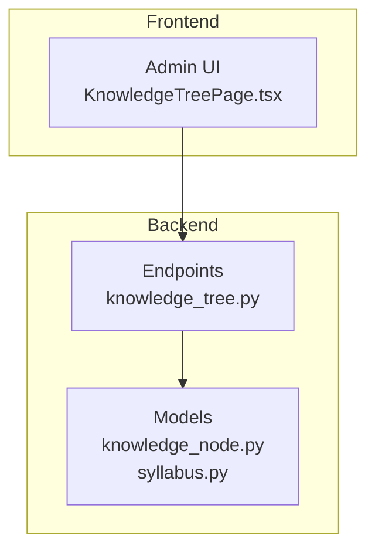

**Diagram sources**
- [knowledge_node.py:1-26](file://backend/app/models/knowledge_node.py#L1-L26)
- [syllabus.py:1-26](file://backend/app/models/syllabus.py#L1-L26)
- [knowledge_tree.py:1-357](file://backend/app/api/v1/endpoints/knowledge_tree.py#L1-L357)
- [KnowledgeTreePage.tsx:1-340](file://frontend/src/pages/admin/KnowledgeTreePage.tsx#L1-L340)

**Section sources**
- [knowledge_node.py:1-26](file://backend/app/models/knowledge_node.py#L1-L26)
- [syllabus.py:1-26](file://backend/app/models/syllabus.py#L1-L26)
- [knowledge_tree.py:1-357](file://backend/app/api/v1/endpoints/knowledge_tree.py#L1-L357)
- [KnowledgeTreePage.tsx:1-340](file://frontend/src/pages/admin/KnowledgeTreePage.tsx#L1-L340)

## Core Components
- KnowledgeNode: Represents a single node in the knowledge tree with parent-child relationships, type classification, activation state, invalidation reasons, modification tracking, ordering, and metadata.
- Syllabus: Represents an educational curriculum with versioning and a chain of parent/child versions for rollback support.
- KnowledgeTree API: Provides endpoints to fetch the nested tree, create/update/delete nodes, activate/deactivate subtrees, and manage versions.

Key attributes and behaviors:
- Node type system: AREA (container) and POINT (leaf).
- Parent-child hierarchy via parent_id referencing another KnowledgeNode id.
- Sorting via sort_order integer.
- Activation and invalidation: is_active with invalid_reason values (PARENT_MODIFIED, MANUAL, VERSION_CUT).
- Modification tracking: is_modified flag and updated_at timestamps.
- Versioning: nodes carry version; Syllabus tracks current version and parent_syllabus_id for rollback.

**Section sources**
- [knowledge_node.py:9-26](file://backend/app/models/knowledge_node.py#L9-L26)
- [syllabus.py:9-26](file://backend/app/models/syllabus.py#L9-L26)
- [knowledge_tree.py:37-64](file://backend/app/api/v1/endpoints/knowledge_tree.py#L37-L64)
- [knowledge_tree.py:67-94](file://backend/app/api/v1/endpoints/knowledge_tree.py#L67-L94)
- [knowledge_tree.py:97-128](file://backend/app/api/v1/endpoints/knowledge_tree.py#L97-L128)
- [knowledge_tree.py:147-177](file://backend/app/api/v1/endpoints/knowledge_tree.py#L147-L177)
- [knowledge_tree.py:180-196](file://backend/app/api/v1/endpoints/knowledge_tree.py#L180-L196)
- [knowledge_tree.py:199-250](file://backend/app/api/v1/endpoints/knowledge_tree.py#L199-L250)
- [knowledge_tree.py:253-319](file://backend/app/api/v1/endpoints/knowledge_tree.py#L253-L319)
- [knowledge_tree.py:322-356](file://backend/app/api/v1/endpoints/knowledge_tree.py#L322-L356)

## Architecture Overview
The system follows a layered architecture:
- Data layer: SQLAlchemy models persist KnowledgeNode and Syllabus.
- Service/API layer: FastAPI endpoints orchestrate tree operations, invalidation propagation, and versioning.
- Presentation layer: Admin UI renders the tree and triggers operations.

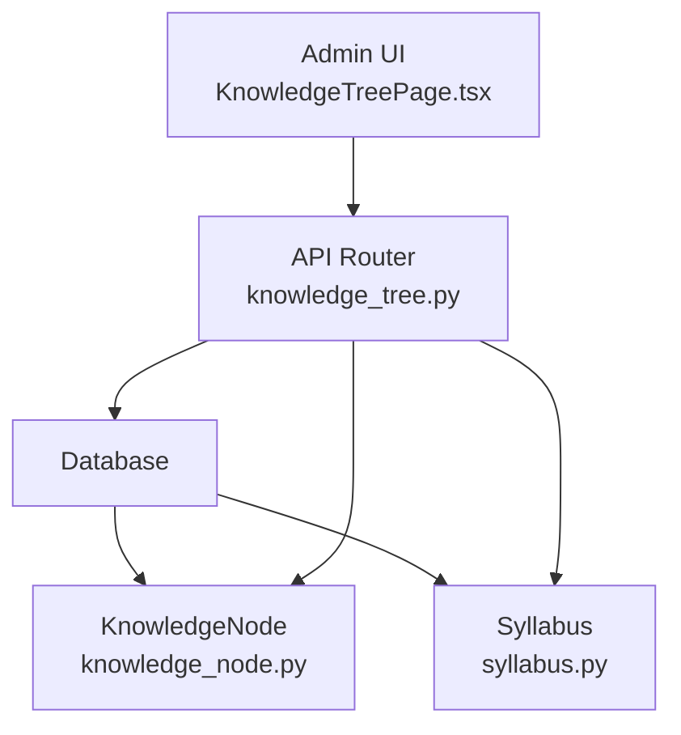

**Diagram sources**
- [knowledge_tree.py:13-13](file://backend/app/api/v1/endpoints/knowledge_tree.py#L13-L13)
- [knowledge_node.py:9-26](file://backend/app/models/knowledge_node.py#L9-L26)
- [syllabus.py:9-26](file://backend/app/models/syllabus.py#L9-L26)

## Detailed Component Analysis

### KnowledgeNode Model
The KnowledgeNode entity defines the schema for tree nodes:
- Identity: id (UUID string)
- Hierarchy: syllabus_id (foreign key to Syllabus), parent_id (self-referencing foreign key)
- Content: name, node_type (AREA or POINT), description, meta_data (JSON)
- Ordering: sort_order (integer)
- Versioning: version (integer)
- Activation and invalidation: is_active (boolean), invalid_reason (enum-like string)
- Modification tracking: is_modified (boolean), updated_at (timestamp)
- Audit: created_at (timestamp)

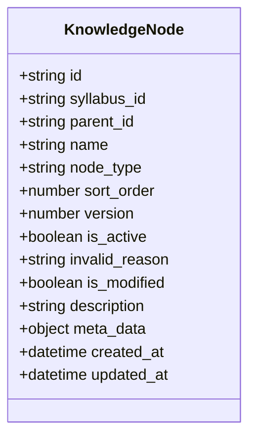

**Diagram sources**
- [knowledge_node.py:9-26](file://backend/app/models/knowledge_node.py#L9-L26)

**Section sources**
- [knowledge_node.py:9-26](file://backend/app/models/knowledge_node.py#L9-L26)
- [001_v22_initial.py:345-362](file://backend/alembic/versions/001_v22_initial.py#L345-L362)

### Syllabus Model and Versioning
The Syllabus entity supports versioning and rollback:
- Identity: id (UUID string)
- Metadata: title, grade_level, province, subject, content, knowledge_tree (JSON)
- Lifecycle: status, version, is_current, parent_syllabus_id
- Audit: created_by, created_at, updated_at

Versioning mechanics:
- New versions are created by copying active nodes from the previous version into a new Syllabus record.
- Rollback navigates the parent chain to locate a target version and marks it as current.

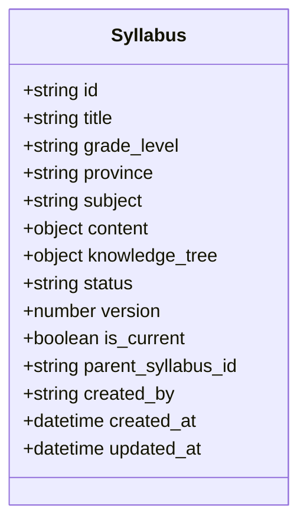

**Diagram sources**
- [syllabus.py:9-26](file://backend/app/models/syllabus.py#L9-L26)

**Section sources**
- [syllabus.py:9-26](file://backend/app/models/syllabus.py#L9-L26)
- [knowledge_tree.py:199-250](file://backend/app/api/v1/endpoints/knowledge_tree.py#L199-L250)
- [knowledge_tree.py:253-319](file://backend/app/api/v1/endpoints/knowledge_tree.py#L253-L319)
- [knowledge_tree.py:322-356](file://backend/app/api/v1/endpoints/knowledge_tree.py#L322-L356)

### Tree Serialization and Navigation
The API endpoint converts flat nodes into a nested tree structure:
- Flat retrieval: Nodes filtered by syllabus_id and version, ordered by sort_order.
- Nested conversion: Recursive assembly of children keyed by parent_id.
- Output shape: Array of nodes with key, title, node_type, is_active, invalid_reason, is_modified, sort_order, description, children, isLeaf.

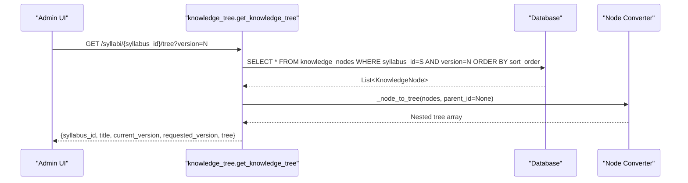

**Diagram sources**
- [knowledge_tree.py:37-64](file://backend/app/api/v1/endpoints/knowledge_tree.py#L37-L64)
- [knowledge_tree.py:16-34](file://backend/app/api/v1/endpoints/knowledge_tree.py#L16-L34)

**Section sources**
- [knowledge_tree.py:37-64](file://backend/app/api/v1/endpoints/knowledge_tree.py#L37-L64)
- [knowledge_tree.py:16-34](file://backend/app/api/v1/endpoints/knowledge_tree.py#L16-L34)

### Node Type System and Relationships
- Types: AREA (container node), POINT (leaf node).
- Relationship: parent_id references another KnowledgeNode id; root nodes have parent_id NULL.
- Leaf detection: isLeaf computed as (node_type == "POINT" and children length == 0).

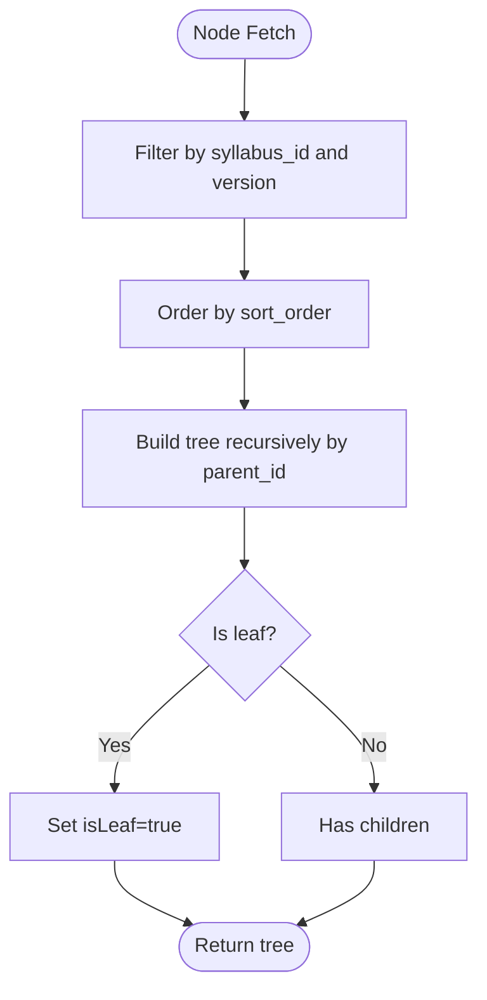

**Diagram sources**
- [knowledge_tree.py:16-34](file://backend/app/api/v1/endpoints/knowledge_tree.py#L16-L34)

**Section sources**
- [knowledge_tree.py:16-34](file://backend/app/api/v1/endpoints/knowledge_tree.py#L16-L34)
- [knowledge_node.py:16](file://backend/app/models/knowledge_node.py#L16)

### Node Activation/Deactivation and Invalidation
- Manual activation toggle: Sets is_active and clears invalid_reason when active; sets invalid_reason to MANUAL when inactive.
- Invalidation propagation: On node update, all descendants are recursively marked inactive with invalid_reason PARENT_MODIFIED.
- Deletion: Marks subtree inactive and overrides invalid_reason to MANUAL for the deleted node.

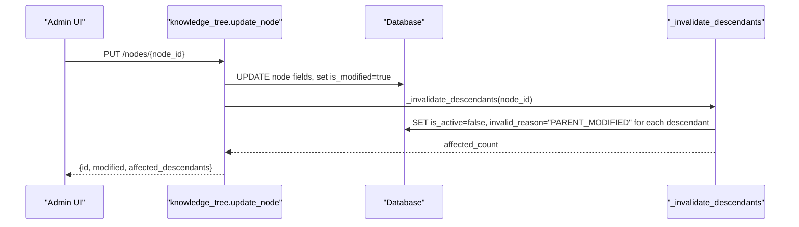

**Diagram sources**
- [knowledge_tree.py:97-128](file://backend/app/api/v1/endpoints/knowledge_tree.py#L97-L128)
- [knowledge_tree.py:131-144](file://backend/app/api/v1/endpoints/knowledge_tree.py#L131-L144)

**Section sources**
- [knowledge_tree.py:97-128](file://backend/app/api/v1/endpoints/knowledge_tree.py#L97-L128)
- [knowledge_tree.py:131-144](file://backend/app/api/v1/endpoints/knowledge_tree.py#L131-L144)
- [knowledge_tree.py:147-177](file://backend/app/api/v1/endpoints/knowledge_tree.py#L147-L177)
- [knowledge_tree.py:180-196](file://backend/app/api/v1/endpoints/knowledge_tree.py#L180-L196)

### Tree Manipulation Operations
- Create node: Validates syllabus existence, creates node with provided parent_id and sort_order, sets is_modified, persists, and returns node metadata.
- Update node: Validates node existence, updates name/description/sort_order, marks is_modified, invalidates descendants, and refreshes.
- Delete node: Deactivates subtree and sets invalid_reason to MANUAL for the deleted node.
- Toggle branch active: Recursively activates or deactivates a subtree and updates invalid_reason accordingly.

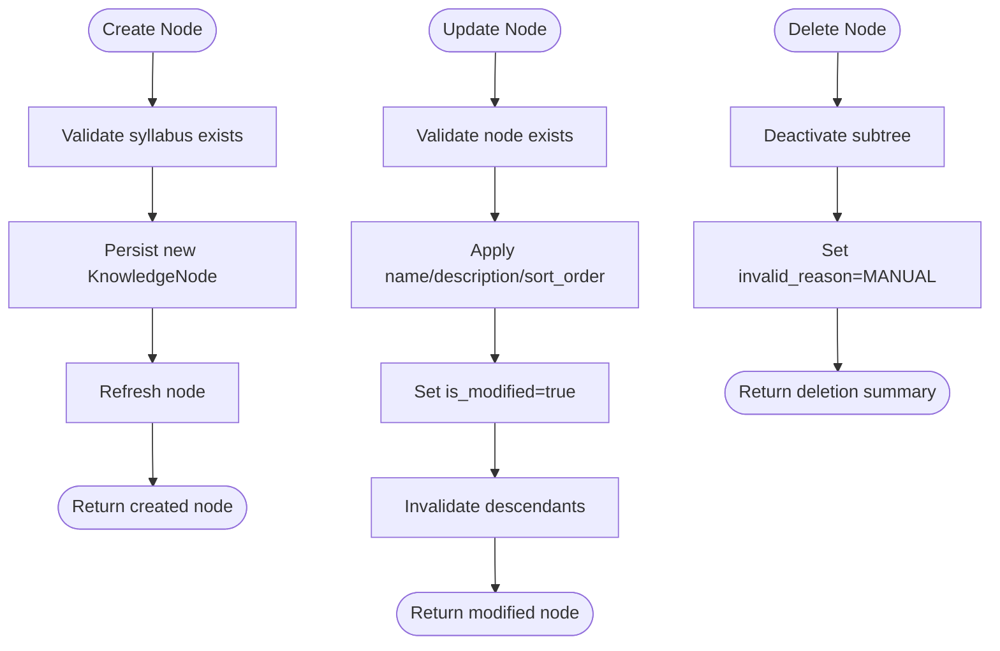

**Diagram sources**
- [knowledge_tree.py:67-94](file://backend/app/api/v1/endpoints/knowledge_tree.py#L67-L94)
- [knowledge_tree.py:97-128](file://backend/app/api/v1/endpoints/knowledge_tree.py#L97-L128)
- [knowledge_tree.py:180-196](file://backend/app/api/v1/endpoints/knowledge_tree.py#L180-L196)

**Section sources**
- [knowledge_tree.py:67-94](file://backend/app/api/v1/endpoints/knowledge_tree.py#L67-L94)
- [knowledge_tree.py:97-128](file://backend/app/api/v1/endpoints/knowledge_tree.py#L97-L128)
- [knowledge_tree.py:180-196](file://backend/app/api/v1/endpoints/knowledge_tree.py#L180-L196)

### Version Management and Tree Rebuilding
- New version: Copies active nodes from the current version into a new Syllabus with incremented version, marks old as not current, and persists copies.
- Rollback: Navigates parent chain to find target version, sets all versions in chain to not current, then sets target to current.
- Versions listing: Traverses up to root and down to latest to enumerate all sibling versions.

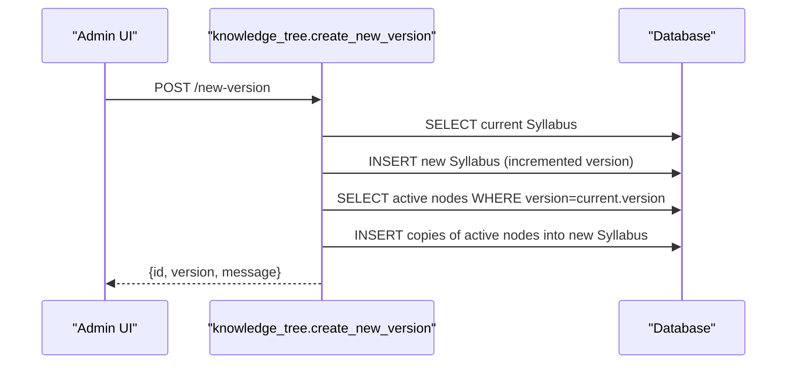

**Diagram sources**
- [knowledge_tree.py:199-250](file://backend/app/api/v1/endpoints/knowledge_tree.py#L199-L250)

**Section sources**
- [knowledge_tree.py:199-250](file://backend/app/api/v1/endpoints/knowledge_tree.py#L199-L250)
- [knowledge_tree.py:253-319](file://backend/app/api/v1/endpoints/knowledge_tree.py#L253-L319)
- [knowledge_tree.py:322-356](file://backend/app/api/v1/endpoints/knowledge_tree.py#L322-L356)

### Node Sorting and Order Management
- Sorting: Nodes are ordered by sort_order during retrieval; the converter also sorts by sort_order and name for deterministic rendering.
- Order management: sort_order can be provided during creation and updated via node updates.

**Section sources**
- [knowledge_tree.py:53](file://backend/app/api/v1/endpoints/knowledge_tree.py#L53)
- [knowledge_tree.py:19](file://backend/app/api/v1/endpoints/knowledge_tree.py#L19)
- [knowledge_tree.py:67-94](file://backend/app/api/v1/endpoints/knowledge_tree.py#L67-L94)
- [knowledge_tree.py:97-128](file://backend/app/api/v1/endpoints/knowledge_tree.py#L97-L128)

### Frontend Integration and User Experience
The admin page provides:
- Syllabus and version selection with version history listing.
- Tree rendering with icons, activity badges, and invalidation indicators.
- Context menu actions: edit, add child, activate/deactivate subtree, delete subtree.
- Forms for creating/editing nodes with type selection (AREA/POINT), description, and sort_order.

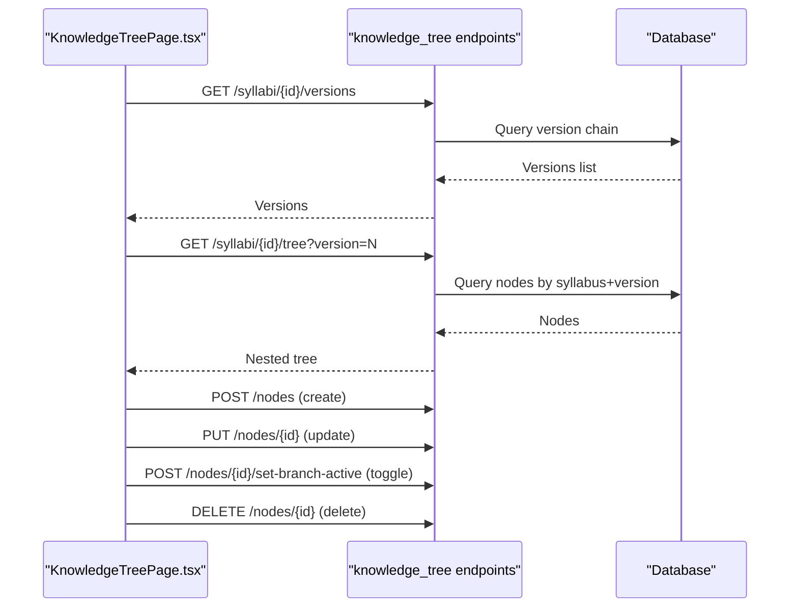

**Diagram sources**
- [KnowledgeTreePage.tsx:50-76](file://frontend/src/pages/admin/KnowledgeTreePage.tsx#L50-L76)
- [KnowledgeTreePage.tsx:54-65](file://frontend/src/pages/admin/KnowledgeTreePage.tsx#L54-L65)
- [KnowledgeTreePage.tsx:94-128](file://frontend/src/pages/admin/KnowledgeTreePage.tsx#L94-L128)
- [knowledge_tree.py:37-64](file://backend/app/api/v1/endpoints/knowledge_tree.py#L37-L64)
- [knowledge_tree.py:67-94](file://backend/app/api/v1/endpoints/knowledge_tree.py#L67-L94)
- [knowledge_tree.py:97-128](file://backend/app/api/v1/endpoints/knowledge_tree.py#L97-L128)
- [knowledge_tree.py:147-177](file://backend/app/api/v1/endpoints/knowledge_tree.py#L147-L177)
- [knowledge_tree.py:180-196](file://backend/app/api/v1/endpoints/knowledge_tree.py#L180-L196)

**Section sources**
- [KnowledgeTreePage.tsx:1-340](file://frontend/src/pages/admin/KnowledgeTreePage.tsx#L1-L340)
- [knowledge_tree.py:37-64](file://backend/app/api/v1/endpoints/knowledge_tree.py#L37-L64)
- [knowledge_tree.py:67-94](file://backend/app/api/v1/endpoints/knowledge_tree.py#L67-L94)
- [knowledge_tree.py:97-128](file://backend/app/api/v1/endpoints/knowledge_tree.py#L97-L128)
- [knowledge_tree.py:147-177](file://backend/app/api/v1/endpoints/knowledge_tree.py#L147-L177)
- [knowledge_tree.py:180-196](file://backend/app/api/v1/endpoints/knowledge_tree.py#L180-L196)

## Dependency Analysis
- KnowledgeNode depends on Syllabus via syllabus_id and on itself via parent_id.
- API endpoints depend on KnowledgeNode and Syllabus models for queries and mutations.
- Frontend depends on API endpoints for tree data and operations.

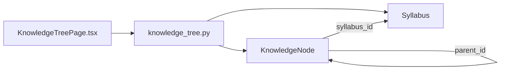

**Diagram sources**
- [knowledge_tree.py:37-64](file://backend/app/api/v1/endpoints/knowledge_tree.py#L37-L64)
- [knowledge_node.py:13](file://backend/app/models/knowledge_node.py#L13)
- [knowledge_node.py:14](file://backend/app/models/knowledge_node.py#L14)
- [syllabus.py:12](file://backend/app/models/syllabus.py#L12)

**Section sources**
- [knowledge_node.py:13-14](file://backend/app/models/knowledge_node.py#L13-L14)
- [syllabus.py:12](file://backend/app/models/syllabus.py#L12)
- [knowledge_tree.py:37-64](file://backend/app/api/v1/endpoints/knowledge_tree.py#L37-L64)

## Performance Considerations
- Indexing: parent_id and syllabus_id are indexed to speed up filtering and recursion.
- Sorting: sort_order ordering reduces UI rendering overhead.
- Invalidation propagation: recursive invalidation scales with subtree size; consider batching or limiting depth for very large branches.
- Version copy: copying active nodes on new version is proportional to active node count; monitor for large trees.

[No sources needed since this section provides general guidance]

## Troubleshooting Guide
Common issues and resolutions:
- Node not found: Ensure node_id exists before update/delete; API raises 404 if missing.
- Permission denied: Only QUESTION_ADMIN or SYS_ADMIN can modify nodes; API raises 403 otherwise.
- Parent modification invalidation: Updating a node invalidates all descendants; confirm impact before making changes.
- Version rollback: Target version must exist in the current version chain; API raises 404 if not found.
- Tree not rendering: Verify syllabus/version selection and that nodes exist for the chosen version.

**Section sources**
- [knowledge_tree.py:46-47](file://backend/app/api/v1/endpoints/knowledge_tree.py#L46-L47)
- [knowledge_tree.py:75-76](file://backend/app/api/v1/endpoints/knowledge_tree.py#L75-L76)
- [knowledge_tree.py:105-106](file://backend/app/api/v1/endpoints/knowledge_tree.py#L105-L106)
- [knowledge_tree.py:110](file://backend/app/api/v1/endpoints/knowledge_tree.py#L110)
- [knowledge_tree.py:261-262](file://backend/app/api/v1/endpoints/knowledge_tree.py#L261-L262)
- [knowledge_tree.py:298-299](file://backend/app/api/v1/endpoints/knowledge_tree.py#L298-L299)

## Conclusion
The Knowledge Node Trees system provides a robust, versioned, and activatable hierarchical structure for educational content. It supports efficient tree navigation, controlled invalidation propagation, and lifecycle management through versioning and rollback. The frontend offers an intuitive interface for managing nodes and branches, enabling maintainable and scalable knowledge organization.

[No sources needed since this section summarizes without analyzing specific files]

## Appendices

### API Reference Summary
- GET /syllabi/{syllabus_id}/tree: Returns nested tree for a syllabus version.
- POST /syllabi/{syllabus_id}/nodes: Creates a node under a parent with provided sort_order.
- PUT /syllabi/{syllabus_id}/nodes/{node_id}: Updates node fields and invalidates descendants.
- POST /syllabi/{syllabus_id}/nodes/{node_id}/set-branch-active: Activates or deactivates a subtree.
- DELETE /syllabi/{syllabus_id}/nodes/{node_id}: Deletes a subtree and marks it inactive.
- POST /syllabi/{syllabus_id}/new-version: Creates a new version by copying active nodes.
- PUT /syllabi/{syllabus_id}/rollback: Rolls back to a specific historical version.
- GET /syllabi/{syllabus_id}/versions: Lists all versions in the chain.

**Section sources**
- [knowledge_tree.py:37-64](file://backend/app/api/v1/endpoints/knowledge_tree.py#L37-L64)
- [knowledge_tree.py:67-94](file://backend/app/api/v1/endpoints/knowledge_tree.py#L67-L94)
- [knowledge_tree.py:97-128](file://backend/app/api/v1/endpoints/knowledge_tree.py#L97-L128)
- [knowledge_tree.py:147-177](file://backend/app/api/v1/endpoints/knowledge_tree.py#L147-L177)
- [knowledge_tree.py:180-196](file://backend/app/api/v1/endpoints/knowledge_tree.py#L180-L196)
- [knowledge_tree.py:199-250](file://backend/app/api/v1/endpoints/knowledge_tree.py#L199-L250)
- [knowledge_tree.py:253-319](file://backend/app/api/v1/endpoints/knowledge_tree.py#L253-L319)
- [knowledge_tree.py:322-356](file://backend/app/api/v1/endpoints/knowledge_tree.py#L322-L356)