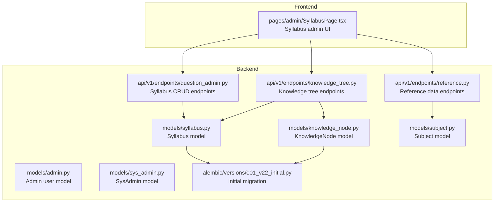
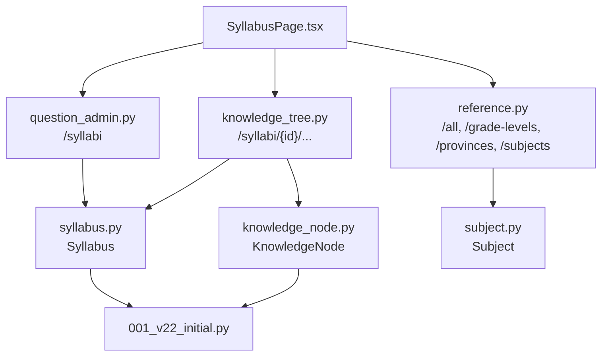
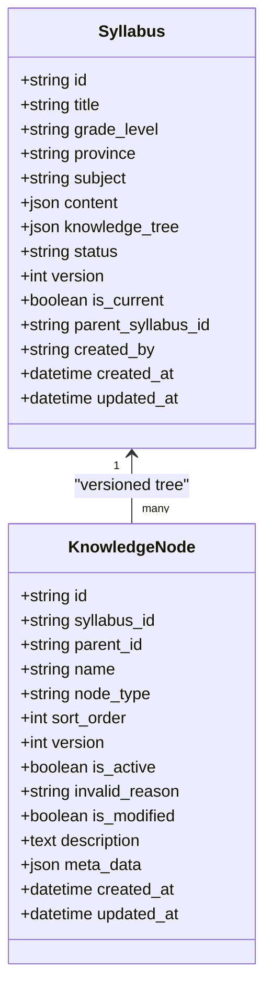
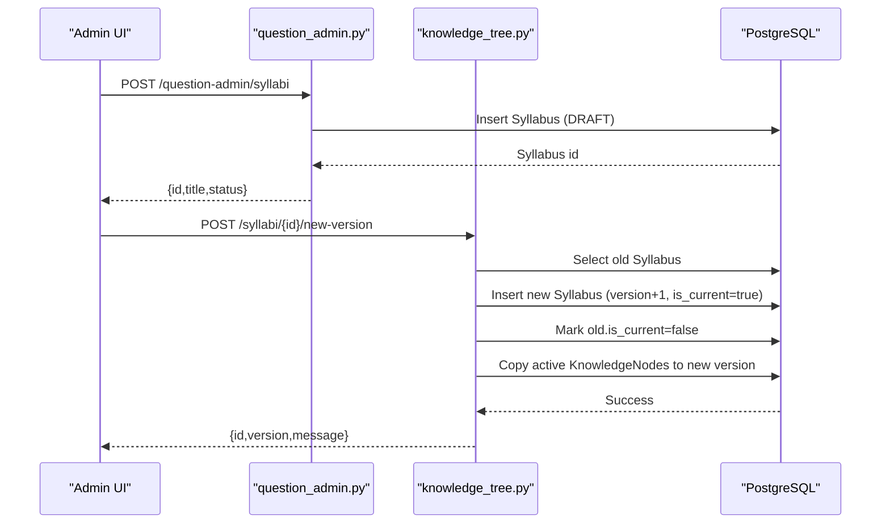
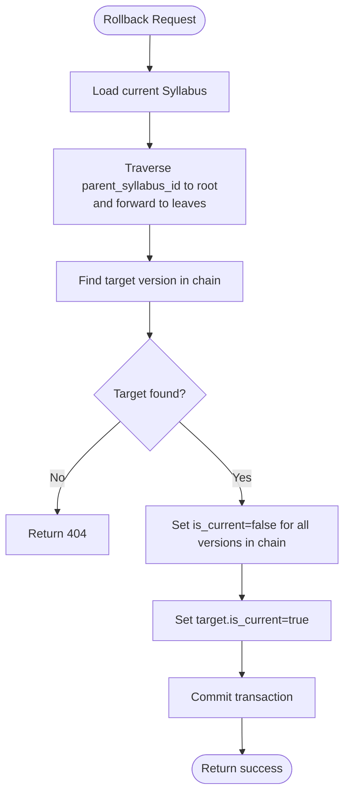
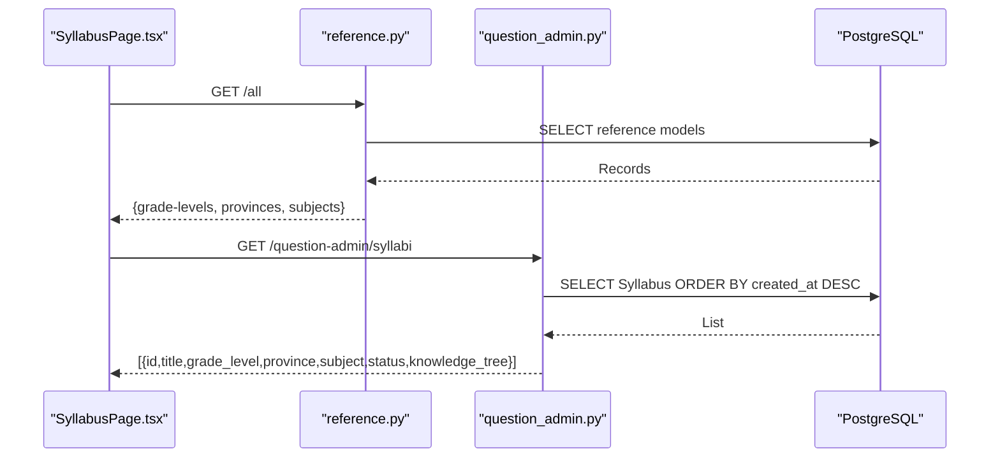
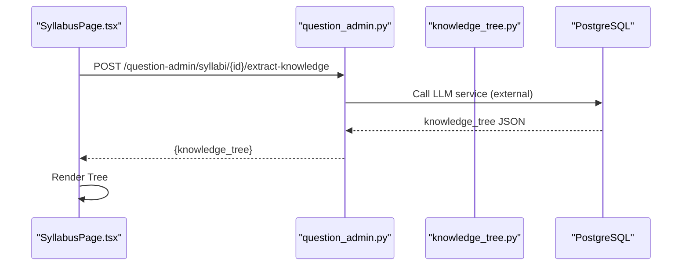
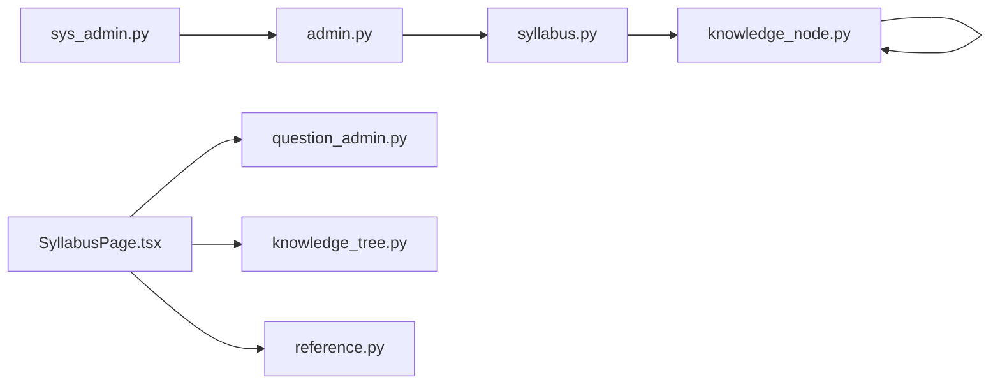

# Syllabus Management

<cite>
**Referenced Files in This Document**
- [syllabus.py](file://backend/app/models/syllabus.py)
- [knowledge_node.py](file://backend/app/models/knowledge_node.py)
- [knowledge_tree.py](file://backend/app/api/v1/endpoints/knowledge_tree.py)
- [question_admin.py](file://backend/app/api/v1/endpoints/question_admin.py)
- [reference.py](file://backend/app/api/v1/endpoints/reference.py)
- [subject.py](file://backend/app/models/subject.py)
- [admin.py](file://backend/app/models/admin.py)
- [sys_admin.py](file://backend/app/models/sys_admin.py)
- [SyllabusPage.tsx](file://frontend/src/pages/admin/SyllabusPage.tsx)
- [requirements-v2.1.1.md](file://docs/requirements-v2.1.1.md)
- [001_v22_initial.py](file://backend/alembic/versions/001_v22_initial.py)
</cite>

## Table of Contents
1. [Introduction](#introduction)
2. [Project Structure](#project-structure)
3. [Core Components](#core-components)
4. [Architecture Overview](#architecture-overview)
5. [Detailed Component Analysis](#detailed-component-analysis)
6. [Dependency Analysis](#dependency-analysis)
7. [Performance Considerations](#performance-considerations)
8. [Troubleshooting Guide](#troubleshooting-guide)
9. [Conclusion](#conclusion)
10. [Appendices](#appendices)

## Introduction
This document describes the syllabus management system that powers curriculum design and knowledge tree maintenance. It covers the complete syllabus lifecycle from creation to versioning and rollback, the integration with knowledge trees, content synchronization, search and filtering, status management, and administrative controls. The system supports grade levels, provinces, subjects, and structured content, enabling administrators to manage syllabi efficiently and maintain traceability across versions.

## Project Structure
The syllabus management spans backend models and endpoints, frontend administration UI, and supporting reference data and migrations.

**Diagram sources**
- [syllabus.py:9-25](file://backend/app/models/syllabus.py#L9-L25)
- [knowledge_node.py:9-25](file://backend/app/models/knowledge_node.py#L9-L25)
- [knowledge_tree.py:1-357](file://backend/app/api/v1/endpoints/knowledge_tree.py#L1-L357)
- [question_admin.py:23-52](file://backend/app/api/v1/endpoints/question_admin.py#L23-L52)
- [reference.py:1-122](file://backend/app/api/v1/endpoints/reference.py#L1-L122)
- [subject.py:8-16](file://backend/app/models/subject.py#L8-L16)
- [admin.py:9-27](file://backend/app/models/admin.py#L9-L27)
- [sys_admin.py:8-22](file://backend/app/models/sys_admin.py#L8-L22)
- [SyllabusPage.tsx:1-239](file://frontend/src/pages/admin/SyllabusPage.tsx#L1-L239)
- [001_v22_initial.py:307-360](file://backend/alembic/versions/001_v22_initial.py#L307-L360)

**Section sources**
- [syllabus.py:9-25](file://backend/app/models/syllabus.py#L9-L25)
- [knowledge_node.py:9-25](file://backend/app/models/knowledge_node.py#L9-L25)
- [knowledge_tree.py:1-357](file://backend/app/api/v1/endpoints/knowledge_tree.py#L1-L357)
- [question_admin.py:23-52](file://backend/app/api/v1/endpoints/question_admin.py#L23-L52)
- [reference.py:1-122](file://backend/app/api/v1/endpoints/reference.py#L1-L122)
- [subject.py:8-16](file://backend/app/models/subject.py#L8-L16)
- [admin.py:9-27](file://backend/app/models/admin.py#L9-L27)
- [sys_admin.py:8-22](file://backend/app/models/sys_admin.py#L8-L22)
- [SyllabusPage.tsx:1-239](file://frontend/src/pages/admin/SyllabusPage.tsx#L1-L239)
- [001_v22_initial.py:307-360](file://backend/alembic/versions/001_v22_initial.py#L307-L360)

## Core Components
- Syllabus model: Stores syllabus metadata (title, grade level, province, subject), content, knowledge tree snapshot, status, versioning, and audit timestamps. It maintains parent-child relationships via parent_syllabus_id to form version chains.
- KnowledgeNode model: Represents hierarchical knowledge nodes (areas and points) linked to a syllabus version. Tracks activity, modification flags, and invalidation reasons.
- Knowledge tree endpoints: Provide CRUD for knowledge nodes, version creation, rollback, and version listing. They enforce permissions and maintain version integrity.
- Syllabus CRUD endpoints: Allow administrators to create and list syllabi with basic filters.
- Reference data endpoints: Expose grade levels, provinces, and subjects for UI selection and validation.
- Admin models: Define QUESTION_ADMIN and SYS_ADMIN roles and their capabilities.
- Frontend SyllabusPage: Provides UI for creating/importing syllabi, extracting knowledge trees, filtering by grade/province/status, and viewing results.

**Section sources**
- [syllabus.py:9-25](file://backend/app/models/syllabus.py#L9-L25)
- [knowledge_node.py:9-25](file://backend/app/models/knowledge_node.py#L9-L25)
- [knowledge_tree.py:199-356](file://backend/app/api/v1/endpoints/knowledge_tree.py#L199-L356)
- [question_admin.py:23-52](file://backend/app/api/v1/endpoints/question_admin.py#L23-L52)
- [reference.py:16-25](file://backend/app/api/v1/endpoints/reference.py#L16-L25)
- [admin.py:9-27](file://backend/app/models/admin.py#L9-L27)
- [sys_admin.py:8-22](file://backend/app/models/sys_admin.py#L8-L22)
- [SyllabusPage.tsx:11-239](file://frontend/src/pages/admin/SyllabusPage.tsx#L11-L239)

## Architecture Overview
The system follows a layered architecture:
- Presentation: React admin UI for syllabus and knowledge tree management.
- API: FastAPI endpoints for syllabus CRUD, knowledge tree operations, and reference data.
- Domain: SQLAlchemy models for syllabi and knowledge nodes with versioning and parent chaining.
- Persistence: PostgreSQL with Alembic migrations defining initial schema.

**Diagram sources**
- [SyllabusPage.tsx:1-239](file://frontend/src/pages/admin/SyllabusPage.tsx#L1-L239)
- [question_admin.py:23-52](file://backend/app/api/v1/endpoints/question_admin.py#L23-L52)
- [knowledge_tree.py:37-64](file://backend/app/api/v1/endpoints/knowledge_tree.py#L37-L64)
- [reference.py:33-43](file://backend/app/api/v1/endpoints/reference.py#L33-L43)
- [syllabus.py:9-25](file://backend/app/models/syllabus.py#L9-L25)
- [knowledge_node.py:9-25](file://backend/app/models/knowledge_node.py#L9-L25)
- [subject.py:8-16](file://backend/app/models/subject.py#L8-L16)
- [001_v22_initial.py:307-360](file://backend/alembic/versions/001_v22_initial.py#L307-L360)

## Detailed Component Analysis

### Syllabus Model and Lifecycle
The Syllabus model encapsulates:
- Identity and metadata: title, grade_level, province, subject, status, content, knowledge_tree.
- Versioning: version integer and is_current flag; parent_syllabus_id links to previous version.
- Audit: created_by, created_at, updated_at.
- Permissions: created_by references admins table.

Lifecycle highlights:
- Creation: POST /question-admin/syllabi creates a DRAFT syllabus.
- Listing: GET /question-admin/syllabi returns syllabi with basic attributes.
- Status: status defaults to DRAFT; UI exposes DRAFT and PUBLISHED states.
- Content: content and knowledge_tree are stored as JSON for flexibility.

**Diagram sources**
- [syllabus.py:9-25](file://backend/app/models/syllabus.py#L9-L25)
- [knowledge_node.py:9-25](file://backend/app/models/knowledge_node.py#L9-L25)

**Section sources**
- [syllabus.py:9-25](file://backend/app/models/syllabus.py#L9-L25)
- [question_admin.py:23-52](file://backend/app/api/v1/endpoints/question_admin.py#L23-L52)
- [SyllabusPage.tsx:145-153](file://frontend/src/pages/admin/SyllabusPage.tsx#L145-L153)

### Knowledge Tree and Versioning
Knowledge tree operations:
- Fetch tree for a syllabus version: GET /syllabi/{syllabus_id}/tree.
- Create node: POST /syllabi/{syllabus_id}/nodes; sets is_modified=True.
- Update node: PUT /syllabi/{syllabus_id}/nodes/{node_id}; invalidates descendants recursively.
- Activate/deactivate subtree: POST /syllabi/{syllabus_id}/nodes/{node_id}/set-branch-active.
- Delete node: DELETE /syllabi/{syllabus_id}/nodes/{node_id}; soft-deletes and marks invalid.
- New version: POST /syllabi/{syllabus_id}/new-version; copies active nodes to new version.
- Rollback: PUT /syllabi/{syllabus_id}/rollback; switches is_current to target version.
- List versions: GET /syllabi/{syllabus_id}/versions; traverses parent chain.

**Diagram sources**
- [question_admin.py:23-41](file://backend/app/api/v1/endpoints/question_admin.py#L23-L41)
- [knowledge_tree.py:199-250](file://backend/app/api/v1/endpoints/knowledge_tree.py#L199-L250)

**Section sources**
- [knowledge_tree.py:37-64](file://backend/app/api/v1/endpoints/knowledge_tree.py#L37-L64)
- [knowledge_tree.py:67-128](file://backend/app/api/v1/endpoints/knowledge_tree.py#L67-L128)
- [knowledge_tree.py:147-196](file://backend/app/api/v1/endpoints/knowledge_tree.py#L147-L196)
- [knowledge_tree.py:199-250](file://backend/app/api/v1/endpoints/knowledge_tree.py#L199-L250)
- [knowledge_tree.py:253-319](file://backend/app/api/v1/endpoints/knowledge_tree.py#L253-L319)
- [knowledge_tree.py:322-356](file://backend/app/api/v1/endpoints/knowledge_tree.py#L322-L356)

### Parent-Child Relationships and Version Chains
Version chains are maintained via parent_syllabus_id. Rollback locates all ancestors and descendants of the current syllabus to build the chain, finds the target version, and sets is_current accordingly.

**Diagram sources**
- [knowledge_tree.py:253-319](file://backend/app/api/v1/endpoints/knowledge_tree.py#L253-L319)

**Section sources**
- [knowledge_tree.py:253-319](file://backend/app/api/v1/endpoints/knowledge_tree.py#L253-L319)

### Search, Filtering, and Administrative Controls
- Search and filters: UI supports title search and filters by grade, province, and status.
- Administrative roles: QUESTION_ADMIN and SYS_ADMIN can create/edit syllabi and manage knowledge trees.
- Reference data: Public endpoints expose grade-levels, provinces, and subjects for UI population.

**Diagram sources**
- [SyllabusPage.tsx:11-32](file://frontend/src/pages/admin/SyllabusPage.tsx#L11-L32)
- [reference.py:33-43](file://backend/app/api/v1/endpoints/reference.py#L33-L43)
- [question_admin.py:43-52](file://backend/app/api/v1/endpoints/question_admin.py#L43-L52)

**Section sources**
- [SyllabusPage.tsx:145-153](file://frontend/src/pages/admin/SyllabusPage.tsx#L145-L153)
- [reference.py:16-25](file://backend/app/api/v1/endpoints/reference.py#L16-L25)
- [question_admin.py:23-52](file://backend/app/api/v1/endpoints/question_admin.py#L23-L52)

### Content Synchronization and Knowledge Extraction
- Knowledge extraction: UI triggers extraction for a syllabus, generating a knowledge tree snapshot stored in knowledge_tree.
- Version propagation: New version copies active nodes from the previous version, preserving structure and activity flags.

**Diagram sources**
- [SyllabusPage.tsx:104-114](file://frontend/src/pages/admin/SyllabusPage.tsx#L104-L114)

**Section sources**
- [SyllabusPage.tsx:104-114](file://frontend/src/pages/admin/SyllabusPage.tsx#L104-L114)

## Dependency Analysis
- Syllabus depends on Admin for created_by and Admin model defines QUESTION_ADMIN/SYS_ADMIN roles.
- KnowledgeNode depends on Syllabus and itself for parent-child relationships.
- Frontend depends on reference endpoints for dropdown options and on syllabus endpoints for CRUD.

**Diagram sources**
- [admin.py:9-27](file://backend/app/models/admin.py#L9-L27)
- [sys_admin.py:8-22](file://backend/app/models/sys_admin.py#L8-L22)
- [syllabus.py:9-25](file://backend/app/models/syllabus.py#L9-L25)
- [knowledge_node.py:9-25](file://backend/app/models/knowledge_node.py#L9-L25)
- [SyllabusPage.tsx:1-239](file://frontend/src/pages/admin/SyllabusPage.tsx#L1-L239)
- [question_admin.py:23-52](file://backend/app/api/v1/endpoints/question_admin.py#L23-L52)
- [knowledge_tree.py:199-356](file://backend/app/api/v1/endpoints/knowledge_tree.py#L199-L356)
- [reference.py:33-43](file://backend/app/api/v1/endpoints/reference.py#L33-L43)

**Section sources**
- [admin.py:9-27](file://backend/app/models/admin.py#L9-L27)
- [sys_admin.py:8-22](file://backend/app/models/sys_admin.py#L8-L22)
- [syllabus.py:9-25](file://backend/app/models/syllabus.py#L9-L25)
- [knowledge_node.py:9-25](file://backend/app/models/knowledge_node.py#L9-L25)
- [SyllabusPage.tsx:1-239](file://frontend/src/pages/admin/SyllabusPage.tsx#L1-L239)
- [question_admin.py:23-52](file://backend/app/api/v1/endpoints/question_admin.py#L23-L52)
- [knowledge_tree.py:199-356](file://backend/app/api/v1/endpoints/knowledge_tree.py#L199-L356)
- [reference.py:33-43](file://backend/app/api/v1/endpoints/reference.py#L33-L43)

## Performance Considerations
- Indexing: knowledge_nodes table includes indexes on syllabus_id and parent_id to support efficient traversal and queries.
- Version copy: New version copying active nodes scales with the number of active nodes; batch operations recommended for large trees.
- JSON storage: content and knowledge_tree are JSON fields; consider normalization if frequent deep queries are needed.
- Pagination: List endpoints currently return all items; consider adding pagination for large datasets.

[No sources needed since this section provides general guidance]

## Troubleshooting Guide
Common issues and resolutions:
- Permission denied: Ensure current user has QUESTION_ADMIN or SYS_ADMIN role when calling syllabus or knowledge tree endpoints.
- Not found errors: Verify syllabus_id exists; knowledge tree endpoints return 404 if syllabus not found.
- Rollback target missing: Confirm target version exists in the version chain; otherwise, a 404 is returned.
- Descendant invalidation: Updating a node triggers recursive invalidation; monitor affected descendant counts.

**Section sources**
- [knowledge_tree.py:67-128](file://backend/app/api/v1/endpoints/knowledge_tree.py#L67-L128)
- [knowledge_tree.py:199-250](file://backend/app/api/v1/endpoints/knowledge_tree.py#L199-L250)
- [knowledge_tree.py:253-319](file://backend/app/api/v1/endpoints/knowledge_tree.py#L253-L319)

## Conclusion
The syllabus management system provides a robust foundation for curriculum design with strong versioning, traceability, and administrative controls. It integrates knowledge trees with version-aware operations, supports flexible search and filtering, and offers clear rollback mechanisms. Administrators can efficiently create, edit, and publish syllabi while maintaining historical accuracy and operational safety.

[No sources needed since this section summarizes without analyzing specific files]

## Appendices

### Data Model Definitions
- Syllabus: identity, metadata, content, knowledge_tree, status, versioning, audit.
- KnowledgeNode: hierarchical structure, activity flags, invalidation reasons, metadata.

**Section sources**
- [syllabus.py:9-25](file://backend/app/models/syllabus.py#L9-L25)
- [knowledge_node.py:9-25](file://backend/app/models/knowledge_node.py#L9-L25)

### Example Workflows

#### Create a Syllabus
- Endpoint: POST /question-admin/syllabi
- Fields: title, grade_level, province, subject, content (optional)
- Result: Returns id, title, status (default DRAFT)

**Section sources**
- [question_admin.py:23-41](file://backend/app/api/v1/endpoints/question_admin.py#L23-L41)

#### Extract Knowledge Tree
- Endpoint: POST /question-admin/syllabi/{id}/extract-knowledge
- Action: Calls LLM service to generate knowledge_tree JSON
- Result: knowledge_tree stored in syllabus record

**Section sources**
- [SyllabusPage.tsx:104-114](file://frontend/src/pages/admin/SyllabusPage.tsx#L104-L114)

#### Create a New Version
- Endpoint: POST /syllabi/{syllabus_id}/new-version
- Behavior: Increments version, copies active nodes, marks old is_current=false

**Section sources**
- [knowledge_tree.py:199-250](file://backend/app/api/v1/endpoints/knowledge_tree.py#L199-L250)

#### Rollback to Target Version
- Endpoint: PUT /syllabi/{syllabus_id}/rollback
- Behavior: Builds version chain, sets target is_current=true, others false

**Section sources**
- [knowledge_tree.py:253-319](file://backend/app/api/v1/endpoints/knowledge_tree.py#L253-L319)

#### Filter and Search
- UI filters: grade, province, status
- Backend list endpoint: GET /question-admin/syllabi returns ordered list

**Section sources**
- [SyllabusPage.tsx:145-153](file://frontend/src/pages/admin/SyllabusPage.tsx#L145-L153)
- [question_admin.py:43-52](file://backend/app/api/v1/endpoints/question_admin.py#L43-L52)