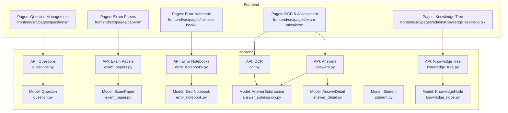
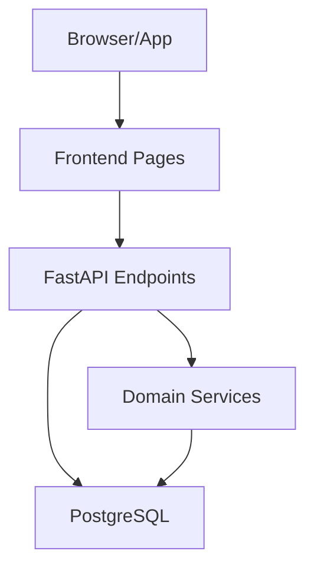
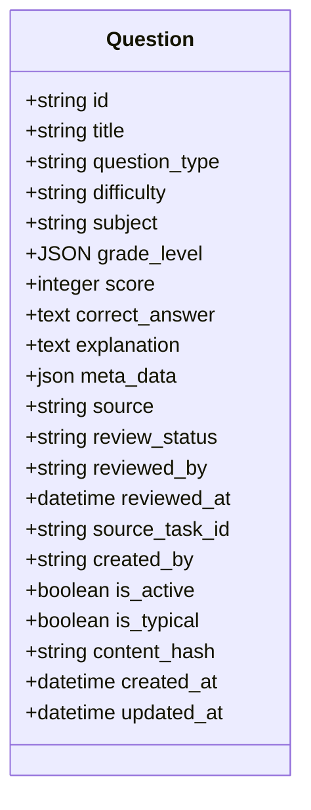
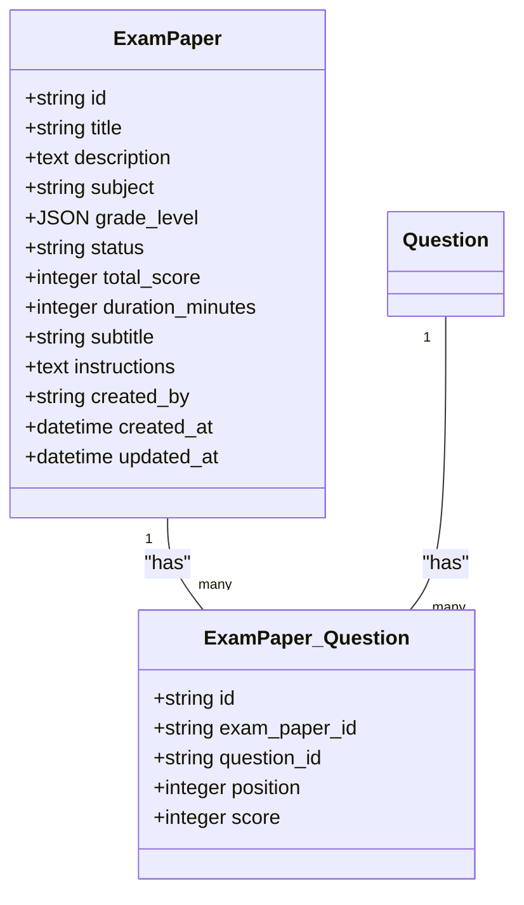
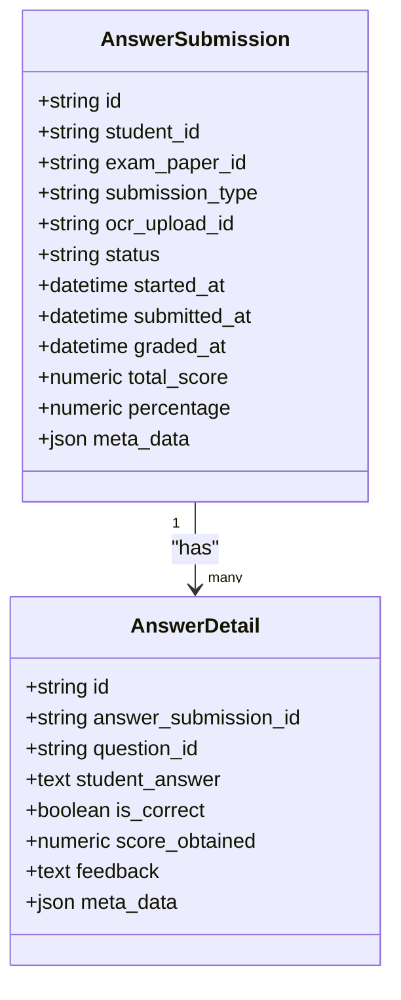
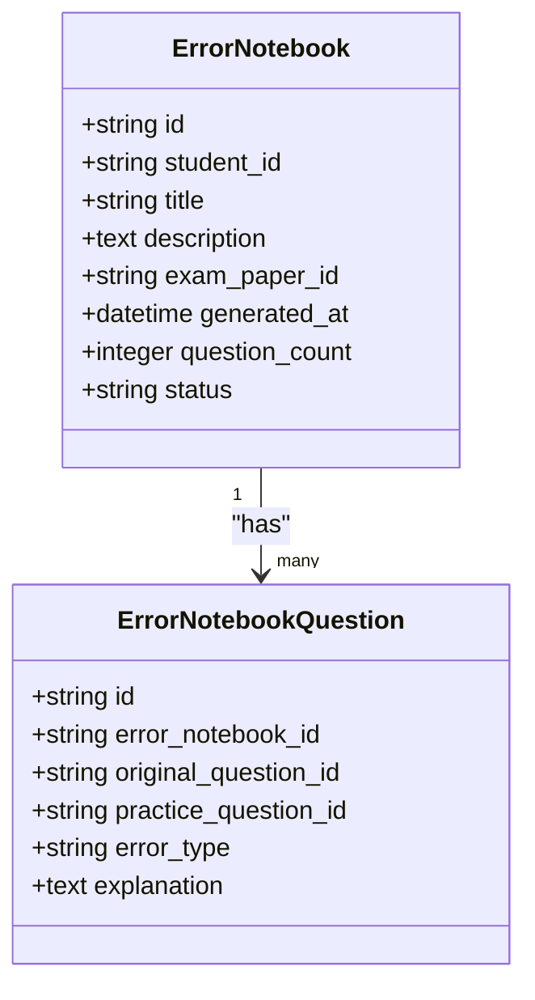
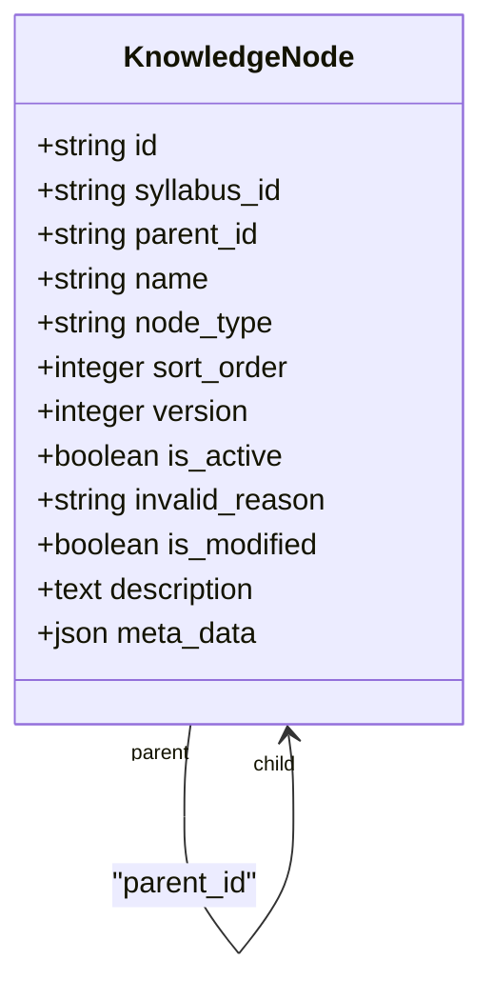
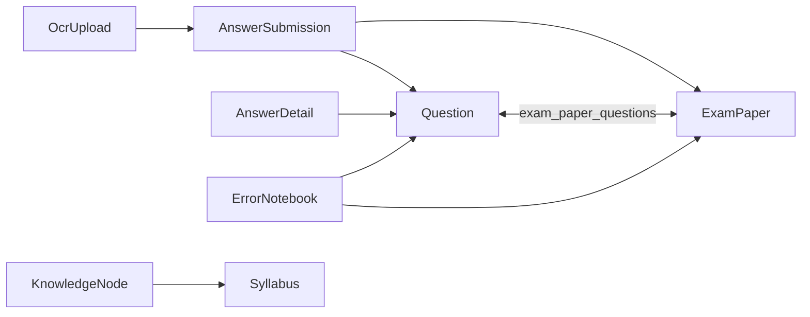

# Core Features Overview

<cite>
**Referenced Files in This Document**
- [question.py](file://backend/app/models/question.py)
- [questions.py](file://backend/app/api/v1/endpoints/questions.py)
- [exam_paper.py](file://backend/app/models/exam_paper.py)
- [exam_papers.py](file://backend/app/api/v1/endpoints/exam_papers.py)
- [error_notebook.py](file://backend/app/models/error_notebook.py)
- [error_notebooks.py](file://backend/app/api/v1/endpoints/error_notebooks.py)
- [student.py](file://backend/app/models/student.py)
- [answers.py](file://backend/app/api/v1/endpoints/answers.py)
- [answer_submission.py](file://backend/app/models/answer_submission.py)
- [answer_detail.py](file://backend/app/models/answer_detail.py)
- [ocr.py](file://backend/app/api/v1/endpoints/ocr.py)
- [ocr_service.py](file://backend/app/services/ocr_service.py)
- [knowledge_tree.py](file://backend/app/api/v1/endpoints/knowledge_tree.py)
- [knowledge_node.py](file://backend/app/models/knowledge_node.py)
</cite>

## Table of Contents
1. [Introduction](#introduction)
2. [Project Structure](#project-structure)
3. [Core Components](#core-components)
4. [Architecture Overview](#architecture-overview)
5. [Detailed Component Analysis](#detailed-component-analysis)
6. [Dependency Analysis](#dependency-analysis)
7. [Performance Considerations](#performance-considerations)
8. [Troubleshooting Guide](#troubleshooting-guide)
9. [Conclusion](#conclusion)

## Introduction
This document presents the core features overview of the Ruicheng Educational Management System. It focuses on the four primary functional domains:
- Question Management: CRUD operations, batch import/export, and review workflow
- Exam Administration: paper creation, question assignment, and status management
- Student Assessment: online submission, OCR processing, and automated grading
- Error Book System: automatic detection, manual entry, and classification

It also describes the multi-role user system (Students, Teachers, Question Administrators, System Administrators), the knowledge management system (curriculum mapping and syllabus management), feature interdependencies, data relationships, and typical user workflows.

## Project Structure
The system is organized around a backend API (FastAPI) with SQLAlchemy ORM models, service layers, and frontend pages. The backend exposes REST endpoints under app/api/v1/endpoints, backed by models in app/models and services in app/services. The frontend pages under frontend/src/pages map to these backend features.

**Diagram sources**
- [questions.py:1-431](file://backend/app/api/v1/endpoints/questions.py#L1-L431)
- [question.py:1-46](file://backend/app/models/question.py#L1-L46)
- [exam_papers.py:1-844](file://backend/app/api/v1/endpoints/exam_papers.py#L1-L844)
- [exam_paper.py:1-51](file://backend/app/models/exam_paper.py#L1-L51)
- [answers.py:1-421](file://backend/app/api/v1/endpoints/answers.py#L1-L421)
- [answer_submission.py:1-37](file://backend/app/models/answer_submission.py#L1-L37)
- [answer_detail.py:1-33](file://backend/app/models/answer_detail.py#L1-L33)
- [ocr.py:1-291](file://backend/app/api/v1/endpoints/ocr.py#L1-L291)
- [error_notebooks.py:1-437](file://backend/app/api/v1/endpoints/error_notebooks.py#L1-L437)
- [error_notebook.py:1-32](file://backend/app/models/error_notebook.py#L1-L32)
- [knowledge_tree.py:1-357](file://backend/app/api/v1/endpoints/knowledge_tree.py#L1-L357)
- [knowledge_node.py:1-26](file://backend/app/models/knowledge_node.py#L1-L26)

**Section sources**
- [questions.py:1-431](file://backend/app/api/v1/endpoints/questions.py#L1-L431)
- [question.py:1-46](file://backend/app/models/question.py#L1-L46)
- [exam_papers.py:1-844](file://backend/app/api/v1/endpoints/exam_papers.py#L1-L844)
- [exam_paper.py:1-51](file://backend/app/models/exam_paper.py#L1-L51)
- [answers.py:1-421](file://backend/app/api/v1/endpoints/answers.py#L1-L421)
- [answer_submission.py:1-37](file://backend/app/models/answer_submission.py#L1-L37)
- [answer_detail.py:1-33](file://backend/app/models/answer_detail.py#L1-L33)
- [ocr.py:1-291](file://backend/app/api/v1/endpoints/ocr.py#L1-L291)
- [error_notebooks.py:1-437](file://backend/app/api/v1/endpoints/error_notebooks.py#L1-L437)
- [error_notebook.py:1-32](file://backend/app/models/error_notebook.py#L1-L32)
- [knowledge_tree.py:1-357](file://backend/app/api/v1/endpoints/knowledge_tree.py#L1-L357)
- [knowledge_node.py:1-26](file://backend/app/models/knowledge_node.py#L1-L26)

## Core Components
This section outlines the four main feature areas and their capabilities.

- Question Management
  - CRUD: Create, read, update, delete questions with type, difficulty, subject, score, and metadata
  - Batch import/export: Bulk ingestion and export of questions with configurable limits
  - Review workflow: Status tracking and ownership with reviewer metadata
  - Typical questions: Flagging and listing typical questions for targeted study

- Exam Administration
  - Paper lifecycle: Create, update, delete, and list exam papers with status (Draft/Published/Archived)
  - Question assignment: Link questions to papers with position and per-question scoring
  - Export formats: Word and PDF exports of exam papers
  - Submission linkage: Connect submissions to papers and compute derived metrics

- Student Assessment
  - Online submission: Submit answers per question with immediate auto-grading
  - OCR processing: Upload answer sheet images, run OCR, and surface structured results
  - Automated grading: Rule-based grading engine computes correctness, scores, and feedback
  - Post-assessment: Automatic error book generation when performance is below threshold

- Error Book System
  - Automatic detection: Generate error notebooks after assessments with wrong answers
  - Manual entry: Quick manual entry of mistakes with classification and explanations
  - Practice generation: Use LLM to generate targeted practice questions per error
  - Export: Text export of error notebooks for offline review

**Section sources**
- [questions.py:17-364](file://backend/app/api/v1/endpoints/questions.py#L17-L364)
- [question.py:10-46](file://backend/app/models/question.py#L10-L46)
- [exam_papers.py:20-522](file://backend/app/api/v1/endpoints/exam_papers.py#L20-L522)
- [exam_paper.py:23-51](file://backend/app/models/exam_paper.py#L23-L51)
- [answers.py:115-196](file://backend/app/api/v1/endpoints/answers.py#L115-L196)
- [answer_submission.py:9-37](file://backend/app/models/answer_submission.py#L9-L37)
- [answer_detail.py:9-33](file://backend/app/models/answer_detail.py#L9-L33)
- [ocr.py:18-164](file://backend/app/api/v1/endpoints/ocr.py#L18-L164)
- [ocr_service.py:61-126](file://backend/app/services/ocr_service.py#L61-L126)
- [error_notebooks.py:22-437](file://backend/app/api/v1/endpoints/error_notebooks.py#L22-L437)
- [error_notebook.py:8-32](file://backend/app/models/error_notebook.py#L8-L32)

## Architecture Overview
The system follows a layered architecture:
- Presentation: Frontend pages coordinate user actions
- API Layer: FastAPI endpoints handle requests, enforce roles, and orchestrate domain logic
- Domain Services: Business logic for grading, OCR, and mistake book generation
- Persistence: SQLAlchemy models and relationships backed by PostgreSQL

[No sources needed since this diagram shows conceptual workflow, not actual code structure]

## Detailed Component Analysis

### Question Management
- Data model: Question includes type, difficulty, subject, score, metadata, review status, ownership, and timestamps
- API capabilities:
  - Create/update/delete with permission checks
  - Search/filter by subject, grade, scope, type, difficulty, review status, and keywords
  - Batch import up to a configured limit
  - Export by IDs or filtered criteria with configurable cap
  - Toggle typical flag for teacher/QA/SysAdmin
- Permissions: TEACHER, QUESTION_ADMIN, SYS_ADMIN for write operations; read access for authenticated users

**Diagram sources**
- [question.py:10-46](file://backend/app/models/question.py#L10-L46)

**Section sources**
- [questions.py:17-364](file://backend/app/api/v1/endpoints/questions.py#L17-L364)
- [question.py:10-46](file://backend/app/models/question.py#L10-L46)

### Exam Administration
- Data model: ExamPaper with status, total score, duration, instructions, and many-to-many relationship to Question via association table
- API capabilities:
  - Create paper with embedded question import
  - Update/delete with permission checks
  - Add/remove/sort questions in paper
  - Export paper to Word/PDF
  - List papers with derived question counts
  - Review mode for students to view paper, submission, and question answers
- Constraints: Status enum, non-negative scores/durations, and position/score constraints in association table

**Diagram sources**
- [exam_paper.py:23-51](file://backend/app/models/exam_paper.py#L23-L51)

**Section sources**
- [exam_papers.py:20-522](file://backend/app/api/v1/endpoints/exam_papers.py#L20-L522)
- [exam_paper.py:23-51](file://backend/app/models/exam_paper.py#L23-L51)

### Student Assessment
- Data models:
  - AnswerSubmission: links student to exam paper, tracks submission type, status, timing, and scores
  - AnswerDetail: per-question student answers with correctness, score, and feedback
- API capabilities:
  - Submit answers online with immediate auto-grading
  - Retrieve submission and details with permission checks
  - Update/delete submissions before lock (when error book not yet generated)
  - OCR upload pipeline: store upload, run OCR, and return structured results
- Grading: rule-based engine computes per-question correctness and feedback; aggregates totals and percentages

**Diagram sources**
- [answer_submission.py:9-37](file://backend/app/models/answer_submission.py#L9-L37)
- [answer_detail.py:9-33](file://backend/app/models/answer_detail.py#L9-L33)

**Section sources**
- [answers.py:115-196](file://backend/app/api/v1/endpoints/answers.py#L115-L196)
- [answer_submission.py:9-37](file://backend/app/models/answer_submission.py#L9-L37)
- [answer_detail.py:9-33](file://backend/app/models/answer_detail.py#L9-L33)
- [ocr.py:18-164](file://backend/app/api/v1/endpoints/ocr.py#L18-L164)
- [ocr_service.py:61-126](file://backend/app/services/ocr_service.py#L61-L126)

### Error Book System
- Data model: ErrorNotebook with student ownership, optional exam linkage, status, and question count
- API capabilities:
  - Generate error book from latest submission
  - Enriched retrieval with original and practice questions, student answers, and explanations
  - Manual entry of mistakes with classification
  - Practice generation via LLM for each error
  - Export text representation
- Workflow: After assessment, if below threshold, automatically generate error book and mark submission as generated

**Diagram sources**
- [error_notebook.py:8-32](file://backend/app/models/error_notebook.py#L8-L32)

**Section sources**
- [error_notebooks.py:22-437](file://backend/app/api/v1/endpoints/error_notebooks.py#L22-L437)
- [error_notebook.py:8-32](file://backend/app/models/error_notebook.py#L8-L32)

### Knowledge Management System
- Data model: KnowledgeNode representing versioned syllabus knowledge tree with parent-child hierarchy
- API capabilities:
  - Build tree from syllabus version
  - Create/update/delete nodes
  - Activate/deactivate subtrees
  - Create new version by copying active nodes
  - Rollback to historical version
  - List version chain

**Diagram sources**
- [knowledge_node.py:9-26](file://backend/app/models/knowledge_node.py#L9-L26)

**Section sources**
- [knowledge_tree.py:37-357](file://backend/app/api/v1/endpoints/knowledge_tree.py#L37-L357)
- [knowledge_node.py:9-26](file://backend/app/models/knowledge_node.py#L9-L26)

## Dependency Analysis
Key interdependencies and relationships:
- Question ↔ ExamPaper via association table with position and per-paper score
- AnswerSubmission links students to exam papers and holds aggregated scores
- AnswerDetail links submissions to questions and stores per-question results
- ErrorNotebook links students and optionally exam papers, aggregates mistakes, and can link to practice questions
- OCR uploads can be associated with submissions for scanned answer sheets
- KnowledgeNodes form a hierarchical knowledge tree tied to syllabi

**Diagram sources**
- [exam_paper.py:9-20](file://backend/app/models/exam_paper.py#L9-L20)
- [answer_submission.py:9-37](file://backend/app/models/answer_submission.py#L9-L37)
- [answer_detail.py:9-33](file://backend/app/models/answer_detail.py#L9-L33)
- [error_notebook.py:8-32](file://backend/app/models/error_notebook.py#L8-L32)
- [ocr.py:18-164](file://backend/app/api/v1/endpoints/ocr.py#L18-L164)
- [knowledge_node.py:9-26](file://backend/app/models/knowledge_node.py#L9-L26)

**Section sources**
- [exam_paper.py:9-20](file://backend/app/models/exam_paper.py#L9-L20)
- [answer_submission.py:9-37](file://backend/app/models/answer_submission.py#L9-L37)
- [answer_detail.py:9-33](file://backend/app/models/answer_detail.py#L9-L33)
- [error_notebook.py:8-32](file://backend/app/models/error_notebook.py#L8-L32)
- [ocr.py:18-164](file://backend/app/api/v1/endpoints/ocr.py#L18-L164)
- [knowledge_node.py:9-26](file://backend/app/models/knowledge_node.py#L9-L26)

## Performance Considerations
- Pagination and caps: Many list endpoints cap limit (e.g., 200) to prevent heavy queries
- Asynchronous sessions: API endpoints use async SQLAlchemy sessions for I/O-bound operations
- Atomic transactions: Submission and grading occur in separate transactions to maintain submission integrity
- Export caps: Export endpoints enforce configurable limits to avoid oversized payloads
- Indexes: Key fields (e.g., created_by, subject, grade_level) are indexed to speed filtering and joins

[No sources needed since this section provides general guidance]

## Troubleshooting Guide
Common issues and resolutions:
- Permission denied
  - Symptom: 403 errors when accessing resources
  - Causes: Non-privileged user type, unauthorized ownership, or missing role
  - Resolutions: Verify user role and ownership checks in endpoints (e.g., question update requires creator or admin)
- Resource not found
  - Symptom: 404 errors for questions, papers, submissions, or notebooks
  - Causes: Incorrect IDs or resource deletion
  - Resolutions: Validate IDs and existence checks in endpoints
- Locked submission
  - Symptom: Cannot update/delete submission after error book generation
  - Causes: Submission status locked post-generation
  - Resolutions: Allow updates/deletes only before generation; request re-grade if needed
- OCR engine unavailable
  - Symptom: OCR processing fails or returns unavailable
  - Causes: Missing Tesseract installation
  - Resolutions: Install Tesseract with Chinese and English language packs; check service logs

**Section sources**
- [questions.py:292-347](file://backend/app/api/v1/endpoints/questions.py#L292-L347)
- [answers.py:223-289](file://backend/app/api/v1/endpoints/answers.py#L223-L289)
- [answers.py:376-417](file://backend/app/api/v1/endpoints/answers.py#L376-L417)
- [ocr.py:26-64](file://backend/app/api/v1/endpoints/ocr.py#L26-L64)
- [ocr_service.py:61-96](file://backend/app/services/ocr_service.py#L61-L96)

## Conclusion
The Ruicheng Educational Management System integrates robust workflows across question management, exam administration, student assessment, and error book maintenance. Its multi-role design ensures appropriate access controls, while the knowledge management system supports curriculum mapping and syllabus versioning. Interoperable data models and service layers enable automated grading, OCR processing, and personalized practice recommendations, forming a cohesive assessment ecosystem.