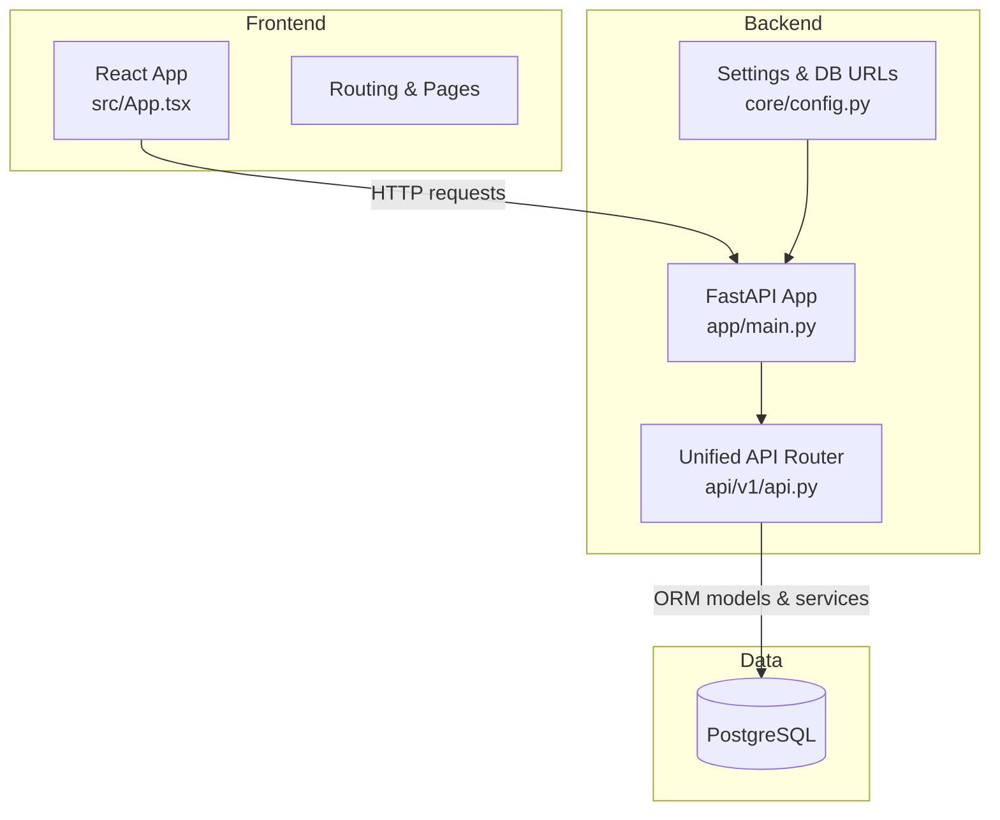
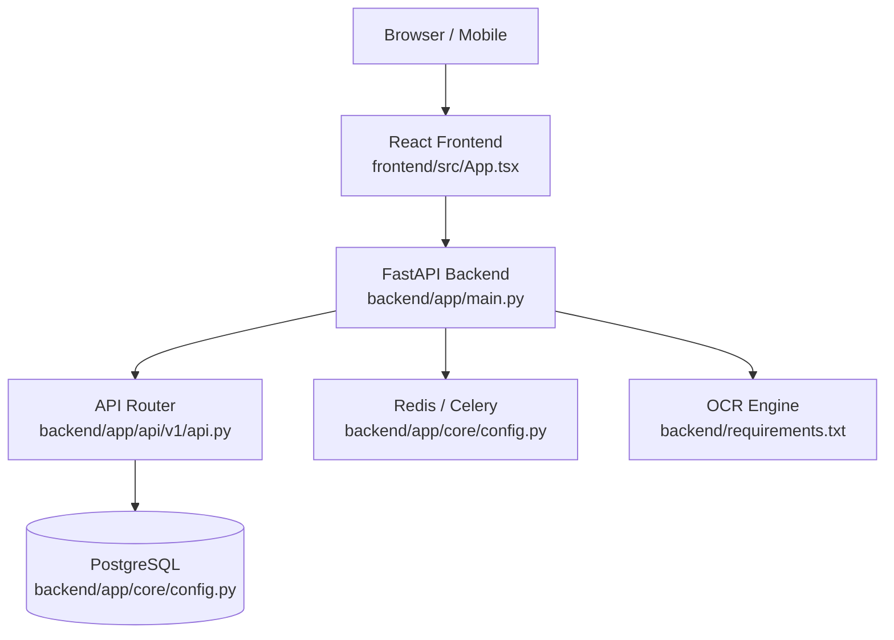
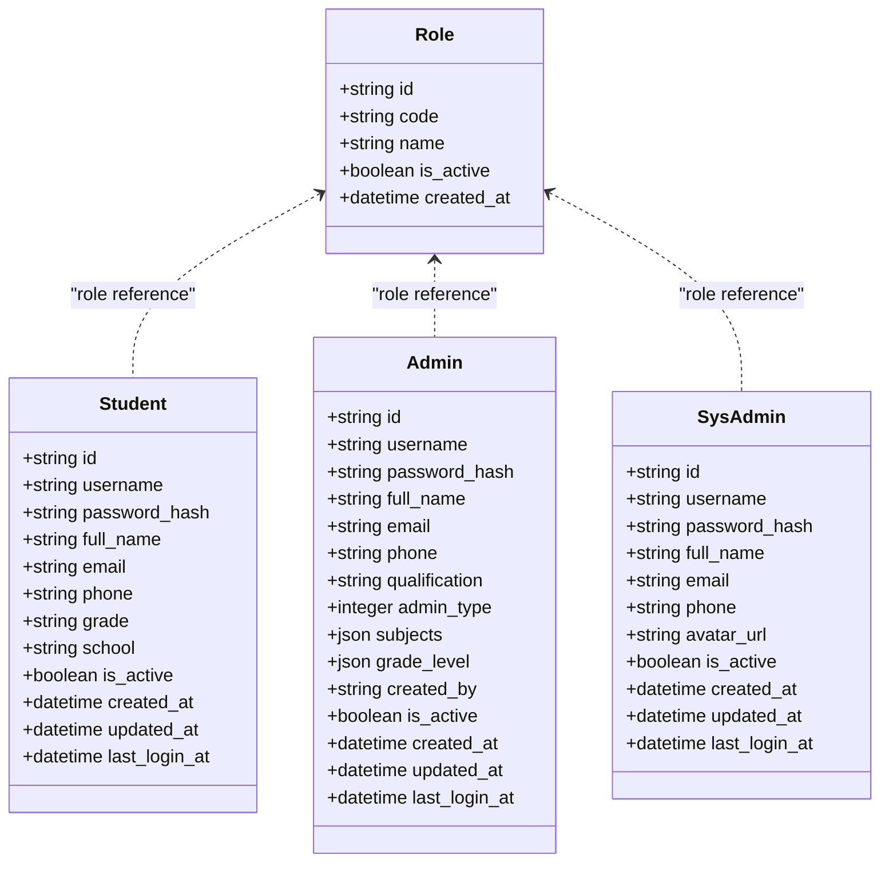
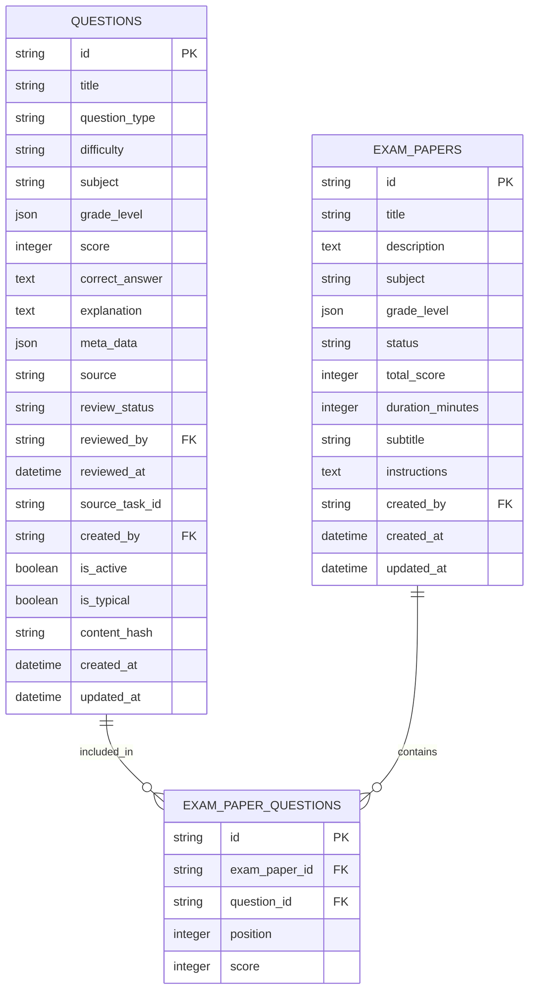
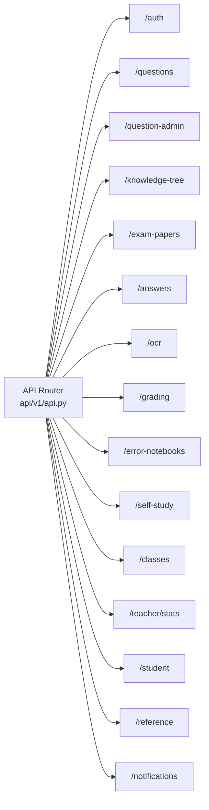
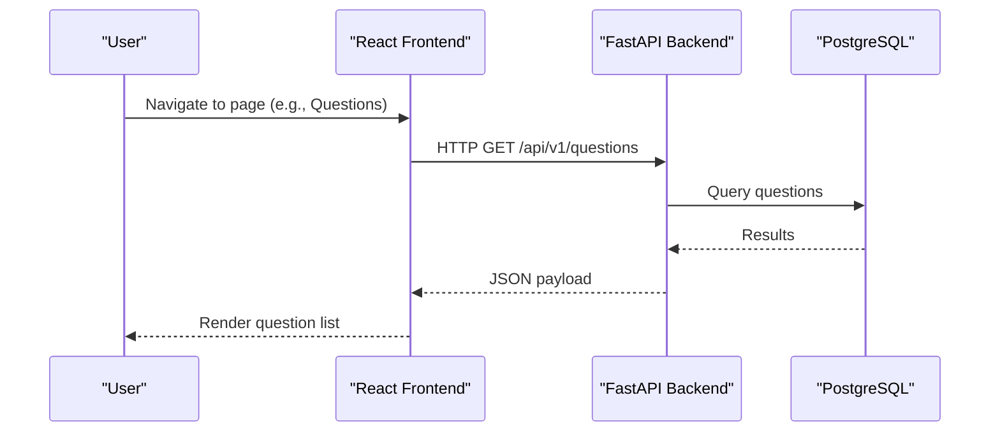
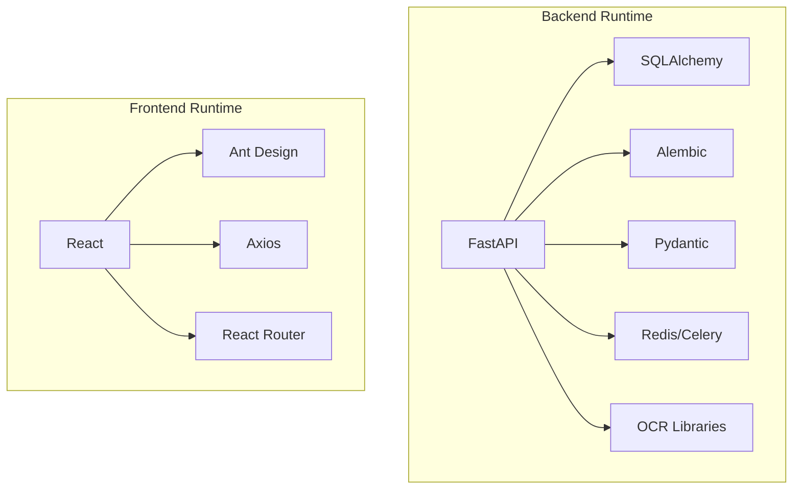

# Project Overview

<cite>
**Referenced Files in This Document**
- [backend/app/main.py](file://backend/app/main.py)
- [backend/app/api/v1/api.py](file://backend/app/api/v1/api.py)
- [backend/app/core/config.py](file://backend/app/core/config.py)
- [backend/requirements.txt](file://backend/requirements.txt)
- [docker-compose.yml](file://docker-compose.yml)
- [frontend/src/App.tsx](file://frontend/src/App.tsx)
- [frontend/package.json](file://frontend/package.json)
- [backend/app/models/role.py](file://backend/app/models/role.py)
- [backend/app/models/student.py](file://backend/app/models/student.py)
- [backend/app/models/admin.py](file://backend/app/models/admin.py)
- [backend/app/models/sys_admin.py](file://backend/app/models/sys_admin.py)
- [backend/app/models/question.py](file://backend/app/models/question.py)
- [backend/app/models/exam_paper.py](file://backend/app/models/exam_paper.py)
- [backend/app/schemas/user.py](file://backend/app/schemas/user.py)
</cite>

## Table of Contents
1. [Introduction](#introduction)
2. [Project Structure](#project-structure)
3. [Core Components](#core-components)
4. [Architecture Overview](#architecture-overview)
5. [Detailed Component Analysis](#detailed-component-analysis)
6. [Dependency Analysis](#dependency-analysis)
7. [Performance Considerations](#performance-considerations)
8. [Troubleshooting Guide](#troubleshooting-guide)
9. [Conclusion](#conclusion)

## Introduction
The Ruicheng Educational Management System is a full-stack educational platform designed to streamline question management, exam administration, and student learning assessment. It supports a multi-role ecosystem with distinct responsibilities:
- Student: Learner profile, self-study tasks, exam taking, and personal analytics.
- Teacher: Class management, question review, paper creation, and classroom analytics.
- Question Admin: Question curation, batch import, tagging, and quality assurance.
- System Admin: Platform configuration, user management, and operational oversight.

The platform emphasizes practical capabilities such as question lifecycle management, dynamic exam paper assembly, automated and manual grading, OCR-powered question capture, and learning analytics for targeted improvement.

## Project Structure
The system follows a clean separation of concerns:
- Backend: FastAPI application exposing RESTful APIs under a unified router, with asynchronous database sessions and standardized response wrappers.
- Frontend: React application with TypeScript, routing, and UI components organized by feature pages.
- Database: PostgreSQL-backed ORM models for users, questions, exam papers, and supporting entities.
- Deployment: Docker Compose orchestrating backend and frontend containers with shared volumes and environment configuration.

**Diagram sources**
- [backend/app/main.py:11-30](file://backend/app/main.py#L11-L30)
- [backend/app/api/v1/api.py:1-26](file://backend/app/api/v1/api.py#L1-L26)
- [backend/app/core/config.py:36-97](file://backend/app/core/config.py#L36-L97)
- [frontend/src/App.tsx:1-6](file://frontend/src/App.tsx#L1-L6)

**Section sources**
- [backend/app/main.py:1-52](file://backend/app/main.py#L1-L52)
- [backend/app/api/v1/api.py:1-26](file://backend/app/api/v1/api.py#L1-L26)
- [backend/app/core/config.py:36-97](file://backend/app/core/config.py#L36-L97)
- [docker-compose.yml:1-33](file://docker-compose.yml#L1-L33)
- [frontend/src/App.tsx:1-6](file://frontend/src/App.tsx#L1-L6)

## Core Components
- Multi-role user model with dedicated tables for Students, Admins (including Teachers and Question Admins), and System Admins.
- Question management with metadata, difficulty, scoring, and review workflows.
- Exam paper composition with dynamic question selection, ordering, and scoring.
- Authentication and authorization via JWT tokens and role-based access control.
- OCR ingestion pipeline for question capture and batch import workflows.
- Learning analytics dashboards for teachers and students.

Practical examples:
- Question management: Create, tag, and review questions; mark typical questions for targeted practice.
- Exam creation: Assemble exam papers from curated questions, set timing and scoring, publish for student use.
- Learning analytics: Track student performance trends, identify weak knowledge points, and generate personalized study plans.

**Section sources**
- [backend/app/models/student.py:8-23](file://backend/app/models/student.py#L8-L23)
- [backend/app/models/admin.py:9-27](file://backend/app/models/admin.py#L9-L27)
- [backend/app/models/sys_admin.py:8-22](file://backend/app/models/sys_admin.py#L8-L22)
- [backend/app/models/question.py:10-46](file://backend/app/models/question.py#L10-L46)
- [backend/app/models/exam_paper.py:23-51](file://backend/app/models/exam_paper.py#L23-L51)
- [backend/app/schemas/user.py:7-37](file://backend/app/schemas/user.py#L7-L37)

## Architecture Overview
The system architecture integrates a React frontend, FastAPI backend, PostgreSQL database, and containerized deployment. The backend exposes modular API groups covering authentication, question management, exam papers, grading, OCR, statistics, and administrative functions. Configuration is centralized via environment variables and a system configuration file, enabling flexible deployment modes.

**Diagram sources**
- [frontend/src/App.tsx:1-6](file://frontend/src/App.tsx#L1-L6)
- [backend/app/main.py:1-52](file://backend/app/main.py#L1-L52)
- [backend/app/api/v1/api.py:1-26](file://backend/app/api/v1/api.py#L1-L26)
- [backend/app/core/config.py:36-97](file://backend/app/core/config.py#L36-L97)
- [backend/requirements.txt:1-27](file://backend/requirements.txt#L1-L27)

**Section sources**
- [backend/app/main.py:11-30](file://backend/app/main.py#L11-L30)
- [backend/app/api/v1/api.py:6-25](file://backend/app/api/v1/api.py#L6-L25)
- [backend/app/core/config.py:36-97](file://backend/app/core/config.py#L36-L97)
- [backend/requirements.txt:1-27](file://backend/requirements.txt#L1-L27)

## Detailed Component Analysis

### User Roles and Authentication
The platform defines four primary roles:
- Student: Self-registration, profile updates, and learning activities.
- Admin (Teacher/Question Admin): Created by System Admin, with specialized permissions for teaching and question curation.
- System Admin: Built-in account with platform-wide privileges.

Authentication uses JWT tokens with configurable expiration and refresh policies. The user schema enforces role constraints and secure credential handling.

**Diagram sources**
- [backend/app/models/role.py:8-17](file://backend/app/models/role.py#L8-L17)
- [backend/app/models/student.py:8-23](file://backend/app/models/student.py#L8-L23)
- [backend/app/models/admin.py:9-27](file://backend/app/models/admin.py#L9-L27)
- [backend/app/models/sys_admin.py:8-22](file://backend/app/models/sys_admin.py#L8-L22)

**Section sources**
- [backend/app/models/role.py:8-17](file://backend/app/models/role.py#L8-L17)
- [backend/app/models/student.py:8-23](file://backend/app/models/student.py#L8-L23)
- [backend/app/models/admin.py:9-27](file://backend/app/models/admin.py#L9-L27)
- [backend/app/models/sys_admin.py:8-22](file://backend/app/models/sys_admin.py#L8-L22)
- [backend/app/schemas/user.py:13-21](file://backend/app/schemas/user.py#L13-L21)

### Question and Exam Paper Models
The question model captures question attributes, difficulty, scoring, review status, and typicality flags. The exam paper model supports dynamic composition with many-to-many relationships to questions, including position and per-question scores.

**Diagram sources**
- [backend/app/models/question.py:10-46](file://backend/app/models/question.py#L10-L46)
- [backend/app/models/exam_paper.py:9-51](file://backend/app/models/exam_paper.py#L9-L51)

**Section sources**
- [backend/app/models/question.py:10-46](file://backend/app/models/question.py#L10-L46)
- [backend/app/models/exam_paper.py:23-51](file://backend/app/models/exam_paper.py#L23-L51)

### API Surface and Routing
The backend aggregates feature-specific routers under a single API router, grouping endpoints by functional domains such as authentication, questions, exam papers, grading, OCR, statistics, and administrative controls.

**Diagram sources**
- [backend/app/api/v1/api.py:6-25](file://backend/app/api/v1/api.py#L6-L25)

**Section sources**
- [backend/app/api/v1/api.py:1-26](file://backend/app/api/v1/api.py#L1-L26)

### Frontend Integration Points
The React application serves as the primary interface for learners and educators. It consumes the backend’s REST API through a generated client and renders feature-specific pages for question management, exam paper creation, analytics, and administrative tasks.

**Diagram sources**
- [frontend/src/App.tsx:1-6](file://frontend/src/App.tsx#L1-L6)
- [backend/app/api/v1/api.py:10-13](file://backend/app/api/v1/api.py#L10-L13)
- [backend/app/core/config.py:40-61](file://backend/app/core/config.py#L40-L61)

**Section sources**
- [frontend/src/App.tsx:1-6](file://frontend/src/App.tsx#L1-L6)
- [frontend/package.json:12-22](file://frontend/package.json#L12-L22)

## Dependency Analysis
The backend relies on FastAPI, SQLAlchemy, Alembic, Pydantic, and optional integrations for OCR and document export. The frontend uses React, Ant Design, and related libraries for UI and state management.

**Diagram sources**
- [backend/requirements.txt:1-27](file://backend/requirements.txt#L1-L27)
- [frontend/package.json:12-22](file://frontend/package.json#L12-L22)

**Section sources**
- [backend/requirements.txt:1-27](file://backend/requirements.txt#L1-L27)
- [frontend/package.json:12-22](file://frontend/package.json#L12-L22)

## Performance Considerations
- Use asynchronous database sessions and connection pooling to handle concurrent requests efficiently.
- Index frequently queried fields (e.g., subject, grade level, is_active, content_hash) to optimize filtering and search.
- Implement pagination for large datasets (questions, exam papers, submissions).
- Cache static reference data and leverage Redis for short-lived analytics computations.
- Minimize payload sizes by returning only required fields and compressing large responses where appropriate.

## Troubleshooting Guide
Common operational checks:
- Health endpoint verification: Ensure the backend responds to the health check route.
- CORS configuration: Confirm allowed origins and credentials for cross-origin requests.
- Database connectivity: Validate DATABASE_URL and credentials; confirm PostgreSQL availability.
- Environment variables: Verify secret keys, token expirations, OCR engine settings, and upload limits.
- Container logs: Inspect backend and frontend logs via Docker Compose for startup errors or runtime exceptions.

**Section sources**
- [backend/app/main.py:33-52](file://backend/app/main.py#L33-L52)
- [backend/app/core/config.py:55-97](file://backend/app/core/config.py#L55-L97)
- [docker-compose.yml:13-20](file://docker-compose.yml#L13-L20)

## Conclusion
The Ruicheng Educational Management System provides a robust foundation for modern educational workflows. Its modular backend, responsive frontend, and containerized deployment enable scalable question management, efficient exam administration, and actionable learning insights. By leveraging role-based access control, structured data models, and standardized APIs, the platform supports both institutional operations and individualized learning paths.