# System Architecture

<cite>
**Referenced Files in This Document**
- [backend/app/main.py](file://backend/app/main.py)
- [backend/app/api/v1/api.py](file://backend/app/api/v1/api.py)
- [backend/app/core/config.py](file://backend/app/core/config.py)
- [backend/app/db/session.py](file://backend/app/db/session.py)
- [backend/app/services/ocr_service.py](file://backend/app/services/ocr_service.py)
- [backend/app/services/llm_service.py](file://backend/app/services/llm_service.py)
- [backend/sysconfig.json](file://backend/sysconfig.json)
- [frontend/src/router.tsx](file://frontend/src/router.tsx)
- [frontend/src/api/client.ts](file://frontend/src/api/client.ts)
- [docker-compose.yml](file://docker-compose.yml)
- [backend/Dockerfile](file://backend/Dockerfile)
- [frontend/Dockerfile](file://frontend/Dockerfile)
</cite>

## Table of Contents
1. [Introduction](#introduction)
2. [Project Structure](#project-structure)
3. [Core Components](#core-components)
4. [Architecture Overview](#architecture-overview)
5. [Detailed Component Analysis](#detailed-component-analysis)
6. [Dependency Analysis](#dependency-analysis)
7. [Performance Considerations](#performance-considerations)
8. [Security Architecture](#security-architecture)
9. [Scalability Considerations](#scalability-considerations)
10. [Deployment Topology](#deployment-topology)
11. [External Integrations](#external-integrations)
12. [Troubleshooting Guide](#troubleshooting-guide)
13. [Conclusion](#conclusion)

## Introduction
This document presents the system architecture for the Ruicheng Educational Management System. It describes the full-stack design built with a FastAPI backend supporting async/await patterns, a React frontend using Ant Design components, a PostgreSQL database with SQLAlchemy ORM, and Docker containerization. The system follows a layered architecture separating presentation, business logic, and data access. It also outlines microservices-oriented patterns, inter-component communication, and data flow across frontend, backend, and database layers. External integrations include OCR engines and Large Language Model (LLM) services. Deployment topology and operational concerns such as scalability, security, and performance optimization are addressed.

## Project Structure
The project is organized into two primary modules:
- Backend: FastAPI application with API routers, core configuration, database session management, domain models, Pydantic schemas, and service layer for OCR and LLM.
- Frontend: React application with TypeScript, Ant Design UI components, routing, and an Axios-based API client that communicates with the backend.

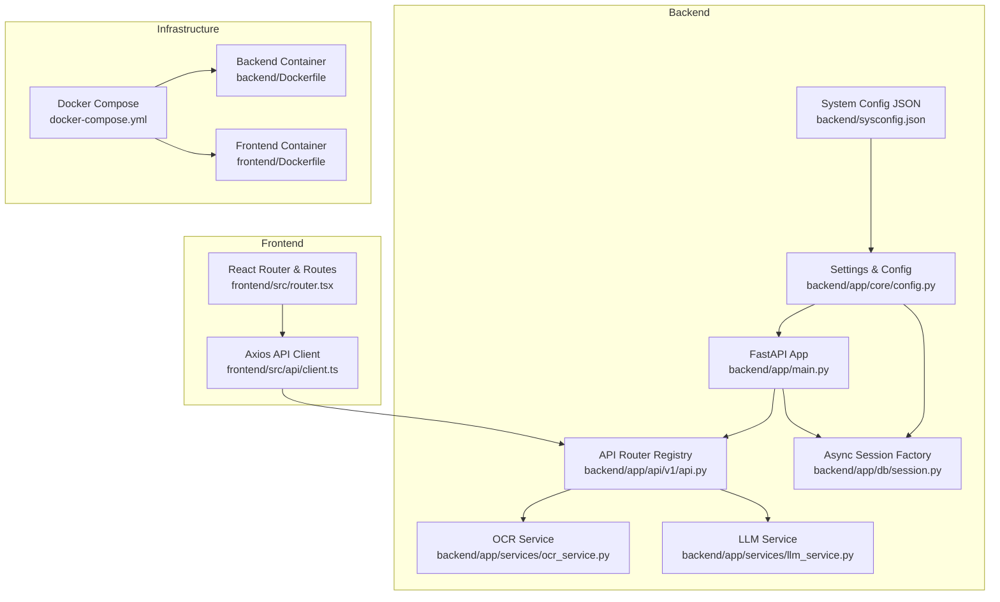

**Diagram sources**
- [backend/app/main.py:1-52](file://backend/app/main.py#L1-L52)
- [backend/app/api/v1/api.py:1-26](file://backend/app/api/v1/api.py#L1-L26)
- [backend/app/core/config.py:1-98](file://backend/app/core/config.py#L1-L98)
- [backend/app/db/session.py:1-26](file://backend/app/db/session.py#L1-L26)
- [backend/app/services/ocr_service.py:1-126](file://backend/app/services/ocr_service.py#L1-L126)
- [backend/app/services/llm_service.py:1-350](file://backend/app/services/llm_service.py#L1-L350)
- [backend/sysconfig.json:1-48](file://backend/sysconfig.json#L1-L48)
- [frontend/src/router.tsx:1-79](file://frontend/src/router.tsx#L1-L79)
- [frontend/src/api/client.ts:1-55](file://frontend/src/api/client.ts#L1-L55)
- [docker-compose.yml:1-33](file://docker-compose.yml#L1-L33)
- [backend/Dockerfile:1-11](file://backend/Dockerfile#L1-L11)
- [frontend/Dockerfile:1-11](file://frontend/Dockerfile#L1-L11)

**Section sources**
- [backend/app/main.py:1-52](file://backend/app/main.py#L1-L52)
- [backend/app/api/v1/api.py:1-26](file://backend/app/api/v1/api.py#L1-L26)
- [frontend/src/router.tsx:1-79](file://frontend/src/router.tsx#L1-L79)

## Core Components
- FastAPI Backend
  - Application initialization with CORS and unified response middleware.
  - Centralized API router registry that mounts feature-specific routers.
  - Startup event for seeding reference data.
- Core Configuration
  - Settings class aggregates environment variables and sysconfig.json for database, security, OCR, model cache, and LLM endpoints.
  - Provides async database URL for SQLAlchemy async engine.
- Database Layer
  - Async engine and session factory configured via settings.
  - Dependency injection for database sessions in endpoints.
- Service Layer
  - OCR service integrates Tesseract for image-to-text processing and heuristic question extraction.
  - LLM service orchestrates question generation and practice question creation via Ollama or DeepSeek APIs.
- Frontend
  - React application with Ant Design components and localized theme.
  - Router-based navigation with protected/public route guards.
  - Axios client with automatic bearer token injection and transparent response unwrapping.

**Section sources**
- [backend/app/main.py:1-52](file://backend/app/main.py#L1-L52)
- [backend/app/core/config.py:1-98](file://backend/app/core/config.py#L1-L98)
- [backend/app/db/session.py:1-26](file://backend/app/db/session.py#L1-L26)
- [backend/app/services/ocr_service.py:1-126](file://backend/app/services/ocr_service.py#L1-L126)
- [backend/app/services/llm_service.py:1-350](file://backend/app/services/llm_service.py#L1-L350)
- [frontend/src/router.tsx:1-79](file://frontend/src/router.tsx#L1-L79)
- [frontend/src/api/client.ts:1-55](file://frontend/src/api/client.ts#L1-L55)

## Architecture Overview
The system follows a layered architecture:
- Presentation Layer: React frontend with Ant Design components and routing.
- Business Logic Layer: FastAPI endpoints delegate to service layer functions for OCR and LLM operations.
- Data Access Layer: SQLAlchemy async ORM with dependency-injected sessions.

Inter-component communication:
- Frontend communicates with backend via HTTP requests routed through the centralized API router.
- Backend services integrate with external systems (OCR engine and LLM providers) using asynchronous HTTP clients.
- Database access is performed through async sessions managed by the dependency injection pattern.

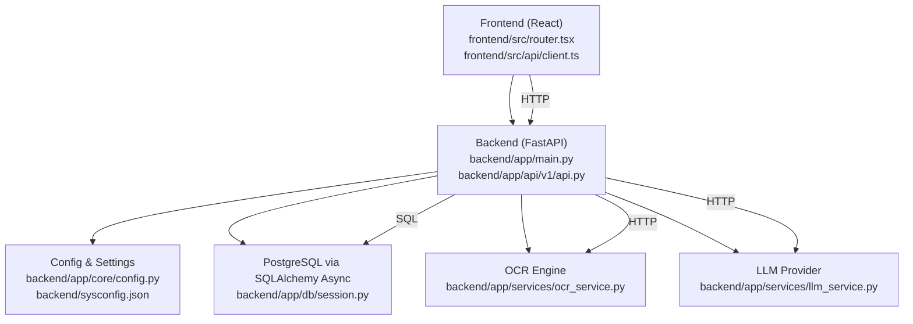

**Diagram sources**
- [frontend/src/router.tsx:1-79](file://frontend/src/router.tsx#L1-L79)
- [frontend/src/api/client.ts:1-55](file://frontend/src/api/client.ts#L1-L55)
- [backend/app/main.py:1-52](file://backend/app/main.py#L1-L52)
- [backend/app/api/v1/api.py:1-26](file://backend/app/api/v1/api.py#L1-L26)
- [backend/app/core/config.py:1-98](file://backend/app/core/config.py#L1-L98)
- [backend/app/db/session.py:1-26](file://backend/app/db/session.py#L1-L26)
- [backend/app/services/ocr_service.py:1-126](file://backend/app/services/ocr_service.py#L1-L126)
- [backend/app/services/llm_service.py:1-350](file://backend/app/services/llm_service.py#L1-L350)

## Detailed Component Analysis

### Backend Application Initialization
- FastAPI app creation with project metadata and OpenAPI specification path.
- Middleware stack includes CORS and a unified response wrapper that normalizes API responses.
- Central router registration mounts feature-specific routers under a common prefix.
- Startup event seeds reference data using an async database session.

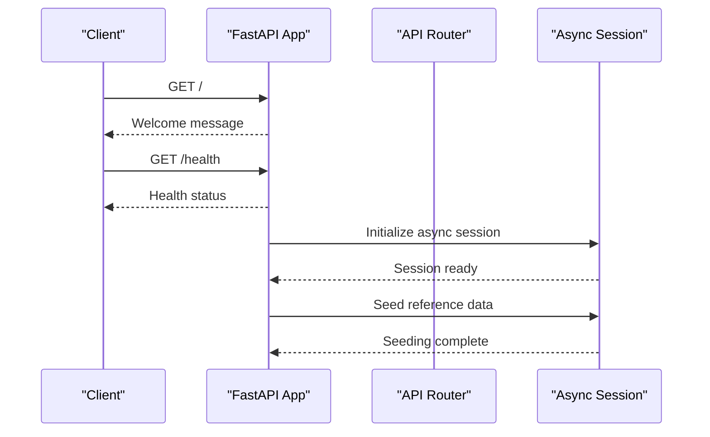

**Diagram sources**
- [backend/app/main.py:1-52](file://backend/app/main.py#L1-L52)
- [backend/app/db/session.py:1-26](file://backend/app/db/session.py#L1-L26)

**Section sources**
- [backend/app/main.py:1-52](file://backend/app/main.py#L1-L52)

### API Router Registry and Feature Modules
- Central router aggregates endpoints for authentication, questions, exam papers, OCR, grading, statistics, and administrative functions.
- Each endpoint module is mounted under a specific prefix and tag for organization.

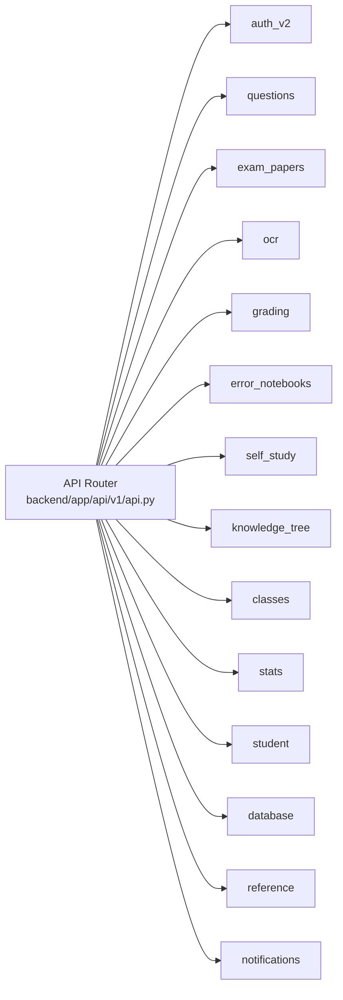

**Diagram sources**
- [backend/app/api/v1/api.py:1-26](file://backend/app/api/v1/api.py#L1-L26)

**Section sources**
- [backend/app/api/v1/api.py:1-26](file://backend/app/api/v1/api.py#L1-L26)

### Configuration and Environment Management
- Settings class loads non-sensitive defaults from sysconfig.json and allows overrides via environment variables.
- Provides database connection URLs for both sync and async engines, Redis and Celery broker settings, upload limits, OCR parameters, and model cache directory.
- Centralized configuration is consumed by the database session factory and other services.

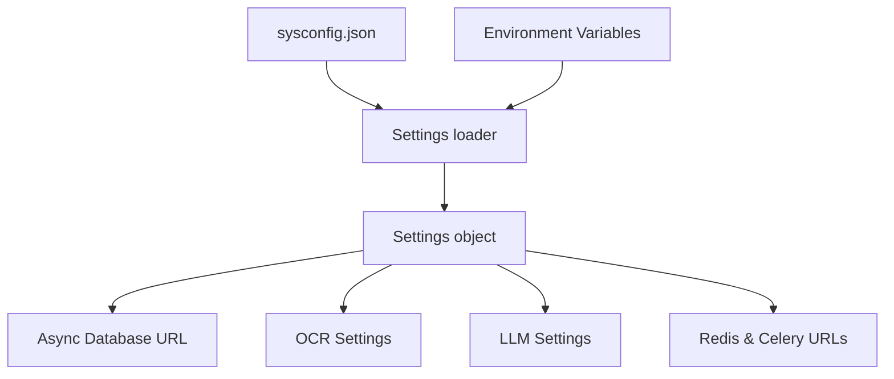

**Diagram sources**
- [backend/app/core/config.py:1-98](file://backend/app/core/config.py#L1-L98)
- [backend/sysconfig.json:1-48](file://backend/sysconfig.json#L1-L48)

**Section sources**
- [backend/app/core/config.py:1-98](file://backend/app/core/config.py#L1-L98)
- [backend/sysconfig.json:1-48](file://backend/sysconfig.json#L1-L48)

### Database Session Management
- Async engine created from async database URL.
- Session factory produces async sessions with commit expiration disabled.
- Dependency generator yields sessions to endpoints and ensures rollback and closure on exceptions.

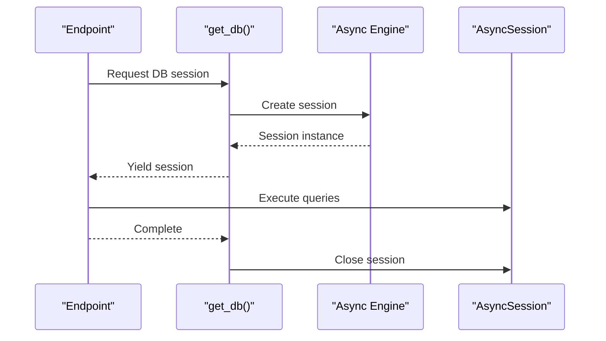

**Diagram sources**
- [backend/app/db/session.py:1-26](file://backend/app/db/session.py#L1-L26)

**Section sources**
- [backend/app/db/session.py:1-26](file://backend/app/db/session.py#L1-L26)

### OCR Service Integration
- Processes uploaded images asynchronously, saving to disk and invoking Tesseract OCR.
- Extracts questions using heuristic rules and estimates confidence based on text characteristics.
- Returns structured results with status indicating completion or review requirement.

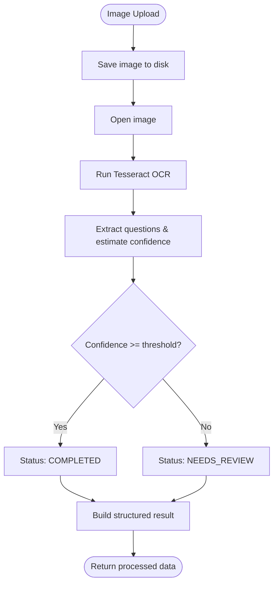

**Diagram sources**
- [backend/app/services/ocr_service.py:1-126](file://backend/app/services/ocr_service.py#L1-L126)

**Section sources**
- [backend/app/services/ocr_service.py:1-126](file://backend/app/services/ocr_service.py#L1-L126)

### LLM Service Orchestration
- Generates questions by building prompts tailored to question types and sending requests to Ollama or DeepSeek.
- Parses LLM responses robustly, deduplicates generated questions, and supports generating variant practice questions.
- Handles timeouts, connectivity errors, and malformed responses gracefully.

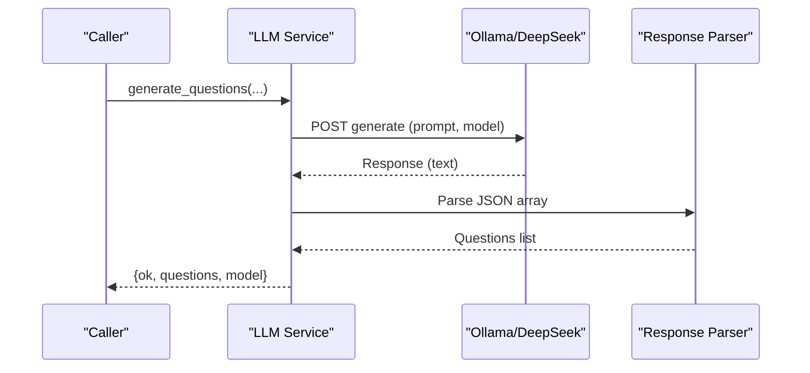

**Diagram sources**
- [backend/app/services/llm_service.py:1-350](file://backend/app/services/llm_service.py#L1-L350)

**Section sources**
- [backend/app/services/llm_service.py:1-350](file://backend/app/services/llm_service.py#L1-L350)

### Frontend Routing and Authentication Flow
- React Router defines protected and public routes with guards based on access tokens.
- Axios client injects Authorization headers and unwraps backend responses.
- Automatic token refresh flow handles 401 responses by requesting a new access token using a refresh token.

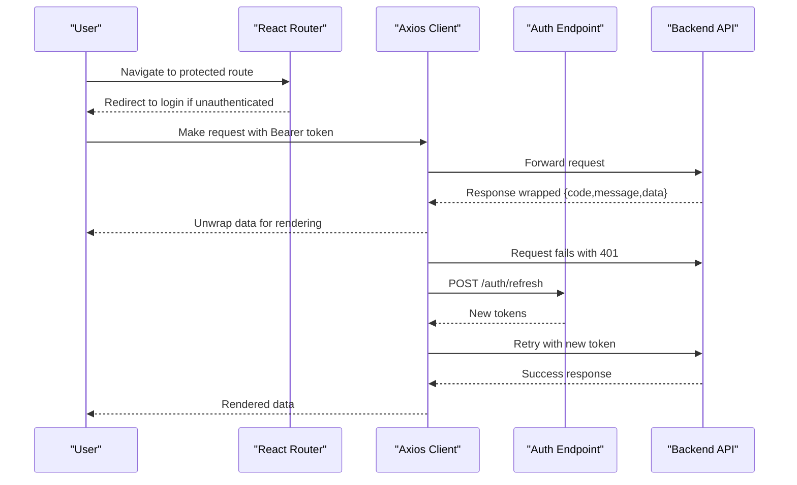

**Diagram sources**
- [frontend/src/router.tsx:1-79](file://frontend/src/router.tsx#L1-L79)
- [frontend/src/api/client.ts:1-55](file://frontend/src/api/client.ts#L1-L55)

**Section sources**
- [frontend/src/router.tsx:1-79](file://frontend/src/router.tsx#L1-L79)
- [frontend/src/api/client.ts:1-55](file://frontend/src/api/client.ts#L1-L55)

## Dependency Analysis
The backend exhibits clear separation of concerns:
- Presentation: FastAPI app and API router.
- Business Logic: Services for OCR and LLM.
- Data Access: Async engine and session factory.
- Configuration: Settings and sysconfig.json.
- External Dependencies: OCR engine and LLM providers.

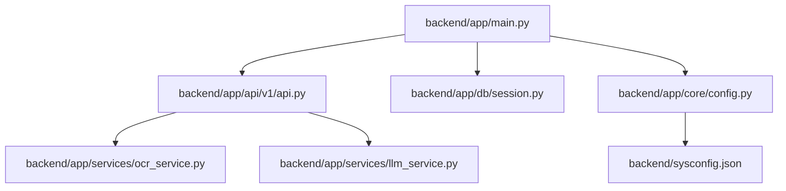

**Diagram sources**
- [backend/app/main.py:1-52](file://backend/app/main.py#L1-L52)
- [backend/app/api/v1/api.py:1-26](file://backend/app/api/v1/api.py#L1-L26)
- [backend/app/services/ocr_service.py:1-126](file://backend/app/services/ocr_service.py#L1-L126)
- [backend/app/services/llm_service.py:1-350](file://backend/app/services/llm_service.py#L1-L350)
- [backend/app/db/session.py:1-26](file://backend/app/db/session.py#L1-L26)
- [backend/app/core/config.py:1-98](file://backend/app/core/config.py#L1-L98)
- [backend/sysconfig.json:1-48](file://backend/sysconfig.json#L1-L48)

**Section sources**
- [backend/app/main.py:1-52](file://backend/app/main.py#L1-L52)
- [backend/app/api/v1/api.py:1-26](file://backend/app/api/v1/api.py#L1-L26)
- [backend/app/core/config.py:1-98](file://backend/app/core/config.py#L1-L98)
- [backend/app/db/session.py:1-26](file://backend/app/db/session.py#L1-L26)
- [backend/app/services/ocr_service.py:1-126](file://backend/app/services/ocr_service.py#L1-L126)
- [backend/app/services/llm_service.py:1-350](file://backend/app/services/llm_service.py#L1-L350)
- [backend/sysconfig.json:1-48](file://backend/sysconfig.json#L1-L48)

## Performance Considerations
- Asynchronous I/O: FastAPI and SQLAlchemy async engine enable concurrent database operations and non-blocking I/O for OCR and LLM calls.
- Concurrency Limits: sysconfig.json defines maximum concurrent OCR and grading operations to prevent resource exhaustion.
- Caching and Model Storage: Model cache directory and upload size limits help manage local resources efficiently.
- Response Normalization: Unified response wrapper reduces client-side parsing overhead and improves error handling consistency.

[No sources needed since this section provides general guidance]

## Security Architecture
- Token-Based Authentication: Frontend stores access and refresh tokens; Axios client injects Authorization headers automatically.
- Token Refresh: On 401 responses, the client attempts to refresh tokens and retries the original request.
- CORS: Configured broadly for development; production deployments should restrict origins.
- Secrets Management: Sensitive configuration values can be overridden via environment variables.

**Section sources**
- [frontend/src/api/client.ts:1-55](file://frontend/src/api/client.ts#L1-L55)
- [backend/app/main.py:20-27](file://backend/app/main.py#L20-L27)

## Scalability Considerations
- Horizontal Scaling: Docker Compose demonstrates independent containers for backend and frontend; database can be scaled separately.
- Background Tasks: Celery broker and result backend settings indicate potential use of asynchronous workers for heavy tasks like OCR processing.
- Resource Limits: sysconfig.json includes concurrency caps for OCR and grading to maintain stability under load.
- Microservices Orientation: Feature-specific routers and service layer promote modular scaling of individual capabilities.

**Section sources**
- [docker-compose.yml:1-33](file://docker-compose.yml#L1-L33)
- [backend/app/core/config.py:73-75](file://backend/app/core/config.py#L73-L75)
- [backend/sysconfig.json:31-42](file://backend/sysconfig.json#L31-L42)

## Deployment Topology
The system is containerized with Docker Compose:
- Backend service builds from backend/Dockerfile, exposes port 8000, and mounts backend code and SQLite database file for development.
- Frontend service builds from frontend/Dockerfile, exposes port 3000, and depends on backend.
- Both services run with host binding for local development.

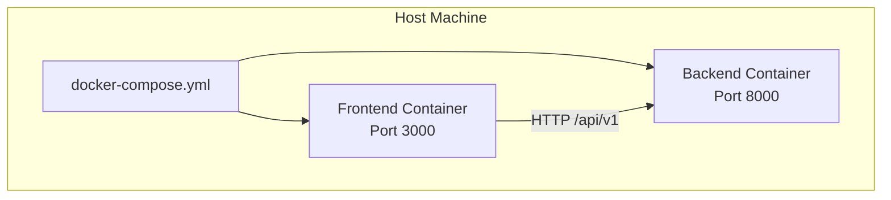

**Diagram sources**
- [docker-compose.yml:1-33](file://docker-compose.yml#L1-L33)
- [backend/Dockerfile:1-11](file://backend/Dockerfile#L1-L11)
- [frontend/Dockerfile:1-11](file://frontend/Dockerfile#L1-L11)

**Section sources**
- [docker-compose.yml:1-33](file://docker-compose.yml#L1-L33)
- [backend/Dockerfile:1-11](file://backend/Dockerfile#L1-L11)
- [frontend/Dockerfile:1-11](file://frontend/Dockerfile#L1-L11)

## External Integrations
- OCR Engine: Tesseract integration for image-to-text processing; availability checked at runtime.
- LLM Providers: Support for Ollama and DeepSeek APIs with configurable endpoints and models; current provider selected via sysconfig.
- Database: PostgreSQL accessed via async SQLAlchemy engine; sysconfig.json provides connection parameters.

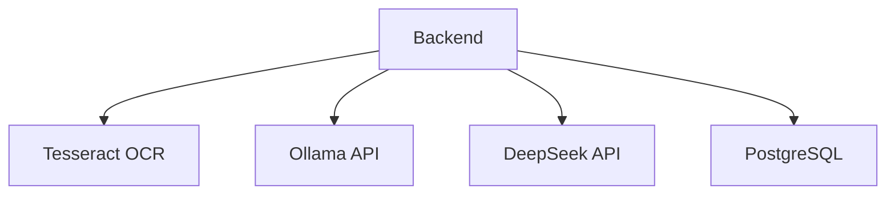

**Diagram sources**
- [backend/app/services/ocr_service.py:1-126](file://backend/app/services/ocr_service.py#L1-L126)
- [backend/app/services/llm_service.py:1-350](file://backend/app/services/llm_service.py#L1-L350)
- [backend/app/core/config.py:56-61](file://backend/app/core/config.py#L56-L61)
- [backend/sysconfig.json:8-30](file://backend/sysconfig.json#L8-L30)

**Section sources**
- [backend/app/services/ocr_service.py:1-126](file://backend/app/services/ocr_service.py#L1-L126)
- [backend/app/services/llm_service.py:1-350](file://backend/app/services/llm_service.py#L1-L350)
- [backend/app/core/config.py:56-61](file://backend/app/core/config.py#L56-L61)
- [backend/sysconfig.json:8-30](file://backend/sysconfig.json#L8-L30)

## Troubleshooting Guide
- Health Checks: Use the /health endpoint to verify backend availability.
- Database Connectivity: Verify async database URL and credentials in settings; ensure PostgreSQL is reachable.
- OCR Availability: Confirm Tesseract installation and language packs; check OCR engine configuration.
- LLM Connectivity: Validate provider endpoints and API keys; confirm network access to Ollama or DeepSeek.
- Frontend Authentication: Ensure tokens are present and refreshed; check Authorization header injection and response unwrapping.

**Section sources**
- [backend/app/main.py:50-52](file://backend/app/main.py#L50-L52)
- [backend/app/core/config.py:56-61](file://backend/app/core/config.py#L56-L61)
- [backend/app/services/ocr_service.py:71-78](file://backend/app/services/ocr_service.py#L71-L78)
- [backend/app/services/llm_service.py:100-103](file://backend/app/services/llm_service.py#L100-L103)
- [frontend/src/api/client.ts:17-52](file://frontend/src/api/client.ts#L17-L52)

## Conclusion
The Ruicheng Educational Management System employs a clean, layered architecture with clear separation between presentation, business logic, and data access. The FastAPI backend leverages async/await patterns and a centralized router for modular endpoints, while the React frontend uses Ant Design components and a robust Axios client for seamless API integration. PostgreSQL with SQLAlchemy async ORM provides reliable persistence, and Docker containerization simplifies deployment. External integrations for OCR and LLM enhance functionality, with configuration-driven settings enabling flexible operation across environments. The architecture supports scalability, security, and performance through concurrency controls, token-based authentication, and modular service design.