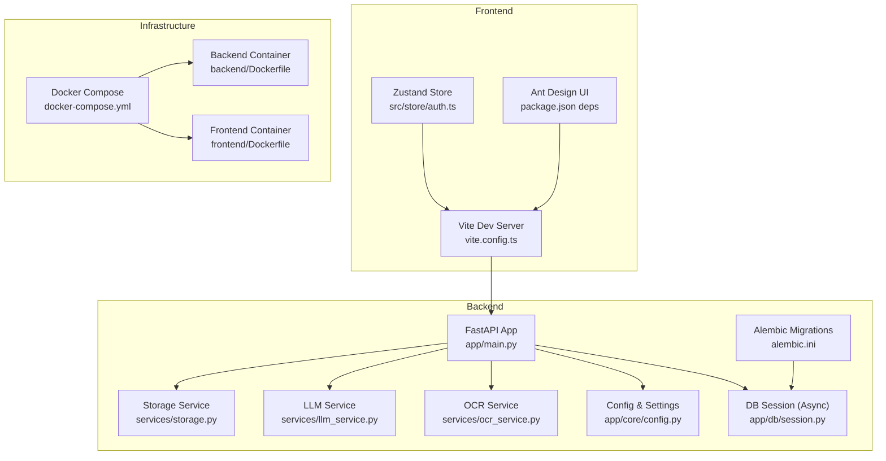
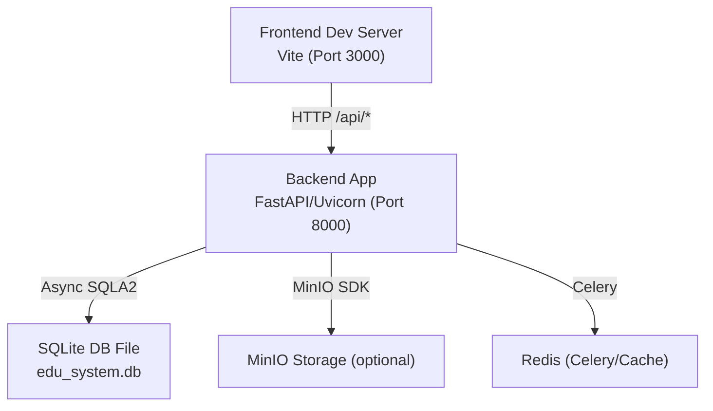
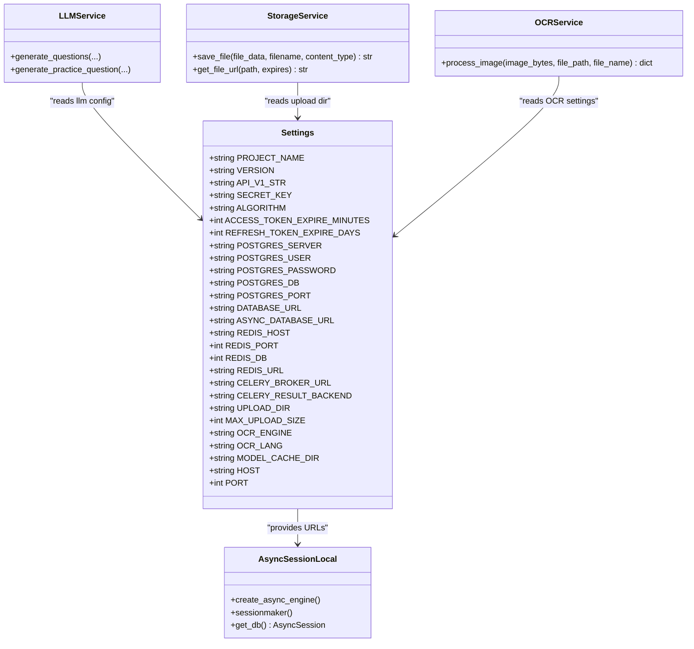
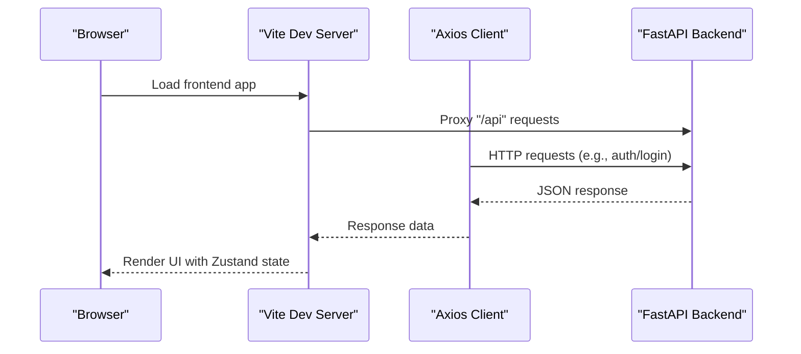
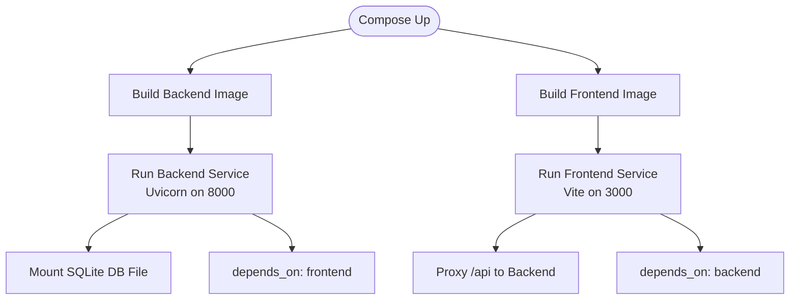
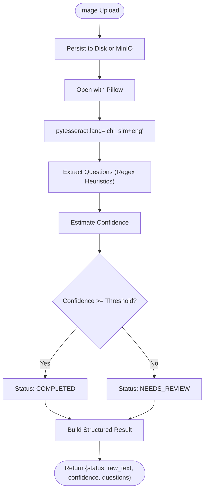
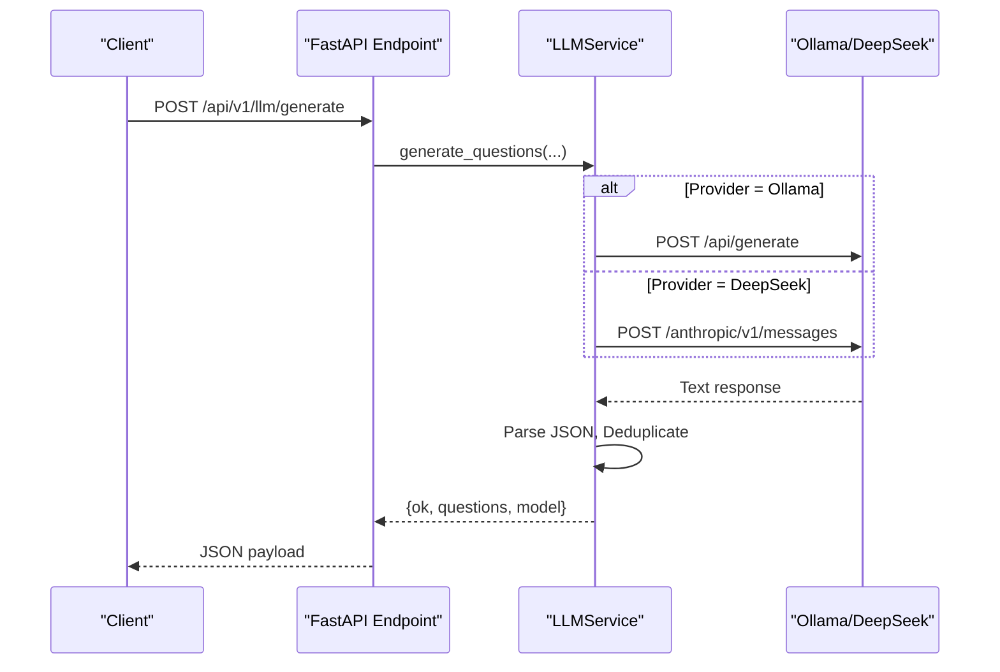
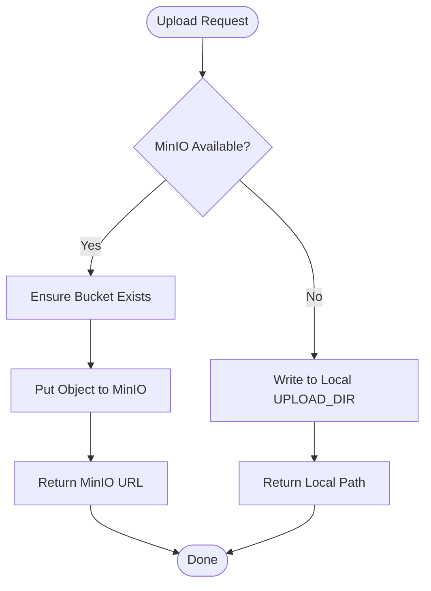
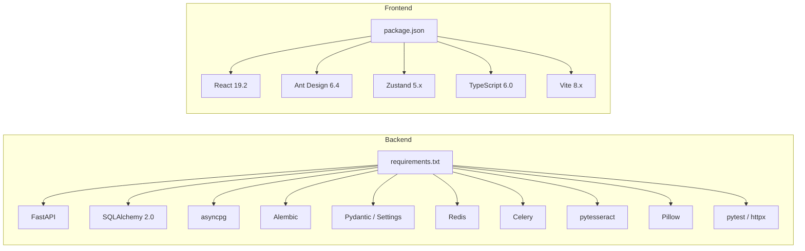

# Technology Stack

<cite>
**Referenced Files in This Document**
- [backend/requirements.txt](file://backend/requirements.txt)
- [frontend/package.json](file://frontend/package.json)
- [docker-compose.yml](file://docker-compose.yml)
- [backend/Dockerfile](file://backend/Dockerfile)
- [frontend/Dockerfile](file://frontend/Dockerfile)
- [backend/app/main.py](file://backend/app/main.py)
- [backend/app/core/config.py](file://backend/app/core/config.py)
- [backend/alembic.ini](file://backend/alembic.ini)
- [backend/app/db/session.py](file://backend/app/db/session.py)
- [backend/app/services/ocr_service.py](file://backend/app/services/ocr_service.py)
- [backend/app/services/storage.py](file://backend/app/services/storage.py)
- [backend/app/services/llm_service.py](file://backend/app/services/llm_service.py)
- [frontend/vite.config.ts](file://frontend/vite.config.ts)
- [frontend/src/store/auth.ts](file://frontend/src/store/auth.ts)
- [backend/sysconfig.json](file://backend/sysconfig.json)
</cite>

## Table of Contents
1. [Introduction](#introduction)
2. [Project Structure](#project-structure)
3. [Core Components](#core-components)
4. [Architecture Overview](#architecture-overview)
5. [Detailed Component Analysis](#detailed-component-analysis)
6. [Dependency Analysis](#dependency-analysis)
7. [Performance Considerations](#performance-considerations)
8. [Troubleshooting Guide](#troubleshooting-guide)
9. [Conclusion](#conclusion)
10. [Appendices](#appendices)

## Introduction
This document presents the technology stack powering the Ruicheng Educational Management System. It covers the backend (FastAPI, SQLAlchemy 2.0 async, Alembic, Pydantic, PostgreSQL/SQLite), the frontend (React 19.2, Ant Design 6.4, TypeScript 6.0, Zustand), infrastructure (Docker, Docker Compose), and key integrations (OCR via Tesseract, LLM via Ollama/DeepSeek, MinIO/local storage). It also includes version compatibility considerations, upgrade guidance, and rationale for technology choices.

## Project Structure
The system is organized into two primary modules:
- Backend: Python-based API built with FastAPI, async ORM with SQLAlchemy 2.0, Alembic migrations, and integrated services for OCR, LLM, and file storage.
- Frontend: React 19.2 SPA with TypeScript, Ant Design 6.4, and Zustand for state management, proxied to the backend via Vite.

**Diagram sources**
- [backend/app/main.py:1-52](file://backend/app/main.py#L1-L52)
- [backend/app/core/config.py:36-98](file://backend/app/core/config.py#L36-L98)
- [backend/app/db/session.py:1-26](file://backend/app/db/session.py#L1-L26)
- [backend/alembic.ini:86-90](file://backend/alembic.ini#L86-L90)
- [backend/app/services/ocr_service.py:1-126](file://backend/app/services/ocr_service.py#L1-L126)
- [backend/app/services/llm_service.py:1-350](file://backend/app/services/llm_service.py#L1-L350)
- [backend/app/services/storage.py:1-55](file://backend/app/services/storage.py#L1-L55)
- [frontend/vite.config.ts:1-17](file://frontend/vite.config.ts#L1-L17)
- [frontend/src/store/auth.ts:1-96](file://frontend/src/store/auth.ts#L1-L96)
- [docker-compose.yml:1-33](file://docker-compose.yml#L1-L33)
- [backend/Dockerfile:1-11](file://backend/Dockerfile#L1-L11)
- [frontend/Dockerfile:1-11](file://frontend/Dockerfile#L1-L11)

**Section sources**
- [docker-compose.yml:1-33](file://docker-compose.yml#L1-L33)
- [backend/Dockerfile:1-11](file://backend/Dockerfile#L1-L11)
- [frontend/Dockerfile:1-11](file://frontend/Dockerfile#L1-L11)

## Core Components
- Backend framework: FastAPI 0.104.1 with Uvicorn for ASGI serving.
- Data layer: SQLAlchemy 2.0 with asyncpg driver and async session factory; Alembic for migrations.
- Validation: Pydantic and pydantic-settings for runtime configuration and validation.
- Authentication and security: python-jose, passlib/bcrypt, and token-based auth.
- Background tasks and caching: Redis-backed Celery.
- File handling: Local filesystem or MinIO with presigned URL support.
- OCR: Tesseract via pytesseract and Pillow.
- LLM integration: Ollama and DeepSeek APIs with configurable endpoints and models.
- Testing: pytest with pytest-asyncio and httpx.

**Section sources**
- [backend/requirements.txt:1-27](file://backend/requirements.txt#L1-L27)
- [backend/app/main.py:1-52](file://backend/app/main.py#L1-L52)
- [backend/app/core/config.py:36-98](file://backend/app/core/config.py#L36-L98)
- [backend/app/db/session.py:1-26](file://backend/app/db/session.py#L1-L26)
- [backend/alembic.ini:86-90](file://backend/alembic.ini#L86-L90)
- [backend/app/services/storage.py:1-55](file://backend/app/services/storage.py#L1-L55)
- [backend/app/services/ocr_service.py:1-126](file://backend/app/services/ocr_service.py#L1-L126)
- [backend/app/services/llm_service.py:1-350](file://backend/app/services/llm_service.py#L1-L350)

## Architecture Overview
The system employs a containerized microservice-like architecture:
- Backend runs as a FastAPI application exposing REST endpoints.
- Frontend is a React SPA served via Vite’s dev server and proxied to the backend.
- Docker Compose orchestrates backend and frontend containers, mounting source directories for hot reload and persisting a local SQLite database file for development.

**Diagram sources**
- [docker-compose.yml:1-33](file://docker-compose.yml#L1-L33)
- [frontend/vite.config.ts:8-13](file://frontend/vite.config.ts#L8-L13)
- [backend/alembic.ini:89-90](file://backend/alembic.ini#L89-L90)
- [backend/app/services/storage.py:10-22](file://backend/app/services/storage.py#L10-L22)

**Section sources**
- [docker-compose.yml:1-33](file://docker-compose.yml#L1-L33)
- [frontend/vite.config.ts:1-17](file://frontend/vite.config.ts#L1-L17)
- [backend/alembic.ini:86-90](file://backend/alembic.ini#L86-L90)

## Detailed Component Analysis

### Backend Stack
- Web framework: FastAPI 0.104.1 with CORS middleware and unified response wrapper.
- Database: Async SQLAlchemy 2.0 engine configured via settings; supports PostgreSQL via asyncpg.
- Migrations: Alembic with SQLite by default; easily switchable to PostgreSQL.
- Validation: Pydantic settings for environment-driven configuration.
- Security: HS256 JWT tokens, bcrypt hashing, multipart/form-data support.
- Background tasks: Celery with Redis broker/backend.
- File storage: MinIO client initialization with fallback to local filesystem; presigned URL generation.
- OCR: Tesseract integration with confidence estimation and structured question extraction.
- LLM: Dual-provider support (Ollama and DeepSeek) with robust parsing and deduplication.

**Diagram sources**
- [backend/app/core/config.py:36-98](file://backend/app/core/config.py#L36-L98)
- [backend/app/db/session.py:1-26](file://backend/app/db/session.py#L1-L26)
- [backend/app/services/ocr_service.py:61-126](file://backend/app/services/ocr_service.py#L61-L126)
- [backend/app/services/storage.py:25-55](file://backend/app/services/storage.py#L25-L55)
- [backend/app/services/llm_service.py:54-104](file://backend/app/services/llm_service.py#L54-L104)

**Section sources**
- [backend/app/main.py:1-52](file://backend/app/main.py#L1-L52)
- [backend/app/core/config.py:36-98](file://backend/app/core/config.py#L36-L98)
- [backend/app/db/session.py:1-26](file://backend/app/db/session.py#L1-L26)
- [backend/alembic.ini:86-90](file://backend/alembic.ini#L86-L90)
- [backend/app/services/ocr_service.py:1-126](file://backend/app/services/ocr_service.py#L1-L126)
- [backend/app/services/storage.py:1-55](file://backend/app/services/storage.py#L1-L55)
- [backend/app/services/llm_service.py:1-350](file://backend/app/services/llm_service.py#L1-L350)

### Frontend Stack
- Framework: React 19.2 with React DOM 19.2.
- UI: Ant Design 6.4 with Ant Design Icons.
- Routing: react-router-dom 7.x.
- State: Zustand 5.x for lightweight global state (authentication).
- Tooling: TypeScript 6.0, Vite 8.x, ESLint 10.x, React plugin.
- Proxy: Vite dev server proxies /api to backend host.

**Diagram sources**
- [frontend/vite.config.ts:8-13](file://frontend/vite.config.ts#L8-L13)
- [frontend/src/store/auth.ts:1-96](file://frontend/src/store/auth.ts#L1-L96)
- [backend/app/main.py:45-52](file://backend/app/main.py#L45-L52)

**Section sources**
- [frontend/package.json:12-36](file://frontend/package.json#L12-L36)
- [frontend/vite.config.ts:1-17](file://frontend/vite.config.ts#L1-L17)
- [frontend/src/store/auth.ts:1-96](file://frontend/src/store/auth.ts#L1-L96)

### Infrastructure and Deployment
- Containers: Python 3.12 slim for backend; Node.js 22 Alpine for frontend.
- Orchestration: Docker Compose with named services, port mapping, and shared volumes for hot reload.
- Development database: SQLite file mounted under backend directory for persistence.

**Diagram sources**
- [docker-compose.yml:1-33](file://docker-compose.yml#L1-L33)
- [backend/Dockerfile:1-11](file://backend/Dockerfile#L1-L11)
- [frontend/Dockerfile:1-11](file://frontend/Dockerfile#L1-L11)

**Section sources**
- [docker-compose.yml:1-33](file://docker-compose.yml#L1-L33)
- [backend/Dockerfile:1-11](file://backend/Dockerfile#L1-L11)
- [frontend/Dockerfile:1-11](file://frontend/Dockerfile#L1-L11)

### OCR Processing Pipeline
The OCR service integrates Tesseract with image preprocessing and structured output generation. Confidence estimation and question extraction heuristics guide review workflows.

**Diagram sources**
- [backend/app/services/ocr_service.py:61-126](file://backend/app/services/ocr_service.py#L61-L126)

**Section sources**
- [backend/app/services/ocr_service.py:1-126](file://backend/app/services/ocr_service.py#L1-L126)
- [backend/app/services/storage.py:1-55](file://backend/app/services/storage.py#L1-L55)

### LLM Integration Workflow
The LLM service supports Ollama and DeepSeek providers. It constructs prompts per question type, parses JSON responses, and deduplicates generated items.

**Diagram sources**
- [backend/app/services/llm_service.py:54-104](file://backend/app/services/llm_service.py#L54-L104)
- [backend/app/services/llm_service.py:132-179](file://backend/app/services/llm_service.py#L132-L179)

**Section sources**
- [backend/app/services/llm_service.py:1-350](file://backend/app/services/llm_service.py#L1-L350)
- [backend/sysconfig.json:8-30](file://backend/sysconfig.json#L8-L30)

### File Storage Abstraction
The storage service transparently uses MinIO when available, otherwise falls back to local uploads. Presigned URLs are generated for MinIO objects.

**Diagram sources**
- [backend/app/services/storage.py:25-55](file://backend/app/services/storage.py#L25-L55)

**Section sources**
- [backend/app/services/storage.py:1-55](file://backend/app/services/storage.py#L1-L55)

## Dependency Analysis
- Backend dependencies pinned in requirements.txt include FastAPI, Uvicorn, SQLAlchemy 2.0, asyncpg, Alembic, Pydantic, Redis, Celery, OCR libraries, and testing tools.
- Frontend dependencies include React, Ant Design, axios, dayjs, xlsx, and Zustand, with TypeScript and Vite tooling.
- Docker Compose defines service dependencies and environment overrides for development.

**Diagram sources**
- [backend/requirements.txt:1-27](file://backend/requirements.txt#L1-L27)
- [frontend/package.json:12-36](file://frontend/package.json#L12-L36)

**Section sources**
- [backend/requirements.txt:1-27](file://backend/requirements.txt#L1-L27)
- [frontend/package.json:1-38](file://frontend/package.json#L1-L38)

## Performance Considerations
- Asynchronous I/O: SQLAlchemy 2.0 async sessions reduce blocking on database operations.
- Concurrency controls: sysconfig.json limits concurrent OCR and grading to balance throughput and resource usage.
- Caching and queues: Redis-backed Celery enables background processing for heavy tasks (e.g., OCR, LLM generation).
- Storage: MinIO offers scalable object storage; local fallback simplifies development but may limit scalability.
- Frontend bundling: Vite builds optimize bundle sizes; avoid unnecessary re-renders by structuring Zustand slices carefully.

[No sources needed since this section provides general guidance]

## Troubleshooting Guide
- Database connectivity: Verify ASYNC_DATABASE_URL and credentials; Alembic defaults to SQLite for development.
- OCR failures: Ensure Tesseract and language packs are installed; confirm image paths and permissions.
- LLM connectivity: Confirm Ollama/DeepSeek endpoints and model availability; check timeouts and API keys.
- Storage issues: Validate MinIO endpoint and credentials; ensure bucket exists when using MinIO.
- CORS and proxy: Confirm Vite proxy targets the backend host and port.

**Section sources**
- [backend/app/core/config.py:56-71](file://backend/app/core/config.py#L56-L71)
- [backend/alembic.ini:89-90](file://backend/alembic.ini#L89-L90)
- [backend/app/services/ocr_service.py:71-78](file://backend/app/services/ocr_service.py#L71-L78)
- [backend/app/services/llm_service.py:100-103](file://backend/app/services/llm_service.py#L100-L103)
- [backend/app/services/storage.py:10-22](file://backend/app/services/storage.py#L10-L22)
- [frontend/vite.config.ts:8-13](file://frontend/vite.config.ts#L8-L13)

## Conclusion
The Ruicheng Educational Management System leverages modern, efficient technologies tailored for an educational platform requiring robust APIs, interactive UI, and intelligent capabilities. The backend stack emphasizes asynchronous operations and strong validation, while the frontend prioritizes developer productivity and maintainable state management. Infrastructure is container-first, enabling rapid iteration and deployment flexibility.

[No sources needed since this section summarizes without analyzing specific files]

## Appendices

### Version Compatibility Matrix
- Backend
  - FastAPI 0.104.1
  - SQLAlchemy 2.0.23
  - Alembic 1.13.1
  - Pydantic 2.5.0
  - Pydantic Settings 2.1.0
  - asyncpg 0.31.0
  - psycopg2-binary 2.9.9
  - Redis 4.6.0
  - Celery 5.4.0
  - pytesseract >= 0.3.13
  - Pillow >= 10.0.0
  - pytest 7.4.3
  - pytest-asyncio 0.23.6
  - httpx 0.25.2
- Frontend
  - React ^19.2.6
  - React DOM ^19.2.6
  - Ant Design ^6.4.2
  - Ant Design Icons ^6.2.3
  - axios ^1.16.1
  - dayjs ^1.11.20
  - xlsx ^0.18.5
  - Zustand ^5.0.13
  - TypeScript ~6.0.2
  - Vite ^8.0.12
  - ESLint ^10.3.0

**Section sources**
- [backend/requirements.txt:1-27](file://backend/requirements.txt#L1-L27)
- [frontend/package.json:12-36](file://frontend/package.json#L12-L36)

### Upgrade Considerations
- Backend
  - Pin major versions in requirements.txt; test migrations after upgrading SQLAlchemy/Alembic.
  - Validate asyncpg and connection pooling after upgrading SQLAlchemy 2.x.
  - Keep Pydantic and pydantic-settings aligned to avoid breaking changes in settings parsing.
  - For PostgreSQL migration, update DATABASE_URL and alembic.ini accordingly.
- Frontend
  - Increment TypeScript and React minor versions cautiously; verify Ant Design and Zustand compatibility.
  - Update Vite and plugins in lockstep; check proxy and build configurations.
- Infrastructure
  - Align Docker base images (Python 3.12, Node 22) with security updates.
  - Rebuild images after dependency bumps to ensure reproducible deployments.

**Section sources**
- [backend/requirements.txt:1-27](file://backend/requirements.txt#L1-L27)
- [frontend/package.json:12-36](file://frontend/package.json#L12-L36)
- [backend/alembic.ini:86-90](file://backend/alembic.ini#L86-L90)
- [backend/app/core/config.py:56-71](file://backend/app/core/config.py#L56-L71)

### Rationale and Alternatives
- FastAPI: Chosen for automatic OpenAPI generation, pydantic validation, and excellent async support; alternatives include Quart/Falcon but lose built-in schema generation.
- SQLAlchemy 2.0 async: Preferred for async I/O and modern ORM features; alternatives like Tortoise ORM require learning curves.
- Alembic: Standard for database migrations; alternatives include Flyway/liquibase but add operational overhead.
- Pydantic: Strong runtime validation and settings management; alternatives include attrs/dataclasses with manual validation.
- PostgreSQL vs SQLite: PostgreSQL recommended for production; SQLite suitable for development and demos.
- React + Ant Design: Rapid UI development with consistent design system; alternatives include Next.js + Material UI or Vue ecosystem.
- Zustand: Lightweight state management; alternatives include Redux Toolkit or Jotai depending on complexity needs.
- OCR: Tesseract chosen for simplicity and language pack support; alternatives include PaddleOCR Python bindings or commercial OCR APIs.
- LLM: Ollama for local inference; DeepSeek for hosted API; alternatives include vLLM, Hugging Face Inference, or Azure OpenAI.
- MinIO: S3-compatible object storage; alternatives include AWS S3, Google Cloud Storage, or local filesystem.

[No sources needed since this section provides general guidance]