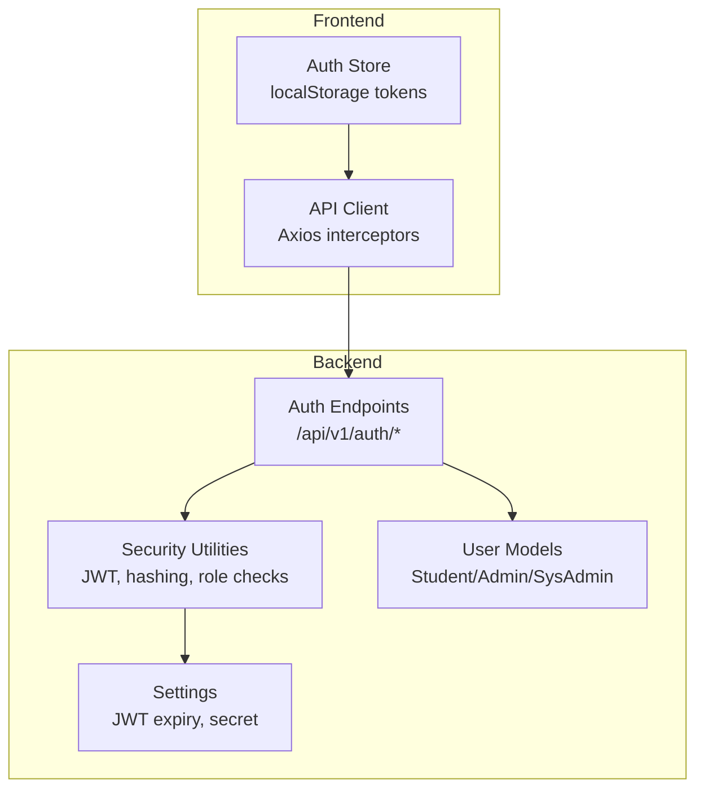
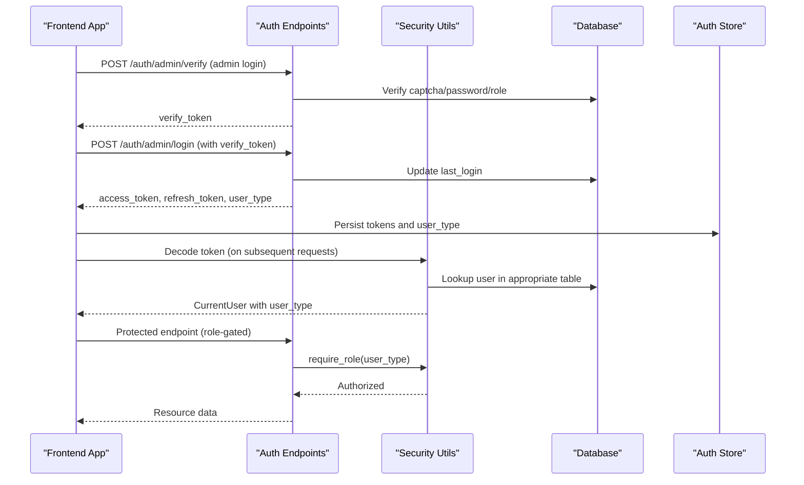
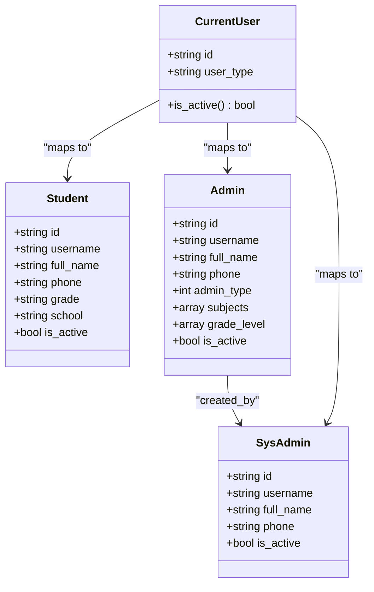
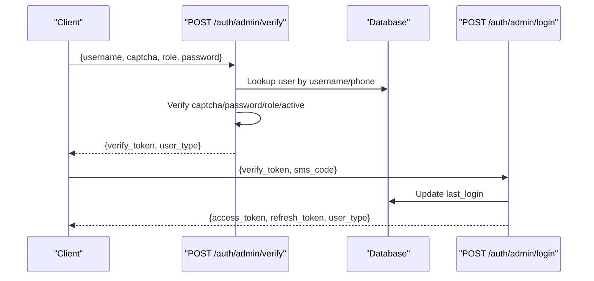
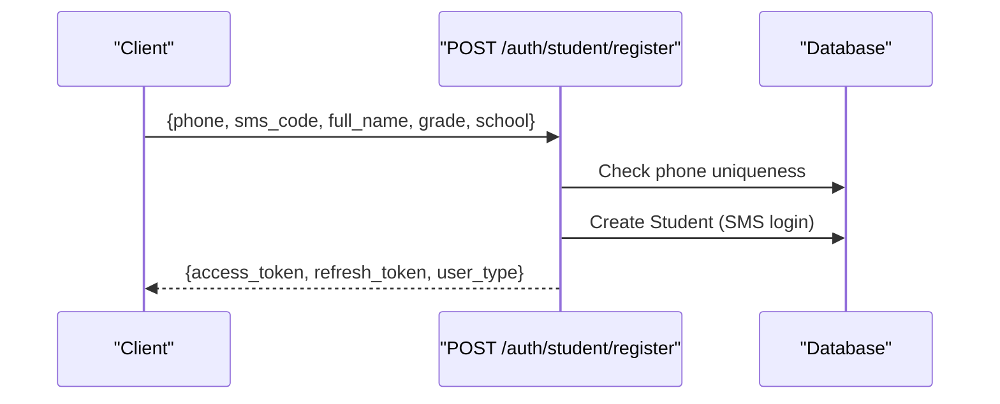
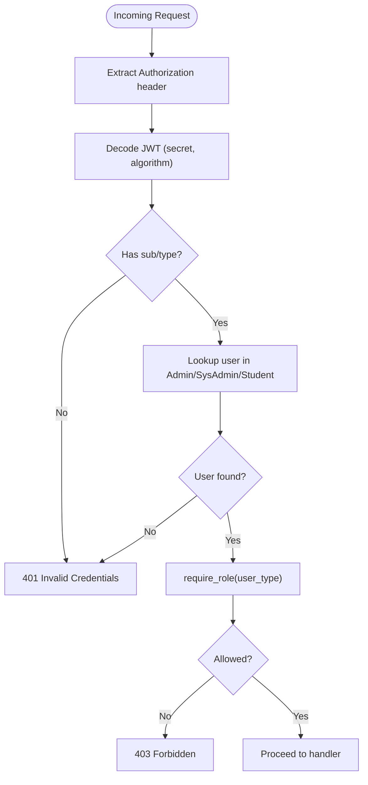
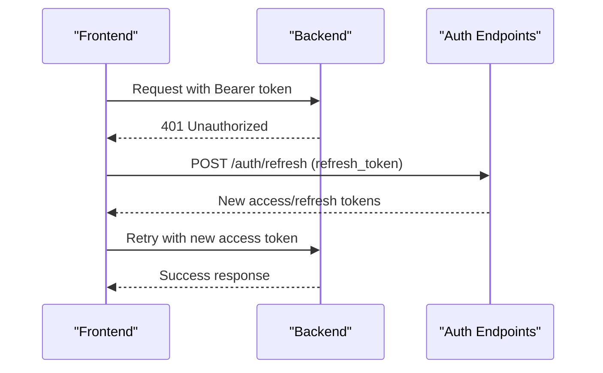
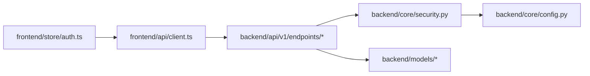

# User Roles & Permissions

<cite>
**Referenced Files in This Document**
- [auth_v2.py](file://backend/app/api/v1/endpoints/auth_v2.py)
- [security.py](file://backend/app/core/security.py)
- [config.py](file://backend/app/core/config.py)
- [admin.py](file://backend/app/models/admin.py)
- [sys_admin.py](file://backend/app/models/sys_admin.py)
- [student.py](file://backend/app/models/student.py)
- [classes.py](file://backend/app/api/v1/endpoints/classes.py)
- [question_admin.py](file://backend/app/api/v1/endpoints/question_admin.py)
- [stats.py](file://backend/app/api/v1/endpoints/stats.py)
- [student.py (statistics)](file://backend/app/api/v1/endpoints/student.py)
- [auth store](file://frontend/src/store/auth.ts)
- [api client](file://frontend/src/api/client.ts)
</cite>

## Table of Contents
1. [Introduction](#introduction)
2. [Project Structure](#project-structure)
3. [Core Components](#core-components)
4. [Architecture Overview](#architecture-overview)
5. [Detailed Component Analysis](#detailed-component-analysis)
6. [Dependency Analysis](#dependency-analysis)
7. [Performance Considerations](#performance-considerations)
8. [Troubleshooting Guide](#troubleshooting-guide)
9. [Conclusion](#conclusion)

## Introduction
This document describes the multi-role authentication and authorization model of the Ruicheng Educational Management System. It covers the four user roles, JWT-based authentication, role-based access control, session management, registration flows, and administrative oversight. It also outlines permission boundaries, delegation capabilities, and security considerations for each role.

## Project Structure
The authentication and authorization logic spans backend endpoints, core security utilities, and frontend session management:
- Backend endpoints implement login, registration, profile management, and role-gated operations.
- Core security utilities handle JWT encoding/decoding, password hashing, and role checks.
- Frontend stores tokens and user metadata in local storage and injects Authorization headers.

**Diagram sources**
- [auth_v2.py:1-476](file://backend/app/api/v1/endpoints/auth_v2.py#L1-L476)
- [security.py:1-104](file://backend/app/core/security.py#L1-L104)
- [config.py:36-98](file://backend/app/core/config.py#L36-L98)
- [admin.py:1-27](file://backend/app/models/admin.py#L1-L27)
- [sys_admin.py:1-22](file://backend/app/models/sys_admin.py#L1-L22)
- [student.py:1-23](file://backend/app/models/student.py#L1-L23)
- [auth store:1-96](file://frontend/src/store/auth.ts#L1-L96)
- [api client:1-54](file://frontend/src/api/client.ts#L1-L54)

**Section sources**
- [auth_v2.py:1-476](file://backend/app/api/v1/endpoints/auth_v2.py#L1-L476)
- [security.py:1-104](file://backend/app/core/security.py#L1-L104)
- [config.py:36-98](file://backend/app/core/config.py#L36-L98)
- [admin.py:1-27](file://backend/app/models/admin.py#L1-L27)
- [sys_admin.py:1-22](file://backend/app/models/sys_admin.py#L1-L22)
- [student.py:1-23](file://backend/app/models/student.py#L1-L23)
- [auth store:1-96](file://frontend/src/store/auth.ts#L1-L96)
- [api client:1-54](file://frontend/src/api/client.ts#L1-L54)

## Core Components
- JWT-based authentication with access and refresh tokens, stored in frontend localStorage and sent via Authorization header.
- Role-aware login flows: admin (teacher, question admin, system admin) and student (SMS-based).
- Role-based access control enforced via a decorator that checks the user’s type against allowed roles.
- Password hashing using bcrypt; token payloads include user type for routing to the correct user table.
- Session management via token rotation and refresh endpoints.

Key implementation references:
- Token creation and refresh: [auth_v2.py:55-71](file://backend/app/api/v1/endpoints/auth_v2.py#L55-L71)
- JWT decoding and user lookup: [security.py:64-95](file://backend/app/core/security.py#L64-L95)
- Role enforcement: [security.py:98-103](file://backend/app/core/security.py#L98-L103)
- Access/refresh settings: [config.py:42-46](file://backend/app/core/config.py#L42-L46)

**Section sources**
- [auth_v2.py:55-71](file://backend/app/api/v1/endpoints/auth_v2.py#L55-L71)
- [security.py:64-103](file://backend/app/core/security.py#L64-L103)
- [config.py:42-46](file://backend/app/core/config.py#L42-L46)

## Architecture Overview
The system enforces role-based access control at the endpoint level. Tokens carry a user type that determines which user table to query and which operations are permitted.

**Diagram sources**
- [auth_v2.py:91-183](file://backend/app/api/v1/endpoints/auth_v2.py#L91-L183)
- [security.py:64-103](file://backend/app/core/security.py#L64-L103)
- [auth store:56-70](file://frontend/src/store/auth.ts#L56-L70)

**Section sources**
- [auth_v2.py:91-183](file://backend/app/api/v1/endpoints/auth_v2.py#L91-L183)
- [security.py:64-103](file://backend/app/core/security.py#L64-L103)
- [auth store:56-70](file://frontend/src/store/auth.ts#L56-L70)

## Detailed Component Analysis

### Roles and Permissions Matrix
- Student
  - Accesses: question lists, exam taking, error book access, personal stats.
  - Permissions: read-only dashboards and submission records; no administrative actions.
  - Reference: [student.py (statistics):16-111](file://backend/app/api/v1/endpoints/student.py#L16-L111)

- Teacher
  - Accesses: class management, exam creation, performance analytics.
  - Permissions: create/update classes, manage enrolled students, view paper/question statistics for their own exams.
  - Reference: [classes.py:16-243](file://backend/app/api/v1/endpoints/classes.py#L16-L243), [stats.py:17-251](file://backend/app/api/v1/endpoints/stats.py#L17-L251)

- Question Administrator
  - Accesses: syllabus management, question generation, scraping, approval/rejection, deduplication, OCR paper import.
  - Permissions: operate on question bank, approve/reject pending items, maintain syllabi, and scan for duplicates.
  - Reference: [question_admin.py:23-800](file://backend/app/api/v1/endpoints/question_admin.py#L23-L800)

- System Administrator
  - Accesses: system configuration, user management (create/update/delete admins), reference data CRUD.
  - Permissions: create teachers/question admins, list/update/delete admins, manage reference entities.
  - Reference: [auth_v2.py:242-373](file://backend/app/api/v1/endpoints/auth_v2.py#L242-L373), [reference endpoints:62-121](file://backend/app/api/v1/endpoints/reference.py#L62-L121)

**Diagram sources**
- [student.py:8-23](file://backend/app/models/student.py#L8-L23)
- [admin.py:9-27](file://backend/app/models/admin.py#L9-L27)
- [sys_admin.py:8-22](file://backend/app/models/sys_admin.py#L8-L22)
- [security.py:53-95](file://backend/app/core/security.py#L53-L95)

**Section sources**
- [student.py:8-23](file://backend/app/models/student.py#L8-L23)
- [admin.py:9-27](file://backend/app/models/admin.py#L9-L27)
- [sys_admin.py:8-22](file://backend/app/models/sys_admin.py#L8-L22)
- [security.py:53-95](file://backend/app/core/security.py#L53-L95)

### Authentication and Registration Workflows

#### Admin Login (Multi-role)
- Step 1: Verify captcha and role; fetch user from Admin or SysAdmin table; verify password and activation status; issue a short-lived verify token.
- Step 2: Exchange verify token for access/refresh tokens after SMS verification.

**Diagram sources**
- [auth_v2.py:91-183](file://backend/app/api/v1/endpoints/auth_v2.py#L91-L183)

**Section sources**
- [auth_v2.py:91-183](file://backend/app/api/v1/endpoints/auth_v2.py#L91-L183)

#### Student Login and Registration
- Login: captcha + SMS verification; lookup by username or phone; update last_login.
- Registration: SMS verification; uniqueness check on phone; auto-generated username; SMS-based login enabled.

**Diagram sources**
- [auth_v2.py:212-237](file://backend/app/api/v1/endpoints/auth_v2.py#L212-L237)

**Section sources**
- [auth_v2.py:188-237](file://backend/app/api/v1/endpoints/auth_v2.py#L188-L237)

### Role-Based Access Control (RBAC)
- Token payload includes user_type; get_current_user validates token and ensures the user record exists in the appropriate table.
- require_role decorator enforces allowed roles per endpoint.

**Diagram sources**
- [security.py:64-103](file://backend/app/core/security.py#L64-L103)

**Section sources**
- [security.py:64-103](file://backend/app/core/security.py#L64-L103)

### Session Management and Token Rotation
- Access tokens expire after configured minutes; refresh tokens rotate the session.
- Frontend persists tokens and injects Authorization header automatically; refresh interceptor attempts refresh on 401.

**Diagram sources**
- [api client:17-52](file://frontend/src/api/client.ts#L17-L52)
- [auth_v2.py:55-71](file://backend/app/api/v1/endpoints/auth_v2.py#L55-L71)

**Section sources**
- [api client:17-52](file://frontend/src/api/client.ts#L17-L52)
- [auth_v2.py:55-71](file://backend/app/api/v1/endpoints/auth_v2.py#L55-L71)

### Role Transition Scenarios and Delegation
- Role transitions occur during admin verification: the client selects a role (teacher, question admin, system admin), and the backend verifies the user’s actual admin_type and issues a token with the requested user_type.
- Delegation is implicit via shared admin-type fields (subjects, grade_level) enabling targeted access to classes and content.

References:
- Role selection and verification: [auth_v2.py:91-130](file://backend/app/api/v1/endpoints/auth_v2.py#L91-L130)
- Admin model with admin_type and assignment fields: [admin.py:9-27](file://backend/app/models/admin.py#L9-L27)

**Section sources**
- [auth_v2.py:91-130](file://backend/app/api/v1/endpoints/auth_v2.py#L91-L130)
- [admin.py:9-27](file://backend/app/models/admin.py#L9-L27)

### Administrative Oversight Features
- System administrators can create, list, update, and delete admin accounts; update subject/grade assignments; and manage reference entities.
- Profile endpoints expose role labels and editable fields per user type.

References:
- Admin management endpoints: [auth_v2.py:242-373](file://backend/app/api/v1/endpoints/auth_v2.py#L242-L373)
- Profile retrieval and updates: [auth_v2.py:377-475](file://backend/app/api/v1/endpoints/auth_v2.py#L377-L475)

**Section sources**
- [auth_v2.py:242-373](file://backend/app/api/v1/endpoints/auth_v2.py#L242-L373)
- [auth_v2.py:377-475](file://backend/app/api/v1/endpoints/auth_v2.py#L377-L475)

## Dependency Analysis
- Endpoints depend on security utilities for token validation and role checks.
- Security utilities depend on settings for JWT configuration and database sessions for user existence checks.
- Frontend depends on auth store and API client for token persistence and automatic header injection.

**Diagram sources**
- [api client:1-54](file://frontend/src/api/client.ts#L1-L54)
- [auth store:1-96](file://frontend/src/store/auth.ts#L1-L96)
- [auth_v2.py:1-476](file://backend/app/api/v1/endpoints/auth_v2.py#L1-L476)
- [security.py:1-104](file://backend/app/core/security.py#L1-L104)
- [config.py:36-98](file://backend/app/core/config.py#L36-L98)
- [admin.py:1-27](file://backend/app/models/admin.py#L1-L27)
- [sys_admin.py:1-22](file://backend/app/models/sys_admin.py#L1-L22)
- [student.py:1-23](file://backend/app/models/student.py#L1-L23)

**Section sources**
- [api client:1-54](file://frontend/src/api/client.ts#L1-L54)
- [auth store:1-96](file://frontend/src/store/auth.ts#L1-L96)
- [auth_v2.py:1-476](file://backend/app/api/v1/endpoints/auth_v2.py#L1-L476)
- [security.py:1-104](file://backend/app/core/security.py#L1-L104)
- [config.py:36-98](file://backend/app/core/config.py#L36-L98)
- [admin.py:1-27](file://backend/app/models/admin.py#L1-L27)
- [sys_admin.py:1-22](file://backend/app/models/sys_admin.py#L1-L22)
- [student.py:1-23](file://backend/app/models/student.py#L1-L23)

## Performance Considerations
- Token validation occurs on every protected request; keep JWT payload minimal (already includes only user identity and type).
- Role checks are O(1) after token decode; ensure database lookups are indexed on id and username/phone.
- Avoid excessive refresh token usage; implement idle logout and token reuse policies on the frontend.

## Troubleshooting Guide
Common issues and resolutions:
- 401 Invalid Credentials: verify token presence and correctness; ensure user exists in the appropriate table.
  - Reference: [security.py:68-95](file://backend/app/core/security.py#L68-L95)
- 403 Forbidden: user lacks required role; confirm user_type in token and endpoint require_role.
  - Reference: [security.py:98-103](file://backend/app/core/security.py#L98-L103)
- Admin login role mismatch: verify role selection aligns with admin_type.
  - Reference: [auth_v2.py:118-120](file://backend/app/api/v1/endpoints/auth_v2.py#L118-L120)
- Student registration phone duplication: ensure phone uniqueness before creating account.
  - Reference: [auth_v2.py:218-221](file://backend/app/api/v1/endpoints/auth_v2.py#L218-L221)
- Frontend 401 without refresh: ensure refresh interceptor is configured and tokens are persisted.
  - Reference: [api client:17-52](file://frontend/src/api/client.ts#L17-L52)

**Section sources**
- [security.py:68-103](file://backend/app/core/security.py#L68-L103)
- [auth_v2.py:118-120](file://backend/app/api/v1/endpoints/auth_v2.py#L118-L120)
- [auth_v2.py:218-221](file://backend/app/api/v1/endpoints/auth_v2.py#L218-L221)
- [api client:17-52](file://frontend/src/api/client.ts#L17-L52)

## Conclusion
The system implements a robust RBAC model centered on JWT tokens carrying user_type. Admin and student flows are role-scoped, while system administrators retain broad oversight capabilities. Session management leverages token rotation, and frontend interceptors streamline secure request handling. Adhering to these patterns ensures consistent access control across the platform.