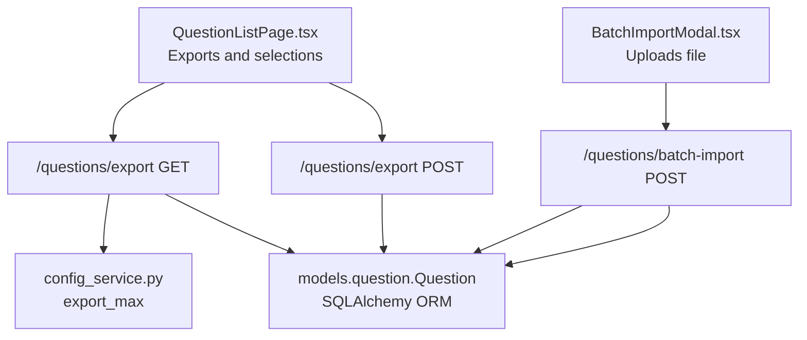
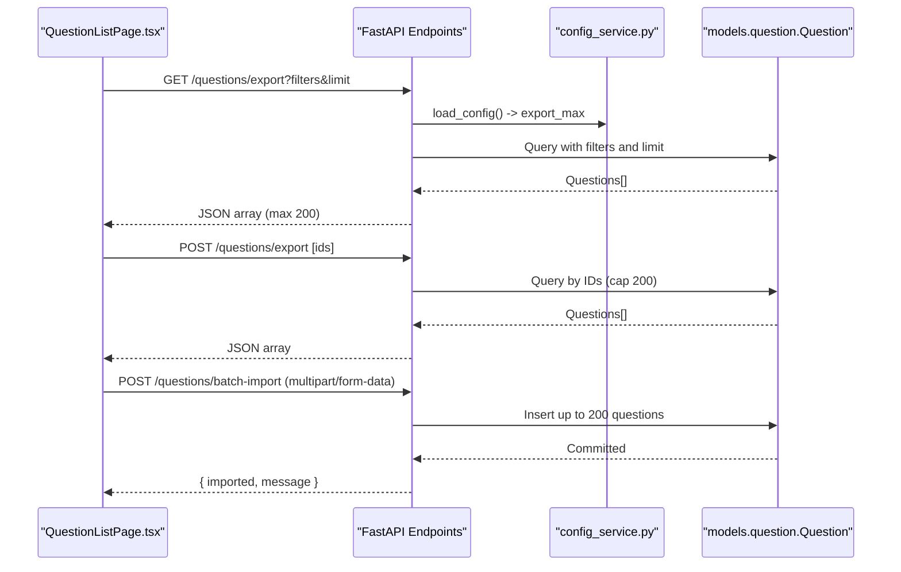
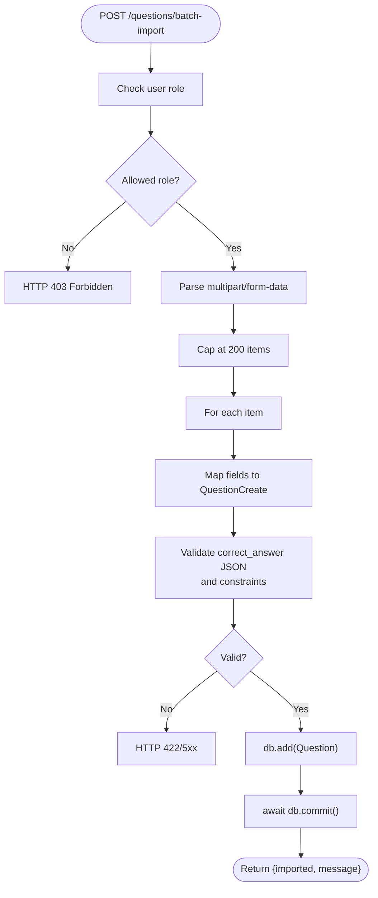
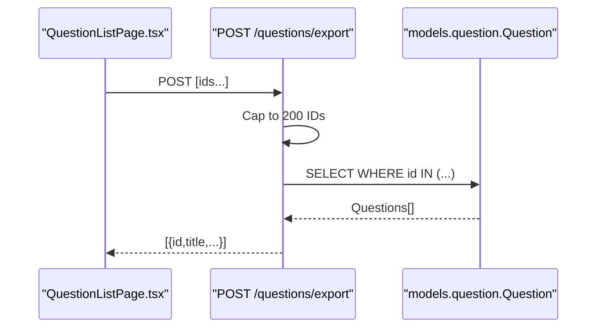
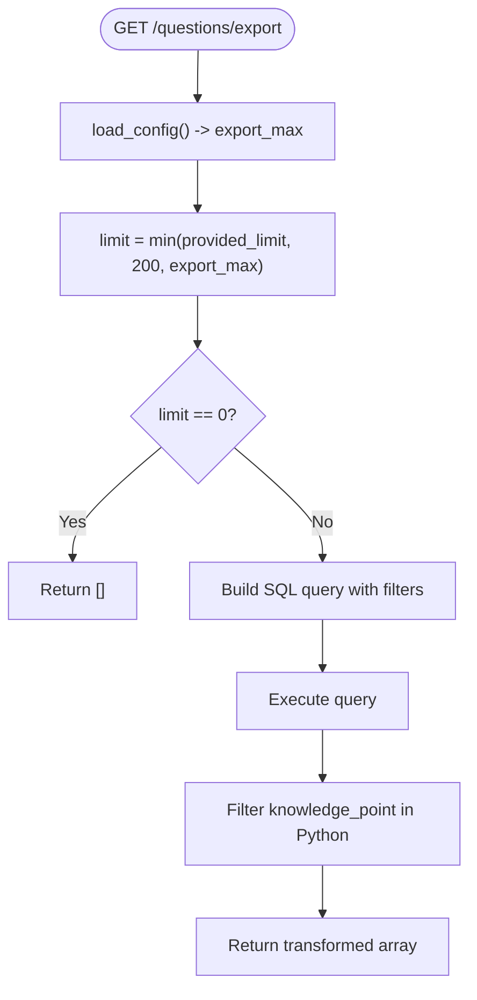
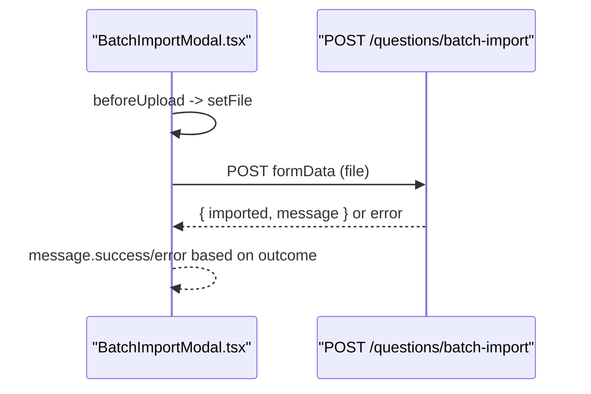
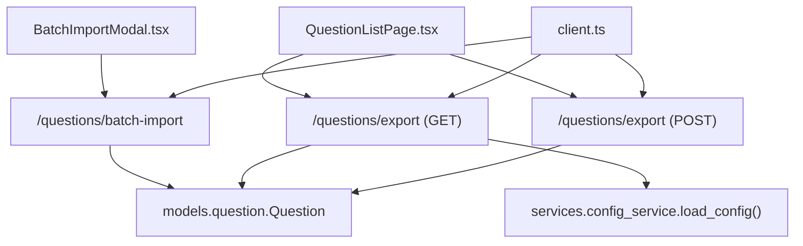

# Batch Import and Export

<cite>
**Referenced Files in This Document**
- [questions.py](file://backend/app/api/v1/endpoints/questions.py)
- [question.py](file://backend/app/models/question.py)
- [question.py](file://backend/app/schemas/question.py)
- [config_service.py](file://backend/app/services/config_service.py)
- [llm_config.py](file://backend/app/api/v1/endpoints/llm_config.py)
- [client.ts](file://frontend/src/api/client.ts)
- [QuestionListPage.tsx](file://frontend/src/pages/questions/QuestionListPage.tsx)
- [BatchImportModal.tsx](file://frontend/src/pages/questions/BatchImportModal.tsx)
</cite>

## Table of Contents
1. [Introduction](#introduction)
2. [Project Structure](#project-structure)
3. [Core Components](#core-components)
4. [Architecture Overview](#architecture-overview)
5. [Detailed Component Analysis](#detailed-component-analysis)
6. [Dependency Analysis](#dependency-analysis)
7. [Performance Considerations](#performance-considerations)
8. [Troubleshooting Guide](#troubleshooting-guide)
9. [Conclusion](#conclusion)

## Introduction
This document explains the batch import and export functionality for questions. It covers:
- The batch_import_questions endpoint and its JSON array processing, field mapping, and validation rules
- The export_selected and export_questions endpoints with filtering and export limits
- Maximum import/export limits (200 items), data transformation, and error handling
- Frontend batch import modal interface, supported formats, and validation feedback
- Examples of import templates, export filters, and troubleshooting common issues
- Performance considerations, batch size limits, and data consistency during bulk operations

## Project Structure
The batch features span backend endpoints, models/schemas, configuration, and frontend UI:
- Backend endpoints define the HTTP APIs for batch import and export
- Schemas and models define validation and persistence rules
- Configuration controls export limits
- Frontend pages and modals provide user interaction and feedback

**Diagram sources**
- [QuestionListPage.tsx:101-126](file://frontend/src/pages/questions/QuestionListPage.tsx#L101-L126)
- [BatchImportModal.tsx:17-33](file://frontend/src/pages/questions/BatchImportModal.tsx#L17-L33)
- [questions.py:127-214](file://backend/app/api/v1/endpoints/questions.py#L127-L214)
- [config_service.py:57-57](file://backend/app/services/config_service.py#L57-L57)
- [question.py:10-43](file://backend/app/models/question.py#L10-L43)

**Section sources**
- [QuestionListPage.tsx:101-126](file://frontend/src/pages/questions/QuestionListPage.tsx#L101-L126)
- [BatchImportModal.tsx:17-33](file://frontend/src/pages/questions/BatchImportModal.tsx#L17-L33)
- [questions.py:127-214](file://backend/app/api/v1/endpoints/questions.py#L127-L214)
- [config_service.py:57-57](file://backend/app/services/config_service.py#L57-L57)
- [question.py:10-43](file://backend/app/models/question.py#L10-L43)

## Core Components
- Backend endpoints
  - POST /questions/batch-import: Imports a JSON array of question objects with a 200-item cap
  - POST /questions/export: Exports selected questions by IDs with a 200-item cap
  - GET /questions/export: Exports filtered questions with a configurable cap
- Validation and data mapping
  - Schemas enforce question type, difficulty, score range, and correct_answer parsing
  - Models define database constraints and JSON fields
- Configuration
  - export_max controls the maximum number of items exported in a single request
- Frontend
  - QuestionListPage handles export actions and filters
  - BatchImportModal supports CSV/JSON/XLSX uploads and downloads a CSV template

**Section sources**
- [questions.py:127-214](file://backend/app/api/v1/endpoints/questions.py#L127-L214)
- [question.py:10-31](file://backend/app/schemas/question.py#L10-L31)
- [question.py:10-43](file://backend/app/models/question.py#L10-L43)
- [config_service.py:57-57](file://backend/app/services/config_service.py#L57-L57)
- [QuestionListPage.tsx:101-126](file://frontend/src/pages/questions/QuestionListPage.tsx#L101-L126)
- [BatchImportModal.tsx:17-33](file://frontend/src/pages/questions/BatchImportModal.tsx#L17-L33)

## Architecture Overview
The batch import/export pipeline connects frontend UI to backend endpoints, applies validation, transforms data, and persists or returns results.

**Diagram sources**
- [QuestionListPage.tsx:101-126](file://frontend/src/pages/questions/QuestionListPage.tsx#L101-L126)
- [questions.py:127-214](file://backend/app/api/v1/endpoints/questions.py#L127-L214)
- [config_service.py:57-57](file://backend/app/services/config_service.py#L57-L57)
- [question.py:10-43](file://backend/app/models/question.py#L10-L43)

## Detailed Component Analysis

### Batch Import Endpoint: POST /questions/batch-import
- Purpose: Accepts a JSON array of question objects and inserts up to 200 items
- Request format: multipart/form-data with a file field (supports CSV/JSON/XLSX)
- Field mapping: Each object maps to QuestionCreate fields; defaults applied for missing keys
- Validation rules:
  - User role must be TEACHER, QUESTION_ADMIN, or SYS_ADMIN
  - correct_answer is parsed as JSON if provided as a string
  - question_type and difficulty constrained by schema/model checks
  - score must be positive
- Data transformation:
  - Items truncated to 200
  - Fields mapped to Question model attributes
  - created_by set to current user ID
- Error handling:
  - HTTP 403 for insufficient permissions
  - HTTP 422/5xx propagated from underlying exceptions
  - Frontend displays generic failure message on error

**Diagram sources**
- [questions.py:127-155](file://backend/app/api/v1/endpoints/questions.py#L127-L155)
- [question.py:22-30](file://backend/app/schemas/question.py#L22-L30)
- [question.py:40-43](file://backend/app/models/question.py#L40-L43)

**Section sources**
- [questions.py:127-155](file://backend/app/api/v1/endpoints/questions.py#L127-L155)
- [question.py:10-31](file://backend/app/schemas/question.py#L10-L31)
- [question.py:10-43](file://backend/app/models/question.py#L10-L43)
- [BatchImportModal.tsx:17-33](file://frontend/src/pages/questions/BatchImportModal.tsx#L17-L33)

### Export Selected Endpoint: POST /questions/export
- Purpose: Exports a specific list of questions by IDs
- Request format: JSON array of question IDs
- Limits:
  - Automatically caps IDs to 200
  - Returns matching questions in order requested
- Response: Array of question objects with selected fields

**Diagram sources**
- [QuestionListPage.tsx:104-107](file://frontend/src/pages/questions/QuestionListPage.tsx#L104-L107)
- [questions.py:158-168](file://backend/app/api/v1/endpoints/questions.py#L158-L168)
- [question.py:10-43](file://backend/app/models/question.py#L10-L43)

**Section sources**
- [QuestionListPage.tsx:104-107](file://frontend/src/pages/questions/QuestionListPage.tsx#L104-L107)
- [questions.py:158-168](file://backend/app/api/v1/endpoints/questions.py#L158-L168)

### Export Filtered Endpoint: GET /questions/export
- Purpose: Exports questions matching filters with a configurable cap
- Filters: subject, grade_level, question_type, difficulty, keyword (title), knowledge_point
- Limits:
  - Hard cap at 200
  - Soft cap via export_max from configuration
  - Returns empty array if export_max is 0
- Knowledge point filtering:
  - Applied in Python after DB query for reliability on SQLite
- Response: Array of question objects with selected fields

**Diagram sources**
- [questions.py:171-214](file://backend/app/api/v1/endpoints/questions.py#L171-L214)
- [config_service.py:57-57](file://backend/app/services/config_service.py#L57-L57)
- [question.py:10-43](file://backend/app/models/question.py#L10-L43)

**Section sources**
- [questions.py:171-214](file://backend/app/api/v1/endpoints/questions.py#L171-L214)
- [config_service.py:57-57](file://backend/app/services/config_service.py#L57-L57)

### Frontend Batch Import Modal
- Supported formats: .xlsx, .xls, .json, .csv
- Template download: Generates a CSV template with required headers
- Upload flow:
  - Drag-and-drop or click to select a file
  - On submit, sends multipart/form-data to /questions/batch-import
  - Success/failure messages inform the user
- Validation feedback:
  - Warning if no file selected
  - Error message on upload failure advising to check file format

**Diagram sources**
- [BatchImportModal.tsx:17-33](file://frontend/src/pages/questions/BatchImportModal.tsx#L17-L33)
- [client.ts:1-55](file://frontend/src/api/client.ts#L1-L55)

**Section sources**
- [BatchImportModal.tsx:17-33](file://frontend/src/pages/questions/BatchImportModal.tsx#L17-L33)
- [client.ts:1-55](file://frontend/src/api/client.ts#L1-L55)

### Export UI Controls
- Selection-based export:
  - Uses selectedRowKeys from the table to export chosen IDs
  - Disabled when export_max is 0
- Filtered export:
  - Applies current UI filters (subject, grade, type, difficulty, keyword, knowledge_point)
  - Downloads a JSON file containing the exported questions
- Export limit:
  - Controlled by export_max; frontend also disables buttons when 0

**Section sources**
- [QuestionListPage.tsx:101-126](file://frontend/src/pages/questions/QuestionListPage.tsx#L101-L126)
- [llm_config.py:138-148](file://backend/app/api/v1/endpoints/llm_config.py#L138-L148)

## Dependency Analysis
- Backend dependencies
  - Endpoints depend on SQLAlchemy session and Question model
  - Validation depends on Pydantic schemas and model constraints
  - Export limits depend on configuration service
- Frontend dependencies
  - API client wraps requests and responses
  - UI components depend on Ant Design and local state

**Diagram sources**
- [questions.py:127-214](file://backend/app/api/v1/endpoints/questions.py#L127-L214)
- [config_service.py:57-57](file://backend/app/services/config_service.py#L57-L57)
- [question.py:10-43](file://backend/app/models/question.py#L10-L43)
- [QuestionListPage.tsx:101-126](file://frontend/src/pages/questions/QuestionListPage.tsx#L101-L126)
- [BatchImportModal.tsx:17-33](file://frontend/src/pages/questions/BatchImportModal.tsx#L17-L33)
- [client.ts:1-55](file://frontend/src/api/client.ts#L1-L55)

**Section sources**
- [questions.py:127-214](file://backend/app/api/v1/endpoints/questions.py#L127-L214)
- [config_service.py:57-57](file://backend/app/services/config_service.py#L57-L57)
- [question.py:10-43](file://backend/app/models/question.py#L10-L43)
- [QuestionListPage.tsx:101-126](file://frontend/src/pages/questions/QuestionListPage.tsx#L101-L126)
- [BatchImportModal.tsx:17-33](file://frontend/src/pages/questions/BatchImportModal.tsx#L17-L33)
- [client.ts:1-55](file://frontend/src/api/client.ts#L1-L55)

## Performance Considerations
- Batch size limits
  - Import: 200 items per request
  - Export: 200 items hard cap; configurable via export_max
- Database constraints
  - Model-level constraints ensure data integrity (e.g., positive score, allowed enums)
- Filtering strategy
  - Knowledge point filtering performed in Python for reliability on SQLite
- Network and UI
  - Frontend disables export buttons when export_max is 0 to avoid unnecessary requests

[No sources needed since this section provides general guidance]

## Troubleshooting Guide
Common issues and resolutions:
- Import fails with “check file format”
  - Ensure the uploaded file matches supported formats (.xlsx, .xls, .json, .csv)
  - Verify the file is not corrupted and contains valid data
- Permission denied (403)
  - Only users with roles TEACHER, QUESTION_ADMIN, or SYS_ADMIN can import
- Export returns empty array
  - export_max may be set to 0; adjust via admin configuration
  - Filters may be too restrictive; try broadening keyword or knowledge_point filters
- Incorrect knowledge point filtering
  - Filtering is applied in Python after DB query; verify meta_data contains knowledge_points
- Large exports timing out
  - Reduce the limit or remove restrictive filters to stay under export_max

**Section sources**
- [BatchImportModal.tsx:28-29](file://frontend/src/pages/questions/BatchImportModal.tsx#L28-L29)
- [questions.py:134-135](file://backend/app/api/v1/endpoints/questions.py#L134-L135)
- [llm_config.py:143-148](file://backend/app/api/v1/endpoints/llm_config.py#L143-L148)
- [questions.py:195-206](file://backend/app/api/v1/endpoints/questions.py#L195-L206)

## Conclusion
The batch import and export system provides robust, configurable operations for managing question data:
- Import accepts structured arrays with strict validation and a 200-item cap
- Export supports both filtered and selected exports with a configurable cap
- Frontend offers clear feedback and template support for efficient workflows
- Data consistency is ensured by schema/model constraints and controlled batch sizes