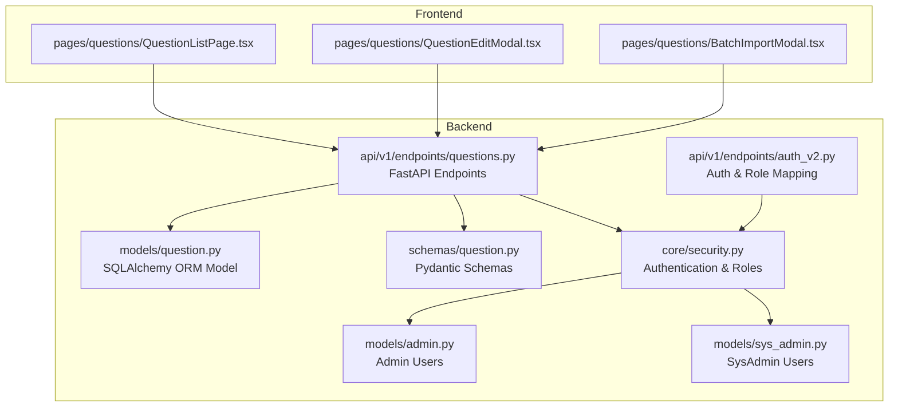
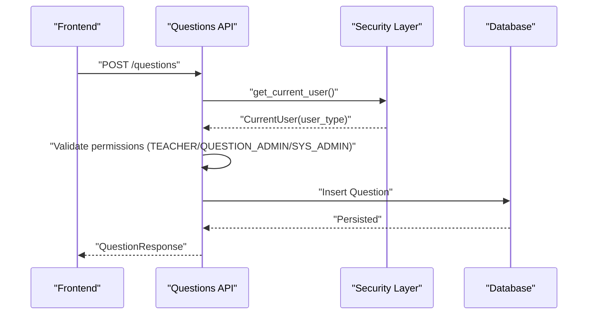
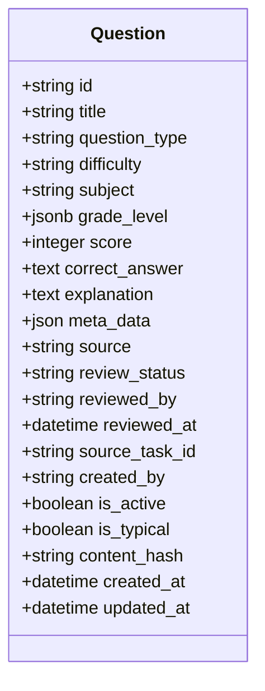
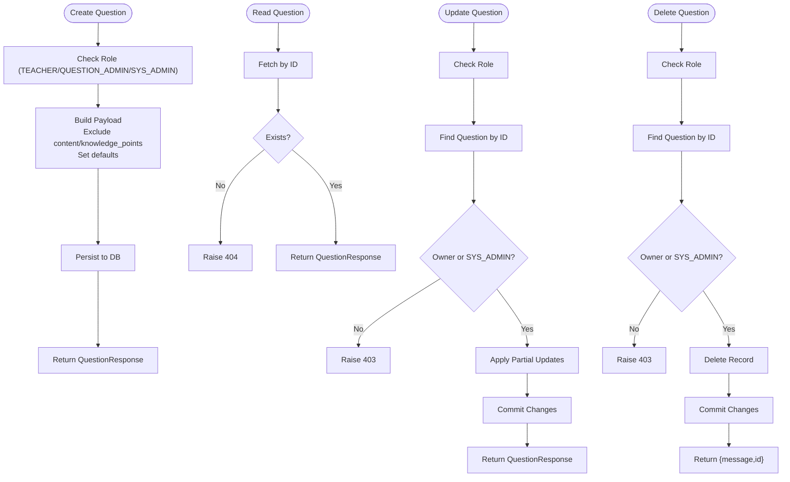
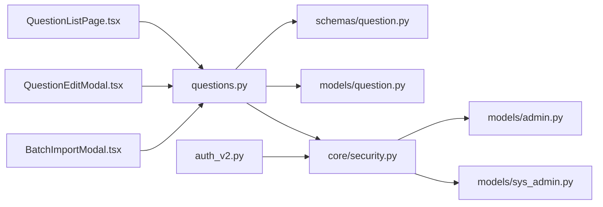

# Question CRUD Operations

<cite>
**Referenced Files in This Document**
- [question.py](file://backend/app/models/question.py)
- [question.py](file://backend/app/schemas/question.py)
- [questions.py](file://backend/app/api/v1/endpoints/questions.py)
- [security.py](file://backend/app/core/security.py)
- [admin.py](file://backend/app/models/admin.py)
- [sys_admin.py](file://backend/app/models/sys_admin.py)
- [auth_v2.py](file://backend/app/api/v1/endpoints/auth_v2.py)
- [QuestionListPage.tsx](file://frontend/src/pages/questions/QuestionListPage.tsx)
- [QuestionEditModal.tsx](file://frontend/src/pages/questions/QuestionEditModal.tsx)
- [BatchImportModal.tsx](file://frontend/src/pages/questions/BatchImportModal.tsx)
- [006_add_content_hash_to_questions.py](file://backend/alembic/versions/006_add_content_hash_to_questions.py)
</cite>

## Table of Contents
1. [Introduction](#introduction)
2. [Project Structure](#project-structure)
3. [Core Components](#core-components)
4. [Architecture Overview](#architecture-overview)
5. [Detailed Component Analysis](#detailed-component-analysis)
6. [Dependency Analysis](#dependency-analysis)
7. [Performance Considerations](#performance-considerations)
8. [Troubleshooting Guide](#troubleshooting-guide)
9. [Conclusion](#conclusion)

## Introduction
This document provides a comprehensive guide to Question CRUD operations in the system. It covers create, read, update, and delete workflows, including schemas, validation rules, permissions, ownership verification, administrative overrides, and the question lifecycle. It also documents the frontend interfaces for listing, editing, and form validation, along with examples of successful operations, error handling, and role-based access restrictions. The document further explains the relationship between questions and their creators, update tracking, and soft deletion patterns.

## Project Structure
The Question CRUD functionality spans backend models, schemas, API endpoints, and frontend pages/modals. The backend uses FastAPI with SQLAlchemy ORM, while the frontend is a React application using Ant Design components.

**Diagram sources**
- [question.py:10-46](file://backend/app/models/question.py#L10-L46)
- [question.py:7-52](file://backend/app/schemas/question.py#L7-L52)
- [questions.py:17-431](file://backend/app/api/v1/endpoints/questions.py#L17-L431)
- [security.py:64-95](file://backend/app/core/security.py#L64-L95)
- [admin.py:9-27](file://backend/app/models/admin.py#L9-L27)
- [sys_admin.py:8-22](file://backend/app/models/sys_admin.py#L8-L22)
- [auth_v2.py:55-183](file://backend/app/api/v1/endpoints/auth_v2.py#L55-L183)
- [QuestionListPage.tsx:1-259](file://frontend/src/pages/questions/QuestionListPage.tsx#L1-L259)
- [QuestionEditModal.tsx:1-250](file://frontend/src/pages/questions/QuestionEditModal.tsx#L1-L250)
- [BatchImportModal.tsx:1-73](file://frontend/src/pages/questions/BatchImportModal.tsx#L1-L73)

**Section sources**
- [question.py:10-46](file://backend/app/models/question.py#L10-L46)
- [question.py:7-52](file://backend/app/schemas/question.py#L7-L52)
- [questions.py:17-431](file://backend/app/api/v1/endpoints/questions.py#L17-L431)
- [security.py:64-95](file://backend/app/core/security.py#L64-L95)
- [admin.py:9-27](file://backend/app/models/admin.py#L9-L27)
- [sys_admin.py:8-22](file://backend/app/models/sys_admin.py#L8-L22)
- [auth_v2.py:55-183](file://backend/app/api/v1/endpoints/auth_v2.py#L55-L183)
- [QuestionListPage.tsx:1-259](file://frontend/src/pages/questions/QuestionListPage.tsx#L1-L259)
- [QuestionEditModal.tsx:1-250](file://frontend/src/pages/questions/QuestionEditModal.tsx#L1-L250)
- [BatchImportModal.tsx:1-73](file://frontend/src/pages/questions/BatchImportModal.tsx#L1-L73)

## Core Components
- Question model defines fields, constraints, and relationships.
- Pydantic schemas define create/update/validation rules.
- API endpoints implement CRUD routes with permission checks and ownership verification.
- Frontend pages and modals provide listing, editing, and import capabilities.

**Section sources**
- [question.py:10-46](file://backend/app/models/question.py#L10-L46)
- [question.py:7-52](file://backend/app/schemas/question.py#L7-L52)
- [questions.py:17-431](file://backend/app/api/v1/endpoints/questions.py#L17-L431)

## Architecture Overview
The system enforces role-based access control at the API layer. Authentication resolves the current user and validates existence in the appropriate user table. Permissions gate CRUD operations and ownership checks ensure only creators or SYS_ADMIN can modify questions. The frontend integrates with the backend via typed requests and displays rich question metadata.

**Diagram sources**
- [questions.py:17-36](file://backend/app/api/v1/endpoints/questions.py#L17-L36)
- [security.py:64-95](file://backend/app/core/security.py#L64-L95)

**Section sources**
- [questions.py:17-36](file://backend/app/api/v1/endpoints/questions.py#L17-L36)
- [security.py:64-95](file://backend/app/core/security.py#L64-L95)

## Detailed Component Analysis

### Question Model and Constraints
The Question model encapsulates question metadata, scoring, content, and lifecycle fields. Constraints enforce valid values for question_type, difficulty, and positive scores. A content hash column supports future deduplication.

**Diagram sources**
- [question.py:10-46](file://backend/app/models/question.py#L10-L46)

**Section sources**
- [question.py:10-46](file://backend/app/models/question.py#L10-L46)
- [006_add_content_hash_to_questions.py:17-24](file://backend/alembic/versions/006_add_content_hash_to_questions.py#L17-L24)

### Pydantic Schemas: QuestionCreate, QuestionUpdate, QuestionResponse
- QuestionCreate: Defines required fields and defaults for source and review_status. Excludes content and knowledge_points from raw payload and stores knowledge_points in meta_data.
- QuestionUpdate: Allows partial updates with optional fields and validation constraints.
- QuestionResponse: Adds identity and timestamps for API responses.

Validation highlights:
- question_type and difficulty constrained to predefined sets.
- score must be greater than zero.
- title length limited.
- Optional fields support flexible updates.

**Section sources**
- [question.py:7-52](file://backend/app/schemas/question.py#L7-L52)

### Permission System and Ownership Verification
Roles:
- TEACHER: Can create, list, search, and update/delete their own questions.
- QUESTION_ADMIN: Can create, list, search, update, and delete questions; can mark typical questions.
- SYS_ADMIN: Full administrative privileges; can override ownership checks.

Ownership verification:
- Update/Delete checks that the current user matches the question’s created_by or is SYS_ADMIN.

Administrative overrides:
- SYS_ADMIN bypasses ownership checks for updates/deletes.

**Section sources**
- [questions.py:23-24](file://backend/app/api/v1/endpoints/questions.py#L23-L24)
- [questions.py:299-319](file://backend/app/api/v1/endpoints/questions.py#L299-L319)
- [security.py:82-95](file://backend/app/core/security.py#L82-L95)
- [auth_v2.py:130-131](file://backend/app/api/v1/endpoints/auth_v2.py#L130-L131)

### Question Lifecycle: Create → Read → Update → Delete
- Create: Validates role, builds payload, persists, and returns response.
- Read: Retrieves single question by ID.
- Update: Validates role, verifies ownership or SYS_ADMIN, applies partial updates.
- Delete: Validates role, finds question, deletes, and returns confirmation.

**Diagram sources**
- [questions.py:17-36](file://backend/app/api/v1/endpoints/questions.py#L17-L36)
- [questions.py:276-289](file://backend/app/api/v1/endpoints/questions.py#L276-L289)
- [questions.py:292-328](file://backend/app/api/v1/endpoints/questions.py#L292-L328)
- [questions.py:331-347](file://backend/app/api/v1/endpoints/questions.py#L331-L347)

**Section sources**
- [questions.py:17-36](file://backend/app/api/v1/endpoints/questions.py#L17-L36)
- [questions.py:276-289](file://backend/app/api/v1/endpoints/questions.py#L276-L289)
- [questions.py:292-328](file://backend/app/api/v1/endpoints/questions.py#L292-L328)
- [questions.py:331-347](file://backend/app/api/v1/endpoints/questions.py#L331-L347)

### Frontend Interfaces: Listing, Editing, and Validation
- QuestionListPage: Displays paginated, filterable question lists; supports search, subject/grade/type/difficulty filters; actions include edit and delete; export/import controls.
- QuestionEditModal: Handles create/edit forms with dynamic fields based on question type; constructs correct_answer JSON; manages review_status/source defaults; supports typical marking.
- BatchImportModal: Provides drag-and-drop import with template download and batch posting.

Validation and UX:
- Required fields enforced in forms; dynamic rendering of options for SINGLE/MULTIPLE CHOICE; fill-blank and subjective validations; switch toggles for is_active/is_typical.

**Section sources**
- [QuestionListPage.tsx:61-126](file://frontend/src/pages/questions/QuestionListPage.tsx#L61-L126)
- [QuestionListPage.tsx:128-183](file://frontend/src/pages/questions/QuestionListPage.tsx#L128-L183)
- [QuestionEditModal.tsx:105-139](file://frontend/src/pages/questions/QuestionEditModal.tsx#L105-L139)
- [QuestionEditModal.tsx:186-220](file://frontend/src/pages/questions/QuestionEditModal.tsx#L186-L220)
- [BatchImportModal.tsx:17-33](file://frontend/src/pages/questions/BatchImportModal.tsx#L17-L33)

### Examples and Error Handling Scenarios
Successful operations:
- Creating a question: TEACHER/QUESTION_ADMIN/SYS_ADMIN posts QuestionCreate; backend persists and returns QuestionResponse.
- Updating a question: Authorized user updates fields; backend validates ownership or SYS_ADMIN status and commits changes.
- Deleting a question: Authorized user deletes by ID; backend confirms existence and performs deletion.

Role-based access restrictions:
- Non-authorized users receive 403 Forbidden when attempting CRUD operations.
- Teachers are restricted to their own questions unless SYS_ADMIN.

Error handling:
- 404 Not Found when querying non-existent question IDs.
- 403 Forbidden for insufficient permissions or ownership violations.
- Frontend surfaces errors via message notifications.

**Section sources**
- [questions.py:23-24](file://backend/app/api/v1/endpoints/questions.py#L23-L24)
- [questions.py:299-319](file://backend/app/api/v1/endpoints/questions.py#L299-L319)
- [questions.py:337-343](file://backend/app/api/v1/endpoints/questions.py#L337-L343)
- [QuestionListPage.tsx:83-89](file://frontend/src/pages/questions/QuestionListPage.tsx#L83-L89)

### Relationship Between Questions and Creators, Update Tracking, Soft Deletion
- Creator relationship: created_by links to Admin; used for ownership verification.
- Update tracking: updated_at auto-updated on change; created_at captures insertion time.
- Soft deletion: delete endpoint removes records; no is_deleted flag is present in the model snapshot.

**Section sources**
- [question.py:28-33](file://backend/app/models/question.py#L28-L33)
- [questions.py:331-347](file://backend/app/api/v1/endpoints/questions.py#L331-L347)

## Dependency Analysis
The API endpoints depend on schemas for validation, the security layer for user resolution, and the database model for persistence. Frontend components depend on API endpoints for data operations.

**Diagram sources**
- [questions.py:17-431](file://backend/app/api/v1/endpoints/questions.py#L17-L431)
- [question.py:7-52](file://backend/app/schemas/question.py#L7-L52)
- [question.py:10-46](file://backend/app/models/question.py#L10-L46)
- [security.py:64-95](file://backend/app/core/security.py#L64-L95)
- [admin.py:9-27](file://backend/app/models/admin.py#L9-L27)
- [sys_admin.py:8-22](file://backend/app/models/sys_admin.py#L8-L22)
- [auth_v2.py:55-183](file://backend/app/api/v1/endpoints/auth_v2.py#L55-L183)
- [QuestionListPage.tsx:1-259](file://frontend/src/pages/questions/QuestionListPage.tsx#L1-L259)
- [QuestionEditModal.tsx:1-250](file://frontend/src/pages/questions/QuestionEditModal.tsx#L1-L250)
- [BatchImportModal.tsx:1-73](file://frontend/src/pages/questions/BatchImportModal.tsx#L1-L73)

**Section sources**
- [questions.py:17-431](file://backend/app/api/v1/endpoints/questions.py#L17-L431)
- [question.py:7-52](file://backend/app/schemas/question.py#L7-L52)
- [question.py:10-46](file://backend/app/models/question.py#L10-L46)
- [security.py:64-95](file://backend/app/core/security.py#L64-L95)
- [admin.py:9-27](file://backend/app/models/admin.py#L9-L27)
- [sys_admin.py:8-22](file://backend/app/models/sys_admin.py#L8-L22)
- [auth_v2.py:55-183](file://backend/app/api/v1/endpoints/auth_v2.py#L55-L183)
- [QuestionListPage.tsx:1-259](file://frontend/src/pages/questions/QuestionListPage.tsx#L1-L259)
- [QuestionEditModal.tsx:1-250](file://frontend/src/pages/questions/QuestionEditModal.tsx#L1-L250)
- [BatchImportModal.tsx:1-73](file://frontend/src/pages/questions/BatchImportModal.tsx#L1-L73)

## Performance Considerations
- Pagination limits: API enforces maximum page sizes to prevent heavy queries.
- Indexes: subject, is_active, is_typical, and content_hash indices improve filtering and lookup performance.
- Filtering: SQL queries apply filters and count totals efficiently; avoid excessive keyword searches on large datasets.

[No sources needed since this section provides general guidance]

## Troubleshooting Guide
Common issues and resolutions:
- 403 Forbidden during create/update/delete: Verify user role and ownership; SYS_ADMIN can override ownership.
- 404 Not Found on read/delete: Ensure the question ID exists and is accessible to the current user.
- Validation errors: Confirm fields meet schema constraints (e.g., question_type, difficulty, score).
- Frontend failures: Check network requests and message notifications for detailed error messages.

**Section sources**
- [questions.py:23-24](file://backend/app/api/v1/endpoints/questions.py#L23-L24)
- [questions.py:299-319](file://backend/app/api/v1/endpoints/questions.py#L299-L319)
- [questions.py:337-343](file://backend/app/api/v1/endpoints/questions.py#L337-L343)
- [QuestionListPage.tsx:83-89](file://frontend/src/pages/questions/QuestionListPage.tsx#L83-L89)

## Conclusion
The Question CRUD system combines robust backend validation, strict role-based permissions, and clear ownership semantics. The frontend provides intuitive interfaces for listing, editing, and importing questions, while the backend ensures secure and efficient operations. Together, these components support a reliable question lifecycle from creation through deletion, with administrative oversight and user-friendly controls.