# Question Management System

<cite>
**Referenced Files in This Document**
- [backend/app/models/question.py](file://backend/app/models/question.py)
- [backend/app/schemas/question.py](file://backend/app/schemas/question.py)
- [backend/app/api/v1/endpoints/questions.py](file://backend/app/api/v1/endpoints/questions.py)
- [backend/app/api/v1/endpoints/question_admin.py](file://backend/app/api/v1/endpoints/question_admin.py)
- [backend/app/models/knowledge_point.py](file://backend/app/models/knowledge_point.py)
- [backend/app/models/question_task.py](file://backend/app/models/question_task.py)
- [backend/app/models/exam_paper.py](file://backend/app/models/exam_paper.py)
- [backend/app/schemas/exam_paper.py](file://backend/app/schemas/exam_paper.py)
- [backend/app/services/dedup_service.py](file://backend/app/services/dedup_service.py)
- [backend/alembic/versions/006_add_content_hash_to_questions.py](file://backend/alembic/versions/006_add_content_hash_to_questions.py)
- [frontend/src/pages/questions/QuestionListPage.tsx](file://frontend/src/pages/questions/QuestionListPage.tsx)
- [frontend/src/pages/questions/QuestionEditModal.tsx](file://frontend/src/pages/questions/QuestionEditModal.tsx)
- [frontend/src/pages/questions/BatchImportModal.tsx](file://frontend/src/pages/questions/BatchImportModal.tsx)
- [frontend/src/pages/admin/QuestionAdminPage.tsx](file://frontend/src/pages/admin/QuestionAdminPage.tsx)
- [backend/app/models/admin.py](file://backend/app/models/admin.py)
</cite>

## Table of Contents
1. [Introduction](#introduction)
2. [Project Structure](#project-structure)
3. [Core Components](#core-components)
4. [Architecture Overview](#architecture-overview)
5. [Detailed Component Analysis](#detailed-component-analysis)
6. [Dependency Analysis](#dependency-analysis)
7. [Performance Considerations](#performance-considerations)
8. [Troubleshooting Guide](#troubleshooting-guide)
9. [Conclusion](#conclusion)
10. [Appendices](#appendices)

## Introduction
This document describes the Question Management System that powers the complete lifecycle of educational questions. It covers question CRUD operations for Single Choice, Multiple Choice, Fill Blank, and Subjective question types, batch import/export, content review workflows, validation rules, knowledge point mapping, difficulty scoring, approval workflows for administrators, status management, quality assurance, the question task system, content hashing for duplicate detection, search capabilities, and frontend interfaces for editing, bulk operations, and administrative oversight. It also explains integration with the exam paper system.

## Project Structure
The system is organized into:
- Backend API and models (FastAPI + SQLAlchemy)
- Frontend pages/components (React + Ant Design)
- Services for deduplication and external integrations
- Alembic migrations for schema evolution

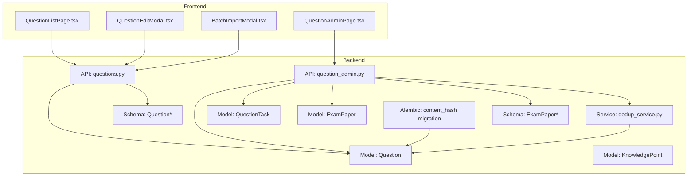

**Diagram sources**
- [backend/app/api/v1/endpoints/questions.py:1-431](file://backend/app/api/v1/endpoints/questions.py#L1-L431)
- [backend/app/api/v1/endpoints/question_admin.py:1-837](file://backend/app/api/v1/endpoints/question_admin.py#L1-L837)
- [backend/app/models/question.py:1-46](file://backend/app/models/question.py#L1-L46)
- [backend/app/models/knowledge_point.py:1-27](file://backend/app/models/knowledge_point.py#L1-L27)
- [backend/app/models/question_task.py:1-25](file://backend/app/models/question_task.py#L1-L25)
- [backend/app/models/exam_paper.py:1-51](file://backend/app/models/exam_paper.py#L1-L51)
- [backend/app/schemas/question.py:1-52](file://backend/app/schemas/question.py#L1-L52)
- [backend/app/schemas/exam_paper.py:1-42](file://backend/app/schemas/exam_paper.py#L1-L42)
- [backend/app/services/dedup_service.py:1-127](file://backend/app/services/dedup_service.py#L1-L127)
- [backend/alembic/versions/006_add_content_hash_to_questions.py:1-25](file://backend/alembic/versions/006_add_content_hash_to_questions.py#L1-L25)
- [frontend/src/pages/questions/QuestionListPage.tsx:1-259](file://frontend/src/pages/questions/QuestionListPage.tsx#L1-L259)
- [frontend/src/pages/questions/QuestionEditModal.tsx:1-250](file://frontend/src/pages/questions/QuestionEditModal.tsx#L1-L250)
- [frontend/src/pages/questions/BatchImportModal.tsx:1-73](file://frontend/src/pages/questions/BatchImportModal.tsx#L1-L73)
- [frontend/src/pages/admin/QuestionAdminPage.tsx:1-669](file://frontend/src/pages/admin/QuestionAdminPage.tsx#L1-L669)

**Section sources**
- [backend/app/models/question.py:1-46](file://backend/app/models/question.py#L1-L46)
- [backend/app/schemas/question.py:1-52](file://backend/app/schemas/question.py#L1-L52)
- [backend/app/api/v1/endpoints/questions.py:1-431](file://backend/app/api/v1/endpoints/questions.py#L1-L431)
- [backend/app/api/v1/endpoints/question_admin.py:1-837](file://backend/app/api/v1/endpoints/question_admin.py#L1-L837)
- [backend/app/models/knowledge_point.py:1-27](file://backend/app/models/knowledge_point.py#L1-L27)
- [backend/app/models/question_task.py:1-25](file://backend/app/models/question_task.py#L1-L25)
- [backend/app/models/exam_paper.py:1-51](file://backend/app/models/exam_paper.py#L1-L51)
- [backend/app/schemas/exam_paper.py:1-42](file://backend/app/schemas/exam_paper.py#L1-L42)
- [backend/app/services/dedup_service.py:1-127](file://backend/app/services/dedup_service.py#L1-L127)
- [backend/alembic/versions/006_add_content_hash_to_questions.py:1-25](file://backend/alembic/versions/006_add_content_hash_to_questions.py#L1-L25)
- [frontend/src/pages/questions/QuestionListPage.tsx:1-259](file://frontend/src/pages/questions/QuestionListPage.tsx#L1-L259)
- [frontend/src/pages/questions/QuestionEditModal.tsx:1-250](file://frontend/src/pages/questions/QuestionEditModal.tsx#L1-L250)
- [frontend/src/pages/questions/BatchImportModal.tsx:1-73](file://frontend/src/pages/questions/BatchImportModal.tsx#L1-L73)
- [frontend/src/pages/admin/QuestionAdminPage.tsx:1-669](file://frontend/src/pages/admin/QuestionAdminPage.tsx#L1-L669)

## Core Components
- Question model and schema define fields, constraints, and validation for all question types and metadata.
- Question CRUD endpoints support creation, updates, deletion, listing, and search with filters.
- Question admin endpoints enable LLM generation, web scraping, approval/rejection, statistics, OCR paper import, and deduplication.
- Knowledge point model supports hierarchical knowledge mapping.
- Question task model tracks asynchronous tasks (generation, scraping, dedup).
- Deduplication service computes content hashes and finds duplicates.
- Frontend provides question list, edit modal, batch import modal, and admin panel for approvals.

**Section sources**
- [backend/app/models/question.py:10-46](file://backend/app/models/question.py#L10-L46)
- [backend/app/schemas/question.py:7-52](file://backend/app/schemas/question.py#L7-L52)
- [backend/app/api/v1/endpoints/questions.py:17-431](file://backend/app/api/v1/endpoints/questions.py#L17-L431)
- [backend/app/api/v1/endpoints/question_admin.py:138-797](file://backend/app/api/v1/endpoints/question_admin.py#L138-L797)
- [backend/app/models/knowledge_point.py:7-27](file://backend/app/models/knowledge_point.py#L7-L27)
- [backend/app/models/question_task.py:8-25](file://backend/app/models/question_task.py#L8-L25)
- [backend/app/services/dedup_service.py:55-127](file://backend/app/services/dedup_service.py#L55-L127)
- [frontend/src/pages/questions/QuestionListPage.tsx:31-259](file://frontend/src/pages/questions/QuestionListPage.tsx#L31-L259)
- [frontend/src/pages/questions/QuestionEditModal.tsx:18-250](file://frontend/src/pages/questions/QuestionEditModal.tsx#L18-L250)
- [frontend/src/pages/questions/BatchImportModal.tsx:13-73](file://frontend/src/pages/questions/BatchImportModal.tsx#L13-L73)
- [frontend/src/pages/admin/QuestionAdminPage.tsx:17-669](file://frontend/src/pages/admin/QuestionAdminPage.tsx#L17-L669)

## Architecture Overview
The system follows a layered architecture:
- Presentation: React frontend pages and modals
- Application: FastAPI endpoints orchestrating business logic
- Domain: Pydantic schemas and SQLAlchemy models
- Persistence: PostgreSQL with Alembic migrations
- Services: Deduplication and external integrations (LLM, OCR)

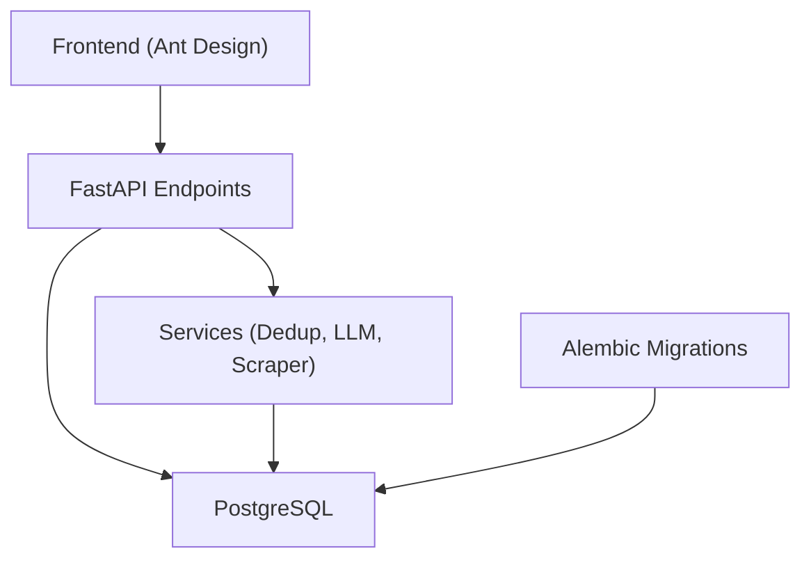

**Diagram sources**
- [backend/app/api/v1/endpoints/questions.py:1-431](file://backend/app/api/v1/endpoints/questions.py#L1-L431)
- [backend/app/api/v1/endpoints/question_admin.py:1-837](file://backend/app/api/v1/endpoints/question_admin.py#L1-L837)
- [backend/app/services/dedup_service.py:1-127](file://backend/app/services/dedup_service.py#L1-L127)
- [backend/alembic/versions/006_add_content_hash_to_questions.py:1-25](file://backend/alembic/versions/006_add_content_hash_to_questions.py#L1-L25)

## Detailed Component Analysis

### Question Model and Validation
- Fields include title, question_type, difficulty, subject, grade_level (JSONB), score, correct_answer (text), explanation, meta_data (JSON), source, review_status, reviewer info, source_task_id, created_by, is_active, is_typical, content_hash, timestamps.
- Constraints enforce question_type and difficulty enums and positive score.
- Meta_data stores knowledge_points for mapping.

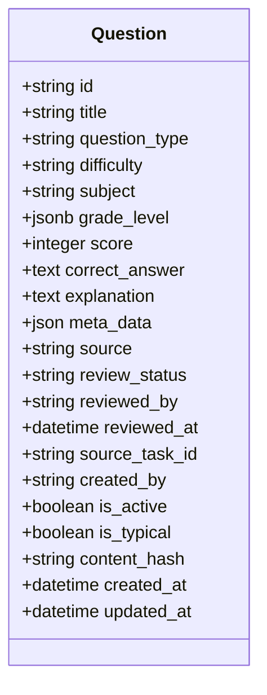

**Diagram sources**
- [backend/app/models/question.py:10-46](file://backend/app/models/question.py#L10-L46)

**Section sources**
- [backend/app/models/question.py:10-46](file://backend/app/models/question.py#L10-L46)
- [backend/app/schemas/question.py:7-52](file://backend/app/schemas/question.py#L7-L52)

### Question CRUD Operations
- Create: Validates user roles, builds Question entity, persists, and returns response.
- Retrieve: Single question by ID; list with filters and pagination; search by keyword and knowledge point.
- Update: Permission checks by creator or admin; updates allowed fields.
- Delete and Batch Delete: Controlled by roles; batch limited to 200 per request.
- Typical marking: Toggle is_typical for teacher/QA/SYS_ADMIN.

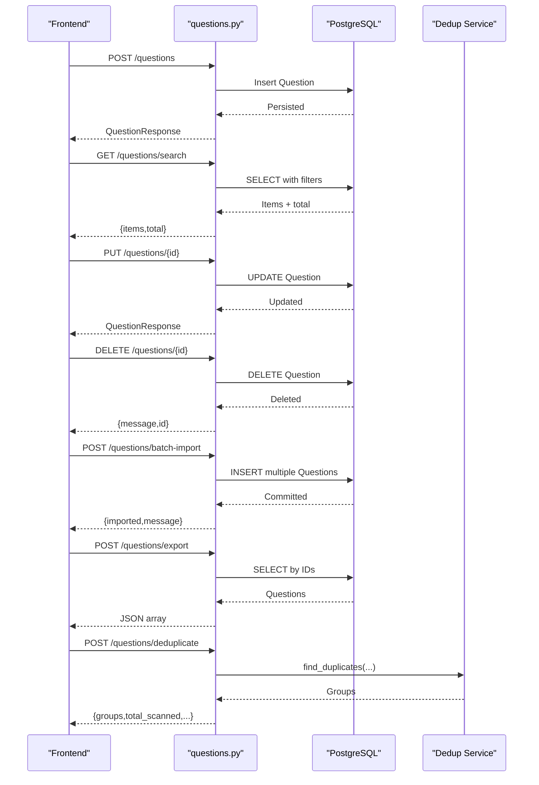

**Diagram sources**
- [backend/app/api/v1/endpoints/questions.py:17-431](file://backend/app/api/v1/endpoints/questions.py#L17-L431)
- [backend/app/services/dedup_service.py:63-127](file://backend/app/services/dedup_service.py#L63-L127)

**Section sources**
- [backend/app/api/v1/endpoints/questions.py:17-431](file://backend/app/api/v1/endpoints/questions.py#L17-L431)

### Question Admin Workflows
- LLM Generation: Generates questions via LLM, saves with PENDING status, records task.
- Web Scraping: Searches and scrapes questions, auto-saves with PENDING status.
- Approval/Rejection: Approve or reject individual or batch; updates review_status and reviewer info.
- Statistics: Aggregates counts by status, type, difficulty, source, and lists pending items.
- OCR Paper Import: Uploads exam paper image, recognizes questions via LLM vision, confirms and saves.
- Deduplication: Scans active questions, computes content_hash if missing, groups duplicates.

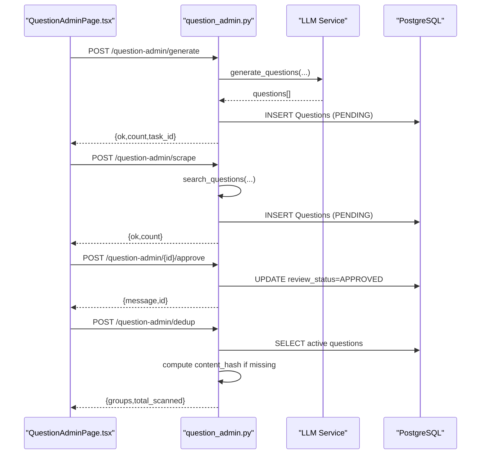

**Diagram sources**
- [frontend/src/pages/admin/QuestionAdminPage.tsx:114-161](file://frontend/src/pages/admin/QuestionAdminPage.tsx#L114-L161)
- [backend/app/api/v1/endpoints/question_admin.py:138-797](file://backend/app/api/v1/endpoints/question_admin.py#L138-L797)

**Section sources**
- [frontend/src/pages/admin/QuestionAdminPage.tsx:17-669](file://frontend/src/pages/admin/QuestionAdminPage.tsx#L17-L669)
- [backend/app/api/v1/endpoints/question_admin.py:138-797](file://backend/app/api/v1/endpoints/question_admin.py#L138-L797)

### Knowledge Point Mapping and Difficulty Scoring
- Knowledge points are stored in meta_data under knowledge_points and can be mapped to grade_level.chapter and knowledge_points arrays.
- Difficulty is enforced via schema and model constraints (EASY, MEDIUM, HARD).
- Score is validated to be positive and defaults to 5.

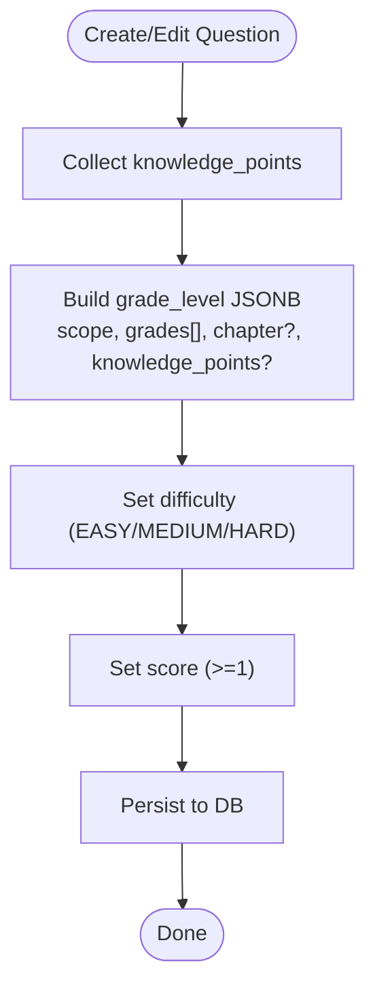

**Diagram sources**
- [backend/app/schemas/question.py:7-18](file://backend/app/schemas/question.py#L7-L18)
- [backend/app/models/question.py:18-22](file://backend/app/models/question.py#L18-L22)

**Section sources**
- [backend/app/schemas/question.py:7-18](file://backend/app/schemas/question.py#L7-L18)
- [backend/app/models/question.py:18-22](file://backend/app/models/question.py#L18-L22)

### Content Hashing and Duplicate Detection
- Migration adds content_hash column to questions with an index.
- Dedup service computes SimHash-based content hash for titles and groups near-duplicates by Hamming distance threshold.

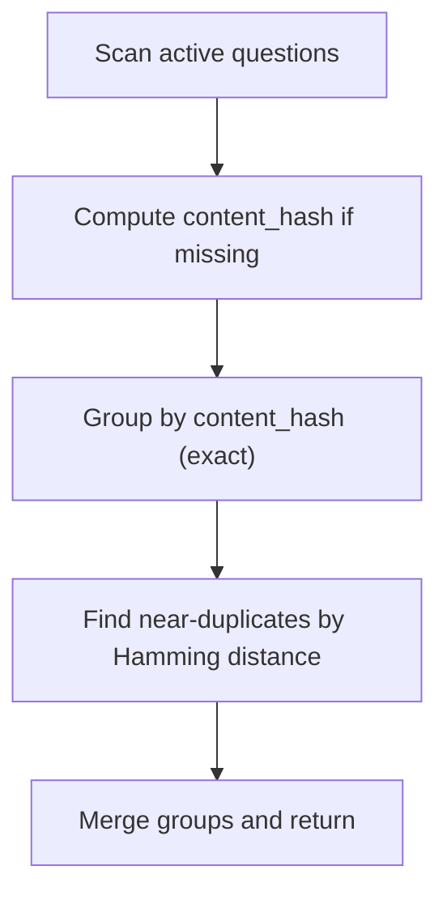

**Diagram sources**
- [backend/alembic/versions/006_add_content_hash_to_questions.py:17-24](file://backend/alembic/versions/006_add_content_hash_to_questions.py#L17-L24)
- [backend/app/services/dedup_service.py:55-127](file://backend/app/services/dedup_service.py#L55-L127)

**Section sources**
- [backend/alembic/versions/006_add_content_hash_to_questions.py:17-24](file://backend/alembic/versions/006_add_content_hash_to_questions.py#L17-L24)
- [backend/app/services/dedup_service.py:63-127](file://backend/app/services/dedup_service.py#L63-L127)

### Question Task System
- Tracks asynchronous tasks (LLM_GENERATE, WEB_SCRAPE, DEDUP) with status, progress, parameters, result_summary, and timing.
- Supports cancellation and progress monitoring.

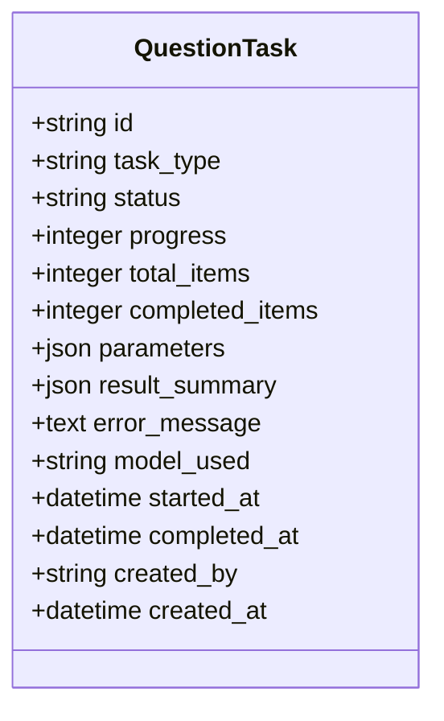

**Diagram sources**
- [backend/app/models/question_task.py:8-25](file://backend/app/models/question_task.py#L8-L25)

**Section sources**
- [backend/app/models/question_task.py:8-25](file://backend/app/models/question_task.py#L8-L25)
- [backend/app/api/v1/endpoints/question_admin.py:476-496](file://backend/app/api/v1/endpoints/question_admin.py#L476-L496)

### Integration with Exam Paper System
- Many-to-many association table exam_paper_questions links ExamPaper and Question with position and score.
- Questions can be attached to exam papers and ordered.

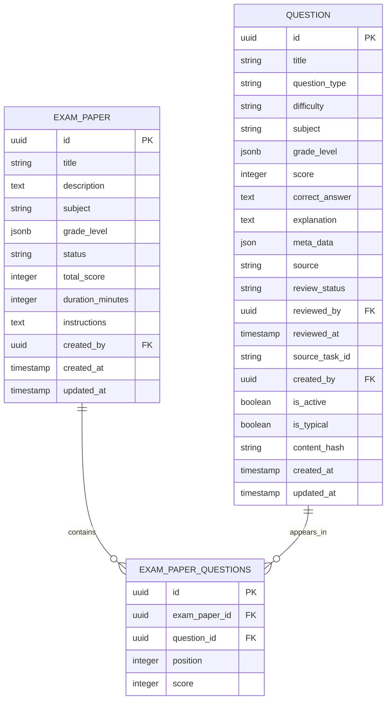

**Diagram sources**
- [backend/app/models/exam_paper.py:9-51](file://backend/app/models/exam_paper.py#L9-L51)
- [backend/app/models/question.py:36-36](file://backend/app/models/question.py#L36-L36)

**Section sources**
- [backend/app/models/exam_paper.py:9-51](file://backend/app/models/exam_paper.py#L9-L51)
- [backend/app/schemas/exam_paper.py:7-42](file://backend/app/schemas/exam_paper.py#L7-L42)

### Frontend Interfaces
- QuestionListPage: Filters, pagination, bulk export, create/edit/delete, typical marking.
- QuestionEditModal: Dynamic form rendering for question types, builds correct_answer JSON, handles review status and activation.
- BatchImportModal: Uploads files and triggers batch import.
- QuestionAdminPage: LLM generation, web scraping, approval/rejection, statistics, OCR paper import, dedup UI.

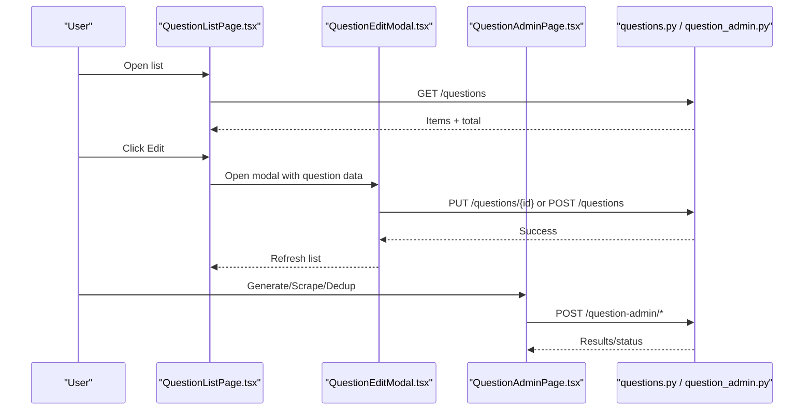

**Diagram sources**
- [frontend/src/pages/questions/QuestionListPage.tsx:61-127](file://frontend/src/pages/questions/QuestionListPage.tsx#L61-L127)
- [frontend/src/pages/questions/QuestionEditModal.tsx:105-139](file://frontend/src/pages/questions/QuestionEditModal.tsx#L105-L139)
- [frontend/src/pages/admin/QuestionAdminPage.tsx:114-161](file://frontend/src/pages/admin/QuestionAdminPage.tsx#L114-L161)
- [backend/app/api/v1/endpoints/questions.py:17-431](file://backend/app/api/v1/endpoints/questions.py#L17-L431)
- [backend/app/api/v1/endpoints/question_admin.py:138-797](file://backend/app/api/v1/endpoints/question_admin.py#L138-L797)

**Section sources**
- [frontend/src/pages/questions/QuestionListPage.tsx:31-259](file://frontend/src/pages/questions/QuestionListPage.tsx#L31-L259)
- [frontend/src/pages/questions/QuestionEditModal.tsx:18-250](file://frontend/src/pages/questions/QuestionEditModal.tsx#L18-L250)
- [frontend/src/pages/questions/BatchImportModal.tsx:13-73](file://frontend/src/pages/questions/BatchImportModal.tsx#L13-L73)
- [frontend/src/pages/admin/QuestionAdminPage.tsx:17-669](file://frontend/src/pages/admin/QuestionAdminPage.tsx#L17-L669)

## Dependency Analysis
- API endpoints depend on models and schemas for validation and persistence.
- Admin endpoints orchestrate services (LLM, scraper, dedup) and manage tasks.
- Frontend components call API endpoints and render results.
- Alembic migration introduces content_hash for efficient duplicate detection.

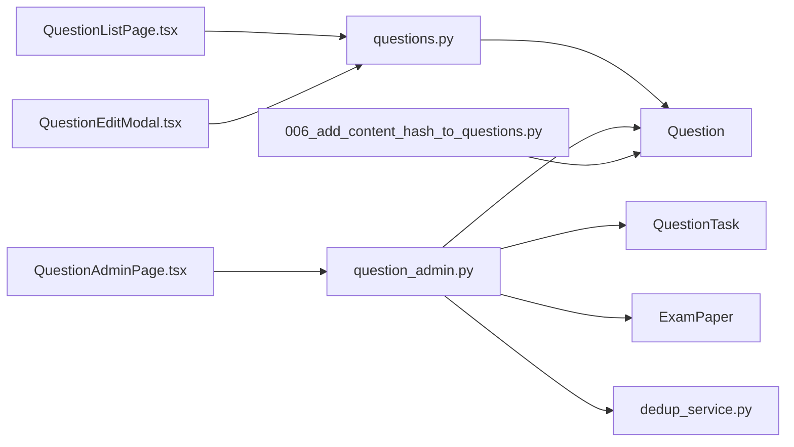

**Diagram sources**
- [frontend/src/pages/questions/QuestionListPage.tsx:1-259](file://frontend/src/pages/questions/QuestionListPage.tsx#L1-L259)
- [frontend/src/pages/questions/QuestionEditModal.tsx:1-250](file://frontend/src/pages/questions/QuestionEditModal.tsx#L1-L250)
- [frontend/src/pages/admin/QuestionAdminPage.tsx:1-669](file://frontend/src/pages/admin/QuestionAdminPage.tsx#L1-L669)
- [backend/app/api/v1/endpoints/questions.py:1-431](file://backend/app/api/v1/endpoints/questions.py#L1-L431)
- [backend/app/api/v1/endpoints/question_admin.py:1-837](file://backend/app/api/v1/endpoints/question_admin.py#L1-L837)
- [backend/app/models/question.py:1-46](file://backend/app/models/question.py#L1-L46)
- [backend/app/models/question_task.py:1-25](file://backend/app/models/question_task.py#L1-L25)
- [backend/app/models/exam_paper.py:1-51](file://backend/app/models/exam_paper.py#L1-L51)
- [backend/app/services/dedup_service.py:1-127](file://backend/app/services/dedup_service.py#L1-L127)
- [backend/alembic/versions/006_add_content_hash_to_questions.py:1-25](file://backend/alembic/versions/006_add_content_hash_to_questions.py#L1-L25)

**Section sources**
- [backend/app/api/v1/endpoints/questions.py:1-431](file://backend/app/api/v1/endpoints/questions.py#L1-L431)
- [backend/app/api/v1/endpoints/question_admin.py:1-837](file://backend/app/api/v1/endpoints/question_admin.py#L1-L837)
- [backend/app/models/question.py:1-46](file://backend/app/models/question.py#L1-L46)
- [backend/app/models/question_task.py:1-25](file://backend/app/models/question_task.py#L1-L25)
- [backend/app/models/exam_paper.py:1-51](file://backend/app/models/exam_paper.py#L1-L51)
- [backend/app/services/dedup_service.py:1-127](file://backend/app/services/dedup_service.py#L1-L127)
- [backend/alembic/versions/006_add_content_hash_to_questions.py:1-25](file://backend/alembic/versions/006_add_content_hash_to_questions.py#L1-L25)
- [frontend/src/pages/questions/QuestionListPage.tsx:1-259](file://frontend/src/pages/questions/QuestionListPage.tsx#L1-L259)
- [frontend/src/pages/questions/QuestionEditModal.tsx:1-250](file://frontend/src/pages/questions/QuestionEditModal.tsx#L1-L250)
- [frontend/src/pages/questions/BatchImportModal.tsx:1-73](file://frontend/src/pages/questions/BatchImportModal.tsx#L1-L73)
- [frontend/src/pages/admin/QuestionAdminPage.tsx:1-669](file://frontend/src/pages/admin/QuestionAdminPage.tsx#L1-L669)

## Performance Considerations
- Pagination limits: API enforces maximum limit per request to prevent heavy queries.
- Indexes: content_hash and other fields are indexed to speed up filtering and search.
- Batch operations: Batch import/export caps at 200 items per request.
- Asynchronous tasks: QuestionTask tracks long-running operations (generation, scraping, dedup) to avoid blocking requests.

[No sources needed since this section provides general guidance]

## Troubleshooting Guide
- Permission errors: Ensure user roles include TEACHER, QUESTION_ADMIN, or SYS_ADMIN for write operations.
- Not found errors: Verify question IDs exist before update/delete.
- Export disabled: Check export_max configuration; if zero, exports are disabled.
- LLM connection failures: Test provider configuration and model availability; fallback to local Ollama or cloud providers.
- OCR model unsupported: Use a vision-capable model (e.g., llava) for paper recognition.

**Section sources**
- [backend/app/api/v1/endpoints/questions.py:23-34](file://backend/app/api/v1/endpoints/questions.py#L23-L34)
- [backend/app/api/v1/endpoints/questions.py:337-347](file://backend/app/api/v1/endpoints/questions.py#L337-L347)
- [backend/app/api/v1/endpoints/question_admin.py:568-646](file://backend/app/api/v1/endpoints/question_admin.py#L568-L646)
- [backend/app/api/v1/endpoints/question_admin.py:680-728](file://backend/app/api/v1/endpoints/question_admin.py#L680-L728)

## Conclusion
The Question Management System provides a robust, extensible platform for managing educational questions across multiple lifecycles. It supports rich question types, admin-driven workflows, quality controls, and seamless integration with exam paper composition. The frontend offers intuitive interfaces for daily operations, while backend services and migrations ensure scalability and maintainability.

[No sources needed since this section summarizes without analyzing specific files]

## Appendices

### Example Workflows

- Create a Single Choice question
  - Use QuestionEditModal to fill title, subject, grade_level, question_type, options, correct answer, difficulty, score, explanation.
  - Submit; backend validates and persists with source MANUAL and review_status APPROVED.

- Batch import questions
  - Upload a supported file via BatchImportModal; backend inserts up to 200 questions with default source MANUAL and review_status APPROVED.

- Approve questions
  - Admin navigates to QuestionAdminPage, filters pending items, selects rows, and performs batch approve or rejects individually.

- Export questions
  - From QuestionListPage, filter and export selected or filtered questions; backend returns JSON with question attributes.

- OCR paper import
  - Upload exam paper image; backend recognizes questions via LLM vision, returns candidates, then confirm and save to question bank with source OCR_UPLOAD and review_status PENDING.

**Section sources**
- [frontend/src/pages/questions/QuestionEditModal.tsx:105-139](file://frontend/src/pages/questions/QuestionEditModal.tsx#L105-L139)
- [frontend/src/pages/questions/BatchImportModal.tsx:17-33](file://frontend/src/pages/questions/BatchImportModal.tsx#L17-L33)
- [frontend/src/pages/admin/QuestionAdminPage.tsx:469-482](file://frontend/src/pages/admin/QuestionAdminPage.tsx#L469-L482)
- [frontend/src/pages/questions/QuestionListPage.tsx:101-126](file://frontend/src/pages/questions/QuestionListPage.tsx#L101-L126)
- [backend/app/api/v1/endpoints/question_admin.py:561-728](file://backend/app/api/v1/endpoints/question_admin.py#L561-L728)