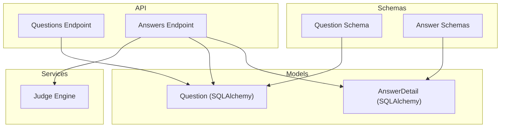
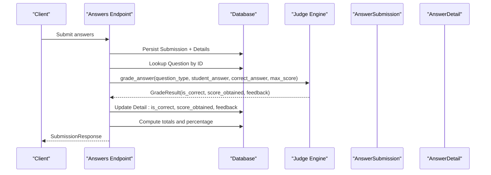
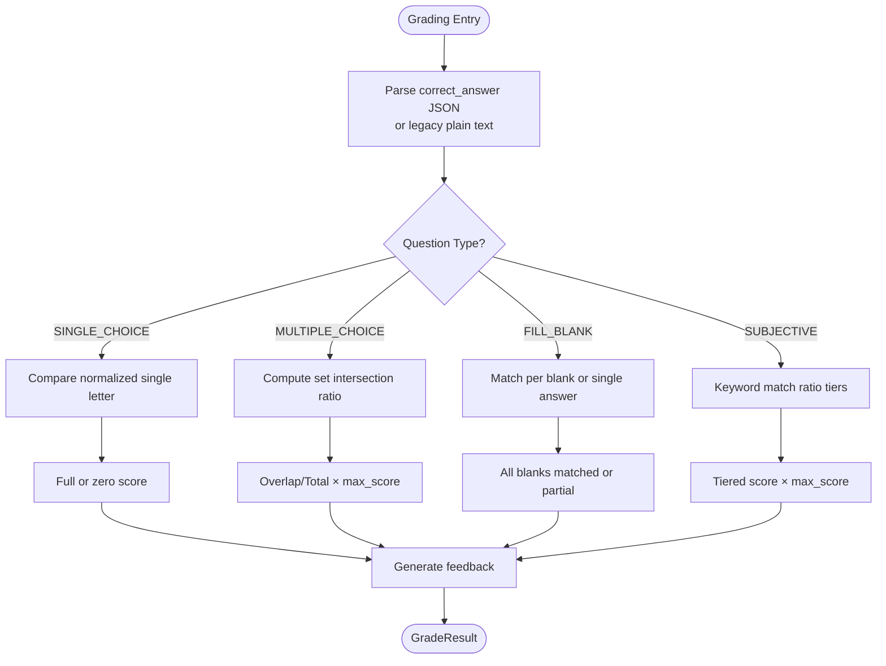
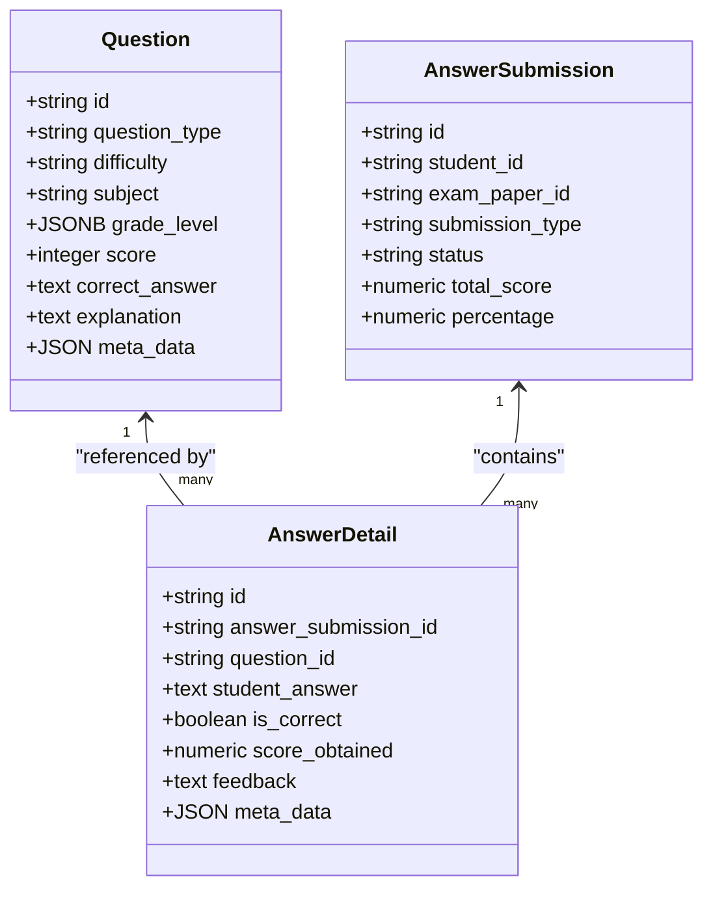

# Question Types and Validation

<cite>
**Referenced Files in This Document**
- [question.py](file://backend/app/models/question.py)
- [question.py](file://backend/app/schemas/question.py)
- [questions.py](file://backend/app/api/v1/endpoints/questions.py)
- [judge_engine.py](file://backend/app/services/judge_engine.py)
- [answer.py](file://backend/app/schemas/answer.py)
- [answers.py](file://backend/app/api/v1/endpoints/answers.py)
- [answer_detail.py](file://backend/app/models/answer_detail.py)
- [001_v22_initial.py](file://backend/alembic/versions/001_v22_initial.py)
- [knowledge_point.py](file://backend/app/models/knowledge_point.py)
</cite>

## Table of Contents
1. [Introduction](#introduction)
2. [Project Structure](#project-structure)
3. [Core Components](#core-components)
4. [Architecture Overview](#architecture-overview)
5. [Detailed Component Analysis](#detailed-component-analysis)
6. [Dependency Analysis](#dependency-analysis)
7. [Performance Considerations](#performance-considerations)
8. [Troubleshooting Guide](#troubleshooting-guide)
9. [Conclusion](#conclusion)

## Introduction
This document explains the question types and validation systems used to define, store, and grade assessments. It covers supported question types (SINGLE_CHOICE, MULTIPLE_CHOICE, FILL_BLANK, SUBJECTIVE), their field requirements, validation rules, and how correct_answer encodings differ by type. It also documents the difficulty scoring system, subject and grade level specifications, meta_data usage for knowledge point mapping and custom attributes, and the end-to-end grading pipeline that validates student answers against question definitions.

## Project Structure
The question lifecycle spans models, schemas, API endpoints, and the grading engine:
- Models define persistent structures and constraints for questions and answer details.
- Schemas define request/response validation and constraints.
- API endpoints handle CRUD, filtering, and import/export of questions.
- The judge engine performs automated grading per question type.
- Answer submission and detail models support per-question scoring and feedback.

**Diagram sources**
- [question.py:10-46](file://backend/app/models/question.py#L10-L46)
- [question.py:7-52](file://backend/app/schemas/question.py#L7-L52)
- [answer_detail.py:9-33](file://backend/app/models/answer_detail.py#L9-L33)
- [answer.py:7-50](file://backend/app/schemas/answer.py#L7-L50)
- [questions.py:17-431](file://backend/app/api/v1/endpoints/questions.py#L17-L431)
- [answers.py:24-113](file://backend/app/api/v1/endpoints/answers.py#L24-L113)
- [judge_engine.py:126-130](file://backend/app/services/judge_engine.py#L126-L130)

**Section sources**
- [question.py:10-46](file://backend/app/models/question.py#L10-L46)
- [question.py:7-52](file://backend/app/schemas/question.py#L7-L52)
- [answer_detail.py:9-33](file://backend/app/models/answer_detail.py#L9-L33)
- [answer.py:7-50](file://backend/app/schemas/answer.py#L7-L50)
- [questions.py:17-431](file://backend/app/api/v1/endpoints/questions.py#L17-L431)
- [answers.py:24-113](file://backend/app/api/v1/endpoints/answers.py#L24-L113)
- [judge_engine.py:126-130](file://backend/app/services/judge_engine.py#L126-L130)

## Core Components
- Question model and schema define the canonical fields and constraints for storing questions, including question_type, difficulty, subject, grade_level, score, correct_answer, explanation, meta_data, and source/review metadata.
- Answer submission and detail models capture student answers, correctness flags, scored points, and feedback.
- The judge engine implements type-specific grading logic and returns a standardized GradeResult.

Key validations and constraints:
- Question type and difficulty are constrained to predefined sets.
- Score must be positive.
- Answer detail score_obtained must be non-negative.
- Unique constraint ensures one answer per question per submission.

**Section sources**
- [question.py:38-43](file://backend/app/models/question.py#L38-L43)
- [question.py:7-18](file://backend/app/schemas/question.py#L7-L18)
- [answer_detail.py:23-27](file://backend/app/models/answer_detail.py#L23-L27)
- [answer.py:7-13](file://backend/app/schemas/answer.py#L7-L13)

## Architecture Overview
The grading pipeline connects answer submissions to question definitions and the judge engine.

**Diagram sources**
- [answers.py:115-197](file://backend/app/api/v1/endpoints/answers.py#L115-L197)
- [answers.py:24-113](file://backend/app/api/v1/endpoints/answers.py#L24-L113)
- [judge_engine.py:126-130](file://backend/app/services/judge_engine.py#L126-L130)

## Detailed Component Analysis

### Question Model and Constraints
- Fields:
  - question_type: SINGLE_CHOICE | MULTIPLE_CHOICE | FILL_BLANK | SUBJECTIVE
  - difficulty: EASY | MEDIUM | HARD
  - subject: free text up to 50 chars
  - grade_level: JSONB with scope and grades arrays plus optional chapter and knowledge_points
  - score: integer > 0
  - correct_answer: text (JSON-encoded per type)
  - explanation: text
  - meta_data: JSON (supports knowledge_points and custom attributes)
  - source: MANUAL by default
  - review_status: APPROVED by default
  - is_active, is_typical, content_hash, timestamps
- Constraints:
  - question_type and difficulty enums enforced via check constraints
  - score positive enforced
  - AnswerDetail.score_obtained non-negative enforced

**Section sources**
- [question.py:10-46](file://backend/app/models/question.py#L10-L46)
- [question.py:7-18](file://backend/app/schemas/question.py#L7-L18)
- [answer_detail.py:23-27](file://backend/app/models/answer_detail.py#L23-L27)
- [001_v22_initial.py:102-124](file://backend/alembic/versions/001_v22_initial.py#L102-L124)

### Question Type Definitions and Validation Rules

#### SINGLE_CHOICE
- Purpose: Select one correct option.
- correct_answer encoding:
  - JSON object with a single-letter key (e.g., "correct_answer": "A")
  - Legacy plain text fallback supported by parser
- Validation:
  - Student answer is normalized (uppercase, trimmed) and compared to the expected letter
  - Full score if equal, zero otherwise
- Scoring:
  - Uses max_score passed into grading; no partial credit

**Section sources**
- [judge_engine.py:31-41](file://backend/app/services/judge_engine.py#L31-L41)
- [judge_engine.py:20-29](file://backend/app/services/judge_engine.py#L20-L29)

#### MULTIPLE_CHOICE
- Purpose: One or more correct options among several choices.
- correct_answer encoding:
  - JSON object with "correct_answer": list of letters (e.g., ["A","C"])
  - Legacy string of concatenated uppercase letters without separators is accepted
- Validation:
  - Student answer is parsed into a set of uppercase letters (comma/space separated)
  - Correct only if sets match exactly
  - Partial credit computed as overlap / total_correct
- Scoring:
  - score_obtained = (|intersection| / |expected|) × max_score
  - Feedback indicates number of correct selections out of total

**Section sources**
- [judge_engine.py:43-59](file://backend/app/services/judge_engine.py#L43-L59)
- [judge_engine.py:20-29](file://backend/app/services/judge_engine.py#L20-L29)

#### FILL_BLANK
- Purpose: Fill in missing words/phrases.
- correct_answer encoding:
  - Single blank:
    - JSON object with "correct_answer": string or list of acceptable strings
    - Or legacy pipe-separated strings for multiple blanks
  - Multiple blanks:
    - JSON object with "correct_answer": list of lists, each sublist contains acceptable answers for that blank
- Validation:
  - For single/multi acceptable answers: case-insensitive match against any acceptable answer
  - For multiple blanks: split student answer by "|" and match each blank independently
- Scoring:
  - Full score if all blanks correct, partial otherwise

**Section sources**
- [judge_engine.py:61-94](file://backend/app/services/judge_engine.py#L61-L94)
- [judge_engine.py:20-29](file://backend/app/services/judge_engine.py#L20-L29)

#### SUBJECTIVE
- Purpose: Open-ended answers evaluated via keyword matching.
- correct_answer encoding:
  - JSON object with "correct_answer": object containing "keywords": [list]
  - Parser supports legacy plain-text fallback
- Validation:
  - Student answer must not be empty
  - Keyword match ratio determines score tier:
    - ≥ 80%: near-full score with suggestion for manual review
    - ≥ 40%: partial score with feedback
    - < 40%: small score with feedback
- Scoring:
  - Score derived from ratio × max_score with thresholds

**Section sources**
- [judge_engine.py:96-116](file://backend/app/services/judge_engine.py#L96-L116)
- [judge_engine.py:20-29](file://backend/app/services/judge_engine.py#L20-L29)

### Difficulty Scoring System
- Difficulty levels: EASY | MEDIUM | HARD
- Stored on questions; used for filtering and categorization
- No built-in automatic weight adjustment in the grading engine; max_score is supplied per question or per-paper

**Section sources**
- [question.py](file://backend/app/models/question.py#L16)
- [question.py](file://backend/app/schemas/question.py#L13)
- [answers.py:64-72](file://backend/app/api/v1/endpoints/answers.py#L64-L72)

### Subject and Grade Level Specifications
- subject: free-text identifier (e.g., "数学")
- grade_level: JSONB with:
  - scope: string (e.g., "全国" or "广东省")
  - grades: array of grade identifiers (e.g., ["高一", "高二"])
  - chapter: optional chapter label
  - knowledge_points: optional array of knowledge point identifiers
- Filtering:
  - Queries filter by grade_level JSON fields using containment and equality operators

**Section sources**
- [question.py](file://backend/app/models/question.py#L18)
- [questions.py:69-91](file://backend/app/api/v1/endpoints/questions.py#L69-L91)
- [questions.py:396-418](file://backend/app/api/v1/endpoints/questions.py#L396-L418)

### Meta Data and Knowledge Point Mapping
- meta_data: JSON for custom attributes and knowledge point mapping
- Knowledge point mapping:
  - Frontend can send knowledge_points via QuestionCreate; endpoint writes them into meta_data.knowledge_points
  - Export endpoints return meta_data including knowledge_points
  - Separate knowledge_points table stores structured knowledge nodes with subject and grade_level
- Custom attributes:
  - Arbitrary JSON allowed; recommended to namespace under a dedicated key for consistency

**Section sources**
- [questions.py:26-30](file://backend/app/api/v1/endpoints/questions.py#L26-L30)
- [questions.py:200-214](file://backend/app/api/v1/endpoints/questions.py#L200-L214)
- [knowledge_point.py:7-27](file://backend/app/models/knowledge_point.py#L7-L27)

### Validation Examples and Data Integrity Checks
- Field constraints:
  - question_type and difficulty validated by Pydantic patterns and SQL check constraints
  - score must be ≥ 1; AnswerDetail.score_obtained must be ≥ 0
- Data integrity:
  - Unique constraint on (answer_submission_id, question_id) prevents duplicate details
  - JSON parsing in judge engine handles both legacy plain-text and modern JSON formats
- Import/export:
  - Batch import accepts arrays of question dictionaries and persists fields including meta_data
  - Export endpoints return canonical question fields including meta_data

**Section sources**
- [question.py:12-13](file://backend/app/schemas/question.py#L12-L13)
- [question.py:39-43](file://backend/app/models/question.py#L39-L43)
- [answer_detail.py:23-27](file://backend/app/models/answer_detail.py#L23-L27)
- [judge_engine.py:20-29](file://backend/app/services/judge_engine.py#L20-L29)
- [questions.py:127-156](file://backend/app/api/v1/endpoints/questions.py#L127-L156)
- [questions.py:158-214](file://backend/app/api/v1/endpoints/questions.py#L158-L214)

### Relationship Between Question Type and Answer Validation, Scoring, and Display
- Type-driven grading:
  - SINGLE_CHOICE: exact match yields full or zero points
  - MULTIPLE_CHOICE: partial credit based on proportion of correct selections
  - FILL_BLANK: exact match per blank; multiple blanks supported
  - SUBJECTIVE: keyword-based matching with three-tier scoring
- Display formatting:
  - Feedback strings are returned per grading result and stored in AnswerDetail.feedback
  - Explanations are stored on questions and can be surfaced by frontends

**Diagram sources**
- [judge_engine.py:126-130](file://backend/app/services/judge_engine.py#L126-L130)
- [judge_engine.py:31-116](file://backend/app/services/judge_engine.py#L31-L116)

## Dependency Analysis
- Question model depends on SQLAlchemy ORM and JSONB for grade_level.
- AnswerDetail depends on AnswerSubmission and Question; uniqueness constraint ensures one answer per question per submission.
- Answers endpoint orchestrates submission persistence, per-question lookup, and grading via the judge engine.
- Judge engine depends on JSON parsing and string normalization; returns a standardized result.

**Diagram sources**
- [question.py:10-46](file://backend/app/models/question.py#L10-L46)
- [answer_detail.py:9-33](file://backend/app/models/answer_detail.py#L9-L33)
- [answers.py:115-197](file://backend/app/api/v1/endpoints/answers.py#L115-L197)

**Section sources**
- [question.py:10-46](file://backend/app/models/question.py#L10-L46)
- [answer_detail.py:9-33](file://backend/app/models/answer_detail.py#L9-L33)
- [answers.py:115-197](file://backend/app/api/v1/endpoints/answers.py#L115-L197)

## Performance Considerations
- Prefer exact-match SINGLE_CHOICE and FILL_BLANK for fastest grading.
- MULTIPLE_CHOICE and SUBJECTIVE involve set operations and keyword matching; keep acceptable answer lists concise.
- Use grade_level JSON queries with containment for efficient filtering during question search.
- Avoid overly large meta_data payloads; keep knowledge_points arrays minimal.

## Troubleshooting Guide
- Incorrect answer format:
  - Ensure correct_answer is valid JSON or legacy plain text compatible with parser.
  - For MULTIPLE_CHOICE, confirm correct_answer is a list of letters or a concatenated uppercase string.
  - For FILL_BLANK, use either a single list of acceptable answers or a list-of-lists for multiple blanks.
- Missing or empty correct_answer:
  - MULTIPLE_CHOICE and SUBJECTIVE return zero scores with appropriate feedback when unconfigured.
- Case sensitivity and spacing:
  - SINGLE_CHOICE and FILL_BLANK normalize answers; ensure student input matches expected normalization rules.
- Scoring anomalies:
  - Verify max_score is set consistently per question or per-paper; AnswerDetails enforce non-negative scores.
- Export/import:
  - Confirm knowledge_points are passed via QuestionCreate; they are written into meta_data.knowledge_points.

**Section sources**
- [judge_engine.py:20-29](file://backend/app/services/judge_engine.py#L20-L29)
- [judge_engine.py:43-59](file://backend/app/services/judge_engine.py#L43-L59)
- [judge_engine.py:61-94](file://backend/app/services/judge_engine.py#L61-L94)
- [judge_engine.py:96-116](file://backend/app/services/judge_engine.py#L96-L116)
- [answer_detail.py:23-27](file://backend/app/models/answer_detail.py#L23-L27)
- [questions.py:26-30](file://backend/app/api/v1/endpoints/questions.py#L26-L30)

## Conclusion
The system defines four question types with explicit validation rules and scoring algorithms. The judge engine enforces type-specific correctness and partial-credit policies, while meta_data and grade_level enable flexible categorization and knowledge mapping. Adhering to the correct_answer encodings and constraints outlined here ensures robust validation, accurate scoring, and consistent display of feedback.