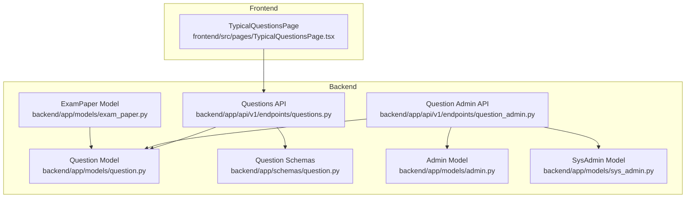
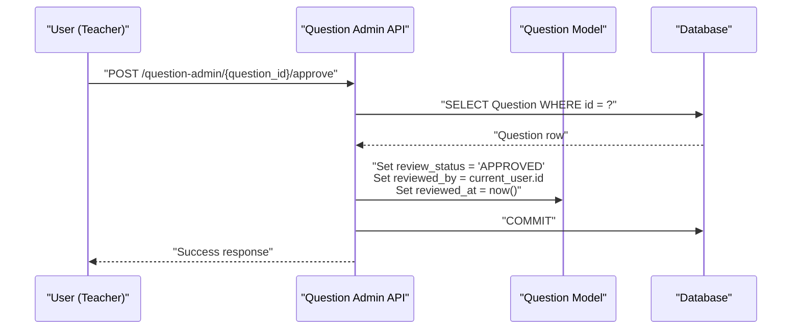
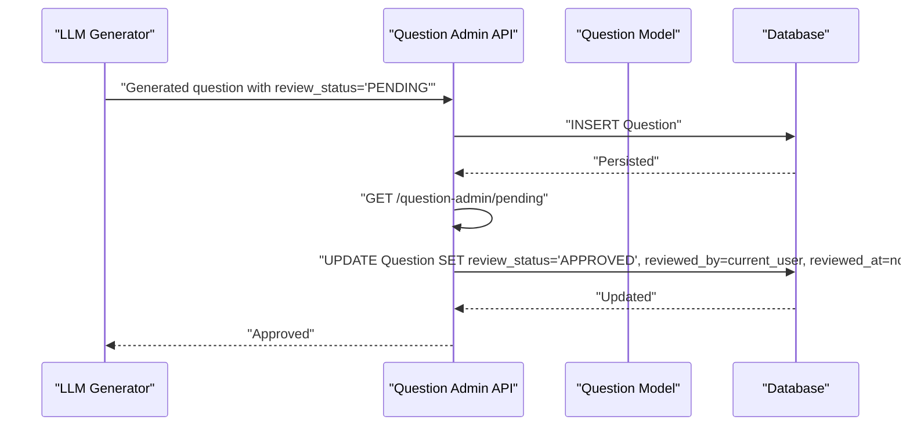
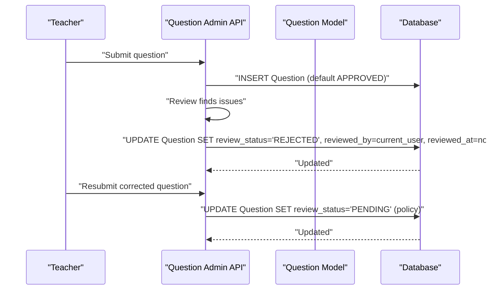
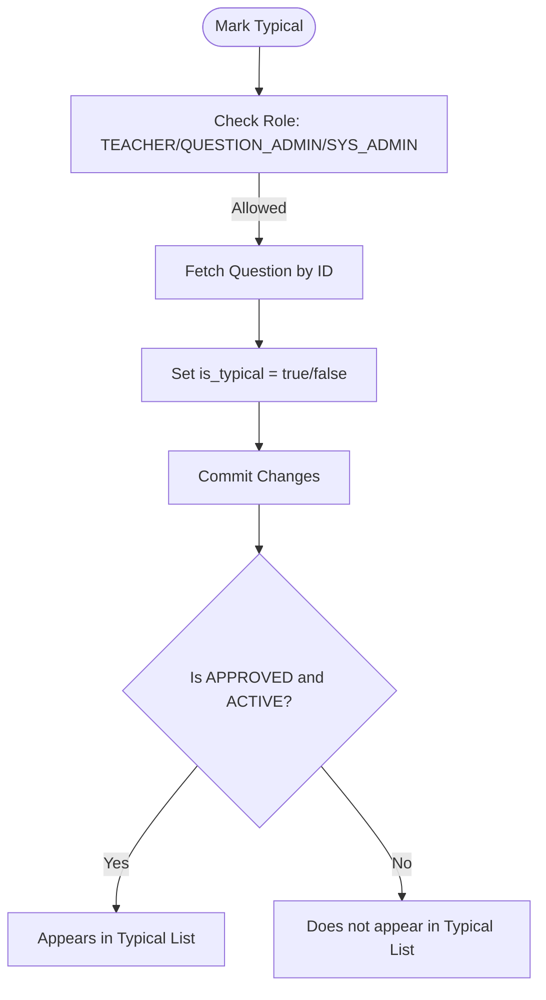
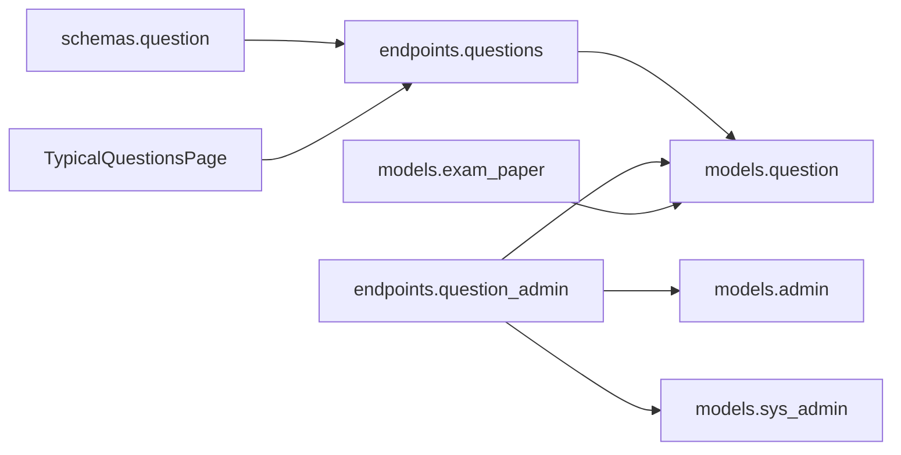

# Review and Approval Workflow

<cite>
**Referenced Files in This Document**
- [backend/app/models/question.py](file://backend/app/models/question.py)
- [backend/app/schemas/question.py](file://backend/app/schemas/question.py)
- [backend/app/api/v1/endpoints/questions.py](file://backend/app/api/v1/endpoints/questions.py)
- [backend/app/api/v1/endpoints/question_admin.py](file://backend/app/api/v1/endpoints/question_admin.py)
- [backend/app/models/admin.py](file://backend/app/models/admin.py)
- [backend/app/models/sys_admin.py](file://backend/app/models/sys_admin.py)
- [backend/app/models/exam_paper.py](file://backend/app/models/exam_paper.py)
- [backend/alembic/versions/001_v22_initial.py](file://backend/alembic/versions/001_v22_initial.py)
- [backend/alembic/versions/003_add_is_typical.py](file://backend/alembic/versions/003_add_is_typical.py)
- [backend/alembic/versions/005_add_ocr_needs_review_status.py](file://backend/alembic/versions/005_add_ocr_needs_review_status.py)
- [frontend/src/pages/TypicalQuestionsPage.tsx](file://frontend/src/pages/TypicalQuestionsPage.tsx)
</cite>

## Table of Contents
1. [Introduction](#introduction)
2. [Project Structure](#project-structure)
3. [Core Components](#core-components)
4. [Architecture Overview](#architecture-overview)
5. [Detailed Component Analysis](#detailed-component-analysis)
6. [Dependency Analysis](#dependency-analysis)
7. [Performance Considerations](#performance-considerations)
8. [Troubleshooting Guide](#troubleshooting-guide)
9. [Conclusion](#conclusion)

## Introduction
This document explains the question review and approval workflow system. It covers the review_status field values (APPROVED, PENDING, REJECTED), the role-based approval process among TEACHER, QUESTION_ADMIN, and SYS_ADMIN, the typical question system using is_typical, and how review status impacts question visibility in exams. It also documents quality assurance checks, administrative oversight, examples of approval/rejection workflows, re-submission processes, and audit trail mechanisms.

## Project Structure
The review and approval workflow spans backend models, schemas, API endpoints, and frontend pages:
- Backend models define the Question entity and related constraints.
- Schemas validate and normalize question creation/update requests.
- API endpoints implement creation, search, typical listing, and admin approval/rejection.
- Frontend pages consume typical question lists and present them to users.

**Diagram sources**
- [backend/app/models/question.py:10-46](file://backend/app/models/question.py#L10-L46)
- [backend/app/schemas/question.py:10-75](file://backend/app/schemas/question.py#L10-L75)
- [backend/app/api/v1/endpoints/questions.py:17-431](file://backend/app/api/v1/endpoints/questions.py#L17-L431)
- [backend/app/api/v1/endpoints/question_admin.py:268-343](file://backend/app/api/v1/endpoints/question_admin.py#L268-L343)
- [backend/app/models/admin.py:9-27](file://backend/app/models/admin.py#L9-L27)
- [backend/app/models/sys_admin.py:8-22](file://backend/app/models/sys_admin.py#L8-L22)
- [backend/app/models/exam_paper.py:23-51](file://backend/app/models/exam_paper.py#L23-L51)
- [frontend/src/pages/TypicalQuestionsPage.tsx:10-95](file://frontend/src/pages/TypicalQuestionsPage.tsx#L10-L95)

**Section sources**
- [backend/app/models/question.py:10-46](file://backend/app/models/question.py#L10-L46)
- [backend/app/schemas/question.py:10-75](file://backend/app/schemas/question.py#L10-L75)
- [backend/app/api/v1/endpoints/questions.py:17-431](file://backend/app/api/v1/endpoints/questions.py#L17-L431)
- [backend/app/api/v1/endpoints/question_admin.py:268-343](file://backend/app/api/v1/endpoints/question_admin.py#L268-L343)
- [backend/app/models/admin.py:9-27](file://backend/app/models/admin.py#L9-L27)
- [backend/app/models/sys_admin.py:8-22](file://backend/app/models/sys_admin.py#L8-L22)
- [backend/app/models/exam_paper.py:23-51](file://backend/app/models/exam_paper.py#L23-L51)
- [frontend/src/pages/TypicalQuestionsPage.tsx:10-95](file://frontend/src/pages/TypicalQuestionsPage.tsx#L10-L95)

## Core Components
- Question model: central entity with review_status, reviewer metadata, and typical flag.
- Schemas: validate and normalize question creation/update, including defaults for review_status.
- Questions API: CRUD, search, typical listing, and toggling typical flag.
- Question Admin API: approval/rejection endpoints and statistics for pending items.
- Admin and SysAdmin models: role definitions and administrative oversight.
- ExamPaper model: links questions to exam papers via an association table.

Key fields and behaviors:
- review_status: APPROVED by default on creation; can be set to PENDING or REJECTED during review.
- reviewed_by and reviewed_at: track who reviewed and when.
- is_typical: marks teacher-recommended questions; combined with APPROVED and is_active for visibility.
- Constraints: question_type, difficulty, and positive score enforced at DB level.

**Section sources**
- [backend/app/models/question.py:24-26](file://backend/app/models/question.py#L24-L26)
- [backend/app/models/question.py:30](file://backend/app/models/question.py#L30)
- [backend/app/schemas/question.py:33-36](file://backend/app/schemas/question.py#L33-L36)
- [backend/app/api/v1/endpoints/questions.py:236-242](file://backend/app/api/v1/endpoints/questions.py#L236-L242)
- [backend/app/api/v1/endpoints/question_admin.py:268-303](file://backend/app/api/v1/endpoints/question_admin.py#L268-L303)
- [backend/app/models/admin.py:19](file://backend/app/models/admin.py#L19)
- [backend/app/models/sys_admin.py:11-22](file://backend/app/models/sys_admin.py#L11-L22)
- [backend/app/models/exam_paper.py:9-20](file://backend/app/models/exam_paper.py#L9-L20)

## Architecture Overview
The workflow integrates creation, review, and publication:
- Creation: TEACHER, QUESTION_ADMIN, and SYS_ADMIN can create questions; defaults set review_status to APPROVED.
- Review: QUESTION_ADMIN and SYS_ADMIN can approve or reject; TEACHER can also participate in approvals.
- Typical marking: TEACHER, QUESTION_ADMIN, and SYS_ADMIN can toggle is_typical.
- Visibility: typical questions are visible to all authenticated users when approved and active.
- Exams: questions linked to published exam papers are included in paper queries.

**Diagram sources**
- [backend/app/api/v1/endpoints/question_admin.py:268-284](file://backend/app/api/v1/endpoints/question_admin.py#L268-L284)
- [backend/app/models/question.py:24-26](file://backend/app/models/question.py#L24-L26)

**Section sources**
- [backend/app/api/v1/endpoints/questions.py:17-36](file://backend/app/api/v1/endpoints/questions.py#L17-L36)
- [backend/app/api/v1/endpoints/question_admin.py:268-303](file://backend/app/api/v1/endpoints/question_admin.py#L268-L303)
- [backend/app/models/question.py:24-26](file://backend/app/models/question.py#L24-L26)

## Detailed Component Analysis

### Review Status Values and Implications
- APPROVED: Default for newly created questions; indicates ready for use and visibility.
- PENDING: Indicates pending review; often used for auto-generated or imported questions.
- REJECTED: Indicates the question failed review; requires correction and re-submission.

Implications:
- Typical questions must be APPROVED to appear in the typical list.
- Review status is used to filter pending items for administrators.
- Reviewer identity and timestamp are recorded upon change.

**Section sources**
- [backend/app/models/question.py:24](file://backend/app/models/question.py#L24)
- [backend/app/schemas/question.py:33-36](file://backend/app/schemas/question.py#L33-L36)
- [backend/app/api/v1/endpoints/questions.py:236-242](file://backend/app/api/v1/endpoints/questions.py#L236-L242)
- [backend/app/api/v1/endpoints/question_admin.py:234-265](file://backend/app/api/v1/endpoints/question_admin.py#L234-L265)
- [backend/alembic/versions/005_add_ocr_needs_review_status.py:16-32](file://backend/alembic/versions/005_add_ocr_needs_review_status.py#L16-L32)

### Role-Based Approval Process
Roles:
- TEACHER: Can create questions, update own questions, toggle typical flag, and approve/reject (permitted by endpoints).
- QUESTION_ADMIN: Can create/edit questions, approve/reject, list pending, and manage tasks.
- SYS_ADMIN: Highest authority; can approve/reject and oversee administrative functions.

Approval endpoints:
- Approve: POST /question-admin/{question_id}/approve
- Reject: POST /question-admin/{question_id}/reject
- Batch approve/reject: POST /question-admin/batch-approve, POST /question-admin/batch-reject
- Pending list: GET /question-admin/pending

Permissions are enforced in endpoints; TEACHER can act on questions they created or when permitted by admin routes.

**Section sources**
- [backend/app/api/v1/endpoints/questions.py:292-328](file://backend/app/api/v1/endpoints/questions.py#L292-L328)
- [backend/app/api/v1/endpoints/questions.py:257-273](file://backend/app/api/v1/endpoints/questions.py#L257-L273)
- [backend/app/api/v1/endpoints/questions.py:23-30](file://backend/app/api/v1/endpoints/questions.py#L23-L30)
- [backend/app/api/v1/endpoints/question_admin.py:268-343](file://backend/app/api/v1/endpoints/question_admin.py#L268-L343)
- [backend/app/models/admin.py:19](file://backend/app/models/admin.py#L19)
- [backend/app/models/sys_admin.py:11-22](file://backend/app/models/sys_admin.py#L11-L22)

### Typical Question System
- is_typical flag marks teacher-recommended questions.
- Typical listing endpoint filters by is_typical = TRUE, is_active = TRUE, and review_status = "APPROVED".
- Frontend page fetches typical questions and displays them to authenticated users.

Impact on visibility:
- Only approved, active, and typical questions are shown in typical listings.

**Section sources**
- [backend/app/models/question.py:30](file://backend/app/models/question.py#L30)
- [backend/app/api/v1/endpoints/questions.py:227-254](file://backend/app/api/v1/endpoints/questions.py#L227-L254)
- [frontend/src/pages/TypicalQuestionsPage.tsx:23-35](file://frontend/src/pages/TypicalQuestionsPage.tsx#L23-L35)

### Content Review and Quality Assurance
- Creation defaults: review_status defaults to APPROVED for manual creation.
- Auto-generated/imported questions: review_status set to PENDING to trigger review.
- Deduplication: administrative tools scan for duplicates and allow merging while preserving metadata.

Quality gates:
- Pending review list for administrators.
- Batch operations for efficient review workflows.
- Dedup service computes content hashes and groups similar questions.

**Section sources**
- [backend/app/api/v1/endpoints/questions.py:26-36](file://backend/app/api/v1/endpoints/questions.py#L26-L36)
- [backend/app/api/v1/endpoints/question_admin.py:138-217](file://backend/app/api/v1/endpoints/question_admin.py#L138-L217)
- [backend/app/api/v1/endpoints/question_admin.py:498-530](file://backend/app/api/v1/endpoints/question_admin.py#L498-L530)
- [backend/alembic/versions/003_add_is_typical.py:11-16](file://backend/alembic/versions/003_add_is_typical.py#L11-L16)

### Administrative Oversight Mechanisms
- Statistics endpoint aggregates counts by review_status, question_type, difficulty, and source; highlights pending items.
- Task management for generation/scraping operations.
- Dedup merge preserves metadata indicating kept and merged IDs.

**Section sources**
- [backend/app/api/v1/endpoints/question_admin.py:346-412](file://backend/app/api/v1/endpoints/question_admin.py#L346-L412)
- [backend/app/api/v1/endpoints/question_admin.py:476-495](file://backend/app/api/v1/endpoints/question_admin.py#L476-L495)
- [backend/app/api/v1/endpoints/question_admin.py:800-837](file://backend/app/api/v1/endpoints/question_admin.py#L800-L837)

### Relationship Between Review Status and Exam Availability
- Questions linked to exam papers are fetched via an association table.
- Review status does not directly filter exam paper questions; however, typical visibility is gated by APPROVED status.
- Administrators can review and approve questions before linking them to published papers.

**Section sources**
- [backend/app/models/exam_paper.py:9-20](file://backend/app/models/exam_paper.py#L9-L20)
- [backend/app/api/v1/endpoints/exam_papers.py:566-582](file://backend/app/api/v1/endpoints/exam_papers.py#L566-L582)
- [backend/app/api/v1/endpoints/questions.py:236-242](file://backend/app/api/v1/endpoints/questions.py#L236-L242)

### Audit Trails for Review Actions
- reviewed_by and reviewed_at are updated when a question’s review_status changes.
- Typical marking updates are auditable via commit operations.
- Grading records demonstrate a pattern for audit trail entries (separate domain), reinforcing the importance of tracking reviewer actions.

**Section sources**
- [backend/app/models/question.py:25-26](file://backend/app/models/question.py#L25-L26)
- [backend/app/api/v1/endpoints/question_admin.py:287-303](file://backend/app/api/v1/endpoints/question_admin.py#L287-L303)
- [backend/app/api/v1/endpoints/answers.py:98-112](file://backend/app/api/v1/endpoints/answers.py#L98-L112)

### Examples of Workflows

#### Example 1: Approving a Generated Question
- Scenario: LLM-generated question enters with review_status = PENDING.
- Action: QUESTION_ADMIN approves the question.
- Outcome: review_status becomes APPROVED; reviewer metadata recorded.

**Diagram sources**
- [backend/app/api/v1/endpoints/question_admin.py:138-217](file://backend/app/api/v1/endpoints/question_admin.py#L138-L217)
- [backend/app/api/v1/endpoints/question_admin.py:268-284](file://backend/app/api/v1/endpoints/question_admin.py#L268-L284)

#### Example 2: Rejecting a Question and Re-submission
- Scenario: Question submitted with errors.
- Action: QUESTION_ADMIN rejects the question.
- Outcome: review_status becomes REJECTED; reviewer metadata recorded.
- Re-submission: Creator updates and resubmits; status resets to PENDING/APPROVED depending on policy.

**Diagram sources**
- [backend/app/api/v1/endpoints/questions.py:26-36](file://backend/app/api/v1/endpoints/questions.py#L26-L36)
- [backend/app/api/v1/endpoints/question_admin.py:287-303](file://backend/app/api/v1/endpoints/question_admin.py#L287-L303)

#### Example 3: Typical Question Visibility
- Scenario: Teacher marks a question as typical.
- Action: Toggle typical flag via PUT endpoint.
- Outcome: Question appears in typical list if APPROVED and active.

**Diagram sources**
- [backend/app/api/v1/endpoints/questions.py:257-273](file://backend/app/api/v1/endpoints/questions.py#L257-L273)
- [backend/app/api/v1/endpoints/questions.py:236-242](file://backend/app/api/v1/endpoints/questions.py#L236-L242)
- [frontend/src/pages/TypicalQuestionsPage.tsx:23-35](file://frontend/src/pages/TypicalQuestionsPage.tsx#L23-L35)

## Dependency Analysis
The system exhibits clear separation of concerns:
- Models define data and constraints.
- Schemas validate inputs.
- Endpoints orchestrate business logic and enforce roles.
- Frontend consumes curated endpoints.

**Diagram sources**
- [backend/app/schemas/question.py:10-75](file://backend/app/schemas/question.py#L10-L75)
- [backend/app/api/v1/endpoints/questions.py:17-431](file://backend/app/api/v1/endpoints/questions.py#L17-L431)
- [backend/app/api/v1/endpoints/question_admin.py:268-343](file://backend/app/api/v1/endpoints/question_admin.py#L268-L343)
- [backend/app/models/question.py:10-46](file://backend/app/models/question.py#L10-L46)
- [backend/app/models/admin.py:9-27](file://backend/app/models/admin.py#L9-L27)
- [backend/app/models/sys_admin.py:8-22](file://backend/app/models/sys_admin.py#L8-L22)
- [backend/app/models/exam_paper.py:23-51](file://backend/app/models/exam_paper.py#L23-L51)
- [frontend/src/pages/TypicalQuestionsPage.tsx:10-95](file://frontend/src/pages/TypicalQuestionsPage.tsx#L10-L95)

**Section sources**
- [backend/app/schemas/question.py:10-75](file://backend/app/schemas/question.py#L10-L75)
- [backend/app/api/v1/endpoints/questions.py:17-431](file://backend/app/api/v1/endpoints/questions.py#L17-L431)
- [backend/app/api/v1/endpoints/question_admin.py:268-343](file://backend/app/api/v1/endpoints/question_admin.py#L268-L343)
- [backend/app/models/question.py:10-46](file://backend/app/models/question.py#L10-L46)
- [backend/app/models/admin.py:9-27](file://backend/app/models/admin.py#L9-L27)
- [backend/app/models/sys_admin.py:8-22](file://backend/app/models/sys_admin.py#L8-L22)
- [backend/app/models/exam_paper.py:23-51](file://backend/app/models/exam_paper.py#L23-L51)
- [frontend/src/pages/TypicalQuestionsPage.tsx:10-95](file://frontend/src/pages/TypicalQuestionsPage.tsx#L10-L95)

## Performance Considerations
- Filtering by review_status and typical flag uses indexed fields to minimize scans.
- Pagination limits reduce payload sizes for bulk operations.
- Deduplication leverages computed content hashes to avoid expensive comparisons.

## Troubleshooting Guide
Common issues and resolutions:
- Permission denied: Ensure user role is TEACHER, QUESTION_ADMIN, or SYS_ADMIN for the given endpoint.
- Question not appearing in typical list: Verify is_typical = TRUE, is_active = TRUE, and review_status = "APPROVED".
- Pending review backlog: Use the pending list endpoint to triage items.
- Rejected question re-submission: Update content, then resubmit; administrators can reset review_status to PENDING/APPROVED.

**Section sources**
- [backend/app/api/v1/endpoints/questions.py:23-30](file://backend/app/api/v1/endpoints/questions.py#L23-L30)
- [backend/app/api/v1/endpoints/questions.py:236-242](file://backend/app/api/v1/endpoints/questions.py#L236-L242)
- [backend/app/api/v1/endpoints/question_admin.py:234-265](file://backend/app/api/v1/endpoints/question_admin.py#L234-L265)

## Conclusion
The review and approval workflow centers on a clear review_status lifecycle, role-based controls, and quality gates. APPROVED status enables typical visibility and exam inclusion, while PENDING and REJECTED states support controlled review and rework. Administrative tools streamline oversight, and audit fields capture reviewer actions. Typical marking complements the approval process by surfacing teacher-recommended questions under the same quality constraints.