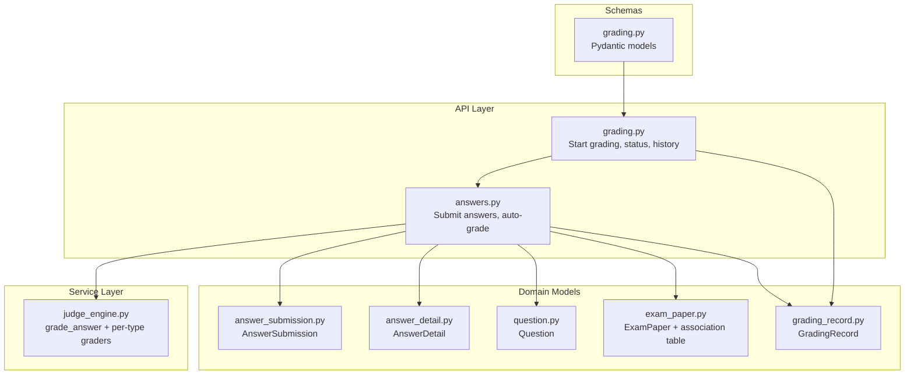
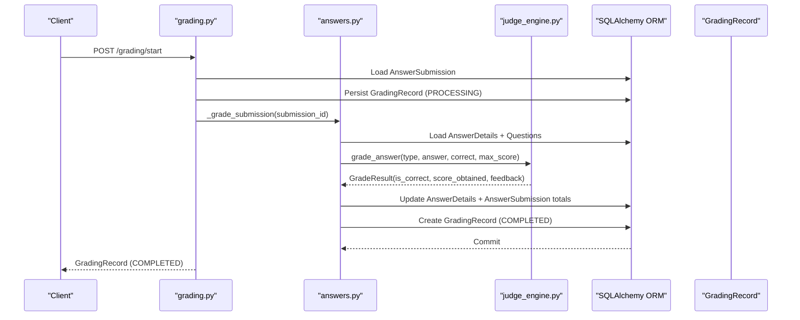
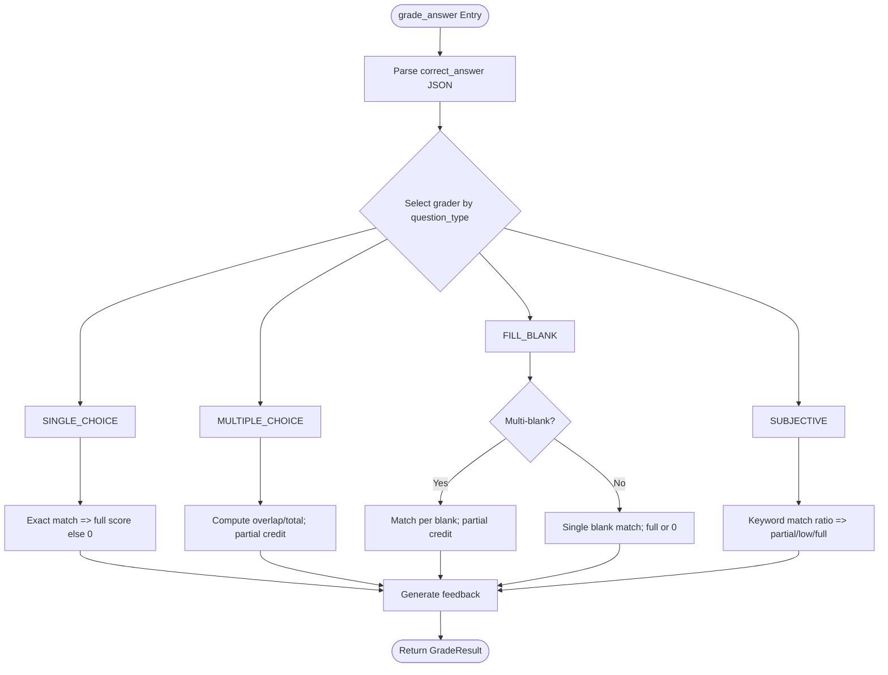
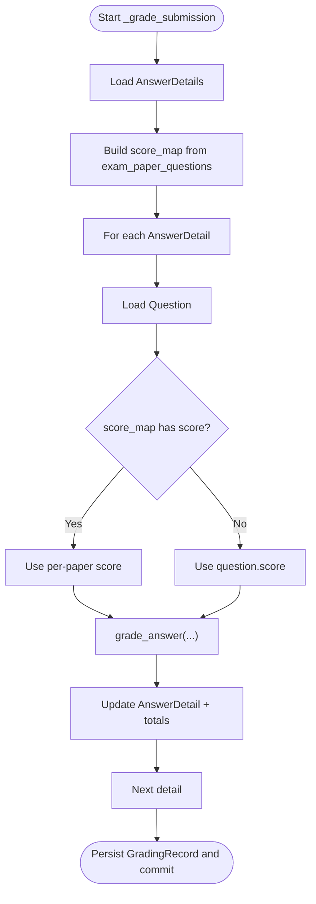
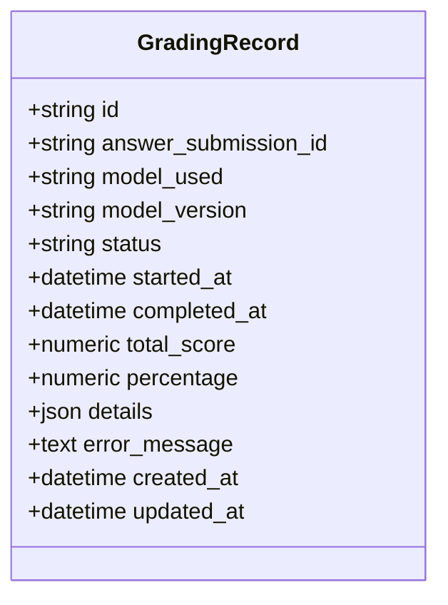
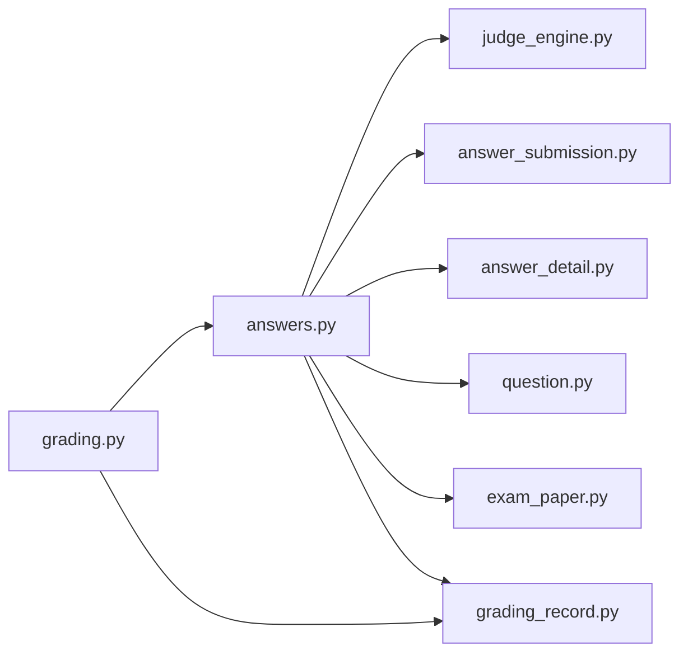

# Automated Grading Engine

<cite>
**Referenced Files in This Document**
- [grading.py](file://backend/app/api/v1/endpoints/grading.py)
- [answers.py](file://backend/app/api/v1/endpoints/answers.py)
- [judge_engine.py](file://backend/app/services/judge_engine.py)
- [grading_record.py](file://backend/app/models/grading_record.py)
- [answer_submission.py](file://backend/app/models/answer_submission.py)
- [answer_detail.py](file://backend/app/models/answer_detail.py)
- [question.py](file://backend/app/models/question.py)
- [exam_paper.py](file://backend/app/models/exam_paper.py)
- [grading.py](file://backend/app/schemas/grading.py)
- [grading-implementation-plan.md](file://docs/grading-implementation-plan.md)
- [004_simplify_submission_status.py](file://backend/alembic/versions/004_simplify_submission_status.py)
</cite>

## Table of Contents
1. [Introduction](#introduction)
2. [Project Structure](#project-structure)
3. [Core Components](#core-components)
4. [Architecture Overview](#architecture-overview)
5. [Detailed Component Analysis](#detailed-component-analysis)
6. [Dependency Analysis](#dependency-analysis)
7. [Performance Considerations](#performance-considerations)
8. [Troubleshooting Guide](#troubleshooting-guide)
9. [Conclusion](#conclusion)
10. [Appendices](#appendices)

## Introduction
This document describes the automated grading engine system, focusing on the grade_answer function implementation and how different question types are handled. It explains the scoring algorithm, partial credit calculation, feedback generation, and the GradingRecord model used for audit trails. It also covers integration with the judge engine service, score mapping from exam paper configurations, and the grade calculation methodology. Examples of grading workflows, score calculation formulas, and feedback templates are included, along with guidance on the grading audit system, performance monitoring, and fallback mechanisms for edge cases.

## Project Structure
The grading engine spans several modules:
- API endpoints orchestrate grading initiation and history retrieval.
- Services implement the rule-based judge engine used to compute scores and feedback.
- Models define the data structures for submissions, details, questions, exam papers, and grading records.
- Schemas standardize request/response formats.
- Alembic migrations manage database constraints related to submission statuses.

**Diagram sources**
- [grading.py:1-143](file://backend/app/api/v1/endpoints/grading.py#L1-L143)
- [answers.py:1-421](file://backend/app/api/v1/endpoints/answers.py#L1-L421)
- [judge_engine.py:1-130](file://backend/app/services/judge_engine.py#L1-L130)
- [grading_record.py:1-31](file://backend/app/models/grading_record.py#L1-L31)
- [answer_submission.py:1-37](file://backend/app/models/answer_submission.py#L1-L37)
- [answer_detail.py:1-33](file://backend/app/models/answer_detail.py#L1-L33)
- [question.py:1-46](file://backend/app/models/question.py#L1-L46)
- [exam_paper.py:1-51](file://backend/app/models/exam_paper.py#L1-L51)
- [grading.py:1-36](file://backend/app/schemas/grading.py#L1-L36)

**Section sources**
- [grading.py:1-143](file://backend/app/api/v1/endpoints/grading.py#L1-L143)
- [answers.py:1-421](file://backend/app/api/v1/endpoints/answers.py#L1-L421)
- [judge_engine.py:1-130](file://backend/app/services/judge_engine.py#L1-L130)
- [grading_record.py:1-31](file://backend/app/models/grading_record.py#L1-L31)
- [answer_submission.py:1-37](file://backend/app/models/answer_submission.py#L1-L37)
- [answer_detail.py:1-33](file://backend/app/models/answer_detail.py#L1-L33)
- [question.py:1-46](file://backend/app/models/question.py#L1-L46)
- [exam_paper.py:1-51](file://backend/app/models/exam_paper.py#L1-L51)
- [grading.py:1-36](file://backend/app/schemas/grading.py#L1-L36)

## Core Components
- Rule-based judge engine: Implements grade_answer and per-type graders for SINGLE_CHOICE, MULTIPLE_CHOICE, FILL_BLANK, SUBJECTIVE.
- Submission and detail models: Track student answers, correctness, scored points, and feedback.
- Question and exam paper models: Define question metadata, scores, and per-paper score overrides via an association table.
- GradingRecord model: Captures audit trail with model versioning, processing timestamps, and detailed score breakdowns.
- API endpoints: Start grading, fetch status/results, and retrieve history; integrate with the judge engine and persist audit records.

Key implementation references:
- [grade_answer:126-129](file://backend/app/services/judge_engine.py#L126-L129)
- [Per-type graders:31-116](file://backend/app/services/judge_engine.py#L31-L116)
- [Scoring and feedback mapping:31-116](file://backend/app/services/judge_engine.py#L31-L116)
- [GradingRecord persistence:98-112](file://backend/app/api/v1/endpoints/answers.py#L98-L112)

**Section sources**
- [judge_engine.py:1-130](file://backend/app/services/judge_engine.py#L1-L130)
- [answers.py:24-112](file://backend/app/api/v1/endpoints/answers.py#L24-L112)
- [grading_record.py:8-31](file://backend/app/models/grading_record.py#L8-L31)

## Architecture Overview
The grading pipeline integrates API orchestration, rule-based scoring, and audit logging:

**Diagram sources**
- [grading.py:19-55](file://backend/app/api/v1/endpoints/grading.py#L19-L55)
- [answers.py:24-112](file://backend/app/api/v1/endpoints/answers.py#L24-L112)
- [judge_engine.py:126-129](file://backend/app/services/judge_engine.py#L126-L129)
- [grading_record.py:8-31](file://backend/app/models/grading_record.py#L8-L31)

## Detailed Component Analysis

### Rule-Based Judge Engine: grade_answer and Per-Type Gradors
The judge engine provides a single entry point grade_answer that delegates to a type-specific grader. It parses correct_answer into a structured dictionary and applies question-type-specific logic to compute correctness, score, and feedback.

- SINGLE_CHOICE: Exact match (case-insensitive) yields full marks; otherwise zero.
- MULTIPLE_CHOICE: Set-based comparison; partial credit computed as overlap/total_correct; feedback reports counts and correct answers.
- FILL_BLANK: Supports single blank with multiple acceptable answers or multi-blank mode with per-blank alternatives; partial credit computed as matched_blanks/total_blanks.
- SUBJECTIVE: Keyword matching; feedback varies by match ratio with suggestions for manual review.

**Diagram sources**
- [judge_engine.py:20-129](file://backend/app/services/judge_engine.py#L20-L129)

**Section sources**
- [judge_engine.py:20-129](file://backend/app/services/judge_engine.py#L20-L129)

### Score Mapping from Exam Paper Configurations
The grading process builds a per-question score map from the exam_paper_questions association table. If a per-paper score is defined, it overrides the question’s default score. This ensures flexibility in exam design while maintaining consistent scoring.

**Diagram sources**
- [answers.py:43-96](file://backend/app/api/v1/endpoints/answers.py#L43-L96)
- [exam_paper.py:9-20](file://backend/app/models/exam_paper.py#L9-L20)

**Section sources**
- [answers.py:43-96](file://backend/app/api/v1/endpoints/answers.py#L43-L96)
- [exam_paper.py:9-20](file://backend/app/models/exam_paper.py#L9-L20)

### GradingRecord Model for Audit Trails
GradingRecord captures:
- Identity and linkage: answer_submission_id, model_used, model_version
- Lifecycle: status with transitions, started_at, completed_at
- Scores: total_score, percentage
- Details: JSON payload containing per-question breakdown and summary counts
- Error handling: error_message for failures
- Timestamps: created_at, updated_at

**Diagram sources**
- [grading_record.py:8-31](file://backend/app/models/grading_record.py#L8-L31)

**Section sources**
- [grading_record.py:8-31](file://backend/app/models/grading_record.py#L8-L31)
- [answers.py:98-112](file://backend/app/api/v1/endpoints/answers.py#L98-L112)

### Question Type Handling and Scoring Algorithms
- SINGLE_CHOICE
  - Formula: score = max_score if exact match else 0
  - Feedback: indicates correctness and correct answer
  - Reference: [grade_single_choice:31-40](file://backend/app/services/judge_engine.py#L31-L40)

- MULTIPLE_CHOICE
  - Formula: score = (|A ∩ C| / |C|) × max_score where A is actual set, C is correct set
  - Partial credit: enabled; feedback includes overlap count and correct answers
  - Reference: [grade_multiple_choice:43-58](file://backend/app/services/judge_engine.py#L43-L58)

- FILL_BLANK
  - Single blank: full score if any acceptable answer matches; otherwise 0
  - Multi-blank: score = matched_blanks / total_blanks × max_score
  - Feedback: shows correct answers per blank or combined
  - Reference: [grade_fill_blank:61-93](file://backend/app/services/judge_engine.py#L61-L93)

- SUBJECTIVE
  - Keyword-based scoring with thresholds:
    - Ratio ≥ 0.8: 0.9 × max_score with suggestion for manual review
    - Ratio ≥ 0.4: 0.5 × max_score with guidance
    - Else: 0.1 × max_score with guidance
  - Feedback: keyword match count and recommendation
  - Reference: [grade_subjective:96-115](file://backend/app/services/judge_engine.py#L96-L115)

**Section sources**
- [judge_engine.py:31-115](file://backend/app/services/judge_engine.py#L31-L115)

### Feedback Generation and Templates
Feedback strings are generated per grader and include:
- Correctness indicators
- Correct answers or sets
- Match counts for multi-blank and subjective
- Guidance for manual review when applicable

Examples of feedback templates:
- SINGLE_CHOICE: “Correct” or “Correct answer is X”
- MULTIPLE_CHOICE: “Fully correct” or “Partially correct (n/m), correct answers are A,B”
- FILL_BLANK: “Correct” or “Correct answers are X or Y | Z”
- SUBJECTIVE: “Keyword match k/n, suggest manual review” or “Low match (k/n), refer to model answer”

References:
- [grade_single_choice feedback:35-40](file://backend/app/services/judge_engine.py#L35-L40)
- [grade_multiple_choice feedback:57-58](file://backend/app/services/judge_engine.py#L57-L58)
- [grade_fill_blank feedback:80-86](file://backend/app/services/judge_engine.py#L80-L86)
- [grade_subjective feedback:111-115](file://backend/app/services/judge_engine.py#L111-L115)

**Section sources**
- [judge_engine.py:31-115](file://backend/app/services/judge_engine.py#L31-L115)

### API Workflows and Integration
- Start grading:
  - Validates submission ownership/permissions
  - Marks submission as GRADED
  - Creates a GradingRecord with PROCESSING status and starts timing
  - Invokes _grade_submission asynchronously
  - Updates record to COMPLETED with timestamps and totals
  - Reference: [start_grading:19-55](file://backend/app/api/v1/endpoints/grading.py#L19-L55)

- Auto-grade on submission:
  - Immediately grades newly submitted answers
  - Persists audit record and notifies user
  - Reference: [submit_answer auto-grade:155-191](file://backend/app/api/v1/endpoints/answers.py#L155-L191)

- History and status:
  - Retrieve GradingRecord by ID or by student/exam filters
  - Reference: [get_grading_status:58-68](file://backend/app/api/v1/endpoints/grading.py#L58-L68), [get_grading_result:71-81](file://backend/app/api/v1/endpoints/grading.py#L71-L81), [history endpoints:84-123](file://backend/app/api/v1/endpoints/grading.py#L84-L123)

**Section sources**
- [grading.py:19-123](file://backend/app/api/v1/endpoints/grading.py#L19-L123)
- [answers.py:155-191](file://backend/app/api/v1/endpoints/answers.py#L155-L191)

## Dependency Analysis
The system exhibits clear separation of concerns:
- API depends on services for scoring and on models for persistence.
- Services depend on models for question/correct-answer data and on schemas for typed requests/responses.
- GradingRecord persists audit data after scoring.

**Diagram sources**
- [grading.py:1-143](file://backend/app/api/v1/endpoints/grading.py#L1-L143)
- [answers.py:1-421](file://backend/app/api/v1/endpoints/answers.py#L1-L421)
- [judge_engine.py:1-130](file://backend/app/services/judge_engine.py#L1-L130)
- [grading_record.py:1-31](file://backend/app/models/grading_record.py#L1-L31)
- [answer_submission.py:1-37](file://backend/app/models/answer_submission.py#L1-L37)
- [answer_detail.py:1-33](file://backend/app/models/answer_detail.py#L1-L33)
- [question.py:1-46](file://backend/app/models/question.py#L1-L46)
- [exam_paper.py:1-51](file://backend/app/models/exam_paper.py#L1-L51)

**Section sources**
- [grading.py:1-143](file://backend/app/api/v1/endpoints/grading.py#L1-L143)
- [answers.py:1-421](file://backend/app/api/v1/endpoints/answers.py#L1-L421)
- [judge_engine.py:1-130](file://backend/app/services/judge_engine.py#L1-L130)
- [grading_record.py:1-31](file://backend/app/models/grading_record.py#L1-L31)
- [answer_submission.py:1-37](file://backend/app/models/answer_submission.py#L1-L37)
- [answer_detail.py:1-33](file://backend/app/models/answer_detail.py#L1-L33)
- [question.py:1-46](file://backend/app/models/question.py#L1-L46)
- [exam_paper.py:1-51](file://backend/app/models/exam_paper.py#L1-L51)

## Performance Considerations
- Rule-based scoring is CPU-bound and synchronous in the current design. For high throughput, consider asynchronous execution and batching.
- The scoring loop iterates per answer detail; indexing on foreign keys and minimizing N+1 queries helps maintain performance.
- Feedback generation is lightweight; avoid heavy computations in feedback paths.
- Consider caching frequently reused question metadata and score maps for repeated exams.

[No sources needed since this section provides general guidance]

## Troubleshooting Guide
Common issues and resolutions:
- Incorrect answer format:
  - The judge engine attempts to parse correct_answer as JSON; legacy plain-text fallback is supported. Ensure correct_answer follows expected JSON structure for each type.
  - References: [_parse_answer:20-28](file://backend/app/services/judge_engine.py#L20-L28)

- Missing or empty correct_answer:
  - MULTIPLE_CHOICE and FILL_BLANK may return zero scores when expected sets are empty.
  - SUBJECTIVE returns “Await manual review” when keywords are missing.
  - References: [grade_multiple_choice:50-51](file://backend/app/services/judge_engine.py#L50-L51), [grade_fill_blank:84-86](file://backend/app/services/judge_engine.py#L84-L86), [grade_subjective:100-101](file://backend/app/services/judge_engine.py#L100-L101)

- Submission status constraints:
  - Submission status is constrained to simplified states; ensure proper transitions before/after grading.
  - Reference: [submission status migration:37-52](file://backend/alembic/versions/004_simplify_submission_status.py#L37-L52)

- Audit trail verification:
  - Confirm GradingRecord entries exist and reflect expected totals and breakdowns.
  - Reference: [GradingRecord persistence:98-112](file://backend/app/api/v1/endpoints/answers.py#L98-L112)

**Section sources**
- [judge_engine.py:20-28](file://backend/app/services/judge_engine.py#L20-L28)
- [judge_engine.py:50-51](file://backend/app/services/judge_engine.py#L50-L51)
- [judge_engine.py:84-86](file://backend/app/services/judge_engine.py#L84-L86)
- [judge_engine.py:100-101](file://backend/app/services/judge_engine.py#L100-L101)
- [004_simplify_submission_status.py:37-52](file://backend/alembic/versions/004_simplify_submission_status.py#L37-L52)
- [answers.py:98-112](file://backend/app/api/v1/endpoints/answers.py#L98-L112)

## Conclusion
The automated grading engine leverages a rule-based judge service to evaluate diverse question types, compute precise scores with partial credit support, and generate actionable feedback. The GradingRecord model provides a robust audit trail with model versioning, lifecycle timestamps, and detailed score breakdowns. Integration with exam paper configurations enables flexible per-exam scoring, while API endpoints offer straightforward workflows for initiating grading, checking status, and retrieving historical records. Future enhancements may include asynchronous execution, caching, and optional LLM-assisted review for subjective items.

[No sources needed since this section summarizes without analyzing specific files]

## Appendices

### Appendix A: Design Evolution Notes
- The system moved from a hybrid rule engine + LLM approach to a pure rule engine in the current iteration, with LLM support planned for later phases.
- References: [grading-implementation-plan.md:191-198](file://docs/grading-implementation-plan.md#L191-L198)

**Section sources**
- [grading-implementation-plan.md:191-198](file://docs/grading-implementation-plan.md#L191-L198)