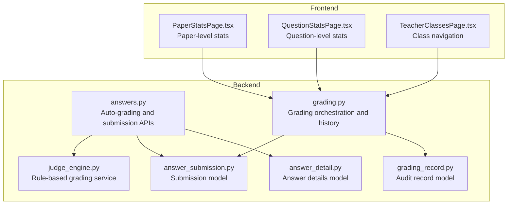
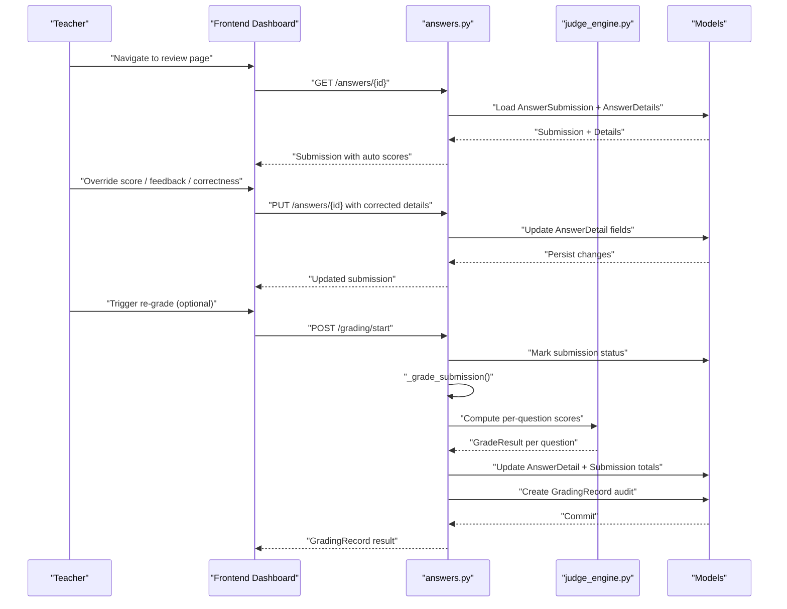
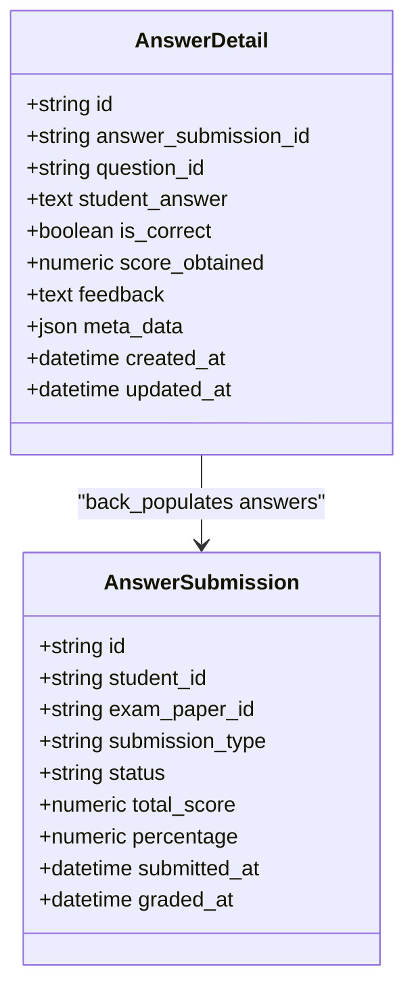
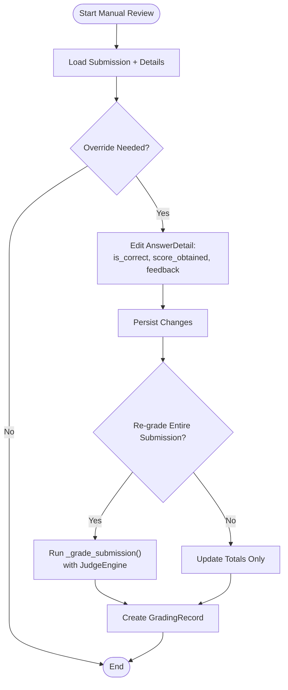
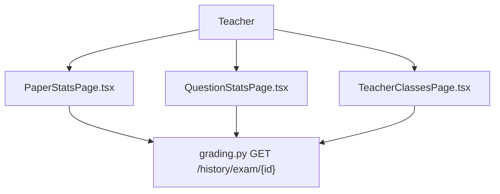
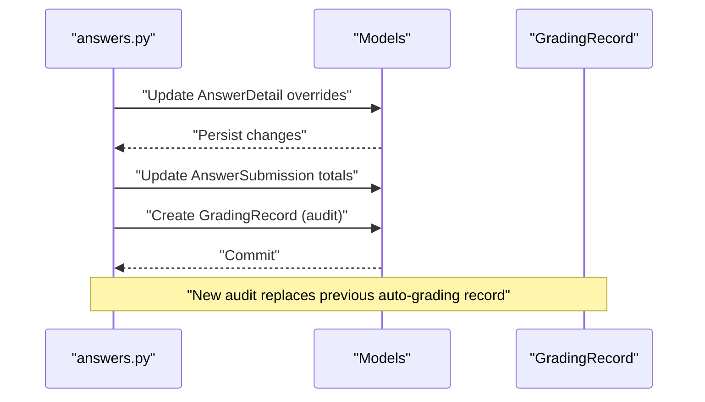
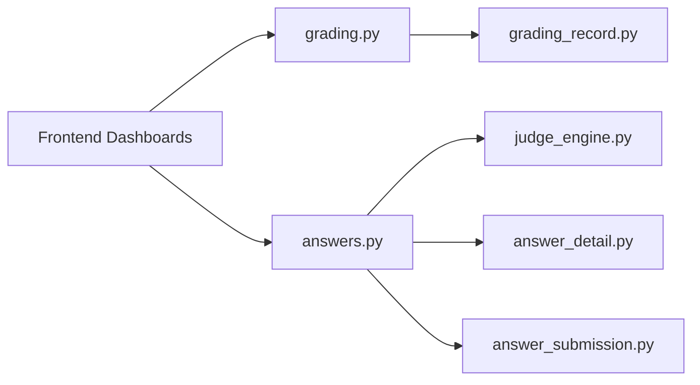

# Manual Review Process

<cite>
**Referenced Files in This Document**
- [answers.py](file://backend/app/api/v1/endpoints/answers.py)
- [grading.py](file://backend/app/api/v1/endpoints/grading.py)
- [answer_detail.py](file://backend/app/models/answer_detail.py)
- [answer_submission.py](file://backend/app/models/answer_submission.py)
- [grading_record.py](file://backend/app/models/grading_record.py)
- [judge_engine.py](file://backend/app/services/judge_engine.py)
- [grading-implementation-plan.md](file://nDocs/grading-implementation-plan.md)
- [PaperStatsPage.tsx](file://frontend/src/pages/teacher/PaperStatsPage.tsx)
- [QuestionStatsPage.tsx](file://frontend/src/pages/teacher/QuestionStatsPage.tsx)
- [TeacherClassesPage.tsx](file://frontend/src/pages/teacher/TeacherClassesPage.tsx)
</cite>

## Table of Contents
1. [Introduction](#introduction)
2. [Project Structure](#project-structure)
3. [Core Components](#core-components)
4. [Architecture Overview](#architecture-overview)
5. [Detailed Component Analysis](#detailed-component-analysis)
6. [Dependency Analysis](#dependency-analysis)
7. [Performance Considerations](#performance-considerations)
8. [Troubleshooting Guide](#troubleshooting-guide)
9. [Conclusion](#conclusion)
10. [Appendices](#appendices)

## Introduction
This document explains the manual review and correction process for teacher-led exam grading. It covers how teachers review student submissions, override automated scores, add custom feedback, and adjust point allocations. It also documents the AnswerDetail model fields used for manual corrections, the teacher dashboard integration for bulk review operations, and the audit trail preserved during manual reviews and its impact on overall exam statistics.

## Project Structure
The manual review process spans backend API endpoints, models, and services, plus frontend teacher dashboards for navigation and analytics.

**Diagram sources**
- [answers.py:1-421](file://backend/app/api/v1/endpoints/answers.py#L1-L421)
- [grading.py:1-143](file://backend/app/api/v1/endpoints/grading.py#L1-L143)
- [answer_detail.py:1-33](file://backend/app/models/answer_detail.py#L1-L33)
- [answer_submission.py:1-37](file://backend/app/models/answer_submission.py#L1-L37)
- [grading_record.py:1-31](file://backend/app/models/grading_record.py#L1-L31)
- [judge_engine.py:1-129](file://backend/app/services/judge_engine.py#L1-L129)
- [PaperStatsPage.tsx:1-116](file://frontend/src/pages/teacher/PaperStatsPage.tsx#L1-L116)
- [QuestionStatsPage.tsx:1-94](file://frontend/src/pages/teacher/QuestionStatsPage.tsx#L1-L94)
- [TeacherClassesPage.tsx:1-20](file://frontend/src/pages/teacher/TeacherClassesPage.tsx#L1-L20)

**Section sources**
- [answers.py:1-421](file://backend/app/api/v1/endpoints/answers.py#L1-L421)
- [grading.py:1-143](file://backend/app/api/v1/endpoints/grading.py#L1-L143)
- [answer_detail.py:1-33](file://backend/app/models/answer_detail.py#L1-L33)
- [answer_submission.py:1-37](file://backend/app/models/answer_submission.py#L1-L37)
- [grading_record.py:1-31](file://backend/app/models/grading_record.py#L1-L31)
- [judge_engine.py:1-129](file://backend/app/services/judge_engine.py#L1-L129)
- [PaperStatsPage.tsx:1-116](file://frontend/src/pages/teacher/PaperStatsPage.tsx#L1-L116)
- [QuestionStatsPage.tsx:1-94](file://frontend/src/pages/teacher/QuestionStatsPage.tsx#L1-L94)
- [TeacherClassesPage.tsx:1-20](file://frontend/src/pages/teacher/TeacherClassesPage.tsx#L1-L20)

## Core Components
- AnswerDetail: Stores per-question details including automated score, correctness flag, and feedback. Teachers can override these fields during manual review.
- AnswerSubmission: Holds submission metadata, total score, percentage, and status.
- GradingRecord: Audit trail capturing grading model, timing, and per-question details.
- Rule-based JudgeEngine: Computes automated scores and feedback for each question type.
- API endpoints: Provide submission, retrieval, and grading orchestration for manual review workflows.

**Section sources**
- [answer_detail.py:9-33](file://backend/app/models/answer_detail.py#L9-L33)
- [answer_submission.py:9-37](file://backend/app/models/answer_submission.py#L9-L37)
- [grading_record.py:8-31](file://backend/app/models/grading_record.py#L8-L31)
- [judge_engine.py:12-129](file://backend/app/services/judge_engine.py#L12-L129)
- [answers.py:24-112](file://backend/app/api/v1/endpoints/answers.py#L24-L112)
- [grading.py:19-55](file://backend/app/api/v1/endpoints/grading.py#L19-L55)

## Architecture Overview
The manual review workflow integrates automatic scoring with teacher overrides and preserves an audit trail.

**Diagram sources**
- [answers.py:24-112](file://backend/app/api/v1/endpoints/answers.py#L24-L112)
- [answers.py:223-289](file://backend/app/api/v1/endpoints/answers.py#L223-L289)
- [grading.py:19-55](file://backend/app/api/v1/endpoints/grading.py#L19-L55)
- [judge_engine.py:126-129](file://backend/app/services/judge_engine.py#L126-L129)
- [answer_detail.py:9-33](file://backend/app/models/answer_detail.py#L9-L33)
- [answer_submission.py:9-37](file://backend/app/models/answer_submission.py#L9-L37)
- [grading_record.py:8-31](file://backend/app/models/grading_record.py#L8-L31)

## Detailed Component Analysis

### AnswerDetail Model for Manual Corrections
AnswerDetail stores the per-question data used in manual review:
- Fields for correctness, score, and feedback enable teacher overrides.
- Constraints ensure non-negative scores and unique question-per-submission entries.
- Relationships connect to AnswerSubmission for aggregation.

**Diagram sources**
- [answer_detail.py:9-33](file://backend/app/models/answer_detail.py#L9-L33)
- [answer_submission.py:9-37](file://backend/app/models/answer_submission.py#L9-L37)

**Section sources**
- [answer_detail.py:9-33](file://backend/app/models/answer_detail.py#L9-L33)
- [answer_submission.py:33-37](file://backend/app/models/answer_submission.py#L33-L37)

### Manual Grading Workflow
- Initial auto-grading populates AnswerDetail fields and updates submission totals.
- Teachers can override per-question fields via the update endpoint.
- Optional re-grade triggers a fresh computation and creates a new audit record.

**Diagram sources**
- [answers.py:24-112](file://backend/app/api/v1/endpoints/answers.py#L24-L112)
- [answers.py:223-289](file://backend/app/api/v1/endpoints/answers.py#L223-L289)
- [grading.py:19-55](file://backend/app/api/v1/endpoints/grading.py#L19-L55)
- [judge_engine.py:126-129](file://backend/app/services/judge_engine.py#L126-L129)

**Section sources**
- [answers.py:24-112](file://backend/app/api/v1/endpoints/answers.py#L24-L112)
- [answers.py:223-289](file://backend/app/api/v1/endpoints/answers.py#L223-L289)
- [grading.py:19-55](file://backend/app/api/v1/endpoints/grading.py#L19-L55)
- [judge_engine.py:126-129](file://backend/app/services/judge_engine.py#L126-L129)

### Teacher Dashboard Integration
- PaperStatsPage and QuestionStatsPage provide analytics that help teachers identify items needing review.
- Navigation and filtering support bulk review workflows by focusing on low-performing or high-error-rate items.

**Diagram sources**
- [PaperStatsPage.tsx:29-115](file://frontend/src/pages/teacher/PaperStatsPage.tsx#L29-L115)
- [QuestionStatsPage.tsx:28-94](file://frontend/src/pages/teacher/QuestionStatsPage.tsx#L28-L94)
- [TeacherClassesPage.tsx:9-20](file://frontend/src/pages/teacher/TeacherClassesPage.tsx#L9-L20)
- [grading.py:105-123](file://backend/app/api/v1/endpoints/grading.py#L105-L123)

**Section sources**
- [PaperStatsPage.tsx:29-115](file://frontend/src/pages/teacher/PaperStatsPage.tsx#L29-L115)
- [QuestionStatsPage.tsx:28-94](file://frontend/src/pages/teacher/QuestionStatsPage.tsx#L28-L94)
- [TeacherClassesPage.tsx:9-20](file://frontend/src/pages/teacher/TeacherClassesPage.tsx#L9-L20)
- [grading.py:105-123](file://backend/app/api/v1/endpoints/grading.py#L105-L123)

### Audit Trail Preservation and Statistics Impact
- GradingRecord captures model, timing, and per-question details for traceability.
- Manual overrides update AnswerDetail fields and submission totals; re-grade replaces prior audit with a new record reflecting the corrected totals.

**Diagram sources**
- [answers.py:24-112](file://backend/app/api/v1/endpoints/answers.py#L24-L112)
- [grading_record.py:8-31](file://backend/app/models/grading_record.py#L8-L31)

**Section sources**
- [answers.py:24-112](file://backend/app/api/v1/endpoints/answers.py#L24-L112)
- [grading_record.py:8-31](file://backend/app/models/grading_record.py#L8-L31)

## Dependency Analysis
- answers.py depends on judge_engine.py for scoring and on models for persistence.
- grading.py orchestrates grading lifecycle and exposes history queries teachers use for bulk review.
- Frontend dashboards query grading endpoints to drive manual review decisions.

**Diagram sources**
- [answers.py:1-421](file://backend/app/api/v1/endpoints/answers.py#L1-L421)
- [grading.py:1-143](file://backend/app/api/v1/endpoints/grading.py#L1-L143)
- [judge_engine.py:1-129](file://backend/app/services/judge_engine.py#L1-L129)
- [answer_detail.py:1-33](file://backend/app/models/answer_detail.py#L1-L33)
- [answer_submission.py:1-37](file://backend/app/models/answer_submission.py#L1-L37)
- [grading_record.py:1-31](file://backend/app/models/grading_record.py#L1-L31)

**Section sources**
- [answers.py:1-421](file://backend/app/api/v1/endpoints/answers.py#L1-L421)
- [grading.py:1-143](file://backend/app/api/v1/endpoints/grading.py#L1-L143)
- [judge_engine.py:1-129](file://backend/app/services/judge_engine.py#L1-L129)
- [answer_detail.py:1-33](file://backend/app/models/answer_detail.py#L1-L33)
- [answer_submission.py:1-37](file://backend/app/models/answer_submission.py#L1-L37)
- [grading_record.py:1-31](file://backend/app/models/grading_record.py#L1-L31)

## Performance Considerations
- Bulk review operations benefit from filtering by paper and question statistics to focus effort on high-priority items.
- Re-scoring entire submissions is synchronous; for large-scale batches, consider asynchronous processing in future iterations.
- Indexes on AnswerDetail.answer_submission_id and AnswerDetail.question_id improve lookup performance during review.

## Troubleshooting Guide
- Permission errors: Ensure the current user is authorized (teacher/sysadmin) to access submissions and grading history.
- Submission locked after mistake book generation: Students cannot edit answers once a mistake book is generated; re-grade may be needed.
- Inconsistent scores after overrides: Confirm AnswerDetail overrides and submission totals are updated atomically; re-run grading to reconcile totals.

**Section sources**
- [answers.py:223-289](file://backend/app/api/v1/endpoints/answers.py#L223-L289)
- [grading.py:105-123](file://backend/app/api/v1/endpoints/grading.py#L105-L123)

## Conclusion
The manual review process combines automated scoring with teacher-driven overrides, preserving a robust audit trail. Teachers can efficiently navigate submissions, correct scores and feedback, and reconcile totals while leveraging dashboard analytics to prioritize review work.

## Appendices

### Manual Review Scenarios and Procedures
- Scenario A: Override a single question’s score and feedback.
  - Procedure: Update AnswerDetail fields via the submission update endpoint; optionally re-grade the entire submission to refresh totals and audit.
- Scenario B: Bulk review by paper.
  - Procedure: Use paper statistics to identify low-performing questions; apply targeted overrides; re-grade to update totals and audit.
- Scenario C: Quality assurance check.
  - Procedure: Compare per-question details in GradingRecord against AnswerDetail overrides; verify correctness flags and feedback consistency.

**Section sources**
- [answers.py:24-112](file://backend/app/api/v1/endpoints/answers.py#L24-L112)
- [answers.py:223-289](file://backend/app/api/v1/endpoints/answers.py#L223-L289)
- [grading.py:105-123](file://backend/app/api/v1/endpoints/grading.py#L105-L123)
- [grading_record.py:8-31](file://backend/app/models/grading_record.py#L8-L31)