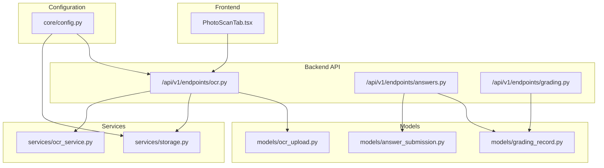
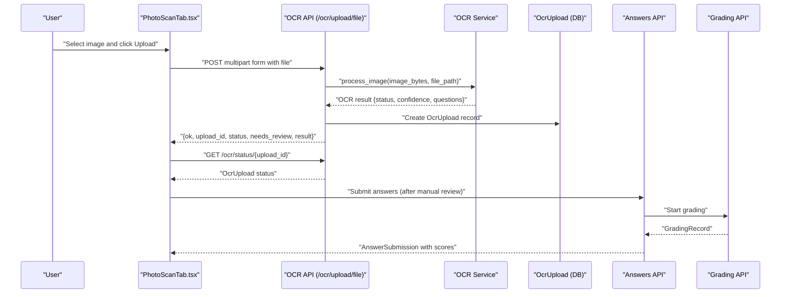
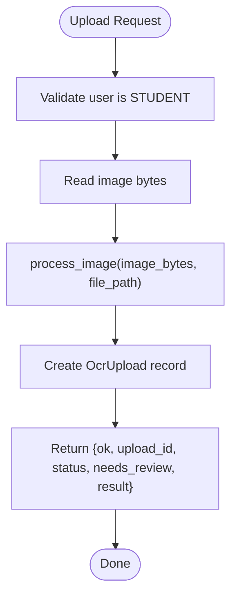
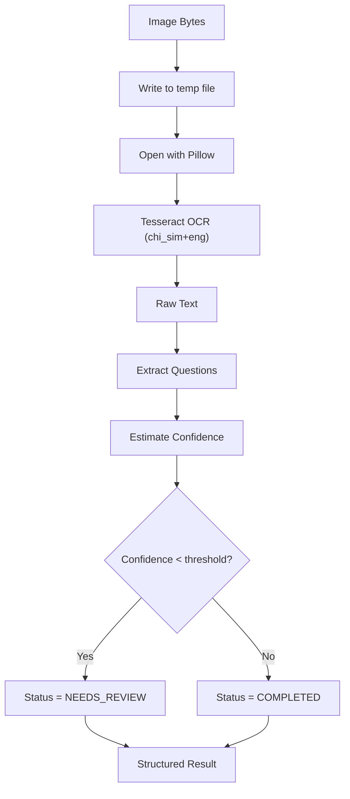
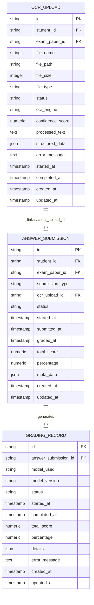
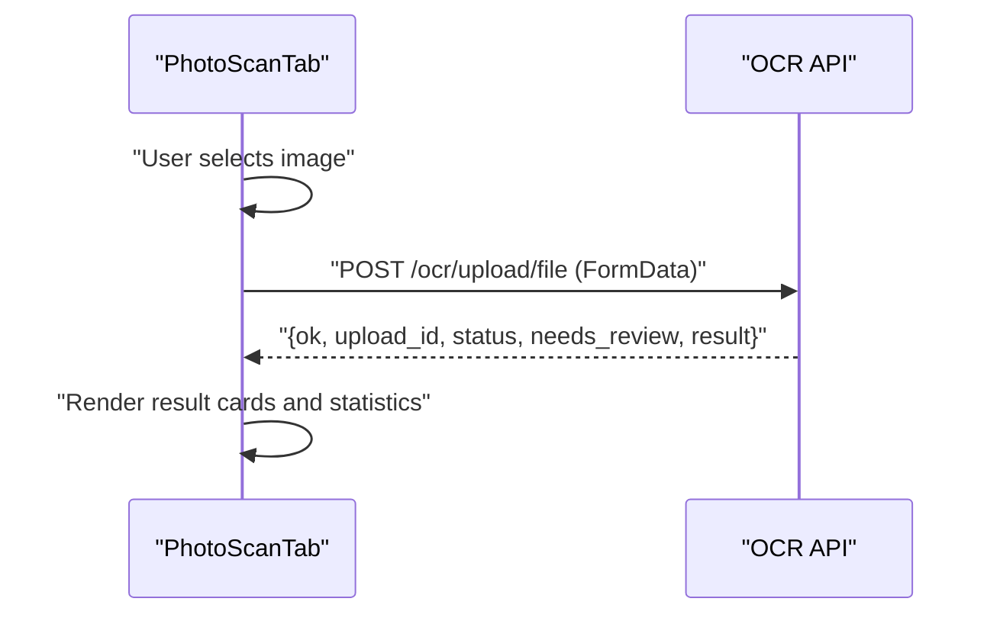
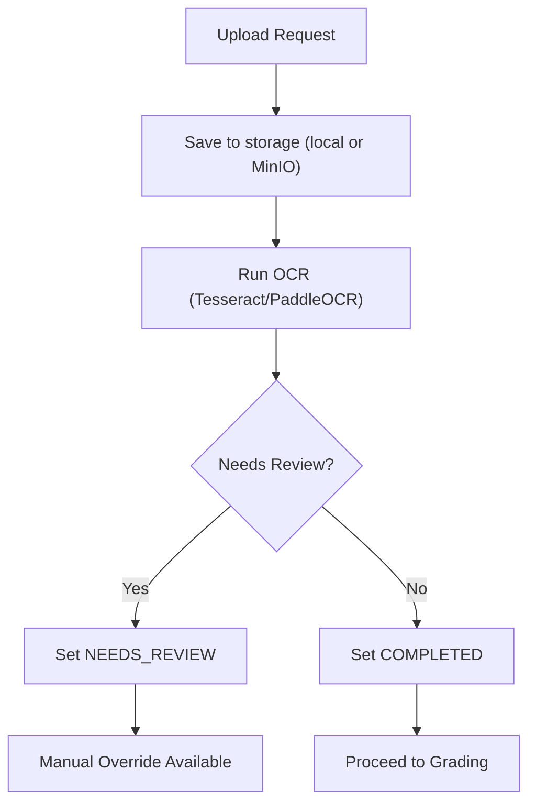
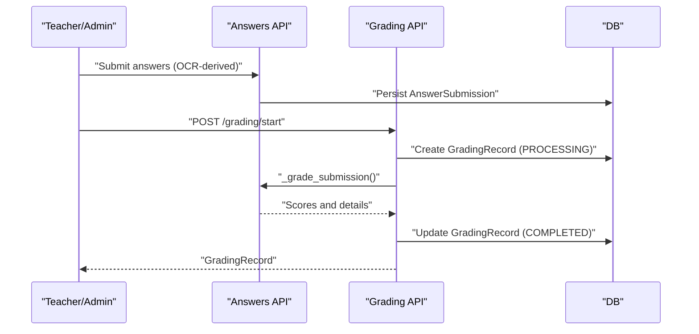
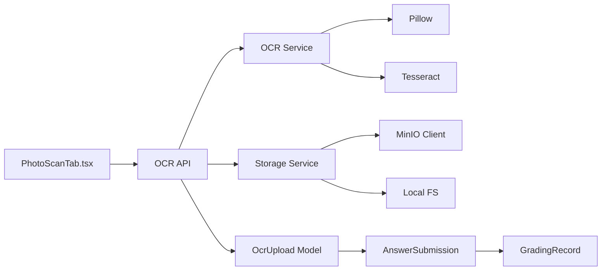

# OCR Processing Integration

<cite>
**Referenced Files in This Document**
- [ocr.py](file://backend/app/api/v1/endpoints/ocr.py)
- [ocr_service.py](file://backend/app/services/ocr_service.py)
- [storage.py](file://backend/app/services/storage.py)
- [ocr_upload.py](file://backend/app/models/ocr_upload.py)
- [answer_submission.py](file://backend/app/models/answer_submission.py)
- [grading_record.py](file://backend/app/models/grading_record.py)
- [answers.py](file://backend/app/api/v1/endpoints/answers.py)
- [grading.py](file://backend/app/api/v1/endpoints/grading.py)
- [PhotoScanTab.tsx](file://frontend/src/pages/exam-mistakes/PhotoScanTab.tsx)
- [config.py](file://backend/app/core/config.py)
- [ocr-integration-plan.md](file://docs/ocr-integration-plan.md)
</cite>

## Table of Contents
1. [Introduction](#introduction)
2. [Project Structure](#project-structure)
3. [Core Components](#core-components)
4. [Architecture Overview](#architecture-overview)
5. [Detailed Component Analysis](#detailed-component-analysis)
6. [Dependency Analysis](#dependency-analysis)
7. [Performance Considerations](#performance-considerations)
8. [Troubleshooting Guide](#troubleshooting-guide)
9. [Conclusion](#conclusion)
10. [Appendices](#appendices)

## Introduction
This document explains the OCR processing system integrated with answer submission. It covers the OCR upload workflow, image preprocessing pipeline, and text extraction algorithms using Tesseract (with future PaddleOCR integration). It documents the OCRUpload model, file validation, and storage integration with MinIO object storage. It also details the frontend PhotoScanTab interface for image capture/upload, preview functionality, and processing status tracking. The document describes the OCR service architecture, batch processing capabilities, and error handling for poor image quality. Finally, it explains how OCR results integrate with the grading system, including confidence scoring and manual override capabilities.

## Project Structure
The OCR integration spans backend API endpoints, OCR service, storage abstraction, SQLAlchemy models, and the frontend UI.

**Diagram sources**
- [ocr.py:1-291](file://backend/app/api/v1/endpoints/ocr.py#L1-L291)
- [ocr_service.py:1-126](file://backend/app/services/ocr_service.py#L1-L126)
- [storage.py:1-55](file://backend/app/services/storage.py#L1-L55)
- [ocr_upload.py:1-36](file://backend/app/models/ocr_upload.py#L1-L36)
- [answer_submission.py:1-37](file://backend/app/models/answer_submission.py#L1-L37)
- [grading_record.py:1-31](file://backend/app/models/grading_record.py#L1-L31)
- [answers.py:1-421](file://backend/app/api/v1/endpoints/answers.py#L1-L421)
- [grading.py:1-143](file://backend/app/api/v1/endpoints/grading.py#L1-L143)
- [config.py:77-86](file://backend/app/core/config.py#L77-L86)

**Section sources**
- [ocr.py:1-291](file://backend/app/api/v1/endpoints/ocr.py#L1-L291)
- [ocr_service.py:1-126](file://backend/app/services/ocr_service.py#L1-L126)
- [storage.py:1-55](file://backend/app/services/storage.py#L1-L55)
- [ocr_upload.py:1-36](file://backend/app/models/ocr_upload.py#L1-L36)
- [answer_submission.py:1-37](file://backend/app/models/answer_submission.py#L1-L37)
- [grading_record.py:1-31](file://backend/app/models/grading_record.py#L1-L31)
- [answers.py:1-421](file://backend/app/api/v1/endpoints/answers.py#L1-L421)
- [grading.py:1-143](file://backend/app/api/v1/endpoints/grading.py#L1-L143)
- [config.py:77-86](file://backend/app/core/config.py#L77-L86)

## Core Components
- OCRUpload model: Stores OCR job metadata, status, confidence, extracted text, and structured data.
- OCR service: Performs image preprocessing and text extraction using Tesseract, estimates confidence, and structures results.
- Storage service: Saves files to MinIO or local filesystem and generates URLs.
- OCR API endpoints: Handle multipart uploads, status queries, and configuration.
- Frontend PhotoScanTab: Captures or uploads images, previews, triggers OCR, and displays results.
- Answer submission and grading: Connects OCR results to grading records and supports manual overrides.

**Section sources**
- [ocr_upload.py:8-36](file://backend/app/models/ocr_upload.py#L8-L36)
- [ocr_service.py:61-126](file://backend/app/services/ocr_service.py#L61-L126)
- [storage.py:25-55](file://backend/app/services/storage.py#L25-L55)
- [ocr.py:18-64](file://backend/app/api/v1/endpoints/ocr.py#L18-L64)
- [PhotoScanTab.tsx:11-186](file://frontend/src/pages/exam-mistakes/PhotoScanTab.tsx#L11-L186)
- [answer_submission.py:9-37](file://backend/app/models/answer_submission.py#L9-L37)
- [grading_record.py:8-31](file://backend/app/models/grading_record.py#L8-L31)

## Architecture Overview
The system integrates OCR processing into the answer submission lifecycle. Students upload scanned images via the frontend, which posts to the OCR API. The backend saves the image, runs OCR, updates the OCR record, and returns results. Teachers/admins can review low-confidence results and trigger grading. The grading engine computes scores and creates a grading record.

**Diagram sources**
- [ocr.py:18-64](file://backend/app/api/v1/endpoints/ocr.py#L18-L64)
- [ocr_service.py:61-126](file://backend/app/services/ocr_service.py#L61-L126)
- [ocr_upload.py:8-36](file://backend/app/models/ocr_upload.py#L8-L36)
- [answers.py:115-197](file://backend/app/api/v1/endpoints/answers.py#L115-L197)
- [grading.py:19-55](file://backend/app/api/v1/endpoints/grading.py#L19-L55)
- [PhotoScanTab.tsx:37-61](file://frontend/src/pages/exam-mistakes/PhotoScanTab.tsx#L37-L61)

## Detailed Component Analysis

### OCR Upload Workflow
- Endpoint: POST /ocr/upload/file accepts a multipart image file and optional exam paper ID.
- Validation: Only STUDENT users can upload; file is read into memory.
- Processing: The OCR service runs Tesseract on the image, returning raw text, confidence, and structured questions.
- Persistence: An OcrUpload record is created with status derived from confidence threshold.
- Response: Returns ok flag, upload_id, status, confidence, needs_review indicator, and structured result.

**Diagram sources**
- [ocr.py:18-64](file://backend/app/api/v1/endpoints/ocr.py#L18-L64)
- [ocr_service.py:61-126](file://backend/app/services/ocr_service.py#L61-L126)
- [ocr_upload.py:8-36](file://backend/app/models/ocr_upload.py#L8-L36)

**Section sources**
- [ocr.py:18-64](file://backend/app/api/v1/endpoints/ocr.py#L18-L64)

### Image Preprocessing Pipeline and Text Extraction
- Preprocessing: The service writes the uploaded bytes to a temporary file path and opens it with Pillow.
- Extraction: Uses Tesseract with chi_sim+eng languages to extract text.
- Structuring: Extracts questions by detecting numbering patterns, options, and answer lines.
- Confidence Estimation: Computes a heuristic confidence score based on Chinese character ratio and line count.
- Status Assignment: Low confidence (< threshold) sets status to NEEDS_REVIEW; otherwise COMPLETED.

**Diagram sources**
- [ocr_service.py:61-126](file://backend/app/services/ocr_service.py#L61-L126)

**Section sources**
- [ocr_service.py:20-126](file://backend/app/services/ocr_service.py#L20-L126)

### OCRUpload Model and Data Schema
- Fields include identifiers, file metadata, OCR engine, confidence, processed text, structured data, timestamps, and status.
- Constraints enforce positive file size and valid status values.
- The model supports linking OCR results to answer submissions via foreign keys.

**Diagram sources**
- [ocr_upload.py:8-36](file://backend/app/models/ocr_upload.py#L8-L36)
- [answer_submission.py:9-37](file://backend/app/models/answer_submission.py#L9-L37)
- [grading_record.py:8-31](file://backend/app/models/grading_record.py#L8-L31)

**Section sources**
- [ocr_upload.py:8-36](file://backend/app/models/ocr_upload.py#L8-L36)
- [answer_submission.py:9-37](file://backend/app/models/answer_submission.py#L9-L37)
- [grading_record.py:8-31](file://backend/app/models/grading_record.py#L8-L31)

### Frontend PhotoScanTab Interface
- Features: Subject/grade selection, drag-and-drop image upload, live preview, and step-based workflow.
- Upload flow: Validates file presence, posts multipart form to /ocr/upload/file, and transitions to result view.
- Result view: Displays total score, estimated score, correctness counts, and question details including options and correct answers when available.

**Diagram sources**
- [PhotoScanTab.tsx:37-61](file://frontend/src/pages/exam-mistakes/PhotoScanTab.tsx#L37-L61)
- [ocr.py:18-64](file://backend/app/api/v1/endpoints/ocr.py#L18-L64)

**Section sources**
- [PhotoScanTab.tsx:11-186](file://frontend/src/pages/exam-mistakes/PhotoScanTab.tsx#L11-L186)

### OCR Service Architecture and Batch Processing
- Current state: Synchronous processing with Tesseract and local file system.
- Future roadmap: Integrate PaddleOCR with GPU acceleration, switch to MinIO for storage, and implement asynchronous processing with Celery.
- Batch processing: Endpoints exist but are marked as not implemented; planned for future versions.

**Diagram sources**
- [ocr.py:18-64](file://backend/app/api/v1/endpoints/ocr.py#L18-L64)
- [ocr_service.py:61-126](file://backend/app/services/ocr_service.py#L61-L126)
- [storage.py:25-55](file://backend/app/services/storage.py#L25-L55)
- [ocr-integration-plan.md:91-125](file://docs/ocr-integration-plan.md#L91-L125)

**Section sources**
- [ocr.py:270-291](file://backend/app/api/v1/endpoints/ocr.py#L270-L291)
- [ocr-integration-plan.md:91-125](file://docs/ocr-integration-plan.md#L91-L125)

### Integration with Grading System
- Grading initiation: Teachers/admins start grading for an answer submission, which triggers the grading engine.
- Scoring: The grading engine computes scores per question, aggregates totals, and creates a grading record.
- Manual override: After OCR, educators can manually adjust answers and resubmit for re-grading.

**Diagram sources**
- [answers.py:24-113](file://backend/app/api/v1/endpoints/answers.py#L24-L113)
- [grading.py:19-55](file://backend/app/api/v1/endpoints/grading.py#L19-L55)
- [grading_record.py:8-31](file://backend/app/models/grading_record.py#L8-L31)

**Section sources**
- [answers.py:24-113](file://backend/app/api/v1/endpoints/answers.py#L24-L113)
- [grading.py:19-55](file://backend/app/api/v1/endpoints/grading.py#L19-L55)

## Dependency Analysis
- API depends on OCR service and storage service.
- OCR service depends on Tesseract/Pillow for image processing.
- Storage service depends on MinIO client or local filesystem.
- Models define relationships between OCR uploads, answer submissions, and grading records.
- Frontend depends on backend OCR endpoints for upload and status polling.

**Diagram sources**
- [ocr.py:1-291](file://backend/app/api/v1/endpoints/ocr.py#L1-L291)
- [ocr_service.py:1-126](file://backend/app/services/ocr_service.py#L1-L126)
- [storage.py:1-55](file://backend/app/services/storage.py#L1-L55)
- [ocr_upload.py:1-36](file://backend/app/models/ocr_upload.py#L1-L36)
- [answer_submission.py:1-37](file://backend/app/models/answer_submission.py#L1-L37)
- [grading_record.py:1-31](file://backend/app/models/grading_record.py#L1-L31)
- [PhotoScanTab.tsx:1-186](file://frontend/src/pages/exam-mistakes/PhotoScanTab.tsx#L1-L186)

**Section sources**
- [ocr.py:1-291](file://backend/app/api/v1/endpoints/ocr.py#L1-L291)
- [ocr_service.py:1-126](file://backend/app/services/ocr_service.py#L1-L126)
- [storage.py:1-55](file://backend/app/services/storage.py#L1-L55)
- [ocr_upload.py:1-36](file://backend/app/models/ocr_upload.py#L1-L36)
- [answer_submission.py:1-37](file://backend/app/models/answer_submission.py#L1-L37)
- [grading_record.py:1-31](file://backend/app/models/grading_record.py#L1-L31)
- [PhotoScanTab.tsx:1-186](file://frontend/src/pages/exam-mistakes/PhotoScanTab.tsx#L1-L186)

## Performance Considerations
- Current synchronous processing: Large images or heavy CPU load can block requests. Plan asynchronous processing with Celery and GPU-accelerated OCR engines.
- Storage: Local filesystem is simple but lacks scalability; MinIO provides distributed storage and CDN-friendly URLs.
- Confidence thresholds: Tune thresholds to balance automation vs. manual review workload.
- Frontend polling: Implement efficient polling intervals and caching to reduce backend load.

[No sources needed since this section provides general guidance]

## Troubleshooting Guide
- Tesseract not installed: The OCR service returns a failure status with an installation hint. Ensure system-level Tesseract and language packs are installed.
- Poor image quality: Low confidence leads to NEEDS_REVIEW status. Educators can manually correct answers and resubmit.
- Permission errors: Only STUDENT users can upload; teachers/admins can query statuses/results. Ensure proper authentication and roles.
- Storage failures: If MinIO is unavailable, the system falls back to local filesystem. Verify environment variables and bucket creation.

**Section sources**
- [ocr_service.py:71-78](file://backend/app/services/ocr_service.py#L71-L78)
- [ocr.py:26-27](file://backend/app/api/v1/endpoints/ocr.py#L26-L27)
- [storage.py:11-22](file://backend/app/services/storage.py#L11-L22)

## Conclusion
The OCR processing system currently uses Tesseract with a straightforward workflow: upload, OCR, persist, and review. The frontend provides a streamlined user experience with preview and step indicators. The backend models and APIs support linking OCR results to answer submissions and grading records. The roadmap outlines migrating to PaddleOCR, MinIO, and asynchronous processing to improve accuracy, scalability, and throughput.

[No sources needed since this section summarizes without analyzing specific files]

## Appendices

### Supported Image Formats and Resolution Guidance
- Formats: JPEG/JPG and PNG are commonly supported by Pillow and Tesseract.
- Resolution: Higher DPI scans generally yield better OCR accuracy; aim for at least 200–300 DPI for printed materials.
- Quality: Clear focus, minimal glare, and proper lighting reduce misreads.

[No sources needed since this section provides general guidance]

### Processing Timeouts and Concurrency
- Current implementation: Synchronous processing; large images may increase latency.
- Recommended: Introduce asynchronous tasks with Celery and Redis broker to handle long-running OCR jobs and manage concurrency.

[No sources needed since this section provides general guidance]

### OCR Configuration Options
- Engine: Tesseract (current) or PaddleOCR (planned).
- Languages: chi_sim+eng for mixed scripts.
- GPU: Enable for PaddleOCR when available.
- Confidence threshold: Adjustable to control automatic completion vs. review.

**Section sources**
- [config.py:81-84](file://backend/app/core/config.py#L81-L84)
- [ocr.py:239-267](file://backend/app/api/v1/endpoints/ocr.py#L239-L267)
- [ocr-integration-plan.md:91-125](file://docs/ocr-integration-plan.md#L91-L125)