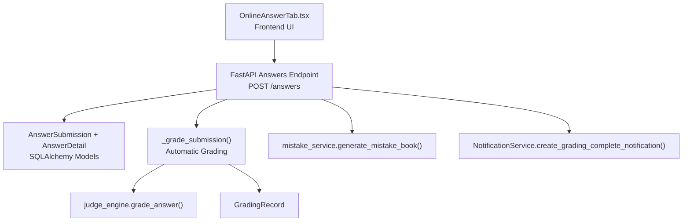
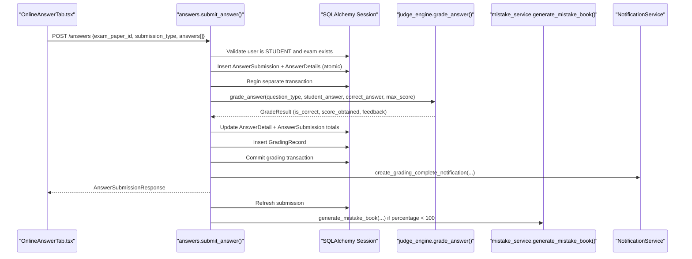
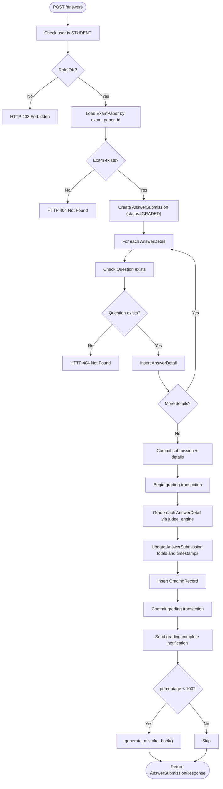
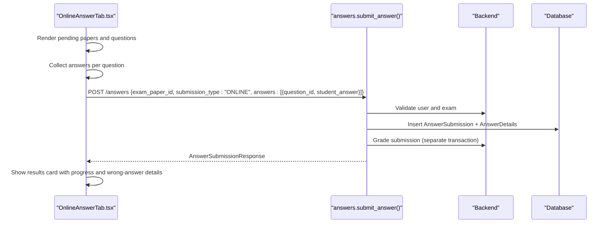
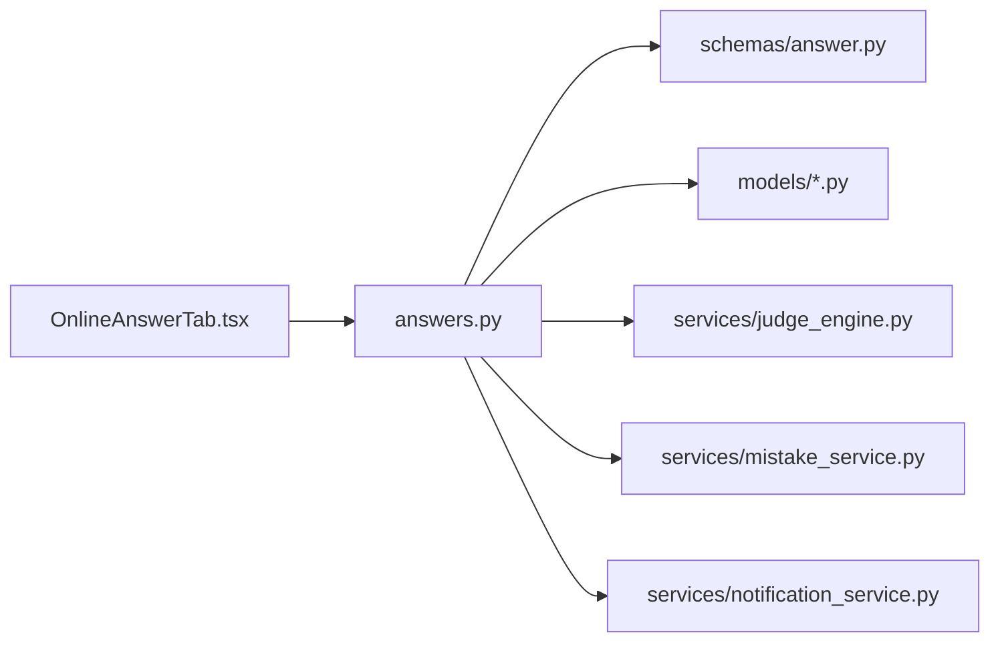

# Online Answer Submission

<cite>
**Referenced Files in This Document**
- [backend/app/api/v1/endpoints/answers.py](file://backend/app/api/v1/endpoints/answers.py)
- [backend/app/schemas/answer.py](file://backend/app/schemas/answer.py)
- [backend/app/models/answer_submission.py](file://backend/app/models/answer_submission.py)
- [backend/app/models/answer_detail.py](file://backend/app/models/answer_detail.py)
- [backend/app/models/exam_paper.py](file://backend/app/models/exam_paper.py)
- [backend/app/models/question.py](file://backend/app/models/question.py)
- [backend/app/models/grading_record.py](file://backend/app/models/grading_record.py)
- [backend/app/services/judge_engine.py](file://backend/app/services/judge_engine.py)
- [backend/app/services/mistake_service.py](file://backend/app/services/mistake_service.py)
- [backend/app/api/v1/api.py](file://backend/app/api/v1/api.py)
- [frontend/src/pages/exam-mistakes/OnlineAnswerTab.tsx](file://frontend/src/pages/exam-mistakes/OnlineAnswerTab.tsx)
- [docs/database-design.md](file://docs/database-design.md)
</cite>

## Table of Contents
1. [Introduction](#introduction)
2. [Project Structure](#project-structure)
3. [Core Components](#core-components)
4. [Architecture Overview](#architecture-overview)
5. [Detailed Component Analysis](#detailed-component-analysis)
6. [Dependency Analysis](#dependency-analysis)
7. [Performance Considerations](#performance-considerations)
8. [Troubleshooting Guide](#troubleshooting-guide)
9. [Conclusion](#conclusion)
10. [Appendices](#appendices)

## Introduction
This document describes the end-to-end online answer submission system. It covers the workflow from selecting an exam paper to submitting answers, validating inputs, persisting submissions atomically, performing automatic grading, generating mistake books, and notifying users. It also documents the frontend OnlineAnswerTab interface for real-time answer-taking, form validation, and submission handling.

## Project Structure
The system spans backend FastAPI endpoints, Pydantic schemas, SQLAlchemy models, and a React frontend page. The backend orchestrates submission creation, validation, grading, and follow-up actions. The frontend provides a guided exam-taking experience and displays results.

**Diagram sources**
- [backend/app/api/v1/endpoints/answers.py:115-197](file://backend/app/api/v1/endpoints/answers.py#L115-L197)
- [backend/app/services/judge_engine.py:126-130](file://backend/app/services/judge_engine.py#L126-L130)
- [backend/app/models/grading_record.py:1-31](file://backend/app/models/grading_record.py#L1-L31)
- [backend/app/services/mistake_service.py:13-76](file://backend/app/services/mistake_service.py#L13-L76)

**Section sources**
- [backend/app/api/v1/api.py:16-16](file://backend/app/api/v1/api.py#L16-L16)
- [frontend/src/pages/exam-mistakes/OnlineAnswerTab.tsx:1-317](file://frontend/src/pages/exam-mistakes/OnlineAnswerTab.tsx#L1-L317)

## Core Components
- AnswerSubmissionCreate: Request schema for creating a submission with exam_paper_id, submission_type, and a list of AnswerDetailCreate entries.
- AnswerSubmissionResponse: Response model including submission metadata, totals, and embedded AnswerDetailResponse items.
- AnswerDetail handling: Per-question student answers stored in AnswerDetail with optional correctness, score, and feedback.
- Validation pipeline: Checks user role, exam existence, and question existence before persisting.
- Automatic grading: Executes rule-based grading via judge_engine and records outcomes in GradingRecord.
- Mistake book integration: Generates an Error Notebook for wrong answers when percentage is below perfect.
- Notifications: Sends “Grading Complete” notifications upon completion.

**Section sources**
- [backend/app/schemas/answer.py:15-50](file://backend/app/schemas/answer.py#L15-L50)
- [backend/app/models/answer_submission.py:9-37](file://backend/app/models/answer_submission.py#L9-L37)
- [backend/app/models/answer_detail.py:9-33](file://backend/app/models/answer_detail.py#L9-L33)
- [backend/app/models/grading_record.py:8-31](file://backend/app/models/grading_record.py#L8-L31)

## Architecture Overview
The submission workflow is a single endpoint POST /answers that:
- Validates the caller is a student.
- Ensures the exam paper exists.
- Creates AnswerSubmission and AnswerDetail rows in a single atomic transaction.
- Immediately grades the submission in a separate transaction to keep results consistent.
- Triggers notifications and optional mistake book generation based on results.

**Diagram sources**
- [backend/app/api/v1/endpoints/answers.py:115-197](file://backend/app/api/v1/endpoints/answers.py#L115-L197)
- [backend/app/services/judge_engine.py:126-130](file://backend/app/services/judge_engine.py#L126-L130)
- [backend/app/services/mistake_service.py:13-76](file://backend/app/services/mistake_service.py#L13-L76)

## Detailed Component Analysis

### Backend API: Submit Answer Workflow
- Authentication and authorization: Only STUDENT users can submit; forbidden otherwise.
- Exam existence check: ExamPaper must exist.
- Submission creation: AnswerSubmission created with status set to GRADED initially.
- AnswerDetail insertion: Each AnswerDetail is validated against Question existence.
- Atomic persistence: Submission and details committed together.
- Immediate grading: Runs in a separate transaction to compute scores, correctness, and feedback; persists GradingRecord.
- Notifications: On success, creates a “Grading Complete” notification.
- Mistake book: If percentage is less than 100, generates an Error Notebook.

**Diagram sources**
- [backend/app/api/v1/endpoints/answers.py:115-197](file://backend/app/api/v1/endpoints/answers.py#L115-L197)
- [backend/app/services/judge_engine.py:126-130](file://backend/app/services/judge_engine.py#L126-L130)
- [backend/app/services/mistake_service.py:13-76](file://backend/app/services/mistake_service.py#L13-L76)

**Section sources**
- [backend/app/api/v1/endpoints/answers.py:115-197](file://backend/app/api/v1/endpoints/answers.py#L115-L197)

### Schemas: AnswerSubmissionCreate and AnswerSubmissionResponse
- AnswerSubmissionCreate: exam_paper_id, submission_type (ONLINE or OCR), status (optional), and answers list of AnswerDetailCreate.
- AnswerSubmissionResponse: Includes id, student_id, submitted_at, graded_at, total_score, percentage, and answers list of AnswerDetailResponse.

Validation highlights:
- submission_type constrained to ONLINE or OCR.
- status constrained to GRADED, GENERATED, or RE_GRADED.
- score_obtained non-negative.

**Section sources**
- [backend/app/schemas/answer.py:15-50](file://backend/app/schemas/answer.py#L15-L50)

### Models: AnswerSubmission, AnswerDetail, GradingRecord
- AnswerSubmission: Links student, exam paper, submission metadata, and computed totals.
- AnswerDetail: Per-question answer with correctness, score, feedback, and unique constraint on (answer_submission_id, question_id).
- GradingRecord: Audit trail for grading runs with model info, status, and details.

Constraints and relationships:
- AnswerSubmission.status constrained to specific values.
- AnswerDetail.score_obtained non-negative and unique per submission-question pair.
- AnswerSubmission.answers relationship to AnswerDetail.

**Section sources**
- [backend/app/models/answer_submission.py:9-37](file://backend/app/models/answer_submission.py#L9-L37)
- [backend/app/models/answer_detail.py:9-33](file://backend/app/models/answer_detail.py#L9-L33)
- [backend/app/models/grading_record.py:8-31](file://backend/app/models/grading_record.py#L8-L31)

### Grading Engine Integration
- grade_answer delegates to specialized graders based on question_type.
- Supports SINGLE_CHOICE, MULTIPLE_CHOICE, FILL_BLANK, SUBJECTIVE.
- Returns GradeResult with is_correct, score_obtained, max_score, and feedback.
- Uses correct_answer JSON parsing; supports legacy plain-text fallback.

**Section sources**
- [backend/app/services/judge_engine.py:126-130](file://backend/app/services/judge_engine.py#L126-L130)

### Mistake Book Generation
- Filters AnswerDetail for incorrect answers per student and optional exam scope.
- Deduplicates by question_id and fetches Question metadata.
- Creates ErrorNotebook and ErrorNotebookQuestion entries.
- Classifies error types based on question type and scores.

**Section sources**
- [backend/app/services/mistake_service.py:13-76](file://backend/app/services/mistake_service.py#L13-L76)

### Frontend: OnlineAnswerTab Interface
- Loads published exam papers and filters out already-submitted ones.
- Presents a question-by-question interface supporting SINGLE_CHOICE/MULTIPLE_CHOICE and TEXT answers.
- Validates completeness before submission.
- Submits to POST /answers with submission_type ONLINE.
- Displays results including total score, percentage, and wrong-answer details with feedback.

**Diagram sources**
- [frontend/src/pages/exam-mistakes/OnlineAnswerTab.tsx:64-84](file://frontend/src/pages/exam-mistakes/OnlineAnswerTab.tsx#L64-L84)
- [backend/app/api/v1/endpoints/answers.py:115-197](file://backend/app/api/v1/endpoints/answers.py#L115-L197)

**Section sources**
- [frontend/src/pages/exam-mistakes/OnlineAnswerTab.tsx:1-317](file://frontend/src/pages/exam-mistakes/OnlineAnswerTab.tsx#L1-L317)

## Dependency Analysis
- API depends on:
  - Pydantic schemas for request/response validation.
  - SQLAlchemy models for persistence.
  - judge_engine for scoring.
  - mistake_service for follow-up.
  - NotificationService for user communication.
- Models define foreign keys and constraints ensuring referential integrity.
- Frontend depends on backend endpoints for data and submission.

**Diagram sources**
- [backend/app/api/v1/endpoints/answers.py:1-21](file://backend/app/api/v1/endpoints/answers.py#L1-L21)
- [backend/app/schemas/answer.py:1-50](file://backend/app/schemas/answer.py#L1-L50)
- [backend/app/models/answer_submission.py:1-37](file://backend/app/models/answer_submission.py#L1-L37)
- [backend/app/models/answer_detail.py:1-33](file://backend/app/models/answer_detail.py#L1-L33)
- [backend/app/services/judge_engine.py:1-130](file://backend/app/services/judge_engine.py#L1-L130)
- [backend/app/services/mistake_service.py:1-114](file://backend/app/services/mistake_service.py#L1-L114)
- [frontend/src/pages/exam-mistakes/OnlineAnswerTab.tsx:1-317](file://frontend/src/pages/exam-mistakes/OnlineAnswerTab.tsx#L1-L317)

**Section sources**
- [backend/app/api/v1/endpoints/answers.py:1-21](file://backend/app/api/v1/endpoints/answers.py#L1-L21)
- [backend/app/api/v1/api.py:16-16](file://backend/app/api/v1/api.py#L16-L16)

## Performance Considerations
- Atomic submission: Single commit for AnswerSubmission and AnswerDetails ensures consistency and reduces partial writes.
- Separate grading transaction: Prevents long-running locks on the main submission transaction.
- Indexes and constraints: Composite indexes on (student_id, exam_paper_id) and unique constraints on (answer_submission_id, question_id) support efficient queries and integrity.
- Partitioning strategy: Monthly partitioning for answer_submissions and grading_records can improve large-scale query performance.

**Section sources**
- [docs/database-design.md:477-498](file://docs/database-design.md#L477-L498)

## Troubleshooting Guide
Common failure modes and handling:
- Unauthorized user: Student-only submissions enforced; returns 403.
- Exam not found: Returns 404 when exam_paper_id invalid.
- Question not found: Returns 404 for missing question_id during detail insertion.
- Submission errors: Wrapped and logged; returns 500 with error detail.
- Grading failures: Logged; grading record captures error; submission remains persisted.
- Mistake book generation failures: Logged; does not block submission response.

Operational checks:
- Verify exam paper status and questions association.
- Confirm question correctness data (correct_answer JSON) for rule-based grading.
- Review GradingRecord for detailed audit trail on failures.

**Section sources**
- [backend/app/api/v1/endpoints/answers.py:122-196](file://backend/app/api/v1/endpoints/answers.py#L122-L196)
- [backend/app/models/grading_record.py:8-31](file://backend/app/models/grading_record.py#L8-L31)

## Conclusion
The online answer submission system integrates a robust backend workflow with immediate automatic grading, mistake book generation, and user notifications. The frontend provides a streamlined exam-taking experience with real-time validation and results display. The design emphasizes atomic persistence, clear constraints, and extensible scoring logic.

## Appendices

### Example Requests and Responses
- Submission request body (POST /answers):
  - exam_paper_id: UUID
  - submission_type: "ONLINE"
  - answers: [{ question_id: UUID, student_answer: string }]

- Response body (AnswerSubmissionResponse):
  - id: UUID
  - student_id: UUID
  - exam_paper_id: UUID
  - submission_type: "ONLINE"
  - status: "GRADED"
  - submitted_at: datetime
  - graded_at: datetime
  - total_score: number
  - percentage: number
  - answers: [AnswerDetailResponse...]

- Error response (HTTP 4xx/5xx):
  - detail: string

**Section sources**
- [backend/app/schemas/answer.py:35-50](file://backend/app/schemas/answer.py#L35-L50)
- [backend/app/api/v1/endpoints/answers.py:115-197](file://backend/app/api/v1/endpoints/answers.py#L115-L197)