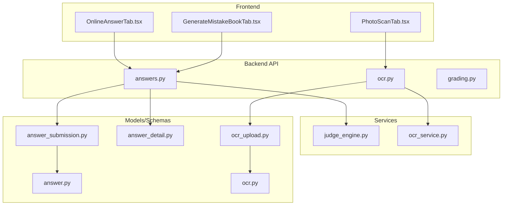
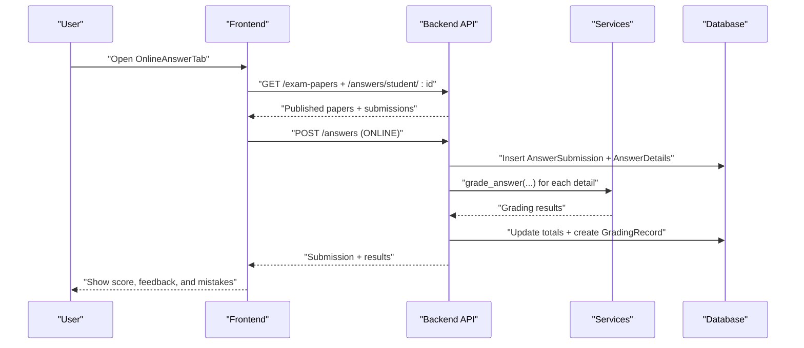
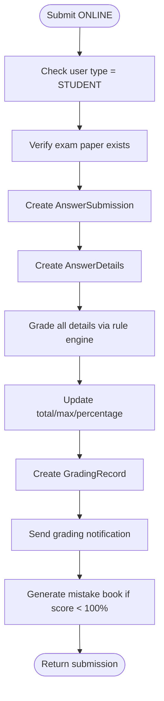
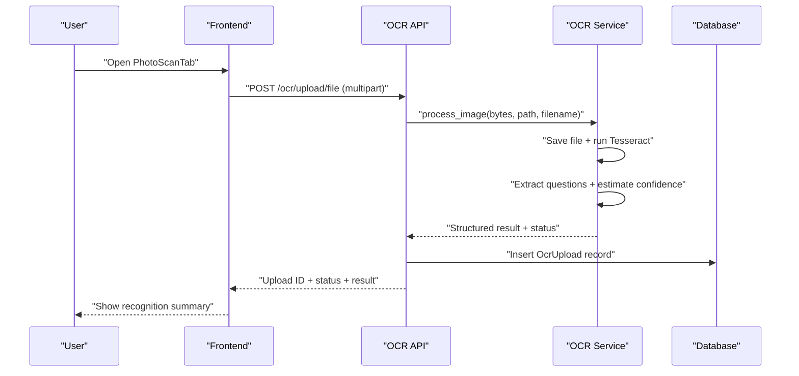
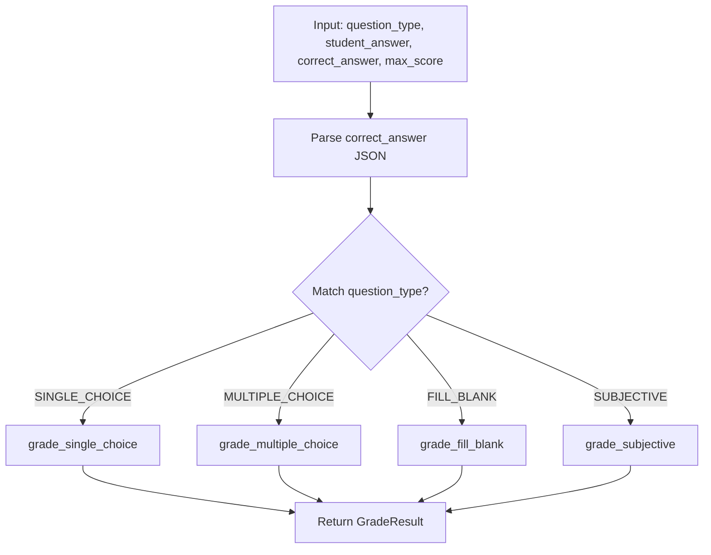
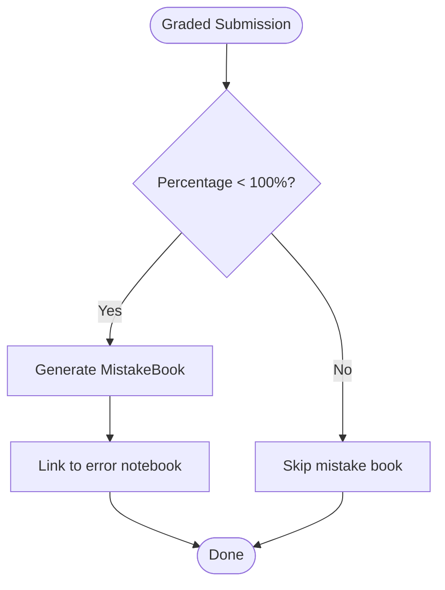
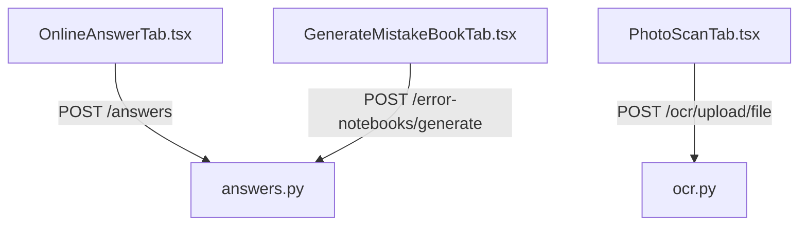
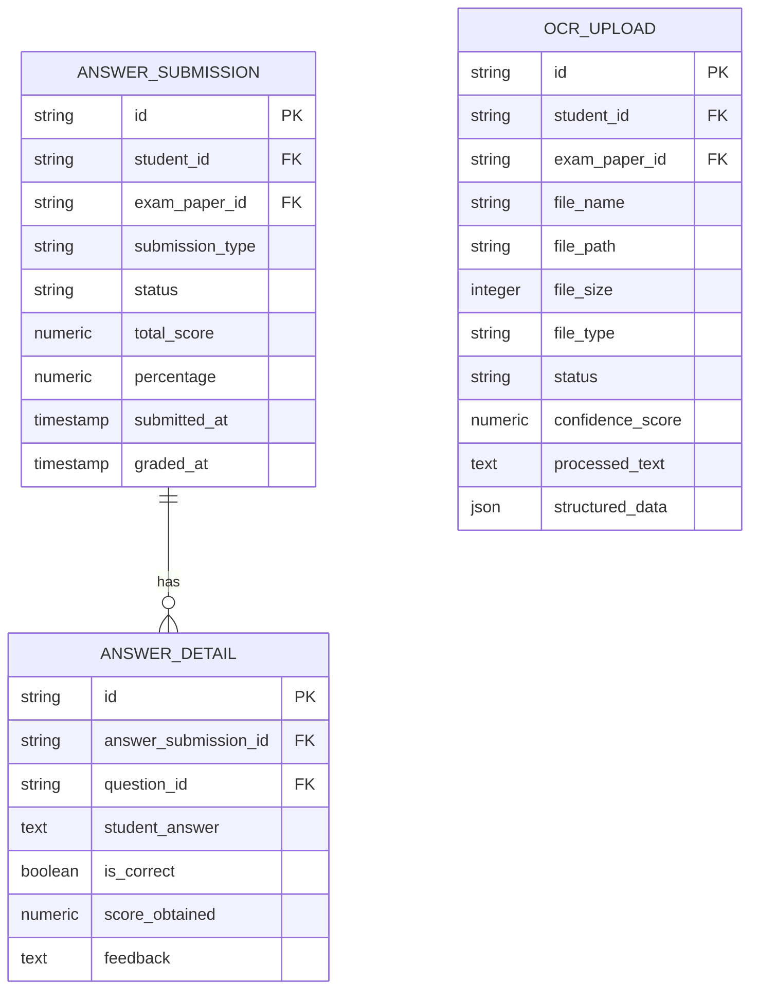

# Student Assessment

<cite>
**Referenced Files in This Document**
- [answers.py](file://backend/app/api/v1/endpoints/answers.py)
- [ocr.py](file://backend/app/api/v1/endpoints/ocr.py)
- [grading.py](file://backend/app/api/v1/endpoints/grading.py)
- [ocr_service.py](file://backend/app/services/ocr_service.py)
- [judge_engine.py](file://backend/app/services/judge_engine.py)
- [answer_submission.py](file://backend/app/models/answer_submission.py)
- [answer_detail.py](file://backend/app/models/answer_detail.py)
- [ocr_upload.py](file://backend/app/models/ocr_upload.py)
- [answer.py](file://backend/app/schemas/answer.py)
- [ocr.py](file://backend/app/schemas/ocr.py)
- [OnlineAnswerTab.tsx](file://frontend/src/pages/exam-mistakes/OnlineAnswerTab.tsx)
- [PhotoScanTab.tsx](file://frontend/src/pages/exam-mistakes/PhotoScanTab.tsx)
- [GenerateMistakeBookTab.tsx](file://frontend/src/pages/exam-mistakes/GenerateMistakeBookTab.tsx)
- [001_v22_initial.py](file://backend/alembic/versions/001_v22_initial.py)
- [005_add_ocr_needs_review_status.py](file://backend/alembic/versions/005_add_ocr_needs_review_status.py)
</cite>

## Table of Contents
1. [Introduction](#introduction)
2. [Project Structure](#project-structure)
3. [Core Components](#core-components)
4. [Architecture Overview](#architecture-overview)
5. [Detailed Component Analysis](#detailed-component-analysis)
6. [Dependency Analysis](#dependency-analysis)
7. [Performance Considerations](#performance-considerations)
8. [Troubleshooting Guide](#troubleshooting-guide)
9. [Conclusion](#conclusion)
10. [Appendices](#appendices)

## Introduction
This document describes the student assessment system covering:
- Online answer submission and real-time validation
- OCR processing for scanned answer sheets
- Automated grading engine and manual review pathways
- Integration between online and photo scanning modes
- Quality assurance and fallback mechanisms
- Frontend interfaces for taking answers, uploading photos, and viewing results

The system supports two submission modes:
- ONLINE: Students answer directly in the browser
- OCR: Students upload scanned answer sheets; OCR extracts text and structures questions for automated grading

Automated grading uses a rule-based engine supporting multiple question types and integrates with manual review when needed.

## Project Structure
The system comprises:
- Backend API and services (FastAPI, SQLAlchemy, Alembic migrations)
- Frontend React application with Ant Design
- Data models for assessments, OCR uploads, and grading records
- Schemas for request/response validation



**Diagram sources**
- [OnlineAnswerTab.tsx](file://frontend/src/pages/exam-mistakes/OnlineAnswerTab.tsx)
- [PhotoScanTab.tsx](file://frontend/src/pages/exam-mistakes/PhotoScanTab.tsx)
- [GenerateMistakeBookTab.tsx](file://frontend/src/pages/exam-mistakes/GenerateMistakeBookTab.tsx)
- [answers.py](file://backend/app/api/v1/endpoints/answers.py)
- [ocr.py](file://backend/app/api/v1/endpoints/ocr.py)
- [grading.py](file://backend/app/api/v1/endpoints/grading.py)
- [judge_engine.py](file://backend/app/services/judge_engine.py)
- [ocr_service.py](file://backend/app/services/ocr_service.py)
- [answer_submission.py](file://backend/app/models/answer_submission.py)
- [answer_detail.py](file://backend/app/models/answer_detail.py)
- [ocr_upload.py](file://backend/app/models/ocr_upload.py)
- [answer.py](file://backend/app/schemas/answer.py)
- [ocr.py](file://backend/app/schemas/ocr.py)

**Section sources**
- [answers.py](file://backend/app/api/v1/endpoints/answers.py)
- [ocr.py](file://backend/app/api/v1/endpoints/ocr.py)
- [grading.py](file://backend/app/api/v1/endpoints/grading.py)
- [OnlineAnswerTab.tsx](file://frontend/src/pages/exam-mistakes/OnlineAnswerTab.tsx)
- [PhotoScanTab.tsx](file://frontend/src/pages/exam-mistakes/PhotoScanTab.tsx)
- [GenerateMistakeBookTab.tsx](file://frontend/src/pages/exam-mistakes/GenerateMistakeBookTab.tsx)

## Core Components
- Online answer submission endpoint validates ownership and writes AnswerSubmission and AnswerDetail entries, then immediately grades via the rule engine and optionally generates a mistake book.
- OCR upload endpoint accepts multipart images, runs OCR, stores structured results, and marks status as NEEDS_REVIEW when confidence is low.
- Grading endpoint orchestrates manual grading workflows and records grading history.
- Rule-based grading engine evaluates SINGLE_CHOICE, MULTIPLE_CHOICE, FILL_BLANK, SUBJECTIVE questions with configurable scoring and feedback.
- Frontend tabs provide:
  - OnlineAnswerTab: browse published papers, take tests, submit, and view results
  - PhotoScanTab: upload scanned answer sheets, preview recognition results
  - GenerateMistakeBookTab: generate printed mistake books

**Section sources**
- [answers.py](file://backend/app/api/v1/endpoints/answers.py)
- [ocr.py](file://backend/app/api/v1/endpoints/ocr.py)
- [grading.py](file://backend/app/api/v1/endpoints/grading.py)
- [judge_engine.py](file://backend/app/services/judge_engine.py)
- [ocr_service.py](file://backend/app/services/ocr_service.py)
- [OnlineAnswerTab.tsx](file://frontend/src/pages/exam-mistakes/OnlineAnswerTab.tsx)
- [PhotoScanTab.tsx](file://frontend/src/pages/exam-mistakes/PhotoScanTab.tsx)
- [GenerateMistakeBookTab.tsx](file://frontend/src/pages/exam-mistakes/GenerateMistakeBookTab.tsx)

## Architecture Overview
The system integrates frontend UI with backend APIs and services. Online submissions are auto-graded; OCR uploads trigger OCR processing and may require manual review.



**Diagram sources**
- [answers.py](file://backend/app/api/v1/endpoints/answers.py)
- [judge_engine.py](file://backend/app/services/judge_engine.py)
- [answer_submission.py](file://backend/app/models/answer_submission.py)
- [answer_detail.py](file://backend/app/models/answer_detail.py)

## Detailed Component Analysis

### Online Answer Submission Workflow
- Validation: Only STUDENT users can submit; ensures exam paper exists.
- Persistence: Creates AnswerSubmission and AnswerDetails in a single transaction.
- Immediate grading: Calls internal grading routine to compute scores and feedback.
- Notifications: Sends grading completion notification.
- Mistake book: Auto-generates a mistake book when score < 100%.



**Diagram sources**
- [answers.py](file://backend/app/api/v1/endpoints/answers.py)
- [answer_submission.py](file://backend/app/models/answer_submission.py)
- [answer_detail.py](file://backend/app/models/answer_detail.py)
- [judge_engine.py](file://backend/app/services/judge_engine.py)

**Section sources**
- [answers.py](file://backend/app/api/v1/endpoints/answers.py)
- [answer_submission.py](file://backend/app/models/answer_submission.py)
- [answer_detail.py](file://backend/app/models/answer_detail.py)
- [answer.py](file://backend/app/schemas/answer.py)

### OCR Processing Pipeline
- Upload: Accepts multipart image; saves to temporary path and runs OCR.
- OCR service: Uses Tesseract with chi_sim+eng; extracts questions heuristically; estimates confidence.
- Status: Marks NEEDS_REVIEW when confidence below threshold; otherwise COMPLETED.
- Storage: Stores structured data (questions, counts, confidence) and raw text.



**Diagram sources**
- [ocr.py](file://backend/app/api/v1/endpoints/ocr.py)
- [ocr_service.py](file://backend/app/services/ocr_service.py)
- [ocr_upload.py](file://backend/app/models/ocr_upload.py)
- [ocr.py](file://backend/app/schemas/ocr.py)
- [PhotoScanTab.tsx](file://frontend/src/pages/exam-mistakes/PhotoScanTab.tsx)

**Section sources**
- [ocr.py](file://backend/app/api/v1/endpoints/ocr.py)
- [ocr_service.py](file://backend/app/services/ocr_service.py)
- [ocr_upload.py](file://backend/app/models/ocr_upload.py)
- [ocr.py](file://backend/app/schemas/ocr.py)
- [PhotoScanTab.tsx](file://frontend/src/pages/exam-mistakes/PhotoScanTab.tsx)

### Automated Grading Engine
- Supports question types: SINGLE_CHOICE, MULTIPLE_CHOICE, FILL_BLANK, SUBJECTIVE.
- Scoring:
  - SINGLE_CHOICE: Full credit for exact match, zero otherwise.
  - MULTIPLE_CHOICE: Partial credit based on intersection over expected set.
  - FILL_BLANK: Exact or acceptable answers; multi-blank mode supported.
  - SUBJECTIVE: Keyword matching with feedback; may require manual review.
- Feedback: Human-readable messages indicating correctness and rationale.



**Diagram sources**
- [judge_engine.py](file://backend/app/services/judge_engine.py)

**Section sources**
- [judge_engine.py](file://backend/app/services/judge_engine.py)

### Manual Review and Mistake Book Generation
- Manual review: OCR results marked NEEDS_REVIEW can be reviewed and corrected by teachers/admins.
- Mistake book: Automatically generated when a submission’s percentage is below 100%, aggregating incorrect answers for targeted practice.



**Diagram sources**
- [answers.py](file://backend/app/api/v1/endpoints/answers.py)
- [grading.py](file://backend/app/api/v1/endpoints/grading.py)

**Section sources**
- [answers.py](file://backend/app/api/v1/endpoints/answers.py)
- [grading.py](file://backend/app/api/v1/endpoints/grading.py)
- [GenerateMistakeBookTab.tsx](file://frontend/src/pages/exam-mistakes/GenerateMistakeBookTab.tsx)

### Frontend Interfaces
- OnlineAnswerTab: Lists published papers, allows selecting and answering questions, submits ONLINE, and displays results with progress and wrong-answer details.
- PhotoScanTab: Allows uploading scanned answer sheets, previews the image, and shows OCR recognition results.
- GenerateMistakeBookTab: Generates printable mistake books for selected papers or all submissions.



**Diagram sources**
- [OnlineAnswerTab.tsx](file://frontend/src/pages/exam-mistakes/OnlineAnswerTab.tsx)
- [PhotoScanTab.tsx](file://frontend/src/pages/exam-mistakes/PhotoScanTab.tsx)
- [GenerateMistakeBookTab.tsx](file://frontend/src/pages/exam-mistakes/GenerateMistakeBookTab.tsx)
- [answers.py](file://backend/app/api/v1/endpoints/answers.py)
- [ocr.py](file://backend/app/api/v1/endpoints/ocr.py)

**Section sources**
- [OnlineAnswerTab.tsx](file://frontend/src/pages/exam-mistakes/OnlineAnswerTab.tsx)
- [PhotoScanTab.tsx](file://frontend/src/pages/exam-mistakes/PhotoScanTab.tsx)
- [GenerateMistakeBookTab.tsx](file://frontend/src/pages/exam-mistakes/GenerateMistakeBookTab.tsx)

## Dependency Analysis
- Models define the data schema and constraints for submissions, details, OCR uploads, and grading records.
- Endpoints depend on services for OCR and grading.
- Frontend depends on backend endpoints for data and actions.

```mermaid
graph LR
AS["answer_submission.py"] <- --> AD["answer_detail.py"]
OU["ocr_upload.py"] -.-> AS
ANS["answers.py"] --> AS
ANS --> AD
OCR["ocr.py"] --> OU
GRADE["grading.py"] --> AS
GRADE --> AD
JUDGE["judge_engine.py"] --> AD
OCRSV["ocr_service.py"] --> OU
```

**Diagram sources**
- [answer_submission.py](file://backend/app/models/answer_submission.py)
- [answer_detail.py](file://backend/app/models/answer_detail.py)
- [ocr_upload.py](file://backend/app/models/ocr_upload.py)
- [answers.py](file://backend/app/api/v1/endpoints/answers.py)
- [ocr.py](file://backend/app/api/v1/endpoints/ocr.py)
- [grading.py](file://backend/app/api/v1/endpoints/grading.py)
- [judge_engine.py](file://backend/app/services/judge_engine.py)
- [ocr_service.py](file://backend/app/services/ocr_service.py)

**Section sources**
- [answer_submission.py](file://backend/app/models/answer_submission.py)
- [answer_detail.py](file://backend/app/models/answer_detail.py)
- [ocr_upload.py](file://backend/app/models/ocr_upload.py)
- [answers.py](file://backend/app/api/v1/endpoints/answers.py)
- [ocr.py](file://backend/app/api/v1/endpoints/ocr.py)
- [grading.py](file://backend/app/api/v1/endpoints/grading.py)
- [judge_engine.py](file://backend/app/services/judge_engine.py)
- [ocr_service.py](file://backend/app/services/ocr_service.py)

## Performance Considerations
- OCR confidence estimation reduces manual review workload; adjust thresholds to balance automation vs. accuracy.
- Rule-based grading is deterministic and fast; avoid heavy computations in grading logic.
- Frontend should debounce form submissions and avoid redundant network requests.
- Database constraints prevent invalid states; ensure migrations are applied to maintain integrity.

[No sources needed since this section provides general guidance]

## Troubleshooting Guide
Common issues and resolutions:
- OCR engine unavailable: Tesseract not installed; the service returns FAILED with installation guidance.
- Low OCR confidence: Status NEEDS_REVIEW; prompt manual verification and correction.
- Permission errors: Ensure STUDENT user type for submissions and appropriate roles for administrative endpoints.
- Submission locked: Once a mistake book is generated, edits/deletes are disallowed.

**Section sources**
- [ocr_service.py](file://backend/app/services/ocr_service.py)
- [ocr.py](file://backend/app/api/v1/endpoints/ocr.py)
- [answers.py](file://backend/app/api/v1/endpoints/answers.py)
- [005_add_ocr_needs_review_status.py](file://backend/alembic/versions/005_add_ocr_needs_review_status.py)

## Conclusion
The system provides a robust assessment pipeline integrating online and OCR-based answer capture, automated rule-based grading, and manual review capabilities. It offers real-time feedback, structured scoring, and mistake book generation to support learning improvement. The modular backend and intuitive frontend enable scalable deployment and maintenance.

[No sources needed since this section summarizes without analyzing specific files]

## Appendices

### Data Model Overview


**Diagram sources**
- [answer_submission.py](file://backend/app/models/answer_submission.py)
- [answer_detail.py](file://backend/app/models/answer_detail.py)
- [ocr_upload.py](file://backend/app/models/ocr_upload.py)
- [001_v22_initial.py](file://backend/alembic/versions/001_v22_initial.py)

### Example Workflows

- Online assessment workflow
  - Load published papers → Select paper → Render questions → Submit answers → Receive score and feedback → Auto-generate mistake book if applicable

- OCR assessment workflow
  - Choose subject/grade → Upload image → Wait for OCR processing → Review recognition results → Use structured data for grading

- Grading administration workflow
  - Start grading → Monitor status → Complete grading → View history and models

**Section sources**
- [OnlineAnswerTab.tsx](file://frontend/src/pages/exam-mistakes/OnlineAnswerTab.tsx)
- [PhotoScanTab.tsx](file://frontend/src/pages/exam-mistakes/PhotoScanTab.tsx)
- [answers.py](file://backend/app/api/v1/endpoints/answers.py)
- [ocr.py](file://backend/app/api/v1/endpoints/ocr.py)
- [grading.py](file://backend/app/api/v1/endpoints/grading.py)