# Class Management

<cite>
**Referenced Files in This Document**
- [backend/app/api/v1/endpoints/classes.py](file://backend/app/api/v1/endpoints/classes.py)
- [backend/app/models/school_class.py](file://backend/app/models/school_class.py)
- [backend/app/models/student.py](file://backend/app/models/student.py)
- [backend/app/models/admin.py](file://backend/app/models/admin.py)
- [backend/alembic/versions/001_v22_initial.py](file://backend/alembic/versions/001_v22_initial.py)
- [frontend/src/pages/teacher/TeacherClassesPage.tsx](file://frontend/src/pages/teacher/TeacherClassesPage.tsx)
- [frontend/src/hooks/useReferenceValues.ts](file://frontend/src/hooks/useReferenceValues.ts)
- [backend/app/api/v1/api.py](file://backend/app/api/v1/api.py)
</cite>

## Table of Contents
1. [Introduction](#introduction)
2. [Project Structure](#project-structure)
3. [Core Components](#core-components)
4. [Architecture Overview](#architecture-overview)
5. [Detailed Component Analysis](#detailed-component-analysis)
6. [Dependency Analysis](#dependency-analysis)
7. [Performance Considerations](#performance-considerations)
8. [Troubleshooting Guide](#troubleshooting-guide)
9. [Conclusion](#conclusion)
10. [Appendices](#appendices)

## Introduction
This document describes the class management system for teacher class administration, student enrollment, and course organization. It covers the class creation workflow, student roster management, and class assignment processes. It also explains the class hierarchy structure, grade level organization, and subject allocation features, along with class settings configuration, academic year management, and class status controls. The document details student registration procedures, class transfer processes, and enrollment validation, and outlines the frontend class management interface, bulk operations, and administrative controls. Finally, it provides examples of class setup workflows, student onboarding processes, and class maintenance procedures.

## Project Structure
The class management system spans backend API endpoints and models, and a teacher-focused frontend page. The backend exposes class and student management endpoints under a dedicated router, while the frontend provides a comprehensive UI for managing classes and student rosters.

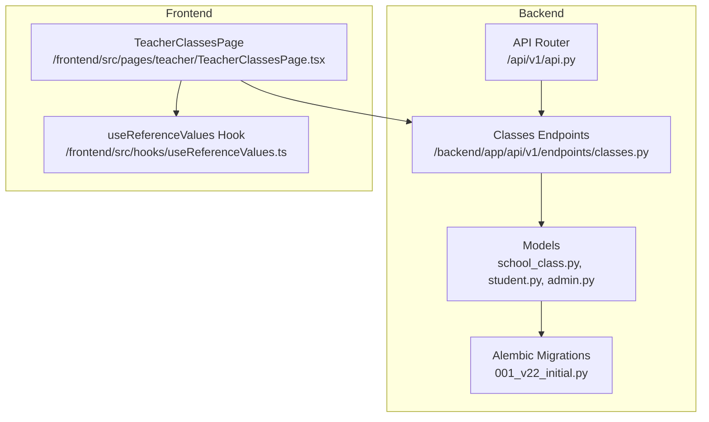

**Diagram sources**
- [backend/app/api/v1/api.py:1-26](file://backend/app/api/v1/api.py#L1-L26)
- [backend/app/api/v1/endpoints/classes.py:1-243](file://backend/app/api/v1/endpoints/classes.py#L1-L243)
- [backend/app/models/school_class.py:1-39](file://backend/app/models/school_class.py#L1-L39)
- [backend/app/models/student.py:1-23](file://backend/app/models/student.py#L1-L23)
- [backend/app/models/admin.py:1-27](file://backend/app/models/admin.py#L1-L27)
- [backend/alembic/versions/001_v22_initial.py:60-259](file://backend/alembic/versions/001_v22_initial.py#L60-L259)
- [frontend/src/pages/teacher/TeacherClassesPage.tsx:1-334](file://frontend/src/pages/teacher/TeacherClassesPage.tsx#L1-L334)
- [frontend/src/hooks/useReferenceValues.ts:1-84](file://frontend/src/hooks/useReferenceValues.ts#L1-L84)

**Section sources**
- [backend/app/api/v1/api.py:1-26](file://backend/app/api/v1/api.py#L1-L26)
- [backend/app/api/v1/endpoints/classes.py:1-243](file://backend/app/api/v1/endpoints/classes.py#L1-L243)
- [backend/app/models/school_class.py:1-39](file://backend/app/models/school_class.py#L1-L39)
- [backend/app/models/student.py:1-23](file://backend/app/models/student.py#L1-L23)
- [backend/app/models/admin.py:1-27](file://backend/app/models/admin.py#L1-L27)
- [backend/alembic/versions/001_v22_initial.py:60-259](file://backend/alembic/versions/001_v22_initial.py#L60-L259)
- [frontend/src/pages/teacher/TeacherClassesPage.tsx:1-334](file://frontend/src/pages/teacher/TeacherClassesPage.tsx#L1-L334)
- [frontend/src/hooks/useReferenceValues.ts:1-84](file://frontend/src/hooks/useReferenceValues.ts#L1-L84)

## Core Components
- Class model and associations
  - The class entity stores metadata such as name, subject, grade level, academic dates, and activation status. It is linked to an administrator (teacher) and maintains a many-to-many relationship with students via an association table.
- Student model
  - Students are represented with personal details and enrollment attributes, enabling class membership and dashboard analytics.
- Admin model
  - Administrators include teachers who own classes; the system distinguishes roles for access control.
- Backend endpoints
  - Provide CRUD for classes, listing classes with student counts, updating class settings, deleting classes, and managing student enrollments (add/remove/update).
- Frontend UI
  - Presents a teacher dashboard for creating/editing classes, searching, toggling activation, viewing student rosters, adding students from a library or by manual input, and editing student details.

**Section sources**
- [backend/app/models/school_class.py:7-39](file://backend/app/models/school_class.py#L7-L39)
- [backend/app/models/student.py:8-23](file://backend/app/models/student.py#L8-L23)
- [backend/app/models/admin.py:9-27](file://backend/app/models/admin.py#L9-L27)
- [backend/app/api/v1/endpoints/classes.py:16-243](file://backend/app/api/v1/endpoints/classes.py#L16-L243)
- [frontend/src/pages/teacher/TeacherClassesPage.tsx:9-334](file://frontend/src/pages/teacher/TeacherClassesPage.tsx#L9-L334)

## Architecture Overview
The system follows a layered architecture:
- Frontend (React) communicates with backend APIs.
- Backend API router aggregates endpoints for classes and student management.
- Models define the domain entities and relationships.
- Alembic migrations define the persistent schema.

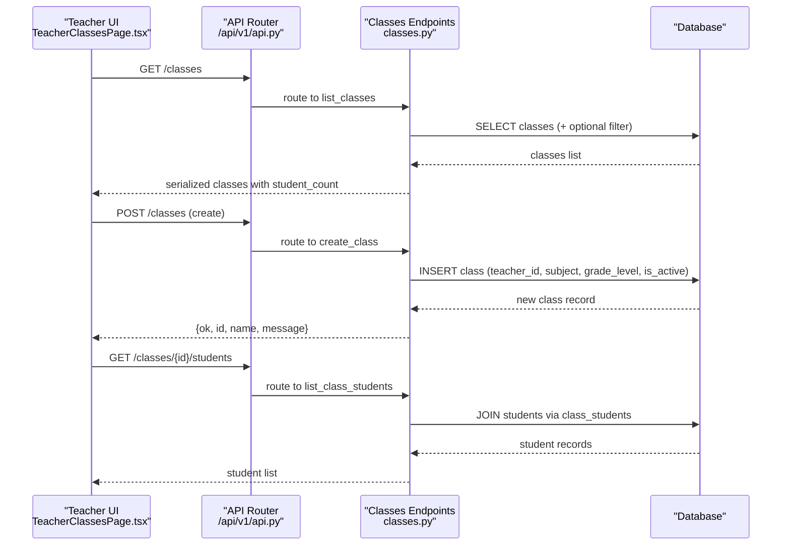

**Diagram sources**
- [frontend/src/pages/teacher/TeacherClassesPage.tsx:37-48](file://frontend/src/pages/teacher/TeacherClassesPage.tsx#L37-L48)
- [backend/app/api/v1/api.py:21](file://backend/app/api/v1/api.py#L21)
- [backend/app/api/v1/endpoints/classes.py:36-62](file://backend/app/api/v1/endpoints/classes.py#L36-L62)
- [backend/app/api/v1/endpoints/classes.py:16-33](file://backend/app/api/v1/endpoints/classes.py#L16-L33)
- [backend/app/api/v1/endpoints/classes.py:104-118](file://backend/app/api/v1/endpoints/classes.py#L104-L118)

## Detailed Component Analysis

### Class Model and Schema
The class model encapsulates class metadata and relationships:
- Identity and ownership: UUID primary key, foreign key to admin (teacher).
- Attributes: name, description, subject, grade level, academic dates, activation flag, timestamps.
- Association table: links classes to students with a join timestamp.

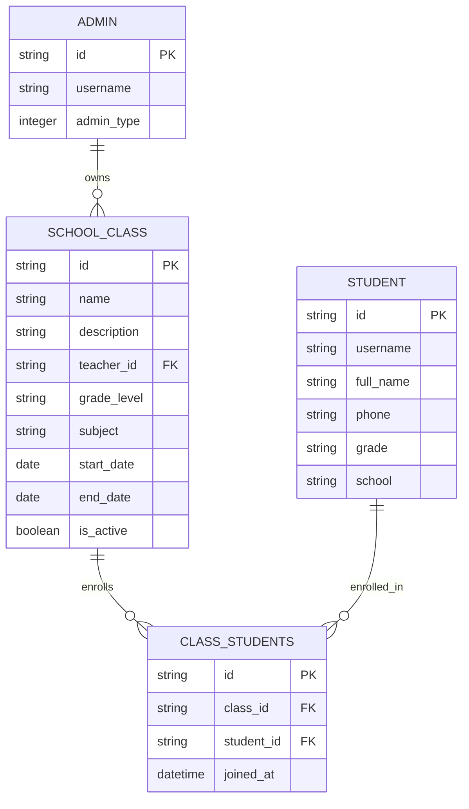

**Diagram sources**
- [backend/app/models/school_class.py:7-39](file://backend/app/models/school_class.py#L7-L39)
- [backend/app/models/admin.py:9-27](file://backend/app/models/admin.py#L9-L27)
- [backend/app/models/student.py:8-23](file://backend/app/models/student.py#L8-L23)
- [backend/alembic/versions/001_v22_initial.py:60-161](file://backend/alembic/versions/001_v22_initial.py#L60-L161)

**Section sources**
- [backend/app/models/school_class.py:7-39](file://backend/app/models/school_class.py#L7-L39)
- [backend/alembic/versions/001_v22_initial.py:60-161](file://backend/alembic/versions/001_v22_initial.py#L60-L161)

### Class CRUD Endpoints
- Create class
  - Requires TEACHER or SYS_ADMIN role.
  - Sets teacher_id from current user, allows configuring subject, grade level, description, and activation status.
- List classes
  - Teachers see only their owned classes; optional search by name.
  - Returns class metadata plus computed student_count.
- Update class
  - Supports partial updates to name, subject, grade level, description, and activation status.
- Delete class
  - Removes class memberships and class record.

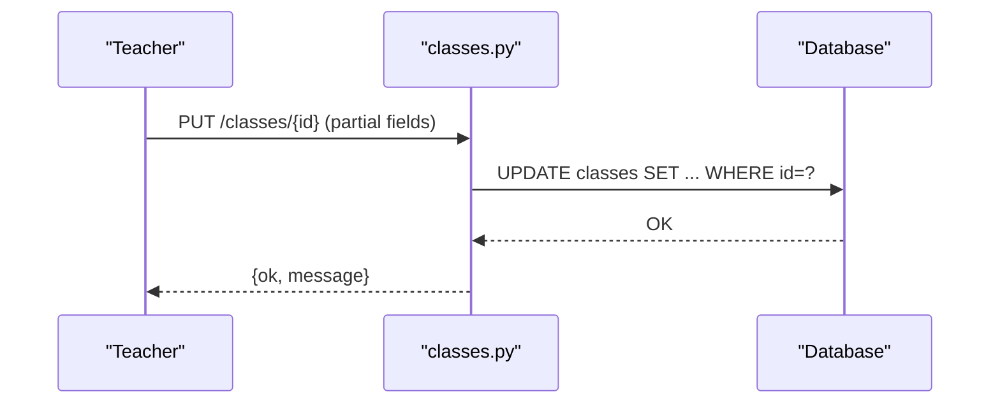

**Diagram sources**
- [backend/app/api/v1/endpoints/classes.py:65-84](file://backend/app/api/v1/endpoints/classes.py#L65-L84)

**Section sources**
- [backend/app/api/v1/endpoints/classes.py:16-33](file://backend/app/api/v1/endpoints/classes.py#L16-L33)
- [backend/app/api/v1/endpoints/classes.py:36-62](file://backend/app/api/v1/endpoints/classes.py#L36-L62)
- [backend/app/api/v1/endpoints/classes.py:65-84](file://backend/app/api/v1/endpoints/classes.py#L65-L84)
- [backend/app/api/v1/endpoints/classes.py:87-99](file://backend/app/api/v1/endpoints/classes.py#L87-L99)

### Student Enrollment Endpoints
- List enrolled students
  - Returns student details for a given class.
- List available students
  - Returns students not yet in the class, optionally filtered by search.
- Add student to class
  - Accepts either an existing student_id or creates a new student with provided details.
  - Prevents duplicate enrollments.
- Remove student from class
  - Deletes the enrollment association.
- Update student details
  - Allows editing non-phone fields for enrolled students.
- Get student detail
  - Retrieves a student’s profile.

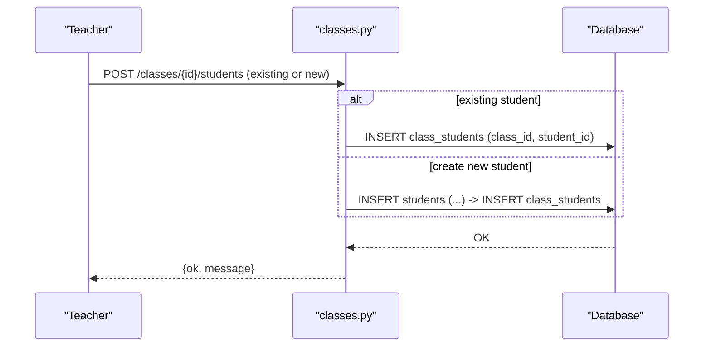

**Diagram sources**
- [backend/app/api/v1/endpoints/classes.py:143-189](file://backend/app/api/v1/endpoints/classes.py#L143-L189)

**Section sources**
- [backend/app/api/v1/endpoints/classes.py:104-118](file://backend/app/api/v1/endpoints/classes.py#L104-L118)
- [backend/app/api/v1/endpoints/classes.py:121-140](file://backend/app/api/v1/endpoints/classes.py#L121-L140)
- [backend/app/api/v1/endpoints/classes.py:143-189](file://backend/app/api/v1/endpoints/classes.py#L143-L189)
- [backend/app/api/v1/endpoints/classes.py:192-206](file://backend/app/api/v1/endpoints/classes.py#L192-L206)
- [backend/app/api/v1/endpoints/classes.py:211-229](file://backend/app/api/v1/endpoints/classes.py#L211-L229)
- [backend/app/api/v1/endpoints/classes.py:232-242](file://backend/app/api/v1/endpoints/classes.py#L232-L242)

### Frontend Class Management Interface
The teacher page provides:
- Class listing with search, activation toggle, and actions (manage students, edit, delete).
- Modal for creating/editing classes with fields for name, subject, grade level, description, and activation status.
- Student management modal:
  - Enrolled students table with edit and remove actions.
  - Tabs to add students:
    - Select from available students (searchable).
    - Manual entry to create a new student and enroll immediately.
- Edit student modal for updating non-phone details.

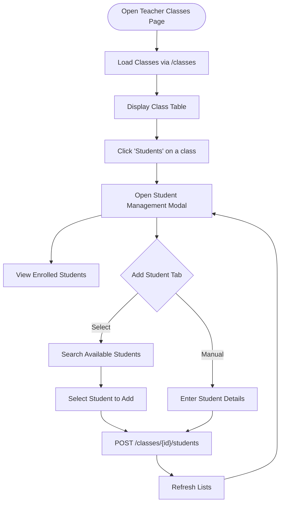

**Diagram sources**
- [frontend/src/pages/teacher/TeacherClassesPage.tsx:37-48](file://frontend/src/pages/teacher/TeacherClassesPage.tsx#L37-L48)
- [frontend/src/pages/teacher/TeacherClassesPage.tsx:80-92](file://frontend/src/pages/teacher/TeacherClassesPage.tsx#L80-L92)
- [frontend/src/pages/teacher/TeacherClassesPage.tsx:106-129](file://frontend/src/pages/teacher/TeacherClassesPage.tsx#L106-L129)
- [frontend/src/pages/teacher/TeacherClassesPage.tsx:139-159](file://frontend/src/pages/teacher/TeacherClassesPage.tsx#L139-L159)

**Section sources**
- [frontend/src/pages/teacher/TeacherClassesPage.tsx:9-334](file://frontend/src/pages/teacher/TeacherClassesPage.tsx#L9-L334)
- [frontend/src/hooks/useReferenceValues.ts:47-63](file://frontend/src/hooks/useReferenceValues.ts#L47-L63)

### Class Settings, Academic Year, and Status Controls
- Class settings
  - Name, subject, grade level, description, and activation status are configurable via the class modal.
- Academic year management
  - The schema includes start_date and end_date fields on the class entity, enabling academic year tracking per class.
- Class status controls
  - is_active toggles visibility and enrollment eligibility; endpoints support activation/deactivation.

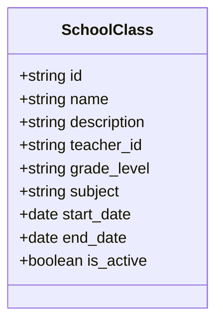

**Diagram sources**
- [backend/app/models/school_class.py:7-20](file://backend/app/models/school_class.py#L7-L20)
- [backend/alembic/versions/001_v22_initial.py:60-75](file://backend/alembic/versions/001_v22_initial.py#L60-L75)

**Section sources**
- [backend/app/models/school_class.py:14-18](file://backend/app/models/school_class.py#L14-L18)
- [backend/alembic/versions/001_v22_initial.py:68-71](file://backend/alembic/versions/001_v22_initial.py#L68-L71)

### Grade Level Organization and Subject Allocation
- Grade levels and subjects are surfaced to the UI via reference values.
- The frontend selects grade levels and subjects from reference data to populate dropdowns during class creation and editing.

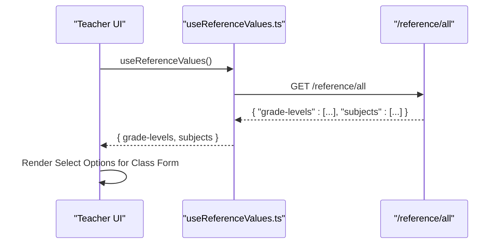

**Diagram sources**
- [frontend/src/hooks/useReferenceValues.ts:40-63](file://frontend/src/hooks/useReferenceValues.ts#L40-L63)
- [frontend/src/pages/teacher/TeacherClassesPage.tsx:215-225](file://frontend/src/pages/teacher/TeacherClassesPage.tsx#L215-L225)

**Section sources**
- [frontend/src/hooks/useReferenceValues.ts:13-22](file://frontend/src/hooks/useReferenceValues.ts#L13-L22)
- [frontend/src/pages/teacher/TeacherClassesPage.tsx:210-225](file://frontend/src/pages/teacher/TeacherClassesPage.tsx#L210-L225)

### Student Registration Procedures and Enrollment Validation
- Registration via existing student
  - Select a student from the available list and add to the class.
- Registration via manual entry
  - Fill in student details to create a new student and enroll immediately.
- Validation
  - Duplicate enrollment prevention is enforced by checking the association table before insertion.
  - Required fields for new student creation are validated by the endpoint.

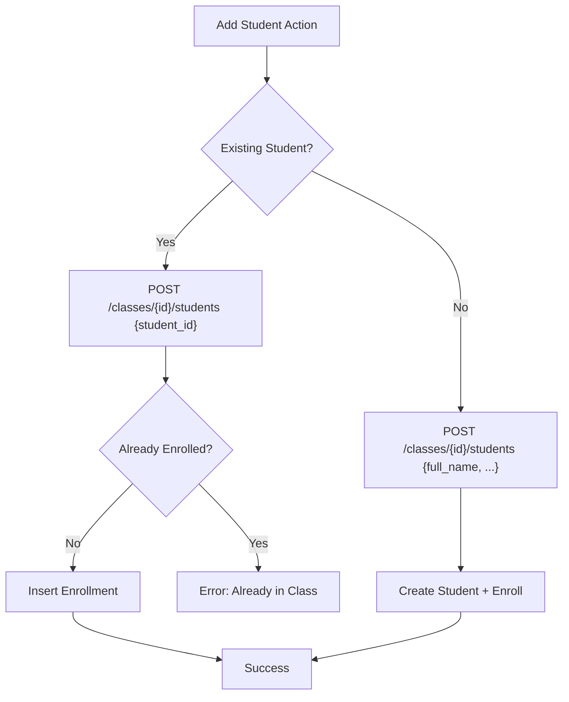

**Diagram sources**
- [backend/app/api/v1/endpoints/classes.py:143-189](file://backend/app/api/v1/endpoints/classes.py#L143-L189)

**Section sources**
- [backend/app/api/v1/endpoints/classes.py:143-189](file://backend/app/api/v1/endpoints/classes.py#L143-L189)

### Class Transfer Processes
- Current implementation supports removing a student from a class and enrolling them in another class via separate operations.
- There is no single endpoint to “transfer” a student between classes; administrators should remove the student from the current class and add them to the target class.

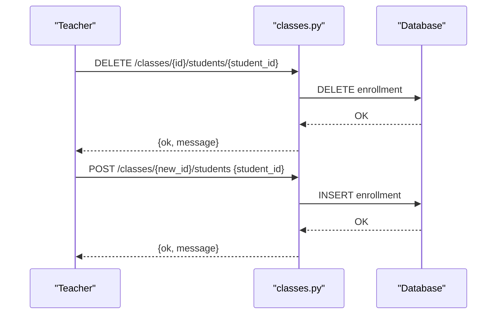

**Diagram sources**
- [backend/app/api/v1/endpoints/classes.py:192-206](file://backend/app/api/v1/endpoints/classes.py#L192-L206)
- [backend/app/api/v1/endpoints/classes.py:143-189](file://backend/app/api/v1/endpoints/classes.py#L143-L189)

**Section sources**
- [backend/app/api/v1/endpoints/classes.py:192-206](file://backend/app/api/v1/endpoints/classes.py#L192-L206)
- [backend/app/api/v1/endpoints/classes.py:143-189](file://backend/app/api/v1/endpoints/classes.py#L143-L189)

### Examples

#### Class Setup Workflow
- Open the teacher class management page.
- Click “New Class,” fill in name, subject, grade level, description, and activation status.
- Submit to create the class; the system assigns the current teacher as the owner.

**Section sources**
- [frontend/src/pages/teacher/TeacherClassesPage.tsx:51-73](file://frontend/src/pages/teacher/TeacherClassesPage.tsx#L51-L73)
- [backend/app/api/v1/endpoints/classes.py:16-33](file://backend/app/api/v1/endpoints/classes.py#L16-L33)

#### Student Onboarding Process
- From a class, click “Students.”
- Choose “From student library” and search/select a student, or choose “Direct entry” to create a new student.
- Confirm enrollment; the student appears in the class roster.

**Section sources**
- [frontend/src/pages/teacher/TeacherClassesPage.tsx:80-129](file://frontend/src/pages/teacher/TeacherClassesPage.tsx#L80-L129)
- [backend/app/api/v1/endpoints/classes.py:143-189](file://backend/app/api/v1/endpoints/classes.py#L143-L189)

#### Class Maintenance Procedure
- Toggle activation status to enable/disable enrollment.
- Update subject or grade level as needed.
- Remove students who leave the class; re-enroll later if necessary.

**Section sources**
- [frontend/src/pages/teacher/TeacherClassesPage.tsx:184-193](file://frontend/src/pages/teacher/TeacherClassesPage.tsx#L184-L193)
- [backend/app/api/v1/endpoints/classes.py:65-84](file://backend/app/api/v1/endpoints/classes.py#L65-L84)
- [backend/app/api/v1/endpoints/classes.py:192-206](file://backend/app/api/v1/endpoints/classes.py#L192-L206)

## Dependency Analysis
- API routing
  - The API router includes the classes endpoints under the /classes prefix.
- Endpoint-to-model relationships
  - Class endpoints depend on the SchoolClass model and the association table for student enrollment.
  - Student endpoints depend on the Student model.
- Frontend-to-backend contracts
  - The UI invokes endpoints for listing classes, creating/updating classes, listing/enrolling students, and editing student details.

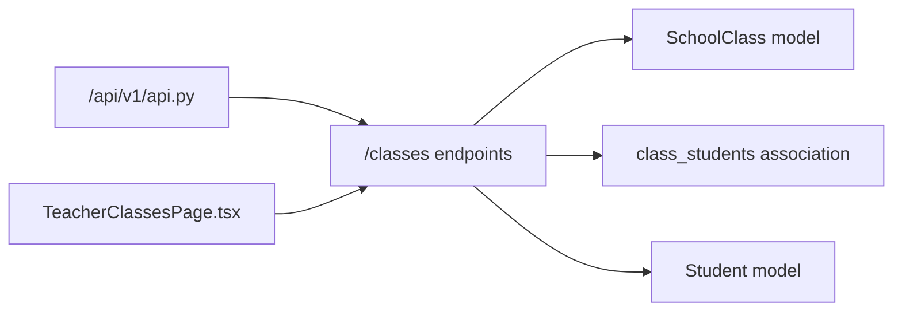

**Diagram sources**
- [backend/app/api/v1/api.py:21](file://backend/app/api/v1/api.py#L21)
- [backend/app/api/v1/endpoints/classes.py:7-8](file://backend/app/api/v1/endpoints/classes.py#L7-L8)
- [backend/app/models/school_class.py:31-39](file://backend/app/models/school_class.py#L31-L39)
- [backend/app/models/student.py:8-23](file://backend/app/models/student.py#L8-L23)
- [frontend/src/pages/teacher/TeacherClassesPage.tsx:4-5](file://frontend/src/pages/teacher/TeacherClassesPage.tsx#L4-L5)

**Section sources**
- [backend/app/api/v1/api.py:1-26](file://backend/app/api/v1/api.py#L1-L26)
- [backend/app/api/v1/endpoints/classes.py:1-11](file://backend/app/api/v1/endpoints/classes.py#L1-L11)
- [frontend/src/pages/teacher/TeacherClassesPage.tsx:1-10](file://frontend/src/pages/teacher/TeacherClassesPage.tsx#L1-L10)

## Performance Considerations
- Query efficiency
  - Listing classes computes student_count per class; consider caching or pre-aggregation for large datasets.
  - Available student queries use raw SQL with limits; ensure appropriate indexing on student search fields.
- Network requests
  - The UI performs separate requests for enrolled students and available students; batching or lazy-loading can improve responsiveness.
- Pagination
  - The shared pagination dependency exists but is not currently applied to class endpoints; consider adding pagination for large class or student lists.

[No sources needed since this section provides general guidance]

## Troubleshooting Guide
- Permission errors
  - Creating, updating, or deleting classes requires TEACHER or SYS_ADMIN roles; otherwise a 403 is returned.
- Not found errors
  - Operations on non-existent classes or students return 404.
- Duplicate enrollment
  - Attempting to enroll an already-enrolled student triggers a 400 error.
- Validation failures
  - Creating a new student without required details yields a 400 error.

**Section sources**
- [backend/app/api/v1/endpoints/classes.py:22-23](file://backend/app/api/v1/endpoints/classes.py#L22-L23)
- [backend/app/api/v1/endpoints/classes.py:77](file://backend/app/api/v1/endpoints/classes.py#L77)
- [backend/app/api/v1/endpoints/classes.py:163-164](file://backend/app/api/v1/endpoints/classes.py#L163-L164)
- [backend/app/api/v1/endpoints/classes.py:182-183](file://backend/app/api/v1/endpoints/classes.py#L182-L183)

## Conclusion
The class management system provides a robust foundation for teacher-led class administration, including class lifecycle management, student enrollment workflows, and UI-driven controls. The backend endpoints and models support essential operations with clear validation and role-based access. The frontend offers an intuitive interface for managing classes and student rosters, with room for enhancements such as pagination and improved bulk operations.

[No sources needed since this section summarizes without analyzing specific files]

## Appendices

### API Reference Summary
- Class CRUD
  - POST /classes
  - GET /classes
  - PUT /classes/{class_id}
  - DELETE /classes/{class_id}
- Student Management
  - GET /classes/{class_id}/students
  - GET /classes/{class_id}/available-students
  - POST /classes/{class_id}/students
  - PUT /classes/{class_id}/students/{student_id}
  - DELETE /classes/{class_id}/students/{student_id}
  - GET /classes/{class_id}/students/{student_id}

**Section sources**
- [backend/app/api/v1/endpoints/classes.py:16-243](file://backend/app/api/v1/endpoints/classes.py#L16-L243)