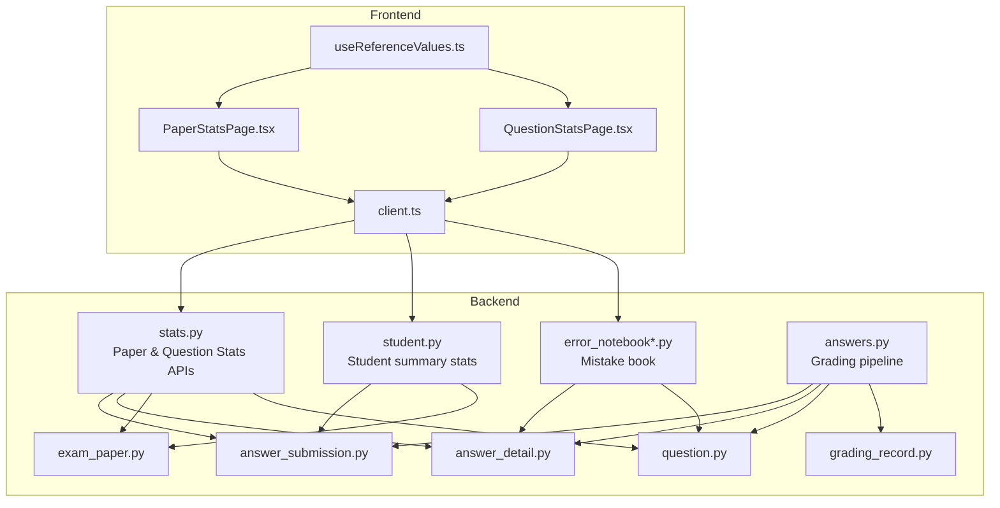
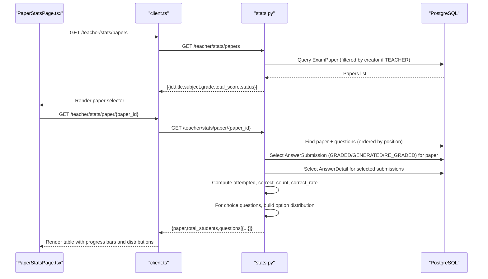
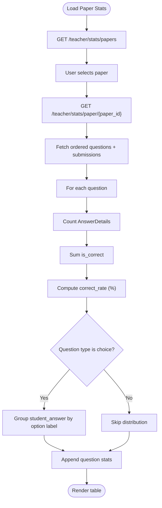
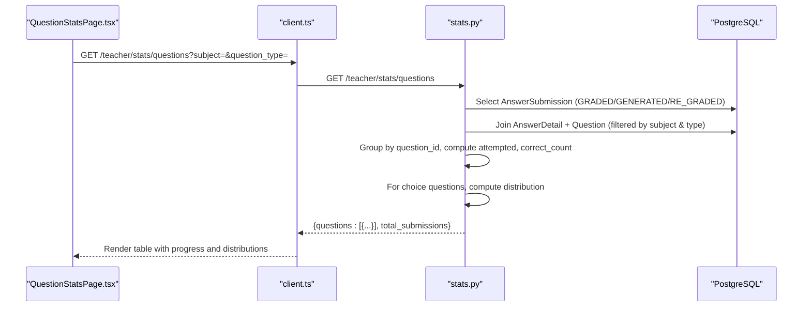
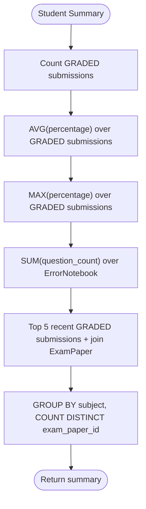
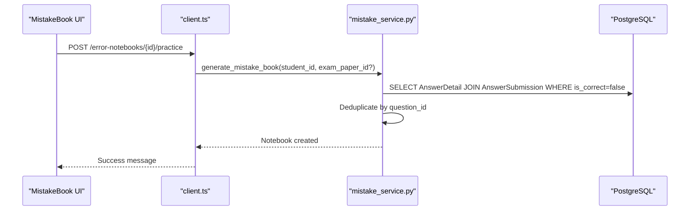
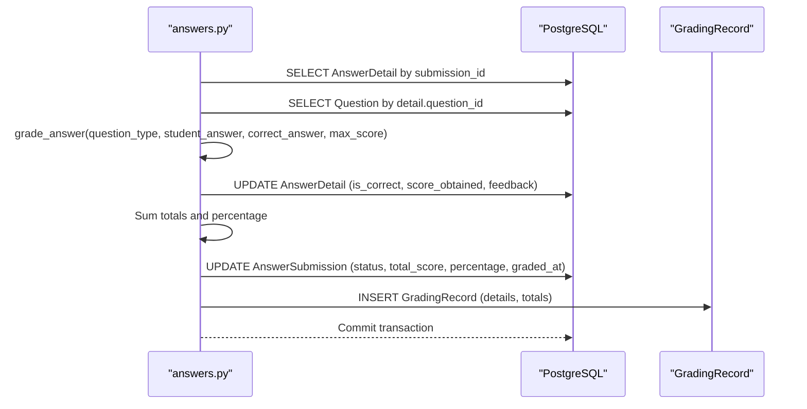
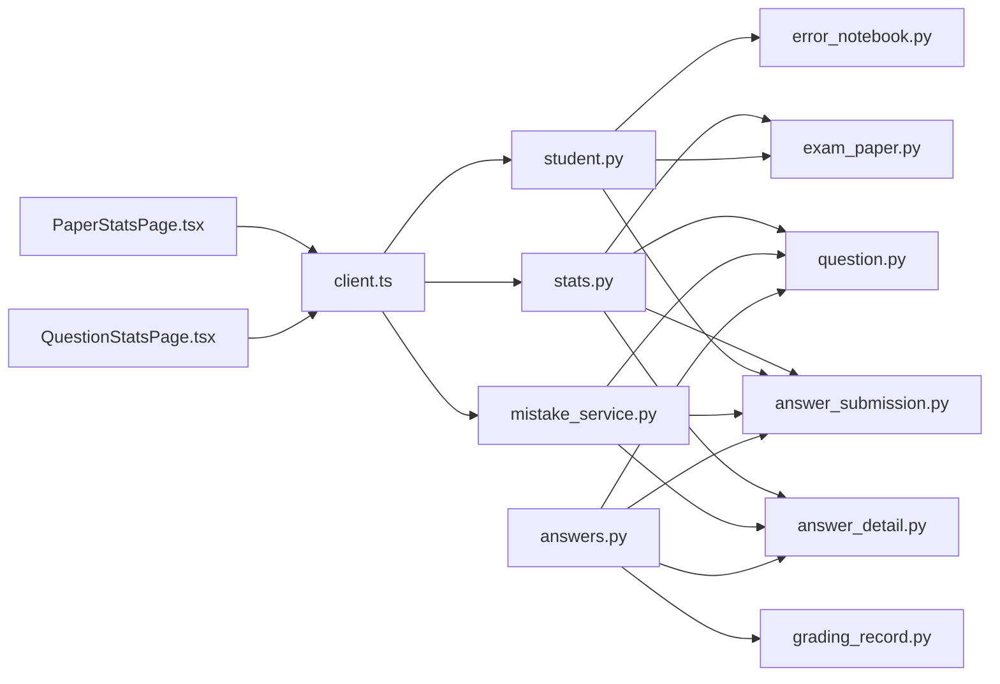

# Performance Analytics

<cite>
**Referenced Files in This Document**
- [backend/app/api/v1/endpoints/stats.py](file://backend/app/api/v1/endpoints/stats.py)
- [frontend/src/pages/teacher/PaperStatsPage.tsx](file://frontend/src/pages/teacher/PaperStatsPage.tsx)
- [frontend/src/pages/teacher/QuestionStatsPage.tsx](file://frontend/src/pages/teacher/QuestionStatsPage.tsx)
- [backend/app/models/answer_submission.py](file://backend/app/models/answer_submission.py)
- [backend/app/models/answer_detail.py](file://backend/app/models/answer_detail.py)
- [backend/app/models/exam_paper.py](file://backend/app/models/exam_paper.py)
- [backend/app/models/question.py](file://backend/app/models/question.py)
- [frontend/src/api/client.ts](file://frontend/src/api/client.ts)
- [frontend/src/hooks/useReferenceValues.ts](file://frontend/src/hooks/useReferenceValues.ts)
- [backend/app/api/v1/endpoints/student.py](file://backend/app/api/v1/endpoints/student.py)
- [backend/app/models/error_notebook.py](file://backend/app/models/error_notebook.py)
- [backend/app/models/error_notebook_question.py](file://backend/app/models/error_notebook_question.py)
- [backend/app/services/mistake_service.py](file://backend/app/services/mistake_service.py)
- [backend/app/models/grading_record.py](file://backend/app/models/grading_record.py)
- [backend/app/api/v1/endpoints/answers.py](file://backend/app/api/v1/endpoints/answers.py)
</cite>

## Table of Contents
1. [Introduction](#introduction)
2. [Project Structure](#project-structure)
3. [Core Components](#core-components)
4. [Architecture Overview](#architecture-overview)
5. [Detailed Component Analysis](#detailed-component-analysis)
6. [Dependency Analysis](#dependency-analysis)
7. [Performance Considerations](#performance-considerations)
8. [Troubleshooting Guide](#troubleshooting-guide)
9. [Conclusion](#conclusion)
10. [Appendices](#appendices)

## Introduction
This document describes the performance analytics system for student assessment analysis, statistical reporting, and comparative evaluation. It covers:
- Paper statistics dashboard and exam performance metrics
- Aggregate reporting across question banks
- Question statistics system, item analysis, and difficulty distribution
- Cohort comparison and trend visualization capabilities
- Statistical calculation algorithms, data aggregation methods, and reporting filters
- Analytics interface, interactive charts, and export functionality
- Practical examples for performance interpretation, instructional decisions, and student interventions

## Project Structure
The analytics system spans backend endpoints and frontend pages:
- Backend FastAPI endpoints under /api/v1/endpoints provide statistics APIs for paper-level and question-level analytics.
- Frontend pages render dashboards and tables with filtering and progress indicators.
- Data models define the assessment lifecycle and relationships among submissions, details, papers, and questions.
- Additional services support mistake book generation and grading records for audit trails.

**Diagram sources**
- [frontend/src/pages/teacher/PaperStatsPage.tsx:1-116](file://frontend/src/pages/teacher/PaperStatsPage.tsx#L1-L116)
- [frontend/src/pages/teacher/QuestionStatsPage.tsx:1-94](file://frontend/src/pages/teacher/QuestionStatsPage.tsx#L1-L94)
- [frontend/src/hooks/useReferenceValues.ts:1-84](file://frontend/src/hooks/useReferenceValues.ts#L1-L84)
- [frontend/src/api/client.ts:1-55](file://frontend/src/api/client.ts#L1-L55)
- [backend/app/api/v1/endpoints/stats.py:1-251](file://backend/app/api/v1/endpoints/stats.py#L1-L251)
- [backend/app/models/answer_submission.py:1-37](file://backend/app/models/answer_submission.py#L1-L37)
- [backend/app/models/answer_detail.py:1-33](file://backend/app/models/answer_detail.py#L1-L33)
- [backend/app/models/exam_paper.py:1-51](file://backend/app/models/exam_paper.py#L1-L51)
- [backend/app/models/question.py:1-46](file://backend/app/models/question.py#L1-L46)
- [backend/app/api/v1/endpoints/student.py:36-111](file://backend/app/api/v1/endpoints/student.py#L36-L111)
- [backend/app/models/error_notebook.py:1-32](file://backend/app/models/error_notebook.py#L1-L32)
- [backend/app/models/error_notebook_question.py:1-29](file://backend/app/models/error_notebook_question.py#L1-L29)
- [backend/app/models/grading_record.py:1-31](file://backend/app/models/grading_record.py#L1-L31)
- [backend/app/api/v1/endpoints/answers.py:37-112](file://backend/app/api/v1/endpoints/answers.py#L37-L112)

**Section sources**
- [backend/app/api/v1/endpoints/stats.py:1-251](file://backend/app/api/v1/endpoints/stats.py#L1-L251)
- [frontend/src/pages/teacher/PaperStatsPage.tsx:1-116](file://frontend/src/pages/teacher/PaperStatsPage.tsx#L1-L116)
- [frontend/src/pages/teacher/QuestionStatsPage.tsx:1-94](file://frontend/src/pages/teacher/QuestionStatsPage.tsx#L1-L94)
- [frontend/src/hooks/useReferenceValues.ts:1-84](file://frontend/src/hooks/useReferenceValues.ts#L1-L84)
- [frontend/src/api/client.ts:1-55](file://frontend/src/api/client.ts#L1-L55)

## Core Components
- Paper statistics endpoint: Aggregates per-question correctness, attempted counts, correct rates, and choice distributions for a selected exam paper.
- Question statistics endpoint: Provides overall question-level aggregates across all papers, with optional subject and question-type filters.
- Student analytics: Computes average accuracy, highest score, recent papers, and subject distribution for learners.
- Mistake book analytics: Summarizes total notebooks and wrong questions per student for targeted intervention.
- Grading pipeline: Updates submissions with scores and percentages, and records grading audits.

**Section sources**
- [backend/app/api/v1/endpoints/stats.py:17-137](file://backend/app/api/v1/endpoints/stats.py#L17-L137)
- [backend/app/api/v1/endpoints/stats.py:140-250](file://backend/app/api/v1/endpoints/stats.py#L140-L250)
- [backend/app/api/v1/endpoints/student.py:36-111](file://backend/app/api/v1/endpoints/student.py#L36-L111)
- [backend/app/services/mistake_service.py:13-44](file://backend/app/services/mistake_service.py#L13-L44)
- [backend/app/api/v1/endpoints/answers.py:37-112](file://backend/app/api/v1/endpoints/answers.py#L37-L112)

## Architecture Overview
The analytics pipeline connects frontend dashboards to backend endpoints, which query the relational models and compute aggregates. Filtering and progress indicators are rendered in the UI.

**Diagram sources**
- [frontend/src/pages/teacher/PaperStatsPage.tsx:29-53](file://frontend/src/pages/teacher/PaperStatsPage.tsx#L29-L53)
- [frontend/src/api/client.ts:1-55](file://frontend/src/api/client.ts#L1-L55)
- [backend/app/api/v1/endpoints/stats.py:17-137](file://backend/app/api/v1/endpoints/stats.py#L17-L137)

## Detailed Component Analysis

### Paper Statistics Dashboard
- Purpose: Show per-question correctness, attempted vs total students, correct rate, and choice distribution for a selected exam paper.
- Data aggregation:
  - Attempted: Number of answer details for a question among selected submissions.
  - Correct count: Count of correct answers for the question.
  - Correct rate: Rounded percentage of correct answers.
  - Choice distribution: For SINGLE_CHOICE and MULTIPLE_CHOICE, counts per option label.
- UI rendering:
  - Paper selector populated via /teacher/stats/papers.
  - Progress bars reflect correct rates with color-coded thresholds.
  - Option distribution tags display counts and percentages.

**Diagram sources**
- [backend/app/api/v1/endpoints/stats.py:37-137](file://backend/app/api/v1/endpoints/stats.py#L37-L137)
- [frontend/src/pages/teacher/PaperStatsPage.tsx:29-114](file://frontend/src/pages/teacher/PaperStatsPage.tsx#L29-L114)

**Section sources**
- [backend/app/api/v1/endpoints/stats.py:37-137](file://backend/app/api/v1/endpoints/stats.py#L37-L137)
- [frontend/src/pages/teacher/PaperStatsPage.tsx:29-114](file://frontend/src/pages/teacher/PaperStatsPage.tsx#L29-L114)

### Question-Level Statistics
- Purpose: Provide overall question-level analytics across all papers with optional filters for subject and question type.
- Filters: subject, question_type.
- Aggregation:
  - Attempted: Total answer details for a question across selected submissions.
  - Correct count and correct rate computed similarly.
  - Choice distribution built for choice questions.

**Diagram sources**
- [frontend/src/pages/teacher/QuestionStatsPage.tsx:28-93](file://frontend/src/pages/teacher/QuestionStatsPage.tsx#L28-L93)
- [frontend/src/api/client.ts:1-55](file://frontend/src/api/client.ts#L1-L55)
- [backend/app/api/v1/endpoints/stats.py:140-250](file://backend/app/api/v1/endpoints/stats.py#L140-L250)

**Section sources**
- [backend/app/api/v1/endpoints/stats.py:140-250](file://backend/app/api/v1/endpoints/stats.py#L140-L250)
- [frontend/src/pages/teacher/QuestionStatsPage.tsx:28-93](file://frontend/src/pages/teacher/QuestionStatsPage.tsx#L28-L93)

### Student Assessment Summary
- Metrics:
  - Completed papers count
  - Average accuracy rate (mean of percentages)
  - Highest score
  - Error count from mistake books
  - Recent 5 completed papers with subject, total score, and percentage
  - Subject distribution (count of distinct papers per subject)
- Data sources: AnswerSubmission, ExamPaper, ErrorNotebook.

**Diagram sources**
- [backend/app/api/v1/endpoints/student.py:36-111](file://backend/app/api/v1/endpoints/student.py#L36-L111)
- [backend/app/models/answer_submission.py:9-37](file://backend/app/models/answer_submission.py#L9-L37)
- [backend/app/models/exam_paper.py:23-51](file://backend/app/models/exam_paper.py#L23-L51)
- [backend/app/models/error_notebook.py:8-32](file://backend/app/models/error_notebook.py#L8-L32)

**Section sources**
- [backend/app/api/v1/endpoints/student.py:36-111](file://backend/app/api/v1/endpoints/student.py#L36-L111)

### Mistake Book Analytics and Intervention
- Purpose: Support targeted intervention by summarizing wrong answers and generating practice materials.
- Backend:
  - Mistake book generation service selects incorrect answer details per student, deduplicates by question, and prepares a notebook.
  - ErrorNotebook and ErrorNotebookQuestion models track original and practice questions.
- Frontend:
  - Pages allow generating and managing mistake books, and exporting content.

**Diagram sources**
- [backend/app/services/mistake_service.py:13-44](file://backend/app/services/mistake_service.py#L13-L44)
- [backend/app/models/error_notebook.py:8-32](file://backend/app/models/error_notebook.py#L8-L32)
- [backend/app/models/error_notebook_question.py:8-29](file://backend/app/models/error_notebook_question.py#L8-L29)

**Section sources**
- [backend/app/services/mistake_service.py:13-44](file://backend/app/services/mistake_service.py#L13-L44)
- [backend/app/models/error_notebook.py:8-32](file://backend/app/models/error_notebook.py#L8-L32)
- [backend/app/models/error_notebook_question.py:8-29](file://backend/app/models/error_notebook_question.py#L8-L29)

### Grading Pipeline and Audit Trail
- Purpose: Compute per-submission scores and percentages, and maintain a grading audit trail.
- Steps:
  - For each answer detail, grade based on question type and correct answer, derive score and feedback.
  - Accumulate total score and maximum possible score; compute percentage.
  - Update submission status to GRADED and persist totals.
  - Create a GradingRecord with details for auditing.

**Diagram sources**
- [backend/app/api/v1/endpoints/answers.py:37-112](file://backend/app/api/v1/endpoints/answers.py#L37-L112)
- [backend/app/models/grading_record.py:8-31](file://backend/app/models/grading_record.py#L8-L31)

**Section sources**
- [backend/app/api/v1/endpoints/answers.py:37-112](file://backend/app/api/v1/endpoints/answers.py#L37-L112)
- [backend/app/models/grading_record.py:8-31](file://backend/app/models/grading_record.py#L8-L31)

## Dependency Analysis
- Backend endpoints depend on SQLAlchemy models for queries and aggregations.
- Frontend pages depend on the API client and reference utilities for labels and colors.
- Mistake book service depends on answer submission and detail models to identify wrong answers.

**Diagram sources**
- [backend/app/api/v1/endpoints/stats.py:1-251](file://backend/app/api/v1/endpoints/stats.py#L1-L251)
- [backend/app/models/answer_submission.py:9-37](file://backend/app/models/answer_submission.py#L9-L37)
- [backend/app/models/answer_detail.py:9-33](file://backend/app/models/answer_detail.py#L9-L33)
- [backend/app/models/exam_paper.py:23-51](file://backend/app/models/exam_paper.py#L23-L51)
- [backend/app/models/question.py:10-46](file://backend/app/models/question.py#L10-L46)
- [backend/app/api/v1/endpoints/student.py:36-111](file://backend/app/api/v1/endpoints/student.py#L36-L111)
- [backend/app/models/error_notebook.py:8-32](file://backend/app/models/error_notebook.py#L8-L32)
- [backend/app/services/mistake_service.py:13-44](file://backend/app/services/mistake_service.py#L13-L44)
- [backend/app/api/v1/endpoints/answers.py:37-112](file://backend/app/api/v1/endpoints/answers.py#L37-L112)
- [backend/app/models/grading_record.py:8-31](file://backend/app/models/grading_record.py#L8-L31)
- [frontend/src/pages/teacher/PaperStatsPage.tsx:1-116](file://frontend/src/pages/teacher/PaperStatsPage.tsx#L1-L116)
- [frontend/src/pages/teacher/QuestionStatsPage.tsx:1-94](file://frontend/src/pages/teacher/QuestionStatsPage.tsx#L1-L94)
- [frontend/src/api/client.ts:1-55](file://frontend/src/api/client.ts#L1-L55)

**Section sources**
- [backend/app/api/v1/endpoints/stats.py:1-251](file://backend/app/api/v1/endpoints/stats.py#L1-L251)
- [frontend/src/pages/teacher/PaperStatsPage.tsx:1-116](file://frontend/src/pages/teacher/PaperStatsPage.tsx#L1-L116)
- [frontend/src/pages/teacher/QuestionStatsPage.tsx:1-94](file://frontend/src/pages/teacher/QuestionStatsPage.tsx#L1-L94)
- [frontend/src/api/client.ts:1-55](file://frontend/src/api/client.ts#L1-L55)

## Performance Considerations
- SQL efficiency:
  - Prefer indexed foreign keys and filters (e.g., GRADED status, teacher-created papers) to reduce scans.
  - Use LIMIT and ORDER BY appropriately to cap result sets for large datasets.
- Aggregation strategies:
  - Group by question_id and option labels to minimize loops and reduce memory churn.
  - Avoid N+1 queries by batching related selects and using joined loads where appropriate.
- Frontend rendering:
  - Use virtualized tables for long lists and debounce filter updates.
  - Cache reference metadata (labels, colors) to avoid repeated network requests.
- Asynchronous processing:
  - Consider offloading heavy computations (e.g., large-scale distributions) to background tasks.

[No sources needed since this section provides general guidance]

## Troubleshooting Guide
- Permission errors:
  - Ensure the current user is authorized (TEACHER, QUESTION_ADMIN, SYS_ADMIN) for statistics endpoints.
- Missing data:
  - Confirm submissions have GRADED/GENERATED/RE_GRADED status and contain answer details.
  - Verify that the selected paper has associated submissions and questions.
- Incorrect rates:
  - Check that correct_answer JSON is valid for choice questions and that student_answer labels match option labels.
- Export and printing:
  - Mistake book exports are supported; ensure the notebook exists and the user has permission to access it.

**Section sources**
- [backend/app/api/v1/endpoints/stats.py:23-51](file://backend/app/api/v1/endpoints/stats.py#L23-L51)
- [backend/app/api/v1/endpoints/stats.py:152-164](file://backend/app/api/v1/endpoints/stats.py#L152-L164)
- [backend/app/api/v1/endpoints/error_notebooks.py:62-78](file://backend/app/api/v1/endpoints/error_notebooks.py#L62-L78)

## Conclusion
The performance analytics system integrates paper-level and question-level statistics with student summaries and mistake book insights. It leverages efficient SQL aggregation and a clean frontend interface to deliver actionable insights for instructional decision-making and targeted student interventions.

[No sources needed since this section summarizes without analyzing specific files]

## Appendices

### Statistical Calculation Algorithms
- Correct rate: correct_count / attempted * 100, rounded to one decimal place.
- Choice distribution: count occurrences of each option label among student answers; compute percentages from total responses.
- Average accuracy: mean of submission percentages where percentage is not null.
- Highest score: maximum of submission percentages where percentage is not null.
- Subject distribution: count of distinct papers grouped by subject.

**Section sources**
- [backend/app/api/v1/endpoints/stats.py:94-117](file://backend/app/api/v1/endpoints/stats.py#L94-L117)
- [backend/app/api/v1/endpoints/stats.py:208-236](file://backend/app/api/v1/endpoints/stats.py#L208-L236)
- [backend/app/api/v1/endpoints/student.py:36-111](file://backend/app/api/v1/endpoints/student.py#L36-L111)

### Reporting Filters and UI Interactions
- Paper selector: Loads up to 50 most recent papers, ordered by creation date.
- Question filters: Subject and question type selectors drive server-side filtering.
- Refresh actions: Buttons trigger re-fetching of statistics with current filters.

**Section sources**
- [backend/app/api/v1/endpoints/stats.py:18-34](file://backend/app/api/v1/endpoints/stats.py#L18-L34)
- [frontend/src/pages/teacher/PaperStatsPage.tsx:38-53](file://frontend/src/pages/teacher/PaperStatsPage.tsx#L38-L53)
- [frontend/src/pages/teacher/QuestionStatsPage.tsx:38-49](file://frontend/src/pages/teacher/QuestionStatsPage.tsx#L38-L49)

### Example Interpretations and Interventions
- Low correct rate on a specific question indicates curriculum gaps; schedule targeted review sessions.
- Skewed choice distributions suggest misconceptions; use item analysis to tailor instruction.
- Cohort trends (compare average accuracy across classes) inform pacing adjustments.
- High error counts in specific subjects guide resource allocation and remediation pathways.
- Recent performance dips prompt one-on-one check-ins and personalized practice via mistake books.

[No sources needed since this section provides general guidance]