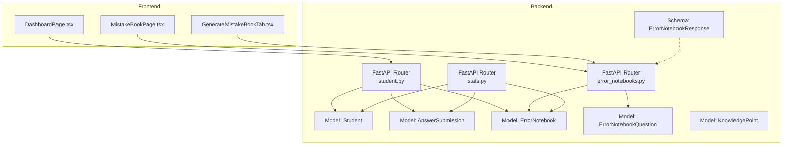
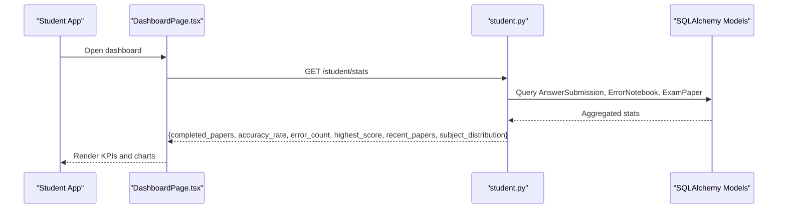
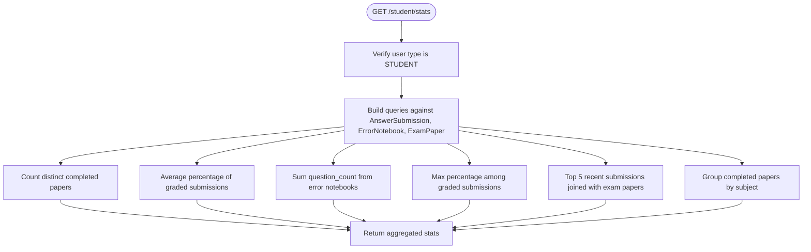
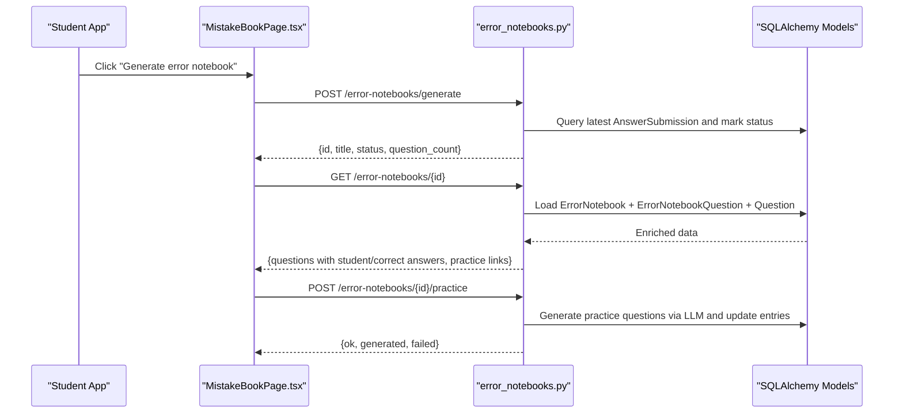
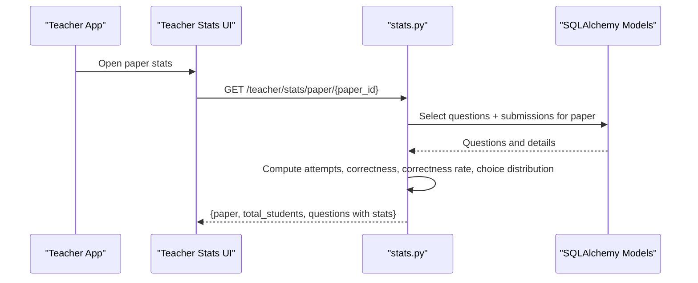
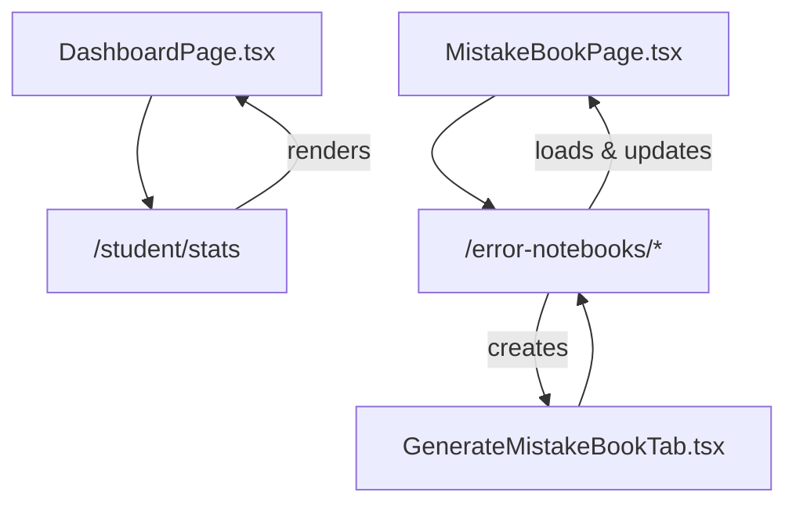
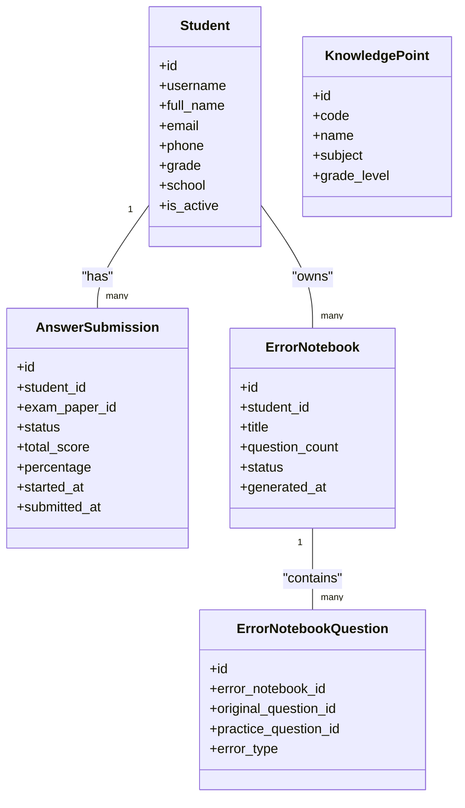

# Student Progress Tracking

<cite>
**Referenced Files in This Document**
- [backend/app/api/v1/endpoints/student.py](file://backend/app/api/v1/endpoints/student.py)
- [backend/app/api/v1/endpoints/error_notebooks.py](file://backend/app/api/v1/endpoints/error_notebooks.py)
- [backend/app/api/v1/endpoints/stats.py](file://backend/app/api/v1/endpoints/stats.py)
- [backend/app/models/student.py](file://backend/app/models/student.py)
- [backend/app/models/answer_submission.py](file://backend/app/models/answer_submission.py)
- [backend/app/models/error_notebook.py](file://backend/app/models/error_notebook.py)
- [backend/app/models/error_notebook_question.py](file://backend/app/models/error_notebook_question.py)
- [backend/app/models/knowledge_point.py](file://backend/app/models/knowledge_point.py)
- [backend/app/schemas/error_notebook.py](file://backend/app/schemas/error_notebook.py)
- [frontend/src/pages/dashboard/DashboardPage.tsx](file://frontend/src/pages/dashboard/DashboardPage.tsx)
- [frontend/src/pages/mistake-book/MistakeBookPage.tsx](file://frontend/src/pages/mistake-book/MistakeBookPage.tsx)
- [frontend/src/pages/exam-mistakes/GenerateMistakeBookTab.tsx](file://frontend/src/pages/exam-mistakes/GenerateMistakeBookTab.tsx)
- [docs/database-design.md](file://docs/database-design.md)
</cite>

## Table of Contents
1. [Introduction](#introduction)
2. [Project Structure](#project-structure)
3. [Core Components](#core-components)
4. [Architecture Overview](#architecture-overview)
5. [Detailed Component Analysis](#detailed-component-analysis)
6. [Dependency Analysis](#dependency-analysis)
7. [Performance Considerations](#performance-considerations)
8. [Troubleshooting Guide](#troubleshooting-guide)
9. [Conclusion](#conclusion)
10. [Appendices](#appendices)

## Introduction
This document describes the student progress tracking system, focusing on individual learning assessment, mastery monitoring, and academic development analysis. It documents the student performance monitoring interface, progress visualization tools, and learning trajectory tracking. It also explains the assessment history system, improvement indicators, milestone achievement tracking, error book integration for learning gap identification, skill mastery indicators, and personalized learning recommendations. Finally, it covers progress reporting mechanisms, individual student profiles, comparative analysis tools, the tracking dashboard, filtering options, and intervention support features.

## Project Structure
The progress tracking system spans backend API endpoints and models, and frontend dashboards and pages:
- Backend
  - API endpoints for student stats, error notebooks, and teacher statistics
  - SQLAlchemy models for students, submissions, error notebooks, and knowledge points
  - Schemas for error notebook responses
- Frontend
  - Dashboard page for student and teacher views
  - Mistake book page for error book management and practice generation
  - Generate mistake book tab for paper-specific error book creation

**Diagram sources**
- [backend/app/api/v1/endpoints/student.py:16-111](file://backend/app/api/v1/endpoints/student.py#L16-L111)
- [backend/app/api/v1/endpoints/error_notebooks.py:22-59](file://backend/app/api/v1/endpoints/error_notebooks.py#L22-L59)
- [backend/app/api/v1/endpoints/stats.py:17-137](file://backend/app/api/v1/endpoints/stats.py#L17-L137)
- [backend/app/models/student.py:8-23](file://backend/app/models/student.py#L8-L23)
- [backend/app/models/answer_submission.py:9-37](file://backend/app/models/answer_submission.py#L9-L37)
- [backend/app/models/error_notebook.py:8-32](file://backend/app/models/error_notebook.py#L8-L32)
- [backend/app/models/error_notebook_question.py:8-29](file://backend/app/models/error_notebook_question.py#L8-L29)
- [backend/app/models/knowledge_point.py:7-27](file://backend/app/models/knowledge_point.py#L7-L27)
- [backend/app/schemas/error_notebook.py:42-57](file://backend/app/schemas/error_notebook.py#L42-L57)
- [frontend/src/pages/dashboard/DashboardPage.tsx:32-72](file://frontend/src/pages/dashboard/DashboardPage.tsx#L32-L72)
- [frontend/src/pages/mistake-book/MistakeBookPage.tsx:47-57](file://frontend/src/pages/mistake-book/MistakeBookPage.tsx#L47-L57)
- [frontend/src/pages/exam-mistakes/GenerateMistakeBookTab.tsx:17-30](file://frontend/src/pages/exam-mistakes/GenerateMistakeBookTab.tsx#L17-L30)

**Section sources**
- [backend/app/api/v1/endpoints/student.py:16-111](file://backend/app/api/v1/endpoints/student.py#L16-L111)
- [backend/app/api/v1/endpoints/error_notebooks.py:22-59](file://backend/app/api/v1/endpoints/error_notebooks.py#L22-L59)
- [backend/app/api/v1/endpoints/stats.py:17-137](file://backend/app/api/v1/endpoints/stats.py#L17-L137)
- [frontend/src/pages/dashboard/DashboardPage.tsx:32-72](file://frontend/src/pages/dashboard/DashboardPage.tsx#L32-L72)

## Core Components
- Student performance monitoring endpoint
  - Computes completed papers, average accuracy, error counts, highest score, recent papers, and subject distribution for the current student.
- Error notebook management
  - Generates error notebooks from assessments, enriches with question details, supports practice question generation via LLM, and exports printable content.
- Teacher statistics
  - Provides paper-level and question-level statistics, including correctness rates and choice distributions for multiple-choice items.
- Frontend dashboards
  - Presents student KPIs, recent assessments, and subject distribution.
  - Offers error book management, filtering, batch operations, and printable previews.

**Section sources**
- [backend/app/api/v1/endpoints/student.py:16-111](file://backend/app/api/v1/endpoints/student.py#L16-L111)
- [backend/app/api/v1/endpoints/error_notebooks.py:22-59](file://backend/app/api/v1/endpoints/error_notebooks.py#L22-L59)
- [backend/app/api/v1/endpoints/stats.py:17-137](file://backend/app/api/v1/endpoints/stats.py#L17-L137)
- [frontend/src/pages/dashboard/DashboardPage.tsx:76-144](file://frontend/src/pages/dashboard/DashboardPage.tsx#L76-L144)
- [frontend/src/pages/mistake-book/MistakeBookPage.tsx:47-81](file://frontend/src/pages/mistake-book/MistakeBookPage.tsx#L47-L81)

## Architecture Overview
The system integrates frontend dashboards with backend APIs and models. Students receive personal dashboards with performance metrics and recent assessments. Teachers and administrators access statistical summaries and manage question and paper data. Error notebooks connect assessment history to targeted practice and remediation.

**Diagram sources**
- [frontend/src/pages/dashboard/DashboardPage.tsx:32-50](file://frontend/src/pages/dashboard/DashboardPage.tsx#L32-L50)
- [backend/app/api/v1/endpoints/student.py:16-111](file://backend/app/api/v1/endpoints/student.py#L16-L111)
- [backend/app/models/answer_submission.py:9-37](file://backend/app/models/answer_submission.py#L9-L37)
- [backend/app/models/error_notebook.py:8-32](file://backend/app/models/error_notebook.py#L8-L32)
- [backend/app/models/student.py:8-23](file://backend/app/models/student.py#L8-L23)

## Detailed Component Analysis

### Student Performance Monitoring Endpoint
- Purpose: Provide a real-time snapshot of a student’s performance.
- Inputs: Current authenticated user context.
- Outputs: Counts and averages derived from answer submissions and error notebooks, plus recent assessments and subject distribution.
- Key metrics:
  - Completed papers: distinct exam papers with specific statuses.
  - Accuracy rate: average percentage across graded submissions.
  - Error count: total mistakes aggregated from error notebooks.
  - Highest score: peak percentage achieved.
  - Recent papers: latest 5 completed assessments with subject and scores.
  - Subject distribution: counts of completed papers per subject.

**Diagram sources**
- [backend/app/api/v1/endpoints/student.py:16-111](file://backend/app/api/v1/endpoints/student.py#L16-L111)

**Section sources**
- [backend/app/api/v1/endpoints/student.py:16-111](file://backend/app/api/v1/endpoints/student.py#L16-L111)

### Error Notebook Management
- Generation from assessments
  - Validates submission status and marks it as generated upon successful notebook creation.
  - Notifies the user when a notebook is ready.
- Viewing and enrichment
  - Loads notebook with questions, maps original and optional practice questions, and extracts student answers and correct answers.
- Practice generation via LLM
  - Iterates through notebook entries to generate targeted practice questions and links them back to the notebook.
- Export and printing
  - Provides printable exports for review and reinforcement.

**Diagram sources**
- [frontend/src/pages/mistake-book/MistakeBookPage.tsx:61-81](file://frontend/src/pages/mistake-book/MistakeBookPage.tsx#L61-L81)
- [backend/app/api/v1/endpoints/error_notebooks.py:22-59](file://backend/app/api/v1/endpoints/error_notebooks.py#L22-L59)
- [backend/app/models/error_notebook.py:8-32](file://backend/app/models/error_notebook.py#L8-L32)
- [backend/app/models/error_notebook_question.py:8-29](file://backend/app/models/error_notebook_question.py#L8-L29)

**Section sources**
- [backend/app/api/v1/endpoints/error_notebooks.py:22-59](file://backend/app/api/v1/endpoints/error_notebooks.py#L22-L59)
- [backend/app/schemas/error_notebook.py:42-57](file://backend/app/schemas/error_notebook.py#L42-L57)
- [frontend/src/pages/mistake-book/MistakeBookPage.tsx:47-81](file://frontend/src/pages/mistake-book/MistakeBookPage.tsx#L47-L81)

### Teacher Statistics and Comparative Analysis
- Paper-level question statistics
  - Retrieves questions in a paper with positions, counts attempts and correctness, computes correctness rates, and aggregates choice distributions for multiple-choice items.
- Overall question statistics
  - Aggregates correctness across submissions, optionally filtered by subject and question type, and builds choice distributions for multiple-choice items.
- Filtering and access control
  - Teachers see only their own papers unless elevated roles; otherwise returns appropriate errors.

**Diagram sources**
- [backend/app/api/v1/endpoints/stats.py:37-137](file://backend/app/api/v1/endpoints/stats.py#L37-L137)
- [backend/app/models/answer_submission.py:9-37](file://backend/app/models/answer_submission.py#L9-L37)

**Section sources**
- [backend/app/api/v1/endpoints/stats.py:17-137](file://backend/app/api/v1/endpoints/stats.py#L17-L137)

### Frontend Dashboards and Visualizations
- Student dashboard
  - Displays KPIs (completed papers, accuracy rate, error count, highest score), recent assessments table, and subject distribution bar-like visualization.
- Mistake book management
  - Lists error notebooks with filtering by date range, subject, and keyword; supports preview, print, delete, batch operations, and “generate practice”.
- Generate mistake book from paper
  - Allows selecting a specific paper to generate a paper-based error notebook.

**Diagram sources**
- [frontend/src/pages/dashboard/DashboardPage.tsx:32-72](file://frontend/src/pages/dashboard/DashboardPage.tsx#L32-L72)
- [frontend/src/pages/mistake-book/MistakeBookPage.tsx:47-81](file://frontend/src/pages/mistake-book/MistakeBookPage.tsx#L47-L81)
- [frontend/src/pages/exam-mistakes/GenerateMistakeBookTab.tsx:17-30](file://frontend/src/pages/exam-mistakes/GenerateMistakeBookTab.tsx#L17-L30)

**Section sources**
- [frontend/src/pages/dashboard/DashboardPage.tsx:76-144](file://frontend/src/pages/dashboard/DashboardPage.tsx#L76-L144)
- [frontend/src/pages/mistake-book/MistakeBookPage.tsx:283-444](file://frontend/src/pages/mistake-book/MistakeBookPage.tsx#L283-L444)
- [frontend/src/pages/exam-mistakes/GenerateMistakeBookTab.tsx:57-83](file://frontend/src/pages/exam-mistakes/GenerateMistakeBookTab.tsx#L57-L83)

## Dependency Analysis
- Backend models define relationships among students, submissions, error notebooks, and questions.
- API endpoints depend on models and enforce access control by user roles.
- Frontend pages depend on API endpoints and schemas to render dashboards and manage error notebooks.

**Diagram sources**
- [backend/app/models/student.py:8-23](file://backend/app/models/student.py#L8-L23)
- [backend/app/models/answer_submission.py:9-37](file://backend/app/models/answer_submission.py#L9-L37)
- [backend/app/models/error_notebook.py:8-32](file://backend/app/models/error_notebook.py#L8-L32)
- [backend/app/models/error_notebook_question.py:8-29](file://backend/app/models/error_notebook_question.py#L8-L29)
- [backend/app/models/knowledge_point.py:7-27](file://backend/app/models/knowledge_point.py#L7-L27)

**Section sources**
- [backend/app/models/student.py:8-23](file://backend/app/models/student.py#L8-L23)
- [backend/app/models/answer_submission.py:9-37](file://backend/app/models/answer_submission.py#L9-L37)
- [backend/app/models/error_notebook.py:8-32](file://backend/app/models/error_notebook.py#L8-L32)
- [backend/app/models/error_notebook_question.py:8-29](file://backend/app/models/error_notebook_question.py#L8-L29)
- [backend/app/models/knowledge_point.py:7-27](file://backend/app/models/knowledge_point.py#L7-L27)

## Performance Considerations
- Efficient aggregation queries
  - Use of aggregate functions and grouped counts reduces result sets and minimizes client-side computation.
- Indexing and constraints
  - Constraints on submission and error notebook statuses ensure data integrity and enable fast filtering.
- Pagination and limits
  - Limits on returned paper lists and recent submissions prevent excessive payload sizes.
- Asynchronous operations
  - Async database sessions and LLM-based practice generation are designed to keep UI responsive.

[No sources needed since this section provides general guidance]

## Troubleshooting Guide
- Access control errors
  - Endpoints check user roles and return explicit errors for unauthorized access.
- Submission status conflicts
  - Attempting to regenerate an error notebook when the latest submission is already marked as generated triggers a client-friendly error.
- Missing resources
  - Nonexistent papers or notebooks return 404 responses; frontend displays empty states or prompts to create content.
- Export/print failures
  - Export endpoints return text-based content; ensure browser pop-ups are allowed and network connectivity is stable.

**Section sources**
- [backend/app/api/v1/endpoints/student.py:22-23](file://backend/app/api/v1/endpoints/student.py#L22-L23)
- [backend/app/api/v1/endpoints/error_notebooks.py:37-38](file://backend/app/api/v1/endpoints/error_notebooks.py#L37-L38)
- [backend/app/api/v1/endpoints/error_notebooks.py:74-77](file://backend/app/api/v1/endpoints/error_notebooks.py#L74-L77)
- [backend/app/api/v1/endpoints/error_notebooks.py:326-327](file://backend/app/api/v1/endpoints/error_notebooks.py#L326-L327)

## Conclusion
The student progress tracking system integrates assessment history, error book management, and teacher analytics into cohesive dashboards. Students gain immediate insights into their performance and recent progress, while error notebooks connect mistakes to targeted practice. Teachers leverage comparative analysis to guide instruction and interventions. The architecture balances efficient data access, clear visualizations, and robust operational controls.

[No sources needed since this section summarizes without analyzing specific files]

## Appendices

### Data Model Overview
- Students, submissions, error notebooks, and knowledge points form the core domain entities.
- Answer submissions carry scores and percentages; error notebooks aggregate mistakes and link to practice questions.

**Section sources**
- [docs/database-design.md:320-391](file://docs/database-design.md#L320-L391)
- [backend/app/models/student.py:8-23](file://backend/app/models/student.py#L8-L23)
- [backend/app/models/answer_submission.py:9-37](file://backend/app/models/answer_submission.py#L9-L37)
- [backend/app/models/error_notebook.py:8-32](file://backend/app/models/error_notebook.py#L8-L32)
- [backend/app/models/error_notebook_question.py:8-29](file://backend/app/models/error_notebook_question.py#L8-L29)
- [backend/app/models/knowledge_point.py:7-27](file://backend/app/models/knowledge_point.py#L7-L27)

### Progress Interpretation Examples
- Trend interpretation
  - Rising accuracy rate with stable or decreasing error counts indicates improved mastery.
  - Plateaued accuracy with increasing error counts suggests intervention or varied practice needs.
- Subject distribution
  - Uneven distribution may highlight strengths and weaknesses across subjects; adjust study plans accordingly.
- Recent assessments
  - Compare recent scores to identify short-term trends and focus on recurring error types.

[No sources needed since this section provides general guidance]

### Targeted Instruction Strategies
- Use teacher statistics to identify high-difficulty questions and common misconceptions.
- Link error notebooks to targeted practice questions generated via LLM to reinforce weak areas.
- Provide printable error book summaries for student reflection and guided review sessions.

[No sources needed since this section provides general guidance]

### Student Support Planning Based on Tracking Data
- Personalized learning recommendations
  - Generate practice questions aligned with error types and question types to address specific gaps.
- Intervention support
  - Flag students with consistently low accuracy or high error counts for additional tutoring or remediation.
- Milestone achievement tracking
  - Monitor completion of error notebooks and practice completion to celebrate milestones and maintain motivation.

[No sources needed since this section provides general guidance]