# Teacher Tools

<cite>
**Referenced Files in This Document**
- [TeacherClassesPage.tsx](file://frontend/src/pages/teacher/TeacherClassesPage.tsx)
- [PaperStatsPage.tsx](file://frontend/src/pages/teacher/PaperStatsPage.tsx)
- [QuestionStatsPage.tsx](file://frontend/src/pages/teacher/QuestionStatsPage.tsx)
- [classes.py](file://backend/app/api/v1/endpoints/classes.py)
- [stats.py](file://backend/app/api/v1/endpoints/stats.py)
- [answers.py](file://backend/app/api/v1/endpoints/answers.py)
- [student.py](file://backend/app/api/v1/endpoints/student.py)
- [knowledge_tree.py](file://backend/app/api/v1/endpoints/knowledge_tree.py)
- [school_class.py](file://backend/app/models/school_class.py)
- [student.py](file://backend/app/models/student.py)
- [question.py](file://backend/app/models/question.py)
- [exam_paper.py](file://backend/app/models/exam_paper.py)
- [answer_submission.py](file://backend/app/models/answer_submission.py)
- [answer_detail.py](file://backend/app/models/answer_detail.py)
- [common.py](file://backend/app/schemas/common.py)
</cite>

## Table of Contents
1. [Introduction](#introduction)
2. [Project Structure](#project-structure)
3. [Core Components](#core-components)
4. [Architecture Overview](#architecture-overview)
5. [Detailed Component Analysis](#detailed-component-analysis)
6. [Dependency Analysis](#dependency-analysis)
7. [Performance Considerations](#performance-considerations)
8. [Troubleshooting Guide](#troubleshooting-guide)
9. [Conclusion](#conclusion)
10. [Appendices](#appendices)

## Introduction
This document describes the teacher tools for managing classes, organizing courses, and analyzing student performance. It covers:
- Class administration: creation, listing, editing, and deletion of classes
- Student enrollment: adding existing or new students, removing students, and editing student profiles
- Course organization: linking questions to exam papers and ordering questions
- Performance analytics: per-paper and per-question statistics, correctness rates, and choice distributions
- Question statistics: difficulty and topic mastery tracking via knowledge trees
- Student progress monitoring: grade distribution and recent performance trends
- Report generation and export: leveraging backend statistics endpoints
- Integration with administrative systems: syllabus and knowledge tree management

## Project Structure
The teacher tools are implemented as a React frontend and a FastAPI backend:
- Frontend pages for teacher tools: class management, paper statistics, and question statistics
- Backend endpoints for class management, statistics, answer processing, and knowledge tree
- SQLAlchemy models representing classes, students, questions, exam papers, and answer submissions

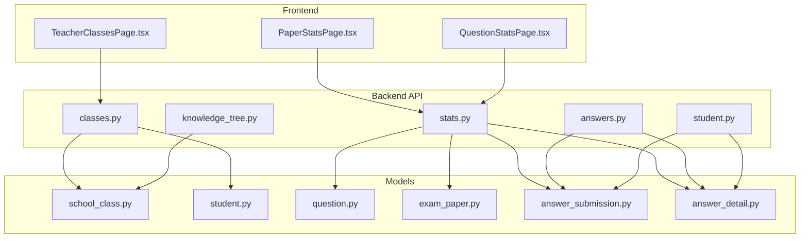

**Diagram sources**
- [TeacherClassesPage.tsx:1-334](file://frontend/src/pages/teacher/TeacherClassesPage.tsx#L1-L334)
- [PaperStatsPage.tsx:1-116](file://frontend/src/pages/teacher/PaperStatsPage.tsx#L1-L116)
- [QuestionStatsPage.tsx:1-94](file://frontend/src/pages/teacher/QuestionStatsPage.tsx#L1-L94)
- [classes.py:1-243](file://backend/app/api/v1/endpoints/classes.py#L1-L243)
- [stats.py:1-251](file://backend/app/api/v1/endpoints/stats.py#L1-L251)
- [answers.py:1-421](file://backend/app/api/v1/endpoints/answers.py#L1-L421)
- [student.py:1-112](file://backend/app/api/v1/endpoints/student.py#L1-L112)
- [knowledge_tree.py:1-357](file://backend/app/api/v1/endpoints/knowledge_tree.py#L1-L357)
- [school_class.py:1-39](file://backend/app/models/school_class.py#L1-L39)
- [student.py:1-23](file://backend/app/models/student.py#L1-L23)
- [question.py:1-46](file://backend/app/models/question.py#L1-L46)
- [exam_paper.py:1-51](file://backend/app/models/exam_paper.py#L1-L51)
- [answer_submission.py:1-37](file://backend/app/models/answer_submission.py#L1-L37)
- [answer_detail.py:1-33](file://backend/app/models/answer_detail.py#L1-L33)

**Section sources**
- [TeacherClassesPage.tsx:1-334](file://frontend/src/pages/teacher/TeacherClassesPage.tsx#L1-L334)
- [PaperStatsPage.tsx:1-116](file://frontend/src/pages/teacher/PaperStatsPage.tsx#L1-L116)
- [QuestionStatsPage.tsx:1-94](file://frontend/src/pages/teacher/QuestionStatsPage.tsx#L1-L94)
- [classes.py:1-243](file://backend/app/api/v1/endpoints/classes.py#L1-L243)
- [stats.py:1-251](file://backend/app/api/v1/endpoints/stats.py#L1-L251)
- [answers.py:1-421](file://backend/app/api/v1/endpoints/answers.py#L1-L421)
- [student.py:1-112](file://backend/app/api/v1/endpoints/student.py#L1-L112)
- [knowledge_tree.py:1-357](file://backend/app/api/v1/endpoints/knowledge_tree.py#L1-L357)
- [school_class.py:1-39](file://backend/app/models/school_class.py#L1-L39)
- [student.py:1-23](file://backend/app/models/student.py#L1-L23)
- [question.py:1-46](file://backend/app/models/question.py#L1-L46)
- [exam_paper.py:1-51](file://backend/app/models/exam_paper.py#L1-L51)
- [answer_submission.py:1-37](file://backend/app/models/answer_submission.py#L1-L37)
- [answer_detail.py:1-33](file://backend/app/models/answer_detail.py#L1-L33)

## Core Components
- Class administration interface: create, list, edit, delete classes; manage enrollments; filter by search and grade
- Student enrollment management: add existing students or register new ones; remove students; edit student details
- Course organization: associate questions with exam papers and order questions by position
- Performance analytics dashboard: per-paper question statistics, correctness rates, and choice distributions
- Question statistics system: overall correctness and choice distributions by subject and question type
- Difficulty and topic mastery tracking: leverage knowledge tree nodes and syllabi for topic coverage
- Student progress monitoring: recent papers, subject distribution, and accuracy metrics
- Report generation and export: use statistics endpoints to power reports and dashboards
- Administrative integration: syllabus versioning and knowledge tree management

**Section sources**
- [TeacherClassesPage.tsx:37-160](file://frontend/src/pages/teacher/TeacherClassesPage.tsx#L37-L160)
- [classes.py:16-100](file://backend/app/api/v1/endpoints/classes.py#L16-L100)
- [stats.py:17-138](file://backend/app/api/v1/endpoints/stats.py#L17-L138)
- [question.py:10-46](file://backend/app/models/question.py#L10-L46)
- [exam_paper.py:23-51](file://backend/app/models/exam_paper.py#L23-L51)
- [knowledge_tree.py:37-64](file://backend/app/api/v1/endpoints/knowledge_tree.py#L37-L64)

## Architecture Overview
The teacher tools follow a layered architecture:
- Frontend pages communicate with backend endpoints via HTTP requests
- Backend endpoints validate roles, query models, and return structured data
- Models define relationships among classes, students, questions, papers, and answers
- Statistics endpoints aggregate answer submissions and answer details to produce analytics

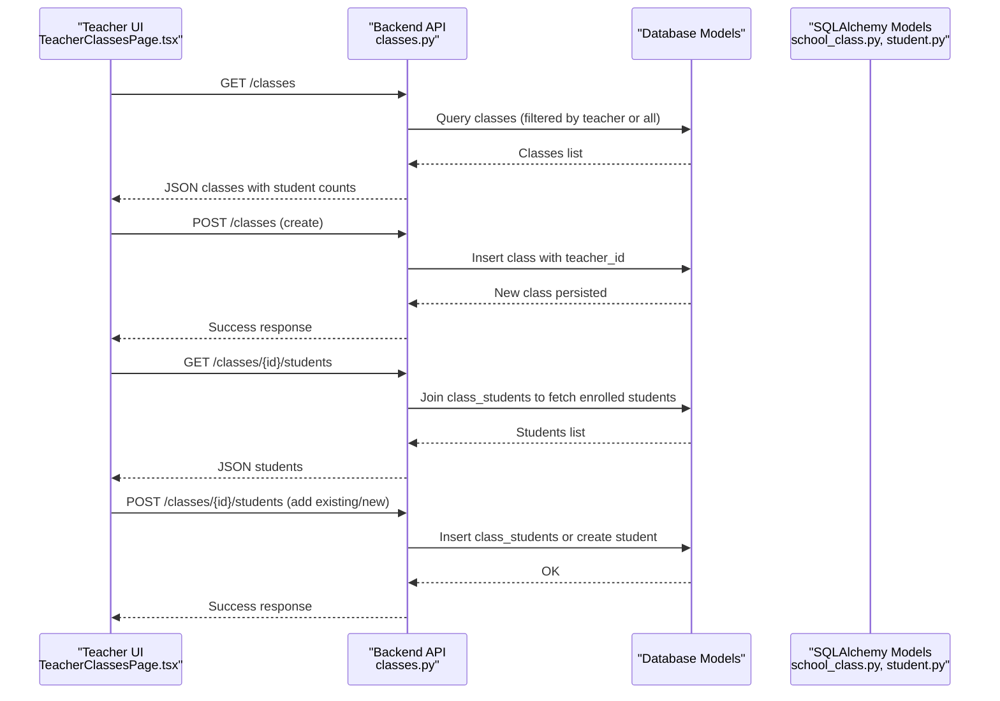

**Diagram sources**
- [TeacherClassesPage.tsx:37-160](file://frontend/src/pages/teacher/TeacherClassesPage.tsx#L37-L160)
- [classes.py:36-100](file://backend/app/api/v1/endpoints/classes.py#L36-L100)
- [school_class.py:7-39](file://backend/app/models/school_class.py#L7-L39)
- [student.py:8-23](file://backend/app/models/student.py#L8-L23)

## Detailed Component Analysis

### Class Administration Interface
- Purpose: Manage classes and student enrollments
- Key features:
  - List classes with filters (search, grade)
  - Create/edit/delete classes
  - Enroll students: choose from available students or add manually
  - Edit student profile (non-phone fields)
- Data flow:
  - Frontend calls backend endpoints for CRUD and enrollment
  - Backend validates permissions and enforces uniqueness and constraints
  - Responses include success messages and updated lists

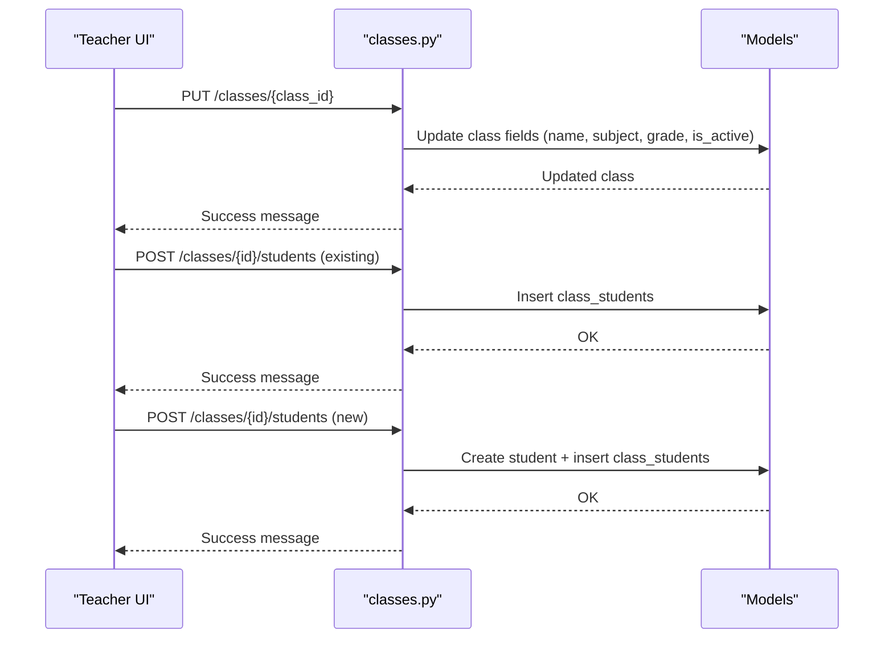

**Diagram sources**
- [classes.py:65-100](file://backend/app/api/v1/endpoints/classes.py#L65-L100)
- [classes.py:143-190](file://backend/app/api/v1/endpoints/classes.py#L143-L190)
- [classes.py:192-230](file://backend/app/api/v1/endpoints/classes.py#L192-L230)

**Section sources**
- [TeacherClassesPage.tsx:37-160](file://frontend/src/pages/teacher/TeacherClassesPage.tsx#L37-L160)
- [classes.py:36-230](file://backend/app/api/v1/endpoints/classes.py#L36-L230)
- [school_class.py:7-39](file://backend/app/models/school_class.py#L7-L39)
- [student.py:8-23](file://backend/app/models/student.py#L8-L23)

### Performance Analytics Dashboard
- Purpose: Provide per-paper and per-question analytics for instruction
- Key features:
  - Select a paper to view question-level statistics
  - View correctness rate, attempted counts, and choice distributions for multiple-choice questions
  - Filter by subject and question type for question-wide stats
- Data aggregation:
  - Backend computes correctness rates and choice distributions from answer details
  - Filters submissions by status to ensure graded data

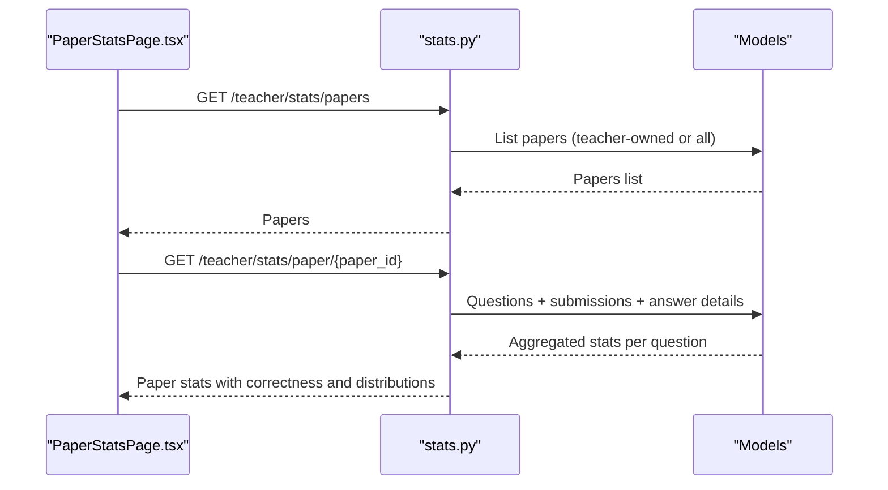

**Diagram sources**
- [PaperStatsPage.tsx:29-54](file://frontend/src/pages/teacher/PaperStatsPage.tsx#L29-L54)
- [stats.py:17-138](file://backend/app/api/v1/endpoints/stats.py#L17-L138)
- [question.py:10-46](file://backend/app/models/question.py#L10-L46)
- [answer_detail.py:9-33](file://backend/app/models/answer_detail.py#L9-L33)

**Section sources**
- [PaperStatsPage.tsx:29-116](file://frontend/src/pages/teacher/PaperStatsPage.tsx#L29-L116)
- [QuestionStatsPage.tsx:28-94](file://frontend/src/pages/teacher/QuestionStatsPage.tsx#L28-L94)
- [stats.py:17-251](file://backend/app/api/v1/endpoints/stats.py#L17-L251)

### Question Statistics System
- Purpose: Track correctness and choice distributions across all papers
- Features:
  - Filter by subject and question type
  - View correctness rate and choice distribution for multiple-choice
- Data model:
  - Uses answer details and question metadata to compute aggregates

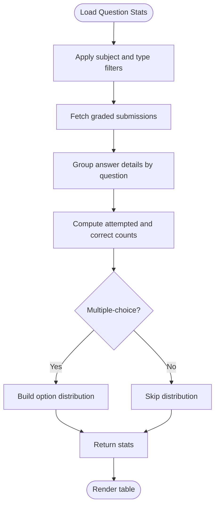

**Diagram sources**
- [QuestionStatsPage.tsx:28-94](file://frontend/src/pages/teacher/QuestionStatsPage.tsx#L28-L94)
- [stats.py:140-251](file://backend/app/api/v1/endpoints/stats.py#L140-L251)

**Section sources**
- [QuestionStatsPage.tsx:28-94](file://frontend/src/pages/teacher/QuestionStatsPage.tsx#L28-L94)
- [stats.py:140-251](file://backend/app/api/v1/endpoints/stats.py#L140-L251)

### Difficulty Analysis and Topic Mastery Tracking
- Difficulty analysis:
  - Backend computes correctness rates grouped by difficulty level
  - Frontend renders difficulty tags and correctness progress bars
- Topic mastery tracking:
  - Knowledge tree endpoints support syllabus versioning and node activation
  - Combine topic nodes with question stats to assess mastery by topic

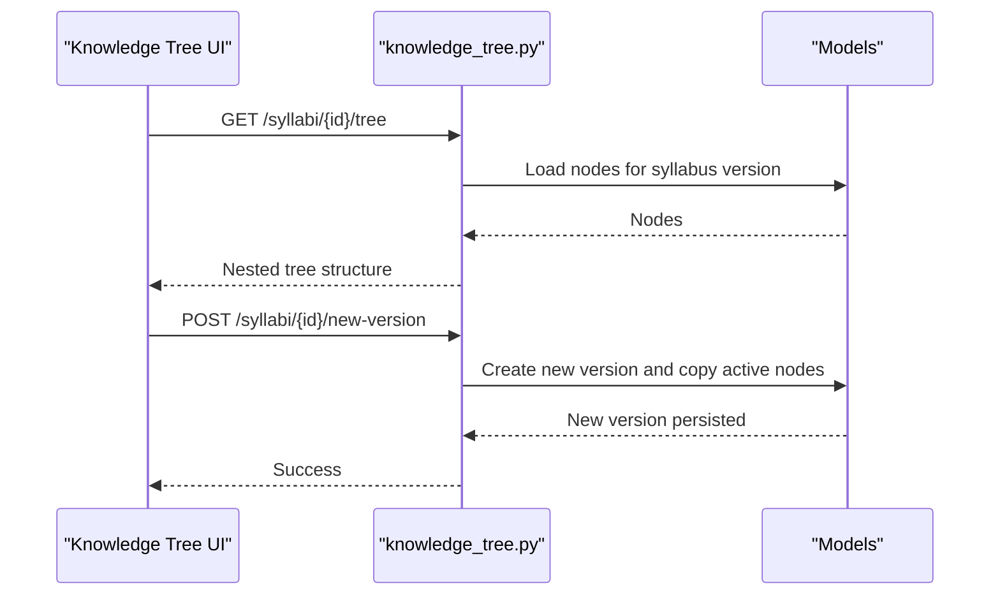

**Diagram sources**
- [knowledge_tree.py:37-64](file://backend/app/api/v1/endpoints/knowledge_tree.py#L37-L64)
- [knowledge_tree.py:199-250](file://backend/app/api/v1/endpoints/knowledge_tree.py#L199-L250)

**Section sources**
- [PaperStatsPage.tsx:11-27](file://frontend/src/pages/teacher/PaperStatsPage.tsx#L11-L27)
- [QuestionStatsPage.tsx:10-26](file://frontend/src/pages/teacher/QuestionStatsPage.tsx#L10-L26)
- [knowledge_tree.py:37-250](file://backend/app/api/v1/endpoints/knowledge_tree.py#L37-L250)

### Student Progress Monitoring
- Purpose: Monitor individual student performance over time
- Features:
  - Completed papers count, average accuracy, highest score
  - Error notebook item count
  - Recent papers with scores and subjects
  - Subject-wise distribution of completed papers
- Data sources:
  - Answer submissions and error notebooks

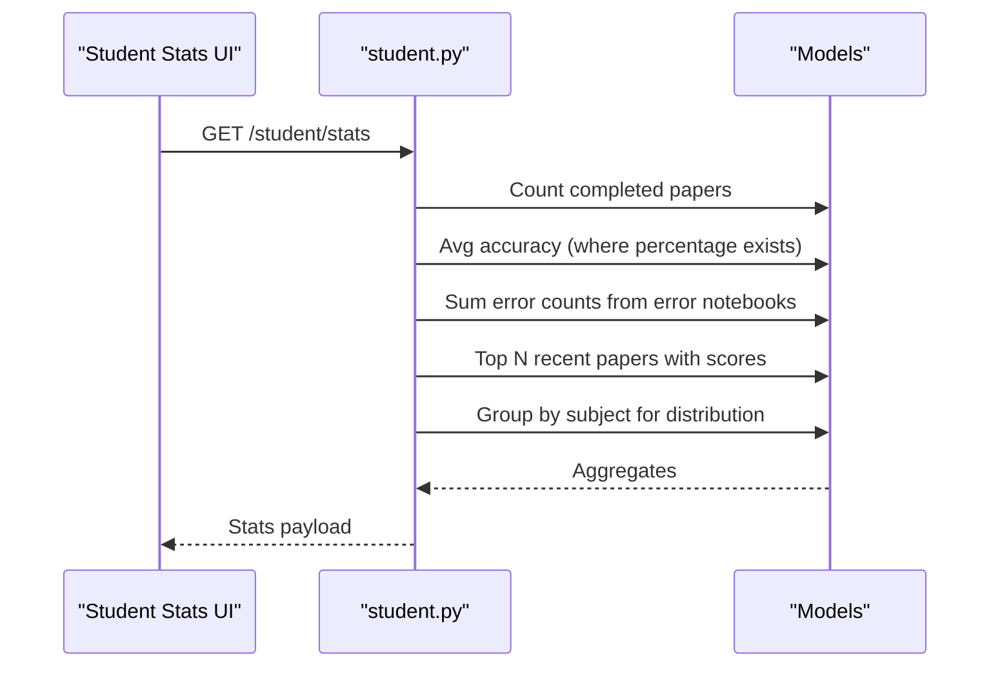

**Diagram sources**
- [student.py:16-112](file://backend/app/api/v1/endpoints/student.py#L16-L112)
- [answer_submission.py:9-37](file://backend/app/models/answer_submission.py#L9-L37)
- [answer_detail.py:9-33](file://backend/app/models/answer_detail.py#L9-L33)

**Section sources**
- [student.py:16-112](file://backend/app/api/v1/endpoints/student.py#L16-L112)

### Report Generation and Export
- Reporting capability:
  - Use statistics endpoints to power reports (per-paper and per-question)
  - Export data by consuming the same endpoints from external tools or dashboards
- Pagination:
  - Reusable pagination dependency supports controlled data retrieval

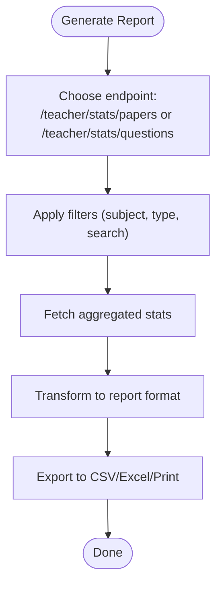

**Diagram sources**
- [stats.py:17-251](file://backend/app/api/v1/endpoints/stats.py#L17-L251)
- [common.py:5-14](file://backend/app/schemas/common.py#L5-L14)

**Section sources**
- [stats.py:17-251](file://backend/app/api/v1/endpoints/stats.py#L17-L251)
- [common.py:5-14](file://backend/app/schemas/common.py#L5-L14)

### Administrative Integration
- Syllabus and knowledge tree:
  - Create nodes, update descriptions, set branches active/inactive
  - Roll back to historical versions and create new versions
- Integration points:
  - Knowledge tree drives topic-based analytics and mastery tracking

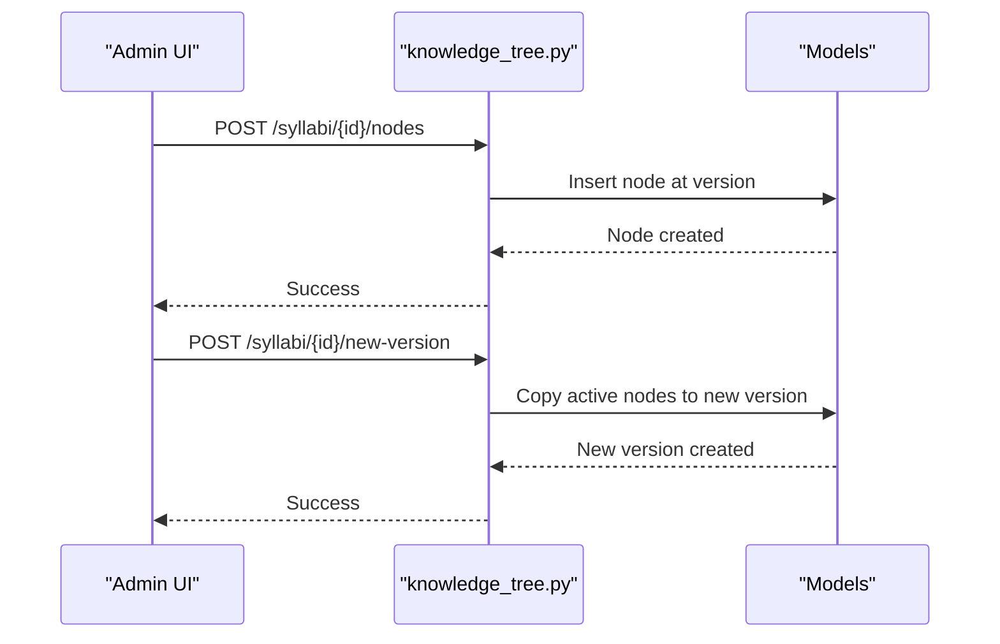

**Diagram sources**
- [knowledge_tree.py:67-95](file://backend/app/api/v1/endpoints/knowledge_tree.py#L67-L95)
- [knowledge_tree.py:199-250](file://backend/app/api/v1/endpoints/knowledge_tree.py#L199-L250)

**Section sources**
- [knowledge_tree.py:37-357](file://backend/app/api/v1/endpoints/knowledge_tree.py#L37-L357)

## Dependency Analysis
- Frontend-to-backend:
  - Teacher pages call class and stats endpoints
  - Endpoints depend on models and database sessions
- Model relationships:
  - Classes enroll students via an association table
  - Papers contain questions via an association table
  - Submissions and answer details link students, papers, and questions
- Permissions:
  - Endpoints enforce TEACHER, SYS_ADMIN, QUESTION_ADMIN roles

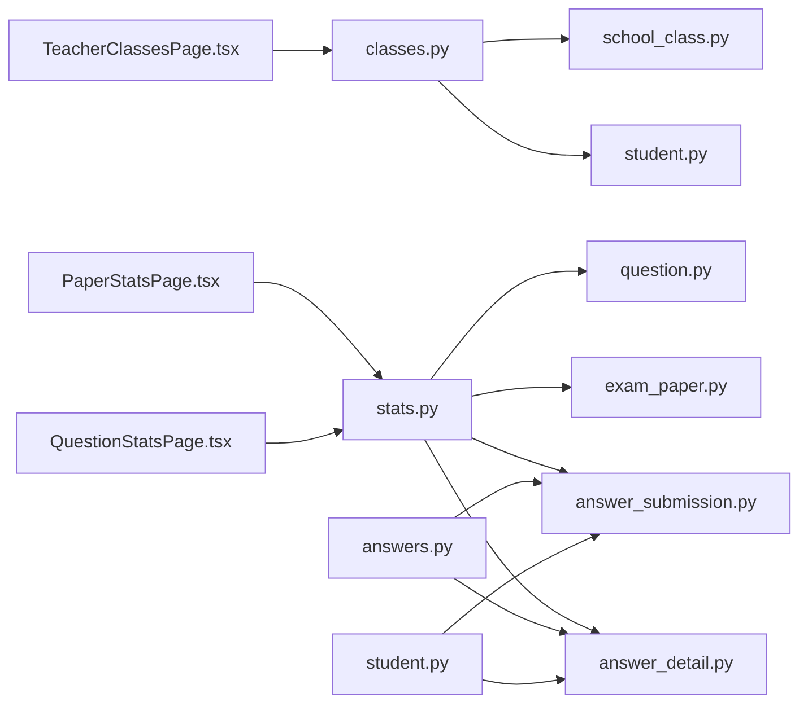

**Diagram sources**
- [TeacherClassesPage.tsx:1-334](file://frontend/src/pages/teacher/TeacherClassesPage.tsx#L1-L334)
- [PaperStatsPage.tsx:1-116](file://frontend/src/pages/teacher/PaperStatsPage.tsx#L1-L116)
- [QuestionStatsPage.tsx:1-94](file://frontend/src/pages/teacher/QuestionStatsPage.tsx#L1-L94)
- [classes.py:1-243](file://backend/app/api/v1/endpoints/classes.py#L1-L243)
- [stats.py:1-251](file://backend/app/api/v1/endpoints/stats.py#L1-L251)
- [answers.py:1-421](file://backend/app/api/v1/endpoints/answers.py#L1-L421)
- [student.py:1-112](file://backend/app/api/v1/endpoints/student.py#L1-L112)
- [school_class.py:1-39](file://backend/app/models/school_class.py#L1-L39)
- [student.py:1-23](file://backend/app/models/student.py#L1-L23)
- [question.py:1-46](file://backend/app/models/question.py#L1-L46)
- [exam_paper.py:1-51](file://backend/app/models/exam_paper.py#L1-L51)
- [answer_submission.py:1-37](file://backend/app/models/answer_submission.py#L1-L37)
- [answer_detail.py:1-33](file://backend/app/models/answer_detail.py#L1-L33)

**Section sources**
- [classes.py:1-243](file://backend/app/api/v1/endpoints/classes.py#L1-L243)
- [stats.py:1-251](file://backend/app/api/v1/endpoints/stats.py#L1-L251)
- [answers.py:1-421](file://backend/app/api/v1/endpoints/answers.py#L1-L421)
- [student.py:1-112](file://backend/app/api/v1/endpoints/student.py#L1-L112)
- [school_class.py:1-39](file://backend/app/models/school_class.py#L1-L39)
- [student.py:1-23](file://backend/app/models/student.py#L1-L23)
- [question.py:1-46](file://backend/app/models/question.py#L1-L46)
- [exam_paper.py:1-51](file://backend/app/models/exam_paper.py#L1-L51)
- [answer_submission.py:1-37](file://backend/app/models/answer_submission.py#L1-L37)
- [answer_detail.py:1-33](file://backend/app/models/answer_detail.py#L1-L33)

## Performance Considerations
- Efficient queries:
  - Use indexed columns (teacher_id, subject, status) to filter datasets
  - Limit result sets for paper lists and question stats
- Aggregation:
  - Compute correctness and distributions server-side to reduce frontend work
- Pagination:
  - Use reusable pagination parameters to control payload sizes

[No sources needed since this section provides general guidance]

## Troubleshooting Guide
- Permission errors:
  - Ensure user roles are TEACHER, SYS_ADMIN, or QUESTION_ADMIN for respective endpoints
- Missing data:
  - Verify submissions have GRADED/GENERATED/RE_GRADED status for accurate stats
- Enrollment conflicts:
  - Adding a student already in the class raises an error; check availability before adding
- Phone field restrictions:
  - Student phone is immutable via class enrollment; update through student profile editing

**Section sources**
- [classes.py:22-24](file://backend/app/api/v1/endpoints/classes.py#L22-L24)
- [stats.py:23-24](file://backend/app/api/v1/endpoints/stats.py#L23-L24)
- [stats.py:68-69](file://backend/app/api/v1/endpoints/stats.py#L68-L69)
- [classes.py:182-183](file://backend/app/api/v1/endpoints/classes.py#L182-L183)
- [classes.py:153-154](file://backend/app/api/v1/endpoints/classes.py#L153-L154)

## Conclusion
The teacher tools provide a comprehensive suite for class management, course organization, and performance analytics. Teachers can efficiently manage classes and enrollments, analyze student performance at both paper and question levels, track difficulty and topic mastery, monitor individual progress, and integrate with administrative systems for syllabus and knowledge tree maintenance.

[No sources needed since this section summarizes without analyzing specific files]

## Appendices

### Example Workflows

#### Class Setup Workflow
- Create a class with subject and grade level
- Add existing students from the available list or register new students
- Review enrolled students and edit profiles as needed

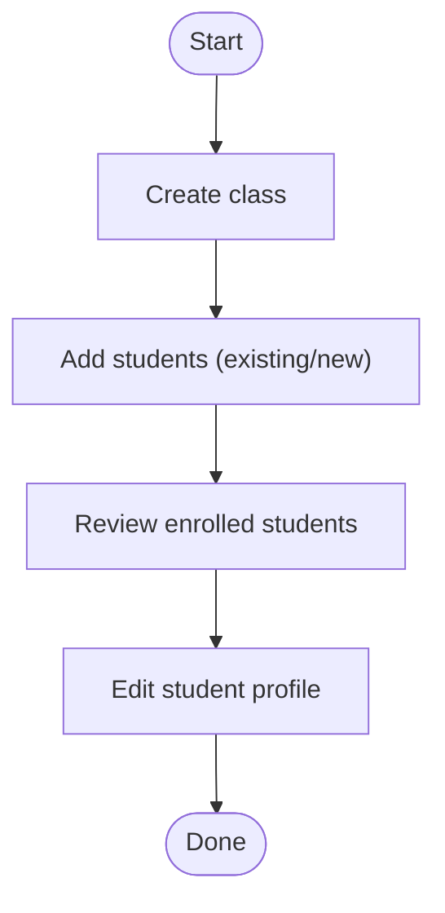

**Diagram sources**
- [TeacherClassesPage.tsx:51-160](file://frontend/src/pages/teacher/TeacherClassesPage.tsx#L51-L160)
- [classes.py:16-190](file://backend/app/api/v1/endpoints/classes.py#L16-L190)

**Section sources**
- [TeacherClassesPage.tsx:51-160](file://frontend/src/pages/teacher/TeacherClassesPage.tsx#L51-L160)
- [classes.py:16-190](file://backend/app/api/v1/endpoints/classes.py#L16-L190)

#### Analytics Interpretation Workflow
- Select a paper to view per-question correctness and choice distributions
- Use subject and question-type filters to compare topics and difficulty
- Identify common misconceptions and adjust instruction accordingly

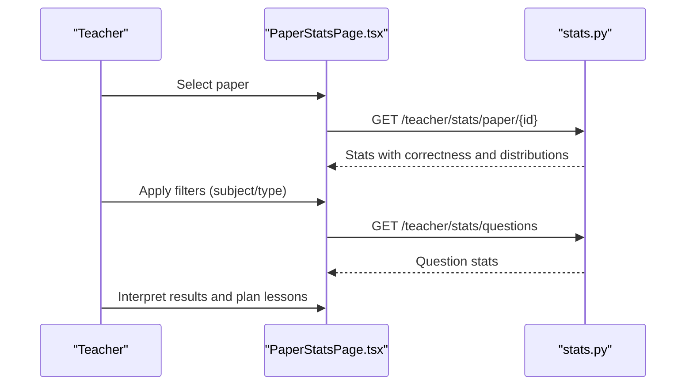

**Diagram sources**
- [PaperStatsPage.tsx:42-54](file://frontend/src/pages/teacher/PaperStatsPage.tsx#L42-L54)
- [QuestionStatsPage.tsx:38-49](file://frontend/src/pages/teacher/QuestionStatsPage.tsx#L38-L49)
- [stats.py:37-138](file://backend/app/api/v1/endpoints/stats.py#L37-L138)
- [stats.py:140-251](file://backend/app/api/v1/endpoints/stats.py#L140-L251)

**Section sources**
- [PaperStatsPage.tsx:29-116](file://frontend/src/pages/teacher/PaperStatsPage.tsx#L29-L116)
- [QuestionStatsPage.tsx:28-94](file://frontend/src/pages/teacher/QuestionStatsPage.tsx#L28-L94)
- [stats.py:37-251](file://backend/app/api/v1/endpoints/stats.py#L37-L251)

#### Instructional Decision-Making Process
- Use paper stats to identify low-performing questions
- Use question stats to focus on high-difficulty or high-error topics
- Leverage knowledge tree to align instruction with syllabus topics
- Monitor student progress to tailor remediation and enrichment

**Section sources**
- [PaperStatsPage.tsx:29-116](file://frontend/src/pages/teacher/PaperStatsPage.tsx#L29-L116)
- [QuestionStatsPage.tsx:28-94](file://frontend/src/pages/teacher/QuestionStatsPage.tsx#L28-L94)
- [knowledge_tree.py:37-64](file://backend/app/api/v1/endpoints/knowledge_tree.py#L37-L64)
- [student.py:16-112](file://backend/app/api/v1/endpoints/student.py#L16-L112)