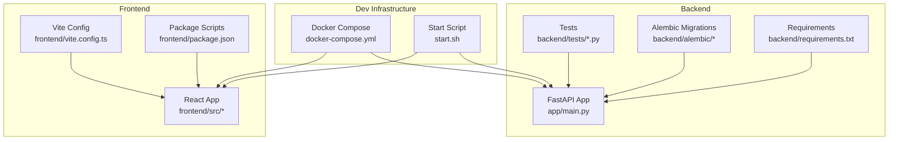
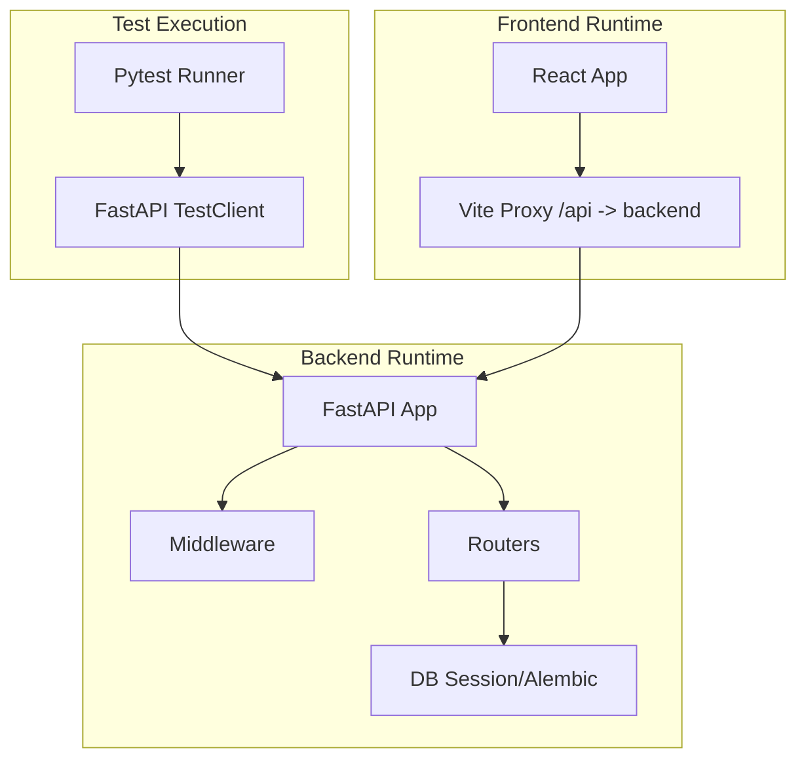
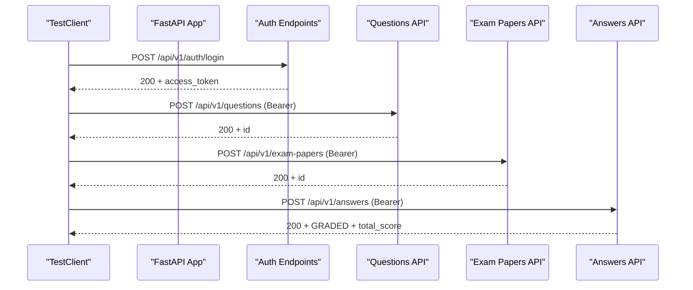
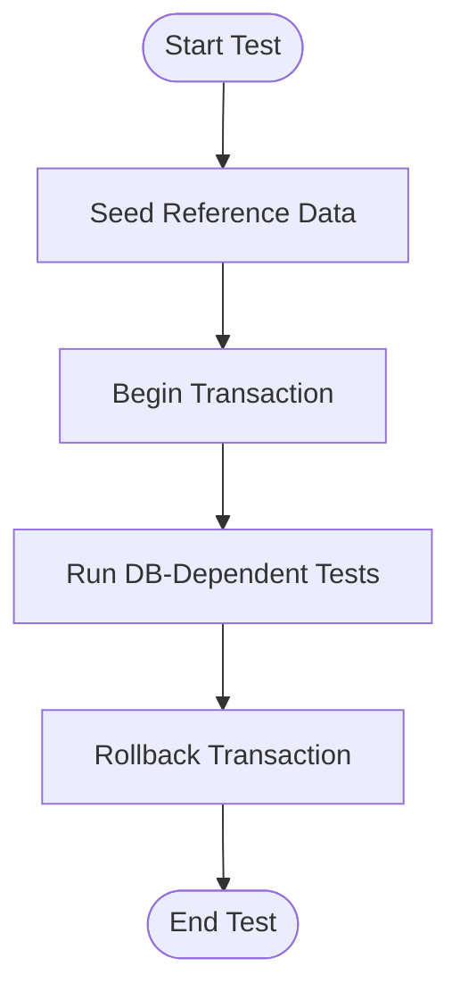
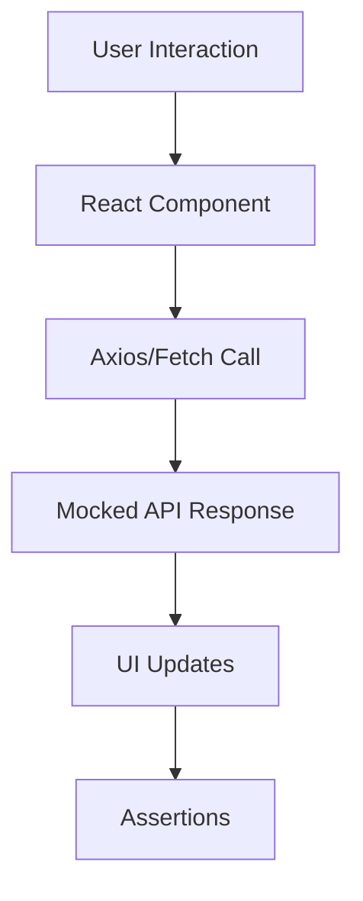
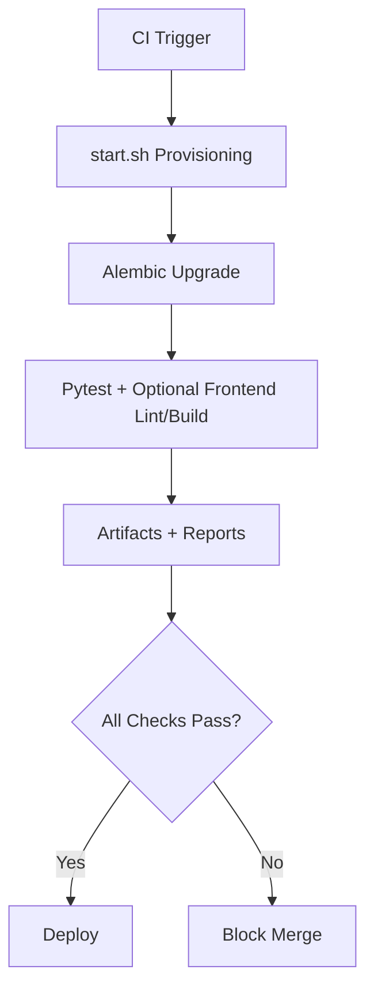
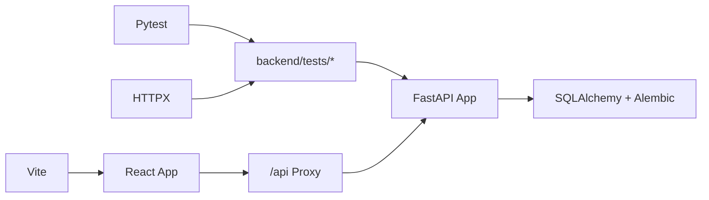

# Testing Strategy

<cite>
**Referenced Files in This Document**
- [smoke_test.py](file://backend/tests/smoke_test.py)
- [test_llm.py](file://backend/tests/test_llm.py)
- [requirements.txt](file://backend/requirements.txt)
- [main.py](file://backend/app/main.py)
- [docker-compose.yml](file://docker-compose.yml)
- [start.sh](file://start.sh)
- [package.json](file://frontend/package.json)
- [vite.config.ts](file://frontend/vite.config.ts)
- [grading-implementation-plan.md](file://docs/grading-implementation-plan.md)
- [self-study-scheduling-plan.md](file://docs/self-study-scheduling-plan.md)
</cite>

## Table of Contents
1. [Introduction](#introduction)
2. [Project Structure](#project-structure)
3. [Core Components](#core-components)
4. [Architecture Overview](#architecture-overview)
5. [Detailed Component Analysis](#detailed-component-analysis)
6. [Dependency Analysis](#dependency-analysis)
7. [Performance Considerations](#performance-considerations)
8. [Troubleshooting Guide](#troubleshooting-guide)
9. [Conclusion](#conclusion)
10. [Appendices](#appendices)

## Introduction
This document defines a comprehensive testing strategy for the education platform, covering unit testing, integration testing, end-to-end testing, API testing, database testing, performance/load testing, security testing, and continuous integration workflows. It leverages the existing backend FastAPI/Pytest stack and outlines practical patterns for frontend testing with React Testing Library and component-driven workflows. The strategy emphasizes realistic smoke tests, database fixtures, and CI-friendly automation aligned with the current repository structure.

## Project Structure
The repository is split into backend and frontend:
- Backend: FastAPI application with Alembic migrations, Pytest-based tests, and a Docker Compose setup for local development.
- Frontend: React + TypeScript + Vite with a proxy configured to the backend service.

**Diagram sources**
- [main.py:1-52](file://backend/app/main.py#L1-L52)
- [docker-compose.yml:1-33](file://docker-compose.yml#L1-L33)
- [start.sh:1-359](file://start.sh#L1-L359)
- [vite.config.ts:1-17](file://frontend/vite.config.ts#L1-L17)
- [package.json:1-38](file://frontend/package.json#L1-L38)
- [requirements.txt:1-27](file://backend/requirements.txt#L1-L27)

**Section sources**
- [main.py:1-52](file://backend/app/main.py#L1-L52)
- [docker-compose.yml:1-33](file://docker-compose.yml#L1-L33)
- [start.sh:1-359](file://start.sh#L1-L359)
- [vite.config.ts:1-17](file://frontend/vite.config.ts#L1-L17)
- [package.json:1-38](file://frontend/package.json#L1-L38)
- [requirements.txt:1-27](file://backend/requirements.txt#L1-L27)

## Core Components
- Backend API server built with FastAPI and served via Uvicorn, with unified response wrapping and CORS middleware.
- Test suite currently includes a smoke test and an LLM configuration test using FastAPI TestClient.
- Frontend proxy configured to route API requests to the backend during local development.
- Database migration and seeding orchestrated via Alembic and startup events.

Key testing-relevant components:
- TestClient-based smoke tests exercising authentication, CRUD, grading, and knowledge tree operations.
- LLM configuration test validating connectivity and persistence of provider settings.
- Requirements specifying Pytest and HTTPX for testing.

**Section sources**
- [main.py:1-52](file://backend/app/main.py#L1-L52)
- [smoke_test.py:1-172](file://backend/tests/smoke_test.py#L1-L172)
- [test_llm.py:1-23](file://backend/tests/test_llm.py#L1-L23)
- [requirements.txt:24-27](file://backend/requirements.txt#L24-L27)
- [vite.config.ts:8-14](file://frontend/vite.config.ts#L8-L14)

## Architecture Overview
The testing architecture centers around:
- Backend: FastAPI app with middleware and routers; tests executed via TestClient against the live app.
- Frontend: React app with Vite proxy to backend; testing can leverage React Testing Library and user-event for component-level interactions.
- DevOps: Docker Compose and start script orchestrate backend and frontend services locally.

**Diagram sources**
- [main.py:11-31](file://backend/app/main.py#L11-L31)
- [docker-compose.yml:8-20](file://docker-compose.yml#L8-L20)
- [vite.config.ts:8-14](file://frontend/vite.config.ts#L8-L14)

## Detailed Component Analysis

### Backend Testing Framework and Patterns
- Test runner: Pytest with pytest-asyncio for async support.
- Test client: FastAPI TestClient for API-level tests.
- Test organization: Tests under backend/tests/, with a smoke test and an LLM configuration test.
- Mocking strategy: Prefer patching external integrations (e.g., OCR, LLM) at module boundaries; avoid heavy DB fixtures for unit tests.

Recommended patterns:
- Isolate tests from persistent state by using per-test database transactions or lightweight in-memory SQLite for unit tests.
- Use parametrize for boundary conditions and varied inputs.
- Group related tests by feature (auth, questions, papers, grading, knowledge tree) to improve maintainability.

**Section sources**
- [requirements.txt:24-27](file://backend/requirements.txt#L24-L27)
- [smoke_test.py:1-172](file://backend/tests/smoke_test.py#L1-L172)
- [test_llm.py:1-23](file://backend/tests/test_llm.py#L1-L23)

### API Testing Strategies
- Endpoint coverage: Use TestClient to hit core endpoints (auth, questions, exam papers, answers, error notebooks, knowledge tree).
- Authentication: Test both valid JWT flows and unauthorized/rejected tokens.
- Status checks: Validate HTTP status codes and response shapes.
- Data integrity: Confirm auto-generated records (e.g., error notebooks) and cascading updates (e.g., knowledge tree edits).

**Diagram sources**
- [smoke_test.py:32-80](file://backend/tests/smoke_test.py#L32-L80)
- [main.py:29-30](file://backend/app/main.py#L29-L30)

**Section sources**
- [smoke_test.py:30-88](file://backend/tests/smoke_test.py#L30-L88)

### Database Testing with Fixtures
- Migration readiness: Use Alembic to bring DB to head before running tests.
- Fixture strategy: For integration tests, seed minimal reference data and use transaction rollback per test to keep isolation.
- Environment: Local SQLite via docker-compose volume mapping for repeatable local runs.

**Diagram sources**
- [docker-compose.yml:10-12](file://docker-compose.yml#L10-L12)
- [start.sh:198-217](file://start.sh#L198-L217)

**Section sources**
- [docker-compose.yml:1-33](file://docker-compose.yml#L1-L33)
- [start.sh:198-217](file://start.sh#L198-L217)

### Integration Testing with External Services
- LLM provider: Validate endpoint connectivity and persist configuration; verify persisted settings.
- OCR/web scraping: Mock external services in unit tests; test real flows in integration tests with controlled environments.
- Message queue/services: For Celery-based workflows, use a test broker and assert outcomes via polling or callbacks.

**Section sources**
- [test_llm.py:1-23](file://backend/tests/test_llm.py#L1-L23)
- [requirements.txt:15-17](file://backend/requirements.txt#L15-L17)

### Frontend Testing with React Testing Library
- Component testing: Render components in isolation, simulate user interactions, and assert UI state changes.
- API integration: Mock axios/fetch in tests; verify that correct props/actions are triggered by user events.
- Routing and navigation: Use React Router’s memory history for route-based tests; ensure protected routes redirect appropriately.
- Proxy alignment: During local E2E, rely on Vite proxy to forward /api to backend.

**Diagram sources**
- [vite.config.ts:8-14](file://frontend/vite.config.ts#L8-L14)
- [package.json:12-22](file://frontend/package.json#L12-L22)

**Section sources**
- [vite.config.ts:1-17](file://frontend/vite.config.ts#L1-L17)
- [package.json:1-38](file://frontend/package.json#L1-L38)

### End-to-End Testing Approach
- Local E2E: Use Cypress or Playwright against the dockerized stack (backend + frontend).
- Data preparation: Seed DB via Alembic and reference data; reset state between scenarios.
- Cross-service flows: Simulate full journeys (login → generate question → take exam → grade → mistake book).

[No sources needed since this section provides general guidance]

### Security Testing Procedures
- Input validation: Test malformed payloads and injection vectors; assert sanitization and appropriate errors.
- Authentication/authorization: Verify forbidden access for unauthenticated and insufficient-privilege users.
- Secrets and logs: Ensure sensitive data is not logged; validate token scope and expiration.
- External integrations: Test rate limiting, timeouts, and error propagation from OCR/LLM providers.

**Section sources**
- [grading-implementation-plan.md:380-407](file://docs/grading-implementation-plan.md#L380-L407)
- [self-study-scheduling-plan.md:758-765](file://docs/self-study-scheduling-plan.md#L758-L765)

### Performance and Load Testing
- Unit level: Measure hot-path functions with pytest-benchmark.
- Integration level: Use Locust or k6 to simulate concurrent users hitting key endpoints.
- End-to-end: Record latency metrics for critical flows (login, question generation, grading).
- Resource monitoring: Track CPU/memory/disk during load tests; correlate with DB connection pool sizes.

**Section sources**
- [grading-implementation-plan.md:401-407](file://docs/grading-implementation-plan.md#L401-L407)
- [self-study-scheduling-plan.md:740-749](file://docs/self-study-scheduling-plan.md#L740-L749)

### Continuous Integration Pipeline and QA Processes
- Local bootstrapping: start.sh provisions DB, seeds data, and starts backend/frontend.
- Docker Compose: Provides reproducible environment for CI agents.
- Test execution: Run Pytest suite and optional frontend lint/build in CI jobs.
- Gatekeeping: Failures in smoke tests or DB migrations block deployment.

**Diagram sources**
- [start.sh:198-217](file://start.sh#L198-L217)
- [docker-compose.yml:1-33](file://docker-compose.yml#L1-L33)

**Section sources**
- [start.sh:1-359](file://start.sh#L1-L359)
- [docker-compose.yml:1-33](file://docker-compose.yml#L1-L33)

## Dependency Analysis
- Backend depends on FastAPI, SQLAlchemy, Alembic, Pydantic, bcrypt, and Redis/Celery for async tasks.
- Tests depend on Pytest and HTTPX/TestClient.
- Frontend depends on React, Axios, and Vite; proxy routes /api to backend.

**Diagram sources**
- [requirements.txt:1-27](file://backend/requirements.txt#L1-L27)
- [vite.config.ts:8-14](file://frontend/vite.config.ts#L8-L14)

**Section sources**
- [requirements.txt:1-27](file://backend/requirements.txt#L1-L27)
- [vite.config.ts:1-17](file://frontend/vite.config.ts#L1-L17)

## Performance Considerations
- Favor lightweight fixtures and in-memory databases for unit tests.
- Use async test patterns to reduce overhead.
- For integration tests, reuse connections and minimize fixture churn.
- Monitor DB connection pool saturation and tune concurrency limits.

[No sources needed since this section provides general guidance]

## Troubleshooting Guide
Common issues and remedies:
- Backend not ready: Ensure /health responds before running tests; adjust wait loops in CI.
- Database migration failures: Run Alembic upgrade head locally; confirm permissions and credentials.
- Frontend proxy errors: Verify Vite proxy target matches backend host/port.
- Test flakiness: Use deterministic seeds and mocked external services; isolate flaky tests.

**Section sources**
- [start.sh:288-303](file://start.sh#L288-L303)
- [docker-compose.yml:8-20](file://docker-compose.yml#L8-L20)
- [vite.config.ts:8-14](file://frontend/vite.config.ts#L8-L14)

## Conclusion
The current repository establishes a solid foundation for backend API testing with Pytest and TestClient, and a clear local development stack with Docker Compose and Vite. Extending the strategy to include comprehensive frontend component tests, robust database fixtures, and CI-driven smoke/integration tests will yield a mature, reliable testing program. Aligning with the documented performance and security guidelines ensures scalability and safety as the platform evolves.

## Appendices

### Example Test Case Development Checklist
- Backend
  - Define clear assertions for HTTP status and response shape.
  - Parameterize tests for boundary conditions.
  - Mock external services to isolate unit tests.
- Frontend
  - Render components with React Testing Library.
  - Simulate user interactions and assert state changes.
  - Mock API calls to control test data and error paths.

[No sources needed since this section provides general guidance]