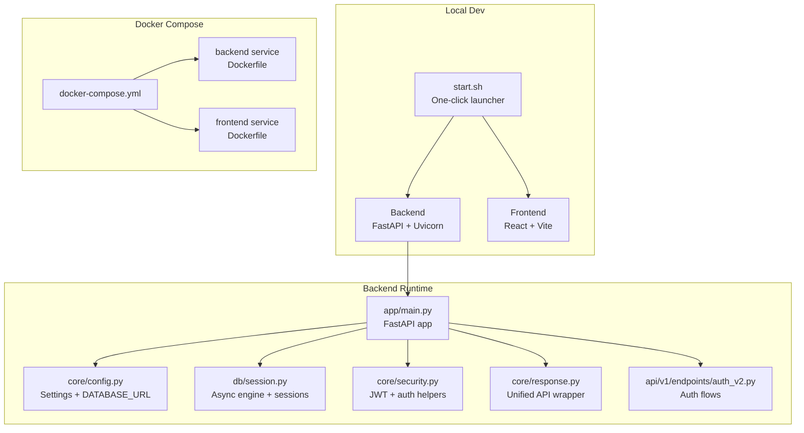
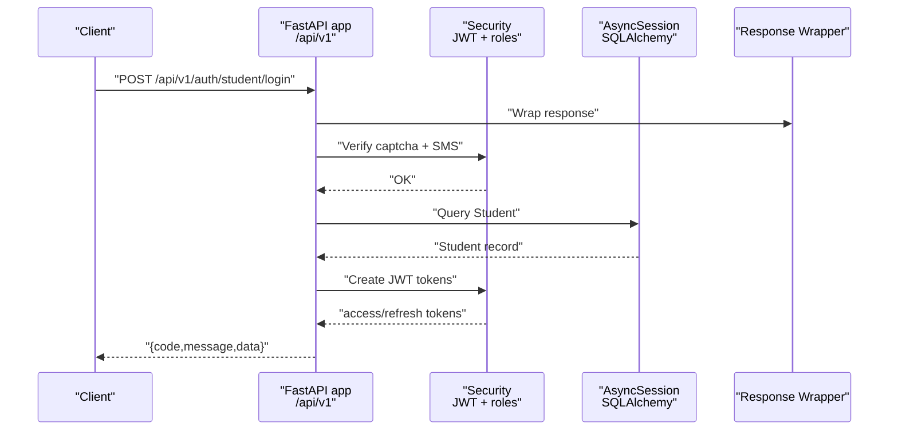
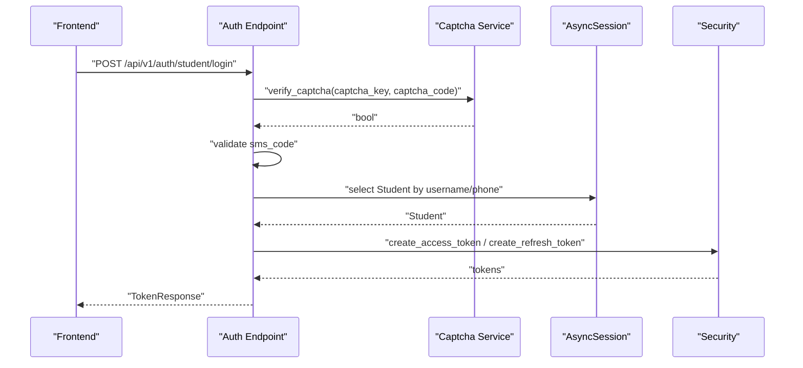
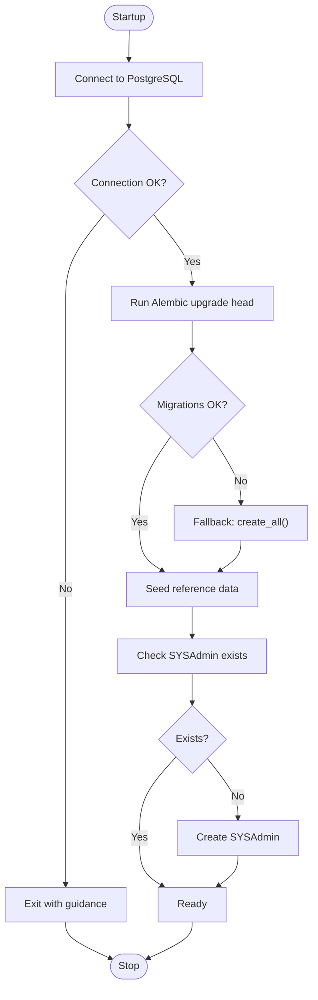
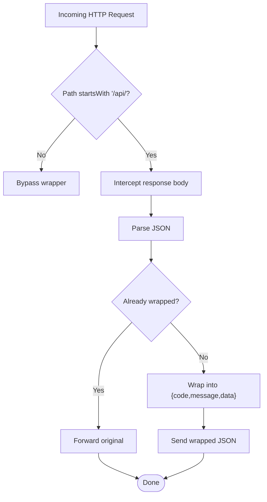
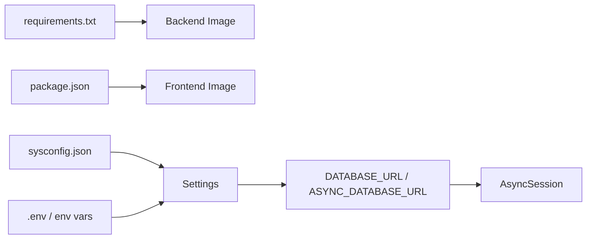

# Troubleshooting & FAQ

<cite>
**Referenced Files in This Document**
- [start.sh](file://start.sh)
- [docker-compose.yml](file://docker-compose.yml)
- [backend/app/main.py](file://backend/app/main.py)
- [backend/app/core/config.py](file://backend/app/core/config.py)
- [backend/app/db/session.py](file://backend/app/db/session.py)
- [backend/app/core/security.py](file://backend/app/core/security.py)
- [backend/app/core/response.py](file://backend/app/core/response.py)
- [backend/app/api/v1/endpoints/auth_v2.py](file://backend/app/api/v1/endpoints/auth_v2.py)
- [backend/Dockerfile](file://backend/Dockerfile)
- [frontend/Dockerfile](file://frontend/Dockerfile)
- [backend/requirements.txt](file://backend/requirements.txt)
- [frontend/package.json](file://frontend/package.json)
- [backend/sysconfig.json](file://backend/sysconfig.json)
</cite>

## Table of Contents
1. [Introduction](#introduction)
2. [Project Structure](#project-structure)
3. [Core Components](#core-components)
4. [Architecture Overview](#architecture-overview)
5. [Detailed Component Analysis](#detailed-component-analysis)
6. [Dependency Analysis](#dependency-analysis)
7. [Performance Considerations](#performance-considerations)
8. [Troubleshooting Guide](#troubleshooting-guide)
9. [Conclusion](#conclusion)
10. [Appendices](#appendices)

## Introduction
This document provides comprehensive troubleshooting and FAQ guidance for the RuiCheng Education Platform. It covers deployment issues, database connectivity, authentication failures, frontend build errors, API connectivity, performance tuning, memory optimization, scaling, and operational diagnostics. It also documents configuration options, environment variables, and escalation paths.

## Project Structure
The platform consists of:
- Backend service built with FastAPI and asynchronous SQLAlchemy, exposing a unified API with standardized responses and CORS.
- Frontend built with React and Vite, served during development.
- Deployment via Docker Compose for local development and Dockerfiles for containerized builds.
- Configuration loaded from a JSON file and environment variables, with Alembic migrations and seed data initialization.

**Diagram sources**
- [start.sh](file://start.sh)
- [docker-compose.yml](file://docker-compose.yml)
- [backend/app/main.py](file://backend/app/main.py)
- [backend/app/core/config.py](file://backend/app/core/config.py)
- [backend/app/db/session.py](file://backend/app/db/session.py)
- [backend/app/core/security.py](file://backend/app/core/security.py)
- [backend/app/core/response.py](file://backend/app/core/response.py)
- [backend/app/api/v1/endpoints/auth_v2.py](file://backend/app/api/v1/endpoints/auth_v2.py)
- [backend/Dockerfile](file://backend/Dockerfile)
- [frontend/Dockerfile](file://frontend/Dockerfile)

**Section sources**
- [start.sh](file://start.sh)
- [docker-compose.yml](file://docker-compose.yml)
- [backend/app/main.py](file://backend/app/main.py)
- [backend/app/core/config.py](file://backend/app/core/config.py)
- [backend/app/db/session.py](file://backend/app/db/session.py)
- [backend/app/core/security.py](file://backend/app/core/security.py)
- [backend/app/core/response.py](file://backend/app/core/response.py)
- [backend/app/api/v1/endpoints/auth_v2.py](file://backend/app/api/v1/endpoints/auth_v2.py)
- [backend/Dockerfile](file://backend/Dockerfile)
- [frontend/Dockerfile](file://frontend/Dockerfile)

## Core Components
- Configuration and Environment
  - Settings load from sysconfig.json and environment variables, building DATABASE_URL and ASYNC_DATABASE_URL for PostgreSQL connections.
  - Environment overrides include secret keys, database credentials, Redis, Celery broker/result backend, OCR settings, and model cache directories.
- Database Session Management
  - Asynchronous SQLAlchemy engine and session factory with automatic rollback on exceptions.
- Authentication and Security
  - Password hashing with bcrypt, JWT creation/verification, and role-based access checks.
  - Unified token extraction and user identity resolution across admin, teacher, question admin, and student roles.
- API Response Standardization
  - ASGI middleware wraps all /api/ responses into a consistent {code,message,data} structure, handling JSON content type and error wrapping.
- Health Endpoint
  - A simple GET /health endpoint indicates service readiness.

Key configuration locations:
- Settings and URLs: [backend/app/core/config.py](file://backend/app/core/config.py)
- Database engine/session: [backend/app/db/session.py](file://backend/app/db/session.py)
- Security helpers: [backend/app/core/security.py](file://backend/app/core/security.py)
- Response wrapper: [backend/app/core/response.py](file://backend/app/core/response.py)
- Health endpoint: [backend/app/main.py](file://backend/app/main.py)

**Section sources**
- [backend/app/core/config.py](file://backend/app/core/config.py)
- [backend/app/db/session.py](file://backend/app/db/session.py)
- [backend/app/core/security.py](file://backend/app/core/security.py)
- [backend/app/core/response.py](file://backend/app/core/response.py)
- [backend/app/main.py](file://backend/app/main.py)

## Architecture Overview
The system uses a layered architecture:
- Presentation Layer: FastAPI routes under /api/v1.
- Application Layer: Endpoints in endpoints/* orchestrate requests, validate inputs, and call services.
- Persistence Layer: Async SQLAlchemy ORM against PostgreSQL.
- Infrastructure: Docker Compose for local dev, shell script for one-click setup, Alembic migrations.

**Diagram sources**
- [backend/app/api/v1/endpoints/auth_v2.py](file://backend/app/api/v1/endpoints/auth_v2.py)
- [backend/app/core/security.py](file://backend/app/core/security.py)
- [backend/app/db/session.py](file://backend/app/db/session.py)
- [backend/app/core/response.py](file://backend/app/core/response.py)

## Detailed Component Analysis

### Authentication Flow (Student Login)
This flow demonstrates the typical authentication process, including captcha verification, SMS code validation, user lookup, and token issuance.

**Diagram sources**
- [backend/app/api/v1/endpoints/auth_v2.py](file://backend/app/api/v1/endpoints/auth_v2.py)
- [backend/app/core/security.py](file://backend/app/core/security.py)
- [backend/app/db/session.py](file://backend/app/db/session.py)

**Section sources**
- [backend/app/api/v1/endpoints/auth_v2.py](file://backend/app/api/v1/endpoints/auth_v2.py)
- [backend/app/core/security.py](file://backend/app/core/security.py)
- [backend/app/db/session.py](file://backend/app/db/session.py)

### Database Initialization and Migration
The startup process ensures the database is reachable, runs migrations, seeds reference data, and creates a system administrator account if missing.

**Diagram sources**
- [start.sh](file://start.sh)
- [backend/app/db/session.py](file://backend/app/db/session.py)

**Section sources**
- [start.sh](file://start.sh)
- [backend/app/db/session.py](file://backend/app/db/session.py)

### API Response Wrapping
All /api/ responses are wrapped into a consistent structure, ensuring uniform client-side handling and simplifying error propagation.

**Diagram sources**
- [backend/app/core/response.py](file://backend/app/core/response.py)

**Section sources**
- [backend/app/core/response.py](file://backend/app/core/response.py)

## Dependency Analysis
- Backend runtime dependencies are declared in requirements.txt and installed in the backend Docker image.
- Frontend dependencies are declared in package.json and installed in the frontend Docker image.
- The backend loads settings from sysconfig.json and environment variables, constructing database and Redis URLs.

**Diagram sources**
- [backend/requirements.txt](file://backend/requirements.txt)
- [frontend/package.json](file://frontend/package.json)
- [backend/app/core/config.py](file://backend/app/core/config.py)
- [backend/app/db/session.py](file://backend/app/db/session.py)

**Section sources**
- [backend/requirements.txt](file://backend/requirements.txt)
- [frontend/package.json](file://frontend/package.json)
- [backend/app/core/config.py](file://backend/app/core/config.py)
- [backend/app/db/session.py](file://backend/app/db/session.py)

## Performance Considerations
- Database concurrency
  - Use asynchronous SQLAlchemy to handle concurrent requests efficiently.
  - Tune connection pool settings via engine parameters if needed.
- OCR and grading throughput
  - Adjust max_concurrent_ocr and max_concurrent_grading in sysconfig.json to match hardware capacity.
- Memory optimization
  - Limit upload sizes and enforce MAX_UPLOAD_SIZE to prevent memory spikes.
  - Monitor Redis/Celery memory usage; configure retention policies and worker scaling.
- Scaling
  - Scale backend replicas behind a reverse proxy; ensure shared Redis for Celery.
  - Use SQLite in development (via docker-compose) or migrate to managed PostgreSQL for production.

[No sources needed since this section provides general guidance]

## Troubleshooting Guide

### 1) Deployment Problems

- Issue: Backend fails to start locally
  - Verify Python environment and dependencies:
    - Ensure Conda environment exists and requirements are installed.
    - Confirm sysconfig.json exists and database section is valid.
  - Check logs and exit conditions after uvicorn spawn.
  - Validate health endpoint readiness before proceeding.
  - References:
    - [start.sh](file://start.sh)
    - [backend/app/main.py](file://backend/app/main.py)

- Issue: Frontend fails to start or compile
  - Install frontend dependencies if missing.
  - Allow sufficient time for Vite dev server to bundle; it may take longer than the backend.
  - References:
    - [start.sh](file://start.sh)
    - [frontend/package.json](file://frontend/package.json)

- Issue: Docker Compose services fail to start
  - Ensure ports 8000 and 3000 are free or adjust host bindings.
  - Confirm volumes mount correctly and backend/edu_system.db is accessible.
  - References:
    - [docker-compose.yml](file://docker-compose.yml)
    - [backend/Dockerfile](file://backend/Dockerfile)
    - [frontend/Dockerfile](file://frontend/Dockerfile)

**Section sources**
- [start.sh](file://start.sh)
- [docker-compose.yml](file://docker-compose.yml)
- [backend/Dockerfile](file://backend/Dockerfile)
- [frontend/Dockerfile](file://frontend/Dockerfile)
- [frontend/package.json](file://frontend/package.json)
- [backend/app/main.py](file://backend/app/main.py)

### 2) Database Connection Issues

- Symptom: Cannot connect to PostgreSQL
  - Confirm database host, port, user, and password in sysconfig.json.
  - Ensure PostgreSQL is running and accepts connections.
  - The script attempts to create the target database if it does not exist.
  - References:
    - [start.sh](file://start.sh)
    - [backend/app/core/config.py](file://backend/app/core/config.py)
    - [backend/app/db/session.py](file://backend/app/db/session.py)

- Symptom: Alembic migration fails
  - The script falls back to creating tables directly if migrations fail.
  - Validate DATABASE_URL construction and network access to the database host.
  - References:
    - [start.sh](file://start.sh)
    - [backend/app/core/config.py](file://backend/app/core/config.py)
    - [backend/app/db/session.py](file://backend/app/db/session.py)

- Symptom: Operational errors during seeding
  - Startup seeds reference data; warnings indicate potential duplicates or partial failures.
  - References:
    - [backend/app/main.py](file://backend/app/main.py)
    - [start.sh](file://start.sh)

**Section sources**
- [start.sh](file://start.sh)
- [backend/app/core/config.py](file://backend/app/core/config.py)
- [backend/app/db/session.py](file://backend/app/db/session.py)
- [backend/app/main.py](file://backend/app/main.py)

### 3) Authentication Failures

Common symptoms and resolutions:
- Incorrect username/phone or password
  - Ensure correct credentials; passwords are hashed and verified server-side.
  - References:
    - [backend/app/api/v1/endpoints/auth_v2.py](file://backend/app/api/v1/endpoints/auth_v2.py)
    - [backend/app/core/security.py](file://backend/app/core/security.py)

- Captcha or SMS verification failure
  - Verify captcha_key/captcha_code pair and SMS code.
  - References:
    - [backend/app/api/v1/endpoints/auth_v2.py](file://backend/app/api/v1/endpoints/auth_v2.py)

- Account disabled or expired verification
  - Disabled accounts return forbidden; verify tokens must not be expired.
  - References:
    - [backend/app/api/v1/endpoints/auth_v2.py](file://backend/app/api/v1/endpoints/auth_v2.py)

- Token decoding errors
  - Invalid/expired tokens trigger credential validation failures.
  - References:
    - [backend/app/core/security.py](file://backend/app/core/security.py)

- Role mismatch
  - Ensure the requested role matches the user’s actual role.
  - References:
    - [backend/app/api/v1/endpoints/auth_v2.py](file://backend/app/api/v1/endpoints/auth_v2.py)

**Section sources**
- [backend/app/api/v1/endpoints/auth_v2.py](file://backend/app/api/v1/endpoints/auth_v2.py)
- [backend/app/core/security.py](file://backend/app/core/security.py)

### 4) API Connectivity Issues

- Problem: /health endpoint unreachable
  - Check backend logs for startup errors; confirm port binding and firewall rules.
  - References:
    - [backend/app/main.py](file://backend/app/main.py)
    - [start.sh](file://start.sh)

- Problem: Unexpected error responses
  - All /api/ responses are wrapped; inspect the code/message/data fields.
  - References:
    - [backend/app/core/response.py](file://backend/app/core/response.py)

**Section sources**
- [backend/app/main.py](file://backend/app/main.py)
- [backend/app/core/response.py](file://backend/app/core/response.py)
- [start.sh](file://start.sh)

### 5) Frontend Compilation Errors

- Problem: npm install fails or dev server crashes
  - Install dependencies per package.json and retry.
  - Clear node_modules and reinstall if corrupted.
  - References:
    - [frontend/package.json](file://frontend/package.json)
    - [start.sh](file://start.sh)

- Problem: Blank page or hot reload issues
  - Allow Vite to finish bundling; the script waits longer for frontend readiness.
  - References:
    - [start.sh](file://start.sh)

**Section sources**
- [frontend/package.json](file://frontend/package.json)
- [start.sh](file://start.sh)

### 6) Performance Troubleshooting

- Slow OCR or grading
  - Reduce max_concurrent_ocr and max_concurrent_grading in sysconfig.json.
  - References:
    - [backend/sysconfig.json](file://backend/sysconfig.json)

- High memory usage
  - Enforce upload limits and monitor Redis/Celery memory.
  - References:
    - [backend/app/core/config.py](file://backend/app/core/config.py)

- Database contention
  - Use asynchronous sessions and tune pool settings if needed.
  - References:
    - [backend/app/db/session.py](file://backend/app/db/session.py)

**Section sources**
- [backend/sysconfig.json](file://backend/sysconfig.json)
- [backend/app/core/config.py](file://backend/app/core/config.py)
- [backend/app/db/session.py](file://backend/app/db/session.py)

### 7) System Maintenance Procedures

- Reset admin credentials
  - The script seeds a system administrator account if missing; manage via admin endpoints.
  - References:
    - [start.sh](file://start.sh)
    - [backend/app/api/v1/endpoints/auth_v2.py](file://backend/app/api/v1/endpoints/auth_v2.py)

- Recreate database schema
  - Alembic upgrade head or fallback to create_all().
  - References:
    - [start.sh](file://start.sh)
    - [backend/app/db/session.py](file://backend/app/db/session.py)

**Section sources**
- [start.sh](file://start.sh)
- [backend/app/db/session.py](file://backend/app/db/session.py)
- [backend/app/api/v1/endpoints/auth_v2.py](file://backend/app/api/v1/endpoints/auth_v2.py)

### 8) Diagnostic Procedures and Log Analysis

- Backend health and readiness
  - Use /health endpoint to confirm service status.
  - References:
    - [backend/app/main.py](file://backend/app/main.py)

- Unified error reporting
  - Inspect standardized error responses for code/message/detail/data.
  - References:
    - [backend/app/core/response.py](file://backend/app/core/response.py)

- Environment and configuration
  - Verify DATABASE_URL and ASYNC_DATABASE_URL construction.
  - References:
    - [backend/app/core/config.py](file://backend/app/core/config.py)

**Section sources**
- [backend/app/main.py](file://backend/app/main.py)
- [backend/app/core/response.py](file://backend/app/core/response.py)
- [backend/app/core/config.py](file://backend/app/core/config.py)

### 9) Frequently Asked Questions (FAQ)

- Q: How do I change the database connection?
  - A: Update sysconfig.json database section or set environment variables for overrides.
  - References:
    - [backend/app/core/config.py](file://backend/app/core/config.py)
    - [backend/sysconfig.json](file://backend/sysconfig.json)

- Q: How do I enable production-grade logging?
  - A: Adjust system.log_level in sysconfig.json or set LOG_LEVEL via environment.
  - References:
    - [backend/sysconfig.json](file://backend/sysconfig.json)

- Q: How do I scale the backend?
  - A: Run multiple backend instances behind a reverse proxy; ensure shared Redis for Celery.
  - References:
    - [docker-compose.yml](file://docker-compose.yml)
    - [backend/app/core/config.py](file://backend/app/core/config.py)

- Q: How do I reset the admin password?
  - A: Manage admin accounts via admin endpoints; seed script creates initial SYSAdmin.
  - References:
    - [start.sh](file://start.sh)
    - [backend/app/api/v1/endpoints/auth_v2.py](file://backend/app/api/v1/endpoints/auth_v2.py)

- Q: Why is the frontend taking so long to start?
  - A: Vite dev server needs time to compile; wait and check console logs.
  - References:
    - [start.sh](file://start.sh)

**Section sources**
- [backend/app/core/config.py](file://backend/app/core/config.py)
- [backend/sysconfig.json](file://backend/sysconfig.json)
- [docker-compose.yml](file://docker-compose.yml)
- [start.sh](file://start.sh)
- [backend/app/api/v1/endpoints/auth_v2.py](file://backend/app/api/v1/endpoints/auth_v2.py)

## Conclusion
This guide consolidates practical steps to diagnose and resolve common issues across deployment, database connectivity, authentication, API behavior, frontend compilation, performance, and maintenance. Use the referenced files and sections to quickly locate configuration and runtime details for targeted fixes.

## Appendices

### A) Support Resources and Escalation
- Internal escalation: Contact the platform maintainer team.
- Community channels: Not specified in the repository; coordinate internally for support.

[No sources needed since this section provides general guidance]