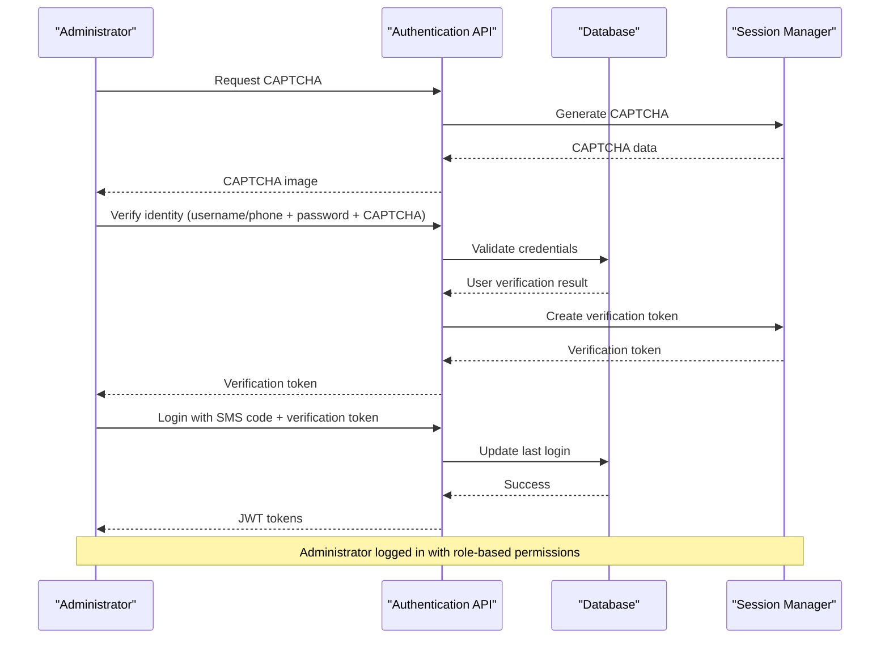
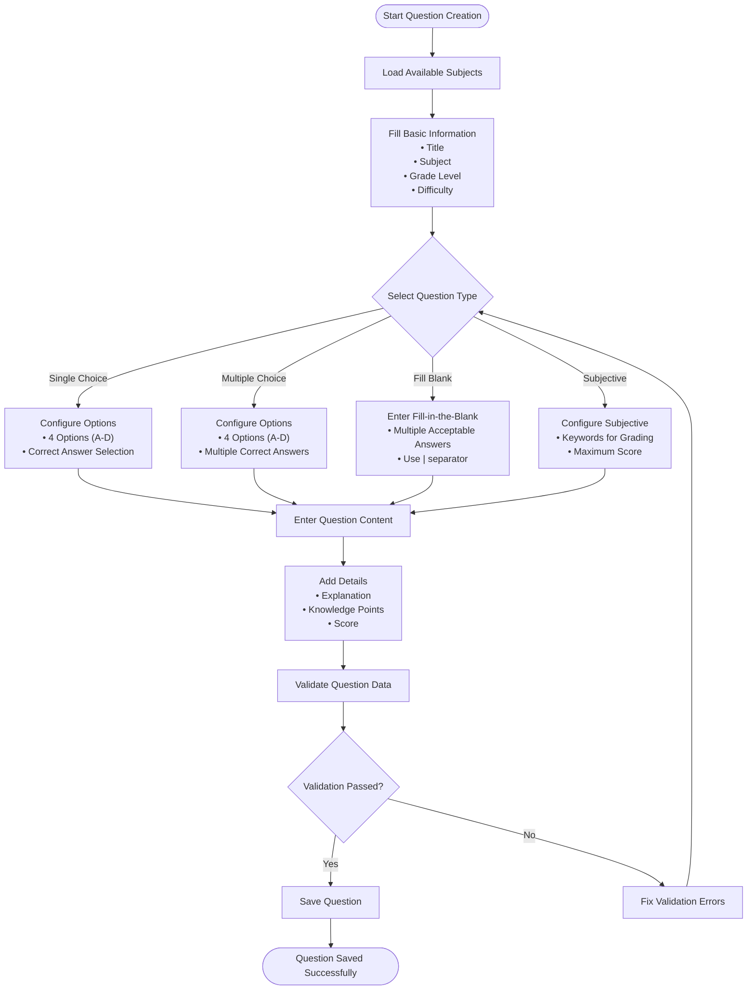
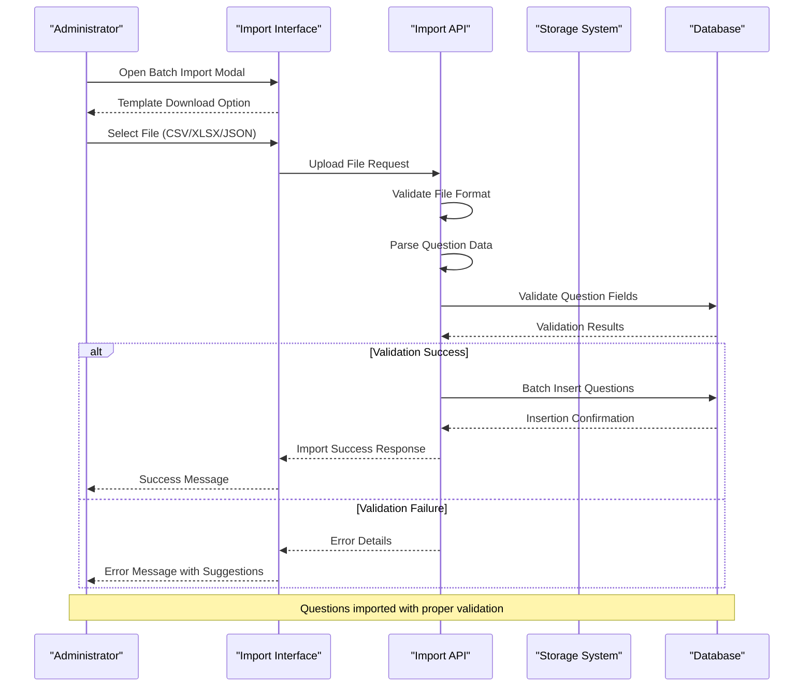
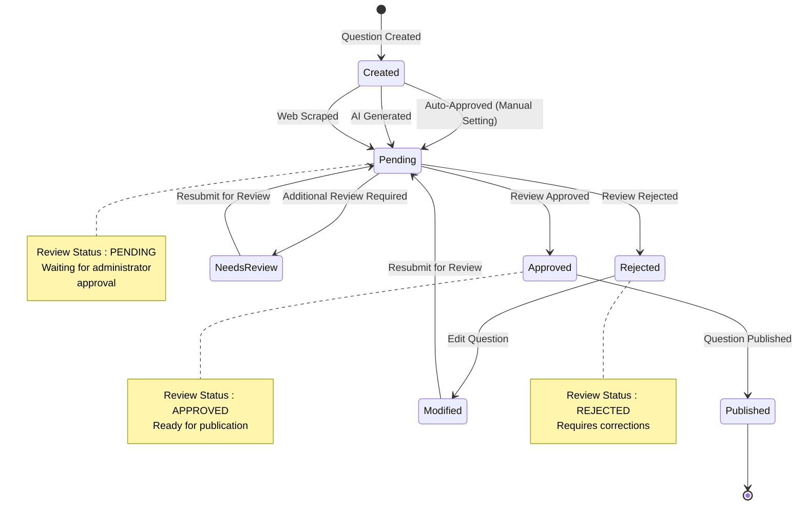
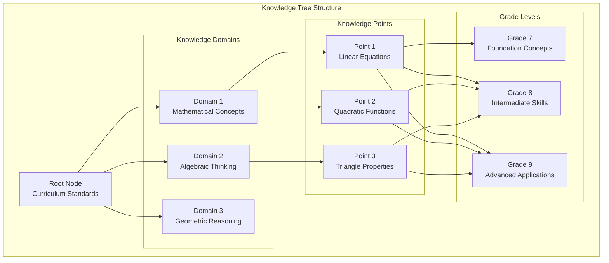
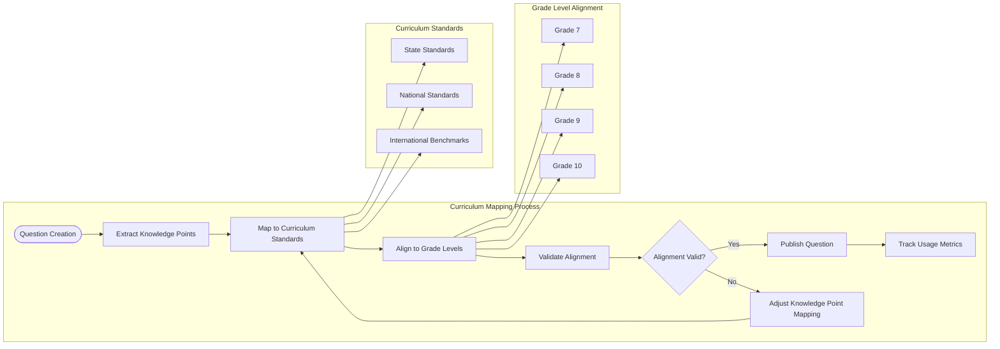
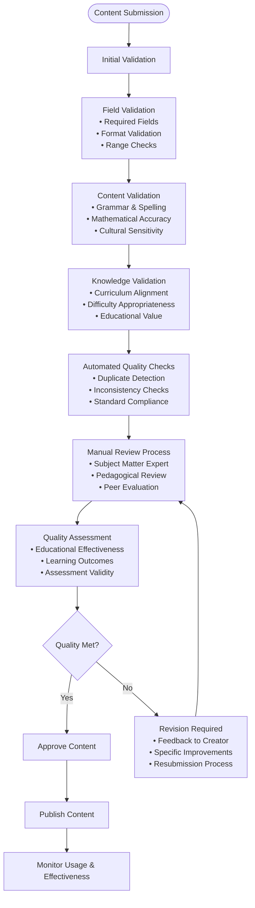

# Question Administrator Guide

<cite>
**Referenced Files in This Document**
- [question_admin.py](file://backend/app/api/v1/endpoints/question_admin.py)
- [QuestionAdminPage.tsx](file://frontend/src/pages/admin/QuestionAdminPage.tsx)
- [knowledge_tree.py](file://backend/app/api/v1/endpoints/knowledge_tree.py)
- [KnowledgeTreePage.tsx](file://frontend/src/pages/admin/KnowledgeTreePage.tsx)
- [questions.py](file://backend/app/api/v1/endpoints/questions.py)
- [QuestionListPage.tsx](file://frontend/src/pages/questions/QuestionListPage.tsx)
- [BatchImportModal.tsx](file://frontend/src/pages/questions/BatchImportModal.tsx)
- [QuestionEditModal.tsx](file://frontend/src/pages/questions/QuestionEditModal.tsx)
- [question.py](file://backend/app/models/question.py)
- [question.py](file://backend/app/schemas/question.py)
- [auth_v2.py](file://backend/app/api/v1/endpoints/auth_v2.py)
- [admin.py](file://backend/app/models/admin.py)
- [dedup_service.py](file://backend/app/services/dedup_service.py)
</cite>

## Table of Contents
1. [Introduction](#introduction)
2. [Getting Started](#getting-started)
3. [Login and Authentication](#login-and-authentication)
4. [Question Creation and Editing](#question-creation-and-editing)
5. [Bulk Operations](#bulk-operations)
6. [Content Review and Approval](#content-review-and-approval)
7. [Knowledge Tree Management](#knowledge-tree-management)
8. [Curriculum Alignment](#curriculum-alignment)
9. [Quality Assurance Procedures](#quality-assurance-procedures)
10. [Administrative Workflows](#administrative-workflows)
11. [Troubleshooting Guide](#troubleshooting-guide)
12. [Best Practices](#best-practices)
13. [Conclusion](#conclusion)

## Introduction

The Ruicheng Educational Management System provides a comprehensive platform for question administrators to manage educational content effectively. This guide covers the complete workflow for question administrators, including login procedures, question management, batch operations, content review and approval processes, knowledge tree maintenance, and quality assurance procedures.

The system supports multiple question generation methods including AI-powered generation, web scraping, and manual creation, providing flexibility for different content creation scenarios. Administrators can efficiently manage question banks while maintaining educational standards and curriculum alignment.

## Getting Started

### Accessing the Question Administrator Portal

The question administrator portal provides a centralized interface for managing all question-related activities within the educational management system. The portal offers intuitive navigation and comprehensive tools for content management.

**Section sources**
- [QuestionAdminPage.tsx:17-396](file://frontend/src/pages/admin/QuestionAdminPage.tsx#L17-L396)

## Login and Authentication

### Secure Authentication Process

The system implements a secure multi-factor authentication process specifically designed for administrators. The authentication flow ensures that only authorized personnel can access the question administrator functions.

**Diagram sources**
- [auth_v2.py:91-183](file://backend/app/api/v1/endpoints/auth_v2.py#L91-L183)

### Role-Based Access Control

The authentication system supports three primary administrator roles with distinct permission levels:

- **Teacher (0)**: Limited access for content creation and basic management
- **Question Administrator (1)**: Full access to question management and review functions
- **System Administrator (2)**: Complete system access with administrative privileges

**Section sources**
- [auth_v2.py:25-53](file://backend/app/api/v1/endpoints/auth_v2.py#L25-L53)
- [admin.py:19](file://backend/app/models/admin.py#L19)

## Question Creation and Editing

### Creating New Questions

The question creation process provides a comprehensive interface for administrators to add new educational content to the question bank. The system supports various question types with specialized input formats.

**Diagram sources**
- [QuestionEditModal.tsx:105-139](file://frontend/src/pages/questions/QuestionEditModal.tsx#L105-L139)

### Question Types and Formats

The system supports four primary question types with specific formatting requirements:

**Single Choice Questions**: Require exactly four options with one correct answer selection.

**Multiple Choice Questions**: Support multiple correct answers from available options.

**Fill-in-the-Blank Questions**: Allow multiple acceptable answers separated by pipe characters.

**Subjective Questions**: Require keyword-based grading with maximum score configuration.

**Section sources**
- [QuestionEditModal.tsx:186-220](file://frontend/src/pages/questions/QuestionEditModal.tsx#L186-L220)
- [question.py:15-16](file://backend/app/models/question.py#L15-L16)

### Advanced Question Features

The question management system includes several advanced features for comprehensive content control:

- **Knowledge Point Mapping**: Associate questions with specific curriculum topics
- **Curriculum Alignment**: Link questions to grade levels and subjects
- **Content Hashing**: Automatic duplicate detection capabilities
- **Review Status Tracking**: Comprehensive approval workflow management

**Section sources**
- [QuestionEditModal.tsx:109-123](file://frontend/src/pages/questions/QuestionEditModal.tsx#L109-L123)
- [question.py:22-23](file://backend/app/models/question.py#L22-L23)

## Bulk Operations

### Batch Import Functionality

The system provides robust batch import capabilities for efficient question management. Administrators can process large volumes of questions through supported file formats.

**Diagram sources**
- [BatchImportModal.tsx:17-33](file://frontend/src/pages/questions/BatchImportModal.tsx#L17-L33)
- [questions.py:127-155](file://backend/app/api/v1/endpoints/questions.py#L127-L155)

### Supported Import Formats

The batch import system accepts multiple file formats with standardized templates:

**CSV Format**: Comma-separated values with header row containing field names
**Excel Format**: XLSX/XLS spreadsheet files with properly formatted data
**JSON Format**: Structured JSON arrays with question objects

**Section sources**
- [BatchImportModal.tsx:35-40](file://frontend/src/pages/questions/BatchImportModal.tsx#L35-L40)
- [BatchImportModal.tsx:42-49](file://frontend/src/pages/questions/BatchImportModal.tsx#L42-L49)

### Export Capabilities

The system provides flexible export options for question data management:

- **Individual Question Export**: Export single questions with complete metadata
- **Filtered Export**: Export questions based on specific criteria and filters
- **Bulk Export**: Export large question datasets for external processing

**Section sources**
- [QuestionListPage.tsx:101-126](file://frontend/src/pages/questions/QuestionListPage.tsx#L101-L126)
- [questions.py:158-214](file://backend/app/api/v1/endpoints/questions.py#L158-L214)

## Content Review and Approval

### Review Workflow Process

The content review and approval system ensures quality standards are maintained across all question content. The workflow includes automated checks and manual review processes.

**Diagram sources**
- [question_admin.py:222-284](file://backend/app/api/v1/endpoints/question_admin.py#L222-L284)

### Review Management Interface

The review interface provides comprehensive tools for administrators to efficiently process question submissions:

**Bulk Review Operations**: Approve or reject multiple questions simultaneously
**Advanced Filtering**: Filter questions by type, difficulty, subject, and other criteria
**Search Functionality**: Quickly locate specific questions for review
**Status Tracking**: Monitor review queue and pending items

**Section sources**
- [QuestionAdminPage.tsx:399-544](file://frontend/src/pages/admin/QuestionAdminPage.tsx#L399-L544)
- [question_admin.py:222-265](file://backend/app/api/v1/endpoints/question_admin.py#L222-L265)

### Quality Control Features

The review system includes several quality control mechanisms:

- **Automated Duplicate Detection**: Identifies similar questions during import
- **Content Validation**: Ensures questions meet formatting and completeness requirements
- **Knowledge Point Verification**: Validates curriculum alignment
- **Difficulty Assessment**: Consistent difficulty rating across question types

**Section sources**
- [question_admin.py:499-529](file://backend/app/api/v1/endpoints/question_admin.py#L499-L529)
- [dedup_service.py:63-113](file://backend/app/services/dedup_service.py#L63-L113)

## Knowledge Tree Management

### Knowledge Structure Organization

The knowledge tree management system provides hierarchical organization of educational content aligned with curriculum standards. This structure enables precise mapping between questions and learning objectives.

**Diagram sources**
- [knowledge_tree.py:16-34](file://backend/app/api/v1/endpoints/knowledge_tree.py#L16-L34)

### Tree Management Operations

The knowledge tree management interface supports comprehensive operations for maintaining educational content hierarchy:

**Node Creation**: Add new knowledge domains and points with proper categorization
**Hierarchical Organization**: Establish parent-child relationships for logical grouping
**Status Management**: Activate or deactivate nodes for curriculum alignment
**Version Control**: Maintain historical versions for tracking curriculum changes

**Section sources**
- [KnowledgeTreePage.tsx:78-128](file://frontend/src/pages/admin/KnowledgeTreePage.tsx#L78-L128)
- [knowledge_tree.py:67-94](file://backend/app/api/v1/endpoints/knowledge_tree.py#L67-L94)

### Curriculum Alignment Features

The knowledge tree system provides sophisticated curriculum alignment capabilities:

- **Multi-grade Support**: Questions can be mapped to multiple grade levels
- **Subject Integration**: Seamless integration with subject-specific content
- **Standard Compliance**: Alignment with educational standards and frameworks
- **Progressive Learning**: Logical progression from foundational to advanced concepts

**Section sources**
- [KnowledgeTreePage.tsx:54-76](file://frontend/src/pages/admin/KnowledgeTreePage.tsx#L54-L76)
- [knowledge_tree.py:37-64](file://backend/app/api/v1/endpoints/knowledge_tree.py#L37-L64)

## Curriculum Alignment

### Mapping Questions to Curriculum Standards

The curriculum alignment system ensures all questions correspond to appropriate educational standards and learning objectives. This systematic approach maintains educational quality and consistency.

**Diagram sources**
- [QuestionEditModal.tsx:109-123](file://frontend/src/pages/questions/QuestionEditModal.tsx#L109-L123)
- [question.py:18](file://backend/app/models/question.py#L18)

### Standards-Based Question Classification

The system implements comprehensive standards-based classification for educational content:

**Standard Categories**: Mathematics, Science, Language Arts, Social Studies
**Grade Band Alignment**: Elementary, Middle School, High School
**Learning Objective Mapping**: Specific skills and competencies
**Assessment Alignment**: Direct correlation to assessment standards

**Section sources**
- [QuestionAdminPage.tsx:113-139](file://frontend/src/pages/admin/QuestionAdminPage.tsx#L113-L139)
- [knowledge_tree.py:199-250](file://backend/app/api/v1/endpoints/knowledge_tree.py#L199-L250)

## Quality Assurance Procedures

### Content Validation Processes

The quality assurance system implements comprehensive validation processes to ensure educational content meets established standards and requirements.

**Diagram sources**
- [question_admin.py:499-530](file://backend/app/api/v1/endpoints/question_admin.py#L499-L530)
- [dedup_service.py:63-113](file://backend/app/services/dedup_service.py#L63-L113)

### Duplicate Detection and Prevention

The system includes sophisticated duplicate detection mechanisms to prevent redundant content in the question bank:

**Content Hashing**: Unique fingerprints for question content
**Similarity Analysis**: Advanced algorithms for near-duplicate detection
**Threshold Configuration**: Adjustable similarity thresholds for detection
**Group Management**: Automatic grouping of similar questions

**Section sources**
- [question_admin.py:730-797](file://backend/app/api/v1/endpoints/question_admin.py#L730-L797)
- [dedup_service.py:55-61](file://backend/app/services/dedup_service.py#L55-L61)

### Review Statistics and Analytics

The quality assurance system provides comprehensive analytics for monitoring content quality and review effectiveness:

- **Review Volume Tracking**: Daily/weekly/monthly submission statistics
- **Approval Rate Monitoring**: Quality assessment metrics
- **Content Performance Analytics**: Usage and effectiveness data
- **Reviewer Productivity Reports**: Individual and team performance metrics

**Section sources**
- [question_admin.py:346-412](file://backend/app/api/v1/endpoints/question_admin.py#L346-L412)

## Administrative Workflows

### Daily Administrative Tasks

The question administrator workflow encompasses daily tasks essential for maintaining an effective question management system.

**Section sources**
- [QuestionAdminPage.tsx:17-47](file://frontend/src/pages/admin/QuestionAdminPage.tsx#L17-L47)

### Weekly Review Cycles

Regular review cycles ensure content remains current and relevant:

**Pending Content Review**: Daily review of newly submitted questions
**Quality Auditing**: Weekly quality assessment of existing content
**Curriculum Updates**: Monthly alignment with educational standards
**Performance Analysis**: Bi-weekly analysis of content effectiveness

**Section sources**
- [QuestionAdminPage.tsx:88-90](file://frontend/src/pages/admin/QuestionAdminPage.tsx#L88-L90)
- [question_admin.py:346-412](file://backend/app/api/v1/endpoints/question_admin.py#L346-L412)

### Monthly Administrative Activities

Monthly activities focus on strategic content management and system optimization:

- **Content Audit**: Comprehensive review of question quality and relevance
- **System Maintenance**: Database optimization and performance tuning
- **Team Training**: Administrator training and skill development
- **Policy Updates**: Review and update of content policies and procedures

**Section sources**
- [knowledge_tree.py:199-250](file://backend/app/api/v1/endpoints/knowledge_tree.py#L199-L250)

## Troubleshooting Guide

### Common Administrator Issues

This section addresses frequently encountered issues and their solutions for question administrators.

### Login and Authentication Problems

**Issue**: Unable to receive verification code
**Solution**: Verify SMS service configuration and network connectivity

**Issue**: CAPTCHA validation failures
**Solution**: Clear browser cache and retry authentication process

**Issue**: Account locked after failed attempts
**Solution**: Contact system administrator for account recovery

**Section sources**
- [auth_v2.py:149-183](file://backend/app/api/v1/endpoints/auth_v2.py#L149-L183)

### Question Management Issues

**Issue**: Questions not appearing in search results
**Solution**: Check review status and ensure questions are approved

**Issue**: Import errors with CSV files
**Solution**: Verify file format matches template specifications

**Issue**: Knowledge point mapping not working
**Solution**: Confirm knowledge tree is properly configured and active

**Section sources**
- [QuestionListPage.tsx:61-79](file://frontend/src/pages/questions/QuestionListPage.tsx#L61-L79)
- [BatchImportModal.tsx:28-33](file://frontend/src/pages/questions/BatchImportModal.tsx#L28-L33)

### Review Process Challenges

**Issue**: Review queue not updating
**Solution**: Refresh page and check database connection status

**Issue**: Bulk approval operations failing
**Solution**: Verify selection criteria and try smaller batches

**Issue**: Approval notifications not received
**Solution**: Check email configuration and notification settings

**Section sources**
- [QuestionAdminPage.tsx:469-482](file://frontend/src/pages/admin/QuestionAdminPage.tsx#L469-L482)
- [question_admin.py:306-343](file://backend/app/api/v1/endpoints/question_admin.py#L306-L343)

### Knowledge Tree Maintenance Issues

**Issue**: Knowledge tree not displaying correctly
**Solution**: Check node activation status and parent-child relationships

**Issue**: Version rollback not working
**Solution**: Verify version history and rollback permissions

**Issue**: Node modifications not saving
**Solution**: Check write permissions and database connectivity

**Section sources**
- [KnowledgeTreePage.tsx:111-118](file://frontend/src/pages/admin/KnowledgeTreePage.tsx#L111-L118)
- [knowledge_tree.py:253-319](file://backend/app/api/v1/endpoints/knowledge_tree.py#L253-L319)

## Best Practices

### Content Creation Guidelines

**Consistency**: Maintain consistent formatting and presentation across all questions
**Clarity**: Ensure questions are clear, unambiguous, and free from bias
**Educational Value**: Focus on questions that promote meaningful learning outcomes
**Accessibility**: Design questions accessible to diverse learner needs

### Review Process Standards

**Timeliness**: Process questions within established timeframes
**Documentation**: Maintain detailed records of review decisions and rationale
**Quality**: Apply consistent quality standards across all content types
**Feedback**: Provide constructive feedback for rejected content

### Knowledge Mapping Strategies

**Precision**: Map questions to specific, well-defined knowledge points
**Hierarchy**: Maintain logical hierarchical relationships in knowledge trees
**Completeness**: Ensure comprehensive coverage of curriculum standards
**Alignment**: Regularly align knowledge maps with educational standards

### Administrative Efficiency

**Automation**: Leverage automated tools for routine tasks and validations
**Documentation**: Maintain comprehensive documentation of procedures and policies
**Training**: Regular training on system updates and new features
**Collaboration**: Foster collaboration between administrators and educators

## Conclusion

The Ruicheng Educational Management System provides question administrators with a comprehensive toolkit for effective educational content management. Through secure authentication, robust question creation and editing capabilities, efficient bulk operations, thorough review and approval processes, and sophisticated knowledge tree management, administrators can maintain high-quality educational resources.

The system's emphasis on quality assurance, curriculum alignment, and administrative efficiency ensures that educational content meets established standards while supporting effective teaching and learning outcomes. Regular maintenance, adherence to best practices, and systematic troubleshooting approaches will help administrators maximize the system's potential for educational excellence.

By following the workflows and guidelines outlined in this document, question administrators can confidently manage their educational content while maintaining the highest standards of quality and educational value.