# Student Guide

<cite>
**Referenced Files in This Document**
- [DashboardPage.tsx](file://frontend/src/pages/dashboard/DashboardPage.tsx)
- [LoginPage.tsx](file://frontend/src/pages/auth/LoginPage.tsx)
- [QuestionListPage.tsx](file://frontend/src/pages/questions/QuestionListPage.tsx)
- [PaperListPage.tsx](file://frontend/src/pages/papers/PaperListPage.tsx)
- [MistakeBookPage.tsx](file://frontend/src/pages/mistake-book/MistakeBookPage.tsx)
- [OnlineAnswerTab.tsx](file://frontend/src/pages/exam-mistakes/OnlineAnswerTab.tsx)
- [PhotoScanTab.tsx](file://frontend/src/pages/exam-mistakes/PhotoScanTab.tsx)
- [TypicalQuestionsPage.tsx](file://frontend/src/pages/TypicalQuestionsPage.tsx)
- [student.py](file://backend/app/api/v1/endpoints/student.py)
- [answers.py](file://backend/app/api/v1/endpoints/answers.py)
- [error_notebooks.py](file://backend/app/api/v1/endpoints/error_notebooks.py)
- [ocr.py](file://backend/app/api/v1/endpoints/ocr.py)
- [questions.py](file://backend/app/api/v1/endpoints/questions.py)
- [exam_papers.py](file://backend/app/api/v1/endpoints/exam_papers.py)
</cite>

## Table of Contents
1. [Introduction](#introduction)
2. [Project Structure](#project-structure)
3. [Core Components](#core-components)
4. [Architecture Overview](#architecture-overview)
5. [Detailed Component Analysis](#detailed-component-analysis)
6. [Dependency Analysis](#dependency-analysis)
7. [Performance Considerations](#performance-considerations)
8. [Troubleshooting Guide](#troubleshooting-guide)
9. [Conclusion](#conclusion)
10. [Appendices](#appendices)

## Introduction
This student user guide explains how to use the Ruicheng Educational Management System for daily study tasks. It covers logging in, navigating the dashboard, browsing questions, practicing with online exams, submitting answers (online or via photo scan), reviewing performance, managing error books, and exploring typical questions. It also includes best practices, navigation tips, and troubleshooting advice for common issues.

## Project Structure
The system consists of:
- Frontend (React + Ant Design): Provides the student-facing UI for login, dashboard, question browsing, exam taking, OCR photo scanning, and error book management.
- Backend (FastAPI): Implements APIs for student statistics, exam papers, answer submission, OCR processing, and error book generation.

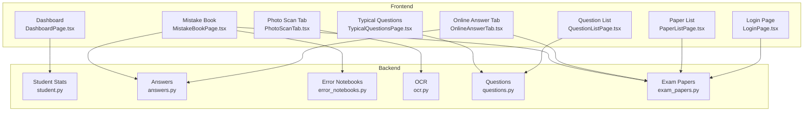

**Diagram sources**
- [LoginPage.tsx:11-217](file://frontend/src/pages/auth/LoginPage.tsx#L11-L217)
- [DashboardPage.tsx:14-580](file://frontend/src/pages/dashboard/DashboardPage.tsx#L14-L580)
- [QuestionListPage.tsx:31-259](file://frontend/src/pages/questions/QuestionListPage.tsx#L31-L259)
- [PaperListPage.tsx:13-169](file://frontend/src/pages/papers/PaperListPage.tsx#L13-L169)
- [MistakeBookPage.tsx:13-637](file://frontend/src/pages/mistake-book/MistakeBookPage.tsx#L13-L637)
- [OnlineAnswerTab.tsx:16-317](file://frontend/src/pages/exam-mistakes/OnlineAnswerTab.tsx#L16-L317)
- [PhotoScanTab.tsx:11-186](file://frontend/src/pages/exam-mistakes/PhotoScanTab.tsx#L11-L186)
- [TypicalQuestionsPage.tsx:10-95](file://frontend/src/pages/TypicalQuestionsPage.tsx#L10-L95)
- [student.py:16-112](file://backend/app/api/v1/endpoints/student.py#L16-L112)
- [answers.py:115-197](file://backend/app/api/v1/endpoints/answers.py#L115-L197)
- [error_notebooks.py:22-59](file://backend/app/api/v1/endpoints/error_notebooks.py#L22-L59)
- [ocr.py:18-64](file://backend/app/api/v1/endpoints/ocr.py#L18-L64)
- [questions.py:367-431](file://backend/app/api/v1/endpoints/questions.py#L367-L431)
- [exam_papers.py:362-414](file://backend/app/api/v1/endpoints/exam_papers.py#L362-L414)

**Section sources**
- [DashboardPage.tsx:14-580](file://frontend/src/pages/dashboard/DashboardPage.tsx#L14-L580)
- [LoginPage.tsx:11-217](file://frontend/src/pages/auth/LoginPage.tsx#L11-L217)
- [QuestionListPage.tsx:31-259](file://frontend/src/pages/questions/QuestionListPage.tsx#L31-L259)
- [PaperListPage.tsx:13-169](file://frontend/src/pages/papers/PaperListPage.tsx#L13-L169)
- [MistakeBookPage.tsx:13-637](file://frontend/src/pages/mistake-book/MistakeBookPage.tsx#L13-L637)
- [OnlineAnswerTab.tsx:16-317](file://frontend/src/pages/exam-mistakes/OnlineAnswerTab.tsx#L16-L317)
- [PhotoScanTab.tsx:11-186](file://frontend/src/pages/exam-mistakes/PhotoScanTab.tsx#L11-L186)
- [TypicalQuestionsPage.tsx:10-95](file://frontend/src/pages/TypicalQuestionsPage.tsx#L10-L95)
- [student.py:16-112](file://backend/app/api/v1/endpoints/student.py#L16-L112)
- [answers.py:115-197](file://backend/app/api/v1/endpoints/answers.py#L115-L197)
- [error_notebooks.py:22-59](file://backend/app/api/v1/endpoints/error_notebooks.py#L22-L59)
- [ocr.py:18-64](file://backend/app/api/v1/endpoints/ocr.py#L18-L64)
- [questions.py:367-431](file://backend/app/api/v1/endpoints/questions.py#L367-L431)
- [exam_papers.py:362-414](file://backend/app/api/v1/endpoints/exam_papers.py#L362-L414)

## Core Components
- Login and registration: Secure authentication with SMS verification and CAPTCHA.
- Dashboard: Personalized learning statistics and recent activity.
- Question library: Browse, filter, and export approved questions.
- Exam papers: View published papers, preview, and take online exams.
- Online answer submission: Fill in answers and submit immediately; results are auto-graded.
- Photo scan (OCR): Upload scanned images to recognize and estimate scores.
- Error book: Automatically generate and manage error books after low-scoring submissions; print or review mistakes.
- Typical questions: Explore curated, high-value questions by subject and grade.

**Section sources**
- [LoginPage.tsx:11-217](file://frontend/src/pages/auth/LoginPage.tsx#L11-L217)
- [DashboardPage.tsx:14-580](file://frontend/src/pages/dashboard/DashboardPage.tsx#L14-L580)
- [QuestionListPage.tsx:31-259](file://frontend/src/pages/questions/QuestionListPage.tsx#L31-L259)
- [PaperListPage.tsx:13-169](file://frontend/src/pages/papers/PaperListPage.tsx#L13-L169)
- [OnlineAnswerTab.tsx:16-317](file://frontend/src/pages/exam-mistakes/OnlineAnswerTab.tsx#L16-L317)
- [PhotoScanTab.tsx:11-186](file://frontend/src/pages/exam-mistakes/PhotoScanTab.tsx#L11-L186)
- [MistakeBookPage.tsx:13-637](file://frontend/src/pages/mistake-book/MistakeBookPage.tsx#L13-L637)
- [TypicalQuestionsPage.tsx:10-95](file://frontend/src/pages/TypicalQuestionsPage.tsx#L10-L95)

## Architecture Overview
The student workflow connects frontend pages to backend endpoints. Authentication is handled centrally; student statistics, exam papers, answers, OCR, and error books are managed through dedicated API modules.

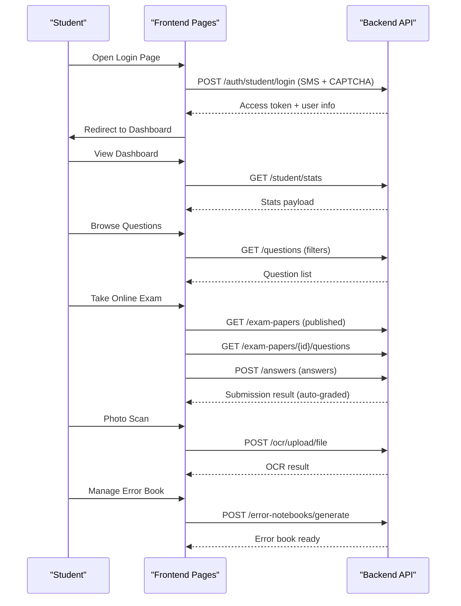

**Diagram sources**
- [LoginPage.tsx:55-71](file://frontend/src/pages/auth/LoginPage.tsx#L55-L71)
- [student.py:16-112](file://backend/app/api/v1/endpoints/student.py#L16-L112)
- [questions.py:367-431](file://backend/app/api/v1/endpoints/questions.py#L367-L431)
- [OnlineAnswerTab.tsx:55-84](file://frontend/src/pages/exam-mistakes/OnlineAnswerTab.tsx#L55-L84)
- [answers.py:115-197](file://backend/app/api/v1/endpoints/answers.py#L115-L197)
- [PhotoScanTab.tsx:37-61](file://frontend/src/pages/exam-mistakes/PhotoScanTab.tsx#L37-L61)
- [ocr.py:18-64](file://backend/app/api/v1/endpoints/ocr.py#L18-L64)
- [MistakeBookPage.tsx:61-68](file://frontend/src/pages/mistake-book/MistakeBookPage.tsx#L61-L68)
- [error_notebooks.py:22-59](file://backend/app/api/v1/endpoints/error_notebooks.py#L22-L59)

## Detailed Component Analysis

### Login and Registration
- Two-step login: Enter username/phone, CAPTCHA, send SMS, then submit with SMS code.
- Registration: Verify phone via SMS, enter personal info (name, grade, school), then auto-login.
- After successful login, the app stores access/refresh tokens and redirects to the dashboard.

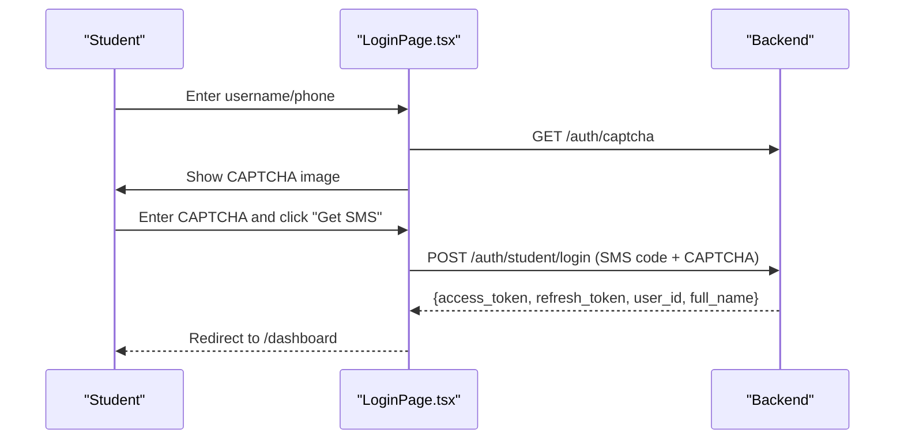

**Diagram sources**
- [LoginPage.tsx:33-71](file://frontend/src/pages/auth/LoginPage.tsx#L33-L71)
- [answers.py:115-197](file://backend/app/api/v1/endpoints/answers.py#L115-L197)

**Section sources**
- [LoginPage.tsx:11-217](file://frontend/src/pages/auth/LoginPage.tsx#L11-L217)

### Dashboard Navigation and Statistics
- Displays:
  - Completed papers
  - Accuracy rate
  - Error count (from error books)
  - Highest score percentage
  - Recent papers with pass/fail color-coded accuracy
  - Subject distribution bar chart
- Uses GET /student/stats to populate metrics.

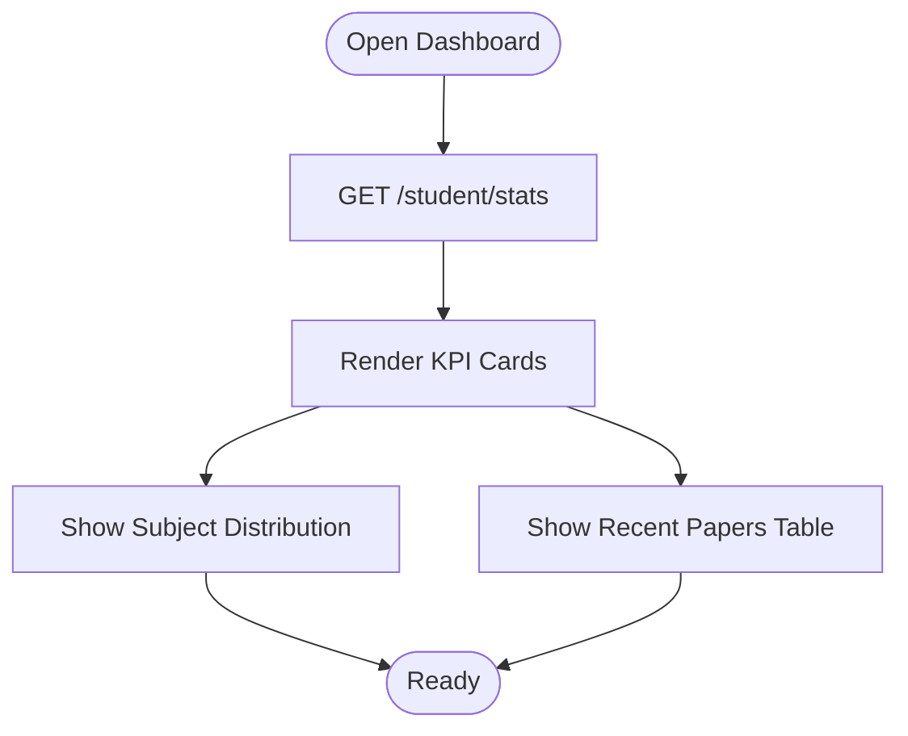

**Diagram sources**
- [DashboardPage.tsx:32-50](file://frontend/src/pages/dashboard/DashboardPage.tsx#L32-L50)
- [student.py:16-112](file://backend/app/api/v1/endpoints/student.py#L16-L112)

**Section sources**
- [DashboardPage.tsx:14-144](file://frontend/src/pages/dashboard/DashboardPage.tsx#L14-L144)
- [student.py:16-112](file://backend/app/api/v1/endpoints/student.py#L16-L112)

### Browse Available Questions
- Filter by subject, grade, question type, difficulty, and keyword.
- Export selected or filtered questions (subject to admin-configured limits).
- View question metadata and source status.

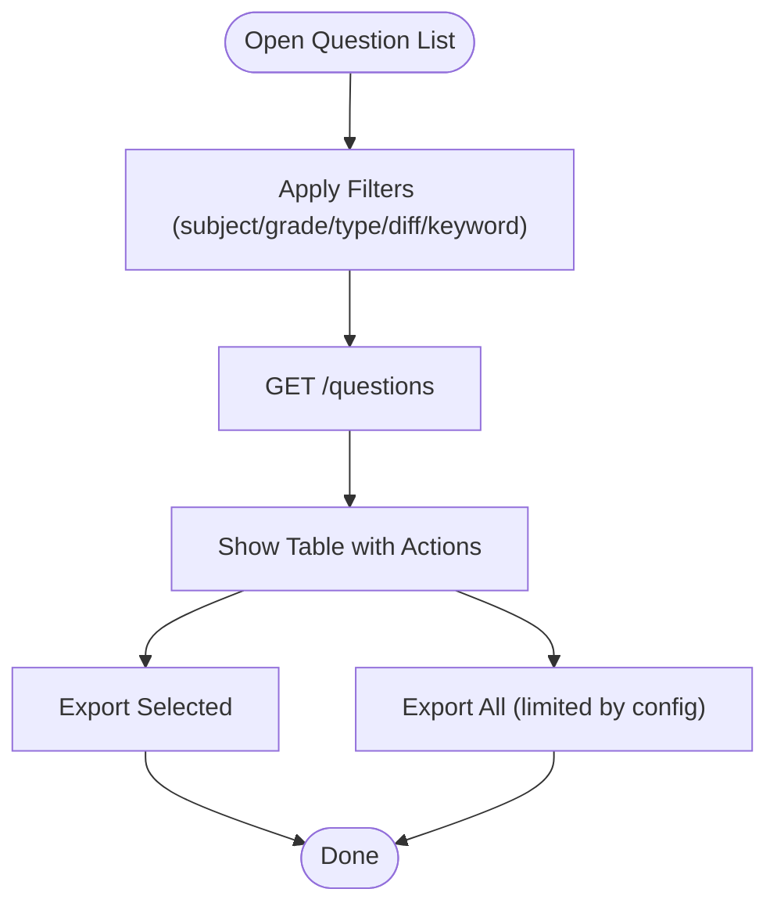

**Diagram sources**
- [QuestionListPage.tsx:61-79](file://frontend/src/pages/questions/QuestionListPage.tsx#L61-L79)
- [questions.py:367-431](file://backend/app/api/v1/endpoints/questions.py#L367-L431)

**Section sources**
- [QuestionListPage.tsx:31-259](file://frontend/src/pages/questions/QuestionListPage.tsx#L31-L259)
- [questions.py:367-431](file://backend/app/api/v1/endpoints/questions.py#L367-L431)

### Practice Exams and Online Answer Submission
- View published papers and filter by subject.
- Start answering: load paper questions, fill answers, submit instantly.
- Immediate auto-grading returns score, percentage, and correctness per question.
- Mistake book auto-generation when score < 100%.

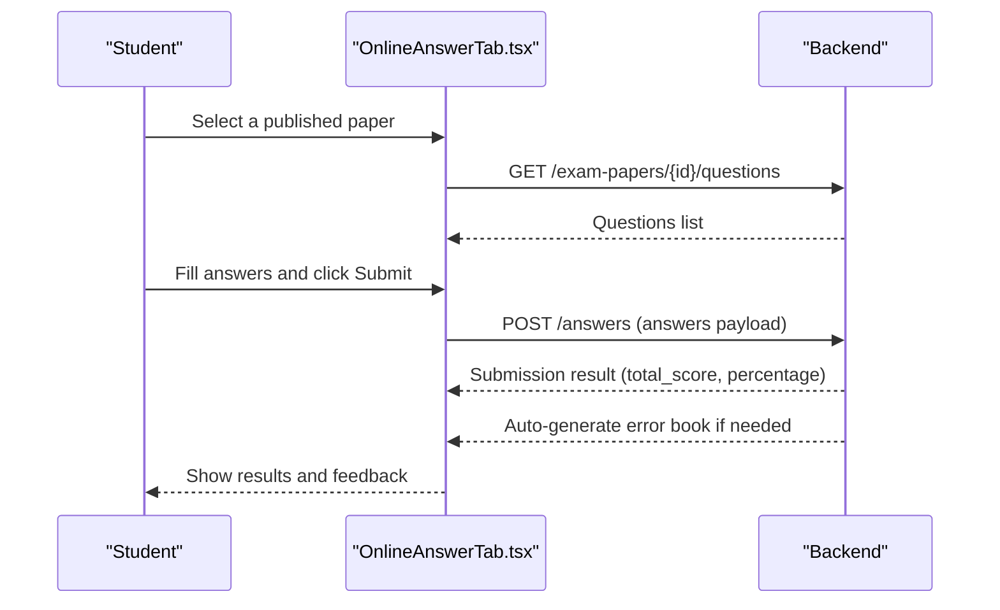

**Diagram sources**
- [OnlineAnswerTab.tsx:55-84](file://frontend/src/pages/exam-mistakes/OnlineAnswerTab.tsx#L55-L84)
- [answers.py:115-197](file://backend/app/api/v1/endpoints/answers.py#L115-L197)
- [error_notebooks.py:182-188](file://backend/app/api/v1/endpoints/error_notebooks.py#L182-L188)

**Section sources**
- [OnlineAnswerTab.tsx:16-317](file://frontend/src/pages/exam-mistakes/OnlineAnswerTab.tsx#L16-L317)
- [answers.py:115-197](file://backend/app/api/v1/endpoints/answers.py#L115-L197)
- [error_notebooks.py:182-188](file://backend/app/api/v1/endpoints/error_notebooks.py#L182-L188)

### Photo Scanning for OCR
- Upload a single image (photo or scan) with subject and grade scope.
- Backend runs OCR and returns recognized questions, estimated score, and correctness.
- Mock result is shown when OCR engine is unavailable.

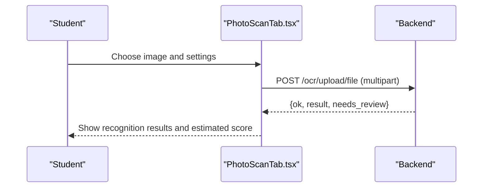

**Diagram sources**
- [PhotoScanTab.tsx:37-61](file://frontend/src/pages/exam-mistakes/PhotoScanTab.tsx#L37-L61)
- [ocr.py:18-64](file://backend/app/api/v1/endpoints/ocr.py#L18-L64)

**Section sources**
- [PhotoScanTab.tsx:11-186](file://frontend/src/pages/exam-mistakes/PhotoScanTab.tsx#L11-L186)
- [ocr.py:18-64](file://backend/app/api/v1/endpoints/ocr.py#L18-L64)

### Error Book Access and Management
- Generate error book from recent submissions automatically when score < 100%.
- Manually generate or review error books, preview details, print, or delete.
- Generate “practice” questions per mistake via LLM.

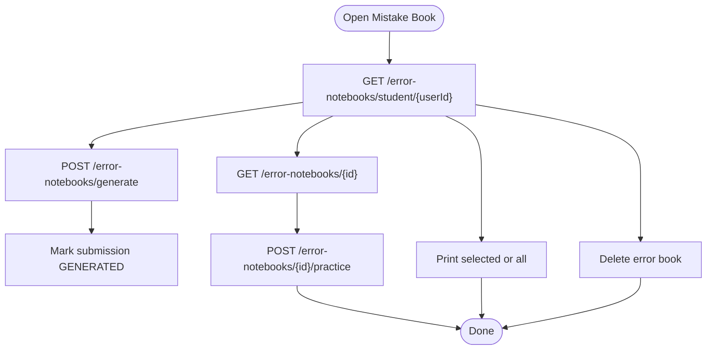

**Diagram sources**
- [MistakeBookPage.tsx:47-81](file://frontend/src/pages/mistake-book/MistakeBookPage.tsx#L47-L81)
- [error_notebooks.py:22-59](file://backend/app/api/v1/endpoints/error_notebooks.py#L22-L59)
- [error_notebooks.py:199-313](file://backend/app/api/v1/endpoints/error_notebooks.py#L199-L313)

**Section sources**
- [MistakeBookPage.tsx:13-637](file://frontend/src/pages/mistake-book/MistakeBookPage.tsx#L13-L637)
- [error_notebooks.py:22-59](file://backend/app/api/v1/endpoints/error_notebooks.py#L22-L59)
- [error_notebooks.py:199-313](file://backend/app/api/v1/endpoints/error_notebooks.py#L199-L313)

### Typical Question Exploration
- Explore curated “typical” questions by subject and grade.
- Useful for focused practice and understanding common problem types.

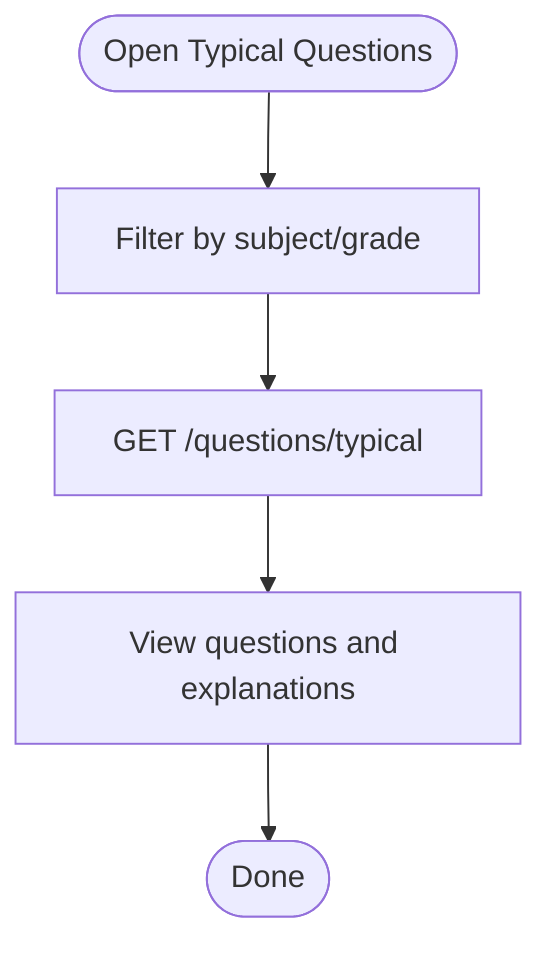

**Diagram sources**
- [TypicalQuestionsPage.tsx:23-35](file://frontend/src/pages/TypicalQuestionsPage.tsx#L23-L35)
- [questions.py:227-254](file://backend/app/api/v1/endpoints/questions.py#L227-L254)

**Section sources**
- [TypicalQuestionsPage.tsx:10-95](file://frontend/src/pages/TypicalQuestionsPage.tsx#L10-L95)
- [questions.py:227-254](file://backend/app/api/v1/endpoints/questions.py#L227-L254)

### Conceptual Overview
This section provides a high-level overview of the student workflow without mapping to specific source files.

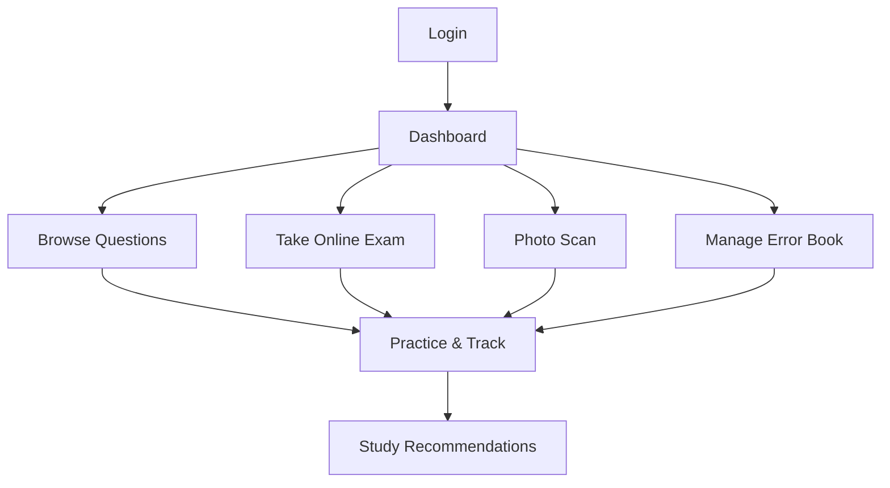

[No sources needed since this diagram shows conceptual workflow, not actual code structure]

[No sources needed since this section doesn't analyze specific source files]

## Dependency Analysis
- Frontend pages depend on backend endpoints for data and actions.
- Student statistics depend on answer submissions and error notebooks.
- Online answer submission depends on exam papers and question correctness.
- OCR depends on external OCR service availability.
- Error book generation depends on answer grading and optional practice question generation.

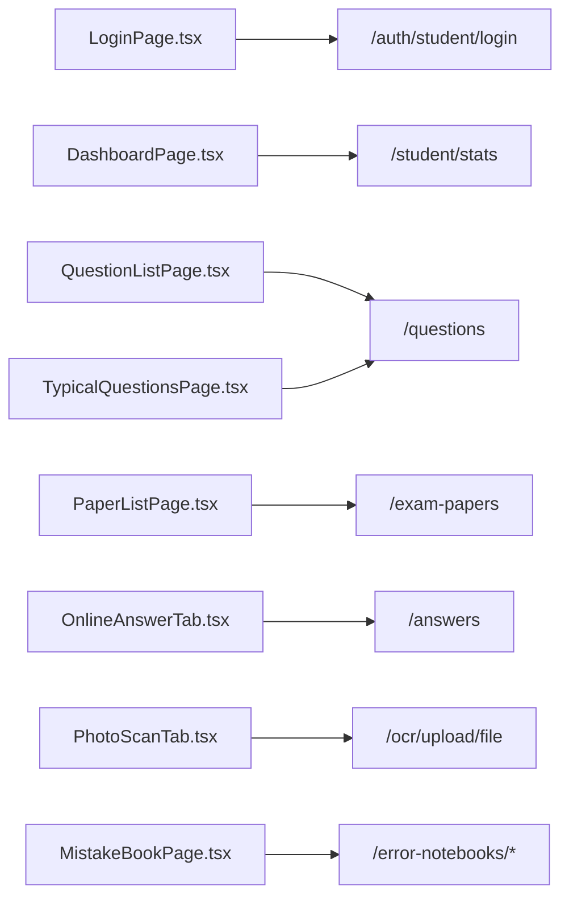

**Diagram sources**
- [LoginPage.tsx:55-71](file://frontend/src/pages/auth/LoginPage.tsx#L55-L71)
- [DashboardPage.tsx:32-50](file://frontend/src/pages/dashboard/DashboardPage.tsx#L32-L50)
- [QuestionListPage.tsx:61-79](file://frontend/src/pages/questions/QuestionListPage.tsx#L61-L79)
- [PaperListPage.tsx:31-53](file://frontend/src/pages/papers/PaperListPage.tsx#L31-L53)
- [OnlineAnswerTab.tsx:55-84](file://frontend/src/pages/exam-mistakes/OnlineAnswerTab.tsx#L55-L84)
- [PhotoScanTab.tsx:37-61](file://frontend/src/pages/exam-mistakes/PhotoScanTab.tsx#L37-L61)
- [MistakeBookPage.tsx:47-81](file://frontend/src/pages/mistake-book/MistakeBookPage.tsx#L47-L81)
- [TypicalQuestionsPage.tsx:23-35](file://frontend/src/pages/TypicalQuestionsPage.tsx#L23-L35)
- [student.py:16-112](file://backend/app/api/v1/endpoints/student.py#L16-L112)
- [answers.py:115-197](file://backend/app/api/v1/endpoints/answers.py#L115-L197)
- [ocr.py:18-64](file://backend/app/api/v1/endpoints/ocr.py#L18-L64)
- [error_notebooks.py:22-59](file://backend/app/api/v1/endpoints/error_notebooks.py#L22-L59)
- [questions.py:367-431](file://backend/app/api/v1/endpoints/questions.py#L367-L431)
- [exam_papers.py:362-414](file://backend/app/api/v1/endpoints/exam_papers.py#L362-L414)

**Section sources**
- [student.py:16-112](file://backend/app/api/v1/endpoints/student.py#L16-L112)
- [answers.py:115-197](file://backend/app/api/v1/endpoints/answers.py#L115-L197)
- [error_notebooks.py:22-59](file://backend/app/api/v1/endpoints/error_notebooks.py#L22-L59)
- [ocr.py:18-64](file://backend/app/api/v1/endpoints/ocr.py#L18-L64)
- [questions.py:367-431](file://backend/app/api/v1/endpoints/questions.py#L367-L431)
- [exam_papers.py:362-414](file://backend/app/api/v1/endpoints/exam_papers.py#L362-L414)

## Performance Considerations
- Use filters to reduce question and paper loads.
- Prefer “Export All” only when admin allows; otherwise export selected to limit payload size.
- OCR processing may take time; avoid repeated uploads until recognition completes.
- Error book generation and practice question creation are asynchronous; refresh lists after completion.

[No sources needed since this section provides general guidance]

## Troubleshooting Guide
Common issues and resolutions:
- Login fails or stuck on SMS:
  - Ensure CAPTCHA is entered before sending SMS.
  - Confirm phone number format and SMS code validity.
  - If stuck, refresh CAPTCHA and retry.
- Submission errors:
  - Ensure all questions are answered before submitting.
  - Re-check network connectivity; retry submission.
- OCR upload issues:
  - Verify image selection and supported format.
  - If OCR engine unavailable, mock result is shown; retry later.
- Error book not generated:
  - Ensure submission status allows generation (not already GENERATED).
  - Try re-generating after confirming submission exists.
- Performance tracking not updating:
  - Refresh the dashboard or reload the page after completing a submission.

**Section sources**
- [LoginPage.tsx:49-71](file://frontend/src/pages/auth/LoginPage.tsx#L49-L71)
- [OnlineAnswerTab.tsx:64-84](file://frontend/src/pages/exam-mistakes/OnlineAnswerTab.tsx#L64-L84)
- [PhotoScanTab.tsx:37-61](file://frontend/src/pages/exam-mistakes/PhotoScanTab.tsx#L37-L61)
- [error_notebooks.py:28-42](file://backend/app/api/v1/endpoints/error_notebooks.py#L28-L42)

## Conclusion
This guide outlined the complete student workflow in the Ruicheng Educational Management System. By following the steps for login, dashboard navigation, question exploration, online exam taking, photo scanning, and error book management, students can efficiently track progress, analyze mistakes, and focus on weak areas. Use the troubleshooting tips for common issues and adopt the best practices for optimal performance.

[No sources needed since this section summarizes without analyzing specific files]

## Appendices
- Best practices:
  - Keep filters applied while browsing questions and papers.
  - Use “Typical Questions” for high-yield practice.
  - Generate error books promptly after low-scoring exams.
  - Export only what you need to avoid large payloads.
- Navigation tips:
  - Use subject and grade filters to narrow down content.
  - Bookmark frequently used tabs (Online Answer, Mistake Book).
  - Use print features to create physical study aids.

[No sources needed since this section provides general guidance]