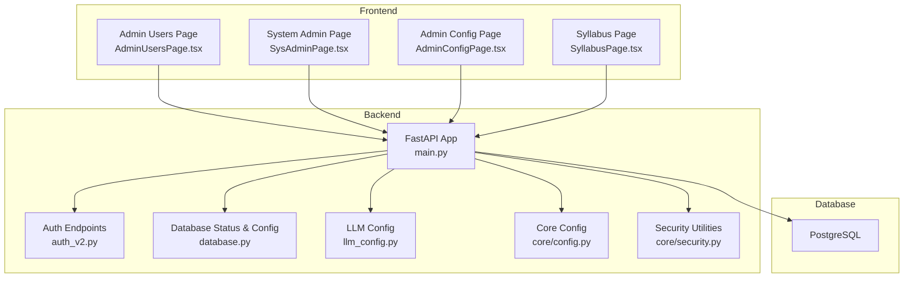
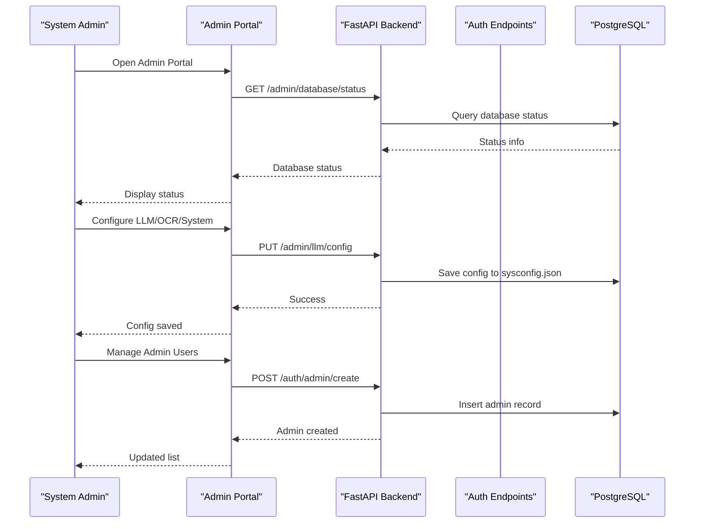
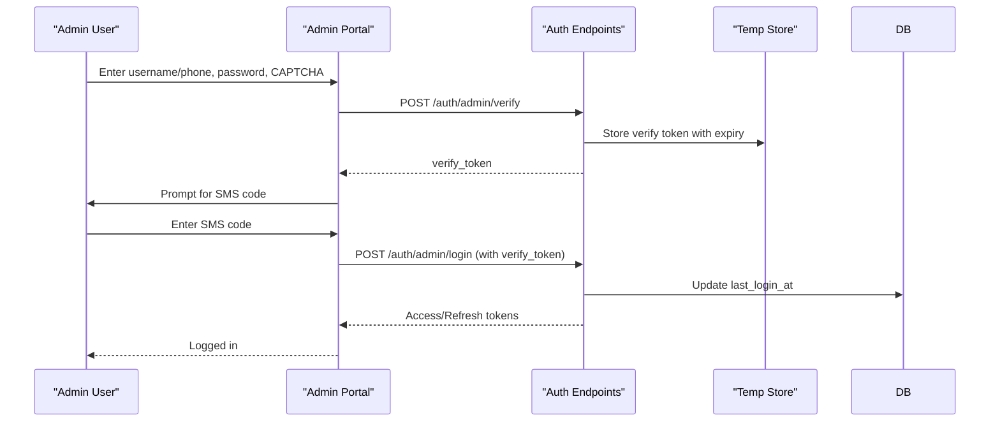
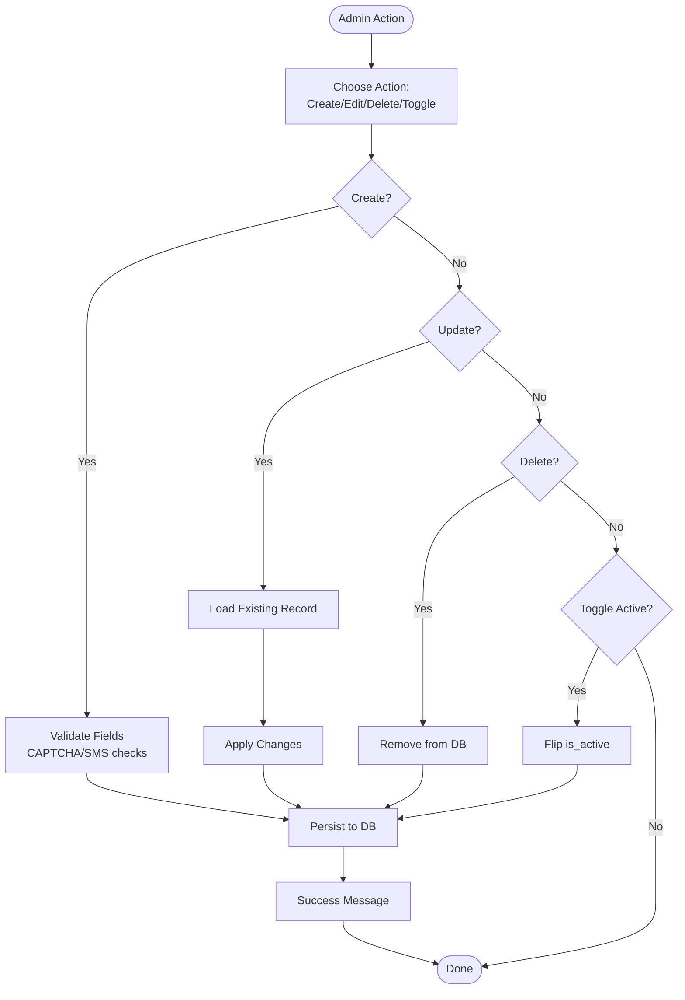
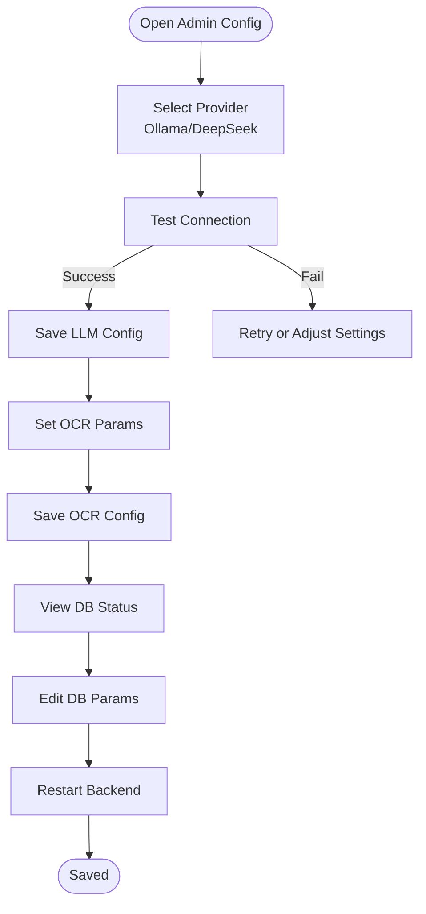
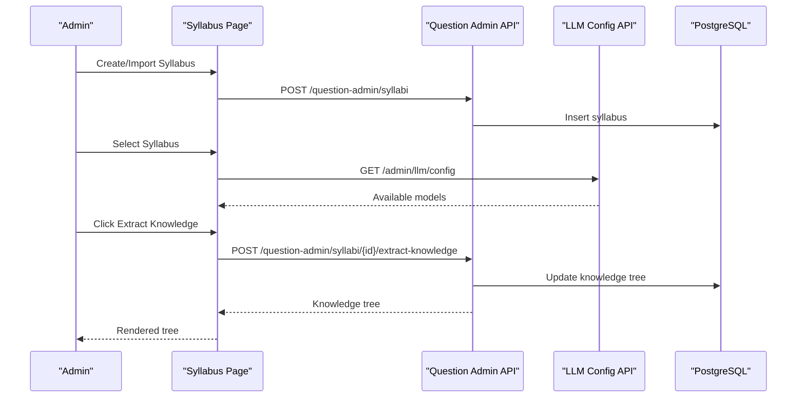
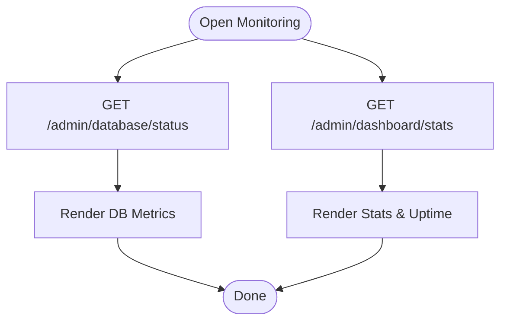
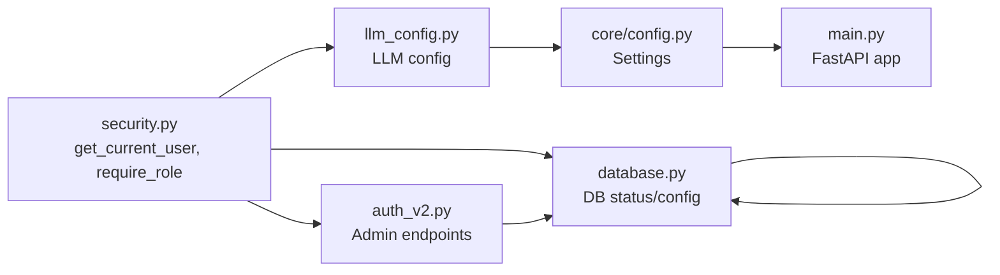

# System Administrator Guide

<cite>
**Referenced Files in This Document**
- [backend/app/main.py](file://backend/app/main.py)
- [backend/app/core/config.py](file://backend/app/core/config.py)
- [backend/app/core/security.py](file://backend/app/core/security.py)
- [backend/app/api/v1/endpoints/auth_v2.py](file://backend/app/api/v1/endpoints/auth_v2.py)
- [backend/app/api/v1/endpoints/database.py](file://backend/app/api/v1/endpoints/database.py)
- [backend/app/api/v1/endpoints/llm_config.py](file://backend/app/api/v1/endpoints/llm_config.py)
- [backend/app/models/admin.py](file://backend/app/models/admin.py)
- [backend/app/models/sys_admin.py](file://backend/app/models/sys_admin.py)
- [frontend/src/pages/admin/SysAdminPage.tsx](file://frontend/src/pages/admin/SysAdminPage.tsx)
- [frontend/src/pages/admin/AdminUsersPage.tsx](file://frontend/src/pages/admin/AdminUsersPage.tsx)
- [frontend/src/pages/admin/AdminConfigPage.tsx](file://frontend/src/pages/admin/AdminConfigPage.tsx)
- [frontend/src/pages/admin/SyllabusPage.tsx](file://frontend/src/pages/admin/SyllabusPage.tsx)
</cite>

## Table of Contents
1. [Introduction](#introduction)
2. [Project Structure](#project-structure)
3. [Core Components](#core-components)
4. [Architecture Overview](#architecture-overview)
5. [Detailed Component Analysis](#detailed-component-analysis)
6. [Dependency Analysis](#dependency-analysis)
7. [Performance Considerations](#performance-considerations)
8. [Troubleshooting Guide](#troubleshooting-guide)
9. [Conclusion](#conclusion)
10. [Appendices](#appendices)

## Introduction
This System Administrator Guide documents the complete workflow for managing the Ruicheng Educational Management System. It covers secure login procedures, user and administrative account management, system configuration and basic settings, syllabus administration, and system monitoring. It also provides best practices for security, configuration management, performance optimization, and disaster recovery, along with troubleshooting guidance for common administrator scenarios.

## Project Structure
The system consists of:
- Backend: FastAPI application exposing REST APIs for authentication, configuration, database status, and syllabus administration.
- Frontend: React-based admin portal providing forms and dashboards for administrators to manage users, configurations, syllabi, and system monitoring.
- Database: PostgreSQL (as indicated by database status and queries).
- Configuration: Centralized configuration via sysconfig.json and environment variables.

**Diagram sources**
- [backend/app/main.py:11-30](file://backend/app/main.py#L11-L30)
- [backend/app/api/v1/endpoints/auth_v2.py:21-21](file://backend/app/api/v1/endpoints/auth_v2.py#L21-L21)
- [backend/app/api/v1/endpoints/database.py:18-18](file://backend/app/api/v1/endpoints/database.py#L18-L18)
- [backend/app/api/v1/endpoints/llm_config.py:7-7](file://backend/app/api/v1/endpoints/llm_config.py#L7-L7)
- [backend/app/core/config.py:36-97](file://backend/app/core/config.py#L36-L97)
- [backend/app/core/security.py:50-103](file://backend/app/core/security.py#L50-L103)

**Section sources**
- [backend/app/main.py:1-52](file://backend/app/main.py#L1-L52)
- [frontend/src/pages/admin/AdminUsersPage.tsx:1-128](file://frontend/src/pages/admin/AdminUsersPage.tsx#L1-L128)
- [frontend/src/pages/admin/SysAdminPage.tsx:1-379](file://frontend/src/pages/admin/SysAdminPage.tsx#L1-L379)
- [frontend/src/pages/admin/AdminConfigPage.tsx:1-401](file://frontend/src/pages/admin/AdminConfigPage.tsx#L1-L401)
- [frontend/src/pages/admin/SyllabusPage.tsx:1-239](file://frontend/src/pages/admin/SyllabusPage.tsx#L1-L239)

## Core Components
- Authentication and Authorization:
  - Admin login with CAPTCHA and SMS verification, token issuance, and role-based access control.
  - Profile management and phone number updates.
- Administrative Account Management:
  - Creation, listing, updating, and deletion of teacher and question-admin accounts by system administrators.
- System Configuration:
  - LLM provider selection (Ollama or DeepSeek), OCR settings, logging level, and database connection parameters.
- Syllabus Administration:
  - Creation, import, filtering, and knowledge extraction from syllabi using configured LLM models.
- System Monitoring:
  - Database status, table statistics, and server metrics exposed via admin endpoints.

**Section sources**
- [backend/app/api/v1/endpoints/auth_v2.py:23-183](file://backend/app/api/v1/endpoints/auth_v2.py#L23-L183)
- [backend/app/api/v1/endpoints/database.py:96-166](file://backend/app/api/v1/endpoints/database.py#L96-L166)
- [backend/app/api/v1/endpoints/llm_config.py:17-175](file://backend/app/api/v1/endpoints/llm_config.py#L17-L175)
- [frontend/src/pages/admin/AdminUsersPage.tsx:24-127](file://frontend/src/pages/admin/AdminUsersPage.tsx#L24-L127)
- [frontend/src/pages/admin/SysAdminPage.tsx:22-378](file://frontend/src/pages/admin/SysAdminPage.tsx#L22-L378)
- [frontend/src/pages/admin/AdminConfigPage.tsx:8-399](file://frontend/src/pages/admin/AdminConfigPage.tsx#L8-L399)
- [frontend/src/pages/admin/SyllabusPage.tsx:11-238](file://frontend/src/pages/admin/SyllabusPage.tsx#L11-L238)

## Architecture Overview
The system enforces role-based access control at the API layer. System administrators can manage other administrators and users, configure system-wide parameters, and monitor system health. The frontend communicates with backend endpoints to perform administrative tasks.

**Diagram sources**
- [backend/app/api/v1/endpoints/database.py:96-144](file://backend/app/api/v1/endpoints/database.py#L96-L144)
- [backend/app/api/v1/endpoints/llm_config.py:28-52](file://backend/app/api/v1/endpoints/llm_config.py#L28-L52)
- [backend/app/api/v1/endpoints/auth_v2.py:242-283](file://backend/app/api/v1/endpoints/auth_v2.py#L242-L283)

## Detailed Component Analysis

### Secure Login Procedures
- Multi-factor authentication for administrators:
  - CAPTCHA verification.
  - Role-specific password verification.
  - One-time verification token generation and validation.
  - SMS code verification (configured for testing).
- Token lifecycle:
  - Access and refresh tokens with configurable expiration.
  - Token decoding and user identity validation across roles.

**Diagram sources**
- [backend/app/api/v1/endpoints/auth_v2.py:91-183](file://backend/app/api/v1/endpoints/auth_v2.py#L91-L183)
- [backend/app/core/security.py:53-95](file://backend/app/core/security.py#L53-L95)

**Section sources**
- [backend/app/api/v1/endpoints/auth_v2.py:25-183](file://backend/app/api/v1/endpoints/auth_v2.py#L25-L183)
- [backend/app/core/security.py:24-47](file://backend/app/core/security.py#L24-L47)

### User Management
- Managing teacher and question-admin accounts:
  - Create accounts with username, password, personal info, and permissions.
  - List, filter, update, and delete accounts.
  - Toggle activation status.
- Managing general users:
  - Create students/teachers/admins with default roles and optional passwords.
  - Enable/disable accounts and delete users.

**Diagram sources**
- [frontend/src/pages/admin/SysAdminPage.tsx:65-131](file://frontend/src/pages/admin/SysAdminPage.tsx#L65-L131)
- [frontend/src/pages/admin/AdminUsersPage.tsx:43-68](file://frontend/src/pages/admin/AdminUsersPage.tsx#L43-L68)

**Section sources**
- [frontend/src/pages/admin/SysAdminPage.tsx:22-378](file://frontend/src/pages/admin/SysAdminPage.tsx#L22-L378)
- [frontend/src/pages/admin/AdminUsersPage.tsx:24-127](file://frontend/src/pages/admin/AdminUsersPage.tsx#L24-L127)
- [backend/app/api/v1/endpoints/auth_v2.py:242-361](file://backend/app/api/v1/endpoints/auth_v2.py#L242-L361)

### System Configuration and Basic Settings
- LLM configuration:
  - Select provider (Ollama or DeepSeek), set endpoint/model, test connectivity, and persist configuration.
- OCR settings:
  - Configure engine, concurrency, and confidence threshold.
- Logging and backup:
  - Set log level; backup status indicator.
- Database configuration:
  - View current connection parameters and update them; restart service for changes to take effect.

**Diagram sources**
- [frontend/src/pages/admin/AdminConfigPage.tsx:15-152](file://frontend/src/pages/admin/AdminConfigPage.tsx#L15-L152)
- [backend/app/api/v1/endpoints/llm_config.py:17-105](file://backend/app/api/v1/endpoints/llm_config.py#L17-L105)
- [backend/app/api/v1/endpoints/database.py:96-166](file://backend/app/api/v1/endpoints/database.py#L96-L166)

**Section sources**
- [frontend/src/pages/admin/AdminConfigPage.tsx:8-399](file://frontend/src/pages/admin/AdminConfigPage.tsx#L8-L399)
- [backend/app/api/v1/endpoints/llm_config.py:17-175](file://backend/app/api/v1/endpoints/llm_config.py#L17-L175)
- [backend/app/api/v1/endpoints/database.py:96-166](file://backend/app/api/v1/endpoints/database.py#L96-L166)

### Syllabus Administration
- Create syllabi manually or import via Excel/JSON template.
- Extract knowledge trees using configured LLM models.
- Filter and search syllabi by grade, province, subject, and status.

**Diagram sources**
- [frontend/src/pages/admin/SyllabusPage.tsx:45-114](file://frontend/src/pages/admin/SyllabusPage.tsx#L45-L114)
- [backend/app/api/v1/endpoints/llm_config.py:17-25](file://backend/app/api/v1/endpoints/llm_config.py#L17-L25)

**Section sources**
- [frontend/src/pages/admin/SyllabusPage.tsx:11-238](file://frontend/src/pages/admin/SyllabusPage.tsx#L11-L238)
- [backend/app/api/v1/endpoints/llm_config.py:17-25](file://backend/app/api/v1/endpoints/llm_config.py#L17-L25)

### System Monitoring Capabilities
- Database status:
  - Version, size, table count, per-table row counts, and total rows.
- Server metrics:
  - Uptime, Python version, system version.
- Dashboard statistics:
  - Counts for users, questions, papers, and classes.

**Diagram sources**
- [backend/app/api/v1/endpoints/database.py:96-144](file://backend/app/api/v1/endpoints/database.py#L96-L144)
- [backend/app/api/v1/endpoints/database.py:23-85](file://backend/app/api/v1/endpoints/database.py#L23-L85)

**Section sources**
- [backend/app/api/v1/endpoints/database.py:96-144](file://backend/app/api/v1/endpoints/database.py#L96-L144)
- [backend/app/api/v1/endpoints/database.py:23-85](file://backend/app/api/v1/endpoints/database.py#L23-L85)

## Dependency Analysis
- Role-based access control ensures only system administrators can perform sensitive actions.
- Configuration persistence relies on sysconfig.json with environment variable overrides for secrets.
- Database operations are executed against PostgreSQL with explicit queries for status and statistics.

**Diagram sources**
- [backend/app/core/security.py:64-103](file://backend/app/core/security.py#L64-L103)
- [backend/app/api/v1/endpoints/auth_v2.py:240-361](file://backend/app/api/v1/endpoints/auth_v2.py#L240-L361)
- [backend/app/api/v1/endpoints/database.py:96-166](file://backend/app/api/v1/endpoints/database.py#L96-L166)
- [backend/app/api/v1/endpoints/llm_config.py:17-175](file://backend/app/api/v1/endpoints/llm_config.py#L17-L175)
- [backend/app/core/config.py:36-97](file://backend/app/core/config.py#L36-L97)
- [backend/app/main.py:11-30](file://backend/app/main.py#L11-L30)

**Section sources**
- [backend/app/core/security.py:98-103](file://backend/app/core/security.py#L98-L103)
- [backend/app/core/config.py:6-30](file://backend/app/core/config.py#L6-L30)

## Performance Considerations
- Optimize database queries for status and statistics by limiting result sets and avoiding unnecessary scans.
- Use pagination for large lists (e.g., users, syllabi) to reduce payload sizes.
- Tune OCR concurrency and confidence thresholds to balance accuracy and throughput.
- Monitor database size and table counts to identify growth trends and plan maintenance windows.

[No sources needed since this section provides general guidance]

## Troubleshooting Guide
- User access problems:
  - Verify CAPTCHA and SMS code inputs during login.
  - Confirm account is active and role matches expected type.
  - Check token validity and refresh token usage.
- Configuration errors:
  - Ensure LLM provider configuration is valid and reachable.
  - Validate database connection parameters; restart backend after changes.
  - Confirm environment variables override defaults only when necessary.
- System performance issues:
  - Review database status and table statistics.
  - Adjust OCR concurrency and model selection.
  - Monitor logs and adjust log level as needed.
- Administrative account management challenges:
  - Use the admin management interface to toggle activation and update permissions.
  - Re-import or recreate accounts if data inconsistencies occur.

**Section sources**
- [backend/app/api/v1/endpoints/auth_v2.py:149-183](file://backend/app/api/v1/endpoints/auth_v2.py#L149-L183)
- [backend/app/api/v1/endpoints/llm_config.py:61-105](file://backend/app/api/v1/endpoints/llm_config.py#L61-L105)
- [backend/app/api/v1/endpoints/database.py:147-166](file://backend/app/api/v1/endpoints/database.py#L147-L166)
- [frontend/src/pages/admin/SysAdminPage.tsx:115-131](file://frontend/src/pages/admin/SysAdminPage.tsx#L115-L131)

## Conclusion
This guide provides a comprehensive overview of the Ruicheng Educational Management System’s administrative capabilities. By following the documented workflows and best practices, system administrators can securely manage users and permissions, configure system-wide settings, maintain syllabus structures, and monitor system health effectively.

[No sources needed since this section summarizes without analyzing specific files]

## Appendices
- Best practices:
  - Enforce strong passwords and periodic rotation.
  - Limit administrative privileges to least-privileged roles.
  - Regularly review logs and audit trails.
  - Back up configuration and database regularly; test restoration procedures.
  - Keep LLM endpoints and models updated and validated.
- Disaster recovery:
  - Maintain offsite backups of sysconfig.json and database dumps.
  - Document environment variables and secrets management.
  - Automate health checks and alerting for database and service availability.

[No sources needed since this section provides general guidance]