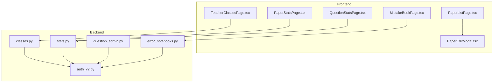
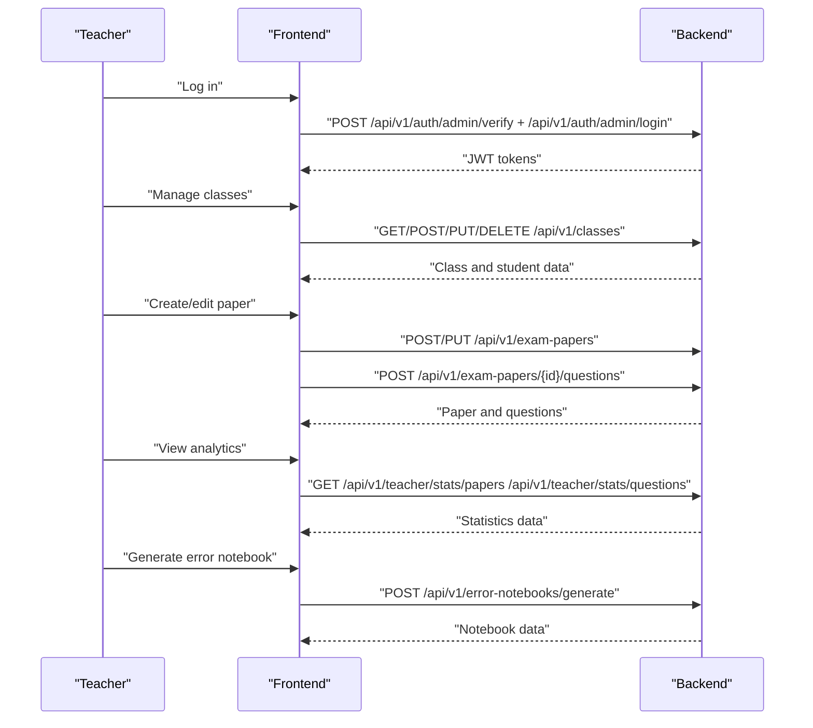
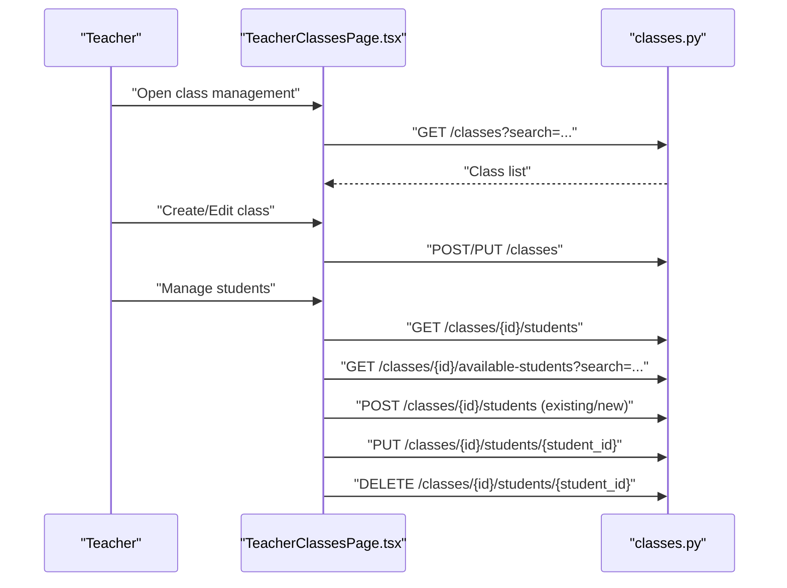
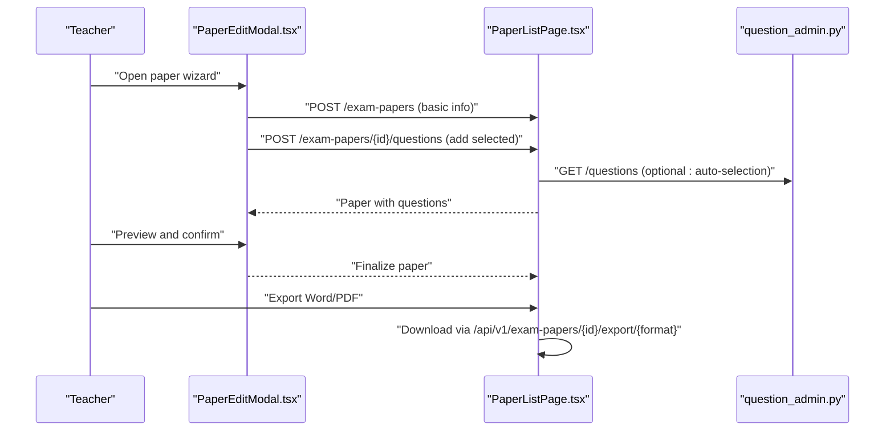
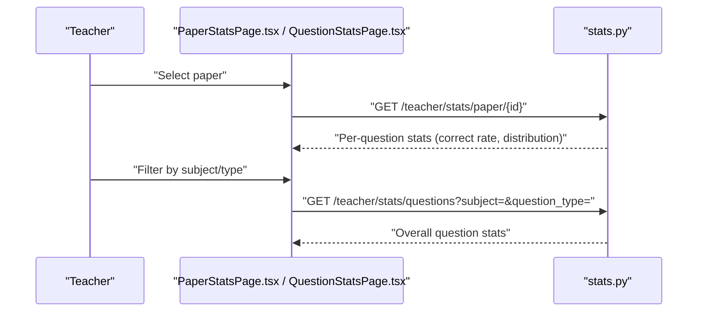
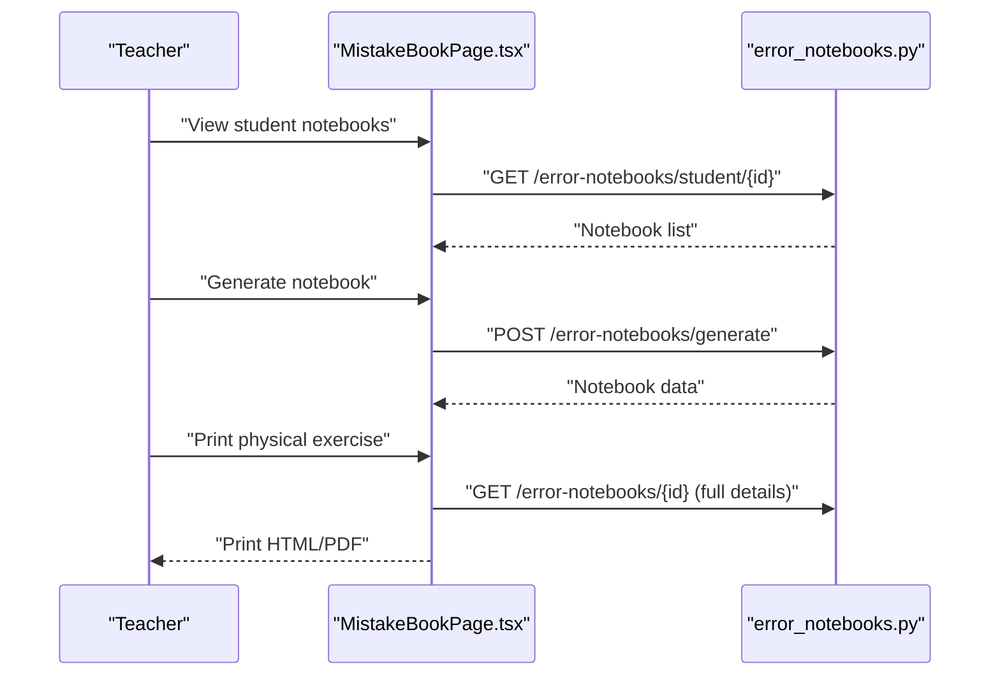
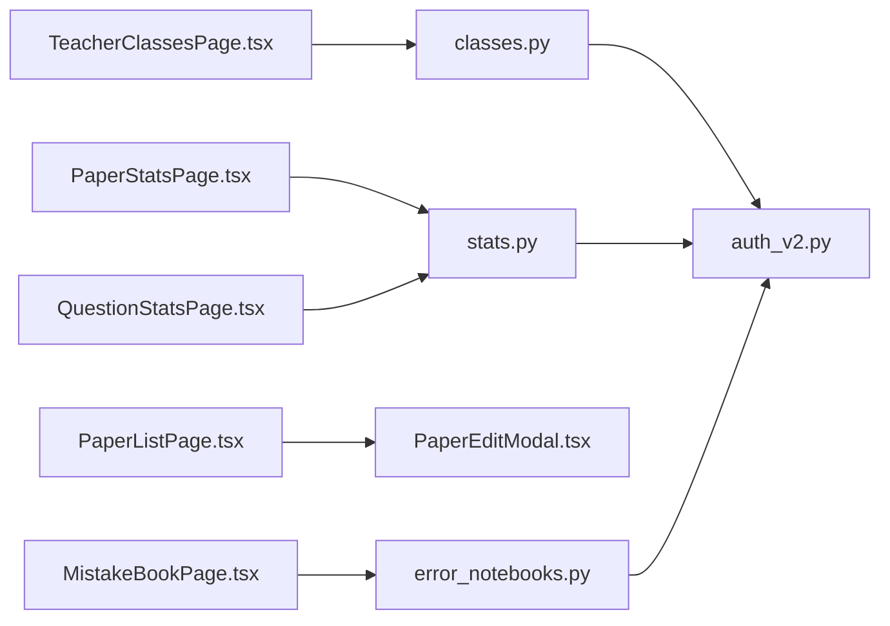

# Teacher Guide

<cite>
**Referenced Files in This Document**
- [TeacherClassesPage.tsx](file://frontend/src/pages/teacher/TeacherClassesPage.tsx)
- [PaperStatsPage.tsx](file://frontend/src/pages/teacher/PaperStatsPage.tsx)
- [QuestionStatsPage.tsx](file://frontend/src/pages/teacher/QuestionStatsPage.tsx)
- [classes.py](file://backend/app/api/v1/endpoints/classes.py)
- [stats.py](file://backend/app/api/v1/endpoints/stats.py)
- [auth_v2.py](file://backend/app/api/v1/endpoints/auth_v2.py)
- [PaperListPage.tsx](file://frontend/src/pages/papers/PaperListPage.tsx)
- [PaperEditModal.tsx](file://frontend/src/pages/papers/PaperEditModal.tsx)
- [question_admin.py](file://backend/app/api/v1/endpoints/question_admin.py)
- [error_notebooks.py](file://backend/app/api/v1/endpoints/error_notebooks.py)
- [MistakeBookPage.tsx](file://frontend/src/pages/mistake-book/MistakeBookPage.tsx)
</cite>

## Table of Contents
1. [Introduction](#introduction)
2. [Project Structure](#project-structure)
3. [Core Components](#core-components)
4. [Architecture Overview](#architecture-overview)
5. [Detailed Component Analysis](#detailed-component-analysis)
6. [Dependency Analysis](#dependency-analysis)
7. [Performance Considerations](#performance-considerations)
8. [Troubleshooting Guide](#troubleshooting-guide)
9. [Conclusion](#conclusion)
10. [Appendices](#appendices)

## Introduction
This teacher guide explains how to use the Ruicheng Educational Management System to manage classes, create and customize exam papers, monitor student performance, analyze question statistics, and track class progress. It provides step-by-step instructions aligned with the frontend UI and backend APIs, along with best practices and troubleshooting guidance.

## Project Structure
The system consists of:
- Frontend (React + Ant Design): teacher dashboards, paper management, statistics, and error notebooks
- Backend (FastAPI): class management, exam paper lifecycle, statistics aggregation, question bank admin, and error notebook services
- Authentication: JWT-based login for teachers and administrators

**Diagram sources**
- [TeacherClassesPage.tsx:1-334](file://frontend/src/pages/teacher/TeacherClassesPage.tsx#L1-L334)
- [PaperStatsPage.tsx:1-116](file://frontend/src/pages/teacher/PaperStatsPage.tsx#L1-L116)
- [QuestionStatsPage.tsx:1-94](file://frontend/src/pages/teacher/QuestionStatsPage.tsx#L1-L94)
- [PaperListPage.tsx:1-169](file://frontend/src/pages/papers/PaperListPage.tsx#L1-L169)
- [PaperEditModal.tsx:1-497](file://frontend/src/pages/papers/PaperEditModal.tsx#L1-L497)
- [MistakeBookPage.tsx:1-637](file://frontend/src/pages/mistake-book/MistakeBookPage.tsx#L1-L637)
- [classes.py:1-243](file://backend/app/api/v1/endpoints/classes.py#L1-L243)
- [stats.py:1-251](file://backend/app/api/v1/endpoints/stats.py#L1-L251)
- [auth_v2.py:1-476](file://backend/app/api/v1/endpoints/auth_v2.py#L1-L476)
- [question_admin.py:1-837](file://backend/app/api/v1/endpoints/question_admin.py#L1-L837)
- [error_notebooks.py:1-437](file://backend/app/api/v1/endpoints/error_notebooks.py#L1-L437)

**Section sources**
- [TeacherClassesPage.tsx:1-334](file://frontend/src/pages/teacher/TeacherClassesPage.tsx#L1-L334)
- [PaperStatsPage.tsx:1-116](file://frontend/src/pages/teacher/PaperStatsPage.tsx#L1-L116)
- [QuestionStatsPage.tsx:1-94](file://frontend/src/pages/teacher/QuestionStatsPage.tsx#L1-L94)
- [PaperListPage.tsx:1-169](file://frontend/src/pages/papers/PaperListPage.tsx#L1-L169)
- [PaperEditModal.tsx:1-497](file://frontend/src/pages/papers/PaperEditModal.tsx#L1-L497)
- [MistakeBookPage.tsx:1-637](file://frontend/src/pages/mistake-book/MistakeBookPage.tsx#L1-L637)
- [classes.py:1-243](file://backend/app/api/v1/endpoints/classes.py#L1-L243)
- [stats.py:1-251](file://backend/app/api/v1/endpoints/stats.py#L1-L251)
- [auth_v2.py:1-476](file://backend/app/api/v1/endpoints/auth_v2.py#L1-L476)
- [question_admin.py:1-837](file://backend/app/api/v1/endpoints/question_admin.py#L1-L837)
- [error_notebooks.py:1-437](file://backend/app/api/v1/endpoints/error_notebooks.py#L1-L437)

## Core Components
- Class management: create, update, delete classes; enroll students; manage student profiles
- Paper creation and administration: build papers by selecting questions or auto-generating; export to Word/PDF; assign to students
- Performance analytics: per-paper question statistics; overall question statistics; class progress monitoring
- Error notebook: generate personalized mistake books; print physical exercise books; review paper performance
- Authentication: teacher/admin login with JWT tokens

**Section sources**
- [TeacherClassesPage.tsx:1-334](file://frontend/src/pages/teacher/TeacherClassesPage.tsx#L1-L334)
- [PaperListPage.tsx:1-169](file://frontend/src/pages/papers/PaperListPage.tsx#L1-L169)
- [PaperEditModal.tsx:1-497](file://frontend/src/pages/papers/PaperEditModal.tsx#L1-L497)
- [PaperStatsPage.tsx:1-116](file://frontend/src/pages/teacher/PaperStatsPage.tsx#L1-L116)
- [QuestionStatsPage.tsx:1-94](file://frontend/src/pages/teacher/QuestionStatsPage.tsx#L1-L94)
- [MistakeBookPage.tsx:1-637](file://frontend/src/pages/mistake-book/MistakeBookPage.tsx#L1-L637)
- [auth_v2.py:1-476](file://backend/app/api/v1/endpoints/auth_v2.py#L1-L476)

## Architecture Overview
The teacher workflow spans frontend UI components and backend endpoints. Teachers primarily interact with:
- Class management endpoints for CRUD operations and student enrollment
- Statistics endpoints for per-paper and overall question analytics
- Paper endpoints for creation, modification, and export
- Error notebook endpoints for generating and printing personalized practice books

**Diagram sources**
- [auth_v2.py:91-184](file://backend/app/api/v1/endpoints/auth_v2.py#L91-L184)
- [classes.py:16-100](file://backend/app/api/v1/endpoints/classes.py#L16-L100)
- [stats.py:17-137](file://backend/app/api/v1/endpoints/stats.py#L17-L137)
- [error_notebooks.py:22-59](file://backend/app/api/v1/endpoints/error_notebooks.py#L22-L59)

## Detailed Component Analysis

### Class Management
Teachers can create classes, search and filter classes, and manage enrolled students. They can add existing students or register new ones, update student details, and remove students.

**Diagram sources**
- [TeacherClassesPage.tsx:37-160](file://frontend/src/pages/teacher/TeacherClassesPage.tsx#L37-L160)
- [classes.py:36-243](file://backend/app/api/v1/endpoints/classes.py#L36-L243)

**Section sources**
- [TeacherClassesPage.tsx:1-334](file://frontend/src/pages/teacher/TeacherClassesPage.tsx#L1-L334)
- [classes.py:1-243](file://backend/app/api/v1/endpoints/classes.py#L1-L243)

### Exam Paper Creation and Administration
Teachers can create papers, choose question distribution and difficulty ratios, auto-select questions from the bank, manually select questions, and export papers to Word or PDF.

**Diagram sources**
- [PaperEditModal.tsx:69-187](file://frontend/src/pages/papers/PaperEditModal.tsx#L69-L187)
- [PaperListPage.tsx:67-94](file://frontend/src/pages/papers/PaperListPage.tsx#L67-L94)
- [question_admin.py:1-837](file://backend/app/api/v1/endpoints/question_admin.py#L1-L837)

**Section sources**
- [PaperEditModal.tsx:1-497](file://frontend/src/pages/papers/PaperEditModal.tsx#L1-L497)
- [PaperListPage.tsx:1-169](file://frontend/src/pages/papers/PaperListPage.tsx#L1-L169)
- [question_admin.py:1-837](file://backend/app/api/v1/endpoints/question_admin.py#L1-L837)

### Student Performance Analytics
Teachers can view per-paper question statistics and overall question statistics, including correct rates and choice distributions.

**Diagram sources**
- [PaperStatsPage.tsx:29-116](file://frontend/src/pages/teacher/PaperStatsPage.tsx#L29-L116)
- [QuestionStatsPage.tsx:28-94](file://frontend/src/pages/teacher/QuestionStatsPage.tsx#L28-L94)
- [stats.py:37-251](file://backend/app/api/v1/endpoints/stats.py#L37-L251)

**Section sources**
- [PaperStatsPage.tsx:1-116](file://frontend/src/pages/teacher/PaperStatsPage.tsx#L1-L116)
- [QuestionStatsPage.tsx:1-94](file://frontend/src/pages/teacher/QuestionStatsPage.tsx#L1-L94)
- [stats.py:1-251](file://backend/app/api/v1/endpoints/stats.py#L1-L251)

### Error Notebook and Personalized Practice
Teachers can generate error notebooks for students, review paper performance, and print physical exercise books. Students can also generate personalized practice questions based on mistakes.

**Diagram sources**
- [MistakeBookPage.tsx:13-637](file://frontend/src/pages/mistake-book/MistakeBookPage.tsx#L13-L637)
- [error_notebooks.py:22-177](file://backend/app/api/v1/endpoints/error_notebooks.py#L22-L177)

**Section sources**
- [MistakeBookPage.tsx:1-637](file://frontend/src/pages/mistake-book/MistakeBookPage.tsx#L1-L637)
- [error_notebooks.py:1-437](file://backend/app/api/v1/endpoints/error_notebooks.py#L1-L437)

## Dependency Analysis
- Frontend components depend on backend endpoints for data and actions
- Backend enforces role-based access control (TEACHER, SYS_ADMIN, QUESTION_ADMIN)
- Statistics endpoints aggregate answer submissions and question metadata
- Paper endpoints manage associations between papers and questions

**Diagram sources**
- [TeacherClassesPage.tsx:1-334](file://frontend/src/pages/teacher/TeacherClassesPage.tsx#L1-L334)
- [PaperStatsPage.tsx:1-116](file://frontend/src/pages/teacher/PaperStatsPage.tsx#L1-L116)
- [QuestionStatsPage.tsx:1-94](file://frontend/src/pages/teacher/QuestionStatsPage.tsx#L1-L94)
- [PaperListPage.tsx:1-169](file://frontend/src/pages/papers/PaperListPage.tsx#L1-L169)
- [PaperEditModal.tsx:1-497](file://frontend/src/pages/papers/PaperEditModal.tsx#L1-L497)
- [MistakeBookPage.tsx:1-637](file://frontend/src/pages/mistake-book/MistakeBookPage.tsx#L1-L637)
- [classes.py:1-243](file://backend/app/api/v1/endpoints/classes.py#L1-L243)
- [stats.py:1-251](file://backend/app/api/v1/endpoints/stats.py#L1-L251)
- [auth_v2.py:1-476](file://backend/app/api/v1/endpoints/auth_v2.py#L1-L476)
- [error_notebooks.py:1-437](file://backend/app/api/v1/endpoints/error_notebooks.py#L1-L437)

**Section sources**
- [classes.py:1-243](file://backend/app/api/v1/endpoints/classes.py#L1-L243)
- [stats.py:1-251](file://backend/app/api/v1/endpoints/stats.py#L1-L251)
- [auth_v2.py:1-476](file://backend/app/api/v1/endpoints/auth_v2.py#L1-L476)
- [error_notebooks.py:1-437](file://backend/app/api/v1/endpoints/error_notebooks.py#L1-L437)

## Performance Considerations
- Limit query result sizes (e.g., max 200 per page) to avoid heavy payloads
- Use pagination and filtering to reduce rendering work in analytics tables
- Export operations (Word/PDF) stream content to avoid memory spikes
- Prefer client-side filtering for lightweight UI updates

[No sources needed since this section provides general guidance]

## Troubleshooting Guide
Common issues and resolutions:
- Paper creation errors
  - Ensure subject and grade scope are correctly set before auto-selection
  - Verify sufficient questions exist in the question bank for the chosen distribution
  - Confirm question scores sum to the paper total score
- Analytics display problems
  - Refresh the selected paper or question filters
  - Check that submissions exist for the selected paper or period
- Class management challenges
  - Use search to locate classes and students quickly
  - Confirm student uniqueness when adding; avoid duplicates
- Error notebook generation
  - Ensure at least one submission exists; notebooks are generated from submissions
  - Use the “paper review” feature to confirm scores and correctness before printing

**Section sources**
- [PaperEditModal.tsx:98-137](file://frontend/src/pages/papers/PaperEditModal.tsx#L98-L137)
- [PaperStatsPage.tsx:42-48](file://frontend/src/pages/teacher/PaperStatsPage.tsx#L42-L48)
- [TeacherClassesPage.tsx:106-129](file://frontend/src/pages/teacher/TeacherClassesPage.tsx#L106-L129)
- [error_notebooks.py:22-59](file://backend/app/api/v1/endpoints/error_notebooks.py#L22-L59)

## Conclusion
This guide outlined the complete teacher workflow in the Ruicheng Educational Management System, covering class management, paper creation, performance analytics, and personalized practice generation. By following the step-by-step instructions and best practices, teachers can efficiently prepare assessments, monitor student progress, and support targeted learning.

[No sources needed since this section summarizes without analyzing specific files]

## Appendices

### Best Practices
- Classroom management
  - Regularly update class lists and student profiles
  - Use search and filters to maintain clarity across many classes
- Exam administration
  - Plan paper composition in advance; balance question types and difficulty
  - Export drafts to Word/PDF for review before distributing
- Performance analysis
  - Compare per-paper and overall statistics to identify trends
  - Use choice distributions to spot common misconceptions
- Student engagement
  - Encourage students to review paper performance and error notebooks
  - Assign personalized practice based on mistakes

[No sources needed since this section provides general guidance]