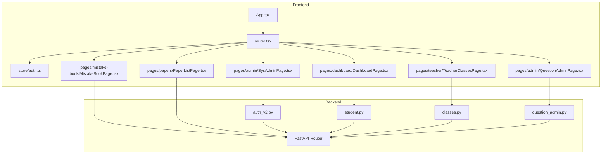
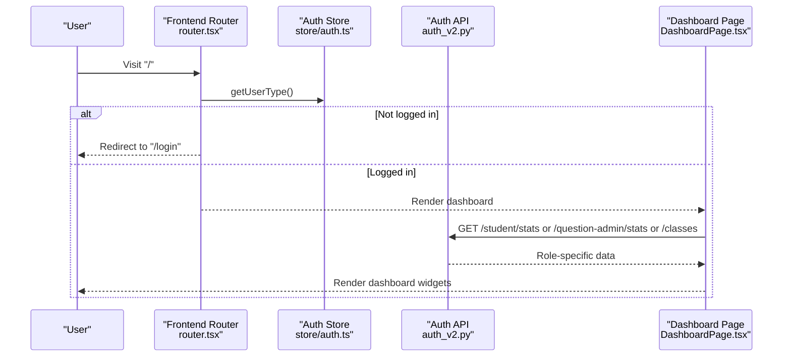
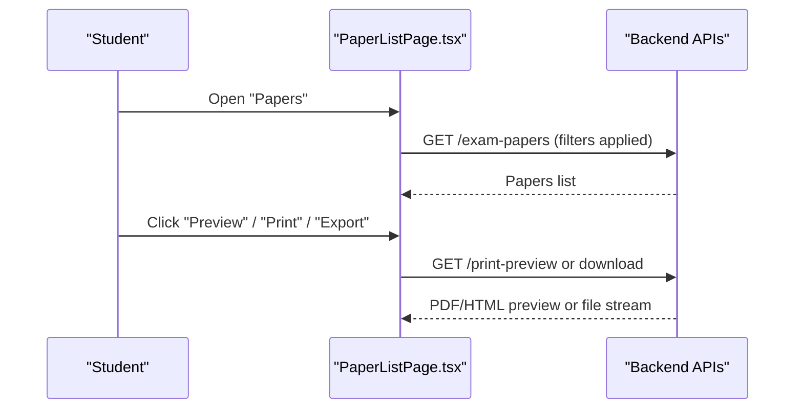
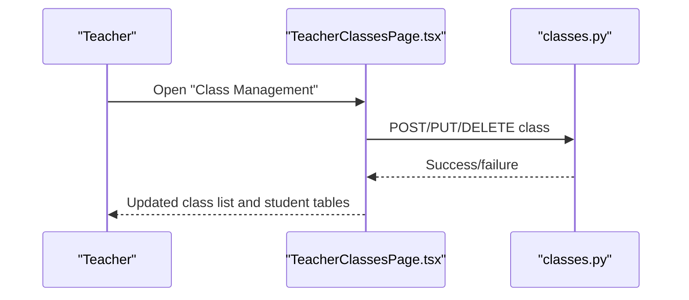
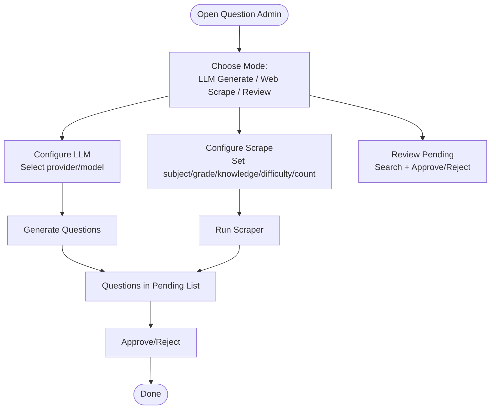
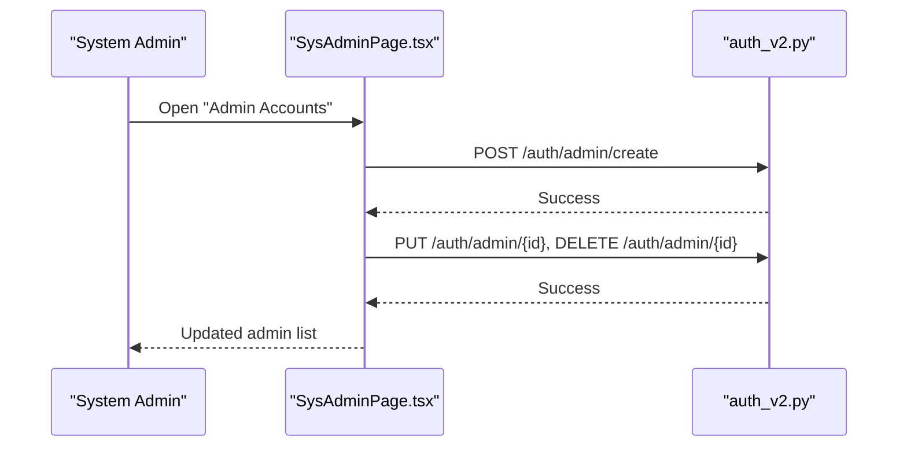
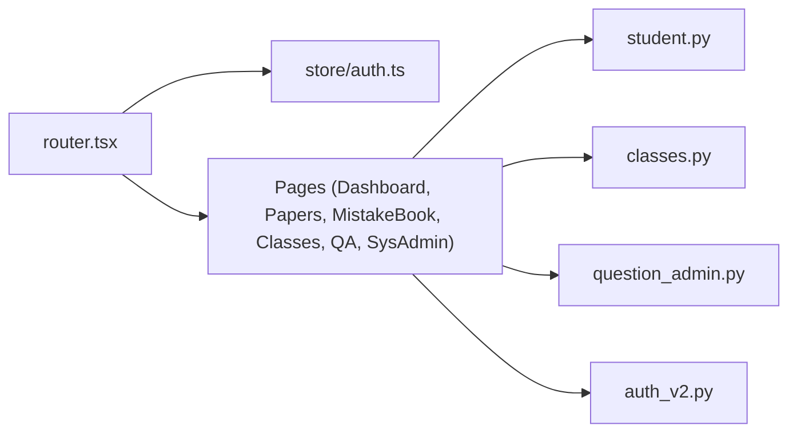

# User Guide

<cite>
**Referenced Files in This Document**
- [frontend/src/router.tsx](file://frontend/src/router.tsx)
- [frontend/src/store/auth.ts](file://frontend/src/store/auth.ts)
- [frontend/src/App.tsx](file://frontend/src/App.tsx)
- [frontend/src/pages/dashboard/DashboardPage.tsx](file://frontend/src/pages/dashboard/DashboardPage.tsx)
- [frontend/src/pages/mistake-book/MistakeBookPage.tsx](file://frontend/src/pages/mistake-book/MistakeBookPage.tsx)
- [frontend/src/pages/papers/PaperListPage.tsx](file://frontend/src/pages/papers/PaperListPage.tsx)
- [frontend/src/pages/teacher/TeacherClassesPage.tsx](file://frontend/src/pages/teacher/TeacherClassesPage.tsx)
- [frontend/src/pages/admin/QuestionAdminPage.tsx](file://frontend/src/pages/admin/QuestionAdminPage.tsx)
- [frontend/src/pages/admin/SysAdminPage.tsx](file://frontend/src/pages/admin/SysAdminPage.tsx)
- [backend/app/api/v1/endpoints/auth_v2.py](file://backend/app/api/v1/endpoints/auth_v2.py)
- [backend/app/api/v1/endpoints/student.py](file://backend/app/api/v1/endpoints/student.py)
- [backend/app/api/v1/endpoints/classes.py](file://backend/app/api/v1/endpoints/classes.py)
- [backend/app/api/v1/endpoints/question_admin.py](file://backend/app/api/v1/endpoints/question_admin.py)
- [backend/app/models/role.py](file://backend/app/models/role.py)
- [backend/app/schemas/user.py](file://backend/app/schemas/user.py)
</cite>

## Table of Contents
1. [Introduction](#introduction)
2. [Project Structure](#project-structure)
3. [Core Components](#core-components)
4. [Architecture Overview](#architecture-overview)
5. [Detailed Component Analysis](#detailed-component-analysis)
6. [Dependency Analysis](#dependency-analysis)
7. [Performance Considerations](#performance-considerations)
8. [Troubleshooting Guide](#troubleshooting-guide)
9. [Conclusion](#conclusion)
10. [Appendices](#appendices)

## Introduction
This user guide documents the Ruicheng Educational Management System across all user roles and their end-to-end workflows. It covers:
- Students: practice questions, exam taking, and accessing the error notebook
- Teachers: class management, exam creation, and analytics
- Question Administrators: intelligent question generation, content review, and approval
- System Administrators: system configuration and user management

The guide includes step-by-step instructions, feature discovery tips, common scenarios, navigation patterns, and troubleshooting advice. Screenshots are described to help you locate key UI elements quickly.

## Project Structure
The system is a modern full-stack application:
- Frontend built with React and Ant Design, routing and protected views handled centrally
- Backend built with FastAPI, organized by API version and feature endpoints
- Authentication supports multiple roles with role-aware routing and protected routes

**Diagram sources**
- [frontend/src/App.tsx:1-6](file://frontend/src/App.tsx#L1-L6)
- [frontend/src/router.tsx:1-79](file://frontend/src/router.tsx#L1-L79)
- [frontend/src/store/auth.ts:1-96](file://frontend/src/store/auth.ts#L1-L96)
- [frontend/src/pages/dashboard/DashboardPage.tsx:1-580](file://frontend/src/pages/dashboard/DashboardPage.tsx#L1-L580)
- [frontend/src/pages/mistake-book/MistakeBookPage.tsx:1-637](file://frontend/src/pages/mistake-book/MistakeBookPage.tsx#L1-L637)
- [frontend/src/pages/papers/PaperListPage.tsx:1-169](file://frontend/src/pages/papers/PaperListPage.tsx#L1-L169)
- [frontend/src/pages/teacher/TeacherClassesPage.tsx:1-334](file://frontend/src/pages/teacher/TeacherClassesPage.tsx#L1-L334)
- [frontend/src/pages/admin/QuestionAdminPage.tsx:1-669](file://frontend/src/pages/admin/QuestionAdminPage.tsx#L1-L669)
- [frontend/src/pages/admin/SysAdminPage.tsx:1-379](file://frontend/src/pages/admin/SysAdminPage.tsx#L1-L379)
- [backend/app/api/v1/endpoints/auth_v2.py:1-476](file://backend/app/api/v1/endpoints/auth_v2.py#L1-L476)
- [backend/app/api/v1/endpoints/student.py:1-112](file://backend/app/api/v1/endpoints/student.py#L1-L112)
- [backend/app/api/v1/endpoints/classes.py:1-243](file://backend/app/api/v1/endpoints/classes.py#L1-L243)
- [backend/app/api/v1/endpoints/question_admin.py:1-837](file://backend/app/api/v1/endpoints/question_admin.py#L1-L837)

**Section sources**
- [frontend/src/router.tsx:1-79](file://frontend/src/router.tsx#L1-L79)
- [frontend/src/store/auth.ts:1-96](file://frontend/src/store/auth.ts#L1-L96)

## Core Components
- Role-aware routing and protected routes ensure users land on the correct dashboard and cannot access unauthorized areas.
- Authentication supports:
  - Admin login with CAPTCHA and SMS verification
  - Student login and registration
  - Profile management and phone updates
- Dashboards:
  - Student dashboard aggregates performance metrics and recent activity
  - Teacher dashboard provides class and paper summaries plus quick actions
  - Question Administrator dashboard shows question statistics and pending reviews
  - System Administrator dashboard shows system health and configuration shortcuts

Best practices:
- Keep sessions secure by logging out after use
- Use the “Refresh” buttons to reload data after edits
- Prefer bulk actions for efficiency (e.g., batch approve questions)

**Section sources**
- [frontend/src/router.tsx:26-42](file://frontend/src/router.tsx#L26-L42)
- [frontend/src/pages/dashboard/DashboardPage.tsx:14-580](file://frontend/src/pages/dashboard/DashboardPage.tsx#L14-L580)
- [backend/app/api/v1/endpoints/auth_v2.py:75-238](file://backend/app/api/v1/endpoints/auth_v2.py#L75-L238)

## Architecture Overview
The system enforces role-based access at the UI and API layers. Users log in, receive tokens, and the frontend stores user type and identifiers for routing and dashboard rendering. Backend endpoints validate roles and return role-specific data.

**Diagram sources**
- [frontend/src/router.tsx:26-42](file://frontend/src/router.tsx#L26-L42)
- [frontend/src/store/auth.ts:10-14](file://frontend/src/store/auth.ts#L10-L14)
- [frontend/src/pages/dashboard/DashboardPage.tsx:32-72](file://frontend/src/pages/dashboard/DashboardPage.tsx#L32-L72)
- [backend/app/api/v1/endpoints/student.py:16-112](file://backend/app/api/v1/endpoints/student.py#L16-L112)
- [backend/app/api/v1/endpoints/classes.py:36-62](file://backend/app/api/v1/endpoints/classes.py#L36-L62)
- [backend/app/api/v1/endpoints/question_admin.py:346-412](file://backend/app/api/v1/endpoints/question_admin.py#L346-L412)

## Detailed Component Analysis

### Student Role
End-to-end workflow:
1. Login via student login page
2. Access dashboard to see performance metrics and recent papers
3. Take exams from the “Papers” list
4. Review mistakes and generate printed error notebooks

Key UI elements and steps:
- Dashboard cards: completed papers, accuracy rate, error count, highest score, subject distribution
- “Recent completed papers” table for quick access
- “Papers” list: search, filter by scope/grade/status, preview/print/export
- “Mistake Book”: filter by date/subject/keyword, preview, generate printed workbook, batch operations

**Diagram sources**
- [frontend/src/pages/papers/PaperListPage.tsx:31-51](file://frontend/src/pages/papers/PaperListPage.tsx#L31-L51)
- [frontend/src/pages/papers/PaperListPage.tsx:67-94](file://frontend/src/pages/papers/PaperListPage.tsx#L67-L94)

Common tasks:
- Practice mistakes: use “Generate printed error workbook”, “Preview”, “Print single”, and “Generate strengthen practice”
- Quick entry: add manual mistakes via “Quick entry” modal

Screenshots (descriptive):
- Dashboard overview: four KPI cards and recent papers table
- Papers list: search/filter toolbar, status tags, action buttons
- Mistake book: stats cards, filter bar, table with actions, preview/review modals

**Section sources**
- [frontend/src/pages/dashboard/DashboardPage.tsx:76-144](file://frontend/src/pages/dashboard/DashboardPage.tsx#L76-L144)
- [frontend/src/pages/papers/PaperListPage.tsx:13-53](file://frontend/src/pages/papers/PaperListPage.tsx#L13-L53)
- [frontend/src/pages/mistake-book/MistakeBookPage.tsx:13-637](file://frontend/src/pages/mistake-book/MistakeBookPage.tsx#L13-L637)

### Teacher Role
End-to-end workflow:
1. Login and navigate to the teacher dashboard
2. Manage classes (create, edit, enroll students)
3. Create and manage exam papers
4. View analytics and statistics

Key UI elements and steps:
- Dashboard: class counts, student totals, paper counts, quick action cards
- “Class Management”: create/edit classes, add/remove students, edit student info
- “Papers” list: create/edit, preview, export/print, delete
- Analytics: paper and question statistics pages

**Diagram sources**
- [frontend/src/pages/teacher/TeacherClassesPage.tsx:37-48](file://frontend/src/pages/teacher/TeacherClassesPage.tsx#L37-L48)
- [frontend/src/pages/teacher/TeacherClassesPage.tsx:54-78](file://frontend/src/pages/teacher/TeacherClassesPage.tsx#L54-L78)
- [backend/app/api/v1/endpoints/classes.py:16-33](file://backend/app/api/v1/endpoints/classes.py#L16-L33)

Common tasks:
- Enroll students: choose from available students or add manually
- Update student info: change name/email/grade/school
- Bulk actions: batch approve/reject questions (via Question Admin)

Screenshots (descriptive):
- Class list with student counts and status tags
- Add student modal with tabs for selecting or manual entry
- Papers list with export/print/delete actions

**Section sources**
- [frontend/src/pages/teacher/TeacherClassesPage.tsx:9-334](file://frontend/src/pages/teacher/TeacherClassesPage.tsx#L9-L334)
- [backend/app/api/v1/endpoints/classes.py:104-141](file://backend/app/api/v1/endpoints/classes.py#L104-L141)

### Question Administrator Role
End-to-end workflow:
1. Login and open the Question Admin dashboard
2. Generate questions via LLM or scrape from the web
3. Review and approve/reject pending questions
4. Manage syllabi and knowledge trees

Key UI elements and steps:
- Intelligent question generation: select provider/model, configure prompt, generate
- Web scraping: configure conditions, start scrape
- Review tab: search by type/difficulty/grade, approve/reject single or batch
- Question lists by source: filter by status and perform batch delete

**Diagram sources**
- [frontend/src/pages/admin/QuestionAdminPage.tsx:168-396](file://frontend/src/pages/admin/QuestionAdminPage.tsx#L168-L396)
- [frontend/src/pages/admin/QuestionAdminPage.tsx:399-545](file://frontend/src/pages/admin/QuestionAdminPage.tsx#L399-L545)
- [backend/app/api/v1/endpoints/question_admin.py:138-218](file://backend/app/api/v1/endpoints/question_admin.py#L138-L218)
- [backend/app/api/v1/endpoints/question_admin.py:417-474](file://backend/app/api/v1/endpoints/question_admin.py#L417-L474)
- [backend/app/api/v1/endpoints/question_admin.py:222-266](file://backend/app/api/v1/endpoints/question_admin.py#L222-L266)

Common tasks:
- Test LLM connection before generating
- Use “Batch approve/reject” for efficiency
- Extract knowledge from syllabi to build knowledge trees

Screenshots (descriptive):
- LLM generation panel with model selection and prompt preview
- Scrape configuration and progress indicator
- Review table with status badges and action buttons
- Question list by source with batch delete

**Section sources**
- [frontend/src/pages/admin/QuestionAdminPage.tsx:17-669](file://frontend/src/pages/admin/QuestionAdminPage.tsx#L17-L669)
- [backend/app/api/v1/endpoints/question_admin.py:85-106](file://backend/app/api/v1/endpoints/question_admin.py#L85-L106)
- [backend/app/api/v1/endpoints/question_admin.py:268-344](file://backend/app/api/v1/endpoints/question_admin.py#L268-L344)

### System Administrator Role
End-to-end workflow:
1. Login and open the System Admin dashboard
2. Manage administrator accounts (create/update/delete)
3. Configure system settings and monitor health

Key UI elements and steps:
- Administrator account management: create, edit, toggle active status, filter by name/type/subject/grade/status
- System overview: user/paper/question/class counts, database info, LLM status
- Quick links to configuration pages

**Diagram sources**
- [frontend/src/pages/admin/SysAdminPage.tsx:65-132](file://frontend/src/pages/admin/SysAdminPage.tsx#L65-L132)
- [backend/app/api/v1/endpoints/auth_v2.py:242-373](file://backend/app/api/v1/endpoints/auth_v2.py#L242-L373)

Common tasks:
- Create administrators with role-specific permissions
- Update subjects/grades for teachers
- Toggle activation status to suspend accounts

Screenshots (descriptive):
- Admin list with type tags and status badges
- Create/Edit modals with permission controls
- System overview dashboard with stats and quick actions

**Section sources**
- [frontend/src/pages/admin/SysAdminPage.tsx:22-379](file://frontend/src/pages/admin/SysAdminPage.tsx#L22-L379)
- [backend/app/api/v1/endpoints/auth_v2.py:377-476](file://backend/app/api/v1/endpoints/auth_v2.py#L377-L476)

## Dependency Analysis
- Routing depends on stored user type to decide which dashboard and pages to render
- Dashboards depend on role-specific backend endpoints for data
- Admin pages depend on role-aware endpoints for creating/updating/deleting administrators

**Diagram sources**
- [frontend/src/router.tsx:1-79](file://frontend/src/router.tsx#L1-L79)
- [frontend/src/store/auth.ts:1-96](file://frontend/src/store/auth.ts#L1-L96)
- [frontend/src/pages/dashboard/DashboardPage.tsx:32-72](file://frontend/src/pages/dashboard/DashboardPage.tsx#L32-L72)
- [backend/app/api/v1/endpoints/student.py:16-112](file://backend/app/api/v1/endpoints/student.py#L16-L112)
- [backend/app/api/v1/endpoints/classes.py:36-62](file://backend/app/api/v1/endpoints/classes.py#L36-L62)
- [backend/app/api/v1/endpoints/question_admin.py:346-412](file://backend/app/api/v1/endpoints/question_admin.py#L346-L412)
- [backend/app/api/v1/endpoints/auth_v2.py:242-373](file://backend/app/api/v1/endpoints/auth_v2.py#L242-L373)

**Section sources**
- [frontend/src/router.tsx:26-42](file://frontend/src/router.tsx#L26-L42)
- [frontend/src/store/auth.ts:10-14](file://frontend/src/store/auth.ts#L10-L14)

## Performance Considerations
- Use pagination and filters to reduce payload sizes on large lists (e.g., papers, questions, admins)
- Prefer bulk operations (e.g., batch approve/reject) to minimize repeated requests
- Refresh data after major edits to ensure UI reflects latest backend state

## Troubleshooting Guide
Common issues and resolutions:
- Login failures
  - Admin login: ensure CAPTCHA and SMS code are correct; verify role selection matches account type
  - Student login: verify SMS code and CAPTCHA; ensure account is active
- Dashboard shows no data
  - Student: ensure papers are submitted and graded; refresh dashboard
  - Teacher: ensure classes exist and students are enrolled
  - Question Admin/System Admin: refresh stats or check pending items
- Generating questions fails
  - Test LLM connection first; ensure provider/model is configured
  - Reduce count or adjust difficulty/knowledge point specificity
- Export/print issues
  - Ensure pop-ups are enabled; retry download if blocked
  - Use “Refresh” to reload data before exporting
- Admin management errors
  - Ensure unique usernames; verify phone uniqueness for student registration
  - Use filters to locate accounts quickly

**Section sources**
- [backend/app/api/v1/endpoints/auth_v2.py:91-184](file://backend/app/api/v1/endpoints/auth_v2.py#L91-L184)
- [backend/app/api/v1/endpoints/auth_v2.py:188-238](file://backend/app/api/v1/endpoints/auth_v2.py#L188-L238)
- [frontend/src/pages/admin/QuestionAdminPage.tsx:68-87](file://frontend/src/pages/admin/QuestionAdminPage.tsx#L68-L87)
- [frontend/src/pages/papers/PaperListPage.tsx:67-94](file://frontend/src/pages/papers/PaperListPage.tsx#L67-L94)

## Conclusion
This guide outlined the complete user journeys for Students, Teachers, Question Administrators, and System Administrators. By following the step-by-step instructions, leveraging filters and bulk actions, and consulting the troubleshooting section, you can efficiently operate the system and resolve common issues.

## Appendices

### Role Reference and Schema Notes
- Roles supported: STUDENT, TEACHER, QUESTION_ADMIN, ADMIN
- User creation and validation enforce role constraints
- Role-aware routing ensures users access only permitted pages

**Section sources**
- [backend/app/models/role.py:8-17](file://backend/app/models/role.py#L8-L17)
- [backend/app/schemas/user.py:13-16](file://backend/app/schemas/user.py#L13-L16)
- [frontend/src/router.tsx:26-42](file://frontend/src/router.tsx#L26-L42)