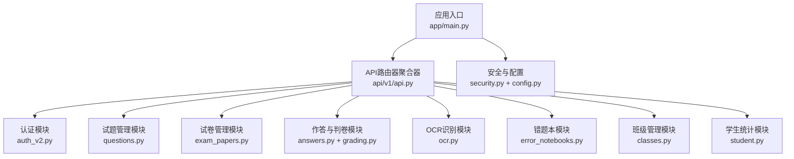
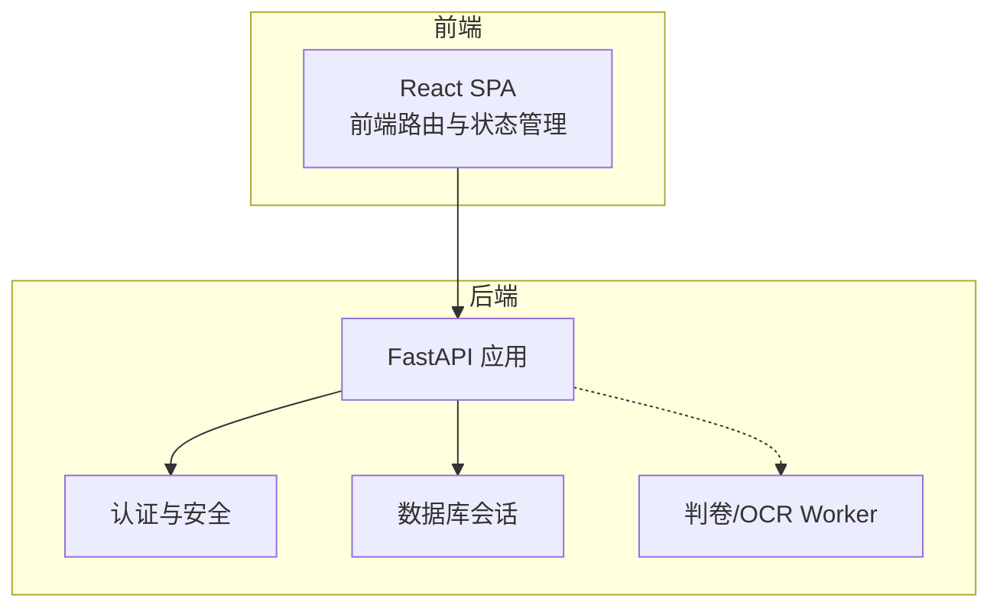
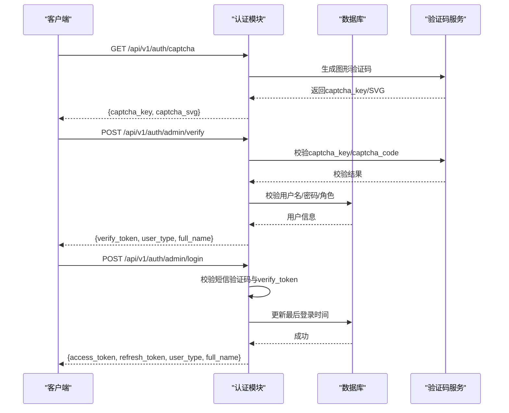
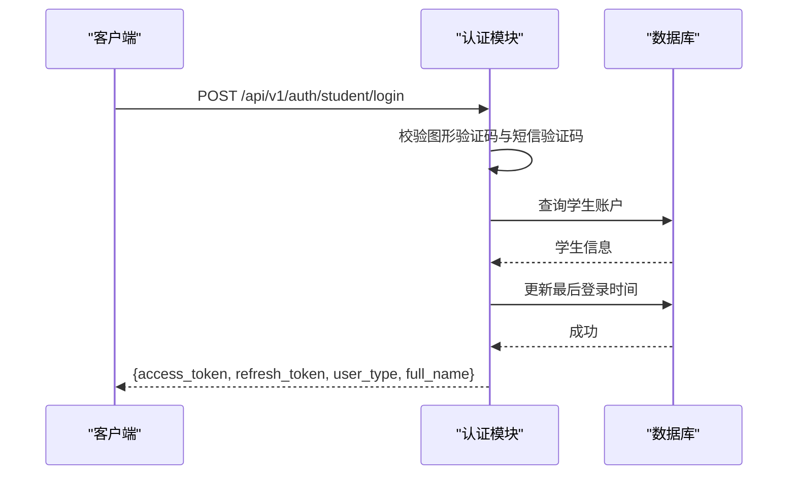
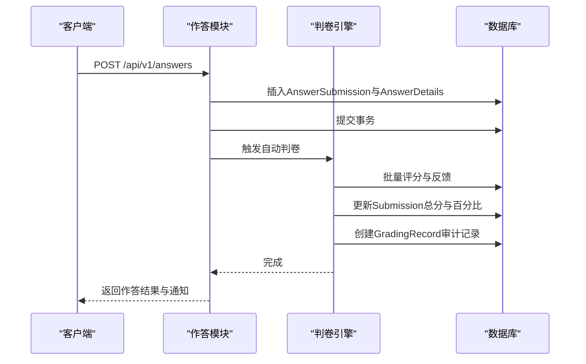
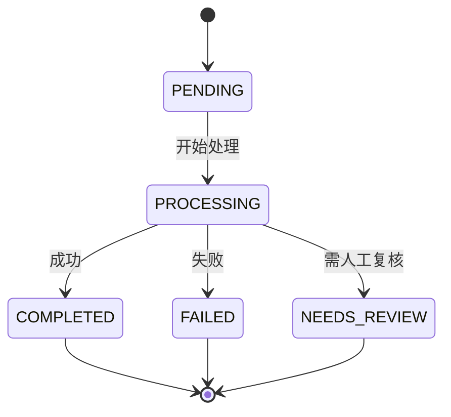
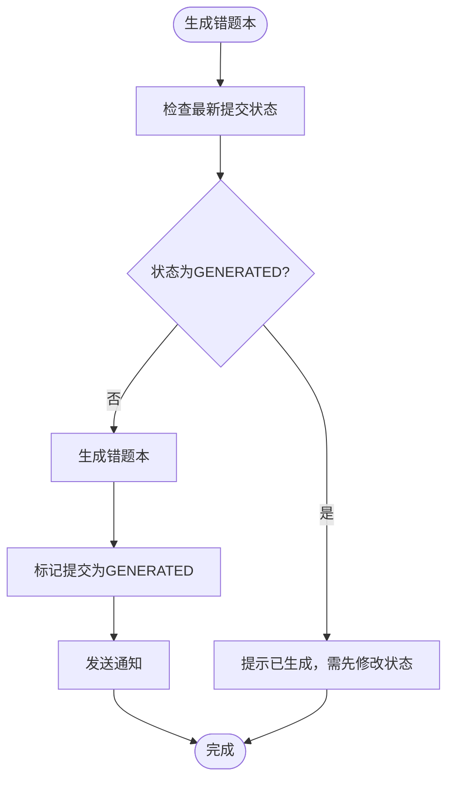
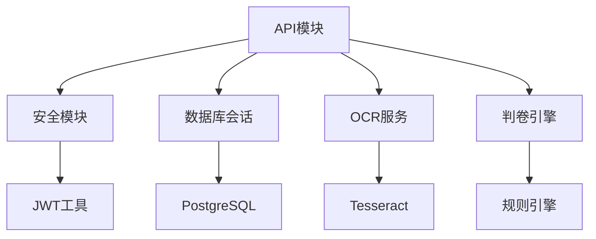

# API接口文档

<cite>
**本文档引用的文件**
- [backend/app/api/v1/api.py](file://backend/app/api/v1/api.py)
- [backend/app/api/v1/endpoints/auth_v2.py](file://backend/app/api/v1/endpoints/auth_v2.py)
- [backend/app/api/v1/endpoints/questions.py](file://backend/app/api/v1/endpoints/questions.py)
- [backend/app/api/v1/endpoints/exam_papers.py](file://backend/app/api/v1/endpoints/exam_papers.py)
- [backend/app/api/v1/endpoints/answers.py](file://backend/app/api/v1/endpoints/answers.py)
- [backend/app/api/v1/endpoints/grading.py](file://backend/app/api/v1/endpoints/grading.py)
- [backend/app/api/v1/endpoints/ocr.py](file://backend/app/api/v1/endpoints/ocr.py)
- [backend/app/api/v1/endpoints/error_notebooks.py](file://backend/app/api/v1/endpoints/error_notebooks.py)
- [backend/app/api/v1/endpoints/classes.py](file://backend/app/api/v1/endpoints/classes.py)
- [backend/app/api/v1/endpoints/student.py](file://backend/app/api/v1/endpoints/student.py)
- [backend/app/core/config.py](file://backend/app/core/config.py)
- [backend/app/core/security.py](file://backend/app/core/security.py)
- [backend/app/main.py](file://backend/app/main.py)
- [docs/project-summary.md](file://docs/project-summary.md)
- [docs/requirements-v2.2-user-refactor.md](file://docs/requirements-v2.2-user-refactor.md)
- [nDocs/backend-api-plan.md](file://nDocs/backend-api-plan.md)
</cite>

## 目录
1. [简介](#简介)
2. [项目结构](#项目结构)
3. [核心组件](#核心组件)
4. [架构概览](#架构概览)
5. [详细组件分析](#详细组件分析)
6. [依赖分析](#依赖分析)
7. [性能考虑](#性能考虑)
8. [故障排除指南](#故障排除指南)
9. [结论](#结论)
10. [附录](#附录)

## 简介
本文件为瑞珹教育管理系统（edu_system）的完整API接口文档，覆盖认证、用户管理、试题管理、试卷管理、在线作答与判卷、OCR识别、错题本以及班级与学生统计等核心功能模块。文档基于FastAPI构建，采用统一的响应包装、JWT认证与基于角色的访问控制（RBAC），并提供版本前缀/api/v1。本文档面向前后端开发者与测试工程师，帮助快速理解各端点的HTTP方法、URL模式、请求/响应结构、认证方式与错误处理策略，并给出常见使用场景与性能优化建议。

## 项目结构
后端采用模块化组织，API路由通过APIRouter集中注册，各业务模块在endpoints目录下实现具体端点。核心组件包括：
- API路由器聚合器：将各模块路由挂载至/api/v1前缀
- 认证与安全：JWT令牌生成与校验、OAuth2密码流、角色依赖注入
- 数据库会话：异步SQLAlchemy会话管理
- 统一响应中间件：对所有/api/v1响应进行统一包装

**图表来源**
- [backend/app/main.py:11-31](file://backend/app/main.py#L11-L31)
- [backend/app/api/v1/api.py:1-26](file://backend/app/api/v1/api.py#L1-L26)

**章节来源**
- [backend/app/main.py:11-31](file://backend/app/main.py#L11-L31)
- [backend/app/api/v1/api.py:1-26](file://backend/app/api/v1/api.py#L1-L26)

## 核心组件
- API版本与前缀：所有端点以/api/v1为前缀，版本号为1.0.0
- 统一响应包装：所有/api/v1响应被ApiResponseMiddleware包裹为{code, message, data}
- 认证与授权：基于JWT的OAuth2密码流，支持四种用户类型（学生、教师、题库管理员、系统管理员）
- 事务与一致性：关键写操作使用异步事务，确保多表一致性
- 速率限制与安全：项目中未实现速率限制中间件，建议在生产环境增加

**章节来源**
- [backend/app/core/config.py:36-47](file://backend/app/core/config.py#L36-L47)
- [backend/app/main.py:17-27](file://backend/app/main.py#L17-L27)
- [backend/app/core/security.py:50-95](file://backend/app/core/security.py#L50-L95)

## 架构概览
系统采用“模块化单体 + 独立Worker进程”的架构策略，将GPU密集型任务（判卷、OCR）作为独立worker运行，避免过早微服务化带来的运维复杂性。前端通过React+Ant Design提供交互界面，后端通过FastAPI提供RESTful API。

**图表来源**
- [docs/project-summary.md:61-73](file://docs/project-summary.md#L61-L73)

**章节来源**
- [docs/project-summary.md:61-73](file://docs/project-summary.md#L61-L73)

## 详细组件分析

### 认证API（/api/v1/auth）
- 端点概览
  - GET /auth/captcha：获取图形验证码（SVG）
  - POST /auth/admin/verify：管理员身份验证（用户名/密码/验证码校验）
  - POST /auth/admin/login：管理员登录（短信验证码+一次性验证令牌）
  - POST /auth/student/login：学生登录（验证码+短信验证码）
  - POST /auth/student/register：学生注册（手机号唯一性校验）
  - GET /auth/profile：获取当前用户资料（跨表查询）
  - PUT /auth/profile：更新个人资料（字段白名单）
  - PUT /auth/profile/phone：更新手机号（短信验证码）

- 认证流程（管理员）

**图表来源**
- [backend/app/api/v1/endpoints/auth_v2.py:75-183](file://backend/app/api/v1/endpoints/auth_v2.py#L75-L183)

- 认证流程（学生）

**图表来源**
- [backend/app/api/v1/endpoints/auth_v2.py:188-209](file://backend/app/api/v1/endpoints/auth_v2.py#L188-L209)

- 请求与响应要点
  - 认证方式：Bearer Token（JWT）
  - 用户类型：STUDENT/TEACHER/QUESTION_ADMIN/SYS_ADMIN
  - 令牌有效期：ACCESS_TOKEN_EXPIRE_MINUTES（约8天）、REFRESH_TOKEN_EXPIRE_DAYS（30天）
  - 错误处理：400（参数错误/验证码错误）、401（认证失败/过期）、403（权限不足）、404（资源不存在）

**章节来源**
- [backend/app/api/v1/endpoints/auth_v2.py:25-71](file://backend/app/api/v1/endpoints/auth_v2.py#L25-L71)
- [backend/app/core/security.py:50-95](file://backend/app/core/security.py#L50-L95)
- [backend/app/core/config.py:43-46](file://backend/app/core/config.py#L43-L46)

### 用户管理API（/api/v1/admin/*）
- 管理员创建与管理
  - POST /admin/create：系统管理员创建教师或题库管理员
  - GET /admin/list：查询管理员列表（支持名称、角色、状态、学科、年级过滤）
  - PUT /admin/{admin_id}：更新管理员信息（字段白名单）
  - DELETE /admin/{admin_id}：删除管理员
  - PUT /admin/{admin_id}/subjects：更新管理员学科分配

- 学生管理（教师/管理员）
  - GET /classes/{class_id}/students：列出班级学生
  - GET /classes/{class_id}/available-students：列出可添加的学生
  - POST /classes/{class_id}/students：添加学生（支持现有或新建）
  - DELETE /classes/{class_id}/students/{student_id}：移除学生
  - PUT /classes/{class_id}/students/{student_id}：更新学生信息（不包含手机号）

- 请求与响应要点
  - 权限：仅SYS_ADMIN可创建/删除管理员
  - 过滤与排序：支持多字段过滤与创建时间倒序
  - 错误处理：400（重复/参数错误）、403（权限不足）、404（资源不存在）

**章节来源**
- [backend/app/api/v1/endpoints/auth_v2.py:242-373](file://backend/app/api/v1/endpoints/auth_v2.py#L242-L373)
- [backend/app/api/v1/endpoints/classes.py:16-243](file://backend/app/api/v1/endpoints/classes.py#L16-L243)

### 试题管理API（/api/v1/questions）
- 端点概览
  - POST /questions：创建试题（仅教师/题库管理员/系统管理员）
  - GET /questions/search：高级搜索（支持学科、年级、范围、来源、题型、难度、关键词、典型题标记）
  - GET /questions：分页查询（支持过滤与总数统计）
  - GET /questions/{question_id}：获取试题详情
  - PUT /questions/{question_id}：更新试题（仅创建者或系统管理员）
  - DELETE /questions/{question_id}：删除试题
  - POST /questions/batch-import：批量导入（最多200条）
  - POST /questions/export：导出指定ID的试题
  - GET /questions/export：按条件导出（受配置限制，默认最大200）
  - GET /questions/typical：典型题列表（仅教师/题库管理员/系统管理员）
  - PUT /questions/{question_id}/typical：标记/取消典型题
  - POST /questions/deduplicate：去重（预留）

- 请求与响应要点
  - 权限：教师/题库管理员/系统管理员可写
  - 过滤：支持JSONB字段过滤（如grade_level.scope/grades/chapter/knowledge_points）
  - 导出：受配置项export_max限制
  - 错误处理：400（权限不足/参数错误）、403（权限不足）、404（资源不存在）

**章节来源**
- [backend/app/api/v1/endpoints/questions.py:17-434](file://backend/app/api/v1/endpoints/questions.py#L17-L434)
- [backend/app/services/config_service.py](file://backend/app/services/config_service.py)

### 试卷管理API（/api/v1/exam-papers）
- 端点概览
  - POST /exam-papers：创建试卷（支持同时导入题目）
  - GET /exam-papers/my：学生查看自己有答题记录的试卷
  - GET /exam-papers/{exam_paper_id}/review：学生查看试卷复盘（包含题目与答案）
  - GET /exam-papers/{exam_paper_id}：获取试卷详情
  - PUT /exam-papers/{exam_paper_id}：更新试卷（创建者/管理员/学生可更新）
  - DELETE /exam-papers/{exam_paper_id}：删除试卷（级联清理子表）
  - PUT /exam-papers/{exam_paper_id}/submission-status：学生修改提交状态（仅从GENERATED→RE_GRADED）
  - GET /exam-papers：分页查询（支持标题、状态、范围、年级、关键字）
  - POST /exam-papers/{exam_paper_id}/questions：添加题目（按位置与分数）
  - DELETE /exam-papers/{exam_paper_id}/questions/{question_id}：移除题目
  - PUT /exam-papers/{exam_paper_id}/questions/sort：排序题目
  - GET /exam-papers/{exam_paper_id}/questions：获取试卷题目
  - GET /exam-papers/{exam_paper_id}/export/word：导出Word
  - GET /exam-papers/{exam_paper_id}/export/pdf：导出PDF

- 请求与响应要点
  - 权限：教师/题库管理员/系统管理员可写；学生可读取与状态修改
  - 级联删除：删除试卷时清理关联的题目、答题记录、错题本、OCR上传
  - 导出：Word/PDF导出功能存在但实现为占位，需后续完善
  - 错误处理：400（状态转换限制/参数错误）、403（权限不足）、404（资源不存在）

**章节来源**
- [backend/app/api/v1/endpoints/exam_papers.py:20-844](file://backend/app/api/v1/endpoints/exam_papers.py#L20-L844)

### 在线作答与判卷API（/api/v1/answers + /api/v1/grading）
- 作答API
  - POST /answers：提交答案（立即自动判分，创建判卷记录）
  - GET /answers/{answer_id}：获取作答详情（仅本人或教师/管理员）
  - PUT /answers/{answer_id}：更新作答（仅未锁定状态且本人）
  - GET /answers/student/{student_id}/exam/{exam_paper_id}：获取某学生某试卷的作答
  - GET /answers/student/{student_id}：获取某学生作答列表
  - GET /answers/exam/{exam_paper_id}：获取某试卷作答列表（仅教师/管理员）
  - DELETE /answers/{answer_id}：删除作答（仅未锁定状态且本人）

- 判卷API
  - POST /grading/start：开始判卷（标记为判卷中，异步执行）
  - GET /grading/status/{grading_id}：查询判卷状态
  - GET /grading/result/{grading_id}：获取判卷结果
  - GET /grading/history/student/{student_id}：学生判卷历史（分页）
  - GET /grading/history/exam/{exam_paper_id}：教师查看试卷判卷历史（分页）
  - GET /grading/models：获取可用判卷模型
  - POST /grading/models/switch：切换判卷模型（仅系统管理员）
  - GET /grading/models/current：获取当前判卷模型

- 判卷流程

**图表来源**
- [backend/app/api/v1/endpoints/answers.py:24-113](file://backend/app/api/v1/endpoints/answers.py#L24-L113)
- [backend/app/api/v1/endpoints/grading.py:19-55](file://backend/app/api/v1/endpoints/grading.py#L19-L55)

- 请求与响应要点
  - 自动判卷：规则引擎评分，支持单选、多选、填空、主观题
  - 错题本联动：当百分比小于100时自动生成错题本
  - 权限：学生仅能操作自己的作答；教师/管理员可查看全部
  - 错误处理：400（状态锁定/参数错误）、403（权限不足）、404（资源不存在）

**章节来源**
- [backend/app/api/v1/endpoints/answers.py:115-421](file://backend/app/api/v1/endpoints/answers.py#L115-L421)
- [backend/app/api/v1/endpoints/grading.py:19-143](file://backend/app/api/v1/endpoints/grading.py#L19-L143)

### OCR识别API（/api/v1/ocr）
- 端点概览
  - POST /ocr/upload：上传图片（multipart/form-data），调用OCR处理
  - POST /ocr/upload/file：直接上传文件（二进制），调用OCR处理
  - GET /ocr/status/{upload_id}：查询处理状态
  - GET /ocr/result/{upload_id}：获取识别结果
  - GET /ocr：分页查询OCR记录（学生仅能查自己的）
  - PUT /ocr/{upload_id}：更新OCR记录（仅本人）
  - DELETE /ocr/{upload_id}：删除OCR记录（仅本人）
  - GET /ocr/config：获取OCR配置（占位）
  - PUT /ocr/config：更新OCR配置（仅系统管理员，占位）
  - POST /ocr/batch-upload：批量上传（预留）
  - GET /ocr/batch-status/{batch_id}：批量状态查询（预留）

- 状态流转

**图表来源**
- [backend/app/api/v1/endpoints/ocr.py:18-64](file://backend/app/api/v1/endpoints/ocr.py#L18-L64)

- 请求与响应要点
  - 权限：仅学生可上传与操作
  - 存储：临时文件路径与结构化数据保存
  - 错误处理：400（权限不足/参数错误）、403（权限不足）、404（资源不存在）

**章节来源**
- [backend/app/api/v1/endpoints/ocr.py:18-291](file://backend/app/api/v1/endpoints/ocr.py#L18-L291)

### 错题本API（/api/v1/error-notebooks）
- 端点概览
  - POST /error-notebooks/generate：生成错题本（根据最新提交状态）
  - GET /error-notebooks/{notebook_id}：获取错题本详情（含题目与解释）
  - GET /error-notebooks/student/{student_id}：获取学生错题本列表
  - DELETE /error-notebooks/{notebook_id}：删除错题本（级联删除子项）
  - POST /error-notebooks/{notebook_id}/practice：为错题生成强化练习（LLM）
  - GET /error-notebooks/{notebook_id}/export/pdf：导出PDF（文本版）
  - GET /error-notebooks/{notebook_id}/export/word：导出Word（文本版）
  - GET /error-notebooks/stats/student/{student_id}：学生错题统计
  - POST /error-notebooks/manual-entry：手动录入错题

- 错题本流程

**图表来源**
- [backend/app/api/v1/endpoints/error_notebooks.py:22-59](file://backend/app/api/v1/endpoints/error_notebooks.py#L22-L59)

- 请求与响应要点
  - 权限：本人或教师/题库管理员/系统管理员可查看
  - 强化练习：通过LLM生成对应题目的练习题
  - 导出：当前为文本导出，Word/PDF导出占位
  - 错误处理：400（状态限制/参数错误）、403（权限不足）、404（资源不存在）

**章节来源**
- [backend/app/api/v1/endpoints/error_notebooks.py:22-437](file://backend/app/api/v1/endpoints/error_notebooks.py#L22-L437)

### 班级与学生统计API（/api/v1/classes + /api/v1/student）
- 班级管理
  - POST /classes：创建班级（仅教师/系统管理员）
  - GET /classes：查询班级列表（教师仅能看自己班级）
  - PUT /classes/{class_id}：更新班级
  - DELETE /classes/{class_id}：删除班级（级联清理）
  - GET /classes/{class_id}/students：列出班级学生
  - GET /classes/{class_id}/available-students：列出可添加的学生
  - POST /classes/{class_id}/students：添加学生（支持新建）
  - DELETE /classes/{class_id}/students/{student_id}：移除学生
  - PUT /classes/{class_id}/students/{student_id}：更新学生信息
  - GET /classes/{class_id}/students/{student_id}：获取学生详情

- 学生统计
  - GET /student/stats：获取学生仪表板统计数据（完成试卷数、平均准确率、错题数、最高分、最近5份试卷、学科分布）

- 请求与响应要点
  - 权限：教师/系统管理员可写；学生仅能查看自己的统计
  - 错误处理：400（重复/参数错误）、403（权限不足）、404（资源不存在）

**章节来源**
- [backend/app/api/v1/endpoints/classes.py:16-243](file://backend/app/api/v1/endpoints/classes.py#L16-L243)
- [backend/app/api/v1/endpoints/student.py:16-112](file://backend/app/api/v1/endpoints/student.py#L16-L112)

## 依赖分析
- 组件耦合
  - API路由器聚合器集中管理各模块路由，降低模块间耦合
  - 认证中间件与安全模块解耦，便于扩展
  - 事务封装在关键写操作中，保证一致性
- 外部依赖
  - 数据库：PostgreSQL（异步驱动）
  - 缓存：Redis（配置项存在，中间件未实现）
  - OCR：Tesseract（可用性检测），PaddleOCR（预留）
  - 判卷：规则引擎（占位），LLM（预留）

**图表来源**
- [backend/app/api/v1/endpoints/ocr.py:11-13](file://backend/app/api/v1/endpoints/ocr.py#L11-L13)
- [backend/app/api/v1/endpoints/answers.py:15-16](file://backend/app/api/v1/endpoints/answers.py#L15-L16)

**章节来源**
- [backend/app/core/config.py:74-86](file://backend/app/core/config.py#L74-L86)

## 性能考虑
- 分页与限制
  - 默认每页20条，最大200条，防止过度查询
  - 导出受配置限制，默认最大200条
- 事务与锁
  - 关键写操作使用异步事务，减少并发冲突
  - 作答状态锁定（GENERATED/RE_GRADED）防止误操作
- 缓存与中间件
  - Redis配置存在但未实现缓存中间件，建议引入速率限制与缓存中间件
- I/O与大文件
  - OCR上传文件大小限制为10MB，建议在网关层设置Nginx上传限制
- 并发与判卷
  - 判卷与OCR建议作为独立Worker异步处理，避免阻塞主API

[本节为通用指导，无需特定文件引用]

## 故障排除指南
- 常见错误码
  - 400：参数错误、验证码错误、状态转换限制
  - 401：认证失败、令牌无效或过期
  - 403：权限不足、非本人操作
  - 404：资源不存在
- 排查步骤
  - 确认Bearer Token是否正确传递与未过期
  - 检查用户类型与目标端点权限是否匹配
  - 核对作答状态是否为GENERATED导致无法修改
  - 检查OCR状态是否为FAILED或NEEDS_REVIEW
  - 查看数据库连接与事务是否正常提交
- 日志与监控
  - 后端启用了基础日志，建议在生产环境增加结构化日志与指标监控

**章节来源**
- [backend/app/api/v1/endpoints/answers.py:230-257](file://backend/app/api/v1/endpoints/answers.py#L230-L257)
- [backend/app/api/v1/endpoints/ocr.py:92-113](file://backend/app/api/v1/endpoints/ocr.py#L92-L113)

## 结论
本API文档系统性地梳理了瑞珹教育管理系统的RESTful接口，涵盖认证、试题、试卷、作答判卷、OCR、错题本与班级统计等核心模块。通过统一的JWT认证、RBAC权限控制与事务一致性保障，系统具备良好的扩展性与安全性。建议在生产环境中补充速率限制、缓存中间件与监控告警，并完善OCR与判卷的GPU加速与异步Worker部署，以满足高并发与高性能需求。

[本节为总结性内容，无需特定文件引用]

## 附录

### API版本控制
- 版本前缀：/api/v1
- 版本号：1.0.0
- 开放API文档：/api/v1/docs

**章节来源**
- [backend/app/core/config.py:38-40](file://backend/app/core/config.py#L38-L40)
- [backend/app/main.py:12-14](file://backend/app/main.py#L12-L14)

### 速率限制与安全
- 速率限制：项目中未实现速率限制中间件
- 建议措施：引入基于Redis的限流中间件，结合IP与用户维度进行限流
- 安全加固：启用HTTPS、CORS白名单、CSRF防护、敏感信息脱敏

[本节为通用指导，无需特定文件引用]

### API客户端实现指南
- 认证流程
  - 获取验证码：GET /api/v1/auth/captcha
  - 管理员登录：POST /api/v1/auth/admin/verify → POST /api/v1/auth/admin/login
  - 学生登录：POST /api/v1/auth/student/login
  - 使用返回的access_token作为Authorization: Bearer头
- 错误处理
  - 统一捕获401/403/404/422等错误码，提示用户重新登录或检查权限
- 性能优化
  - 对高频查询使用分页与过滤，避免一次性拉取大量数据
  - 对OCR与判卷类耗时操作使用轮询或WebSocket订阅结果

**章节来源**
- [backend/app/api/v1/endpoints/auth_v2.py:75-183](file://backend/app/api/v1/endpoints/auth_v2.py#L75-L183)
- [backend/app/core/security.py:50-95](file://backend/app/core/security.py#L50-L95)