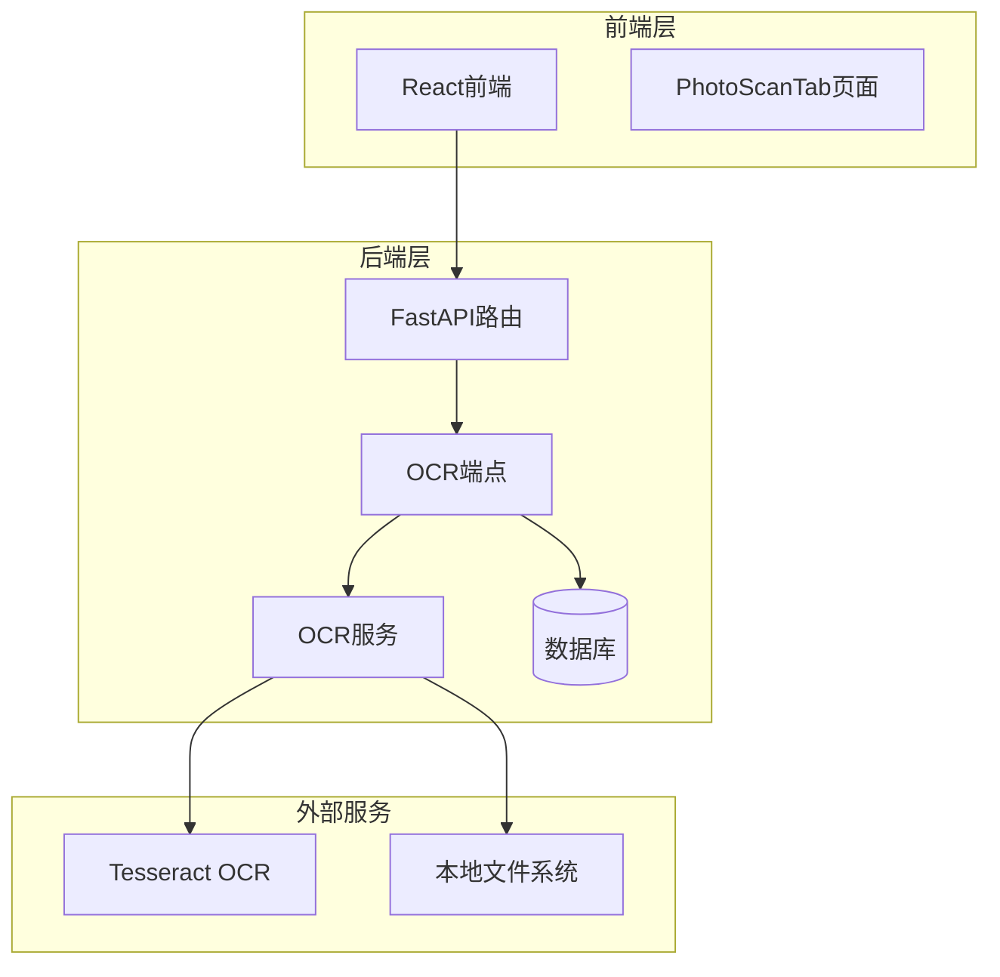
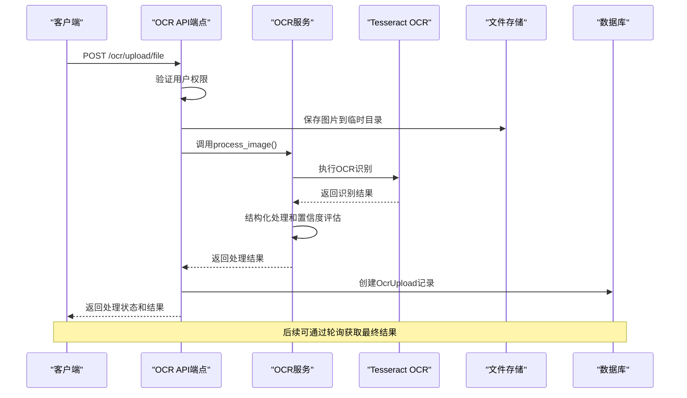
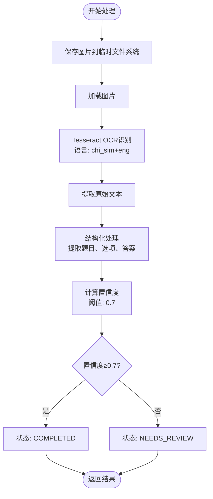
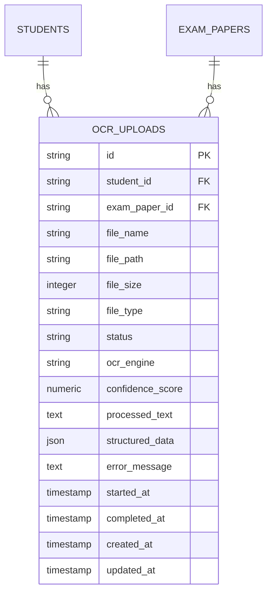
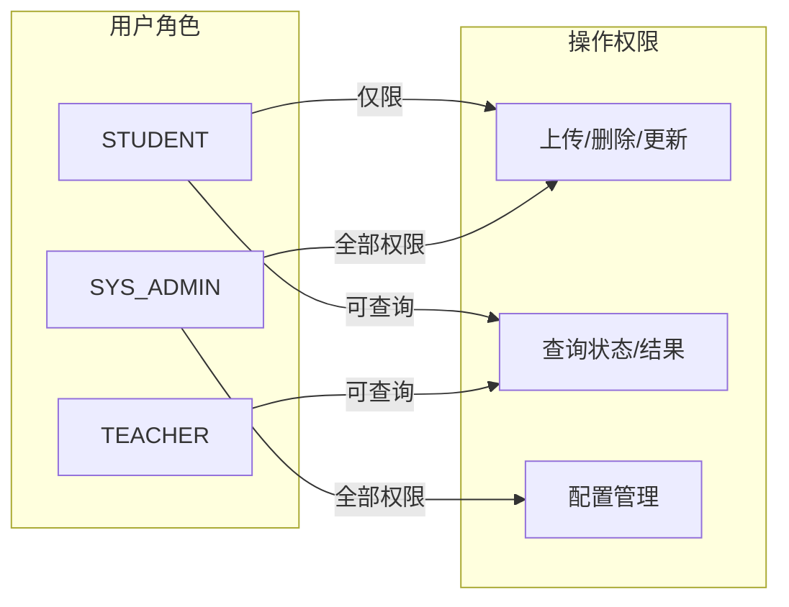
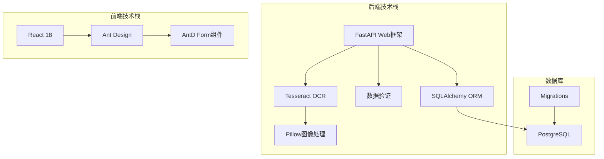

# OCR识别API

<cite>
**本文档引用的文件**
- [backend/app/api/v1/endpoints/ocr.py](file://backend/app/api/v1/endpoints/ocr.py)
- [backend/app/schemas/ocr.py](file://backend/app/schemas/ocr.py)
- [backend/app/services/ocr_service.py](file://backend/app/services/ocr_service.py)
- [backend/app/models/ocr_upload.py](file://backend/app/models/ocr_upload.py)
- [backend/app/api/v1/api.py](file://backend/app/api/v1/api.py)
- [frontend/src/pages/exam-mistakes/PhotoScanTab.tsx](file://frontend/src/pages/exam-mistakes/PhotoScanTab.tsx)
- [nDocs/ocr-integration-plan.md](file://nDocs/ocr-integration-plan.md)
- [backend/alembic/versions/001_v22_initial.py](file://backend/alembic/versions/001_v22_initial.py)
- [backend/alembic/versions/005_add_ocr_needs_review_status.py](file://backend/alembic/versions/005_add_ocr_needs_review_status.py)
</cite>

## 目录
1. [简介](#简介)
2. [项目结构](#项目结构)
3. [核心组件](#核心组件)
4. [架构概览](#架构概览)
5. [详细组件分析](#详细组件分析)
6. [依赖关系分析](#依赖关系分析)
7. [性能考虑](#性能考虑)
8. [故障排除指南](#故障排除指南)
9. [结论](#结论)
10. [附录](#附录)

## 简介
本文件为OCR识别系统的详细API文档，涵盖图片上传、文字识别、结果审核、批量处理等功能接口。文档详细说明了支持的图片格式、识别精度设置、语言选择、版面分析等参数配置，并提供了OCR结果的数据结构、坐标信息、置信度评估等技术细节。同时包含图片预处理、结果后处理的最佳实践和API调用示例。

## 项目结构
OCR识别系统采用前后端分离架构，后端基于FastAPI框架，前端使用React + Ant Design构建用户界面。



**图表来源**
- [backend/app/api/v1/api.py:1-26](file://backend/app/api/v1/api.py#L1-L26)
- [backend/app/api/v1/endpoints/ocr.py:15-291](file://backend/app/api/v1/endpoints/ocr.py#L15-L291)

**章节来源**
- [backend/app/api/v1/api.py:1-26](file://backend/app/api/v1/api.py#L1-L26)
- [backend/app/api/v1/endpoints/ocr.py:15-291](file://backend/app/api/v1/endpoints/ocr.py#L15-L291)

## 核心组件
OCR识别系统由以下核心组件构成：

### 1. API端点层
- **图片上传端点**: 支持multipart/form-data和JSON两种上传方式
- **状态查询端点**: 获取OCR处理状态和结果
- **配置管理端点**: OCR引擎配置和参数设置
- **批量处理端点**: 批量上传和状态查询（预留功能）

### 2. 业务逻辑层
- **OCR服务**: 集成Tesseract OCR进行文字识别
- **结果处理**: 文本结构化、置信度评估、问题提取
- **状态管理**: 处理状态流转（PENDING → PROCESSING → COMPLETED/FAILED/NEEDS_REVIEW）

### 3. 数据模型层
- **OcrUpload模型**: 存储OCR处理记录和结果
- **Pydantic模式**: 数据验证和序列化
- **数据库约束**: 状态枚举和数据完整性检查

**章节来源**
- [backend/app/api/v1/endpoints/ocr.py:18-291](file://backend/app/api/v1/endpoints/ocr.py#L18-L291)
- [backend/app/services/ocr_service.py:1-126](file://backend/app/services/ocr_service.py#L1-L126)
- [backend/app/models/ocr_upload.py:8-36](file://backend/app/models/ocr_upload.py#L8-L36)

## 架构概览
OCR识别系统采用分层架构设计，实现了从图片上传到结果输出的完整流程。



**图表来源**
- [backend/app/api/v1/endpoints/ocr.py:18-64](file://backend/app/api/v1/endpoints/ocr.py#L18-L64)
- [backend/app/services/ocr_service.py:61-125](file://backend/app/services/ocr_service.py#L61-L125)

## 详细组件分析

### API端点详解

#### 图片上传接口
系统提供两种图片上传方式：

**多部分表单上传**
- **端点**: POST `/ocr/upload/file`
- **参数**: 
  - `file`: 图片文件（支持多种格式）
  - `exam_paper_id`: 试卷ID（可选）
- **特点**: 直接上传图片文件，立即执行OCR处理

**JSON数据上传**
- **端点**: POST `/ocr/upload`
- **参数**: JSON格式的OcrUploadCreate对象
- **特点**: 先创建记录，后续异步处理

**章节来源**
- [backend/app/api/v1/endpoints/ocr.py:18-89](file://backend/app/api/v1/endpoints/ocr.py#L18-L89)

#### 状态查询接口
**状态查询**
- **端点**: GET `/ocr/status/{upload_id}`
- **功能**: 获取OCR处理状态
- **权限**: 仅上传者或教师/管理员可访问

**结果获取**
- **端点**: GET `/ocr/result/{upload_id}`
- **功能**: 获取OCR识别结果
- **权限**: 仅上传者或教师/管理员可访问

**章节来源**
- [backend/app/api/v1/endpoints/ocr.py:92-137](file://backend/app/api/v1/endpoints/ocr.py#L92-L137)

#### 配置管理接口
**配置获取**
- **端点**: GET `/ocr/config`
- **功能**: 获取OCR引擎配置
- **当前实现**: 返回占位符配置（PaddleOCR配置）

**配置更新**
- **端点**: PUT `/ocr/config`
- **功能**: 更新OCR引擎配置
- **权限**: 仅系统管理员可操作

**章节来源**
- [backend/app/api/v1/endpoints/ocr.py:239-267](file://backend/app/api/v1/endpoints/ocr.py#L239-L267)

#### 批量处理接口
**批量上传**
- **端点**: POST `/ocr/batch-upload`
- **功能**: 批量上传图片（预留功能）
- **状态**: 未实现

**批量状态查询**
- **端点**: GET `/ocr/batch-status/{batch_id}`
- **功能**: 查询批量处理状态（预留功能）
- **状态**: 未实现

**章节来源**
- [backend/app/api/v1/endpoints/ocr.py:270-291](file://backend/app/api/v1/endpoints/ocr.py#L270-L291)

### OCR服务组件

#### 图像处理流程
OCR服务的核心处理流程包括：

1. **图像保存**: 将上传的图片字节流保存到临时文件系统
2. **OCR识别**: 使用Tesseract引擎进行文字识别
3. **文本结构化**: 提取题目、选项、答案等结构化信息
4. **置信度评估**: 基于文本质量计算识别置信度
5. **状态确定**: 根据置信度决定处理状态



**图表来源**
- [backend/app/services/ocr_service.py:61-125](file://backend/app/services/ocr_service.py#L61-L125)

#### 置信度评估算法
置信度评估基于以下启发式规则：
- **中文字符比例**: 更多中文字符提高置信度
- **文本长度**: 更长的文本通常更可靠
- **行数统计**: 行数越多，置信度越高
- **阈值设定**: 0.7作为高质量识别的标准

**章节来源**
- [backend/app/services/ocr_service.py:45-58](file://backend/app/services/ocr_service.py#L45-L58)

### 数据模型设计

#### OcrUpload模型
OcrUpload模型定义了OCR处理记录的完整结构：



**图表来源**
- [backend/app/models/ocr_upload.py:8-36](file://backend/app/models/ocr_upload.py#L8-L36)
- [backend/alembic/versions/001_v22_initial.py:172-192](file://backend/alembic/versions/001_v22_initial.py#L172-L192)

#### Pydantic模式验证
系统使用Pydantic模式确保数据的完整性和有效性：

**OcrUploadBase**: 基础字段定义
- 文件名、路径、大小、类型验证
- 置信度分数范围限制（0-1）
- 状态枚举验证

**OcrUploadCreate**: 创建模式
- 继承基础字段
- 无ID和时间戳字段

**OcrUploadResponse**: 响应模式
- 包含所有基础字段
- 添加ID、学生ID、考试ID
- 时间戳字段

**章节来源**
- [backend/app/schemas/ocr.py:7-48](file://backend/app/schemas/ocr.py#L7-L48)

### 权限控制机制

系统实现了多层次的权限控制：



**权限规则**:
- 学生只能操作自己的OCR记录
- 教师可以查询所有学生的OCR记录
- 系统管理员拥有所有权限

**章节来源**
- [backend/app/api/v1/endpoints/ocr.py:26,74,107,131,174,213:26-213](file://backend/app/api/v1/endpoints/ocr.py#L26-L213)

## 依赖关系分析

### 技术栈依赖
系统采用现代化的技术栈组合：



**图表来源**
- [backend/app/services/ocr_service.py:9-14](file://backend/app/services/ocr_service.py#L9-L14)
- [frontend/src/pages/exam-mistakes/PhotoScanTab.tsx:1-186](file://frontend/src/pages/exam-mistakes/PhotoScanTab.tsx#L1-L186)

### 外部依赖管理
系统对外部依赖进行了有效管理：

**Python依赖**:
- `pytesseract`: OCR引擎接口
- `Pillow`: 图像处理库
- `fastapi`: Web框架
- `sqlalchemy`: 数据库ORM

**系统依赖**:
- `tesseract-ocr`: OCR引擎
- `tesseract-ocr-chi-sim`: 中文简体语言包

**章节来源**
- [backend/app/services/ocr_service.py:9-14](file://backend/app/services/ocr_service.py#L9-L14)

## 性能考虑

### 并发处理策略
系统采用同步处理模式，适用于中小规模应用：

**当前架构特点**:
- 图片上传和OCR处理在同一请求中完成
- 适合小图片和低并发场景
- 实现简单，部署成本低

**性能优化建议**:
- 大图片处理时考虑异步队列
- 实现图片缓存机制
- 添加CDN加速静态资源

### 存储优化
**文件系统存储**:
- 使用临时目录存储上传的图片
- 支持多种图片格式（JPG、PNG等）
- 文件命名采用UUID避免冲突

**数据库优化**:
- 状态字段添加索引
- JSON字段用于灵活存储结构化数据
- 时间戳字段支持快速查询

## 故障排除指南

### 常见问题及解决方案

**Tesseract未安装**
- **症状**: OCR处理失败，返回错误信息
- **解决方案**: 安装tesseract-ocr和中文语言包
- **参考**: `apt-get install tesseract-ocr tesseract-ocr-chi-sim`

**权限不足**
- **症状**: HTTP 403 Forbidden错误
- **解决方案**: 确保用户角色为STUDENT或具有相应权限
- **参考**: 权限验证逻辑在各个端点中实现

**文件格式不支持**
- **症状**: 图片无法识别或处理异常
- **解决方案**: 确保上传JPG、PNG等常见格式
- **参考**: Pillow库支持的图片格式

**章节来源**
- [backend/app/services/ocr_service.py:71-78](file://backend/app/services/ocr_service.py#L71-L78)
- [backend/app/api/v1/endpoints/ocr.py:26,74,107,131,174,213:26-213](file://backend/app/api/v1/endpoints/ocr.py#L26-L213)

### 调试技巧
1. **启用详细日志**: 在开发环境中开启OCR服务日志
2. **检查文件权限**: 确保临时目录有读写权限
3. **验证依赖安装**: 使用`pip list`检查依赖版本
4. **测试OCR引擎**: 单独测试Tesseract命令行工具

## 结论
OCR识别系统提供了完整的图片识别解决方案，具有以下特点：

**优势**:
- 简洁的API设计，易于集成
- 完整的权限控制机制
- 灵活的配置管理
- 清晰的状态流转

**扩展方向**:
- 集成PaddleOCR提升识别精度
- 实现异步处理支持大图片
- 添加批处理功能
- 集成对象存储服务

系统为教育场景的自动阅卷提供了坚实的技术基础，可根据实际需求进行功能扩展和性能优化。

## 附录

### API调用示例

#### 基本图片上传
```javascript
// 前端调用示例
const formData = new FormData();
formData.append('file', selectedFile);
formData.append('exam_paper_id', 'your-exam-paper-id');

const response = await fetch('/ocr/upload/file', {
  method: 'POST',
  body: formData
});
```

#### 获取处理状态
```javascript
// 轮询状态查询
const getStatus = async (uploadId) => {
  const response = await fetch(`/ocr/status/${uploadId}`);
  return response.json();
};
```

#### 获取识别结果
```javascript
// 获取最终结果
const getResult = async (uploadId) => {
  const response = await fetch(`/ocr/result/${uploadId}`);
  return response.json();
};
```

### 数据结构说明

#### OCR结果数据结构
```json
{
  "status": "COMPLETED",
  "confidence": 0.85,
  "raw_text": "识别的原始文本",
  "questions": [
    {
      "index": 1,
      "title": "题目内容",
      "type": "SINGLE_CHOICE",
      "student_answer": "A",
      "options": ["A. 选项1", "B. 选项2"],
      "correct": null
    }
  ],
  "total_questions": 10
}
```

### 最佳实践建议

**图片预处理**:
- 确保图片清晰，避免模糊和倾斜
- 保持适当的对比度和亮度
- 避免反光和阴影影响识别效果

**结果后处理**:
- 对低置信度结果进行人工复核
- 建立错误反馈机制
- 定期评估和调整置信度阈值

**章节来源**
- [frontend/src/pages/exam-mistakes/PhotoScanTab.tsx:37-61](file://frontend/src/pages/exam-mistakes/PhotoScanTab.tsx#L37-L61)
- [backend/app/services/ocr_service.py:118-125](file://backend/app/services/ocr_service.py#L118-L125)