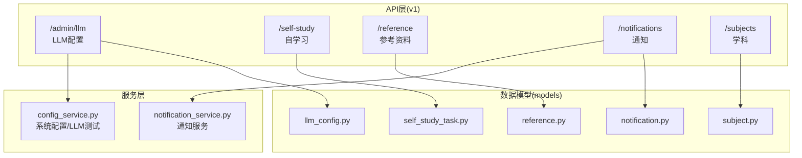
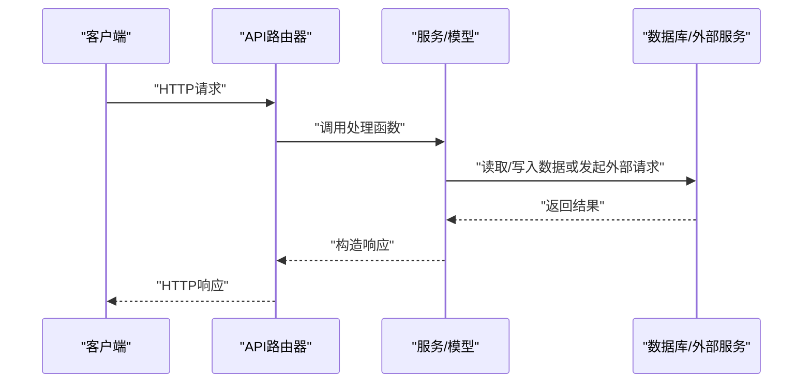
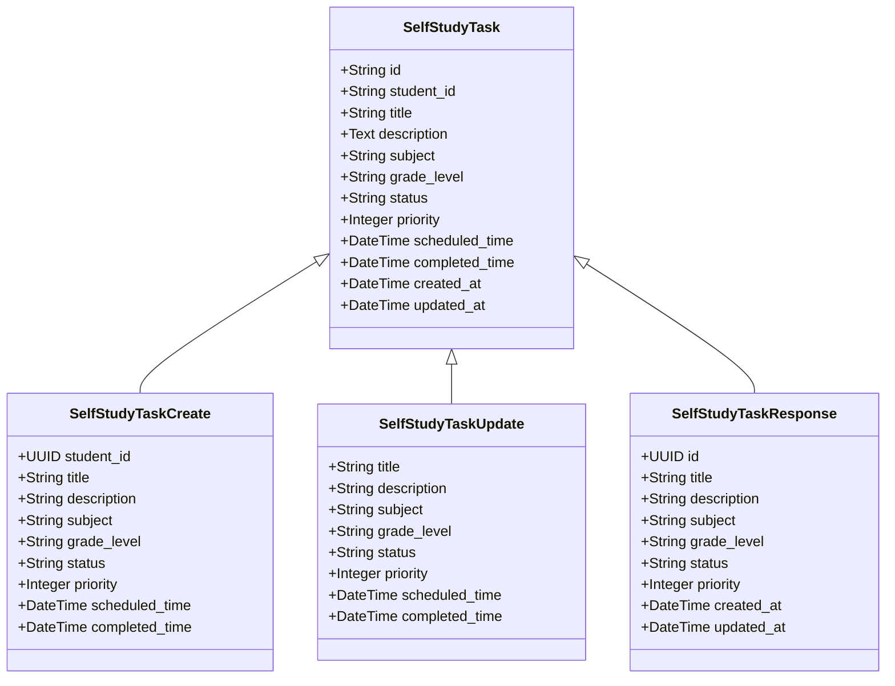
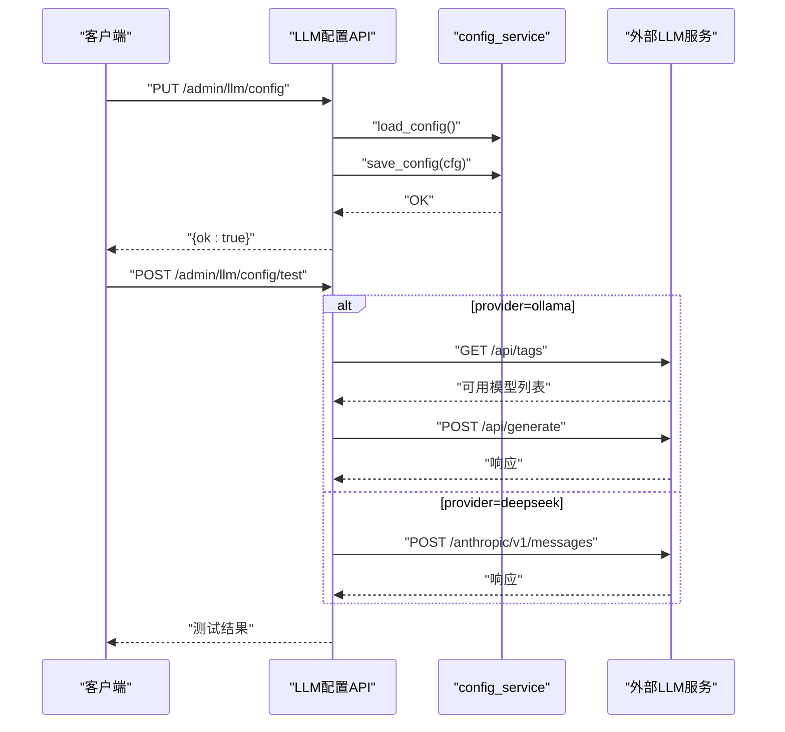
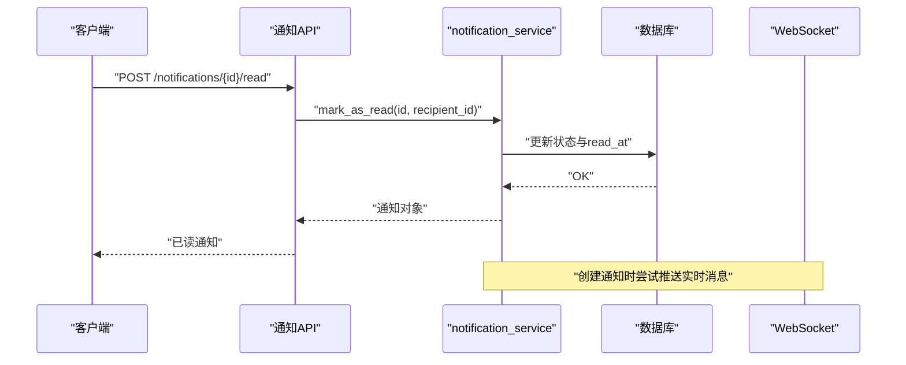
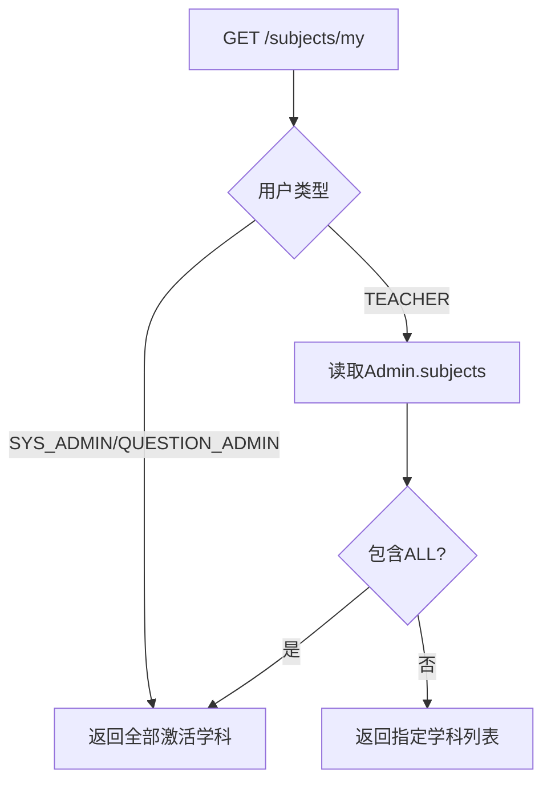
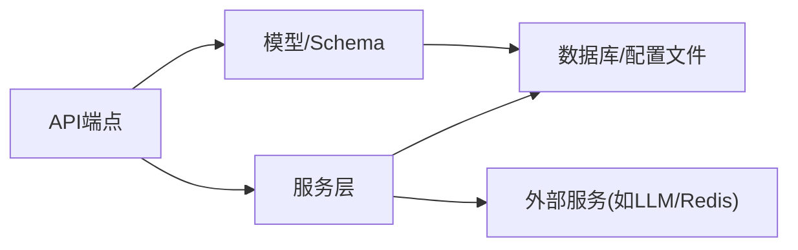

# 其他服务API

<cite>
**本文引用的文件**
- [backend/app/api/v1/endpoints/self_study.py](file://backend/app/api/v1/endpoints/self_study.py)
- [backend/app/api/v1/endpoints/llm_config.py](file://backend/app/api/v1/endpoints/llm_config.py)
- [backend/app/api/v1/endpoints/reference.py](file://backend/app/api/v1/endpoints/reference.py)
- [backend/app/api/v1/endpoints/notifications.py](file://backend/app/api/v1/endpoints/notifications.py)
- [backend/app/api/v1/endpoints/subjects.py](file://backend/app/api/v1/endpoints/subjects.py)
- [backend/app/api/v1/api.py](file://backend/app/api/v1/api.py)
- [backend/app/models/self_study_task.py](file://backend/app/models/self_study_task.py)
- [backend/app/models/llm_config.py](file://backend/app/models/llm_config.py)
- [backend/app/models/reference.py](file://backend/app/models/reference.py)
- [backend/app/models/notification.py](file://backend/app/models/notification.py)
- [backend/app/models/subject.py](file://backend/app/models/subject.py)
- [backend/app/schemas/self_study.py](file://backend/app/schemas/self_study.py)
- [backend/app/schemas/notification.py](file://backend/app/schemas/notification.py)
- [backend/app/services/config_service.py](file://backend/app/services/config_service.py)
- [backend/app/services/notification_service.py](file://backend/app/services/notification_service.py)
</cite>

## 目录
1. [简介](#简介)
2. [项目结构](#项目结构)
3. [核心组件](#核心组件)
4. [架构总览](#架构总览)
5. [详细组件分析](#详细组件分析)
6. [依赖分析](#依赖分析)
7. [性能考虑](#性能考虑)
8. [故障排查指南](#故障排查指南)
9. [结论](#结论)
10. [附录](#附录)

## 简介
本文件面向“其他辅助服务”的API文档，覆盖以下能力：
- 自学习系统：任务创建、查询、更新、删除；知识要点提取与检索（待实现）；题目生成（待实现）；模型训练与数据同步（待实现）
- 大模型配置管理：LLM提供商切换、连接测试、导出上限、系统配置段落写入、Redis连通性测试
- 参考资料管理：统一公开查询接口与系统管理员写操作接口
- 通知系统：用户通知列表、标记已读、全部已读、删除通知、未读计数
- 学科管理：学科列表、新增、查询我的学科、更新、停用

文档提供各服务的端点定义、鉴权要求、请求/响应结构、调用流程与最佳实践，并给出服务间协作机制。

## 项目结构
后端采用FastAPI + SQLAlchemy异步架构，API按v1版本组织，路由通过主路由器集中挂载。各服务模块位于独立的endpoints目录下，对应模型与Schema分别位于models与schemas目录，业务逻辑封装在services目录。



图表来源
- [backend/app/api/v1/api.py:6-30](file://backend/app/api/v1/api.py#L6-L30)
- [backend/app/api/v1/endpoints/llm_config.py:1-209](file://backend/app/api/v1/endpoints/llm_config.py#L1-L209)
- [backend/app/api/v1/endpoints/self_study.py:1-392](file://backend/app/api/v1/endpoints/self_study.py#L1-L392)
- [backend/app/api/v1/endpoints/reference.py:1-122](file://backend/app/api/v1/endpoints/reference.py#L1-L122)
- [backend/app/api/v1/endpoints/notifications.py:1-80](file://backend/app/api/v1/endpoints/notifications.py#L1-L80)
- [backend/app/api/v1/endpoints/subjects.py:1-83](file://backend/app/api/v1/endpoints/subjects.py#L1-L83)
- [backend/app/services/config_service.py:1-162](file://backend/app/services/config_service.py#L1-L162)
- [backend/app/services/notification_service.py:1-247](file://backend/app/services/notification_service.py#L1-L247)
- [backend/app/models/llm_config.py:1-20](file://backend/app/models/llm_config.py#L1-L20)
- [backend/app/models/self_study_task.py:1-29](file://backend/app/models/self_study_task.py#L1-L29)
- [backend/app/models/reference.py:1-76](file://backend/app/models/reference.py#L1-L76)
- [backend/app/models/notification.py:1-34](file://backend/app/models/notification.py#L1-L34)
- [backend/app/models/subject.py:1-17](file://backend/app/models/subject.py#L1-L17)

章节来源
- [backend/app/api/v1/api.py:6-30](file://backend/app/api/v1/api.py#L6-L30)

## 核心组件
- 自学习API：提供任务增删改查、知识要点检索、题目生成、模型训练与数据同步占位接口
- LLM配置API：提供LLM提供商配置、连接测试、导出上限、系统配置段落写入、Redis连通性测试
- 参考资料API：提供全量与单项参考数据查询，以及系统管理员维度的CRUD
- 通知API：提供通知列表、标记已读、全部已读、删除通知、未读计数
- 学科API：提供学科列表、新增、查询我的学科、更新、停用

章节来源
- [backend/app/api/v1/endpoints/self_study.py:16-392](file://backend/app/api/v1/endpoints/self_study.py#L16-L392)
- [backend/app/api/v1/endpoints/llm_config.py:17-209](file://backend/app/api/v1/endpoints/llm_config.py#L17-L209)
- [backend/app/api/v1/endpoints/reference.py:33-122](file://backend/app/api/v1/endpoints/reference.py#L33-L122)
- [backend/app/api/v1/endpoints/notifications.py:13-80](file://backend/app/api/v1/endpoints/notifications.py#L13-L80)
- [backend/app/api/v1/endpoints/subjects.py:13-83](file://backend/app/api/v1/endpoints/subjects.py#L13-L83)

## 架构总览
系统通过主路由器集中注册各子路由，服务层负责业务逻辑与外部依赖交互（如配置文件、HTTP客户端、数据库），模型层承载数据表结构与约束，Schema层用于请求/响应校验与序列化。



图表来源
- [backend/app/api/v1/api.py:6-30](file://backend/app/api/v1/api.py#L6-L30)
- [backend/app/services/config_service.py:72-162](file://backend/app/services/config_service.py#L72-L162)
- [backend/app/services/notification_service.py:13-247](file://backend/app/services/notification_service.py#L13-L247)

## 详细组件分析

### 自学习系统API
- 路由前缀：/self-study
- 主要端点
  - 任务管理
    - POST /tasks：创建自学习任务
    - GET /tasks/{task_id}：按ID查询任务
    - PUT /tasks/{task_id}：更新任务
    - DELETE /tasks/{task_id}：删除任务
    - GET /tasks：分页查询任务（支持状态、学科过滤）
  - 知识要点
    - GET /knowledge-points：分页查询知识要点（需教师/管理员）
    - GET /knowledge-points/{kp_id}：按ID查询知识要点（需教师/管理员）
    - POST /knowledge-points/extract：知识要点提取（待实现）
  - 题目生成
    - POST /questions/generate：生成题目（待实现）
    - GET /questions/generate-status/{generation_id}：查询生成状态（待实现）
  - 模型与数据
    - POST /model/train：触发模型训练（待实现）
    - GET /model/train-status/{train_id}：查询训练状态（待实现）
    - GET /model/train-history：查询训练历史（待实现）
    - POST /data/sync：触发数据同步（待实现）
    - GET /data/sync-status/{sync_id}：查询同步状态（待实现）

- 权限控制
  - 任务：学生仅能操作自己的任务；教师/管理员可全量访问
  - 知识要点、题目生成、模型/数据相关：需教师/管理员
  - 训练/同步：需系统管理员

- 数据模型与Schema
  - 任务模型：自学习任务表，含状态与优先级约束
  - 任务Schema：创建/更新/响应模型



图表来源
- [backend/app/models/self_study_task.py:7-29](file://backend/app/models/self_study_task.py#L7-L29)
- [backend/app/schemas/self_study.py:7-41](file://backend/app/schemas/self_study.py#L7-L41)

章节来源
- [backend/app/api/v1/endpoints/self_study.py:16-392](file://backend/app/api/v1/endpoints/self_study.py#L16-L392)
- [backend/app/models/self_study_task.py:1-29](file://backend/app/models/self_study_task.py#L1-L29)
- [backend/app/schemas/self_study.py:1-41](file://backend/app/schemas/self_study.py#L1-L41)

### LLM配置管理API
- 路由前缀：/admin/llm
- 主要端点
  - GET /config：获取LLM配置（敏感字段掩码）
  - PUT /config：设置当前提供商与配置（需系统管理员）
  - POST /config/test：测试连接（支持Ollama与DeepSeek）
  - GET /export-max：获取导出上限
  - PUT /export-max：设置导出上限（需系统管理员）
  - PUT /section-config：写入系统配置段（需系统管理员）
  - POST /test-redis：测试Redis连通性（需系统管理员）
  - GET /all-config：获取完整配置（需系统管理员，敏感字段掩码）

- 关键行为
  - 提供商切换：支持Ollama与DeepSeek，自动注入可用模型列表
  - 连接测试：Ollama通过/tags与/generate端点验证；DeepSeek通过兼容端点验证
  - 配置持久化：sysconfig.json写入，敏感字段不落盘
  - 导出上限：全局导出数量限制
  - Redis测试：基于连接ping与info



图表来源
- [backend/app/api/v1/endpoints/llm_config.py:17-105](file://backend/app/api/v1/endpoints/llm_config.py#L17-L105)
- [backend/app/services/config_service.py:115-162](file://backend/app/services/config_service.py#L115-L162)

章节来源
- [backend/app/api/v1/endpoints/llm_config.py:17-209](file://backend/app/api/v1/endpoints/llm_config.py#L17-L209)
- [backend/app/services/config_service.py:72-162](file://backend/app/services/config_service.py#L72-L162)
- [backend/app/models/llm_config.py:1-20](file://backend/app/models/llm_config.py#L1-L20)

### 参考资料管理API
- 路由前缀：/reference
- 主要端点
  - GET /all：一次性返回所有参考数据（公开）
  - GET /{table}：按表查询公开列表（公开）
  - POST /{table}：创建（需系统管理员）
  - PUT /{table}/{item_id}：更新（需系统管理员）
  - DELETE /{table}/{item_id}：软删除（需系统管理员）

- 支持的表
  - question-types、difficulty-levels、grade-levels、paper-statuses、error-types、question-sources、provinces、subjects

- 行为说明
  - 公开查询：按sort_order或id排序，仅返回is_active=true
  - 管理员写：创建时校验code唯一；更新时可修改名称、颜色、排序、激活状态；删除时软删除

```mermaid
flowchart TD
Start(["请求进入 /reference"]) --> Route{"选择端点"}
Route --> |GET /all| All["查询所有表并序列化"]
Route --> |GET /{table}| List["按表查询并序列化"]
Route --> |POST /{table}| Create["校验code唯一并创建"]
Route --> |PUT /{table}/{item_id}| Update["按条件更新字段"]
Route --> |DELETE /{table}/{item_id}| Delete["软删除"]
All --> End(["返回JSON"])
List --> End
Create --> End
Update --> End
Delete --> End
```

图表来源
- [backend/app/api/v1/endpoints/reference.py:33-122](file://backend/app/api/v1/endpoints/reference.py#L33-L122)
- [backend/app/models/reference.py:1-76](file://backend/app/models/reference.py#L1-L76)

章节来源
- [backend/app/api/v1/endpoints/reference.py:1-122](file://backend/app/api/v1/endpoints/reference.py#L1-L122)
- [backend/app/models/reference.py:1-76](file://backend/app/models/reference.py#L1-L76)

### 通知系统API
- 路由前缀：/notifications
- 主要端点
  - GET ""：分页列出通知，支持仅未读过滤
  - POST /{notification_id}/read：标记单条通知为已读
  - POST /read-all：一键标记全部为已读
  - DELETE /{notification_id}：删除通知
  - GET /count/unread：获取未读计数

- 服务实现要点
  - 通知创建后通过WebSocket向接收者推送实时消息
  - 查询支持统计总数与未读数
  - 标记已读/删除均进行接收者身份校验



图表来源
- [backend/app/api/v1/endpoints/notifications.py:13-80](file://backend/app/api/v1/endpoints/notifications.py#L13-L80)
- [backend/app/services/notification_service.py:13-124](file://backend/app/services/notification_service.py#L13-L124)
- [backend/app/models/notification.py:7-34](file://backend/app/models/notification.py#L7-L34)
- [backend/app/schemas/notification.py:25-49](file://backend/app/schemas/notification.py#L25-L49)

章节来源
- [backend/app/api/v1/endpoints/notifications.py:1-80](file://backend/app/api/v1/endpoints/notifications.py#L1-L80)
- [backend/app/services/notification_service.py:13-247](file://backend/app/services/notification_service.py#L13-L247)
- [backend/app/models/notification.py:1-34](file://backend/app/models/notification.py#L1-L34)
- [backend/app/schemas/notification.py:1-49](file://backend/app/schemas/notification.py#L1-L49)

### 学科管理API
- 路由前缀：/subjects
- 主要端点
  - GET ""：返回激活学科（按名称排序）
  - GET /all：返回全部学科（含未激活，管理员使用）
  - POST ""：创建学科（需系统管理员）
  - GET /my：查询当前用户的学科集合
  - PUT /{subject_id}：更新学科（需系统管理员）
  - DELETE /{subject_id}：停用学科（软删除）

- 权限与业务
  - SYS_ADMIN与QUESTION_ADMIN可见全部；TEACHER根据Admin.subjects映射返回
  - TEACHER可返回“全部”或指定学科列表



图表来源
- [backend/app/api/v1/endpoints/subjects.py:36-56](file://backend/app/api/v1/endpoints/subjects.py#L36-L56)
- [backend/app/models/subject.py:8-17](file://backend/app/models/subject.py#L8-L17)

章节来源
- [backend/app/api/v1/endpoints/subjects.py:1-83](file://backend/app/api/v1/endpoints/subjects.py#L1-L83)
- [backend/app/models/subject.py:1-17](file://backend/app/models/subject.py#L1-L17)

## 依赖分析
- 组件耦合
  - API层仅依赖安全中间件与服务层，保持薄路由职责
  - 服务层依赖数据库会话与外部HTTP客户端，隔离配置与网络细节
  - 模型层与Schema层解耦业务逻辑，便于演进
- 外部依赖
  - LLM配置依赖sysconfig.json与环境变量（如DEEPSEEK_API_KEY）
  - 通知服务依赖WebSocket管理器与数据库
- 待实现接口
  - 自学习：知识要点提取、题目生成、模型训练、数据同步
  - LLM：配置测试与连接验证（已具备基础框架）



图表来源
- [backend/app/api/v1/endpoints/llm_config.py:17-105](file://backend/app/api/v1/endpoints/llm_config.py#L17-L105)
- [backend/app/api/v1/endpoints/notifications.py:13-80](file://backend/app/api/v1/endpoints/notifications.py#L13-L80)
- [backend/app/services/config_service.py:72-162](file://backend/app/services/config_service.py#L72-L162)
- [backend/app/services/notification_service.py:13-124](file://backend/app/services/notification_service.py#L13-L124)

## 性能考虑
- 分页与过滤
  - 自学习任务列表默认最大limit为200，避免过大数据集
  - 通知列表支持skip/limit与未读过滤，建议前端分页拉取
- 连接测试
  - LLM连接测试包含超时与模型可用性校验，避免阻塞主线程
- 缓存与异步
  - 通知推送为best-effort，不影响通知创建主流程
- 配置安全
  - 敏感字段不落盘，运行时从环境变量注入

## 故障排查指南
- LLM配置测试失败
  - 检查Ollama服务可达性与模型列表；确认模型名正确
  - 检查DeepSeek API Key是否配置且端点可用
- 通知未送达
  - 确认接收者WebSocket连接状态；查看服务日志中的推送异常
- 自学习接口报“功能未实现”
  - 对应端点为占位实现，等待后续开发
- 权限不足
  - 确认用户角色满足端点要求（如仅教师/管理员可访问知识要点）

章节来源
- [backend/app/api/v1/endpoints/llm_config.py:115-135](file://backend/app/api/v1/endpoints/llm_config.py#L115-L135)
- [backend/app/services/notification_service.py:31-47](file://backend/app/services/notification_service.py#L31-L47)
- [backend/app/api/v1/endpoints/self_study.py:161-177](file://backend/app/api/v1/endpoints/self_study.py#L161-L177)

## 结论
本API体系围绕“自学习、LLM配置、参考资料、通知、学科”五大辅助能力构建，采用清晰的路由分层与严格的权限控制。当前部分功能处于占位阶段，建议在后续迭代中完善自学习与LLM训练/同步能力，并持续优化分页与错误处理体验。

## 附录
- 调用示例（以路径代替具体代码）
  - 获取LLM配置：[GET /admin/llm/config:17-26](file://backend/app/api/v1/endpoints/llm_config.py#L17-L26)
  - 设置当前提供商：[PUT /admin/llm/config:28-52](file://backend/app/api/v1/endpoints/llm_config.py#L28-L52)
  - 测试连接（Ollama）：[POST /admin/llm/config/test:61-105](file://backend/app/api/v1/endpoints/llm_config.py#L61-L105)
  - 创建自学习任务：[POST /self-study/tasks:16-35](file://backend/app/api/v1/endpoints/self_study.py#L16-L35)
  - 查询知识要点：[GET /self-study/knowledge-points:180-224](file://backend/app/api/v1/endpoints/self_study.py#L180-L224)
  - 获取通知列表：[GET /notifications:13-31](file://backend/app/api/v1/endpoints/notifications.py#L13-L31)
  - 创建学科：[POST /subjects:26-33](file://backend/app/api/v1/endpoints/subjects.py#L26-L33)
  - 获取参考资料全量：[GET /reference/all:33-43](file://backend/app/api/v1/endpoints/reference.py#L33-L43)