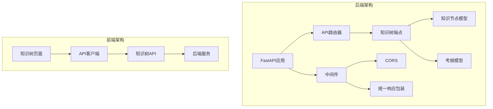
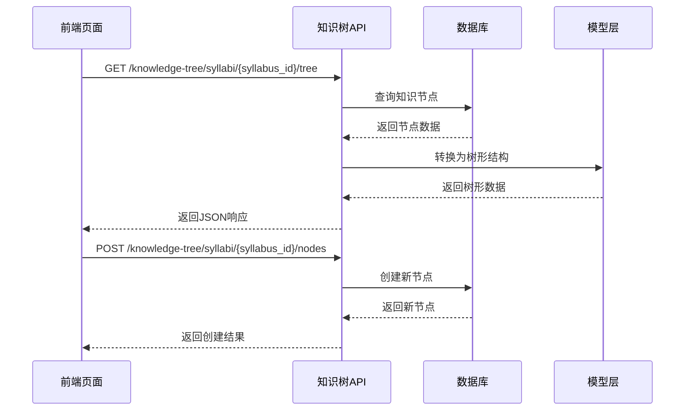
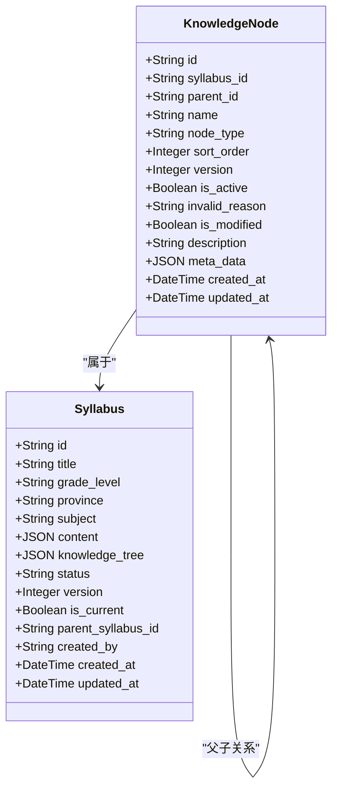
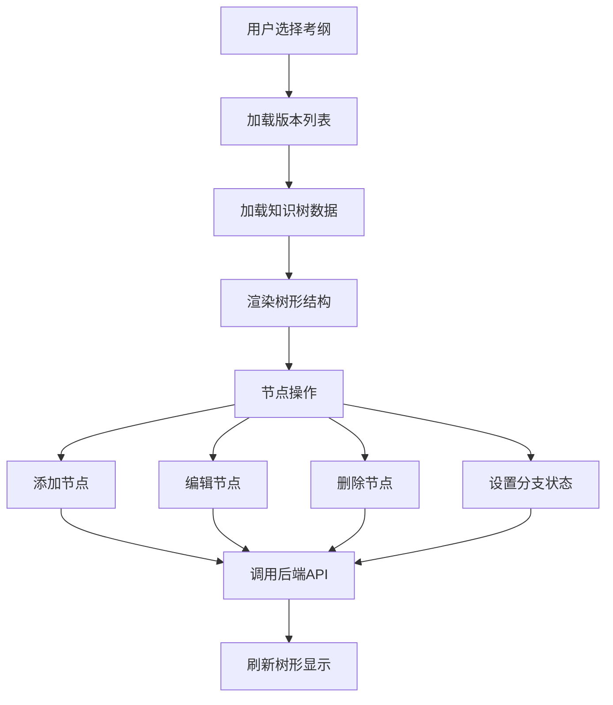
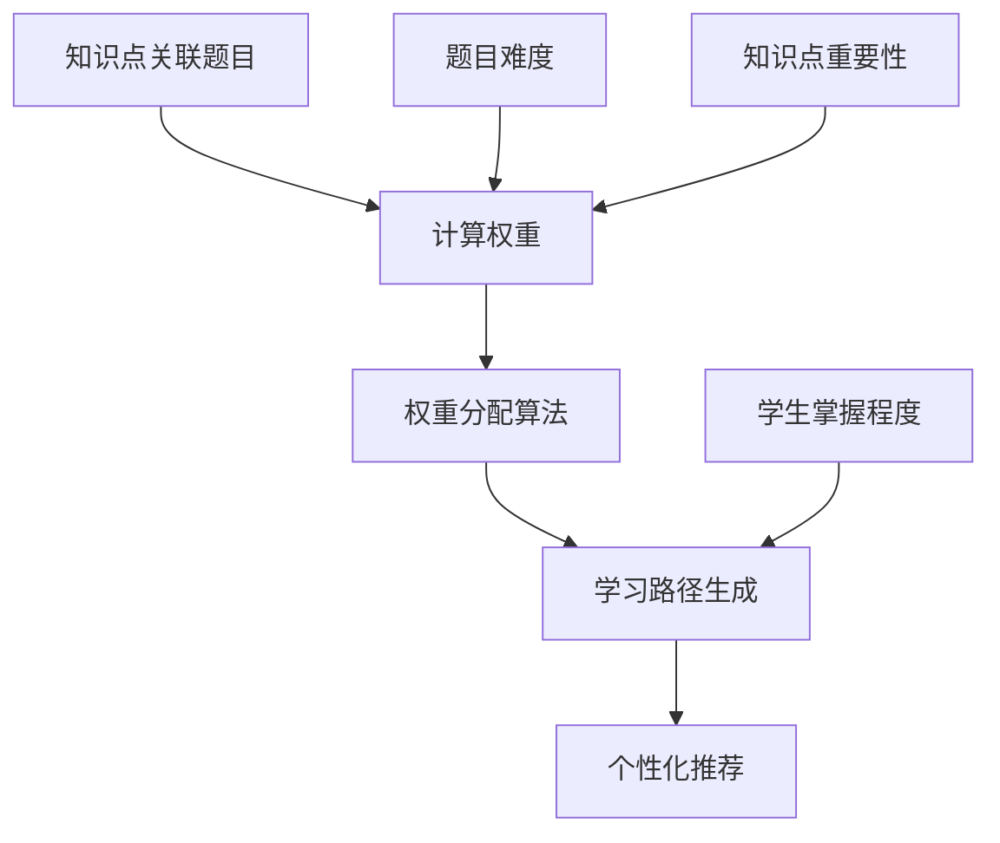
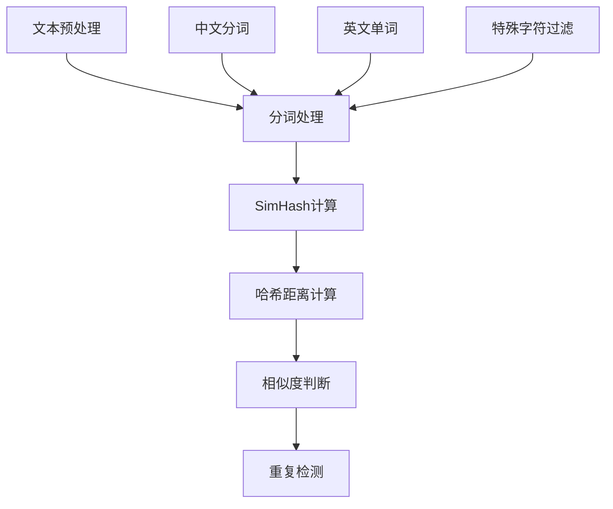
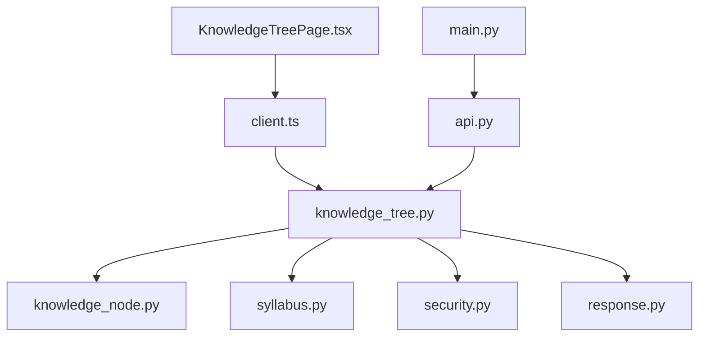

# 知识树管理API

<cite>
**本文档引用的文件**
- [knowledge_tree.py](file://backend/app/api/v1/endpoints/knowledge_tree.py)
- [knowledge_node.py](file://backend/app/models/knowledge_node.py)
- [syllabus.py](file://backend/app/models/syllabus.py)
- [KnowledgeTreePage.tsx](file://frontend/src/pages/admin/KnowledgeTreePage.tsx)
- [api.py](file://backend/app/api/v1/api.py)
- [main.py](file://backend/app/main.py)
- [config.py](file://backend/app/core/config.py)
- [001_v22_initial.py](file://backend/alembic/versions/001_v22_initial.py)
- [dedup_service.py](file://backend/app/services/dedup_service.py)
</cite>

## 目录
1. [简介](#简介)
2. [项目结构](#项目结构)
3. [核心组件](#核心组件)
4. [架构概览](#架构概览)
5. [详细组件分析](#详细组件分析)
6. [依赖关系分析](#依赖关系分析)
7. [性能考虑](#性能考虑)
8. [故障排除指南](#故障排除指南)
9. [结论](#结论)
10. [附录](#附录)

## 简介
本文件为知识树管理系统的核心API文档，涵盖知识点创建、编辑、层级管理、版本控制、关联题目等完整功能。系统采用FastAPI构建，支持知识节点的父子关系管理、权重计算、学习路径规划，并提供基于SimHash的智能去重与匹配算法。前端通过Ant Design组件实现知识树的可视化展示与动态更新。

## 项目结构
后端采用分层架构：API路由层负责请求处理，模型层定义数据库结构，服务层提供业务逻辑。前端使用React + Ant Design实现交互界面。



**图表来源**
- [main.py:12-35](file://backend/app/main.py#L12-L35)
- [api.py:6-14](file://backend/app/api/v1/api.py#L6-L14)
- [KnowledgeTreePage.tsx:14-14](file://frontend/src/pages/admin/KnowledgeTreePage.tsx#L14-L14)

**章节来源**
- [main.py:12-35](file://backend/app/main.py#L12-L35)
- [api.py:6-14](file://backend/app/api/v1/api.py#L6-L14)

## 核心组件
知识树系统的核心由以下组件构成：
- 知识节点模型：存储节点基本信息、层级关系、激活状态
- 考纲模型：管理知识树版本化存储与历史版本追踪
- 知识树API端点：提供CRUD操作、版本管理、批量状态更新
- 前端知识树页面：可视化展示与交互操作

**章节来源**
- [knowledge_node.py:9-26](file://backend/app/models/knowledge_node.py#L9-L26)
- [syllabus.py:9-26](file://backend/app/models/syllabus.py#L9-L26)
- [knowledge_tree.py:37-64](file://backend/app/api/v1/endpoints/knowledge_tree.py#L37-L64)

## 架构概览
系统采用前后端分离架构，后端提供RESTful API，前端通过HTTP请求与后端交互。



**图表来源**
- [knowledge_tree.py:37-64](file://backend/app/api/v1/endpoints/knowledge_tree.py#L37-L64)
- [knowledge_tree.py:67-94](file://backend/app/api/v1/endpoints/knowledge_tree.py#L67-L94)

## 详细组件分析

### 知识节点数据结构
知识节点采用递归的父子关系设计，支持两种节点类型：
- AREA：知识领域，可包含子节点
- POINT：知识点，作为叶子节点



**图表来源**
- [knowledge_node.py:9-26](file://backend/app/models/knowledge_node.py#L9-L26)
- [syllabus.py:9-26](file://backend/app/models/syllabus.py#L9-L26)

**章节来源**
- [knowledge_node.py:9-26](file://backend/app/models/knowledge_node.py#L9-L26)
- [syllabus.py:9-26](file://backend/app/models/syllabus.py#L9-L26)

### 知识树API端点详解

#### 获取知识树
- 方法：GET
- 路径：/knowledge-tree/syllabi/{syllabus_id}/tree
- 功能：根据考纲ID和版本号获取完整的知识树结构
- 参数：
  - syllabus_id：考纲唯一标识
  - version：版本号（可选，默认使用当前版本）
- 响应：包含树形结构的JSON对象

#### 创建节点
- 方法：POST
- 路径：/knowledge-tree/syllabi/{syllabus_id}/nodes
- 权限：QUESTION_ADMIN或SYS_ADMIN
- 请求参数：
  - name：节点名称
  - node_type：节点类型（默认POINT）
  - parent_id：父节点ID（可选）
  - sort_order：排序权重
- 响应：新创建节点的详细信息

#### 更新节点
- 方法：PUT
- 路径：/knowledge-tree/syllabi/{syllabus_id}/nodes/{node_id}
- 权限：QUESTION_ADMIN或SYS_ADMIN
- 功能：更新节点属性并使所有子节点失效
- 请求参数：name、description、sort_order（可选）

#### 设置分支激活状态
- 方法：POST
- 路径：/knowledge-tree/syllabi/{syllabus_id}/nodes/{node_id}/set-branch-active
- 权限：QUESTION_ADMIN或SYS_ADMIN
- 功能：批量设置节点及其子节点的激活状态
- 参数：active（布尔值，默认true）

#### 删除节点
- 方法：DELETE
- 路径：/knowledge-tree/syllabi/{syllabus_id}/nodes/{node_id}
- 权限：QUESTION_ADMIN或SYS_ADMIN
- 功能：删除节点及其整个子树

#### 创建新版本
- 方法：POST
- 路径：/knowledge-tree/syllabi/{syllabus_id}/new-version
- 权限：QUESTION_ADMIN或SYS_ADMIN
- 功能：基于当前版本创建新版本，复制所有激活的节点

#### 回滚版本
- 方法：PUT
- 路径：/knowledge-tree/syllabi/{syllabus_id}/rollback
- 权限：QUESTION_ADMIN或SYS_ADMIN
- 功能：将考纲回滚到指定的历史版本
- 参数：target_version

#### 列出版本
- 方法：GET
- 路径：/knowledge-tree/syllabi/{syllabus_id}/versions
- 功能：获取当前考纲的所有版本信息

**章节来源**
- [knowledge_tree.py:37-64](file://backend/app/api/v1/endpoints/knowledge_tree.py#L37-L64)
- [knowledge_tree.py:67-94](file://backend/app/api/v1/endpoints/knowledge_tree.py#L67-L94)
- [knowledge_tree.py:97-128](file://backend/app/api/v1/endpoints/knowledge_tree.py#L97-L128)
- [knowledge_tree.py:147-159](file://backend/app/api/v1/endpoints/knowledge_tree.py#L147-L159)
- [knowledge_tree.py:180-196](file://backend/app/api/v1/endpoints/knowledge_tree.py#L180-L196)
- [knowledge_tree.py:199-250](file://backend/app/api/v1/endpoints/knowledge_tree.py#L199-L250)
- [knowledge_tree.py:253-319](file://backend/app/api/v1/endpoints/knowledge_tree.py#L253-L319)
- [knowledge_tree.py:322-356](file://backend/app/api/v1/endpoints/knowledge_tree.py#L322-L356)

### 前端集成与可视化
前端知识树页面实现了完整的交互功能：



**图表来源**
- [KnowledgeTreePage.tsx:49-87](file://frontend/src/pages/admin/KnowledgeTreePage.tsx#L49-L87)
- [KnowledgeTreePage.tsx:101-131](file://frontend/src/pages/admin/KnowledgeTreePage.tsx#L101-L131)

**章节来源**
- [KnowledgeTreePage.tsx:31-439](file://frontend/src/pages/admin/KnowledgeTreePage.tsx#L31-L439)

### 权重计算与学习路径规划
系统支持知识点权重计算，用于学习路径规划：



**图表来源**
- [001_v22_initial.py:163-170](file://backend/alembic/versions/001_v22_initial.py#L163-L170)

### 智能匹配算法
系统采用SimHash算法进行内容去重和相似度匹配：



**图表来源**
- [dedup_service.py:7-61](file://backend/app/services/dedup_service.py#L7-L61)
- [dedup_service.py:63-127](file://backend/app/services/dedup_service.py#L63-L127)

**章节来源**
- [dedup_service.py:1-127](file://backend/app/services/dedup_service.py#L1-L127)

## 依赖关系分析



**图表来源**
- [knowledge_tree.py:1-13](file://backend/app/api/v1/endpoints/knowledge_tree.py#L1-L13)
- [api.py:6-14](file://backend/app/api/v1/api.py#L6-L14)
- [main.py:31-34](file://backend/app/main.py#L31-L34)

**章节来源**
- [knowledge_tree.py:1-13](file://backend/app/api/v1/endpoints/knowledge_tree.py#L1-L13)
- [api.py:6-14](file://backend/app/api/v1/api.py#L6-L14)

## 性能考虑
- 数据库索引优化：在syllabus_id和parent_id字段建立索引以提升查询性能
- 异步数据库操作：使用SQLAlchemy异步会话减少I/O等待时间
- 缓存策略：建议在Redis中缓存热点知识树数据
- 分页机制：前端支持分页加载大量节点数据
- 连接池管理：合理配置数据库连接池大小

## 故障排除指南
常见问题及解决方案：

1. **权限错误（403 Forbidden）**
   - 确认用户角色为QUESTION_ADMIN或SYS_ADMIN
   - 检查用户认证状态

2. **节点更新后子节点失效**
   - 这是预期行为，确保父节点修改后子节点需要重新审核
   - 使用set-branch-active接口恢复状态

3. **版本回滚失败**
   - 确认目标版本存在且在版本链中
   - 检查版本历史完整性

4. **知识树加载缓慢**
   - 检查数据库索引是否正确
   - 考虑启用缓存机制
   - 优化前端渲染性能

**章节来源**
- [knowledge_tree.py:75-76](file://backend/app/api/v1/endpoints/knowledge_tree.py#L75-L76)
- [knowledge_tree.py:123-128](file://backend/app/api/v1/endpoints/knowledge_tree.py#L123-L128)

## 结论
知识树管理系统提供了完整的企业级知识管理解决方案，具备以下优势：
- 完善的版本控制机制，支持历史版本追溯
- 灵活的层级管理，支持复杂的知识结构
- 智能的去重与匹配算法，提升内容质量
- 用户友好的前端界面，支持实时协作
- 可扩展的架构设计，便于功能扩展

系统适用于教育机构的知识库建设、题库管理、学习路径规划等场景。

## 附录

### API使用示例
1. 获取知识树结构
   ```
   GET /api/v1/knowledge-tree/syllabi/{syllabus_id}/tree?version=1
   ```

2. 创建新节点
   ```
   POST /api/v1/knowledge-tree/syllabi/{syllabus_id}/nodes
   {
     "name": "一元二次方程",
     "node_type": "POINT",
     "parent_id": "parent-node-id",
     "sort_order": 1
   }
   ```

3. 更新节点状态
   ```
   POST /api/v1/knowledge-tree/syllabi/{syllabus_id}/nodes/{node_id}/set-branch-active
   {
     "active": true
   }
   ```

### 配置说明
- 数据库连接：通过环境变量配置PostgreSQL连接参数
- Redis缓存：用于存储会话和缓存数据
- 文件上传：支持图片、文档等文件类型
- OCR引擎：集成PaddleOCR进行图像识别

**章节来源**
- [config.py:36-98](file://backend/app/core/config.py#L36-L98)