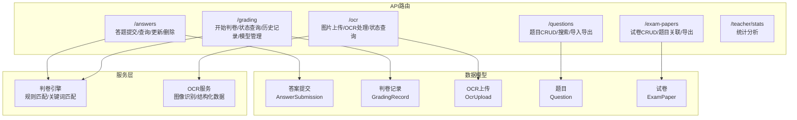
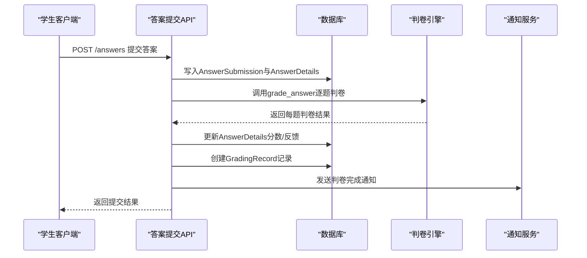
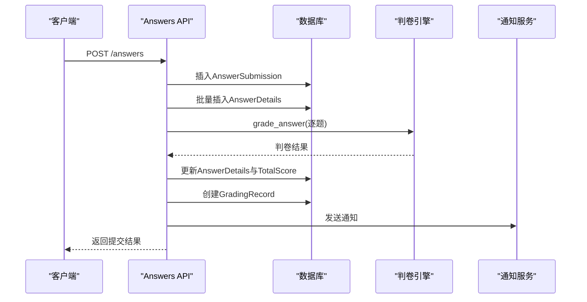
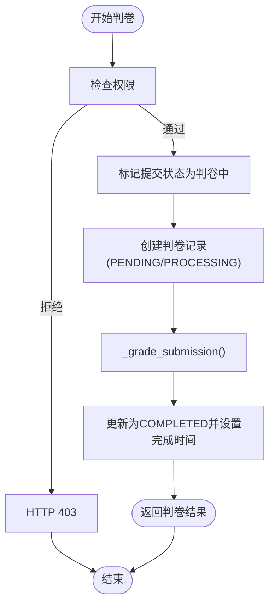
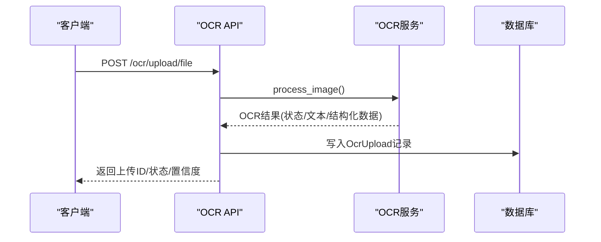
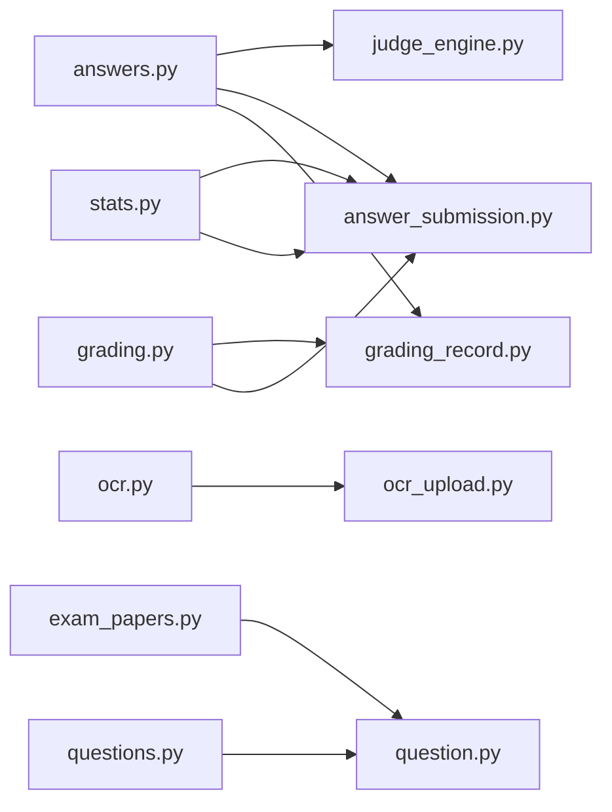

# 答题判卷API

<cite>
**本文档引用的文件**
- [backend/app/api/v1/endpoints/grading.py](file://backend/app/api/v1/endpoints/grading.py)
- [backend/app/api/v1/endpoints/answers.py](file://backend/app/api/v1/endpoints/answers.py)
- [backend/app/api/v1/endpoints/ocr.py](file://backend/app/api/v1/endpoints/ocr.py)
- [backend/app/api/v1/endpoints/exam_papers.py](file://backend/app/api/v1/endpoints/exam_papers.py)
- [backend/app/api/v1/endpoints/questions.py](file://backend/app/api/v1/endpoints/questions.py)
- [backend/app/api/v1/endpoints/stats.py](file://backend/app/api/v1/endpoints/stats.py)
- [backend/app/api/v1/api.py](file://backend/app/api/v1/api.py)
- [backend/app/schemas/grading.py](file://backend/app/schemas/grading.py)
- [backend/app/schemas/answer.py](file://backend/app/schemas/answer.py)
- [backend/app/schemas/ocr.py](file://backend/app/schemas/ocr.py)
- [backend/app/schemas/question.py](file://backend/app/schemas/question.py)
- [backend/app/services/judge_engine.py](file://backend/app/services/judge_engine.py)
- [backend/app/models/grading_record.py](file://backend/app/models/grading_record.py)
- [backend/app/models/answer_submission.py](file://backend/app/models/answer_submission.py)
- [backend/app/models/ocr_upload.py](file://backend/app/models/ocr_upload.py)
- [backend/app/models/question.py](file://backend/app/models/question.py)
</cite>

## 目录
1. [简介](#简介)
2. [项目结构](#项目结构)
3. [核心组件](#核心组件)
4. [架构概览](#架构概览)
5. [详细组件分析](#详细组件分析)
6. [依赖分析](#依赖分析)
7. [性能考虑](#性能考虑)
8. [故障排除指南](#故障排除指南)
9. [结论](#结论)

## 简介
本API文档面向答题判卷系统，涵盖学生答题提交、自动判卷、人工复核、成绩统计等完整功能。系统支持客观题自动判卷（单选、多选、填空）、主观题关键词匹配评分与人工复核、混合判卷模式，并提供判卷进度查询、历史记录查看、统计分析等辅助接口。

## 项目结构
后端采用FastAPI + SQLAlchemy异步ORM，按功能模块划分路由，核心模块包括：
- 答案提交与管理：/answers
- 判卷服务：/grading
- 试卷管理：/exam-papers
- 题目管理：/questions
- OCR识别：/ocr
- 成绩统计：/teacher/stats
- 用户认证与权限：/auth

**图表来源**
- [backend/app/api/v1/api.py:1-26](file://backend/app/api/v1/api.py#L1-L26)
- [backend/app/api/v1/endpoints/answers.py:115-197](file://backend/app/api/v1/endpoints/answers.py#L115-L197)
- [backend/app/api/v1/endpoints/grading.py:19-55](file://backend/app/api/v1/endpoints/grading.py#L19-L55)
- [backend/app/api/v1/endpoints/ocr.py:18-64](file://backend/app/api/v1/endpoints/ocr.py#L18-L64)

**章节来源**
- [backend/app/api/v1/api.py:1-26](file://backend/app/api/v1/api.py#L1-L26)

## 核心组件
- 答案提交与自动判卷：学生提交答案后立即触发自动判卷，生成判卷记录并通知结果。
- 判卷引擎：基于规则匹配的客观题判卷，主观题关键词匹配与人工复核建议。
- OCR识别：支持图片上传与OCR处理，返回结构化题目数据供后续判卷。
- 统计分析：教师可查看试卷/题目维度的答题统计与选项分布。

**章节来源**
- [backend/app/api/v1/endpoints/answers.py:24-113](file://backend/app/api/v1/endpoints/answers.py#L24-L113)
- [backend/app/services/judge_engine.py:126-130](file://backend/app/services/judge_engine.py#L126-L130)
- [backend/app/api/v1/endpoints/ocr.py:18-64](file://backend/app/api/v1/endpoints/ocr.py#L18-L64)
- [backend/app/api/v1/endpoints/stats.py:37-137](file://backend/app/api/v1/endpoints/stats.py#L37-L137)

## 架构概览
系统采用分层架构：API层负责请求处理与权限校验；服务层封装判卷与OCR逻辑；数据层通过SQLAlchemy ORM管理实体关系。

**图表来源**
- [backend/app/api/v1/endpoints/answers.py:115-197](file://backend/app/api/v1/endpoints/answers.py#L115-L197)
- [backend/app/api/v1/endpoints/answers.py:24-113](file://backend/app/api/v1/endpoints/answers.py#L24-L113)
- [backend/app/services/judge_engine.py:126-130](file://backend/app/services/judge_engine.py#L126-L130)

## 详细组件分析

### 答案提交与自动判卷
- 接口：POST /answers
- 功能：学生提交答案，系统立即自动判卷，生成判卷记录，发送通知，必要时生成错题本。
- 权限：仅学生可提交。
- 自动判卷：根据题目类型调用判卷引擎，支持单选、多选、填空、主观题（关键词匹配）。
- 结果：返回提交记录与各题得分、反馈。

**图表来源**
- [backend/app/api/v1/endpoints/answers.py:115-197](file://backend/app/api/v1/endpoints/answers.py#L115-L197)
- [backend/app/api/v1/endpoints/answers.py:24-113](file://backend/app/api/v1/endpoints/answers.py#L24-L113)
- [backend/app/services/judge_engine.py:126-130](file://backend/app/services/judge_engine.py#L126-L130)

**章节来源**
- [backend/app/api/v1/endpoints/answers.py:115-197](file://backend/app/api/v1/endpoints/answers.py#L115-L197)
- [backend/app/schemas/answer.py:35-49](file://backend/app/schemas/answer.py#L35-L49)
- [backend/app/models/answer_submission.py:9-37](file://backend/app/models/answer_submission.py#L9-L37)

### 判卷服务
- 开始判卷：POST /grading/start
  - 参数：answer_submission_id
  - 行为：标记提交为判卷中，创建判卷记录，异步执行判卷流程，完成后更新状态与完成时间。
- 进度查询：GET /grading/status/{grading_id}
- 结果查询：GET /grading/result/{grading_id}
- 历史记录：
  - GET /grading/history/student/{student_id}
  - GET /grading/history/exam/{exam_paper_id}
- 模型管理：
  - GET /grading/models
  - POST /grading/models/switch
  - GET /grading/models/current

**图表来源**
- [backend/app/api/v1/endpoints/grading.py:19-55](file://backend/app/api/v1/endpoints/grading.py#L19-L55)
- [backend/app/api/v1/endpoints/answers.py:24-113](file://backend/app/api/v1/endpoints/answers.py#L24-L113)

**章节来源**
- [backend/app/api/v1/endpoints/grading.py:19-143](file://backend/app/api/v1/endpoints/grading.py#L19-L143)
- [backend/app/schemas/grading.py:16-36](file://backend/app/schemas/grading.py#L16-L36)
- [backend/app/models/grading_record.py:8-31](file://backend/app/models/grading_record.py#L8-L31)

### OCR识别与处理
- 图片上传：POST /ocr/upload/file
  - 支持multipart上传，运行OCR识别，返回状态、置信度、结构化数据。
- 状态查询：GET /ocr/status/{upload_id}
- 结果查询：GET /ocr/result/{upload_id}
- 配置管理：GET /ocr/config、PUT /ocr/config（管理员）

**图表来源**
- [backend/app/api/v1/endpoints/ocr.py:18-64](file://backend/app/api/v1/endpoints/ocr.py#L18-L64)
- [backend/app/models/ocr_upload.py:8-36](file://backend/app/models/ocr_upload.py#L8-L36)

**章节来源**
- [backend/app/api/v1/endpoints/ocr.py:18-291](file://backend/app/api/v1/endpoints/ocr.py#L18-L291)
- [backend/app/schemas/ocr.py:19-48](file://backend/app/schemas/ocr.py#L19-L48)
- [backend/app/models/ocr_upload.py:8-36](file://backend/app/models/ocr_upload.py#L8-L36)

### 试卷与题目管理
- 试卷管理：CRUD、题目关联、排序、导出Word/PDF、学生可查看我的试卷与最新提交状态。
- 题目管理：CRUD、搜索、批量导入、导出、典型题标记。

**章节来源**
- [backend/app/api/v1/endpoints/exam_papers.py:20-417](file://backend/app/api/v1/endpoints/exam_papers.py#L20-L417)
- [backend/app/api/v1/endpoints/questions.py:17-434](file://backend/app/api/v1/endpoints/questions.py#L17-L434)
- [backend/app/models/question.py:10-46](file://backend/app/models/question.py#L10-L46)

### 成绩统计
- 教师可查看：
  - 试卷题目维度统计（正确率、选项分布）
  - 全局题目维度统计（按学科/题型过滤）
- 数据来源：AnswerSubmission、AnswerDetail、Question、ExamPaper

**章节来源**
- [backend/app/api/v1/endpoints/stats.py:17-251](file://backend/app/api/v1/endpoints/stats.py#L17-L251)

## 依赖分析

**图表来源**
- [backend/app/api/v1/endpoints/answers.py:14-17](file://backend/app/api/v1/endpoints/answers.py#L14-L17)
- [backend/app/api/v1/endpoints/grading.py:7-11](file://backend/app/api/v1/endpoints/grading.py#L7-L11)
- [backend/app/api/v1/endpoints/stats.py:8-12](file://backend/app/api/v1/endpoints/stats.py#L8-L12)
- [backend/app/api/v1/endpoints/ocr.py:9-11](file://backend/app/api/v1/endpoints/ocr.py#L9-L11)
- [backend/app/api/v1/endpoints/exam_papers.py:9-13](file://backend/app/api/v1/endpoints/exam_papers.py#L9-L13)
- [backend/app/api/v1/endpoints/questions.py:6-8](file://backend/app/api/v1/endpoints/questions.py#L6-L8)

**章节来源**
- [backend/app/api/v1/endpoints/answers.py:14-17](file://backend/app/api/v1/endpoints/answers.py#L14-L17)
- [backend/app/api/v1/endpoints/grading.py:7-11](file://backend/app/api/v1/endpoints/grading.py#L7-L11)
- [backend/app/api/v1/endpoints/stats.py:8-12](file://backend/app/api/v1/endpoints/stats.py#L8-L12)
- [backend/app/api/v1/endpoints/ocr.py:9-11](file://backend/app/api/v1/endpoints/ocr.py#L9-L11)
- [backend/app/api/v1/endpoints/exam_papers.py:9-13](file://backend/app/api/v1/endpoints/exam_papers.py#L9-L13)
- [backend/app/api/v1/endpoints/questions.py:6-8](file://backend/app/api/v1/endpoints/questions.py#L6-L8)

## 性能考虑
- 自动判卷：判卷引擎对每题独立计算，建议在高并发场景下：
  - 使用异步数据库连接池
  - 将判卷任务放入消息队列异步处理（当前实现为同步触发）
- OCR处理：大文件上传与识别可能耗时较长，建议：
  - 异步处理OCR任务并轮询状态
  - 限制上传文件大小与数量
- 统计查询：涉及多表联接与聚合，建议：
  - 对相关字段建立索引
  - 分页查询与结果缓存

## 故障排除指南
- 权限错误（403）：确认用户角色（学生/教师/管理员），检查资源归属。
- 资源不存在（404）：确认ID有效性，检查软删除或状态约束。
- 判卷异常：检查题目正确答案格式（JSON），确认判卷引擎支持的题型。
- OCR失败：确认Tesseract安装状态与文件格式，检查上传路径与权限。

**章节来源**
- [backend/app/api/v1/endpoints/answers.py:200-220](file://backend/app/api/v1/endpoints/answers.py#L200-L220)
- [backend/app/api/v1/endpoints/grading.py:58-81](file://backend/app/api/v1/endpoints/grading.py#L58-L81)
- [backend/app/api/v1/endpoints/ocr.py:92-137](file://backend/app/api/v1/endpoints/ocr.py#L92-L137)

## 结论
本系统提供了完整的答题判卷能力，覆盖自动判卷、OCR识别、统计分析与权限控制。建议在生产环境中引入异步判卷与OCR处理、优化统计查询性能，并完善模型切换与人工复核流程。