# 系统管理API

<cite>
**本文档引用的文件**
- [auth_v2.py](file://backend/app/api/v1/endpoints/auth_v2.py)
- [classes.py](file://backend/app/api/v1/endpoints/classes.py)
- [student.py](file://backend/app/api/v1/endpoints/student.py)
- [stats.py](file://backend/app/api/v1/endpoints/stats.py)
- [database.py](file://backend/app/api/v1/endpoints/database.py)
- [llm_config.py](file://backend/app/api/v1/endpoints/llm_config.py)
- [question_admin.py](file://backend/app/api/v1/endpoints/question_admin.py)
- [answers.py](file://backend/app/api/v1/endpoints/answers.py)
- [grading.py](file://backend/app/api/v1/endpoints/grading.py)
- [error_notebooks.py](file://backend/app/api/v1/endpoints/error_notebooks.py)
- [self_study.py](file://backend/app/api/v1/endpoints/self_study.py)
- [subjects.py](file://backend/app/api/v1/endpoints/subjects.py)
- [notifications.py](file://backend/app/api/v1/endpoints/notifications.py)
- [config.py](file://backend/app/core/config.py)
- [config_service.py](file://backend/app/services/config_service.py)
- [sys_admin.py](file://backend/app/models/sys_admin.py)
</cite>

## 目录
1. [简介](#简介)
2. [项目结构](#项目结构)
3. [核心组件](#核心组件)
4. [架构概览](#架构概览)
5. [详细组件分析](#详细组件分析)
6. [依赖关系分析](#依赖关系分析)
7. [性能考虑](#性能考虑)
8. [故障排除指南](#故障排除指南)
9. [结论](#结论)

## 简介

系统管理API是教育管理系统的核心后台功能模块，提供了完整的管理员配置、用户管理、班级管理、统计分析、数据库管理等后台功能接口。该系统采用FastAPI框架构建，支持多角色权限管理，包括系统管理员(SYS_ADMIN)、题库管理员(QUESTION_ADMIN)、教师(TEACHER)和学生(STUDENT)。

系统主要功能包括：
- **管理员配置管理**：支持多角色管理员账户创建、更新、删除和查询
- **用户管理**：涵盖学生注册登录、教师账户管理、权限控制
- **班级管理**：班级CRUD操作、学生添加移除、批量管理
- **统计分析**：教师统计报表、学生成绩分析、系统监控
- **数据库管理**：数据库状态监控、配置管理、性能优化
- **LLM配置**：大模型配置、测试连接、模型管理
- **题库管理**：试题生成、审核、去重、导入导出
- **错题本管理**：自动错题本生成、练习题生成、导出功能
- **通知管理**：消息推送、状态通知、系统公告

## 项目结构

系统采用分层架构设计，主要目录结构如下：

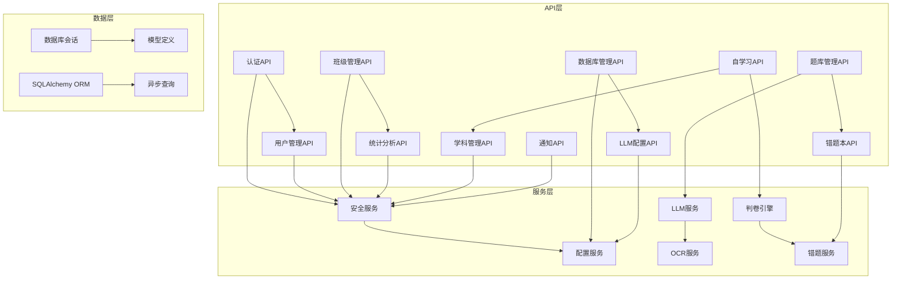

**图表来源**
- [auth_v2.py:1-476](file://backend/app/api/v1/endpoints/auth_v2.py#L1-L476)
- [classes.py:1-243](file://backend/app/api/v1/endpoints/classes.py#L1-L243)
- [database.py:1-167](file://backend/app/api/v1/endpoints/database.py#L1-L167)

**章节来源**
- [auth_v2.py:1-476](file://backend/app/api/v1/endpoints/auth_v2.py#L1-L476)
- [classes.py:1-243](file://backend/app/api/v1/endpoints/classes.py#L1-L243)
- [database.py:1-167](file://backend/app/api/v1/endpoints/database.py#L1-L167)

## 核心组件

### 权限管理系统

系统实现了基于角色的权限控制(RBAC)，支持四种用户角色：

| 角色 | 权限范围 | 主要功能 |
|------|----------|----------|
| SYS_ADMIN | 系统完全控制权 | 管理员账户管理、系统配置、数据库管理、权限分配 |
| QUESTION_ADMIN | 题库管理权限 | 试题生成、审核、去重、导入导出 |
| TEACHER | 教学管理权限 | 班级管理、学生成绩分析、错题本管理 |
| STUDENT | 基础使用权限 | 在线答题、错题本查看、自学习功能 |

### 数据库连接管理

系统采用异步数据库连接池，支持高并发访问：

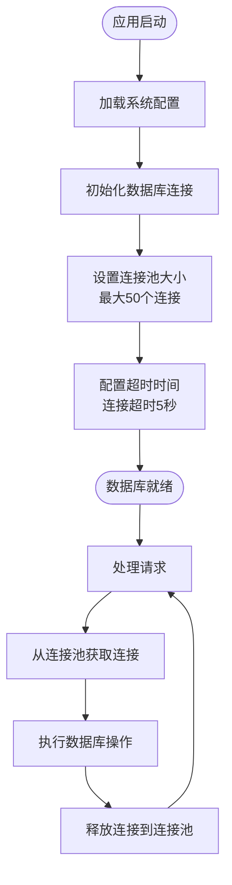

**图表来源**
- [config.py:55-62](file://backend/app/core/config.py#L55-L62)
- [config_service.py:24-62](file://backend/app/services/config_service.py#L24-L62)

**章节来源**
- [config.py:1-98](file://backend/app/core/config.py#L1-L98)
- [config_service.py:1-155](file://backend/app/services/config_service.py#L1-L155)

## 架构概览

系统采用分层架构，确保职责分离和代码可维护性：

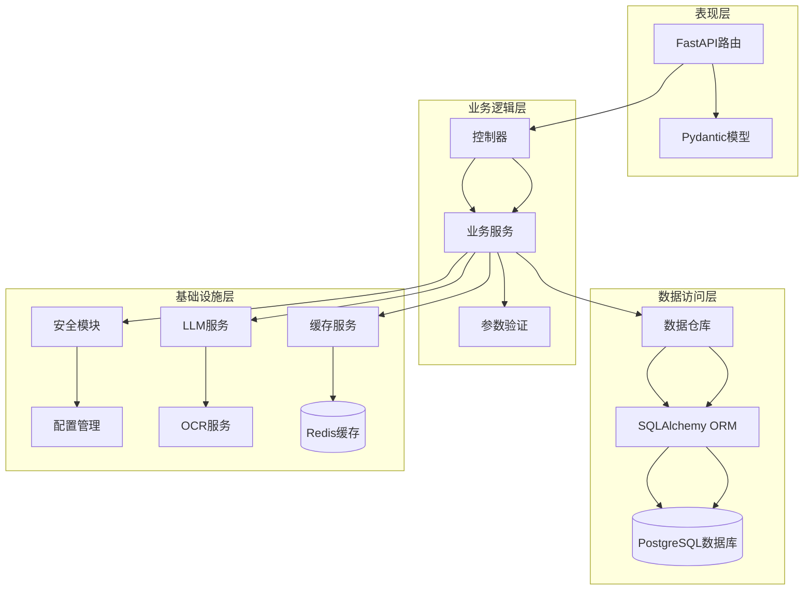

**图表来源**
- [auth_v2.py:1-476](file://backend/app/api/v1/endpoints/auth_v2.py#L1-L476)
- [config.py:36-98](file://backend/app/core/config.py#L36-L98)

## 详细组件分析

### 认证与授权系统

#### 管理员登录流程

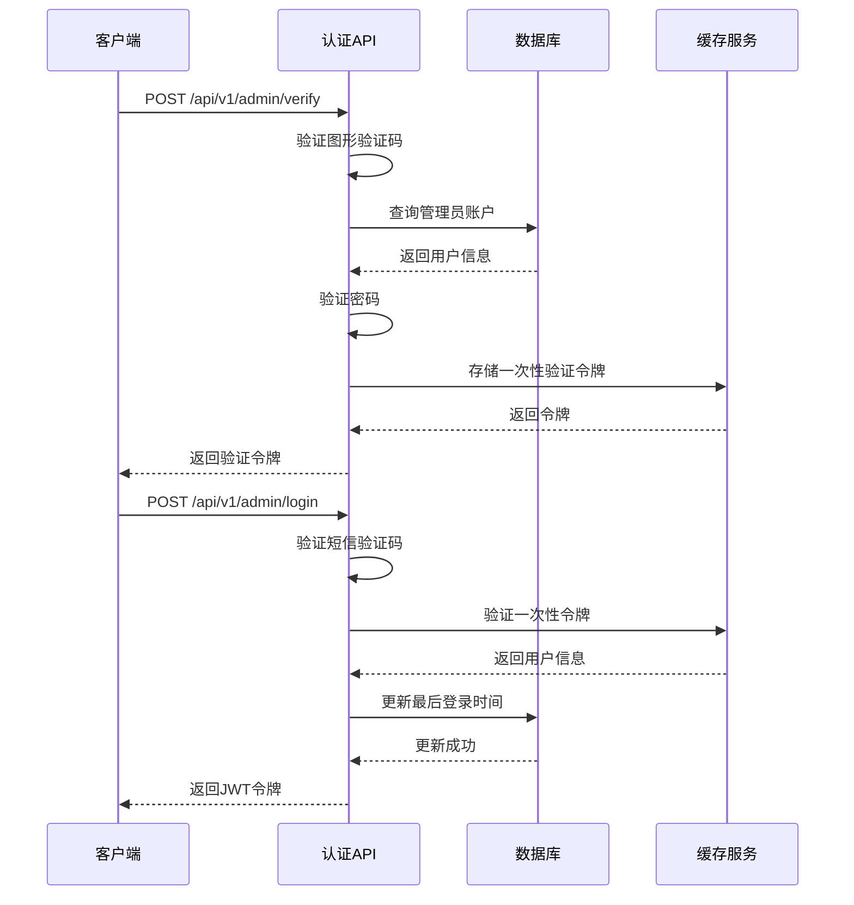

**图表来源**
- [auth_v2.py:91-183](file://backend/app/api/v1/endpoints/auth_v2.py#L91-L183)

#### 用户注册流程

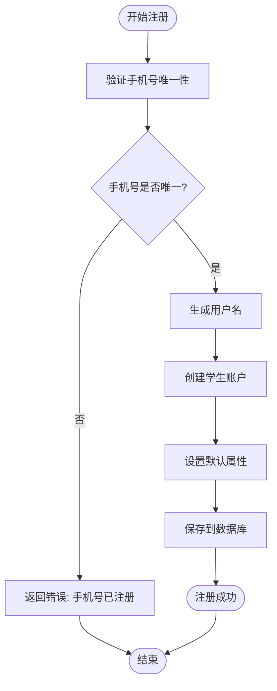

**图表来源**
- [auth_v2.py:212-237](file://backend/app/api/v1/endpoints/auth_v2.py#L212-L237)

**章节来源**
- [auth_v2.py:1-476](file://backend/app/api/v1/endpoints/auth_v2.py#L1-L476)

### 班级管理模块

#### 班级CRUD操作

系统提供完整的班级生命周期管理：

| 操作 | 路径 | 方法 | 权限要求 | 功能描述 |
|------|------|------|----------|----------|
| 创建班级 | `/api/v1/classes` | POST | TEACHER, SYS_ADMIN | 创建新班级 |
| 获取班级列表 | `/api/v1/classes` | GET | 所有用户 | 查询班级列表 |
| 更新班级 | `/api/v1/classes/{class_id}` | PUT | TEACHER, SYS_ADMIN | 更新班级信息 |
| 删除班级 | `/api/v1/classes/{class_id}` | DELETE | TEACHER, SYS_ADMIN | 删除班级及其关联数据 |
| 获取班级学生 | `/api/v1/classes/{class_id}/students` | GET | TEACHER, SYS_ADMIN | 获取班级所有学生 |
| 添加学生 | `/api/v1/classes/{class_id}/students` | POST | TEACHER, SYS_ADMIN | 添加学生到班级 |
| 移除学生 | `/api/v1/classes/{class_id}/students/{student_id}` | DELETE | TEACHER, SYS_ADMIN | 从班级移除学生 |

#### 学生管理流程

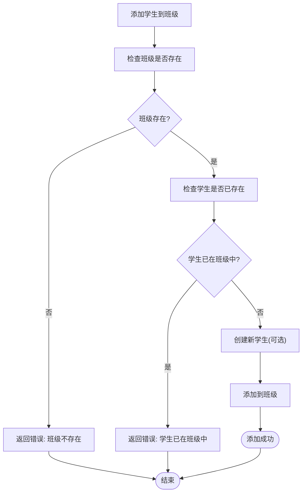

**图表来源**
- [classes.py:143-189](file://backend/app/api/v1/endpoints/classes.py#L143-L189)

**章节来源**
- [classes.py:1-243](file://backend/app/api/v1/endpoints/classes.py#L1-L243)

### 统计分析模块

#### 教师统计接口

系统为教师提供全面的统计数据：

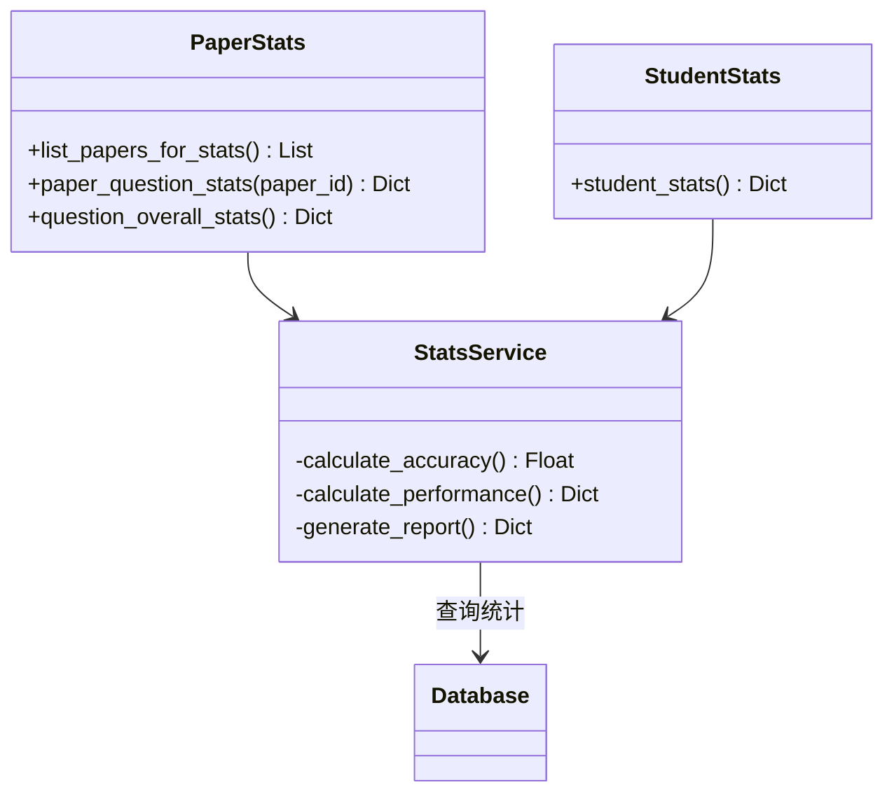

**图表来源**
- [stats.py:17-251](file://backend/app/api/v1/endpoints/stats.py#L17-L251)
- [student.py:16-112](file://backend/app/api/v1/endpoints/student.py#L16-L112)

#### 成绩分析流程

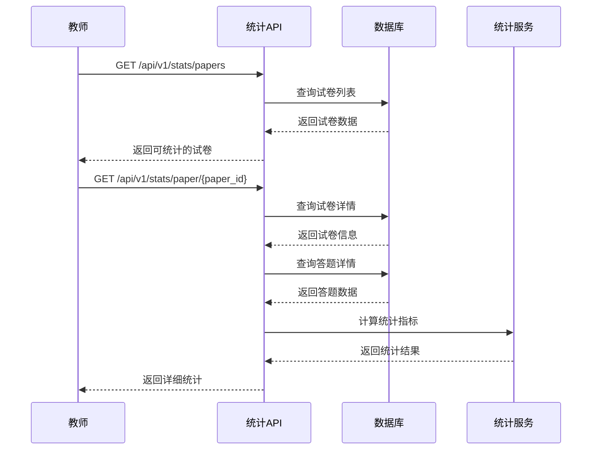

**图表来源**
- [stats.py:37-137](file://backend/app/api/v1/endpoints/stats.py#L37-L137)

**章节来源**
- [stats.py:1-251](file://backend/app/api/v1/endpoints/stats.py#L1-L251)
- [student.py:1-112](file://backend/app/api/v1/endpoints/student.py#L1-L112)

### 数据库管理模块

#### 系统监控接口

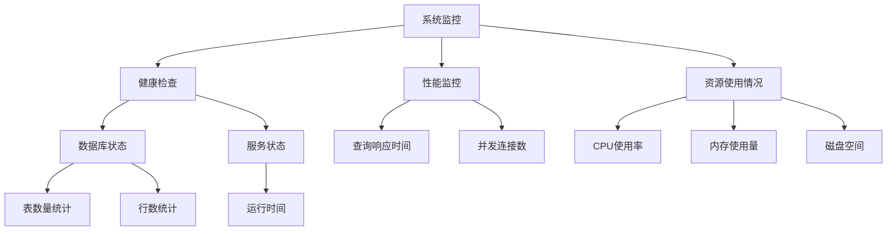

**图表来源**
- [database.py:23-85](file://backend/app/api/v1/endpoints/database.py#L23-L85)

#### 数据库配置管理

系统支持动态数据库配置更新：

| 接口 | 方法 | 功能描述 |
|------|------|----------|
| `/api/v1/database/admin/dashboard/stats` | GET | 获取系统仪表板统计 |
| `/api/v1/database/admin/database/status` | GET | 获取数据库状态信息 |
| `/api/v1/database/admin/database/config` | POST | 更新数据库连接配置 |

**章节来源**
- [database.py:1-167](file://backend/app/api/v1/endpoints/database.py#L1-L167)

### LLM配置管理

#### 大模型配置流程

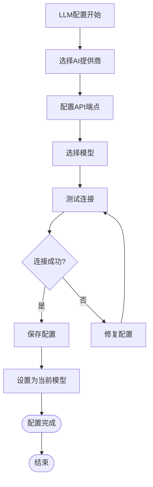

**图表来源**
- [llm_config.py:28-105](file://backend/app/api/v1/endpoints/llm_config.py#L28-L105)

#### 配置管理特性

系统支持多种AI提供商的统一管理：

| 提供商 | 支持的模型 | 特殊功能 |
|--------|------------|----------|
| Ollama | 本地模型 | 支持多模态模型检测 |
| DeepSeek | deepseek-chat | API密钥管理 |
| 其他 | 自定义端点 | 灵活的配置选项 |

**章节来源**
- [llm_config.py:1-186](file://backend/app/api/v1/endpoints/llm_config.py#L1-L186)
- [config_service.py:108-155](file://backend/app/services/config_service.py#L108-L155)

### 题库管理模块

#### 试题管理流程

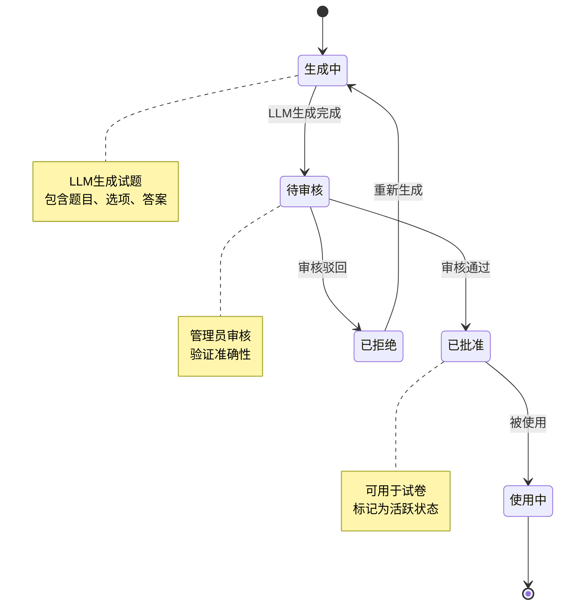

**图表来源**
- [question_admin.py:222-344](file://backend/app/api/v1/endpoints/question_admin.py#L222-L344)

#### 批量操作功能

系统支持高效的批量管理操作：

| 操作类型 | 接口 | 功能描述 |
|----------|------|----------|
| 批量审核 | `POST /api/v1/question-admin/batch-approve` | 批量通过试题审核 |
| 批量驳回 | `POST /api/v1/question-admin/batch-reject` | 批量驳回试题审核 |
| 批量去重 | `POST /api/v1/question-admin/dedup` | 批量查找重复试题 |
| 批量导入 | `POST /api/v1/question-admin/import-confirm` | 批量确认导入试题 |

**章节来源**
- [question_admin.py:1-837](file://backend/app/api/v1/endpoints/question_admin.py#L1-L837)

### 错题本管理

#### 错题本生成流程

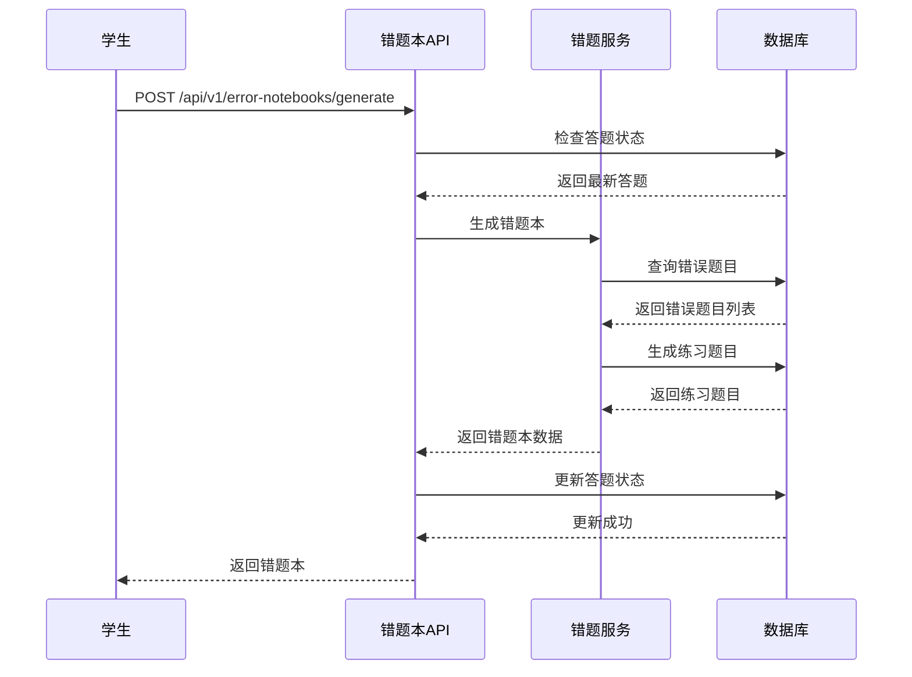

**图表来源**
- [error_notebooks.py:22-59](file://backend/app/api/v1/endpoints/error_notebooks.py#L22-L59)

**章节来源**
- [error_notebooks.py:1-437](file://backend/app/api/v1/endpoints/error_notebooks.py#L1-L437)

### 自学习管理

#### 自主学习任务管理

系统为学生提供个性化的学习路径：

| 接口 | 方法 | 功能描述 |
|------|------|----------|
| 创建任务 | `POST /api/v1/self-study/tasks` | 创建新的学习任务 |
| 获取任务 | `GET /api/v1/self-study/tasks/{task_id}` | 获取指定学习任务 |
| 更新任务 | `PUT /api/v1/self-study/tasks/{task_id}` | 更新学习任务状态 |
| 删除任务 | `DELETE /api/v1/self-study/tasks/{task_id}` | 删除学习任务 |
| 获取知识要点 | `GET /api/v1/self-study/knowledge-points` | 获取知识要点列表 |

**章节来源**
- [self_study.py:1-390](file://backend/app/api/v1/endpoints/self_study.py#L1-L390)

### 通知管理

#### 通知系统架构

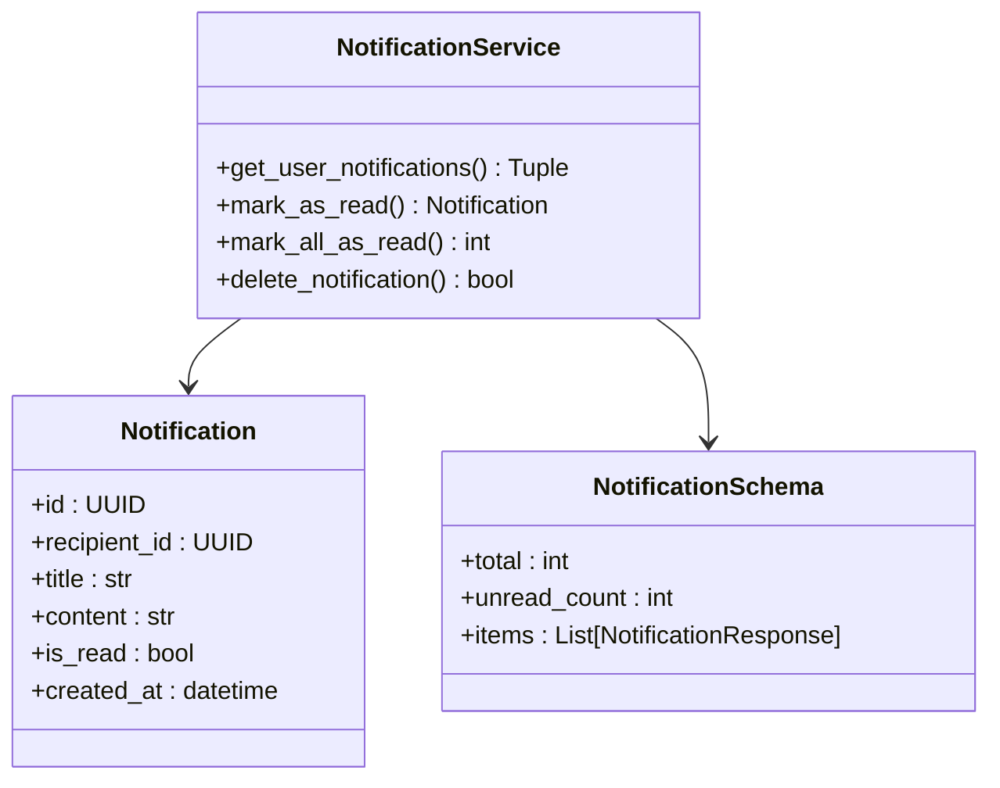

**图表来源**
- [notifications.py:13-80](file://backend/app/api/v1/endpoints/notifications.py#L13-L80)

**章节来源**
- [notifications.py:1-80](file://backend/app/api/v1/endpoints/notifications.py#L1-L80)

## 依赖关系分析

### 核心依赖图

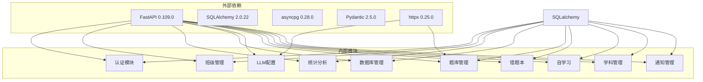

**图表来源**
- [auth_v2.py:1-476](file://backend/app/api/v1/endpoints/auth_v2.py#L1-L476)
- [config.py:1-98](file://backend/app/core/config.py#L1-L98)

### 数据模型关系

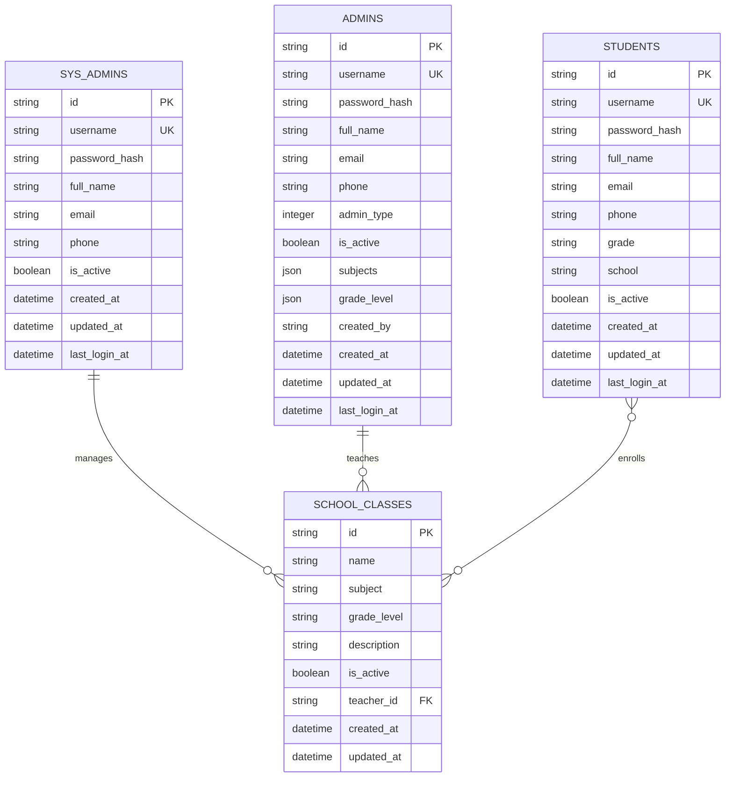

**图表来源**
- [sys_admin.py:8-22](file://backend/app/models/sys_admin.py#L8-L22)

**章节来源**
- [sys_admin.py:1-22](file://backend/app/models/sys_admin.py#L1-L22)

## 性能考虑

### 数据库优化策略

1. **连接池管理**
   - 最大连接数：50
   - 连接超时：5秒
   - 查询超时：30秒

2. **索引优化**
   - 频繁查询字段建立索引
   - 复合索引优化复杂查询
   - 唯一约束确保数据完整性

3. **查询优化**
   - 分页查询限制结果集大小
   - 懒加载减少不必要的数据传输
   - 批量操作提升效率

### 缓存策略

系统采用多层缓存机制：

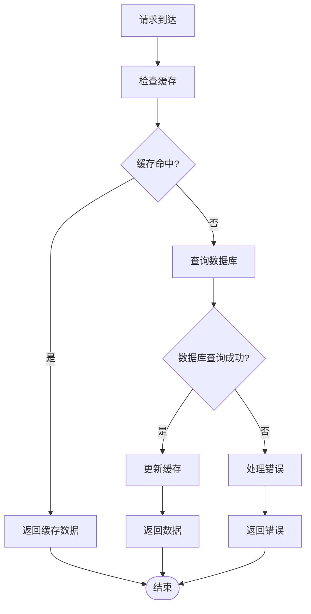

### 并发处理

系统支持高并发访问：

- **异步处理**：所有数据库操作使用异步模式
- **连接池**：数据库连接复用，避免频繁创建销毁
- **限流机制**：防止恶意请求和DDoS攻击
- **超时控制**：合理设置请求超时时间

## 故障排除指南

### 常见问题及解决方案

#### 认证相关问题

| 问题 | 可能原因 | 解决方案 |
|------|----------|----------|
| 登录失败 | 密码错误或账户被禁用 | 检查用户状态和密码 |
| 验证码错误 | 图形验证码过期 | 重新获取验证码 |
| 令牌过期 | JWT令牌超时 | 使用刷新令牌获取新令牌 |
| 权限不足 | 用户角色不匹配 | 检查用户权限级别 |

#### 数据库连接问题

| 问题 | 可能原因 | 解决方案 |
|------|----------|----------|
| 连接超时 | 数据库负载过高 | 检查数据库性能和连接池配置 |
| 连接失败 | 数据库服务不可用 | 确认数据库服务状态 |
| 查询超时 | SQL查询复杂度高 | 优化查询语句和添加索引 |
| 连接池耗尽 | 并发请求过多 | 调整连接池大小 |

#### LLM配置问题

| 问题 | 可能原因 | 解决方案 |
|------|----------|----------|
| 模型不可用 | 模型名称错误 | 检查可用模型列表 |
| API密钥无效 | 密钥过期或错误 | 重新配置API密钥 |
| 网络连接失败 | 网络环境问题 | 检查网络连通性和代理设置 |
| 响应超时 | 服务器响应慢 | 调整超时时间和重试策略 |

**章节来源**
- [config_service.py:108-155](file://backend/app/services/config_service.py#L108-L155)
- [auth_v2.py:91-183](file://backend/app/api/v1/endpoints/auth_v2.py#L91-L183)

### 日志管理

系统提供完善的日志记录机制：

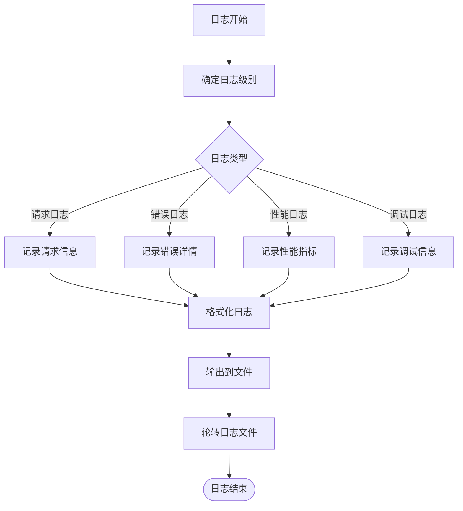

**章节来源**
- [answers.py:18-20](file://backend/app/api/v1/endpoints/answers.py#L18-L20)

## 结论

系统管理API提供了完整的教育管理系统后台功能，具有以下特点：

### 技术优势
- **模块化设计**：清晰的分层架构，职责分离明确
- **权限控制**：基于角色的细粒度权限管理
- **异步处理**：高性能的异步数据库操作
- **配置灵活**：动态配置管理，支持热更新

### 功能完整性
- **覆盖全面**：从用户管理到数据分析的完整功能链
- **扩展性强**：模块化设计便于功能扩展
- **稳定性好**：完善的错误处理和监控机制

### 最佳实践
- **安全性**：多层安全防护，包括认证、授权、数据加密
- **性能优化**：连接池、缓存、异步处理等优化措施
- **可维护性**：清晰的代码结构和完善的文档

该系统为教育机构提供了强大的后台管理能力，支持大规模用户的并发访问，满足现代教育管理的需求。