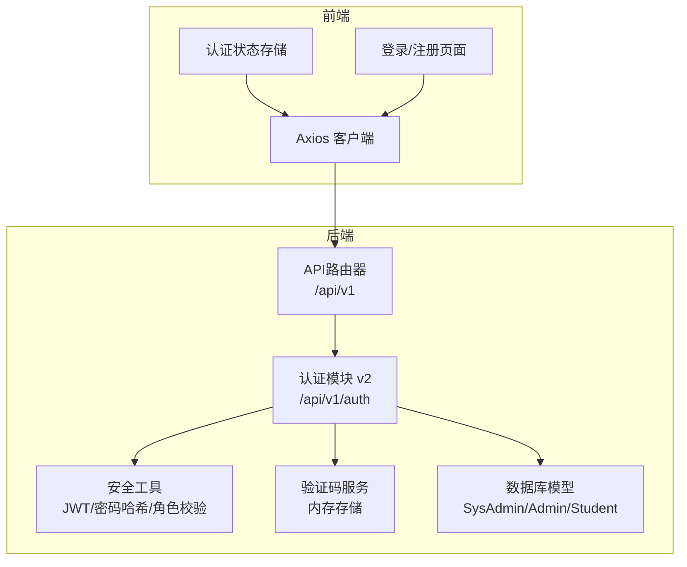
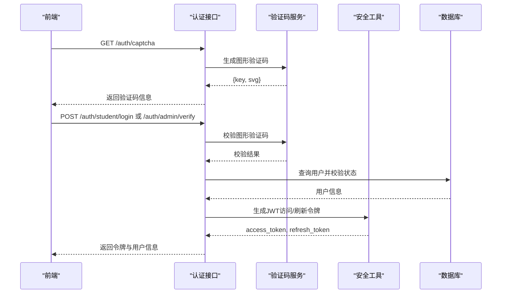
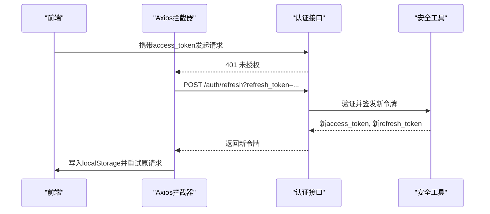
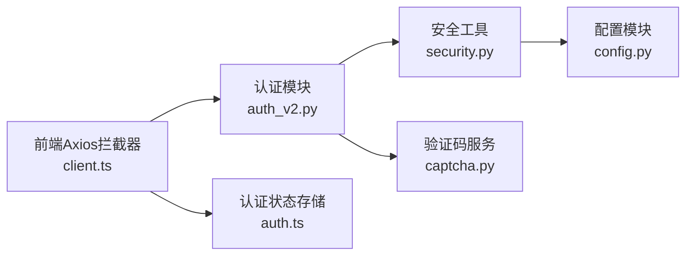
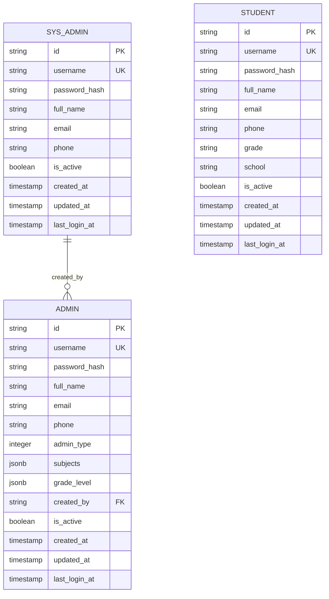

# 认证API

<cite>
**本文档引用的文件**
- [backend/app/api/v1/endpoints/auth_v2.py](file://backend/app/api/v1/endpoints/auth_v2.py)
- [backend/app/core/security.py](file://backend/app/core/security.py)
- [backend/app/core/config.py](file://backend/app/core/config.py)
- [backend/app/services/captcha.py](file://backend/app/services/captcha.py)
- [backend/app/api/v1/api.py](file://backend/app/api/v1/api.py)
- [backend/app/models/admin.py](file://backend/app/models/admin.py)
- [backend/app/models/student.py](file://backend/app/models/student.py)
- [backend/app/models/sys_admin.py](file://backend/app/models/sys_admin.py)
- [frontend/src/pages/auth/LoginPage.tsx](file://frontend/src/pages/auth/LoginPage.tsx)
- [frontend/src/store/auth.ts](file://frontend/src/store/auth.ts)
- [frontend/src/api/client.ts](file://frontend/src/api/client.ts)
</cite>

## 目录
1. [简介](#简介)
2. [项目结构](#项目结构)
3. [核心组件](#核心组件)
4. [架构总览](#架构总览)
5. [详细组件分析](#详细组件分析)
6. [依赖关系分析](#依赖关系分析)
7. [性能考虑](#性能考虑)
8. [故障排除指南](#故障排除指南)
9. [结论](#结论)
10. [附录](#附录)

## 简介
本文件为认证系统的详细API文档，覆盖以下主题：
- 用户登录、注册、验证码获取、密码重置等认证相关接口
- JWT令牌生成与刷新机制
- 权限验证流程
- 请求参数、响应格式、错误码定义
- 认证头设置方式
- 完整的请求与响应示例（以路径代替具体代码）
- 不同用户角色的认证流程差异（系统管理员、教师、题库管理员、学生）

## 项目结构
认证相关的核心实现位于后端Python服务中，前端使用Axios进行HTTP请求，并在拦截器中自动附加认证头。路由挂载于统一的API路由器下。

**图表来源**
- [backend/app/api/v1/api.py:1-26](file://backend/app/api/v1/api.py#L1-L26)
- [backend/app/api/v1/endpoints/auth_v2.py:1-476](file://backend/app/api/v1/endpoints/auth_v2.py#L1-L476)
- [frontend/src/api/client.ts:1-55](file://frontend/src/api/client.ts#L1-L55)

**章节来源**
- [backend/app/api/v1/api.py:1-26](file://backend/app/api/v1/api.py#L1-L26)

## 核心组件
- 认证路由：提供验证码获取、管理员登录/验证、学生登录/注册、个人资料查询与更新等接口
- 安全工具：密码哈希、JWT生成与解析、当前用户解析、角色权限校验
- 验证码服务：图形验证码生成与校验（内存存储）
- 数据模型：系统管理员、教师/题库管理员、学生三类用户表
- 前端Axios拦截器：自动附加Authorization头，处理401并尝试刷新令牌

**章节来源**
- [backend/app/api/v1/endpoints/auth_v2.py:1-476](file://backend/app/api/v1/endpoints/auth_v2.py#L1-L476)
- [backend/app/core/security.py:1-104](file://backend/app/core/security.py#L1-L104)
- [backend/app/services/captcha.py:1-40](file://backend/app/services/captcha.py#L1-L40)
- [backend/app/models/admin.py:1-27](file://backend/app/models/admin.py#L1-L27)
- [backend/app/models/student.py:1-23](file://backend/app/models/student.py#L1-L23)
- [backend/app/models/sys_admin.py:1-22](file://backend/app/models/sys_admin.py#L1-L22)
- [frontend/src/api/client.ts:1-55](file://frontend/src/api/client.ts#L1-L55)

## 架构总览
认证流程采用“图形验证码 + 短信验证码”的双因子策略，管理员登录分为两步：先验证身份与密码（生成一次性验证令牌），再凭短信验证码与一次性验证令牌换取JWT；学生登录/注册仅需短信验证码（占位码）。

**图表来源**
- [backend/app/api/v1/endpoints/auth_v2.py:75-237](file://backend/app/api/v1/endpoints/auth_v2.py#L75-L237)
- [backend/app/services/captcha.py:12-40](file://backend/app/services/captcha.py#L12-L40)
- [backend/app/core/security.py:24-47](file://backend/app/core/security.py#L24-L47)

## 详细组件分析

### 接口概览与路由
- 路由前缀：/api/v1/auth
- 主要接口：
  - GET /auth/captcha：获取图形验证码
  - POST /auth/admin/verify：管理员身份验证（生成一次性验证令牌）
  - POST /auth/admin/login：管理员登录（凭一次性验证令牌与短信验证码换取JWT）
  - POST /auth/student/login：学生登录
  - POST /auth/student/register：学生注册
  - GET /auth/profile：获取当前用户资料
  - PUT /auth/profile：更新用户资料
  - PUT /auth/profile/phone：更新手机号（需短信验证）

**章节来源**
- [backend/app/api/v1/endpoints/auth_v2.py:75-476](file://backend/app/api/v1/endpoints/auth_v2.py#L75-L476)
- [backend/app/api/v1/api.py:8](file://backend/app/api/v1/api.py#L8)

### 图形验证码获取
- 方法：GET
- 路径：/api/v1/auth/captcha
- 请求参数：无
- 响应字段：
  - captcha_key：验证码标识
  - captcha_svg：SVG图像数据URL
- 使用场景：登录/注册前先获取验证码，提交时携带captcha_key与captcha_code

**章节来源**
- [backend/app/api/v1/endpoints/auth_v2.py:75-78](file://backend/app/api/v1/endpoints/auth_v2.py#L75-L78)
- [backend/app/services/captcha.py:12-29](file://backend/app/services/captcha.py#L12-L29)

### 管理员登录（分两步）
- 步骤一：身份验证与密码校验
  - 方法：POST
  - 路径：/api/v1/auth/admin/verify
  - 请求体字段：
    - username：用户名或手机号
    - password：密码
    - captcha_key：图形验证码标识
    - captcha_code：图形验证码
    - role：角色类型（0=教师，1=题库管理员，2=系统管理员）
    - sms_code：短信验证码（占位码）
    - verify_token：可选，用于后续登录步骤
  - 响应字段：
    - ok：布尔值
    - verify_token：一次性验证令牌
    - user_type：用户类型（SYS_ADMIN/QUESTION_ADMIN/TEACHER）
    - full_name：用户全名
    - message：提示信息
  - 错误码：
    - 400：用户名为空、图形验证码错误
    - 401：用户不存在、角色不匹配、密码错误、身份验证已过期
    - 403：账号被停用

- 步骤二：短信验证码与一次性令牌登录
  - 方法：POST
  - 路径：/api/v1/auth/admin/login
  - 请求体字段：
    - sms_code：短信验证码（占位码）
    - verify_token：来自上一步的一次性验证令牌
  - 响应字段：
    - access_token：JWT访问令牌
    - refresh_token：JWT刷新令牌
    - token_type：bearer
    - user_type：用户类型
    - full_name：用户全名
  - 错误码：
    - 400：未提供verify_token或短信验证码错误
    - 401：verify_token无效或已过期

**章节来源**
- [backend/app/api/v1/endpoints/auth_v2.py:91-183](file://backend/app/api/v1/endpoints/auth_v2.py#L91-L183)
- [backend/app/services/captcha.py:32-40](file://backend/app/services/captcha.py#L32-L40)

### 学生登录
- 方法：POST
- 路径：/api/v1/auth/student/login
- 请求体字段：
  - username：用户名或手机号
  - captcha_key：图形验证码标识
  - captcha_code：图形验证码
  - sms_code：短信验证码（占位码）
- 响应字段：
  - access_token：JWT访问令牌
  - refresh_token：JWT刷新令牌
  - token_type：bearer
  - user_type：STUDENT
  - full_name：学生全名
- 错误码：
  - 400：图形验证码错误或过期、短信验证码错误
  - 401：用户不存在
  - 403：账号被停用

**章节来源**
- [backend/app/api/v1/endpoints/auth_v2.py:188-209](file://backend/app/api/v1/endpoints/auth_v2.py#L188-L209)

### 学生注册
- 方法：POST
- 路径：/api/v1/auth/student/register
- 请求体字段：
  - phone：11位手机号
  - sms_code：短信验证码（占位码）
  - full_name：姓名
  - grade：年级（可选）
  - school：学校（可选）
- 响应字段：
  - access_token：JWT访问令牌
  - refresh_token：JWT刷新令牌
  - token_type：bearer
  - user_type：STUDENT
  - full_name：学生全名
- 错误码：
  - 400：短信验证码错误、手机号已注册
- 注册逻辑要点：
  - 自动生成username（格式：stu_后6位手机号）
  - 初始password_hash为空（使用短信登录）

**章节来源**
- [backend/app/api/v1/endpoints/auth_v2.py:212-237](file://backend/app/api/v1/endpoints/auth_v2.py#L212-L237)

### 个人资料管理
- 获取资料：GET /api/v1/auth/profile
  - 需要认证头：Authorization: Bearer <access_token>
  - 响应字段：根据用户类型返回不同字段（系统管理员、教师/题库管理员、学生）
- 更新资料：PUT /api/v1/auth/profile
  - 允许字段：full_name、email、grade、school
  - 不允许修改：phone
- 更新手机号：PUT /api/v1/auth/profile/phone
  - 需要短信验证码校验

**章节来源**
- [backend/app/api/v1/endpoints/auth_v2.py:377-476](file://backend/app/api/v1/endpoints/auth_v2.py#L377-L476)

### JWT令牌生成与刷新机制
- 令牌类型：
  - 访问令牌（access_token）：短期有效，用于日常请求
  - 刷新令牌（refresh_token）：长期有效，用于刷新访问令牌
- 过期时间：
  - 访问令牌：settings.ACCESS_TOKEN_EXPIRE_MINUTES（默认约8天）
  - 刷新令牌：settings.REFRESH_TOKEN_EXPIRE_DAYS（默认30天）
- 生成算法：HS256，密钥来自settings.SECRET_KEY
- 刷新流程（前端拦截器）：
  - 当收到401未授权时，自动携带refresh_token调用刷新接口
  - 成功后更新本地存储的access_token与refresh_token，并重试原请求

**图表来源**
- [frontend/src/api/client.ts:26-52](file://frontend/src/api/client.ts#L26-L52)
- [backend/app/core/security.py:24-47](file://backend/app/core/security.py#L24-L47)
- [backend/app/core/config.py:44-46](file://backend/app/core/config.py#L44-L46)

**章节来源**
- [backend/app/core/security.py:24-47](file://backend/app/core/security.py#L24-L47)
- [backend/app/core/config.py:44-46](file://backend/app/core/config.py#L44-L46)
- [frontend/src/api/client.ts:26-52](file://frontend/src/api/client.ts#L26-L52)

### 权限验证流程
- 当前用户解析：
  - 从Authorization头提取Bearer令牌
  - 解析payload中的sub（用户ID）与type（用户类型）
  - 在对应用户表中校验用户存在性
- 角色校验：
  - require_role装饰器用于限制特定接口仅允许指定角色访问
  - 常见角色：SYS_ADMIN（系统管理员）、TEACHER（教师）、QUESTION_ADMIN（题库管理员）、STUDENT（学生）

**章节来源**
- [backend/app/core/security.py:64-103](file://backend/app/core/security.py#L64-L103)

### 请求与响应示例（以路径代替具体代码）
- 获取验证码
  - 请求：GET /api/v1/auth/captcha
  - 响应：{ "captcha_key": "...", "captcha_svg": "data:image/svg+xml;base64,..." }
- 管理员身份验证
  - 请求：POST /api/v1/auth/admin/verify
  - 请求体：{ "username": "...", "password": "...", "captcha_key": "...", "captcha_code": "...", "role": 0 }
  - 响应：{ "ok": true, "verify_token": "...", "user_type": "TEACHER", "full_name": "...", "message": "..." }
- 管理员登录
  - 请求：POST /api/v1/auth/admin/login
  - 请求体：{ "sms_code": "111111", "verify_token": "..." }
  - 响应：{ "access_token": "...", "refresh_token": "...", "token_type": "bearer", "user_type": "TEACHER", "full_name": "..." }
- 学生登录
  - 请求：POST /api/v1/auth/student/login
  - 请求体：{ "username": "...", "captcha_key": "...", "captcha_code": "...", "sms_code": "111111" }
  - 响应：{ "access_token": "...", "refresh_token": "...", "token_type": "bearer", "user_type": "STUDENT", "full_name": "..." }
- 学生注册
  - 请求：POST /api/v1/auth/student/register
  - 请求体：{ "phone": "13800001111", "sms_code": "111111", "full_name": "...", "grade": "...", "school": "..." }
  - 响应：{ "access_token": "...", "refresh_token": "...", "token_type": "bearer", "user_type": "STUDENT", "full_name": "..." }
- 获取个人资料
  - 请求：GET /api/v1/auth/profile（需Authorization头）
  - 响应：{ "ok": true, "data": { ... } }
- 更新个人资料
  - 请求：PUT /api/v1/auth/profile（需Authorization头）
  - 请求体：{ "full_name": "...", "email": "..." }
  - 响应：{ "ok": true, "message": "个人信息已更新" }
- 更新手机号
  - 请求：PUT /api/v1/auth/profile/phone（需Authorization头）
  - 请求体：{ "phone": "13800001111", "sms_code": "111111" }
  - 响应：{ "ok": true, "message": "手机号已更新", "phone": "13800001111" }

**章节来源**
- [backend/app/api/v1/endpoints/auth_v2.py:75-476](file://backend/app/api/v1/endpoints/auth_v2.py#L75-L476)

### 错误码定义
- 通用错误码（后端统一包装为{code,message,data}格式）：
  - 400：参数错误、验证码错误或过期、短信验证码错误、手机号已注册
  - 401：身份验证失败、密码错误、用户不存在、身份验证已过期
  - 403：账号被停用、权限不足
  - 404：资源不存在
  - 500：服务器内部错误
- 前端拦截器对401的处理：
  - 自动尝试刷新令牌并重试原请求
  - 失败则清除本地令牌并跳转至登录页

**章节来源**
- [backend/app/api/v1/endpoints/auth_v2.py:91-183](file://backend/app/api/v1/endpoints/auth_v2.py#L91-L183)
- [backend/app/api/v1/endpoints/auth_v2.py:188-237](file://backend/app/api/v1/endpoints/auth_v2.py#L188-L237)
- [frontend/src/api/client.ts:26-52](file://frontend/src/api/client.ts#L26-L52)

### 认证头设置
- 前端Axios拦截器会在每个请求中自动添加Authorization头：
  - Authorization: Bearer <access_token>
- 登录成功后，前端会将access_token与refresh_token写入localStorage，并在后续请求中自动附加
- 刷新令牌成功后，前端会更新localStorage中的令牌并重试原请求

**章节来源**
- [frontend/src/api/client.ts:9-15](file://frontend/src/api/client.ts#L9-L15)
- [frontend/src/store/auth.ts:56-70](file://frontend/src/store/auth.ts#L56-L70)

### 不同用户角色的认证流程差异
- 系统管理员（SYS_ADMIN）：
  - 登录：两步验证（先admin/verify，再admin/login）
  - 可创建/管理教师与题库管理员账户
- 教师（TEACHER）与题库管理员（QUESTION_ADMIN）：
  - 登录：两步验证（先admin/verify，再admin/login）
  - 无法创建/管理其他管理员
- 学生（STUDENT）：
  - 登录/注册：仅需短信验证码（占位码）
  - 无密码要求（初始password_hash为空）

**章节来源**
- [backend/app/api/v1/endpoints/auth_v2.py:91-183](file://backend/app/api/v1/endpoints/auth_v2.py#L91-L183)
- [backend/app/api/v1/endpoints/auth_v2.py:188-237](file://backend/app/api/v1/endpoints/auth_v2.py#L188-L237)
- [backend/app/models/admin.py:19](file://backend/app/models/admin.py#L19)
- [backend/app/models/sys_admin.py:1](file://backend/app/models/sys_admin.py#L1)

## 依赖关系分析
- 认证模块依赖安全工具与验证码服务
- 安全工具依赖配置模块读取密钥与算法
- 前端Axios拦截器依赖认证状态存储

**图表来源**
- [backend/app/api/v1/endpoints/auth_v2.py:13-19](file://backend/app/api/v1/endpoints/auth_v2.py#L13-L19)
- [backend/app/core/security.py:1-12](file://backend/app/core/security.py#L1-L12)
- [backend/app/core/config.py:43-46](file://backend/app/core/config.py#L43-L46)
- [frontend/src/api/client.ts:1-7](file://frontend/src/api/client.ts#L1-L7)
- [frontend/src/store/auth.ts:1-8](file://frontend/src/store/auth.ts#L1-L8)

**章节来源**
- [backend/app/api/v1/endpoints/auth_v2.py:13-19](file://backend/app/api/v1/endpoints/auth_v2.py#L13-L19)
- [backend/app/core/security.py:1-12](file://backend/app/core/security.py#L1-L12)
- [backend/app/core/config.py:43-46](file://backend/app/core/config.py#L43-L46)
- [frontend/src/api/client.ts:1-7](file://frontend/src/api/client.ts#L1-L7)
- [frontend/src/store/auth.ts:1-8](file://frontend/src/store/auth.ts#L1-L8)

## 性能考虑
- 验证码采用内存存储，适合开发环境；生产建议迁移到Redis以支持多实例共享
- JWT令牌有效期较长（访问令牌约8天，刷新令牌30天），减少频繁刷新开销
- 前端拦截器在401时自动刷新，避免用户感知到令牌过期

[本节为通用指导，无需特定文件分析]

## 故障排除指南
- 登录失败（401）：
  - 检查图形验证码与短信验证码是否正确
  - 确认用户是否存在且状态正常
- 403 账号被停用：
  - 联系系统管理员恢复
- 400 参数错误：
  - 确认必填字段完整，手机号长度为11位
- 401 未授权（前端）：
  - 检查Authorization头是否正确附加
  - 若出现循环刷新，确认refresh_token是否有效

**章节来源**
- [backend/app/api/v1/endpoints/auth_v2.py:91-183](file://backend/app/api/v1/endpoints/auth_v2.py#L91-L183)
- [frontend/src/api/client.ts:26-52](file://frontend/src/api/client.ts#L26-L52)

## 结论
本认证体系通过图形验证码与短信验证码双重校验，结合JWT令牌与刷新机制，实现了安全、便捷的多角色认证流程。管理员登录采用两步验证提升安全性，学生登录简化为短信登录。前后端配合完善，具备良好的扩展性与可维护性。

[本节为总结，无需特定文件分析]

## 附录

### 数据模型关系

**图表来源**
- [backend/app/models/sys_admin.py:8-22](file://backend/app/models/sys_admin.py#L8-L22)
- [backend/app/models/admin.py:9-27](file://backend/app/models/admin.py#L9-L27)
- [backend/app/models/student.py:8-23](file://backend/app/models/student.py#L8-L23)