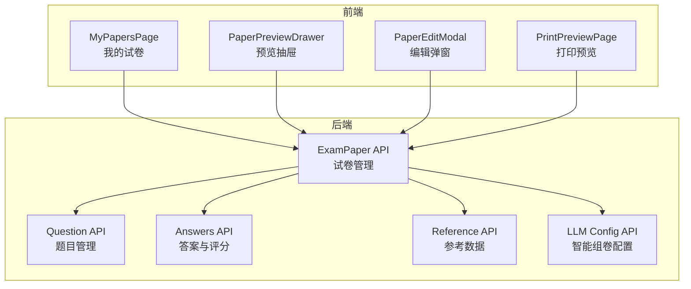
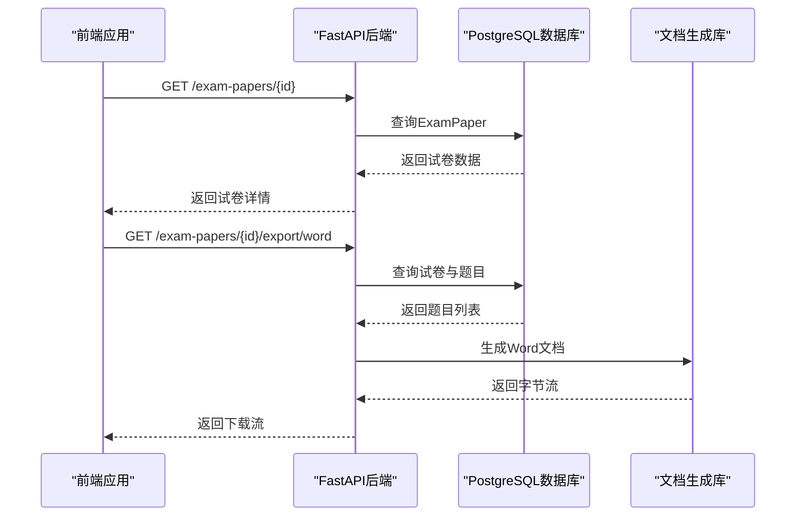
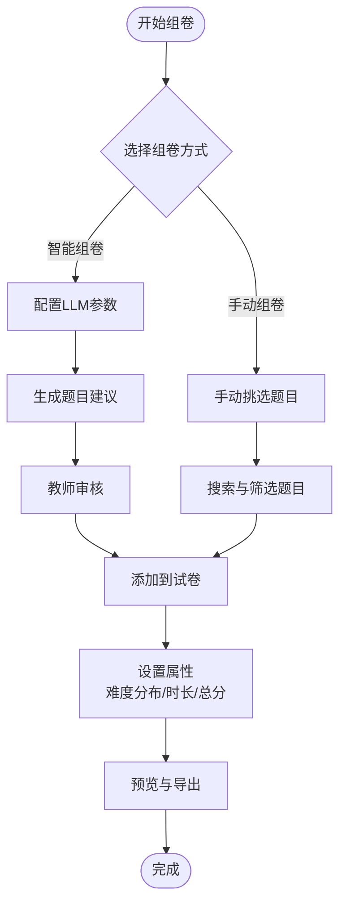
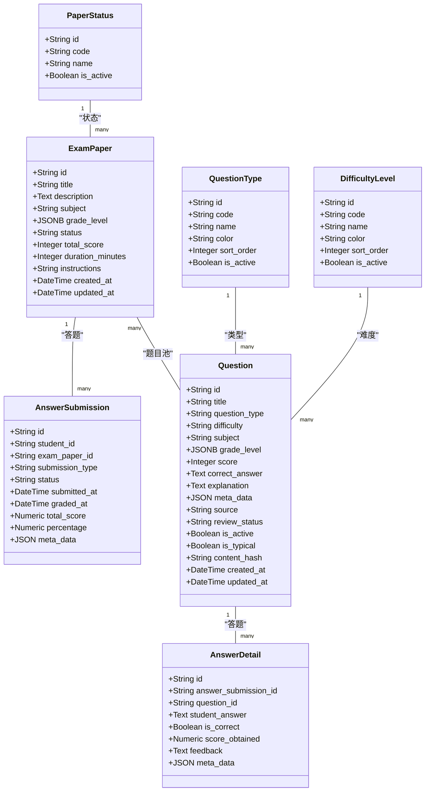

# 试卷管理API

<cite>
**本文档引用的文件**
- [backend/app/api/v1/endpoints/exam_papers.py](file://backend/app/api/v1/endpoints/exam_papers.py)
- [backend/app/models/exam_paper.py](file://backend/app/models/exam_paper.py)
- [backend/app/schemas/exam_paper.py](file://backend/app/schemas/exam_paper.py)
- [backend/app/models/question.py](file://backend/app/models/question.py)
- [backend/app/schemas/common.py](file://backend/app/schemas/common.py)
- [backend/app/api/v1/endpoints/questions.py](file://backend/app/api/v1/endpoints/questions.py)
- [backend/app/api/v1/endpoints/answers.py](file://backend/app/api/v1/endpoints/answers.py)
- [backend/app/models/answer_submission.py](file://backend/app/models/answer_submission.py)
- [backend/app/models/answer_detail.py](file://backend/app/models/answer_detail.py)
- [backend/app/api/v1/endpoints/reference.py](file://backend/app/api/v1/endpoints/reference.py)
- [backend/app/models/reference.py](file://backend/app/models/reference.py)
- [backend/app/api/v1/endpoints/llm_config.py](file://backend/app/api/v1/endpoints/llm_config.py)
- [backend/app/models/llm_config.py](file://backend/app/models/llm_config.py)
- [frontend/src/pages/papers/MyPapersPage.tsx](file://frontend/src/pages/papers/MyPapersPage.tsx)
- [frontend/src/pages/papers/PaperPreviewDrawer.tsx](file://frontend/src/pages/papers/PaperPreviewDrawer.tsx)
- [frontend/src/pages/papers/PaperEditModal.tsx](file://frontend/src/pages/papers/PaperEditModal.tsx)
- [frontend/src/pages/papers/PrintPreviewPage.tsx](file://frontend/src/pages/papers/PrintPreviewPage.tsx)
</cite>

## 目录
1. [简介](#简介)
2. [项目结构](#项目结构)
3. [核心组件](#核心组件)
4. [架构概览](#架构概览)
5. [详细组件分析](#详细组件分析)
6. [依赖关系分析](#依赖关系分析)
7. [性能考虑](#性能考虑)
8. [故障排除指南](#故障排除指南)
9. [结论](#结论)
10. [附录](#附录)

## 简介
本API文档面向试卷管理系统的核心功能，涵盖试卷创建、编辑、发布、删除等基础操作，以及模板管理、题目组合规则、难度分布控制、时间限制设置等高级特性。同时提供试卷预览、打印、导出Word/PDF等接口说明，并介绍智能组卷与手动组卷两种实现方式及API调用示例。

## 项目结构
后端采用FastAPI + SQLAlchemy异步数据库访问模式，前端使用React + Ant Design构建用户界面。核心模块包括：
- 试卷管理：ExamPaper模型与相关API端点
- 题目管理：Question模型与相关API端点
- 答案与评分：AnswerSubmission与AnswerDetail模型
- 参考数据：PaperStatus、QuestionType、DifficultyLevel等
- 智能组卷：LLM配置与测试接口

**图表来源**
- [backend/app/api/v1/endpoints/exam_papers.py:1-847](file://backend/app/api/v1/endpoints/exam_papers.py#L1-L847)
- [backend/app/api/v1/endpoints/questions.py:1-434](file://backend/app/api/v1/endpoints/questions.py#L1-L434)
- [backend/app/api/v1/endpoints/answers.py:1-421](file://backend/app/api/v1/endpoints/answers.py#L1-L421)
- [backend/app/api/v1/endpoints/reference.py:1-122](file://backend/app/api/v1/endpoints/reference.py#L1-L122)
- [backend/app/api/v1/endpoints/llm_config.py:1-186](file://backend/app/api/v1/endpoints/llm_config.py#L1-L186)

**章节来源**
- [backend/app/api/v1/endpoints/exam_papers.py:1-847](file://backend/app/api/v1/endpoints/exam_papers.py#L1-L847)
- [backend/app/api/v1/endpoints/questions.py:1-434](file://backend/app/api/v1/endpoints/questions.py#L1-L434)
- [backend/app/api/v1/endpoints/answers.py:1-421](file://backend/app/api/v1/endpoints/answers.py#L1-L421)
- [backend/app/api/v1/endpoints/reference.py:1-122](file://backend/app/api/v1/endpoints/reference.py#L1-L122)
- [backend/app/api/v1/endpoints/llm_config.py:1-186](file://backend/app/api/v1/endpoints/llm_config.py#L1-L186)

## 核心组件
- 试卷模型ExamPaper：包含标题、描述、学科、适用范围、状态、总分、时长、说明等字段，支持JSONB存储适用范围信息。
- 题目模型Question：包含题目类型、难度、学科、适用范围、分数、正确答案、解析、元数据等字段。
- 关联表exam_paper_questions：维护试卷与题目的多对多关系，支持题目顺序与每题分数。
- 答案提交AnswerSubmission与答案详情AnswerDetail：支持在线作答与OCR上传，自动评分与错题本生成。
- 参考数据：PaperStatus、QuestionType、DifficultyLevel等，统一管理业务字典。

**章节来源**
- [backend/app/models/exam_paper.py:23-51](file://backend/app/models/exam_paper.py#L23-L51)
- [backend/app/models/question.py:10-46](file://backend/app/models/question.py#L10-L46)
- [backend/app/models/answer_submission.py:9-37](file://backend/app/models/answer_submission.py#L9-L37)
- [backend/app/models/answer_detail.py:9-33](file://backend/app/models/answer_detail.py#L9-L33)

## 架构概览
系统采用分层架构：前端通过HTTP请求调用后端API，后端使用SQLAlchemy ORM进行数据库操作，部分导出功能使用第三方库（python-docx、fpdf）生成文档。

**图表来源**
- [backend/app/api/v1/endpoints/exam_papers.py:635-738](file://backend/app/api/v1/endpoints/exam_papers.py#L635-L738)
- [backend/app/models/exam_paper.py:9-20](file://backend/app/models/exam_paper.py#L9-L20)

## 详细组件分析

### 试卷管理API
- 创建试卷
  - 方法：POST /exam-papers
  - 权限：教师、题库管理员、系统管理员
  - 请求体：ExamPaperCreate（包含标题、描述、学科、适用范围、状态、总分、时长、说明等）
  - 行为：校验权限，创建试卷并可批量导入题目；支持questions字段直接导入题目并建立关联
  - 响应：ExamPaperResponse

- 获取试卷列表
  - 方法：GET /exam-papers
  - 权限：所有用户
  - 查询参数：skip、limit、title、status、scope、grade、grades、keyword、created_by
  - 行为：支持按标题模糊搜索、状态过滤、适用范围过滤、关键词搜索、创建者过滤
  - 响应：包含每个试卷的题目数量统计

- 获取我的试卷
  - 方法：GET /exam-papers/my
  - 权限：学生
  - 查询参数：skip、limit、title、status、grade
  - 行为：返回该学生有答题记录的试卷，包含最新答题状态与得分
  - 响应：试卷基本信息与答题状态

- 获取单个试卷
  - 方法：GET /exam-papers/{exam_paper_id}
  - 权限：所有用户
  - 响应：ExamPaperResponse

- 更新试卷
  - 方法：PUT /exam-papers/{exam_paper_id}
  - 权限：教师、题库管理员、系统管理员或试卷创建者
  - 请求体：ExamPaperUpdate
  - 响应：更新后的ExamPaperResponse

- 删除试卷
  - 方法：DELETE /exam-papers/{exam_paper_id}
  - 权限：教师、题库管理员、系统管理员、学生
  - 行为：级联删除关联的题目、答题记录、错题本、OCR上传记录
  - 响应：204 No Content

- 修改提交状态
  - 方法：PUT /exam-papers/{exam_paper_id}/submission-status
  - 权限：学生
  - 行为：仅允许将“已生成”状态修改为“重新判”，用于人工复核
  - 响应：状态变更结果

- 获取试卷题目
  - 方法：GET /exam-papers/{exam_paper_id}/questions
  - 权限：所有用户
  - 响应：按顺序排列的题目列表

- 添加题目到试卷
  - 方法：POST /exam-papers/{exam_paper_id}/questions
  - 权限：教师、题库管理员、系统管理员或试卷创建者
  - 请求体：question_id（UUID）、position（整数）、score（整数）
  - 响应：更新后的试卷对象

- 从试卷移除题目
  - 方法：DELETE /exam-papers/{exam_paper_id}/questions/{question_id}
  - 权限：教师、题库管理员、系统管理员或试卷创建者
  - 响应：更新后的试卷对象

- 排序试卷题目
  - 方法：PUT /exam-papers/{exam_paper_id}/questions/sort
  - 权限：教师、题库管理员、系统管理员或试卷创建者
  - 请求体：question_ids（字符串数组）
  - 响应：更新后的试卷对象

- 预览试卷
  - 方法：GET /exam-papers/{exam_paper_id}/preview
  - 权限：所有用户
  - 响应：试卷基本信息与题目详情（含类型标签、答案文本、选项等）

- 导出Word
  - 方法：GET /exam-papers/{exam_paper_id}/export/word
  - 权限：所有用户
  - 响应：application/vnd.openxmlformats-officedocument.wordprocessingml.document的下载流

- 导出PDF
  - 方法：GET /exam-papers/{exam_paper_id}/export/pdf
  - 权限：所有用户
  - 响应：application/pdf的下载流

**章节来源**
- [backend/app/api/v1/endpoints/exam_papers.py:20-847](file://backend/app/api/v1/endpoints/exam_papers.py#L20-L847)
- [backend/app/schemas/exam_paper.py:9-44](file://backend/app/schemas/exam_paper.py#L9-L44)

### 题目管理API
- 创建题目
  - 方法：POST /questions
  - 权限：教师、题库管理员、系统管理员
  - 请求体：QuestionCreate
  - 响应：QuestionResponse

- 搜索题目
  - 方法：GET /questions/search
  - 权限：认证用户
  - 查询参数：subject、grade_level、grade、scope、source、question_type、difficulty、keyword、knowledge_point、skip、limit
  - 响应：题目列表与总数

- 批量导入题目
  - 方法：POST /questions/batch-import
  - 权限：教师、题库管理员、系统管理员
  - 请求体：题目数组（最多200条）
  - 响应：导入数量与消息

- 导出题目
  - 方法：GET /questions/export
  - 权限：认证用户
  - 查询参数：subject、grade_level、question_type、difficulty、keyword、knowledge_point、limit
  - 响应：题目列表（最多200条）

- 获取单个题目
  - 方法：GET /questions/{question_id}
  - 权限：所有用户
  - 响应：QuestionResponse

- 更新题目
  - 方法：PUT /questions/{question_id}
  - 权限：教师、题库管理员、系统管理员或题目创建者
  - 请求体：QuestionUpdate
  - 响应：更新后的QuestionResponse

- 删除题目
  - 方法：DELETE /questions/{question_id}
  - 权限：教师、题库管理员、系统管理员
  - 响应：删除成功消息

- 典型题目
  - 方法：GET /questions/typical
  - 权限：认证用户
  - 查询参数：skip、limit、subject、grade
  - 响应：典型题目列表

- 标记典型题目
  - 方法：PUT /questions/{question_id}/typical
  - 权限：教师、题库管理员、系统管理员
  - 请求体：is_typical（布尔）
  - 响应：标记结果

**章节来源**
- [backend/app/api/v1/endpoints/questions.py:17-434](file://backend/app/api/v1/endpoints/questions.py#L17-L434)
- [backend/app/models/question.py:10-46](file://backend/app/models/question.py#L10-L46)

### 答案与评分API
- 提交答案
  - 方法：POST /answers
  - 权限：学生
  - 请求体：AnswerSubmissionCreate（包含exam_paper_id、submission_type、answers数组）
  - 行为：创建答题提交与答案详情，立即调用评分引擎计算得分，发送通知，必要时生成错题本
  - 响应：AnswerSubmissionResponse

- 获取单个答案
  - 方法：GET /answers/{answer_id}
  - 权限：答案所属学生或教师/系统管理员
  - 响应：AnswerSubmissionResponse

- 更新答案
  - 方法：PUT /answers/{answer_id}
  - 权限：答案所属学生
  - 行为：仅允许在未锁定状态下更新；删除旧答案详情并插入新答案详情
  - 响应：更新后的AnswerSubmissionResponse

- 获取某学生某试卷的答案
  - 方法：GET /answers/student/{student_id}/exam/{exam_paper_id}
  - 权限：本人或教师/系统管理员
  - 响应：AnswerSubmissionResponse

- 获取某学生的答案列表
  - 方法：GET /answers/student/{student_id}
  - 权限：本人或教师/系统管理员
  - 查询参数：skip、limit
  - 响应：AnswerSubmissionResponse数组

- 获取某试卷的所有答案
  - 方法：GET /answers/exam/{exam_paper_id}
  - 权限：教师/系统管理员
  - 查询参数：skip、limit
  - 响应：AnswerSubmissionResponse数组

- 删除答案
  - 方法：DELETE /answers/{answer_id}
  - 权限：答案所属学生
  - 行为：仅允许在未锁定状态下删除；级联删除答案详情
  - 响应：204 No Content

**章节来源**
- [backend/app/api/v1/endpoints/answers.py:115-421](file://backend/app/api/v1/endpoints/answers.py#L115-L421)
- [backend/app/models/answer_submission.py:9-37](file://backend/app/models/answer_submission.py#L9-L37)
- [backend/app/models/answer_detail.py:9-33](file://backend/app/models/answer_detail.py#L9-L33)

### 模板管理与难度分布控制
- 适用范围与难度分布
  - 适用范围：通过GradeLevel结构定义，包含scope（comprehensive、grade_comprehensive、chapter、knowledge_point）、grades数组、chapter与knowledge_points字段
  - 难度分布：前端根据difficulty_ratio配置计算各难度题目数量，确保满足分布要求
  - 时间限制：通过duration_minutes字段设置考试时长（分钟）

- 模板管理
  - 当前代码中未实现专用的模板API端点，但可通过以下方式实现：
    - 复用现有创建/更新接口，将模板作为特殊状态（如TEMPLATE）的试卷
    - 使用题目池与难度分布策略，结合智能组卷算法生成试卷
    - 通过导出/导入机制共享模板

**章节来源**
- [backend/app/schemas/common.py:23-44](file://backend/app/schemas/common.py#L23-L44)
- [frontend/src/pages/papers/PaperEditModal.tsx:105-125](file://frontend/src/pages/papers/PaperEditModal.tsx#L105-L125)

### 智能组卷与手动组卷
- 智能组卷
  - LLM配置：支持Ollama与DeepSeek，提供配置读取、更新、测试连接、可用模型查询等功能
  - 组卷流程：前端根据模板配置与LLM能力生成题目建议，教师确认后加入试卷
  - 测试连接：验证模型可用性与响应速度

- 手动组卷
  - 通过题目搜索与筛选，选择合适题目加入试卷
  - 支持批量导入、导出题目，便于模板化管理

**图表来源**
- [backend/app/api/v1/endpoints/llm_config.py:17-186](file://backend/app/api/v1/endpoints/llm_config.py#L17-L186)
- [frontend/src/pages/papers/PaperEditModal.tsx:105-125](file://frontend/src/pages/papers/PaperEditModal.tsx#L105-L125)

**章节来源**
- [backend/app/api/v1/endpoints/llm_config.py:1-186](file://backend/app/api/v1/endpoints/llm_config.py#L1-L186)
- [frontend/src/pages/papers/PaperEditModal.tsx:1-31](file://frontend/src/pages/papers/PaperEditModal.tsx#L1-L31)

### 参考数据API
- 获取全部参考数据
  - 方法：GET /reference/all
  - 权限：公开读取
  - 响应：包含题目类型、难度级别、年级、试卷状态、错误类型、题目来源、省份、科目等

- 获取单项参考数据
  - 方法：GET /reference/{key}
  - 权限：公开读取
  - 响应：对应键值的数据列表

- 系统管理员写入接口
  - 权限：系统管理员
  - 功能：创建、更新、停用参考数据项

**章节来源**
- [backend/app/api/v1/endpoints/reference.py:33-122](file://backend/app/api/v1/endpoints/reference.py#L33-L122)
- [backend/app/models/reference.py:8-76](file://backend/app/models/reference.py#L8-L76)

## 依赖关系分析

**图表来源**
- [backend/app/models/exam_paper.py:23-51](file://backend/app/models/exam_paper.py#L23-L51)
- [backend/app/models/question.py:10-46](file://backend/app/models/question.py#L10-L46)
- [backend/app/models/answer_submission.py:9-37](file://backend/app/models/answer_submission.py#L9-L37)
- [backend/app/models/answer_detail.py:9-33](file://backend/app/models/answer_detail.py#L9-L33)
- [backend/app/models/reference.py:40-46](file://backend/app/models/reference.py#L40-L46)

**章节来源**
- [backend/app/models/exam_paper.py:9-51](file://backend/app/models/exam_paper.py#L9-L51)
- [backend/app/models/question.py:35-46](file://backend/app/models/question.py#L35-L46)

## 性能考虑
- 分页与限制：所有列表接口均限制最大返回数量（默认200），避免超大数据集查询
- 数据库索引：关键字段（如subject、created_by、is_active、content_hash）建立索引，提升查询效率
- 异步数据库：使用SQLAlchemy异步会话，减少I/O阻塞
- 导出优化：Word/PDF导出使用流式响应，避免一次性加载大文档到内存
- 缓存策略：建议在网关层缓存常用参考数据与静态资源

## 故障排除指南
- 权限错误
  - 症状：403 Forbidden
  - 原因：非授权角色访问或未登录
  - 处理：检查用户角色与登录状态

- 资源不存在
  - 症状：404 Not Found
  - 原因：试卷/题目/答案不存在
  - 处理：确认ID有效性与资源归属

- 状态约束
  - 症状：400 Bad Request
  - 原因：尝试修改已锁定的答题记录或状态不合法
  - 处理：等待系统生成错题本后再进行修改

- 导出失败
  - 症状：导出接口异常
  - 原因：文档库依赖缺失或字体不可用
  - 处理：安装python-docx与fpdf，确保系统字体路径正确

**章节来源**
- [backend/app/api/v1/endpoints/answers.py:252-257](file://backend/app/api/v1/endpoints/answers.py#L252-L257)
- [backend/app/api/v1/endpoints/exam_papers.py:333-359](file://backend/app/api/v1/endpoints/exam_papers.py#L333-L359)

## 结论
本API体系完整覆盖了试卷管理的核心需求，支持手动与智能两种组卷方式，具备完善的权限控制、状态管理与导出能力。通过参考数据统一管理与灵活的适用范围配置，系统能够满足不同教学场景下的组卷需求。

## 附录

### API调用示例（路径引用）
- 创建试卷
  - [POST /exam-papers:20-64](file://backend/app/api/v1/endpoints/exam_papers.py#L20-L64)
- 获取试卷列表
  - [GET /exam-papers:362-416](file://backend/app/api/v1/endpoints/exam_papers.py#L362-L416)
- 获取我的试卷
  - [GET /exam-papers/my:67-123](file://backend/app/api/v1/endpoints/exam_papers.py#L67-L123)
- 获取单个试卷
  - [GET /exam-papers/{exam_paper_id}:226-239](file://backend/app/api/v1/endpoints/exam_papers.py#L226-L239)
- 更新试卷
  - [PUT /exam-papers/{exam_paper_id}:242-283](file://backend/app/api/v1/endpoints/exam_papers.py#L242-L283)
- 删除试卷
  - [DELETE /exam-papers/{exam_paper_id}:286-330](file://backend/app/api/v1/endpoints/exam_papers.py#L286-L330)
- 修改提交状态
  - [PUT /exam-papers/{exam_paper_id}/submission-status:333-359](file://backend/app/api/v1/endpoints/exam_papers.py#L333-L359)
- 获取试卷题目
  - [GET /exam-papers/{exam_paper_id}/questions:569-585](file://backend/app/api/v1/endpoints/exam_papers.py#L569-L585)
- 添加题目到试卷
  - [POST /exam-papers/{exam_paper_id}/questions:419-473](file://backend/app/api/v1/endpoints/exam_papers.py#L419-L473)
- 从试卷移除题目
  - [DELETE /exam-papers/{exam_paper_id}/questions/{question_id}:476-524](file://backend/app/api/v1/endpoints/exam_papers.py#L476-L524)
- 排序试卷题目
  - [PUT /exam-papers/{exam_paper_id}/questions/sort:527-566](file://backend/app/api/v1/endpoints/exam_papers.py#L527-L566)
- 预览试卷
  - [GET /exam-papers/{exam_paper_id}/preview:827-843](file://backend/app/api/v1/endpoints/exam_papers.py#L827-L843)
- 导出Word
  - [GET /exam-papers/{exam_paper_id}/export/word:635-738](file://backend/app/api/v1/endpoints/exam_papers.py#L635-L738)
- 导出PDF
  - [GET /exam-papers/{exam_paper_id}/export/pdf:741-847](file://backend/app/api/v1/endpoints/exam_papers.py#L741-L847)

- 创建题目
  - [POST /questions:17-36](file://backend/app/api/v1/endpoints/questions.py#L17-L36)
- 搜索题目
  - [GET /questions/search:39-104](file://backend/app/api/v1/endpoints/questions.py#L39-L104)
- 批量导入题目
  - [POST /questions/batch-import:127-155](file://backend/app/api/v1/endpoints/questions.py#L127-L155)
- 导出题目
  - [GET /questions/export:171-214](file://backend/app/api/v1/endpoints/questions.py#L171-L214)
- 获取单个题目
  - [GET /questions/{question_id}:276-289](file://backend/app/api/v1/endpoints/questions.py#L276-L289)
- 更新题目
  - [PUT /questions/{question_id}:292-328](file://backend/app/api/v1/endpoints/questions.py#L292-L328)
- 删除题目
  - [DELETE /questions/{question_id}:331-347](file://backend/app/api/v1/endpoints/questions.py#L331-L347)
- 典型题目
  - [GET /questions/typical:227-254](file://backend/app/api/v1/endpoints/questions.py#L227-L254)
- 标记典型题目
  - [PUT /questions/{question_id}/typical:257-273](file://backend/app/api/v1/endpoints/questions.py#L257-L273)

- 提交答案
  - [POST /answers:115-196](file://backend/app/api/v1/endpoints/answers.py#L115-L196)
- 获取单个答案
  - [GET /answers/{answer_id}:199-220](file://backend/app/api/v1/endpoints/answers.py#L199-L220)
- 更新答案
  - [PUT /answers/{answer_id}:223-289](file://backend/app/api/v1/endpoints/answers.py#L223-L289)
- 获取某学生某试卷的答案
  - [GET /answers/student/{student_id}/exam/{exam_paper_id}:292-321](file://backend/app/api/v1/endpoints/answers.py#L292-L321)
- 获取某学生的答案列表
  - [GET /answers/student/{student_id}:324-347](file://backend/app/api/v1/endpoints/answers.py#L324-L347)
- 获取某试卷的所有答案
  - [GET /answers/exam/{exam_paper_id}:350-373](file://backend/app/api/v1/endpoints/answers.py#L350-L373)
- 删除答案
  - [DELETE /answers/{answer_id}:376-417](file://backend/app/api/v1/endpoints/answers.py#L376-L417)

- 获取全部参考数据
  - [GET /reference/all:33-43](file://backend/app/api/v1/endpoints/reference.py#L33-L43)
- 获取单项参考数据
  - [GET /reference/{key}:48-59](file://backend/app/api/v1/endpoints/reference.py#L48-L59)
- LLM配置
  - [GET /llm-config/config:17-25](file://backend/app/api/v1/endpoints/llm_config.py#L17-L25)
  - [PUT /llm-config/config:28-52](file://backend/app/api/v1/endpoints/llm_config.py#L28-L52)
  - [POST /llm-config/config/test:61-105](file://backend/app/api/v1/endpoints/llm_config.py#L61-L105)

### 前端集成示例（路径引用）
- 我的试卷页面
  - [GET /exam-papers/my:40-50](file://frontend/src/pages/papers/MyPapersPage.tsx#L40-L50)
- 试卷预览抽屉
  - [GET /exam-papers/{id}:24-33](file://frontend/src/pages/papers/PaperPreviewDrawer.tsx#L24-L33)
  - [GET /exam-papers/{id}/questions:24-33](file://frontend/src/pages/papers/PaperPreviewDrawer.tsx#L24-L33)
- 试卷编辑弹窗
  - [GET /subjects/all:24-26](file://frontend/src/pages/papers/PaperEditModal.tsx#L24-L26)
  - [难度分布计算逻辑:105-125](file://frontend/src/pages/papers/PaperEditModal.tsx#L105-L125)
- 打印预览页面
  - [GET /exam-papers/{id}/questions:19-21](file://frontend/src/pages/papers/PrintPreviewPage.tsx#L19-L21)
  - [GET /exam-papers/{id}:22-25](file://frontend/src/pages/papers/PrintPreviewPage.tsx#L22-L25)