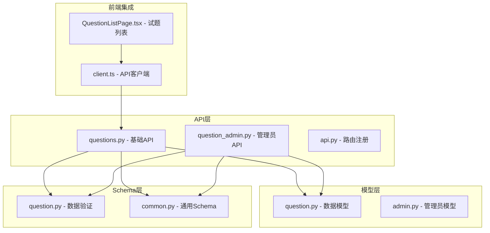
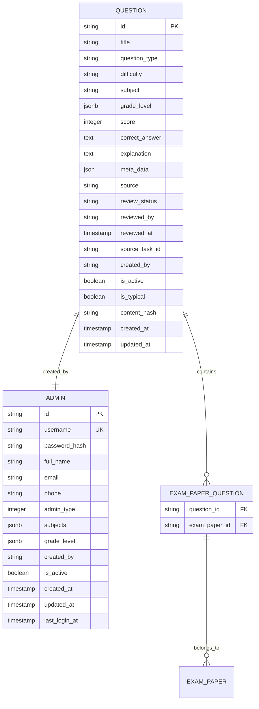
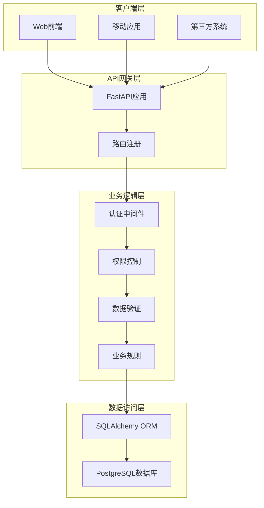
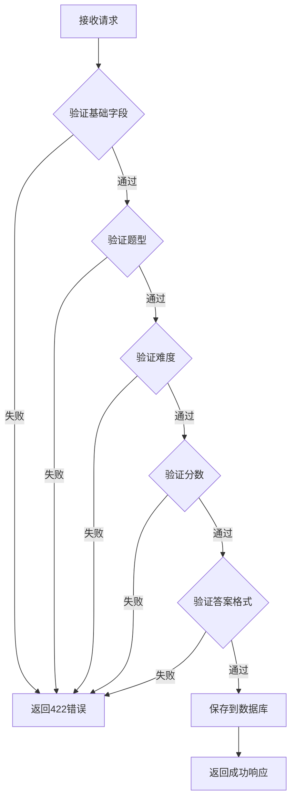
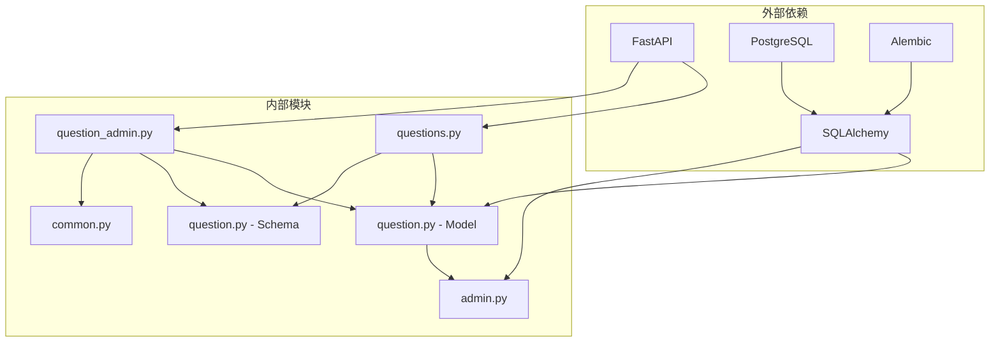

# 试题管理API

<cite>
**本文档引用的文件**
- [questions.py](file://backend/app/api/v1/endpoints/questions.py)
- [question_admin.py](file://backend/app/api/v1/endpoints/question_admin.py)
- [question.py](file://backend/app/models/question.py)
- [question.py](file://backend/app/schemas/question.py)
- [common.py](file://backend/app/schemas/common.py)
- [admin.py](file://backend/app/models/admin.py)
- [api.py](file://backend/app/api/v1/api.py)
- [client.ts](file://frontend/src/api/client.ts)
- [QuestionListPage.tsx](file://frontend/src/pages/questions/QuestionListPage.tsx)
</cite>

## 目录
1. [简介](#简介)
2. [项目结构](#项目结构)
3. [核心组件](#核心组件)
4. [架构概览](#架构概览)
5. [详细组件分析](#详细组件分析)
6. [依赖关系分析](#依赖关系分析)
7. [性能考虑](#性能考虑)
8. [故障排除指南](#故障排除指南)
9. [结论](#结论)

## 简介

本文件为试题管理系统提供的完整API文档，涵盖试题的CRUD操作、批量导入、分类管理、难度设置等功能接口。系统基于FastAPI构建，采用PostgreSQL数据库存储，支持多种题型、难度级别和学科分类。文档详细说明了试题数据结构、字段定义、验证规则和查询条件，并提供了完整的接口使用示例。

## 项目结构

后端采用模块化架构设计，主要包含以下核心模块：



**图表来源**
- [api.py:1-26](file://backend/app/api/v1/api.py#L1-L26)
- [questions.py:1-434](file://backend/app/api/v1/endpoints/questions.py#L1-L434)
- [question_admin.py:1-837](file://backend/app/api/v1/endpoints/question_admin.py#L1-L837)

**章节来源**
- [api.py:1-26](file://backend/app/api/v1/api.py#L1-L26)

## 核心组件

### 数据模型设计

系统采用PostgreSQL JSONB类型存储复杂的题目标识信息，支持灵活的查询和过滤：



**图表来源**
- [question.py:10-46](file://backend/app/models/question.py#L10-L46)
- [admin.py:9-27](file://backend/app/models/admin.py#L9-L27)

### 核心字段定义

| 字段名 | 类型 | 必填 | 默认值 | 描述 |
|--------|------|------|--------|------|
| id | String(36) | 是 | 自动生成 | 试题唯一标识符 |
| title | String(500) | 是 | 无 | 试题标题 |
| question_type | String(20) | 是 | 无 | 题型：SINGLE_CHOICE, MULTIPLE_CHOICE, FILL_BLANK, SUBJECTIVE |
| difficulty | String(10) | 是 | 无 | 难度：EASY, MEDIUM, HARD |
| subject | String(50) | 是 | 无 | 学科名称 |
| grade_level | JSONB | 否 | 无 | 年级信息，包含scope、grades、chapter、knowledge_points |
| score | Integer | 是 | 5 | 分值 |
| correct_answer | Text | 否 | 无 | 正确答案，支持多种格式 |
| explanation | Text | 否 | 无 | 解析说明 |
| meta_data | JSON | 否 | 无 | 元数据，如知识点列表 |
| source | String(20) | 是 | MANUAL | 来源：MANUAL, LLM_GENERATED, SCRAPED, OCR_UPLOAD |
| review_status | String(20) | 是 | APPROVED | 审核状态：APPROVED, PENDING, REJECTED, NEEDS_REVIEW |
| is_active | Boolean | 是 | True | 是否启用 |
| is_typical | Boolean | 是 | False | 是否为典型题 |
| content_hash | String(64) | 否 | 无 | 内容哈希值用于去重 |

**章节来源**
- [question.py:10-46](file://backend/app/models/question.py#L10-L46)

## 架构概览

系统采用分层架构设计，API层负责路由处理，业务逻辑层处理数据验证和业务规则，数据访问层负责数据库操作。



**图表来源**
- [api.py:1-26](file://backend/app/api/v1/api.py#L1-L26)
- [questions.py:17-36](file://backend/app/api/v1/endpoints/questions.py#L17-L36)

## 详细组件分析

### 基础API组件

#### 创建试题接口

**接口定义**
- 方法：POST
- 路径：`/api/v1/questions`
- 权限：TEACHER, QUESTION_ADMIN, SYS_ADMIN

**请求参数**
- title: 试题标题，字符串，最大长度200
- question_type: 题型，枚举值之一：SINGLE_CHOICE, MULTIPLE_CHOICE, FILL_BLANK, SUBJECTIVE
- difficulty: 难度，枚举值之一：EASY, MEDIUM, HARD
- subject: 学科，字符串，最大长度50
- grade_level: 年级信息，JSON对象
- score: 分值，整数，大于等于1
- correct_answer: 正确答案，支持字符串或复杂对象
- explanation: 解析说明，字符串
- knowledge_points: 知识点列表，字符串数组

**响应数据**
- 返回完整的试题信息，包括自动生成的ID、创建时间、审核状态等

**章节来源**
- [questions.py:17-36](file://backend/app/api/v1/endpoints/questions.py#L17-L36)
- [question.py:33-36](file://backend/app/schemas/question.py#L33-L36)

#### 查询试题接口

**接口定义**
- 方法：GET
- 路径：`/api/v1/questions`
- 权限：所有认证用户

**查询参数**
- skip: 跳过记录数，默认0
- limit: 每页数量，默认20，最大200
- subject: 学科筛选
- grade_level: 年级筛选
- grade: 具体年级筛选
- scope: 适用范围
- source: 来源筛选
- question_type: 题型筛选
- difficulty: 难度筛选
- review_status: 审核状态筛选
- is_typical: 是否典型题
- keyword: 关键词搜索

**响应格式**
```json
{
  "items": [...],
  "total": 0
}
```

**章节来源**
- [questions.py:366-434](file://backend/app/api/v1/endpoints/questions.py#L366-L434)

#### 搜索接口

**接口定义**
- 方法：GET
- 路径：`/api/v1/questions/search`
- 权限：所有认证用户

**搜索功能**
- 支持关键词在标题、章节、知识点中的模糊搜索
- 支持多条件组合筛选
- 返回总数和分页结果

**章节来源**
- [questions.py:39-104](file://backend/app/api/v1/endpoints/questions.py#L39-L104)

#### 批量导入接口

**接口定义**
- 方法：POST
- 路径：`/api/v1/questions/batch-import`
- 权限：TEACHER, QUESTION_ADMIN, SYS_ADMIN

**请求格式**
```json
[
  {
    "title": "题目标题",
    "question_type": "SINGLE_CHOICE",
    "difficulty": "MEDIUM",
    "subject": "数学",
    "grade_level": {...},
    "score": 5,
    "correct_answer": "...",
    "explanation": "...",
    "meta_data": {...}
  }
]
```

**限制**
- 最多导入200道试题
- 自动设置source为MANUAL，review_status为APPROVED

**章节来源**
- [questions.py:127-155](file://backend/app/api/v1/endpoints/questions.py#L127-L155)

#### 导出接口

**接口定义**
- 方法：GET/POST
- 路径：`/api/v1/questions/export`

**GET参数**
- subject: 学科
- grade_level: 年级
- question_type: 题型
- difficulty: 难度
- keyword: 关键词
- knowledge_point: 知识点
- limit: 数量限制，默认20，最大200

**POST请求**
- 导出指定ID的试题列表

**章节来源**
- [questions.py:158-214](file://backend/app/api/v1/endpoints/questions.py#L158-L214)

#### 典型题管理

**获取典型题**
- 路径：`/api/v1/questions/typical`
- 条件：is_typical=true, is_active=true, review_status="APPROVED"

**标记典型题**
- 路径：`/api/v1/questions/{question_id}/typical`
- 权限：TEACHER, QUESTION_ADMIN, SYS_ADMIN
- 参数：is_typical (布尔值)

**章节来源**
- [questions.py:227-273](file://backend/app/api/v1/endpoints/questions.py#L227-L273)

### 管理员API组件

#### LLM生成试题

**接口定义**
- 方法：POST
- 路径：`/api/v1/question-admin/generate`
- 权限：QUESTION_ADMIN, SYS_ADMIN

**参数**
- knowledge_point: 知识点
- difficulty: 难度
- question_type: 题型
- count: 数量，默认5，最多20
- subject: 学科，默认数学
- grade_level: 年级，默认G8

**响应**
- 返回生成的试题列表和任务ID
- 自动设置source为LLM_GENERATED，review_status为PENDING

**章节来源**
- [question_admin.py:138-218](file://backend/app/api/v1/endpoints/question_admin.py#L138-L218)

#### 审核管理

**待审核列表**
- 路径：`/api/v1/question-admin/pending`
- 权限：QUESTION_ADMIN, SYS_ADMIN, TEACHER

**批量审核**
- 路径：`/api/v1/question-admin/batch-approve`
- 路径：`/api/v1/question-admin/batch-reject`

**单个审核**
- 路径：`/api/v1/question-admin/{question_id}/approve`
- 路径：`/api/v1/question-admin/{question_id}/reject`

**章节来源**
- [question_admin.py:222-343](file://backend/app/api/v1/endpoints/question_admin.py#L222-L343)

#### 网络抓取

**接口定义**
- 方法：POST
- 路径：`/api/v1/question-admin/scrape`
- 权限：QUESTION_ADMIN, SYS_ADMIN

**功能**
- 从网络抓取试题
- 自动保存到数据库
- 设置source为SCRAPED，review_status为PENDING

**章节来源**
- [question_admin.py:417-474](file://backend/app/api/v1/endpoints/question_admin.py#L417-L474)

#### OCR识别

**图像识别**
- 路径：`/api/v1/question-admin/import-paper`
- 支持多模态模型识别试卷图片

**确认入库**
- 路径：`/api/v1/question-admin/import-confirm`
- 将识别结果保存为试题

**章节来源**
- [question_admin.py:561-727](file://backend/app/api/v1/endpoints/question_admin.py#L561-L727)

#### 去重功能

**简单去重**
- 路径：`/api/v1/question-admin/deduplicate`
- 基于标题前20字符进行分组

**智能去重**
- 路径：`/api/v1/question-admin/dedup`
- 使用content_hash进行精确匹配

**章节来源**
- [question_admin.py:498-797](file://backend/app/api/v1/endpoints/question_admin.py#L498-L797)

### 数据验证规则

系统采用Pydantic进行数据验证，确保数据完整性：



**图表来源**
- [question.py:10-31](file://backend/app/schemas/question.py#L10-L31)

**章节来源**
- [question.py:10-75](file://backend/app/schemas/question.py#L10-L75)

## 依赖关系分析

系统各组件之间的依赖关系如下：



**图表来源**
- [questions.py:1-12](file://backend/app/api/v1/endpoints/questions.py#L1-L12)
- [question_admin.py:1-16](file://backend/app/api/v1/endpoints/question_admin.py#L1-L16)

### 权限控制机制

系统采用基于角色的权限控制：

| 角色 | 可执行操作 |
|------|------------|
| TEACHER | 创建、编辑自己的试题，查看典型题 |
| QUESTION_ADMIN | 管理试题、审核、导入导出 |
| SYS_ADMIN | 系统管理、所有操作 |

**章节来源**
- [questions.py:23-300](file://backend/app/api/v1/endpoints/questions.py#L23-L300)
- [question_admin.py:30-343](file://backend/app/api/v1/endpoints/question_admin.py#L30-L343)

## 性能考虑

### 数据库优化

1. **索引策略**
   - subject字段建立索引
   - created_by字段建立索引
   - is_active和is_typical字段建立索引
   - content_hash字段建立索引用于去重

2. **查询优化**
   - 使用JSONB查询优化器
   - 限制查询结果数量（最大200条）
   - 分页查询避免全表扫描

3. **缓存策略**
   - 常用查询结果缓存
   - 知识点树结构缓存

### API性能

1. **批量操作**
   - 批量导入限制200条
   - 批量导出限制200条
   - 批量删除限制200条

2. **并发控制**
   - 异步数据库连接
   - 请求超时控制
   - 连接池管理

## 故障排除指南

### 常见错误及解决方案

**403 Forbidden**
- 检查用户权限是否足够
- 确认用户角色是否正确
- 验证是否为试题创建者

**404 Not Found**
- 检查试题ID是否正确
- 确认试题是否存在且启用
- 验证用户是否有权限访问

**422 Unprocessable Entity**
- 检查请求参数格式
- 验证必填字段是否完整
- 确认数据类型是否正确

**500 Internal Server Error**
- 检查数据库连接
- 验证模型定义
- 查看服务器日志

### 调试建议

1. **前端调试**
   - 使用浏览器开发者工具查看网络请求
   - 检查API响应格式
   - 验证权限令牌

2. **后端调试**
   - 查看FastAPI日志
   - 检查SQLAlchemy查询
   - 验证数据验证规则

**章节来源**
- [questions.py:285-347](file://backend/app/api/v1/endpoints/questions.py#L285-L347)

## 结论

本API文档详细介绍了试题管理系统的完整功能，包括基础CRUD操作、高级管理功能、数据验证和权限控制。系统采用现代化的技术栈，具有良好的扩展性和维护性。通过合理的数据模型设计和严格的验证机制，确保了数据的一致性和完整性。

建议在实际使用中：
1. 优先使用批量操作提高效率
2. 合理设置查询条件减少数据传输
3. 定期清理无效数据保持系统性能
4. 建立完善的监控和日志体系