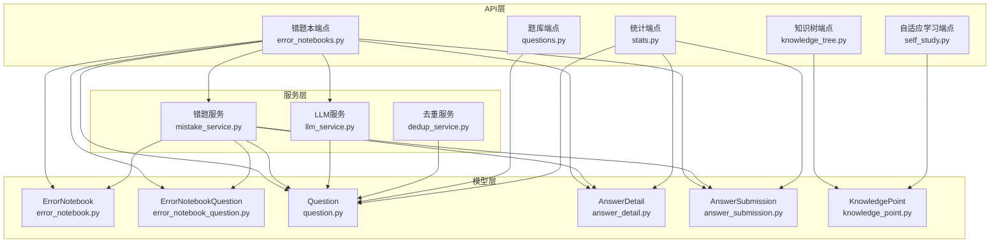
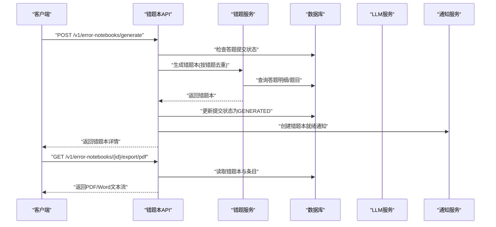
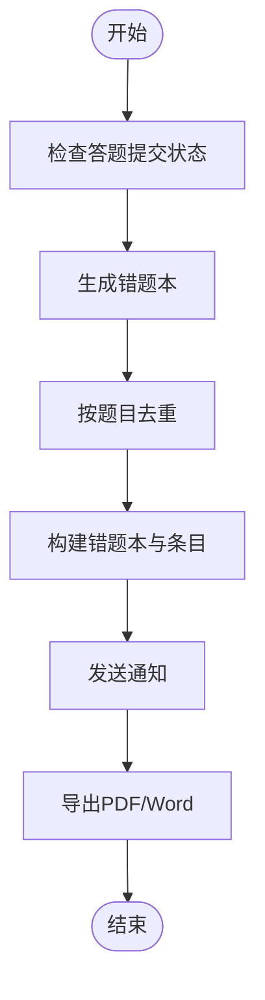
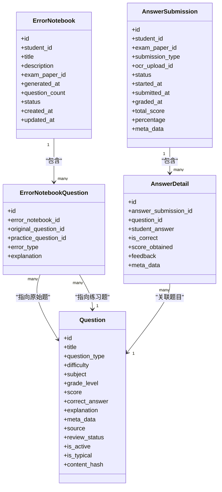
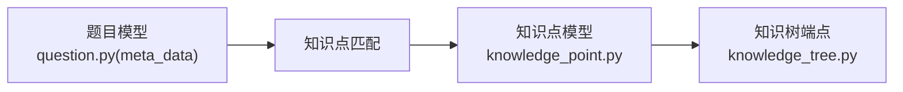
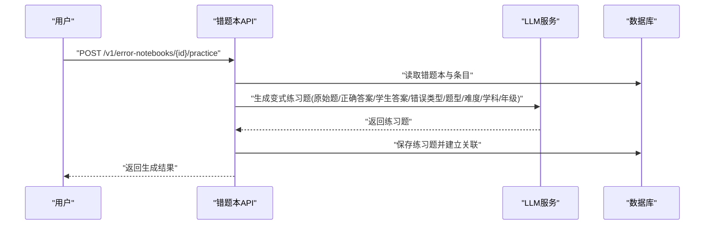
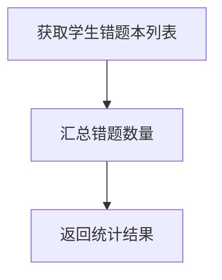
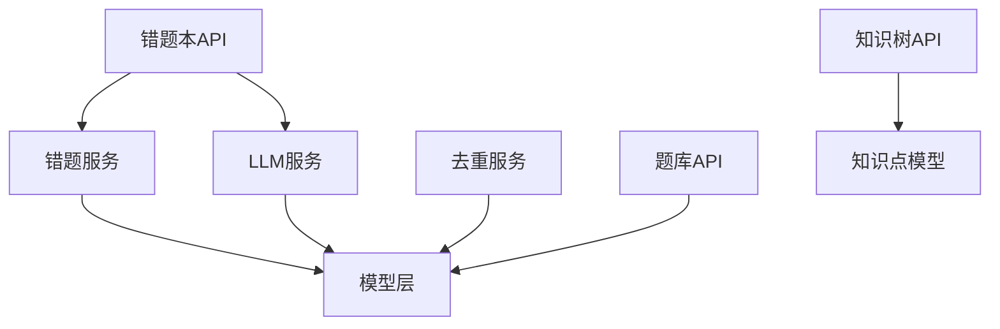

# 错题本API

<cite>
**本文引用的文件列表**
- [backend/app/api/v1/endpoints/error_notebooks.py](file://backend/app/api/v1/endpoints/error_notebooks.py)
- [backend/app/models/error_notebook.py](file://backend/app/models/error_notebook.py)
- [backend/app/models/error_notebook_question.py](file://backend/app/models/error_notebook_question.py)
- [backend/app/models/question.py](file://backend/app/models/question.py)
- [backend/app/models/answer_detail.py](file://backend/app/models/answer_detail.py)
- [backend/app/models/answer_submission.py](file://backend/app/models/answer_submission.py)
- [backend/app/schemas/error_notebook.py](file://backend/app/schemas/error_notebook.py)
- [backend/app/services/mistake_service.py](file://backend/app/services/mistake_service.py)
- [backend/app/services/llm_service.py](file://backend/app/services/llm_service.py)
- [backend/app/api/v1/endpoints/questions.py](file://backend/app/api/v1/endpoints/questions.py)
- [backend/app/api/v1/endpoints/stats.py](file://backend/app/api/v1/endpoints/stats.py)
- [backend/app/api/v1/endpoints/knowledge_tree.py](file://backend/app/api/v1/endpoints/knowledge_tree.py)
- [backend/app/models/knowledge_point.py](file://backend/app/models/knowledge_point.py)
- [backend/app/api/v1/endpoints/self_study.py](file://backend/app/api/v1/endpoints/self_study.py)
- [backend/app/services/dedup_service.py](file://backend/app/services/dedup_service.py)
</cite>

## 目录
1. [简介](#简介)
2. [项目结构](#项目结构)
3. [核心组件](#核心组件)
4. [架构总览](#架构总览)
5. [详细组件分析](#详细组件分析)
6. [依赖分析](#依赖分析)
7. [性能考量](#性能考量)
8. [故障排查指南](#故障排查指南)
9. [结论](#结论)
10. [附录](#附录)

## 简介
本文件为“错题本系统”的完整API文档，聚焦于错题收集、分类管理、复习提醒、知识点关联、重复题处理、知识点匹配算法、学习建议生成、统计与分析、个性化推荐以及数据导出与同步等能力。文档以接口定义、数据模型、处理流程与依赖关系为主线，辅以图示帮助读者快速理解系统设计与使用方式。

## 项目结构
后端采用FastAPI + SQLAlchemy异步ORM，按“API层-服务层-模型层-Schema层”分层组织；错题本相关的核心模块包括：
- API端点：错题本生成、查询、删除、练习题生成、导出、统计等
- 服务层：错题本生成逻辑、LLM练习题生成、重复题处理（SimHash）
- 模型层：错题本、错题条目、题目、答题明细、答题提交等
- Schema层：响应与请求的数据结构定义

图表来源
- [backend/app/api/v1/endpoints/error_notebooks.py:1-437](file://backend/app/api/v1/endpoints/error_notebooks.py#L1-L437)
- [backend/app/services/mistake_service.py:1-114](file://backend/app/services/mistake_service.py#L1-L114)
- [backend/app/services/llm_service.py:1-350](file://backend/app/services/llm_service.py#L1-L350)
- [backend/app/models/error_notebook.py:1-32](file://backend/app/models/error_notebook.py#L1-L32)
- [backend/app/models/error_notebook_question.py:1-29](file://backend/app/models/error_notebook_question.py#L1-L29)
- [backend/app/models/question.py:1-46](file://backend/app/models/question.py#L1-L46)
- [backend/app/models/answer_detail.py:1-33](file://backend/app/models/answer_detail.py#L1-L33)
- [backend/app/models/answer_submission.py:1-37](file://backend/app/models/answer_submission.py#L1-L37)
- [backend/app/models/knowledge_point.py:1-27](file://backend/app/models/knowledge_point.py#L1-L27)

章节来源
- [backend/app/api/v1/endpoints/error_notebooks.py:1-437](file://backend/app/api/v1/endpoints/error_notebooks.py#L1-L437)
- [backend/app/models/error_notebook.py:1-32](file://backend/app/models/error_notebook.py#L1-L32)
- [backend/app/models/error_notebook_question.py:1-29](file://backend/app/models/error_notebook_question.py#L1-L29)
- [backend/app/models/question.py:1-46](file://backend/app/models/question.py#L1-L46)
- [backend/app/models/answer_detail.py:1-33](file://backend/app/models/answer_detail.py#L1-L33)
- [backend/app/models/answer_submission.py:1-37](file://backend/app/models/answer_submission.py#L1-L37)
- [backend/app/services/mistake_service.py:1-114](file://backend/app/services/mistake_service.py#L1-L114)
- [backend/app/services/llm_service.py:1-350](file://backend/app/services/llm_service.py#L1-L350)
- [backend/app/api/v1/endpoints/questions.py:1-434](file://backend/app/api/v1/endpoints/questions.py#L1-L434)
- [backend/app/api/v1/endpoints/stats.py:1-251](file://backend/app/api/v1/endpoints/stats.py#L1-L251)
- [backend/app/api/v1/endpoints/knowledge_tree.py:1-357](file://backend/app/api/v1/endpoints/knowledge_tree.py#L1-L357)
- [backend/app/models/knowledge_point.py:1-27](file://backend/app/models/knowledge_point.py#L1-L27)
- [backend/app/api/v1/endpoints/self_study.py:1-390](file://backend/app/api/v1/endpoints/self_study.py#L1-L390)
- [backend/app/services/dedup_service.py:1-127](file://backend/app/services/dedup_service.py#L1-L127)

## 核心组件
- 错题本模型：存储学生错题集合、标题、描述、所属试卷、生成时间、问题数量、状态等
- 错题条目模型：记录错题本中的具体错题、原始题、强化练习题、错误类型、解释等
- 题目模型：承载题目信息、类型、难度、学科、评分、正确答案、解析、元数据等
- 答题明细与提交：记录答题提交、学生答案、是否正确、得分、反馈等
- 错题服务：从答题明细中筛选错题、去重、生成错题本、标注错误类型
- LLM服务：基于错题生成强化练习题
- 去重服务：基于SimHash的文本相似度检测与重复题识别
- 统计与知识树：提供班级/个人统计、知识树结构与版本管理

章节来源
- [backend/app/models/error_notebook.py:1-32](file://backend/app/models/error_notebook.py#L1-L32)
- [backend/app/models/error_notebook_question.py:1-29](file://backend/app/models/error_notebook_question.py#L1-L29)
- [backend/app/models/question.py:1-46](file://backend/app/models/question.py#L1-L46)
- [backend/app/models/answer_detail.py:1-33](file://backend/app/models/answer_detail.py#L1-L33)
- [backend/app/models/answer_submission.py:1-37](file://backend/app/models/answer_submission.py#L1-L37)
- [backend/app/services/mistake_service.py:1-114](file://backend/app/services/mistake_service.py#L1-L114)
- [backend/app/services/llm_service.py:1-350](file://backend/app/services/llm_service.py#L1-L350)
- [backend/app/services/dedup_service.py:1-127](file://backend/app/services/dedup_service.py#L1-L127)

## 架构总览
下图展示错题本生成与导出的关键调用链路，涵盖鉴权、服务层处理、数据库交互与通知机制。

图表来源
- [backend/app/api/v1/endpoints/error_notebooks.py:22-59](file://backend/app/api/v1/endpoints/error_notebooks.py#L22-L59)
- [backend/app/services/mistake_service.py:13-75](file://backend/app/services/mistake_service.py#L13-L75)
- [backend/app/services/llm_service.py:227-260](file://backend/app/services/llm_service.py#L227-L260)

章节来源
- [backend/app/api/v1/endpoints/error_notebooks.py:22-59](file://backend/app/api/v1/endpoints/error_notebooks.py#L22-L59)
- [backend/app/services/mistake_service.py:13-75](file://backend/app/services/mistake_service.py#L13-L75)

## 详细组件分析

### 错题本生成与管理
- 接口
  - 生成错题本：POST /v1/error-notebooks/generate
  - 获取错题本：GET /v1/error-notebooks/{notebook_id}
  - 查询学生错题本：GET /v1/error-notebooks/student/{student_id}
  - 删除错题本：DELETE /v1/error-notebooks/{notebook_id}
  - 批量生成练习题：POST /v1/error-notebooks/{notebook_id}/practice
  - 导出为PDF/Word：GET /v1/error-notebooks/{notebook_id}/export/pdf | /export/word
  - 手动录入错题：POST /v1/error-notebooks/manual-entry
  - 统计接口：GET /v1/error-notebooks/stats/student/{student_id} | /stats/class/{class_id}

- 数据模型
  - 错题本：包含学生ID、标题、描述、所属试卷、生成时间、问题数、状态等
  - 错题条目：包含原始题、强化练习题、错误类型、解释等
  - 题目：包含类型、难度、学科、评分、正确答案、解析、元数据等
  - 答题明细与提交：包含学生答案、是否正确、得分、反馈等

- 处理逻辑
  - 生成错题本：从答题明细中筛选错题，按题目维度去重，构建错题本与条目，并标注错误类型
  - 生成练习题：调用LLM服务，基于原始题、正确答案、学生答案、错误类型、题型、难度、学科、年级生成变式题
  - 导出：读取错题本条目与原始题，拼装文本内容并以PDF/Word形式返回

图表来源
- [backend/app/api/v1/endpoints/error_notebooks.py:22-59](file://backend/app/api/v1/endpoints/error_notebooks.py#L22-L59)
- [backend/app/services/mistake_service.py:13-75](file://backend/app/services/mistake_service.py#L13-L75)

章节来源
- [backend/app/api/v1/endpoints/error_notebooks.py:22-437](file://backend/app/api/v1/endpoints/error_notebooks.py#L22-L437)
- [backend/app/models/error_notebook.py:1-32](file://backend/app/models/error_notebook.py#L1-L32)
- [backend/app/models/error_notebook_question.py:1-29](file://backend/app/models/error_notebook_question.py#L1-L29)
- [backend/app/models/question.py:1-46](file://backend/app/models/question.py#L1-L46)
- [backend/app/models/answer_detail.py:1-33](file://backend/app/models/answer_detail.py#L1-L33)
- [backend/app/models/answer_submission.py:1-37](file://backend/app/models/answer_submission.py#L1-L37)
- [backend/app/services/mistake_service.py:13-114](file://backend/app/services/mistake_service.py#L13-L114)
- [backend/app/services/llm_service.py:227-317](file://backend/app/services/llm_service.py#L227-L317)

### 错题数据结构与重复题处理
- 错题数据结构
  - 错题本：id、student_id、title、description、exam_paper_id、generated_at、question_count、status、created_at、updated_at、questions[]
  - 错题条目：id、error_notebook_id、original_question_id、practice_question_id、error_type、explanation、question_title、correct_answer、student_answer、practice_question
  - 题目：id、title、question_type、difficulty、subject、grade_level、score、correct_answer、explanation、meta_data、source、review_status、is_active、is_typical、content_hash
  - 答题明细：id、answer_submission_id、question_id、student_answer、is_correct、score_obtained、feedback、meta_data
  - 答题提交：id、student_id、exam_paper_id、submission_type、ocr_upload_id、status、started_at、submitted_at、graded_at、total_score、percentage、meta_data

- 重复题处理
  - 生成错题本时按题目维度去重，避免同一题多次出现
  - 去重服务提供SimHash文本指纹计算与哈明距离比较，支持近似重复检测

图表来源
- [backend/app/models/error_notebook.py:1-32](file://backend/app/models/error_notebook.py#L1-L32)
- [backend/app/models/error_notebook_question.py:1-29](file://backend/app/models/error_notebook_question.py#L1-L29)
- [backend/app/models/question.py:1-46](file://backend/app/models/question.py#L1-L46)
- [backend/app/models/answer_detail.py:1-33](file://backend/app/models/answer_detail.py#L1-L33)
- [backend/app/models/answer_submission.py:1-37](file://backend/app/models/answer_submission.py#L1-L37)

章节来源
- [backend/app/schemas/error_notebook.py:1-57](file://backend/app/schemas/error_notebook.py#L1-L57)
- [backend/app/services/mistake_service.py:38-44](file://backend/app/services/mistake_service.py#L38-L44)
- [backend/app/services/dedup_service.py:25-52](file://backend/app/services/dedup_service.py#L25-L52)

### 知识点关联与匹配算法
- 知识点模型：包含code、name、description、parent_id、subject、grade_level、difficulty_level等
- 知识树端点：提供考纲版本树的查询、节点增删改、版本回滚、版本列表等
- 题目元数据：题目模型的meta_data字段用于承载知识点列表，便于后续匹配与统计

图表来源
- [backend/app/models/knowledge_point.py:1-27](file://backend/app/models/knowledge_point.py#L1-L27)
- [backend/app/api/v1/endpoints/knowledge_tree.py:37-64](file://backend/app/api/v1/endpoints/knowledge_tree.py#L37-L64)
- [backend/app/models/question.py:18-22](file://backend/app/models/question.py#L18-L22)

章节来源
- [backend/app/models/knowledge_point.py:1-27](file://backend/app/models/knowledge_point.py#L1-L27)
- [backend/app/api/v1/endpoints/knowledge_tree.py:1-357](file://backend/app/api/v1/endpoints/knowledge_tree.py#L1-L357)
- [backend/app/models/question.py:1-46](file://backend/app/models/question.py#L1-L46)

### 学习建议生成与个性化推荐
- 建议生成：基于错题条目中的错误类型、原始题、正确答案、学生答案、题型、难度、学科、年级，调用LLM生成变式练习题
- 个性化推荐：结合知识点树与题目元数据，实现按知识点、难度、题型的组合推荐

图表来源
- [backend/app/api/v1/endpoints/error_notebooks.py:199-313](file://backend/app/api/v1/endpoints/error_notebooks.py#L199-L313)
- [backend/app/services/llm_service.py:227-317](file://backend/app/services/llm_service.py#L227-L317)

章节来源
- [backend/app/api/v1/endpoints/error_notebooks.py:199-313](file://backend/app/api/v1/endpoints/error_notebooks.py#L199-L313)
- [backend/app/services/llm_service.py:194-260](file://backend/app/services/llm_service.py#L194-L260)

### 错题本统计与学习轨迹分析
- 统计端点：提供按试卷、按题目、按整体的统计视图，包含正确率、作答分布等
- 学生/班级统计：查询学生错题总数、错题本数量等

图表来源
- [backend/app/api/v1/endpoints/error_notebooks.py:362-375](file://backend/app/api/v1/endpoints/error_notebooks.py#L362-L375)

章节来源
- [backend/app/api/v1/endpoints/stats.py:1-251](file://backend/app/api/v1/endpoints/stats.py#L1-L251)
- [backend/app/api/v1/endpoints/error_notebooks.py:362-375](file://backend/app/api/v1/endpoints/error_notebooks.py#L362-L375)

### 数据导出与同步
- 导出接口：支持PDF/Word文本导出，返回带错题本标题、生成时间、条目列表的文本内容
- 同步接口：预留数据同步与训练接口（当前为未实现）

章节来源
- [backend/app/api/v1/endpoints/error_notebooks.py:315-360](file://backend/app/api/v1/endpoints/error_notebooks.py#L315-L360)
- [backend/app/api/v1/endpoints/self_study.py:355-390](file://backend/app/api/v1/endpoints/self_study.py#L355-L390)

## 依赖分析
- API对服务层的依赖：错题本API依赖错题服务与LLM服务完成生成与练习题创建
- 服务层对模型层的依赖：错题服务依赖答题明细、答题提交、题目模型进行数据抽取与去重
- 去重服务独立于业务流程，提供SimHash相似度计算能力
- 知识点树与题库端点为错题本提供知识点与题目基础数据支撑

图表来源
- [backend/app/api/v1/endpoints/error_notebooks.py:1-437](file://backend/app/api/v1/endpoints/error_notebooks.py#L1-L437)
- [backend/app/services/mistake_service.py:1-114](file://backend/app/services/mistake_service.py#L1-L114)
- [backend/app/services/llm_service.py:1-350](file://backend/app/services/llm_service.py#L1-L350)
- [backend/app/services/dedup_service.py:1-127](file://backend/app/services/dedup_service.py#L1-L127)
- [backend/app/api/v1/endpoints/questions.py:1-434](file://backend/app/api/v1/endpoints/questions.py#L1-L434)
- [backend/app/api/v1/endpoints/knowledge_tree.py:1-357](file://backend/app/api/v1/endpoints/knowledge_tree.py#L1-L357)
- [backend/app/models/knowledge_point.py:1-27](file://backend/app/models/knowledge_point.py#L1-L27)

章节来源
- [backend/app/api/v1/endpoints/error_notebooks.py:1-437](file://backend/app/api/v1/endpoints/error_notebooks.py#L1-L437)
- [backend/app/services/mistake_service.py:1-114](file://backend/app/services/mistake_service.py#L1-L114)
- [backend/app/services/llm_service.py:1-350](file://backend/app/services/llm_service.py#L1-L350)
- [backend/app/services/dedup_service.py:1-127](file://backend/app/services/dedup_service.py#L1-L127)
- [backend/app/api/v1/endpoints/questions.py:1-434](file://backend/app/api/v1/endpoints/questions.py#L1-L434)
- [backend/app/api/v1/endpoints/knowledge_tree.py:1-357](file://backend/app/api/v1/endpoints/knowledge_tree.py#L1-L357)
- [backend/app/models/knowledge_point.py:1-27](file://backend/app/models/knowledge_point.py#L1-L27)

## 性能考量
- 查询优化：错题本查询使用selectinload加载关联条目，减少N+1查询；导出接口按需读取条目与题目
- 去重策略：生成阶段按题目维度去重，降低重复题对统计与练习的影响
- LLM调用：练习题生成采用异步HTTP调用，设置超时与错误处理，避免阻塞主线程
- 分页与限制：题库搜索与导出接口限制最大返回条数，防止大查询导致资源耗尽

## 故障排查指南
- 权限错误：接口对用户类型有限制（如仅学生可用、教师/管理员可用），请确认当前登录身份
- 资源不存在：错题本/题目/提交等资源不存在时会返回404，请检查ID或关联关系
- 提交状态异常：若答题提交状态为GENERATED，需先修改状态再重新生成错题本
- LLM不可达：练习题生成依赖外部LLM服务，若连接失败请检查配置与网络
- 导出异常：导出接口返回文本流，请确保客户端正确处理Content-Disposition与媒体类型

章节来源
- [backend/app/api/v1/endpoints/error_notebooks.py:28-58](file://backend/app/api/v1/endpoints/error_notebooks.py#L28-L58)
- [backend/app/api/v1/endpoints/error_notebooks.py:158-196](file://backend/app/api/v1/endpoints/error_notebooks.py#L158-L196)
- [backend/app/services/llm_service.py:80-103](file://backend/app/services/llm_service.py#L80-L103)

## 结论
本API围绕“错题本”这一核心实体，打通了从答题数据到错题本生成、练习题生成、知识点关联、统计分析与导出的全链路。通过服务层抽象与模型层约束，系统在保证数据一致性的同时提供了良好的扩展性。未来可在知识点提取、个性化推荐、数据同步等方面持续增强。

## 附录
- 常用过滤条件
  - 错题本：按学生ID、日期范围、所属试卷
  - 题库：按学科、难度、题型、关键字、知识点等
- 关键字搜索：支持题目标题、章节、知识点字段模糊匹配
- 版本控制：知识树支持版本创建、回滚与版本列表查看

章节来源
- [backend/app/api/v1/endpoints/error_notebooks.py:157-177](file://backend/app/api/v1/endpoints/error_notebooks.py#L157-L177)
- [backend/app/api/v1/endpoints/questions.py:39-104](file://backend/app/api/v1/endpoints/questions.py#L39-L104)
- [backend/app/api/v1/endpoints/knowledge_tree.py:199-357](file://backend/app/api/v1/endpoints/knowledge_tree.py#L199-L357)