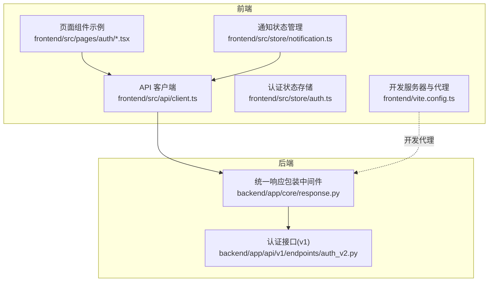
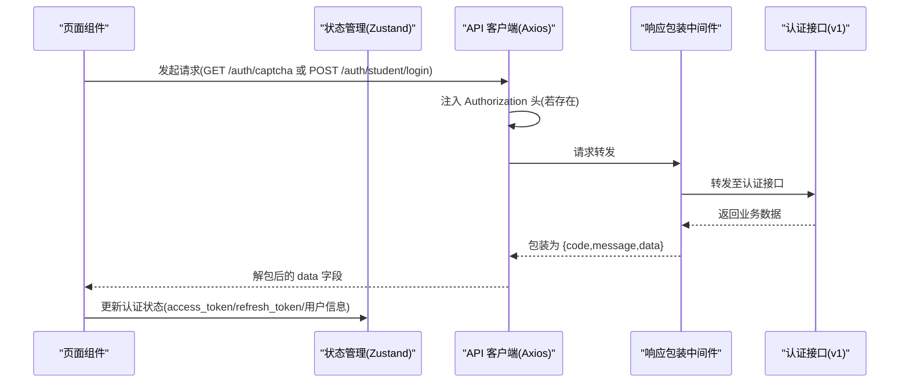
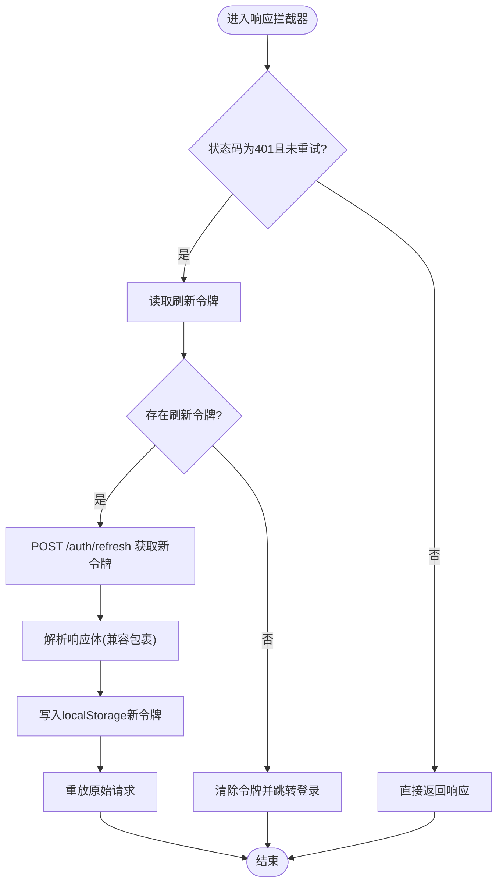
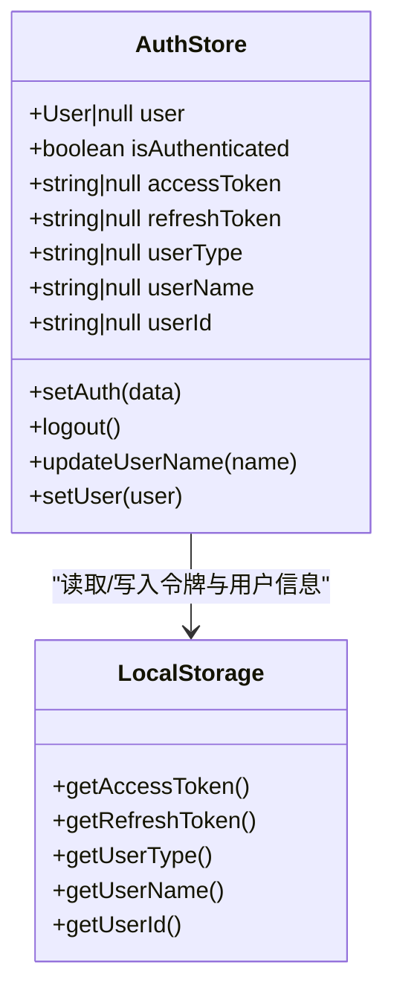
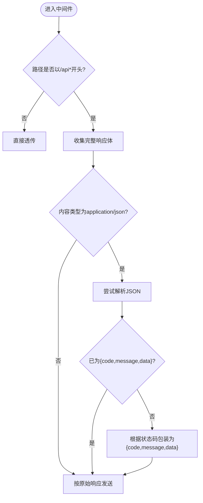
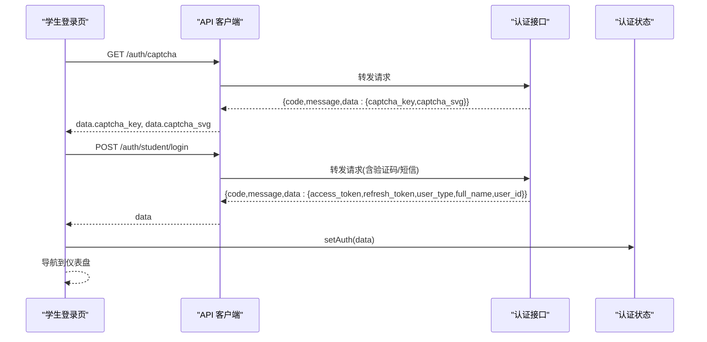
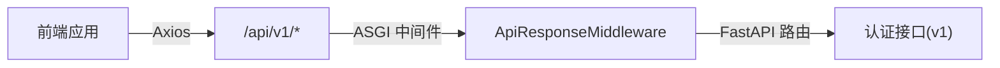

# API集成

<cite>
**本文引用的文件**
- [frontend/src/api/client.ts](file://frontend/src/api/client.ts)
- [frontend/src/store/auth.ts](file://frontend/src/store/auth.ts)
- [frontend/src/pages/auth/LoginPage.tsx](file://frontend/src/pages/auth/LoginPage.tsx)
- [frontend/src/pages/auth/AdminLoginPage.tsx](file://frontend/src/pages/auth/AdminLoginPage.tsx)
- [frontend/src/pages/auth/ProfilePage.tsx](file://frontend/src/pages/auth/ProfilePage.tsx)
- [frontend/src/store/notification.ts](file://frontend/src/store/notification.ts)
- [frontend/vite.config.ts](file://frontend/vite.config.ts)
- [backend/app/core/response.py](file://backend/app/core/response.py)
- [backend/app/api/v1/endpoints/auth_v2.py](file://backend/app/api/v1/endpoints/auth_v2.py)
</cite>

## 目录
1. [简介](#简介)
2. [项目结构](#项目结构)
3. [核心组件](#核心组件)
4. [架构总览](#架构总览)
5. [详细组件分析](#详细组件分析)
6. [依赖分析](#依赖分析)
7. [性能考虑](#性能考虑)
8. [故障排查指南](#故障排查指南)
9. [结论](#结论)
10. [附录](#附录)

## 简介
本文件面向“瑞珹教育管理系统”的前端工程师与后端对接人员，系统化地文档化基于 Axios 的 API 客户端配置、请求与响应拦截器、认证令牌管理、错误处理策略、重试机制与超时配置，并给出统一的数据包装格式、API 调用模式、数据转换、缓存策略与离线处理建议。同时提供可扩展的设计思路、Mock 数据支持与开发调试工具，以及最佳实践与性能优化建议。

## 项目结构
前端采用 React + Vite 架构，API 客户端集中于单点配置并通过拦截器统一处理认证与响应包装；后端通过中间件统一输出标准响应格式，前端在拦截器中自动解包，简化各业务模块的数据处理逻辑。

图表来源
- [frontend/src/api/client.ts:1-55](file://frontend/src/api/client.ts#L1-L55)
- [frontend/src/store/auth.ts:1-96](file://frontend/src/store/auth.ts#L1-L96)
- [frontend/src/pages/auth/LoginPage.tsx:1-217](file://frontend/src/pages/auth/LoginPage.tsx#L1-L217)
- [frontend/src/store/notification.ts:1-80](file://frontend/src/store/notification.ts#L1-L80)
- [frontend/vite.config.ts:1-17](file://frontend/vite.config.ts#L1-L17)
- [backend/app/core/response.py:1-124](file://backend/app/core/response.py#L1-L124)
- [backend/app/api/v1/endpoints/auth_v2.py:1-476](file://backend/app/api/v1/endpoints/auth_v2.py#L1-L476)

章节来源
- [frontend/src/api/client.ts:1-55](file://frontend/src/api/client.ts#L1-L55)
- [frontend/vite.config.ts:1-17](file://frontend/vite.config.ts#L1-L17)
- [backend/app/core/response.py:1-124](file://backend/app/core/response.py#L1-L124)

## 核心组件
- Axios API 客户端：集中配置基础地址、通用请求头、请求/响应拦截器。
- 认证状态存储：Zustand 状态管理，封装访问令牌、刷新令牌与用户信息的读取与持久化。
- 页面与状态管理：登录页、管理员登录页、个人资料页、通知状态管理等使用统一客户端发起请求。
- 后端统一响应包装：所有 /api* 响应自动包裹为 {code, message, data} 结构，便于前端统一处理。

章节来源
- [frontend/src/api/client.ts:1-55](file://frontend/src/api/client.ts#L1-L55)
- [frontend/src/store/auth.ts:1-96](file://frontend/src/store/auth.ts#L1-L96)
- [frontend/src/pages/auth/LoginPage.tsx:1-217](file://frontend/src/pages/auth/LoginPage.tsx#L1-L217)
- [frontend/src/pages/auth/AdminLoginPage.tsx:1-171](file://frontend/src/pages/auth/AdminLoginPage.tsx#L1-L171)
- [frontend/src/pages/auth/ProfilePage.tsx:1-200](file://frontend/src/pages/auth/ProfilePage.tsx#L1-L200)
- [frontend/src/store/notification.ts:1-80](file://frontend/src/store/notification.ts#L1-L80)
- [backend/app/core/response.py:1-124](file://backend/app/core/response.py#L1-L124)

## 架构总览
下图展示从前端页面到 API 客户端、后端中间件与认证接口的整体调用链路与数据流。

图表来源
- [frontend/src/api/client.ts:9-52](file://frontend/src/api/client.ts#L9-L52)
- [frontend/src/store/auth.ts:47-95](file://frontend/src/store/auth.ts#L47-L95)
- [backend/app/core/response.py:20-101](file://backend/app/core/response.py#L20-L101)
- [backend/app/api/v1/endpoints/auth_v2.py:75-237](file://backend/app/api/v1/endpoints/auth_v2.py#L75-L237)

## 详细组件分析

### API 客户端与拦截器
- 基础配置
  - 基础路径：/api/v1
  - Content-Type：application/json
- 请求拦截器
  - 从本地存储读取访问令牌并在请求头注入 Authorization: Bearer {token}
- 响应拦截器
  - 自动解包后端统一响应包装 {code, message, data}，仅返回 data 字段
  - 对 401 且未重试过的请求，尝试使用刷新令牌换取新的访问令牌并重放原请求
  - 刷新失败则清理本地令牌并跳转登录页

图表来源
- [frontend/src/api/client.ts:17-52](file://frontend/src/api/client.ts#L17-L52)

章节来源
- [frontend/src/api/client.ts:1-55](file://frontend/src/api/client.ts#L1-L55)

### 认证状态管理
- 本地存储键值：access_token、refresh_token、user_type、user_name、user_id
- 非 React 上下文（如拦截器）通过独立方法读取令牌与用户信息
- Zustand 状态包含用户对象、认证态、令牌与用户信息字段，提供 setAuth、logout、updateUserName、setUser 方法
- 登录成功后写入本地存储并同步到状态，退出登录时清空本地存储并重置状态

图表来源
- [frontend/src/store/auth.ts:47-95](file://frontend/src/store/auth.ts#L47-L95)
- [frontend/src/store/auth.ts:9-14](file://frontend/src/store/auth.ts#L9-L14)

章节来源
- [frontend/src/store/auth.ts:1-96](file://frontend/src/store/auth.ts#L1-L96)

### 统一响应包装中间件
- 仅对 /api* 路径生效
- 将非包裹响应包装为 {code,message,data}，错误状态码映射为 detail
- 若响应体已是 {code,message,data} 则透传
- 异常情况下返回标准化 500 包裹

图表来源
- [backend/app/core/response.py:20-101](file://backend/app/core/response.py#L20-L101)

章节来源
- [backend/app/core/response.py:1-124](file://backend/app/core/response.py#L1-L124)

### API 调用模式与数据转换
- 登录流程（学生）
  - 步骤：获取图形验证码 → 发送短信验证码 → 登录获取令牌 → 写入状态并跳转
  - 客户端：GET /auth/captcha、POST /auth/student/login
  - 前端：解包 data 后 setAuth 并导航
- 管理员登录（分步）
  - 步骤：身份验证 → 获取短信验证码 → 登录获取令牌 → 导航到对应后台页
  - 客户端：POST /auth/admin/verify、POST /auth/admin/login
- 个人资料
  - GET /auth/profile 获取资料；PUT /auth/profile 更新；PUT /auth/profile/phone 修改手机号
- 通知
  - GET /notifications 获取列表；POST /notifications/{id}/read 标记已读；POST /notifications/read-all 全部已读；GET /notifications/count/unread 未读计数

图表来源
- [frontend/src/pages/auth/LoginPage.tsx:33-71](file://frontend/src/pages/auth/LoginPage.tsx#L33-L71)
- [frontend/src/api/client.ts:17-25](file://frontend/src/api/client.ts#L17-L25)
- [backend/app/api/v1/endpoints/auth_v2.py:188-209](file://backend/app/api/v1/endpoints/auth_v2.py#L188-L209)

章节来源
- [frontend/src/pages/auth/LoginPage.tsx:1-217](file://frontend/src/pages/auth/LoginPage.tsx#L1-L217)
- [frontend/src/pages/auth/AdminLoginPage.tsx:1-171](file://frontend/src/pages/auth/AdminLoginPage.tsx#L1-L171)
- [frontend/src/pages/auth/ProfilePage.tsx:1-200](file://frontend/src/pages/auth/ProfilePage.tsx#L1-L200)
- [frontend/src/store/notification.ts:1-80](file://frontend/src/store/notification.ts#L1-L80)
- [backend/app/api/v1/endpoints/auth_v2.py:75-237](file://backend/app/api/v1/endpoints/auth_v2.py#L75-L237)

### 错误处理策略
- 前端
  - 响应拦截器：401 无重试时触发刷新令牌流程；刷新失败则清理令牌并跳转登录
  - 页面层：捕获异常，优先显示后端返回的 detail，兜底为通用错误提示
- 后端
  - 中间件：统一包装错误响应；异常时返回 500 包裹

章节来源
- [frontend/src/api/client.ts:26-50](file://frontend/src/api/client.ts#L26-L50)
- [frontend/src/pages/auth/LoginPage.tsx:58-70](file://frontend/src/pages/auth/LoginPage.tsx#L58-L70)
- [backend/app/core/response.py:70-100](file://backend/app/core/response.py#L70-L100)

### 重试机制与超时配置
- 重试机制
  - 401 且未重试过的请求会自动刷新令牌并重放原请求
- 超时配置
  - 当前客户端未显式设置超时参数；可在 axios.create 中增加 timeout 以提升健壮性

章节来源
- [frontend/src/api/client.ts:28-42](file://frontend/src/api/client.ts#L28-L42)

### 缓存策略与离线处理
- 缓存策略
  - 建议：对只读列表与静态参考数据使用内存缓存；对需要一致性的数据避免缓存或加入版本/ETag校验
- 离线处理
  - 建议：结合浏览器离线能力与本地存储，对写操作进行队列化与重放；读操作在离线时返回缓存或提示网络异常

说明：当前仓库未见专门的缓存与离线实现，以上为通用建议。

### Mock 数据支持与开发调试
- 开发代理
  - Vite 代理将 /api* 请求转发至本地后端服务，便于前后端联调
- Mock 数据
  - 建议：在开发环境引入轻量 Mock（如 MSW 或简单拦截），用于快速迭代与边界场景测试

章节来源
- [frontend/vite.config.ts:6-14](file://frontend/vite.config.ts#L6-L14)

## 依赖分析
- 前端依赖
  - axios：HTTP 客户端
  - zustand：轻量状态管理
  - react/react-router-dom/antd：UI 与路由
- 后端依赖
  - FastAPI + Starlette：ASGI 应用
  - SQLAlchemy：异步数据库访问
  - jose：JWT 加解密

图表来源
- [frontend/src/api/client.ts:4-7](file://frontend/src/api/client.ts#L4-L7)
- [backend/app/core/response.py:14-101](file://backend/app/core/response.py#L14-L101)
- [backend/app/api/v1/endpoints/auth_v2.py:21-476](file://backend/app/api/v1/endpoints/auth_v2.py#L21-L476)

章节来源
- [frontend/package.json:12-21](file://frontend/package.json#L12-L21)
- [backend/app/core/response.py:1-124](file://backend/app/core/response.py#L1-L124)

## 性能考虑
- 减少不必要的重放：确保仅在 401 且未重试时触发刷新，避免重复请求
- 合理超时：为长耗时接口设置超时，防止阻塞 UI
- 批量请求：对多个独立请求合并为批量请求（若后端支持）
- 响应解包：前端统一解包减少重复逻辑
- 缓存：对静态/低频变更数据做缓存，降低网络压力

## 故障排查指南
- 401 未登录或令牌过期
  - 检查本地是否存在 access_token/refresh_token
  - 观察刷新流程是否成功，失败则清理本地令牌并重新登录
- 登录/注册失败
  - 查看后端返回的 detail 字段，确认验证码/短信验证码/用户名/密码等参数
- 响应数据结构异常
  - 确认后端中间件是否正确包裹响应；前端拦截器是否正确解包

章节来源
- [frontend/src/api/client.ts:26-50](file://frontend/src/api/client.ts#L26-L50)
- [frontend/src/pages/auth/LoginPage.tsx:58-70](file://frontend/src/pages/auth/LoginPage.tsx#L58-L70)
- [backend/app/core/response.py:64-75](file://backend/app/core/response.py#L64-L75)

## 结论
本项目通过 Axios 客户端与后端统一响应包装中间件，实现了简洁一致的 API 调用体验。认证令牌管理与自动刷新机制提升了用户体验，错误处理策略保证了前端的稳健性。建议在现有基础上补充超时配置、缓存与离线策略，并在开发阶段引入 Mock 数据与代理调试工具，进一步提升开发效率与系统稳定性。

## 附录
- API 客户端配置要点
  - 基础路径：/api/v1
  - 请求头：Content-Type: application/json
  - 认证：Authorization: Bearer {access_token}
  - 响应解包：自动剥离 {code,message,data}，仅返回 data
  - 刷新：401 且未重试时自动刷新并重放请求
- 常用接口
  - GET /auth/captcha：获取图形验证码
  - POST /auth/student/login：学生登录
  - POST /auth/student/register：学生注册
  - POST /auth/admin/verify：管理员身份验证
  - POST /auth/admin/login：管理员登录
  - GET /auth/profile：获取个人资料
  - PUT /auth/profile：更新个人资料
  - PUT /auth/profile/phone：修改手机号
  - GET /notifications：获取通知列表
  - POST /notifications/{id}/read：标记已读
  - POST /notifications/read-all：全部已读
  - GET /notifications/count/unread：未读计数