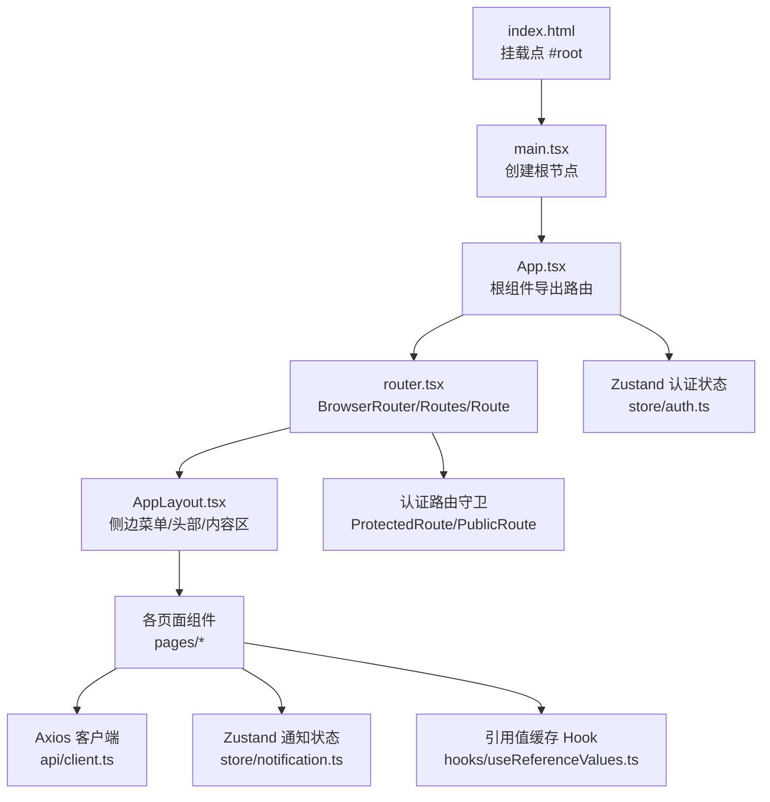
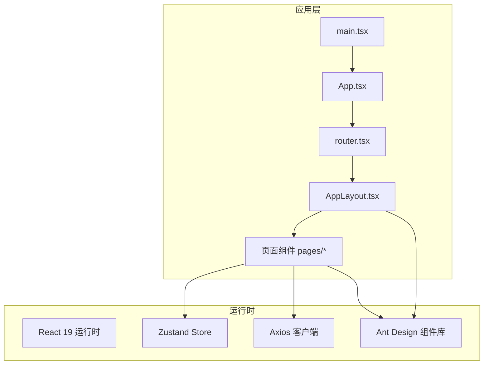
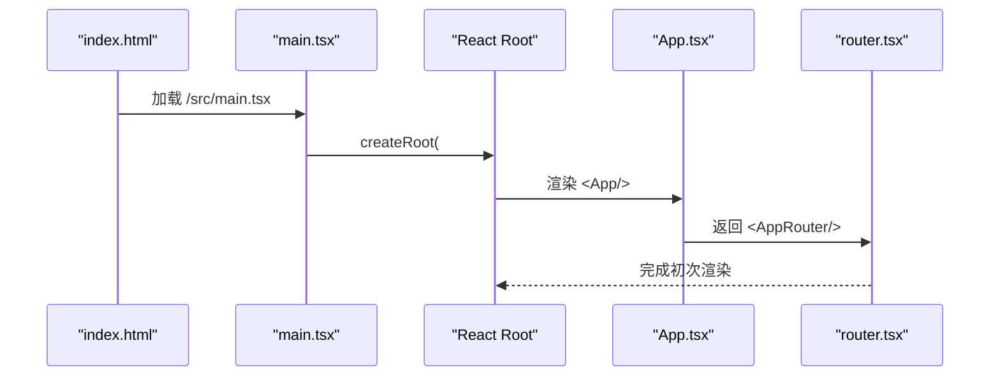
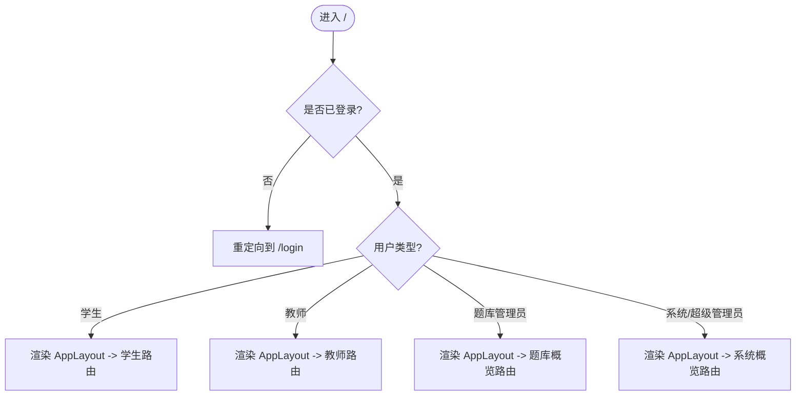
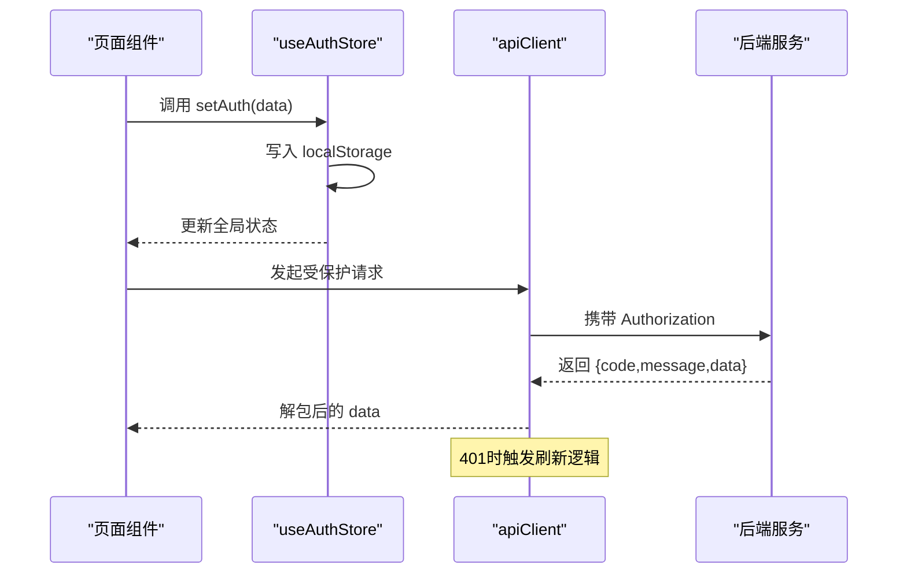
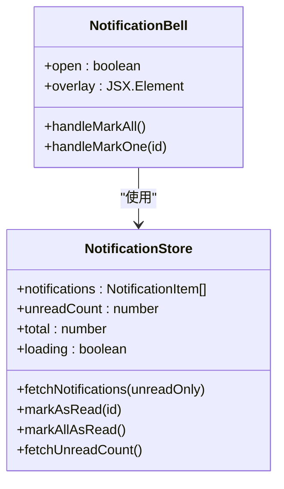
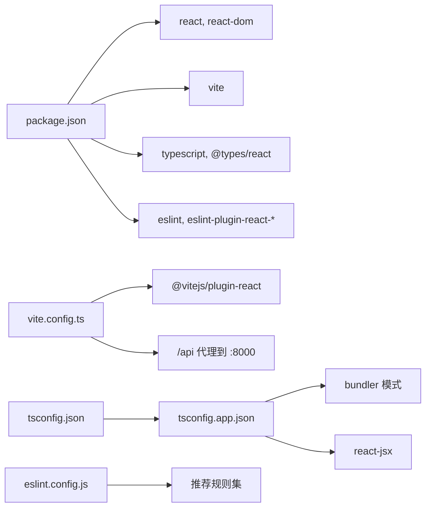

# React应用结构

<cite>
**本文引用的文件**
- [frontend/src/main.tsx](file://frontend/src/main.tsx)
- [frontend/src/App.tsx](file://frontend/src/App.tsx)
- [frontend/src/router.tsx](file://frontend/src/router.tsx)
- [frontend/src/components/layout/AppLayout.tsx](file://frontend/src/components/layout/AppLayout.tsx)
- [frontend/src/store/auth.ts](file://frontend/src/store/auth.ts)
- [frontend/src/api/client.ts](file://frontend/src/api/client.ts)
- [frontend/src/pages/auth/LoginPage.tsx](file://frontend/src/pages/auth/LoginPage.tsx)
- [frontend/src/hooks/useReferenceValues.ts](file://frontend/src/hooks/useReferenceValues.ts)
- [frontend/src/store/notification.ts](file://frontend/src/store/notification.ts)
- [frontend/src/components/notification/NotificationBell.tsx](file://frontend/src/components/notification/NotificationBell.tsx)
- [frontend/src/pages/dashboard/DashboardPage.tsx](file://frontend/src/pages/dashboard/DashboardPage.tsx)
- [frontend/package.json](file://frontend/package.json)
- [frontend/vite.config.ts](file://frontend/vite.config.ts)
- [frontend/index.html](file://frontend/index.html)
- [frontend/tsconfig.json](file://frontend/tsconfig.json)
- [frontend/tsconfig.app.json](file://frontend/tsconfig.app.json)
- [frontend/eslint.config.js](file://frontend/eslint.config.js)
</cite>

## 目录
1. [简介](#简介)
2. [项目结构](#项目结构)
3. [核心组件](#核心组件)
4. [架构总览](#架构总览)
5. [详细组件分析](#详细组件分析)
6. [依赖关系分析](#依赖关系分析)
7. [性能考虑](#性能考虑)
8. [故障排查指南](#故障排查指南)
9. [结论](#结论)
10. [附录](#附录)

## 简介
本文件面向“瑞珹教育管理系统”的前端React应用，聚焦于基于React 19的入口点配置、根组件设计模式与应用初始化流程；系统性阐述App.tsx作为根组件的作用、main.tsx中的渲染与严格模式配置、路由与布局组合、状态管理与API客户端设计、以及开发环境与构建配置。文档同时覆盖并发特性与Suspense模式的应用建议、性能优化策略与最佳实践，并提供常见问题的排查路径。

## 项目结构
前端采用Vite + React 19 + TypeScript + Ant Design的现代化技术栈，目录组织遵循按功能域划分的层次化结构：
- 应用入口与根组件：main.tsx、App.tsx
- 路由与布局：router.tsx、components/layout/AppLayout.tsx
- 页面与业务模块：pages/*（如登录、仪表盘、题库、试卷等）
- 状态管理：store/*（认证、通知）
- API与工具：api/client.ts、hooks/useReferenceValues.ts
- 开发与构建：package.json、vite.config.ts、tsconfig.*、eslint.config.js
- HTML模板：index.html

图表来源
- [frontend/src/main.tsx:1-10](file://frontend/src/main.tsx#L1-L10)
- [frontend/src/App.tsx:1-6](file://frontend/src/App.tsx#L1-L6)
- [frontend/src/router.tsx:1-79](file://frontend/src/router.tsx#L1-L79)
- [frontend/src/components/layout/AppLayout.tsx:1-166](file://frontend/src/components/layout/AppLayout.tsx#L1-L166)
- [frontend/src/store/auth.ts:1-96](file://frontend/src/store/auth.ts#L1-L96)
- [frontend/src/api/client.ts:1-55](file://frontend/src/api/client.ts#L1-L55)
- [frontend/src/store/notification.ts:1-80](file://frontend/src/store/notification.ts#L1-L80)
- [frontend/src/hooks/useReferenceValues.ts:1-84](file://frontend/src/hooks/useReferenceValues.ts#L1-L84)
- [frontend/index.html:1-14](file://frontend/index.html#L1-L14)

章节来源
- [frontend/src/main.tsx:1-10](file://frontend/src/main.tsx#L1-L10)
- [frontend/src/App.tsx:1-6](file://frontend/src/App.tsx#L1-L6)
- [frontend/src/router.tsx:1-79](file://frontend/src/router.tsx#L1-L79)
- [frontend/src/components/layout/AppLayout.tsx:1-166](file://frontend/src/components/layout/AppLayout.tsx#L1-L166)
- [frontend/src/store/auth.ts:1-96](file://frontend/src/store/auth.ts#L1-L96)
- [frontend/src/api/client.ts:1-55](file://frontend/src/api/client.ts#L1-L55)
- [frontend/src/store/notification.ts:1-80](file://frontend/src/store/notification.ts#L1-L80)
- [frontend/src/hooks/useReferenceValues.ts:1-84](file://frontend/src/hooks/useReferenceValues.ts#L1-L84)
- [frontend/index.html:1-14](file://frontend/index.html#L1-L14)

## 核心组件
- 应用入口与渲染
  - main.tsx负责创建根节点并以严格模式包裹根组件，确保子树在开发阶段进行额外一致性检查。
  - App.tsx作为根组件，直接返回AppRouter，形成单一职责的顶层容器。
- 路由与权限控制
  - router.tsx使用BrowserRouter、Routes与Route定义页面级路由；通过ProtectedRoute/PublicRoute实现登录态与访问权限控制；AppLayout作为受保护区域的布局容器。
- 布局与导航
  - AppLayout提供侧边菜单、顶部用户下拉、通知铃铛等UI骨架，结合Ant Design主题与国际化配置。
- 状态管理
  - 认证状态：Zustand store封装localStorage与全局状态同步，提供登录、登出、更新用户名等方法。
  - 通知状态：Zustand store封装通知列表、未读计数与标记已读接口调用。
- API客户端
  - Axios实例统一拦截请求头Authorization、自动解包后端响应包装体；在401时尝试刷新令牌并重试原请求；失败则跳转登录页。
- 引用值缓存
  - useReferenceValues提供跨组件共享的静态资源字典缓存，避免重复请求与重复渲染。

章节来源
- [frontend/src/main.tsx:1-10](file://frontend/src/main.tsx#L1-L10)
- [frontend/src/App.tsx:1-6](file://frontend/src/App.tsx#L1-L6)
- [frontend/src/router.tsx:1-79](file://frontend/src/router.tsx#L1-L79)
- [frontend/src/components/layout/AppLayout.tsx:1-166](file://frontend/src/components/layout/AppLayout.tsx#L1-L166)
- [frontend/src/store/auth.ts:1-96](file://frontend/src/store/auth.ts#L1-L96)
- [frontend/src/store/notification.ts:1-80](file://frontend/src/store/notification.ts#L1-L80)
- [frontend/src/api/client.ts:1-55](file://frontend/src/api/client.ts#L1-L55)
- [frontend/src/hooks/useReferenceValues.ts:1-84](file://frontend/src/hooks/useReferenceValues.ts#L1-L84)

## 架构总览
应用采用“入口 -> 根组件 -> 路由 -> 布局 -> 页面”的线性结构，配合Zustand与Axios实现状态与数据流的解耦。Ant Design提供UI基础能力，Vite提供开发与构建支持。

图表来源
- [frontend/src/main.tsx:1-10](file://frontend/src/main.tsx#L1-L10)
- [frontend/src/App.tsx:1-6](file://frontend/src/App.tsx#L1-L6)
- [frontend/src/router.tsx:1-79](file://frontend/src/router.tsx#L1-L79)
- [frontend/src/components/layout/AppLayout.tsx:1-166](file://frontend/src/components/layout/AppLayout.tsx#L1-L166)
- [frontend/src/store/auth.ts:1-96](file://frontend/src/store/auth.ts#L1-L96)
- [frontend/src/store/notification.ts:1-80](file://frontend/src/store/notification.ts#L1-L80)
- [frontend/src/api/client.ts:1-55](file://frontend/src/api/client.ts#L1-L55)

## 详细组件分析

### 应用入口与根组件
- main.tsx
  - 使用React 19的createRoot创建根节点，挂载到index.html中的#root元素。
  - 以StrictMode包裹App，开启开发期一致性检查。
- App.tsx
  - 仅负责导出路由容器AppRouter，保持根组件轻量与高内聚。

图表来源
- [frontend/index.html:1-14](file://frontend/index.html#L1-L14)
- [frontend/src/main.tsx:1-10](file://frontend/src/main.tsx#L1-L10)
- [frontend/src/App.tsx:1-6](file://frontend/src/App.tsx#L1-L6)
- [frontend/src/router.tsx:1-79](file://frontend/src/router.tsx#L1-L79)

章节来源
- [frontend/src/main.tsx:1-10](file://frontend/src/main.tsx#L1-L10)
- [frontend/src/App.tsx:1-6](file://frontend/src/App.tsx#L1-L6)
- [frontend/index.html:1-14](file://frontend/index.html#L1-L14)

### 路由与权限控制
- router.tsx
  - 使用ConfigProvider与AntApp提供主题与本地化配置。
  - 定义公共路由（登录/管理登录）与受保护路由（AppLayout包裹），内部嵌套多级页面路由。
  - 提供ProtectedRoute/PublicRoute两个高阶路由组件，分别用于强制登录与禁止已登录访问。
  - 动态路由根据用户类型切换“我的试卷”与“试卷列表”，体现角色驱动的界面差异。
- AppLayout
  - 侧边菜单按角色动态生成，支持折叠与子菜单展开。
  - 头部包含通知铃铛与用户下拉菜单（个人信息/退出登录）。

图表来源
- [frontend/src/router.tsx:24-42](file://frontend/src/router.tsx#L24-L42)
- [frontend/src/router.tsx:44-79](file://frontend/src/router.tsx#L44-L79)
- [frontend/src/components/layout/AppLayout.tsx:24-65](file://frontend/src/components/layout/AppLayout.tsx#L24-L65)

章节来源
- [frontend/src/router.tsx:1-79](file://frontend/src/router.tsx#L1-L79)
- [frontend/src/components/layout/AppLayout.tsx:1-166](file://frontend/src/components/layout/AppLayout.tsx#L1-L166)

### 认证与状态管理
- store/auth.ts
  - 使用Zustand创建认证store，持久化存储于localStorage，包含用户信息、令牌、类型与登录状态。
  - 提供setAuth、logout、updateUserName、setUser等方法，保证全局状态与本地存储一致。
- api/client.ts
  - Axios实例配置baseURL与通用请求头；请求拦截器注入Authorization；响应拦截器自动解包后端包装体。
  - 401错误时尝试刷新令牌并重试原请求；失败则清除本地令牌并跳转登录页。

图表来源
- [frontend/src/store/auth.ts:47-95](file://frontend/src/store/auth.ts#L47-L95)
- [frontend/src/api/client.ts:9-52](file://frontend/src/api/client.ts#L9-L52)

章节来源
- [frontend/src/store/auth.ts:1-96](file://frontend/src/store/auth.ts#L1-L96)
- [frontend/src/api/client.ts:1-55](file://frontend/src/api/client.ts#L1-L55)

### 通知系统与引用值缓存
- store/notification.ts
  - 管理通知列表、未读计数与加载状态；提供拉取通知、标记已读、批量已读与未读计数查询。
- components/notification/NotificationBell.tsx
  - 下拉弹层展示通知列表，支持一键已读与定时轮询未读计数。
- hooks/useReferenceValues.ts
  - 单例缓存与监听机制，避免重复请求；提供toLabelMap、toSelectOptions、toColorMap等工具函数。

图表来源
- [frontend/src/store/notification.ts:15-79](file://frontend/src/store/notification.ts#L15-L79)
- [frontend/src/components/notification/NotificationBell.tsx:17-117](file://frontend/src/components/notification/NotificationBell.tsx#L17-L117)

章节来源
- [frontend/src/store/notification.ts:1-80](file://frontend/src/store/notification.ts#L1-L80)
- [frontend/src/components/notification/NotificationBell.tsx:1-117](file://frontend/src/components/notification/NotificationBell.tsx#L1-L117)
- [frontend/src/hooks/useReferenceValues.ts:1-84](file://frontend/src/hooks/useReferenceValues.ts#L1-L84)

### 登录页与仪表盘
- pages/auth/LoginPage.tsx
  - 支持图形验证码刷新、短信验证码倒计时、注册流程分步引导；集成引用值Hook与认证store，完成登录/注册后跳转仪表盘。
- pages/dashboard/DashboardPage.tsx
  - 根据用户类型渲染不同仪表盘卡片与表格；使用引用值映射状态标签与颜色；提供快捷入口与统计信息。

章节来源
- [frontend/src/pages/auth/LoginPage.tsx:1-217](file://frontend/src/pages/auth/LoginPage.tsx#L1-L217)
- [frontend/src/pages/dashboard/DashboardPage.tsx:1-580](file://frontend/src/pages/dashboard/DashboardPage.tsx#L1-L580)

## 依赖关系分析
- React 19与Vite
  - package.json声明React 19与Vite，vite.config.ts启用@vitejs/plugin-react并配置代理到后端8000端口。
- TypeScript
  - tsconfig.json聚合app与node配置；tsconfig.app.json启用bundler模式与react-jsx。
- ESLint
  - eslint.config.js集成推荐规则与React Hooks/React Refresh插件，统一浏览器环境变量。

图表来源
- [frontend/package.json:1-38](file://frontend/package.json#L1-L38)
- [frontend/vite.config.ts:1-17](file://frontend/vite.config.ts#L1-L17)
- [frontend/tsconfig.json:1-8](file://frontend/tsconfig.json#L1-L8)
- [frontend/tsconfig.app.json:1-26](file://frontend/tsconfig.app.json#L1-L26)
- [frontend/eslint.config.js:1-23](file://frontend/eslint.config.js#L1-L23)

章节来源
- [frontend/package.json:1-38](file://frontend/package.json#L1-L38)
- [frontend/vite.config.ts:1-17](file://frontend/vite.config.ts#L1-L17)
- [frontend/tsconfig.json:1-8](file://frontend/tsconfig.json#L1-L8)
- [frontend/tsconfig.app.json:1-26](file://frontend/tsconfig.app.json#L1-L26)
- [frontend/eslint.config.js:1-23](file://frontend/eslint.config.js#L1-L23)

## 性能考虑
- 并发与Suspense建议
  - 在需要懒加载的页面或大型组件上，结合React.lazy与Suspense边界进行代码分割与降级显示，提升首屏性能与交互流畅度。
  - 对于长列表与复杂统计图，采用虚拟滚动与分页策略，减少一次性渲染开销。
- 状态与缓存
  - 利用Zustand细粒度状态拆分，避免不必要的全局重渲染；对引用值使用单例缓存与订阅机制，降低重复请求与渲染成本。
- 请求与拦截
  - Axios拦截器集中处理鉴权与响应解包，减少页面组件样板代码；对401的重试与刷新逻辑应避免无限循环，必要时增加重试次数上限。
- 构建与开发
  - Vite默认启用按需编译与热更新；生产构建开启压缩与Tree-shaking；TypeScript启用bundler模式与noEmit，确保类型安全与打包效率。
- UI与交互
  - Ant Design组件按需引入与主题定制，减少无关样式体积；对高频交互（如通知下拉）采用节流/防抖与定时轮询策略，平衡实时性与性能。

## 故障排查指南
- 登录后无法进入受保护页面
  - 检查store/auth.ts中的令牌写入与读取逻辑，确认localStorage键名一致且setAuth被正确调用。
  - 确认router.tsx中ProtectedRoute/PublicRoute的判断逻辑与路由层级。
- 401频繁出现或无法自动刷新
  - 检查api/client.ts中拦截器的重试标志与刷新逻辑；确认后端返回的包装体结构与字段名一致。
  - 若刷新失败，确认清理localStorage并跳转登录的分支逻辑。
- 通知未显示或未读计数不更新
  - 检查NotificationBell的open状态与useEffect触发条件；确认定时轮询与手动拉取逻辑均能触发store更新。
- 引用值不生效或重复请求
  - 检查useReferenceValues的缓存单例与监听集合；确认fetchAll成功写入cache并触发listeners。
- 构建或开发异常
  - 检查vite.config.ts的代理配置与端口占用；确认package.json脚本与依赖版本兼容；TypeScript配置与bundler模式匹配。

章节来源
- [frontend/src/store/auth.ts:47-95](file://frontend/src/store/auth.ts#L47-L95)
- [frontend/src/router.tsx:26-36](file://frontend/src/router.tsx#L26-L36)
- [frontend/src/api/client.ts:26-52](file://frontend/src/api/client.ts#L26-L52)
- [frontend/src/components/notification/NotificationBell.tsx:29-44](file://frontend/src/components/notification/NotificationBell.tsx#L29-L44)
- [frontend/src/hooks/useReferenceValues.ts:35-63](file://frontend/src/hooks/useReferenceValues.ts#L35-L63)
- [frontend/vite.config.ts:6-16](file://frontend/vite.config.ts#L6-L16)
- [frontend/package.json:6-11](file://frontend/package.json#L6-L11)

## 结论
该React 19前端应用以清晰的入口与根组件设计为基础，结合受保护路由、角色驱动布局与Zustand状态管理，实现了认证、通知与引用值的高效协同。通过Axios拦截器与Vite开发体验，系统在开发效率与运行性能之间取得良好平衡。建议在后续迭代中引入Suspense与懒加载、进一步细化状态切片与缓存策略，并完善错误边界与日志监控，持续提升稳定性与可维护性。

## 附录
- 最佳实践清单
  - 将UI与业务逻辑分离，保持组件单一职责。
  - 使用Zustand细粒度状态，避免全局风暴。
  - 在路由层统一处理鉴权与权限，减少页面重复逻辑。
  - 对长列表与复杂图表采用虚拟化与分页。
  - 通过Suspense与React.lazy实现按需加载与降级显示。
  - 保持Axios拦截器集中处理，统一错误与重试策略。
  - 使用TypeScript与ESLint规范团队协作与质量保障。
- 常见问题速查
  - 登录后白屏：检查ProtectedRoute与localStorage键名。
  - 401循环刷新：限制重试次数与刷新分支。
  - 通知不更新：确认定时轮询与store更新链路。
  - 引用值重复请求：检查缓存单例与监听集合。
  - 开发代理不通：核对vite.config.ts代理与后端端口。