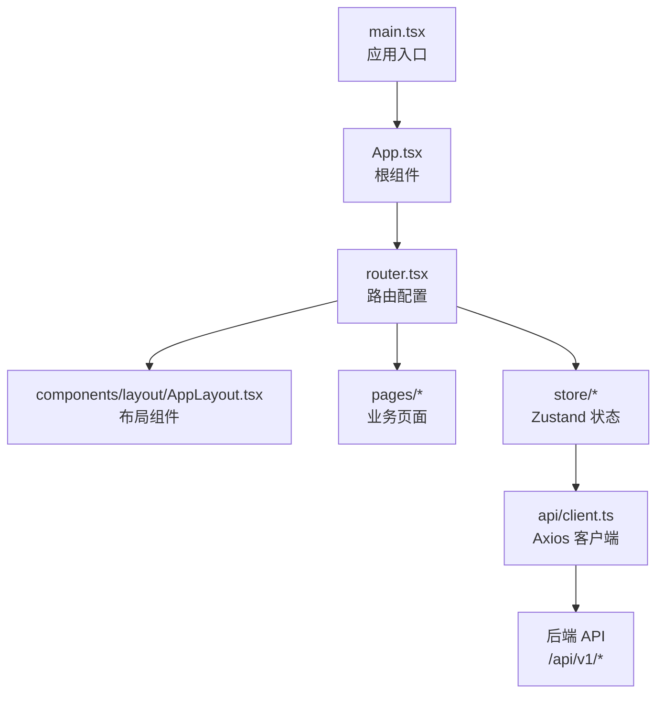
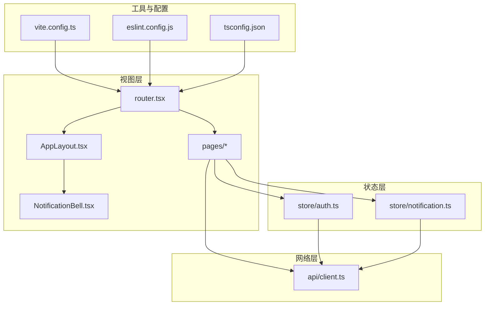
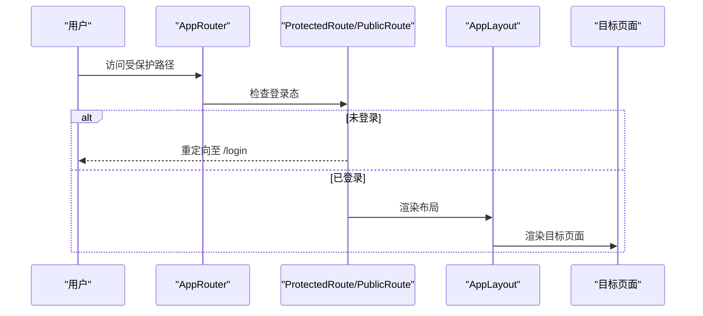
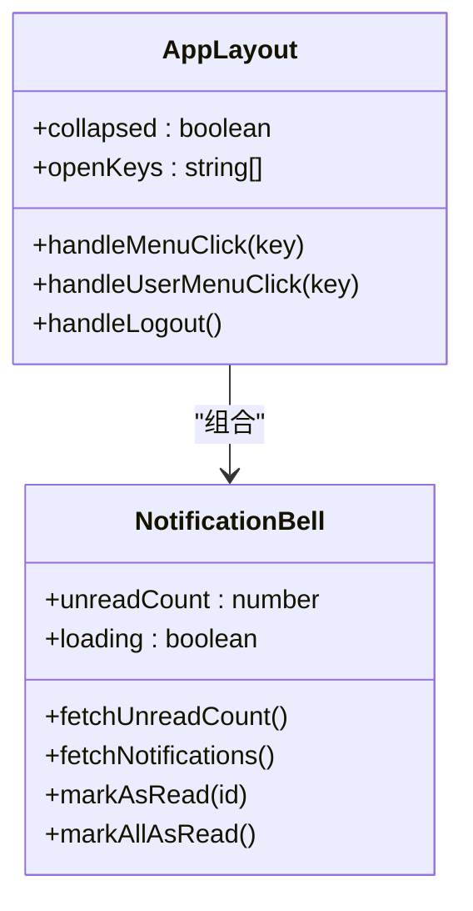
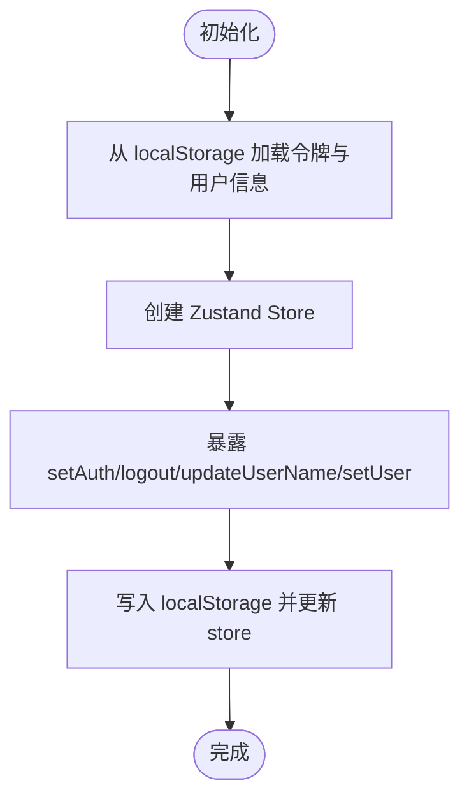
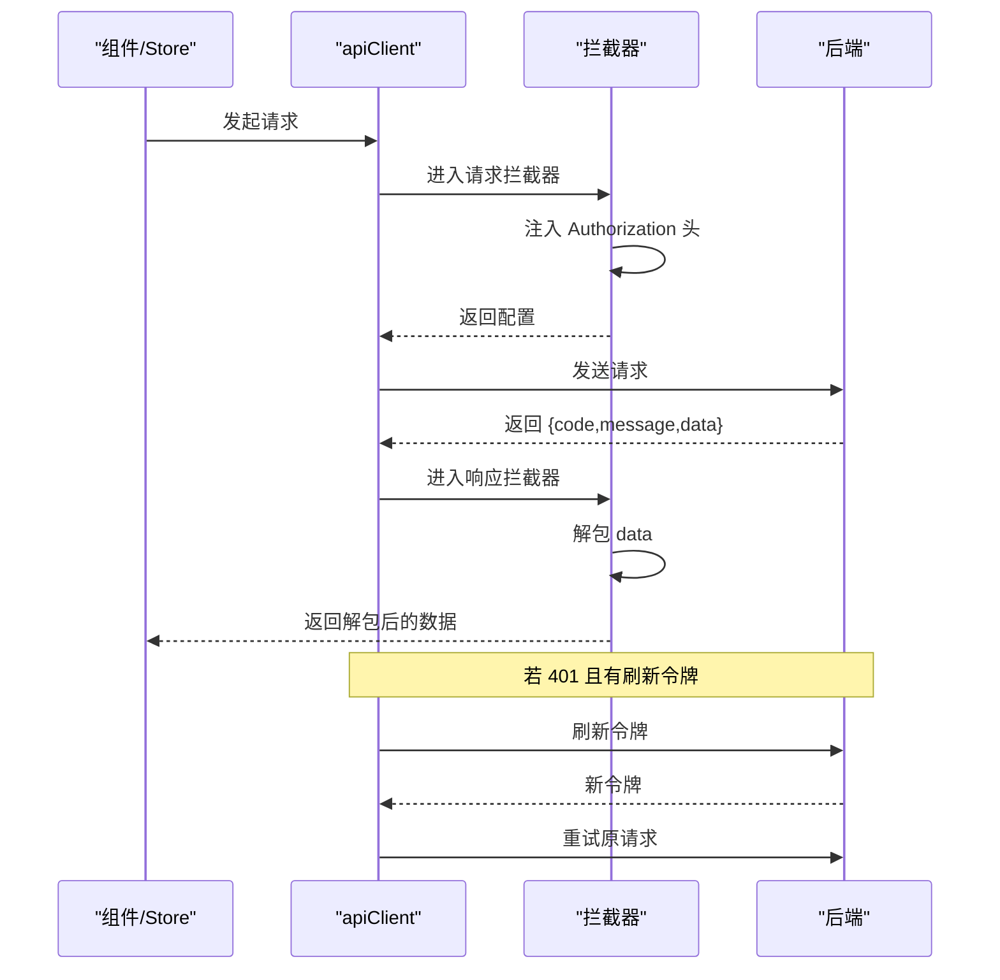
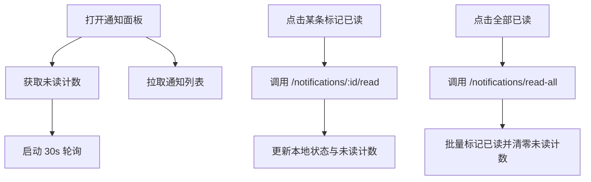
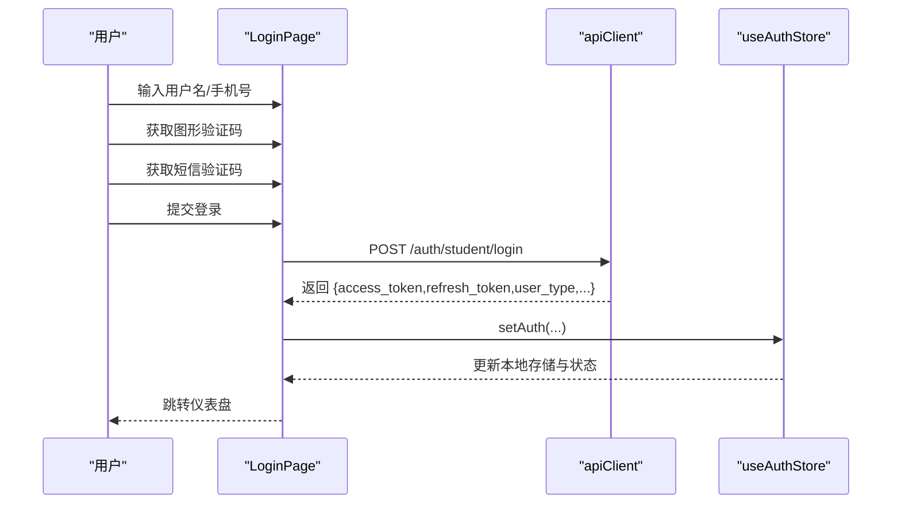
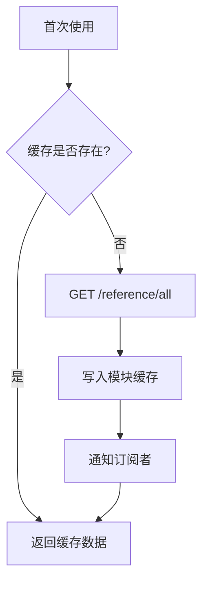
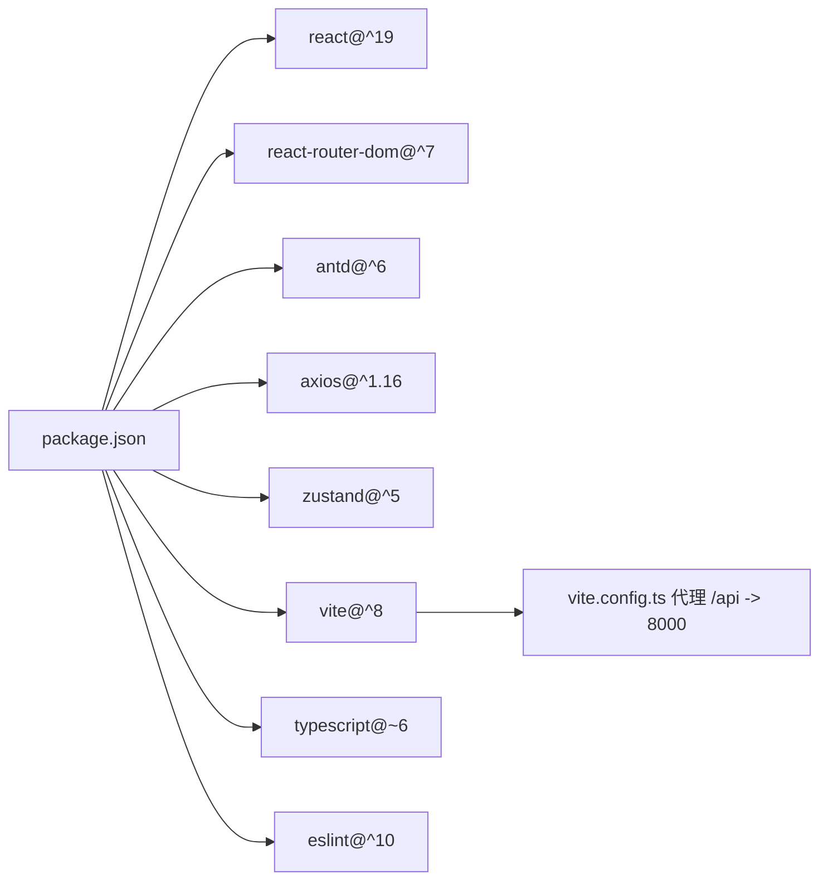

# 前端应用架构

<cite>
**本文档引用的文件**
- [main.tsx](file://frontend/src/main.tsx)
- [App.tsx](file://frontend/src/App.tsx)
- [router.tsx](file://frontend/src/router.tsx)
- [package.json](file://frontend/package.json)
- [vite.config.ts](file://frontend/vite.config.ts)
- [auth.ts](file://frontend/src/store/auth.ts)
- [notification.ts](file://frontend/src/store/notification.ts)
- [client.ts](file://frontend/src/api/client.ts)
- [AppLayout.tsx](file://frontend/src/components/layout/AppLayout.tsx)
- [NotificationBell.tsx](file://frontend/src/components/notification/NotificationBell.tsx)
- [LoginPage.tsx](file://frontend/src/pages/auth/LoginPage.tsx)
- [useReferenceValues.ts](file://frontend/src/hooks/useReferenceValues.ts)
- [tsconfig.json](file://frontend/tsconfig.json)
- [eslint.config.js](file://frontend/eslint.config.js)
</cite>

## 目录
1. [引言](#引言)
2. [项目结构](#项目结构)
3. [核心组件](#核心组件)
4. [架构总览](#架构总览)
5. [详细组件分析](#详细组件分析)
6. [依赖关系分析](#依赖关系分析)
7. [性能考虑](#性能考虑)
8. [故障排除指南](#故障排除指南)
9. [结论](#结论)
10. [附录](#附录)

## 引言
本文件为瑞珹教育管理系统前端架构文档，面向使用 React 19 + TypeScript 的单页应用（SPA）。文档涵盖组件设计模式、状态管理（Zustand）、路由配置与布局系统，以及前端与后端 API 的交互方式、认证状态管理、通知系统与响应式设计。同时包含组件层次结构、数据流管理、性能优化策略、TypeScript 类型定义、组件复用模式与开发工具配置，并提供前端开发最佳实践与调试技巧。

## 项目结构
前端采用模块化组织，按功能域划分目录：页面（pages）、组件（components）、状态（store）、API 客户端（api）、钩子（hooks）与入口（main.tsx/App.tsx/router.tsx）。构建工具使用 Vite，开发服务器内置代理到后端服务，TypeScript 通过多配置文件组合管理编译选项。

图表来源
- [main.tsx:1-10](file://frontend/src/main.tsx#L1-L10)
- [App.tsx:1-6](file://frontend/src/App.tsx#L1-L6)
- [router.tsx:1-79](file://frontend/src/router.tsx#L1-L79)
- [AppLayout.tsx:1-166](file://frontend/src/components/layout/AppLayout.tsx#L1-L166)
- [client.ts:1-55](file://frontend/src/api/client.ts#L1-L55)

章节来源
- [main.tsx:1-10](file://frontend/src/main.tsx#L1-L10)
- [App.tsx:1-6](file://frontend/src/App.tsx#L1-L6)
- [router.tsx:1-79](file://frontend/src/router.tsx#L1-L79)
- [vite.config.ts:1-17](file://frontend/vite.config.ts#L1-L17)
- [tsconfig.json:1-8](file://frontend/tsconfig.json#L1-L8)

## 核心组件
- 应用入口与根组件：负责挂载 React 根节点并渲染根路由组件。
- 路由系统：基于 react-router-dom v7，提供受保护路由、公开路由与动态角色路由分发。
- 布局系统：基于 Ant Design Layout，支持侧边菜单、顶部通知与用户下拉菜单。
- 状态管理：Zustand 管理认证与通知状态，提供简单易用的状态订阅与更新。
- API 客户端：Axios 封装，统一请求头注入、响应体解包与 401 自动刷新令牌。
- 通知系统：集成 Ant Design 下拉气泡，支持未读计数轮询、列表加载与标记已读。
- 认证流程：图形验证码、短信验证码、登录/注册表单与用户信息持久化。
- 参考值缓存：全局参考数据缓存与监听机制，减少重复请求。

章节来源
- [main.tsx:1-10](file://frontend/src/main.tsx#L1-L10)
- [App.tsx:1-6](file://frontend/src/App.tsx#L1-L6)
- [router.tsx:1-79](file://frontend/src/router.tsx#L1-L79)
- [AppLayout.tsx:1-166](file://frontend/src/components/layout/AppLayout.tsx#L1-L166)
- [auth.ts:1-96](file://frontend/src/store/auth.ts#L1-L96)
- [notification.ts:1-80](file://frontend/src/store/notification.ts#L1-L80)
- [client.ts:1-55](file://frontend/src/api/client.ts#L1-L55)
- [NotificationBell.tsx:1-117](file://frontend/src/components/notification/NotificationBell.tsx#L1-L117)
- [LoginPage.tsx:1-217](file://frontend/src/pages/auth/LoginPage.tsx#L1-L217)
- [useReferenceValues.ts:1-84](file://frontend/src/hooks/useReferenceValues.ts#L1-L84)

## 架构总览
前端采用“路由驱动 + 组件分层 + 状态集中”的架构模式。路由负责页面级导航与权限控制；布局组件承载菜单与头部区域；状态管理集中于 Zustand store；API 客户端统一封装网络请求与认证逻辑；页面组件通过 store 与 API 客户端进行数据交互。

图表来源
- [router.tsx:1-79](file://frontend/src/router.tsx#L1-L79)
- [AppLayout.tsx:1-166](file://frontend/src/components/layout/AppLayout.tsx#L1-L166)
- [NotificationBell.tsx:1-117](file://frontend/src/components/notification/NotificationBell.tsx#L1-L117)
- [auth.ts:1-96](file://frontend/src/store/auth.ts#L1-L96)
- [notification.ts:1-80](file://frontend/src/store/notification.ts#L1-L80)
- [client.ts:1-55](file://frontend/src/api/client.ts#L1-L55)
- [vite.config.ts:1-17](file://frontend/vite.config.ts#L1-L17)
- [eslint.config.js:1-23](file://frontend/eslint.config.js#L1-L23)
- [tsconfig.json:1-8](file://frontend/tsconfig.json#L1-L8)

## 详细组件分析

### 路由与权限控制
- 受保护路由与公开路由：通过自定义高阶组件包装，实现登录态校验与跳转。
- 动态角色路由：根据用户类型动态选择不同页面（如学生/教师/管理员）。
- 国际化与主题：Ant Design ConfigProvider 提供中文语言包与主题定制。

图表来源
- [router.tsx:26-42](file://frontend/src/router.tsx#L26-L42)

章节来源
- [router.tsx:1-79](file://frontend/src/router.tsx#L1-L79)

### 布局系统与菜单
- 侧边栏菜单：根据用户角色动态生成菜单项与子菜单，支持折叠与选中态。
- 顶部区域：通知铃铛、用户头像与下拉菜单（个人信息/退出登录）。
- 主题与样式：使用 Ant Design 主题令牌与边框颜色，保证一致视觉风格。

图表来源
- [AppLayout.tsx:67-166](file://frontend/src/components/layout/AppLayout.tsx#L67-L166)
- [NotificationBell.tsx:17-117](file://frontend/src/components/notification/NotificationBell.tsx#L17-L117)

章节来源
- [AppLayout.tsx:1-166](file://frontend/src/components/layout/AppLayout.tsx#L1-L166)
- [NotificationBell.tsx:1-117](file://frontend/src/components/notification/NotificationBell.tsx#L1-L117)

### 状态管理（Zustand）
- 认证状态：存储访问令牌、刷新令牌、用户类型、用户名与用户 ID，并提供设置、登出、更新用户名与用户对象的方法。
- 通知状态：维护通知列表、未读计数、总数与加载状态，提供拉取通知、标记已读、全部已读与未读计数查询。
- 非 React 上下文辅助函数：在拦截器等非组件场景中读取令牌与用户类型。

图表来源
- [auth.ts:47-95](file://frontend/src/store/auth.ts#L47-L95)

章节来源
- [auth.ts:1-96](file://frontend/src/store/auth.ts#L1-L96)
- [notification.ts:1-80](file://frontend/src/store/notification.ts#L1-L80)

### API 客户端与认证拦截
- 请求拦截：自动注入 Bearer Token。
- 响应拦截：自动解包后端统一响应格式 {code, message, data}，仅返回 data 字段。
- 401 自动刷新：当收到 401 且存在刷新令牌时，调用刷新接口替换令牌并重试原请求；失败则清空本地令牌并跳转登录页。

图表来源
- [client.ts:9-52](file://frontend/src/api/client.ts#L9-L52)

章节来源
- [client.ts:1-55](file://frontend/src/api/client.ts#L1-L55)

### 通知系统
- 未读计数轮询：打开通知面板时启动定时器每 30 秒刷新未读计数。
- 列表加载：首次打开时拉取最近通知，限制条数以提升性能。
- 标记已读：单条与全部已读操作，实时更新本地状态与未读计数。

图表来源
- [NotificationBell.tsx:29-49](file://frontend/src/components/notification/NotificationBell.tsx#L29-L49)
- [notification.ts:32-78](file://frontend/src/store/notification.ts#L32-L78)

章节来源
- [NotificationBell.tsx:1-117](file://frontend/src/components/notification/NotificationBell.tsx#L1-L117)
- [notification.ts:1-80](file://frontend/src/store/notification.ts#L1-L80)

### 认证流程与表单
- 登录/注册：图形验证码、短信验证码、表单校验与提交。
- 用户体验：步骤引导、倒计时按钮、消息提示与成功跳转。
- 数据持久化：登录成功后写入本地存储并更新认证状态。

图表来源
- [LoginPage.tsx:55-71](file://frontend/src/pages/auth/LoginPage.tsx#L55-L71)
- [auth.ts:56-70](file://frontend/src/store/auth.ts#L56-L70)

章节来源
- [LoginPage.tsx:1-217](file://frontend/src/pages/auth/LoginPage.tsx#L1-L217)
- [auth.ts:1-96](file://frontend/src/store/auth.ts#L1-L96)

### 参考值缓存与复用
- 全局缓存：首次请求后缓存到模块级变量，后续组件直接读取。
- 订阅机制：缓存更新时通知所有订阅者触发重渲染。
- 辅助工具：标签映射、下拉选项转换与颜色映射。

图表来源
- [useReferenceValues.ts:40-63](file://frontend/src/hooks/useReferenceValues.ts#L40-L63)

章节来源
- [useReferenceValues.ts:1-84](file://frontend/src/hooks/useReferenceValues.ts#L1-L84)

## 依赖关系分析
- 前端依赖：React 19、React Router DOM 7、Ant Design 6、Axios、Day.js、XLSX、Zustand。
- 开发依赖：Vite、TypeScript、ESLint、React Hooks/Refresh 插件。
- 构建与代理：Vite 服务器代理 /api 到后端 8000 端口，缓存目录可配置。

图表来源
- [package.json:12-36](file://frontend/package.json#L12-L36)
- [vite.config.ts:8-13](file://frontend/vite.config.ts#L8-L13)

章节来源
- [package.json:1-38](file://frontend/package.json#L1-L38)
- [vite.config.ts:1-17](file://frontend/vite.config.ts#L1-L17)

## 性能考虑
- 状态粒度：Zustand 将认证与通知拆分为独立 store，避免无关重渲染。
- 缓存策略：参考值模块级缓存与订阅通知，减少重复请求与渲染。
- 列表优化：通知列表限制每次拉取数量，滚动容器控制高度，避免长列表卡顿。
- 轮询节流：未读计数轮询间隔 30 秒，降低频繁请求带来的压力。
- 图片验证码：一次性渲染 SVG，避免重复网络请求。
- 构建缓存：Vite 缓存目录可配置，提升二次构建速度。

## 故障排除指南
- 登录失败：检查图形验证码与短信验证码是否正确，确认后端接口可用性与网络代理配置。
- 401 未授权：确认本地存储中 access_token/refresh_token 是否存在，拦截器会自动刷新但需确保刷新接口可用。
- 通知不显示：检查通知 store 的 fetchUnreadCount 与 fetchNotifications 是否被调用，确认轮询定时器是否启动。
- 菜单不随角色变化：确认 useAuthStore 中 userType 是否正确写入与读取，AppLayout 的菜单映射是否覆盖该角色。
- 构建失败：检查 TypeScript 配置与 ESLint 规则，确保类型定义与插件版本兼容。

章节来源
- [client.ts:26-52](file://frontend/src/api/client.ts#L26-L52)
- [notification.ts:32-78](file://frontend/src/store/notification.ts#L32-L78)
- [auth.ts:56-95](file://frontend/src/store/auth.ts#L56-L95)
- [AppLayout.tsx:73-76](file://frontend/src/components/layout/AppLayout.tsx#L73-L76)

## 结论
本前端架构以 React 19 + TypeScript 为基础，结合 Ant Design 与 Zustand 实现清晰的组件分层与状态管理；通过 Axios 拦截器与路由守卫实现统一的认证与权限控制；利用 Vite 提供高效的开发体验与代理能力。整体设计强调可维护性与扩展性，适合在教育管理场景中持续演进。

## 附录
- TypeScript 配置：通过多配置文件组合管理应用与 Node 环境编译选项。
- ESLint 配置：启用推荐规则与 React Hooks/Refresh 插件，统一代码风格。
- 开发工具：Vite 提供热更新与代理，便于前后端联调。

章节来源
- [tsconfig.json:1-8](file://frontend/tsconfig.json#L1-L8)
- [eslint.config.js:1-23](file://frontend/eslint.config.js#L1-L23)
- [vite.config.ts:1-17](file://frontend/vite.config.ts#L1-L17)