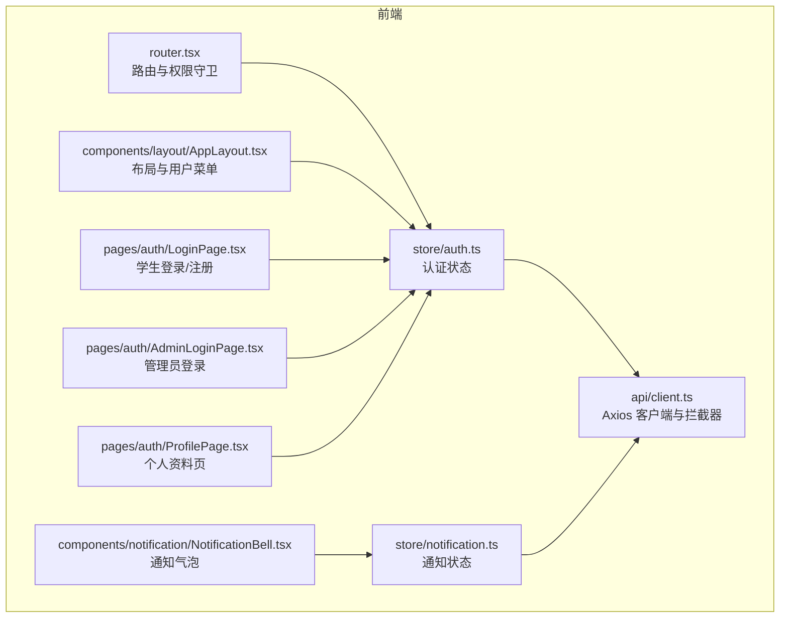
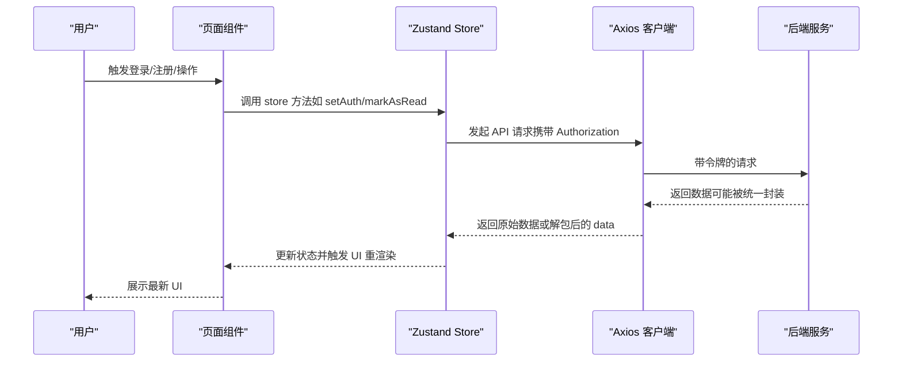
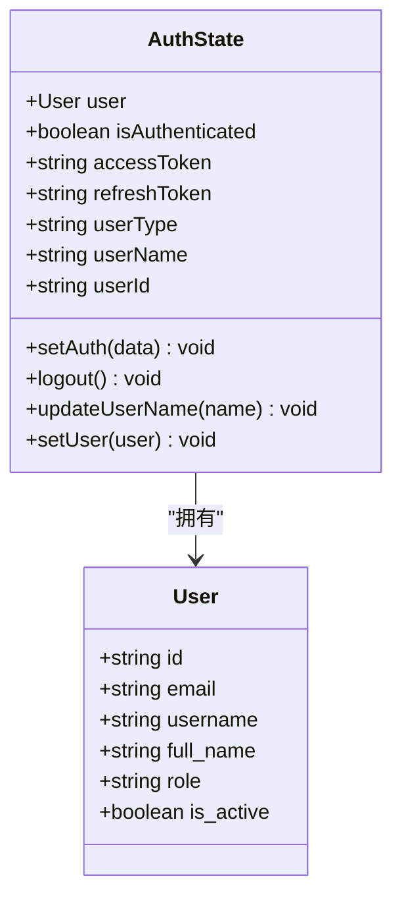
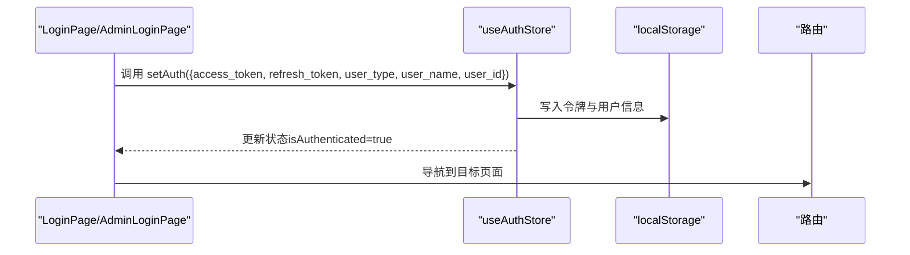
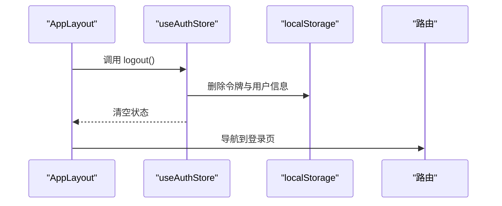
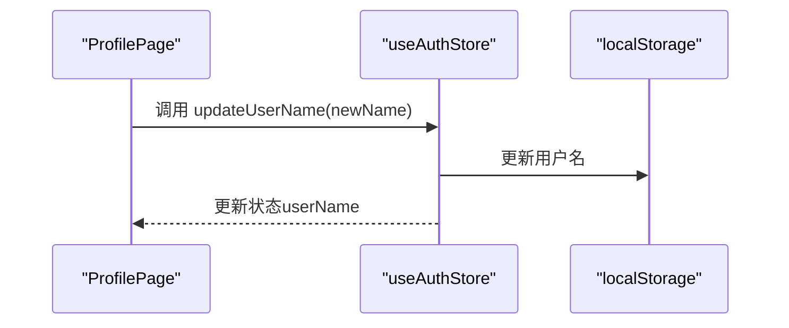
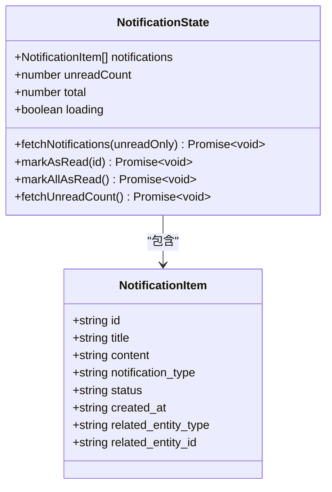
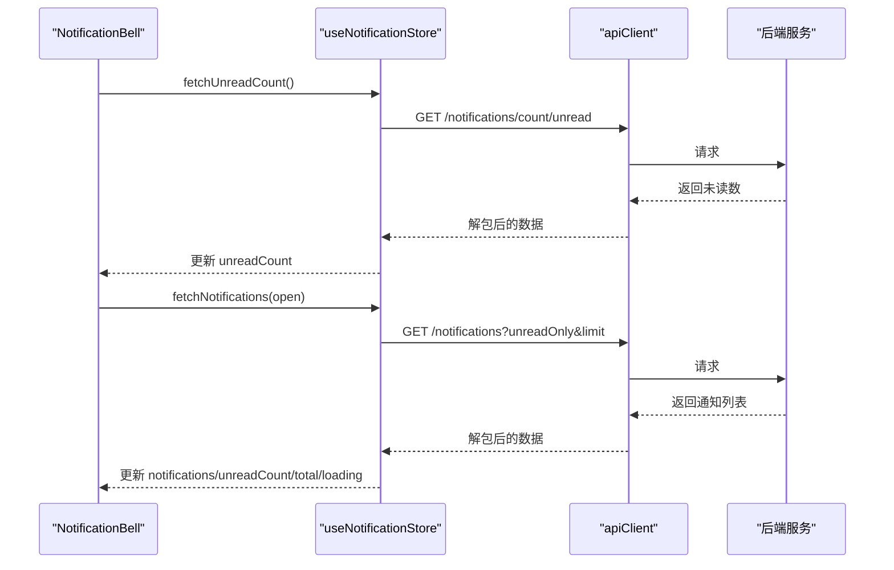
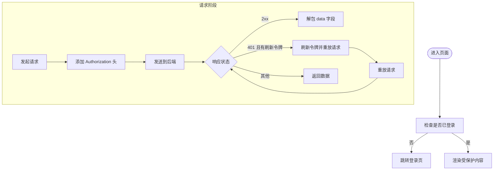
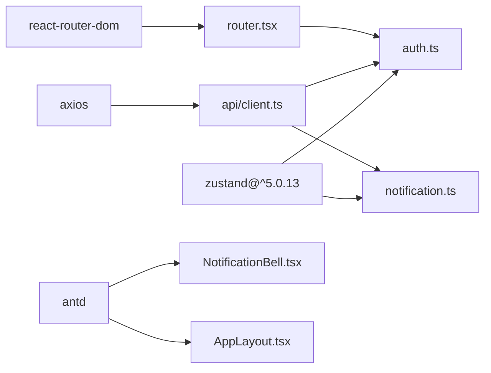

# 状态管理

<cite>
**本文引用的文件**
- [frontend/src/store/auth.ts](file://frontend/src/store/auth.ts)
- [frontend/src/store/notification.ts](file://frontend/src/store/notification.ts)
- [frontend/src/api/client.ts](file://frontend/src/api/client.ts)
- [frontend/src/router.tsx](file://frontend/src/router.tsx)
- [frontend/src/components/layout/AppLayout.tsx](file://frontend/src/components/layout/AppLayout.tsx)
- [frontend/src/components/notification/NotificationBell.tsx](file://frontend/src/components/notification/NotificationBell.tsx)
- [frontend/src/pages/auth/LoginPage.tsx](file://frontend/src/pages/auth/LoginPage.tsx)
- [frontend/src/pages/auth/AdminLoginPage.tsx](file://frontend/src/pages/auth/AdminLoginPage.tsx)
- [frontend/src/pages/auth/ProfilePage.tsx](file://frontend/src/pages/auth/ProfilePage.tsx)
- [frontend/package.json](file://frontend/package.json)
</cite>

## 目录
1. [简介](#简介)
2. [项目结构](#项目结构)
3. [核心组件](#核心组件)
4. [架构总览](#架构总览)
5. [详细组件分析](#详细组件分析)
6. [依赖关系分析](#依赖关系分析)
7. [性能考量](#性能考量)
8. [故障排查指南](#故障排查指南)
9. [结论](#结论)
10. [附录](#附录)

## 简介
本文件面向“瑞珹教育管理系统”的前端状态管理，围绕基于 Zustand 的 store 架构与数据流进行系统化文档化。重点覆盖以下方面：
- 认证状态（auth store）的设计与实现
- 通知状态（notification store）的管理机制
- 全局状态同步策略（路由守卫、Axios 拦截器）
- 状态持久化与订阅模式
- 异步状态更新流程与调试建议
- 最佳实践、性能优化与内存泄漏防护
- 示例用法、Hook 使用与状态迁移指南

## 项目结构
前端采用按功能域划分的目录组织方式，状态管理位于 store 目录，认证与通知两大 store 分别负责用户态与消息态的数据与行为。

图表来源
- [frontend/src/store/auth.ts:1-96](file://frontend/src/store/auth.ts#L1-L96)
- [frontend/src/store/notification.ts:1-80](file://frontend/src/store/notification.ts#L1-L80)
- [frontend/src/api/client.ts:1-55](file://frontend/src/api/client.ts#L1-L55)
- [frontend/src/router.tsx:1-79](file://frontend/src/router.tsx#L1-L79)
- [frontend/src/components/layout/AppLayout.tsx:1-166](file://frontend/src/components/layout/AppLayout.tsx#L1-L166)
- [frontend/src/components/notification/NotificationBell.tsx:1-117](file://frontend/src/components/notification/NotificationBell.tsx#L1-L117)
- [frontend/src/pages/auth/LoginPage.tsx:1-217](file://frontend/src/pages/auth/LoginPage.tsx#L1-L217)
- [frontend/src/pages/auth/AdminLoginPage.tsx:1-171](file://frontend/src/pages/auth/AdminLoginPage.tsx#L1-L171)
- [frontend/src/pages/auth/ProfilePage.tsx:1-200](file://frontend/src/pages/auth/ProfilePage.tsx#L1-L200)

章节来源
- [frontend/src/store/auth.ts:1-96](file://frontend/src/store/auth.ts#L1-L96)
- [frontend/src/store/notification.ts:1-80](file://frontend/src/store/notification.ts#L1-L80)
- [frontend/src/api/client.ts:1-55](file://frontend/src/api/client.ts#L1-L55)
- [frontend/src/router.tsx:1-79](file://frontend/src/router.tsx#L1-L79)

## 核心组件
- 认证状态（auth store）
  - 职责：维护登录态、令牌、用户类型、用户名、用户 ID；提供登录设置、登出、用户名更新、直接设置用户对象等方法。
  - 关键字段：user、isAuthenticated、accessToken、refreshToken、userType、userName、userId。
  - 关键方法：setAuth、logout、updateUserName、setUser。
  - 数据持久化：通过本地存储键值对持久化令牌与用户信息，初始化时从本地存储恢复状态。
- 通知状态（notification store）
  - 职责：拉取通知列表、标记单条/全部已读、查询未读数；管理 loading、notifications、unreadCount、total。
  - 关键方法：fetchNotifications、markAsRead、markAllAsRead、fetchUnreadCount。
  - 数据来源：通过 apiClient 发起请求，自动解包后端统一响应包装。

章节来源
- [frontend/src/store/auth.ts:16-95](file://frontend/src/store/auth.ts#L16-L95)
- [frontend/src/store/notification.ts:4-79](file://frontend/src/store/notification.ts#L4-L79)

## 架构总览
Zustand store 与 Axios 拦截器、路由守卫协同工作，形成“状态驱动 UI + 请求拦截 + 权限控制”的闭环。

图表来源
- [frontend/src/store/auth.ts:47-95](file://frontend/src/store/auth.ts#L47-L95)
- [frontend/src/store/notification.ts:26-79](file://frontend/src/store/notification.ts#L26-L79)
- [frontend/src/api/client.ts:9-52](file://frontend/src/api/client.ts#L9-L52)

## 详细组件分析

### 认证状态（auth store）分析
- 设计要点
  - 使用 create 创建 Zustand store，内部包含状态字段与动作函数。
  - 初始化时从本地存储恢复状态，确保刷新后仍保持登录态。
  - setAuth 将令牌与用户信息写入本地存储，并更新 store 内部状态。
  - logout 清空本地存储与 store 状态，强制登出。
  - updateUserName 仅更新本地存储与 store 中的用户名，便于即时 UI 反映。
  - setUser 支持外部直接注入用户对象，用于 SSR 或特殊场景。
- 数据模型

图表来源
- [frontend/src/store/auth.ts:16-95](file://frontend/src/store/auth.ts#L16-L95)

- 关键流程（登录设置）

图表来源
- [frontend/src/pages/auth/LoginPage.tsx:55-71](file://frontend/src/pages/auth/LoginPage.tsx#L55-L71)
- [frontend/src/pages/auth/AdminLoginPage.tsx:60-84](file://frontend/src/pages/auth/AdminLoginPage.tsx#L60-L84)
- [frontend/src/store/auth.ts:56-70](file://frontend/src/store/auth.ts#L56-L70)

- 登出流程

图表来源
- [frontend/src/components/layout/AppLayout.tsx:78-81](file://frontend/src/components/layout/AppLayout.tsx#L78-L81)
- [frontend/src/store/auth.ts:72-87](file://frontend/src/store/auth.ts#L72-L87)

- 用户名更新流程

图表来源
- [frontend/src/pages/auth/ProfilePage.tsx:57-76](file://frontend/src/pages/auth/ProfilePage.tsx#L57-L76)
- [frontend/src/store/auth.ts:89-92](file://frontend/src/store/auth.ts#L89-L92)

- 辅助函数与非 React 上下文使用
  - 提供 getAccessToken/getRefreshToken/getUserType/getUserName/getUserId 等辅助函数，供 Axios 拦截器在非 React 组件上下文中读取令牌。

章节来源
- [frontend/src/store/auth.ts:1-96](file://frontend/src/store/auth.ts#L1-L96)
- [frontend/src/pages/auth/LoginPage.tsx:55-71](file://frontend/src/pages/auth/LoginPage.tsx#L55-L71)
- [frontend/src/pages/auth/AdminLoginPage.tsx:60-84](file://frontend/src/pages/auth/AdminLoginPage.tsx#L60-L84)
- [frontend/src/pages/auth/ProfilePage.tsx:57-76](file://frontend/src/pages/auth/ProfilePage.tsx#L57-L76)
- [frontend/src/components/layout/AppLayout.tsx:78-81](file://frontend/src/components/layout/AppLayout.tsx#L78-L81)

### 通知状态（notification store）分析
- 设计要点
  - 管理通知列表、未读数、总数与加载状态。
  - 提供异步动作：拉取通知列表、标记单条/全部已读、查询未读数。
  - fetchNotifications 默认限制每次拉取数量，避免一次性数据过大。
  - markAsRead/markAllAsRead 在本地即时更新 UI，再发起网络请求，提升交互体验。
- 数据模型

图表来源
- [frontend/src/store/notification.ts:4-79](file://frontend/src/store/notification.ts#L4-L79)

- 通知气泡组件与定时刷新

图表来源
- [frontend/src/components/notification/NotificationBell.tsx:29-39](file://frontend/src/components/notification/NotificationBell.tsx#L29-L39)
- [frontend/src/store/notification.ts:32-78](file://frontend/src/store/notification.ts#L32-L78)
- [frontend/src/api/client.ts:17-25](file://frontend/src/api/client.ts#L17-L25)

- 本地更新与网络请求的顺序
  - 标记已读时，先在本地将对应项置为已读并减少未读数，再发起网络请求；若网络失败可回滚或提示用户重试。

章节来源
- [frontend/src/store/notification.ts:1-80](file://frontend/src/store/notification.ts#L1-L80)
- [frontend/src/components/notification/NotificationBell.tsx:1-117](file://frontend/src/components/notification/NotificationBell.tsx#L1-L117)

### 全局状态同步策略
- 路由守卫
  - 通过 getAccessToken/getUserType 判断是否已登录与用户类型，决定是否允许访问受保护路由或跳转至登录页。
- Axios 拦截器
  - 请求拦截：自动附加 Bearer 令牌。
  - 响应拦截：自动解包后端统一响应包装；当 401 且存在刷新令牌时，尝试刷新并重放原请求；刷新失败则清空本地令牌并跳转登录页。
- 布局与菜单
  - AppLayout 从 auth store 读取 userType 与 userName，动态渲染菜单与用户信息。

图表来源
- [frontend/src/router.tsx:24-36](file://frontend/src/router.tsx#L24-L36)
- [frontend/src/api/client.ts:9-52](file://frontend/src/api/client.ts#L9-L52)
- [frontend/src/components/layout/AppLayout.tsx:72-73](file://frontend/src/components/layout/AppLayout.tsx#L72-L73)

章节来源
- [frontend/src/router.tsx:1-79](file://frontend/src/router.tsx#L1-L79)
- [frontend/src/api/client.ts:1-55](file://frontend/src/api/client.ts#L1-L55)
- [frontend/src/components/layout/AppLayout.tsx:1-166](file://frontend/src/components/layout/AppLayout.tsx#L1-L166)

## 依赖关系分析
- Zustand 版本与依赖
  - package.json 显式声明 zustand 依赖，版本为 ^5.0.13。
- 组件与 store 的耦合
  - 页面组件通过 useAuthStore/useNotificationStore 订阅状态，动作函数直接调用 store 方法，降低耦合度。
- 与第三方库的集成
  - axios 用于网络请求；antd 用于 UI 与图标；react-router-dom 用于路由与导航。

图表来源
- [frontend/package.json:21-21](file://frontend/package.json#L21-L21)
- [frontend/src/store/auth.ts:1-1](file://frontend/src/store/auth.ts#L1-L1)
- [frontend/src/store/notification.ts:1-2](file://frontend/src/store/notification.ts#L1-L2)
- [frontend/src/api/client.ts:1-1](file://frontend/src/api/client.ts#L1-L1)
- [frontend/src/router.tsx:1-1](file://frontend/src/router.tsx#L1-L1)
- [frontend/src/components/notification/NotificationBell.tsx:1-2](file://frontend/src/components/notification/NotificationBell.tsx#L1-L2)
- [frontend/src/components/layout/AppLayout.tsx:1-3](file://frontend/src/components/layout/AppLayout.tsx#L1-L3)

章节来源
- [frontend/package.json:1-38](file://frontend/package.json#L1-L38)

## 性能考量
- 状态粒度与订阅范围
  - 将认证与通知拆分为独立 store，避免无关状态变更导致的重渲染。
  - 在组件中仅订阅需要的状态字段，减少不必要的 UI 更新。
- 异步更新的本地优先策略
  - 通知标记已读时先本地更新，再发起网络请求，提升交互流畅性；若网络失败可提示重试。
- 请求频率控制
  - 通知未读数定时轮询（例如 30 秒），避免频繁请求；打开通知面板时再拉取完整列表。
- 本地存储与初始化
  - 认证状态在初始化时从本地存储恢复，减少首次请求成本；注意令牌有效期与刷新逻辑。
- 防抖与节流
  - 对高频轮询与输入事件进行防抖/节流，避免重复请求与状态抖动。

## 故障排查指南
- 登录后仍显示未登录
  - 检查 setAuth 是否正确写入本地存储与 store；确认路由守卫使用的是 getAccessToken。
- 401 未授权频繁出现
  - 检查刷新令牌是否存在；确认响应拦截器是否正确解包后端统一包装；确认刷新接口返回的新令牌是否写入本地存储。
- 通知未读数不更新
  - 确认 NotificationBell 是否在打开面板时触发 fetchNotifications；检查定时任务是否清理；确认 fetchUnreadCount 的调用时机。
- 用户名更新无效
  - 确认 updateUserName 是否被调用；检查本地存储中的用户名键值是否更新；确认组件是否重新渲染。
- 内存泄漏与悬挂请求
  - 在组件卸载时清理定时器与订阅；避免在副作用中持有过期引用；必要时使用 AbortController 取消请求。

章节来源
- [frontend/src/store/auth.ts:56-92](file://frontend/src/store/auth.ts#L56-L92)
- [frontend/src/store/notification.ts:32-78](file://frontend/src/store/notification.ts#L32-L78)
- [frontend/src/api/client.ts:26-52](file://frontend/src/api/client.ts#L26-L52)
- [frontend/src/components/notification/NotificationBell.tsx:29-39](file://frontend/src/components/notification/NotificationBell.tsx#L29-L39)

## 结论
本项目采用轻量、直观的 Zustand 架构管理认证与通知两大核心状态，结合 Axios 拦截器与路由守卫，实现了稳定的全局状态同步与权限控制。通过本地优先的异步更新策略与定时轮询机制，兼顾了用户体验与性能。建议在后续迭代中进一步引入调试工具与更细粒度的错误边界，以增强可观测性与可维护性。

## 附录

### 状态持久化与订阅模式
- 持久化
  - 认证：使用本地存储键值对持久化令牌与用户信息；store 初始化时从本地恢复。
  - 通知：当前 store 不持久化通知列表，但可在需要时扩展为本地缓存策略。
- 订阅模式
  - 组件通过 useAuthStore/useNotificationStore 订阅状态；动作函数直接调用 store 方法，无需 Provider 包裹。

章节来源
- [frontend/src/store/auth.ts:47-95](file://frontend/src/store/auth.ts#L47-L95)
- [frontend/src/store/notification.ts:26-79](file://frontend/src/store/notification.ts#L26-L79)

### 异步状态更新与调试建议
- 异步更新
  - fetchNotifications/fetchUnreadCount/markAsRead/markAllAsRead 均为异步动作，需处理 loading 与错误分支。
- 调试建议
  - 在开发环境打印关键动作与状态变化；对网络请求增加日志；对定时任务与副作用进行单元测试。

章节来源
- [frontend/src/store/notification.ts:32-78](file://frontend/src/store/notification.ts#L32-L78)

### Hook 使用与示例路径
- 认证
  - 登录页：[frontend/src/pages/auth/LoginPage.tsx:20-71](file://frontend/src/pages/auth/LoginPage.tsx#L20-L71)
  - 管理员登录页：[frontend/src/pages/auth/AdminLoginPage.tsx:25-84](file://frontend/src/pages/auth/AdminLoginPage.tsx#L25-L84)
  - 个人资料页：[frontend/src/pages/auth/ProfilePage.tsx:31-76](file://frontend/src/pages/auth/ProfilePage.tsx#L31-L76)
  - 布局与登出：[frontend/src/components/layout/AppLayout.tsx:72-81](file://frontend/src/components/layout/AppLayout.tsx#L72-L81)
- 通知
  - 通知气泡组件：[frontend/src/components/notification/NotificationBell.tsx:17-117](file://frontend/src/components/notification/NotificationBell.tsx#L17-L117)

章节来源
- [frontend/src/pages/auth/LoginPage.tsx:1-217](file://frontend/src/pages/auth/LoginPage.tsx#L1-L217)
- [frontend/src/pages/auth/AdminLoginPage.tsx:1-171](file://frontend/src/pages/auth/AdminLoginPage.tsx#L1-L171)
- [frontend/src/pages/auth/ProfilePage.tsx:1-200](file://frontend/src/pages/auth/ProfilePage.tsx#L1-L200)
- [frontend/src/components/layout/AppLayout.tsx:1-166](file://frontend/src/components/layout/AppLayout.tsx#L1-L166)
- [frontend/src/components/notification/NotificationBell.tsx:1-117](file://frontend/src/components/notification/NotificationBell.tsx#L1-L117)

### 状态迁移指南
- 新增 store
  - 在 store 目录新增文件，定义接口与 create 回调；在组件中通过 useXxxStore 订阅。
- 迁移旧状态
  - 将分散在组件内的状态集中到 store；确保动作函数幂等与可测试。
- 数据结构演进
  - 通知列表可引入分页与缓存；认证状态可扩展用户角色与权限集合。

章节来源
- [frontend/src/store/auth.ts:1-96](file://frontend/src/store/auth.ts#L1-L96)
- [frontend/src/store/notification.ts:1-80](file://frontend/src/store/notification.ts#L1-L80)