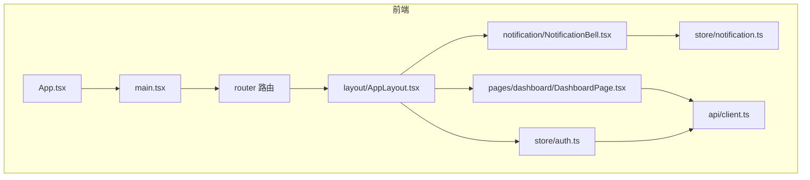
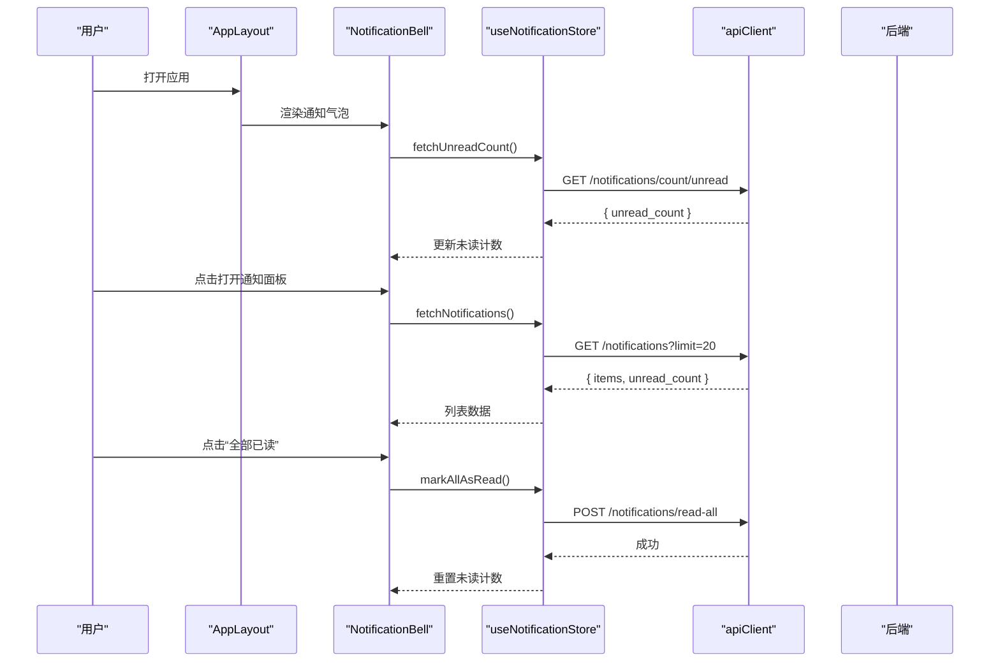
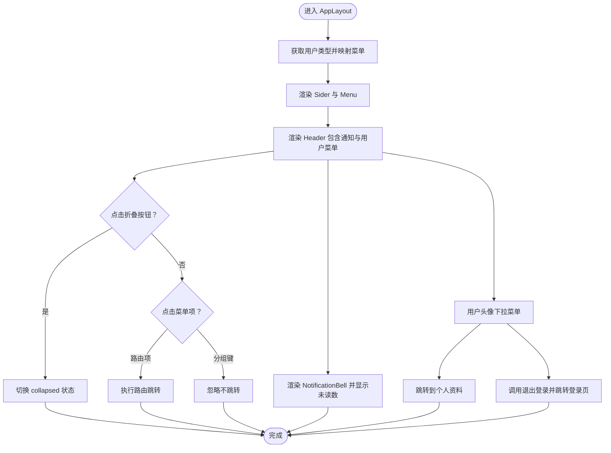
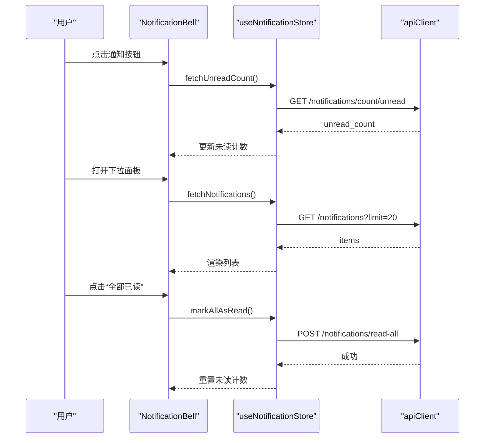
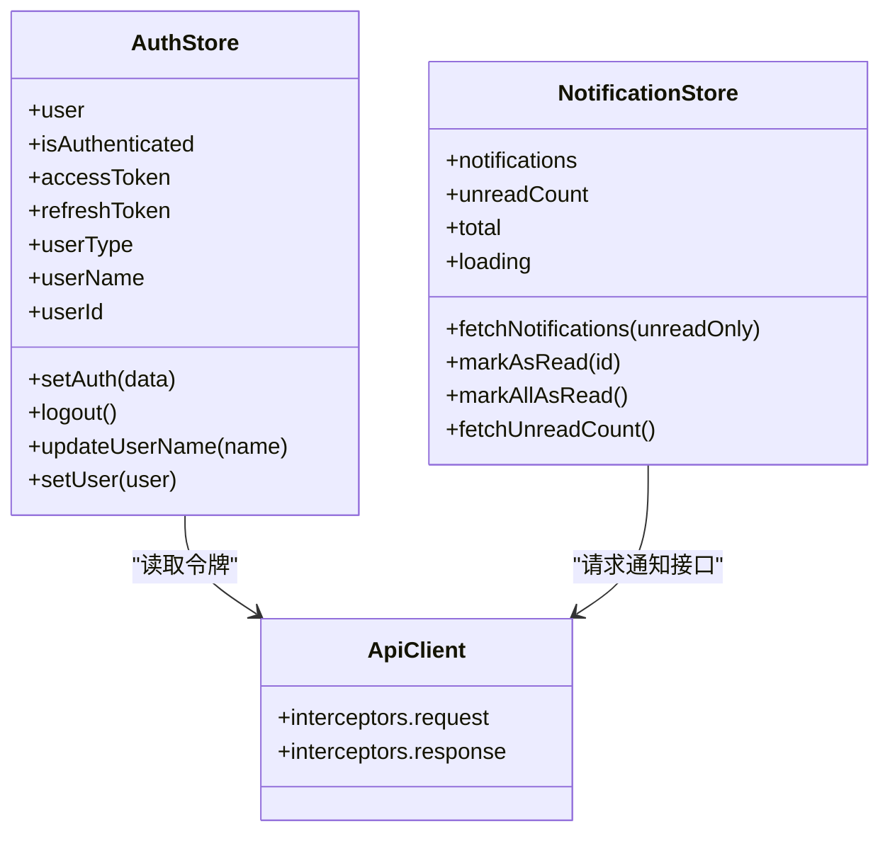
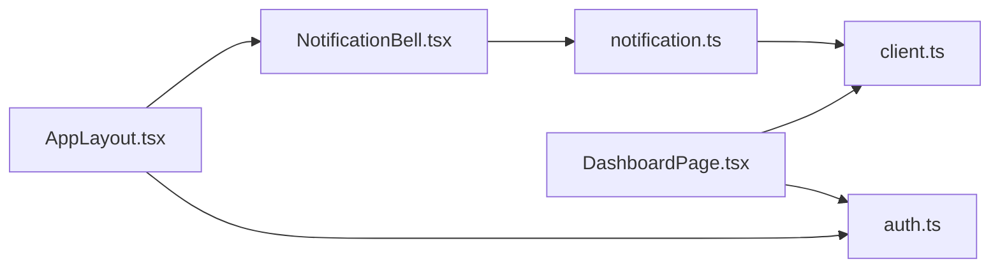

# 组件设计

<cite>
**本文引用的文件**
- [AppLayout.tsx](file://frontend/src/components/layout/AppLayout.tsx)
- [NotificationBell.tsx](file://frontend/src/components/notification/NotificationBell.tsx)
- [notification.ts](file://frontend/src/store/notification.ts)
- [auth.ts](file://frontend/src/store/auth.ts)
- [client.ts](file://frontend/src/api/client.ts)
- [DashboardPage.tsx](file://frontend/src/pages/dashboard/DashboardPage.tsx)
- [App.tsx](file://frontend/src/App.tsx)
- [main.tsx](file://frontend/src/main.tsx)
- [package.json](file://frontend/package.json)
- [vite.config.ts](file://frontend/vite.config.ts)
- [eslint.config.js](file://frontend/eslint.config.js)
- [tsconfig.json](file://frontend/tsconfig.json)
</cite>

## 目录
1. [引言](#引言)
2. [项目结构](#项目结构)
3. [核心组件](#核心组件)
4. [架构总览](#架构总览)
5. [组件详解](#组件详解)
6. [依赖关系分析](#依赖关系分析)
7. [性能考量](#性能考量)
8. [故障排查指南](#故障排查指南)
9. [结论](#结论)
10. [附录](#附录)

## 引言
本设计文档聚焦于瑞珹教育管理系统前端的组件设计与实现，围绕基于 Ant Design 的设计系统应用、组件层次结构与复用模式展开。重点覆盖布局组件 AppLayout 的设计理念、通知组件 NotificationBell 的实现与交互流程、以及自定义组件开发规范。同时，文档涵盖组件属性设计、事件处理模式、样式管理与主题定制、组件测试策略、可访问性支持与响应式设计，并提供组件开发最佳实践与设计系统使用指南。

## 项目结构
前端采用按功能域划分的目录组织方式：components 提供可复用的 UI 组件；pages 定义页面级视图；store 管理全局状态；api 封装请求客户端；router 配置路由。Ant Design 作为基础 UI 库，结合 React Router 实现页面导航与布局。

图表来源
- [App.tsx:1-6](file://frontend/src/App.tsx#L1-L6)
- [main.tsx:1-10](file://frontend/src/main.tsx#L1-L10)
- [AppLayout.tsx:1-166](file://frontend/src/components/layout/AppLayout.tsx#L1-L166)
- [NotificationBell.tsx:1-117](file://frontend/src/components/notification/NotificationBell.tsx#L1-L117)
- [notification.ts:1-80](file://frontend/src/store/notification.ts#L1-L80)
- [auth.ts:1-96](file://frontend/src/store/auth.ts#L1-L96)
- [client.ts:1-55](file://frontend/src/api/client.ts#L1-L55)
- [DashboardPage.tsx:1-580](file://frontend/src/pages/dashboard/DashboardPage.tsx#L1-L580)

章节来源
- [package.json:1-38](file://frontend/package.json#L1-L38)
- [vite.config.ts:1-17](file://frontend/vite.config.ts#L1-L17)
- [tsconfig.json:1-8](file://frontend/tsconfig.json#L1-L8)

## 核心组件
- 布局组件 AppLayout：负责整体页面骨架、侧边菜单、头部工具栏与内容区渲染，集成通知气泡与用户下拉菜单，使用 Ant Design Layout、Menu、Dropdown、Avatar 等组件。
- 通知组件 NotificationBell：封装通知列表、未读计数、标记已读、定时刷新等能力，使用 Badge、List、Dropdown、Tag、Typography 等组件。
- 状态管理：useNotificationStore 与 useAuthStore 分别管理通知与认证状态，统一通过 apiClient 发起请求。
- 页面示例：DashboardPage 展示了不同角色下的仪表盘视图与响应式布局。

章节来源
- [AppLayout.tsx:67-166](file://frontend/src/components/layout/AppLayout.tsx#L67-L166)
- [NotificationBell.tsx:17-117](file://frontend/src/components/notification/NotificationBell.tsx#L17-L117)
- [notification.ts:26-80](file://frontend/src/store/notification.ts#L26-L80)
- [auth.ts:47-96](file://frontend/src/store/auth.ts#L47-L96)
- [DashboardPage.tsx:14-580](file://frontend/src/pages/dashboard/DashboardPage.tsx#L14-L580)

## 架构总览
系统采用“页面容器 + 布局组件 + 业务组件 + 状态管理 + 请求客户端”的分层架构。AppLayout 作为根布局，内部嵌套 Outlet 渲染具体页面；NotificationBell 作为头部工具之一，通过 store 与 apiClient 进行数据交互；DashboardPage 等页面根据用户角色动态加载数据并渲染。

图表来源
- [AppLayout.tsx:106-164](file://frontend/src/components/layout/AppLayout.tsx#L106-L164)
- [NotificationBell.tsx:17-117](file://frontend/src/components/notification/NotificationBell.tsx#L17-L117)
- [notification.ts:32-78](file://frontend/src/store/notification.ts#L32-L78)
- [client.ts:3-52](file://frontend/src/api/client.ts#L3-L52)

## 组件详解

### AppLayout 设计与实现
- 角色菜单映射：根据用户类型（STUDENT/TEACHER/QUESTION_ADMIN/SYS_ADMIN/ADMIN）动态选择菜单项，支持分组菜单与子项展开。
- 侧边栏与头部：侧边栏支持折叠，头部包含折叠按钮、通知气泡与用户下拉菜单；使用 Ant Design 主题 token 控制背景与边框颜色。
- 导航行为：菜单点击仅对路由路径生效，避免误触发分组键；用户下拉菜单支持跳转到个人资料与退出登录。
- 通知集成：在头部右侧集成 NotificationBell，实现未读计数联动更新。

图表来源
- [AppLayout.tsx:67-166](file://frontend/src/components/layout/AppLayout.tsx#L67-L166)

章节来源
- [AppLayout.tsx:24-65](file://frontend/src/components/layout/AppLayout.tsx#L24-L65)
- [AppLayout.tsx:67-166](file://frontend/src/components/layout/AppLayout.tsx#L67-L166)

### NotificationBell 实现与交互
- 数据流：通过 useNotificationStore 获取通知列表与未读计数；首次打开面板时拉取通知；定时轮询未读计数；点击“全部已读”或单项“已读”后同步更新。
- 类型映射：根据通知类型映射颜色与标签，便于区分不同业务场景。
- 交互细节：面板宽度固定、最大高度与滚动条；未读项高亮；空态展示“暂无通知”。

图表来源
- [NotificationBell.tsx:17-117](file://frontend/src/components/notification/NotificationBell.tsx#L17-L117)
- [notification.ts:32-78](file://frontend/src/store/notification.ts#L32-L78)
- [client.ts:3-52](file://frontend/src/api/client.ts#L3-L52)

章节来源
- [NotificationBell.tsx:8-15](file://frontend/src/components/notification/NotificationBell.tsx#L8-L15)
- [NotificationBell.tsx:17-117](file://frontend/src/components/notification/NotificationBell.tsx#L17-L117)
- [notification.ts:26-80](file://frontend/src/store/notification.ts#L26-L80)

### 状态管理与请求客户端
- 认证状态：useAuthStore 管理用户信息、令牌与登录状态，提供 setAuth、logout、updateUserName 等方法，并持久化到本地存储。
- 通知状态：useNotificationStore 管理通知列表、未读计数与加载状态，提供 fetchNotifications、markAsRead、markAllAsRead、fetchUnreadCount。
- 请求客户端：apiClient 统一设置 baseURL、注入 Authorization 头；拦截器自动解包后端返回的 {code,message,data} 结构；401 时尝试刷新令牌并重试请求。

图表来源
- [auth.ts:47-96](file://frontend/src/store/auth.ts#L47-L96)
- [notification.ts:26-80](file://frontend/src/store/notification.ts#L26-L80)
- [client.ts:4-52](file://frontend/src/api/client.ts#L4-L52)

章节来源
- [auth.ts:1-96](file://frontend/src/store/auth.ts#L1-L96)
- [notification.ts:1-80](file://frontend/src/store/notification.ts#L1-L80)
- [client.ts:1-55](file://frontend/src/api/client.ts#L1-L55)

### 页面级组件示例：DashboardPage
- 角色驱动：根据用户类型渲染不同的仪表盘卡片与表格，使用 Ant Design 的 Card、Statistic、Table、Tag、Row/Col 等组件。
- 响应式布局：利用 Row/Col 的栅格断点（xs/sm/md/lg）适配不同屏幕尺寸。
- 动态数据：通过 apiClient 获取统计数据并在加载完成后渲染，错误兜底与加载指示完善。

章节来源
- [DashboardPage.tsx:14-580](file://frontend/src/pages/dashboard/DashboardPage.tsx#L14-L580)

## 依赖关系分析
- 组件依赖：AppLayout 依赖 Ant Design 组件与 NotificationBell；NotificationBell 依赖 Ant Design 组件与 useNotificationStore；DashboardPage 依赖 Ant Design 组件与 apiClient。
- 状态依赖：NotificationBell 与 DashboardPage 通过 useNotificationStore 与 apiClient 进行数据交互；AppLayout 通过 useAuthStore 获取用户信息。
- 构建与开发：Vite 提供开发服务器与代理；ESLint 与 TypeScript 提供代码质量保障。

图表来源
- [AppLayout.tsx:19-20](file://frontend/src/components/layout/AppLayout.tsx#L19-L20)
- [NotificationBell.tsx:4](file://frontend/src/components/notification/NotificationBell.tsx#L4)
- [notification.ts:2](file://frontend/src/store/notification.ts#L2)
- [auth.ts:1](file://frontend/src/store/auth.ts#L1)
- [client.ts:2](file://frontend/src/api/client.ts#L2)
- [DashboardPage.tsx:8-10](file://frontend/src/pages/dashboard/DashboardPage.tsx#L8-L10)

章节来源
- [package.json:12-21](file://frontend/package.json#L12-L21)
- [vite.config.ts:4-16](file://frontend/vite.config.ts#L4-L16)
- [eslint.config.js:8-22](file://frontend/eslint.config.js#L8-L22)
- [tsconfig.json:1-8](file://frontend/tsconfig.json#L1-L8)

## 性能考量
- 组件懒加载：页面级组件建议按需加载，减少首屏体积。
- 列表虚拟化：通知列表与表格在数据量较大时可考虑虚拟化以降低 DOM 节点数量。
- 缓存策略：apiClient 可引入缓存策略（如按查询参数缓存）减少重复请求。
- 主题与样式：使用 Ant Design 主题 token 控制颜色与间距，避免内联样式散落，提升维护性与性能。
- 事件节流：通知面板打开时的定时刷新可使用节流/防抖，避免频繁请求。

## 故障排查指南
- 未读计数不更新：检查 NotificationBell 是否在打开面板时触发 fetchNotifications；确认 useNotificationStore.fetchUnreadCount 是否成功更新。
- 无法标记已读：检查 markAsRead/markAllAsRead 的请求是否成功；确认 apiClient 响应拦截器未对返回结构进行二次包裹导致异常。
- 登录态失效：确认 apiClient 的 401 刷新逻辑是否正常工作；检查本地存储中的令牌是否被清理。
- 菜单跳转无效：确认菜单项 key 以“/”开头才会触发路由跳转；分组键不会触发导航。

章节来源
- [NotificationBell.tsx:29-39](file://frontend/src/components/notification/NotificationBell.tsx#L29-L39)
- [notification.ts:32-78](file://frontend/src/store/notification.ts#L32-L78)
- [client.ts:17-52](file://frontend/src/api/client.ts#L17-L52)
- [AppLayout.tsx:83-88](file://frontend/src/components/layout/AppLayout.tsx#L83-L88)

## 结论
本设计文档梳理了基于 Ant Design 的组件体系在瑞珹教育管理系统中的应用方式，明确了 AppLayout 与 NotificationBell 的职责边界与协作关系，给出了状态管理与请求客户端的最佳实践。通过角色驱动的菜单与仪表盘、响应式布局与主题定制，系统实现了良好的可扩展性与可维护性。后续可在性能优化、可访问性与测试策略方面进一步完善。

## 附录

### 组件属性设计与事件处理模式
- AppLayout
  - 属性：无外部 props，通过路由与 store 内部状态控制。
  - 事件：handleMenuClick、handleUserMenuClick、handleLogout。
- NotificationBell
  - 属性：无外部 props，内部通过 store 管理状态。
  - 事件：onOpenChange、onClick（单项标记已读）、全量标记已读。

章节来源
- [AppLayout.tsx:67-104](file://frontend/src/components/layout/AppLayout.tsx#L67-L104)
- [NotificationBell.tsx:17-117](file://frontend/src/components/notification/NotificationBell.tsx#L17-L117)

### 样式管理与主题定制
- 使用 Ant Design 主题 token 控制颜色与边框，确保一致的视觉风格。
- 避免在组件内硬编码样式，优先通过 token 与组件属性调整。
- 在需要时引入 CSS-in-JS 工具（如 @ant-design/cssinjs）以支持动态主题切换。

章节来源
- [AppLayout.tsx:72-73](file://frontend/src/components/layout/AppLayout.tsx#L72-L73)
- [NotificationBell.tsx:51-101](file://frontend/src/components/notification/NotificationBell.tsx#L51-L101)

### 可访问性支持
- 为按钮与菜单项提供明确的文本标签与图标描述。
- 使用语义化标签与键盘导航支持，确保可访问性。
- 对空态与加载态提供可读的提示文案。

### 响应式设计实现
- 使用 Ant Design 的 Grid（Row/Col）与断点（xs/sm/md/lg）实现自适应布局。
- 表格与卡片在小屏设备上合理缩放与换行，保证阅读体验。

章节来源
- [DashboardPage.tsx:86-143](file://frontend/src/pages/dashboard/DashboardPage.tsx#L86-L143)
- [DashboardPage.tsx:151-301](file://frontend/src/pages/dashboard/DashboardPage.tsx#L151-L301)
- [DashboardPage.tsx:335-430](file://frontend/src/pages/dashboard/DashboardPage.tsx#L335-L430)
- [DashboardPage.tsx:433-576](file://frontend/src/pages/dashboard/DashboardPage.tsx#L433-L576)

### 组件测试策略
- 单元测试：针对 NotificationBell 的状态更新与交互逻辑进行单元测试；对 useNotificationStore 的异步方法进行 mock 测试。
- 集成测试：验证 AppLayout 与 NotificationBell 的组合行为，确保菜单跳转与通知面板联动正常。
- 端到端测试：覆盖关键用户路径（登录、查看仪表盘、查看通知、标记已读），确保跨组件协作稳定。

章节来源
- [eslint.config.js:8-22](file://frontend/eslint.config.js#L8-L22)
- [tsconfig.json:1-8](file://frontend/tsconfig.json#L1-L8)

### 设计系统使用指南
- 统一使用 Ant Design 组件与图标，保持视觉一致性。
- 通过主题 token 与 CSS-in-JS 管理样式变量，避免样式碎片化。
- 自定义组件遵循现有命名与结构约定，优先复用现有组件与 store。